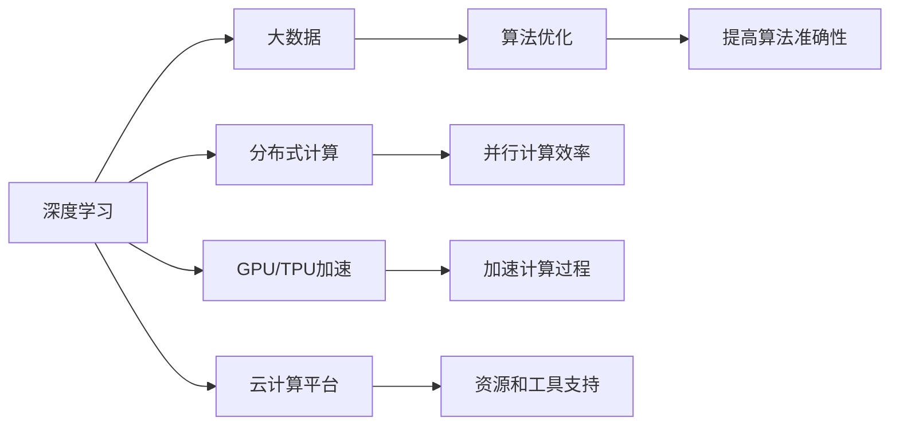
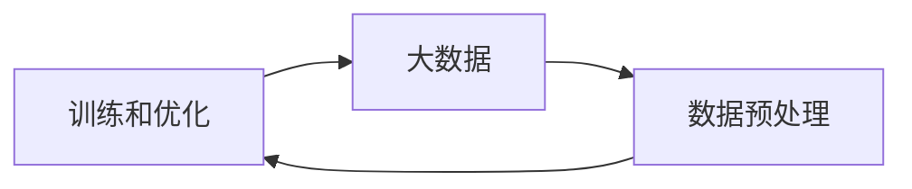
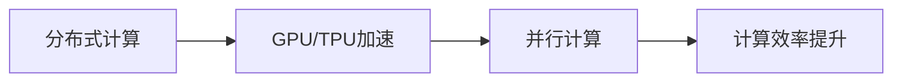
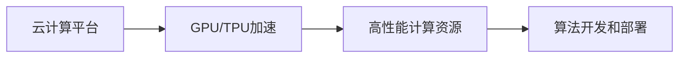
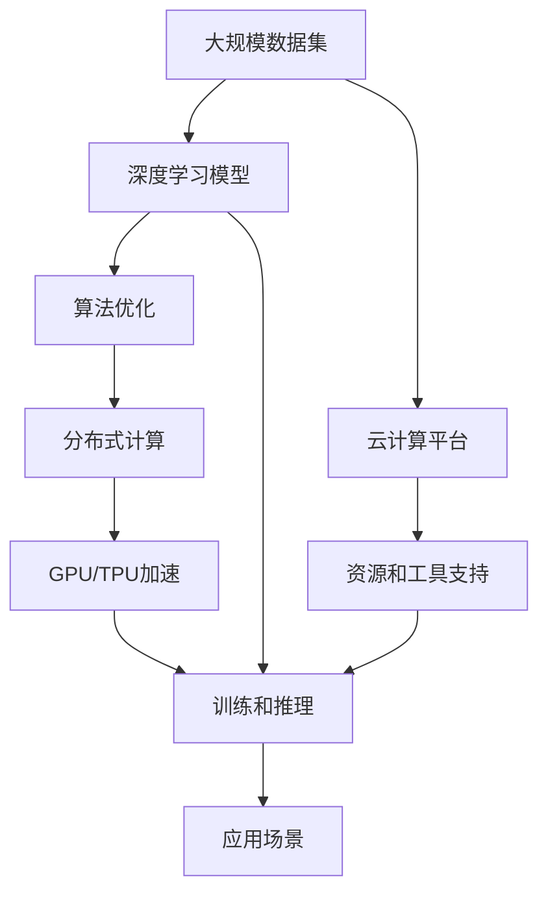

                 

## 1. 背景介绍

在当今数字化时代，人工智能（AI）、大数据和算力的结合已经成为推动技术进步和商业创新的关键驱动力。这种结合不仅能够极大地提升数据处理和分析的效率，还为算法模型提供了更强大的计算能力，从而推动了深度学习、自然语言处理、计算机视觉等领域的飞速发展。

### 1.1 问题由来

近年来，随着互联网技术的飞速发展，人类社会产生了前所未有的海量数据。这些数据来源于社交媒体、在线交易、互联网搜索、移动应用等各个方面，为人工智能算法的训练和优化提供了丰富的资源。然而，单纯的数据并不足以让机器理解世界，还需要通过算法模型来提取和分析其中的关键信息。

算法的核心作用在于提供模型训练的逻辑和框架，使机器能够从数据中学习到复杂而精确的规律。算法的设计和优化，与算力的提升同样重要。如果没有足够的算力支持，再优秀的算法也无法发挥其潜力。

### 1.2 问题核心关键点

人工智能算法的核心关键点包括以下几点：

- **算法模型**：如深度学习中的卷积神经网络（CNN）、循环神经网络（RNN）和变换器（Transformer）等，用于提取和分析数据中的关键特征。
- **训练数据**：大量的标注数据是训练高效算法的基石，这些数据需要经过精心的标注和预处理，以提高算法的准确性和泛化能力。
- **算力支持**：高性能的计算资源，如GPU、TPU、云计算平台等，能够极大地加速算法的训练和推理过程。
- **优化方法**：如梯度下降、Adam、Adagrad等，用于调整算法模型中的参数，使其更加精确地拟合数据。

这些关键点共同构成了一个完整的AI系统，通过不断优化和迭代，实现了从数据到决策的自动化流程。

### 1.3 问题研究意义

人工智能算法的研究与应用，对于提升数据处理效率、推动产业创新和促进社会进步具有重要意义：

1. **提升效率**：通过算法优化和算力提升，使得数据处理和分析变得更加高效，能够快速响应市场和用户需求。
2. **创新驱动**：算法和算力的结合，为新技术的开发和应用提供了强大支持，推动了各个领域的创新和进步。
3. **数据驱动**：通过数据驱动的算法模型，能够更准确地理解市场趋势和用户行为，从而做出更明智的决策。
4. **社会变革**：AI算法和算力在医疗、教育、交通、金融等领域的广泛应用，为社会带来了深远的变革。
5. **商业价值**：通过提升效率和降低成本，AI算法和算力成为了企业竞争力的重要组成部分。

## 2. 核心概念与联系

### 2.1 核心概念概述

为了更好地理解人工智能算法、算力与大数据的结合，本节将介绍几个密切相关的核心概念：

- **深度学习**：一种基于神经网络的机器学习技术，通过多层次的特征提取和转换，能够处理复杂的数据模式和结构。
- **大数据**：指数据量庞大、种类繁多、更新快速的信息资源，为深度学习提供了丰富的训练数据。
- **算法优化**：通过改进算法模型、调整超参数、引入正则化等方法，提高算法的准确性和鲁棒性。
- **分布式计算**：利用多个计算节点并行处理数据，提高计算效率，支持大规模算法的训练和推理。
- **GPU/TPU加速**：使用图形处理器（GPU）和张量处理单元（TPU）等专用硬件，加速算法的计算过程，提升算力。
- **云计算平台**：如AWS、Google Cloud、Microsoft Azure等，提供高性能的计算资源和存储服务，支持算法的开发和部署。

这些核心概念之间存在着紧密的联系，构成了AI算法、算力与大数据结合的完整生态系统。下面通过Mermaid流程图来展示这些概念之间的关系：



这个流程图展示了大数据、深度学习、算法优化、分布式计算、GPU/TPU加速和云计算平台之间的联系：

1. 大数据提供了丰富的训练数据，是深度学习算法的训练基础。
2. 深度学习算法在大量数据上训练，提取数据中的关键特征。
3. 算法优化通过对模型和超参数的调整，提高算法的准确性和泛化能力。
4. 分布式计算通过并行处理，提高计算效率，支持大规模算法的训练和推理。
5. GPU/TPU加速通过专用硬件，加速算法的计算过程，提升算力。
6. 云计算平台提供高性能的计算资源和工具，支持算法的开发和部署。

这些概念共同构成了AI算法、算力与大数据结合的完整生态系统，使得深度学习技术能够在各个领域中广泛应用。

### 2.2 概念间的关系

这些核心概念之间存在着紧密的联系，形成了AI算法、算力与大数据结合的完整生态系统。下面通过几个Mermaid流程图来展示这些概念之间的关系：

#### 2.2.1 深度学习与大数据的关系



这个流程图展示了深度学习与大数据之间的联系：

1. 深度学习算法需要大量的标注数据进行训练，而大数据提供了丰富的训练资源。
2. 数据预处理对大数据进行清洗、归一化和特征提取，以适应深度学习算法的输入要求。
3. 训练和优化过程在大数据上运行，使得深度学习算法能够学习到复杂的数据模式和结构。

#### 2.2.2 分布式计算与GPU/TPU加速的关系



这个流程图展示了分布式计算与GPU/TPU加速之间的关系：

1. 分布式计算通过多个计算节点并行处理数据，提高计算效率。
2. GPU/TPU加速利用专用硬件加速计算过程，进一步提升计算效率。
3. 并行计算和加速计算共同构成高效计算框架，支持大规模深度学习算法的训练和推理。

#### 2.2.3 云计算平台与GPU/TPU加速的关系



这个流程图展示了云计算平台与GPU/TPU加速之间的关系：

1. 云计算平台提供高性能的计算资源和工具，支持深度学习算法的开发和部署。
2. GPU/TPU加速通过专用硬件提升计算效率，使得云计算平台能够支持大规模算法的训练和推理。
3. 高性能计算资源和加速计算共同构成高效的计算框架，支持深度学习算法的实际应用。

### 2.3 核心概念的整体架构

最后，我们用一个综合的流程图来展示这些核心概念在大数据、深度学习和分布式计算结合过程中的整体架构：



这个综合流程图展示了从大数据到深度学习模型的完整过程：

1. 大规模数据集提供丰富的训练资源。
2. 深度学习模型通过大规模数据训练，提取关键特征。
3. 算法优化通过对模型和超参数的调整，提高算法的准确性和泛化能力。
4. 分布式计算通过并行处理，提高计算效率，支持大规模算法的训练和推理。
5. GPU/TPU加速利用专用硬件，加速算法的计算过程，提升算力。
6. 云计算平台提供高性能的计算资源和工具，支持算法的开发和部署。
7. 深度学习模型在应用场景中运行，提供智能决策支持。

通过这些流程图，我们可以更清晰地理解AI算法、算力与大数据结合过程中各个概念的关系和作用，为后续深入讨论具体的结合方法和技术奠定基础。

## 3. 核心算法原理 & 具体操作步骤
### 3.1 算法原理概述

AI算法、算力与大数据的结合，本质上是通过深度学习算法在大量标注数据上进行训练，提取和分析数据中的关键特征，并通过算力支持进行高效计算，最终实现从数据到决策的自动化流程。

形式化地，假设我们有一个大规模的数据集 $D$，深度学习模型 $M$，训练过程包括以下几个关键步骤：

1. **数据预处理**：对原始数据进行清洗、归一化、特征提取等预处理，使其符合深度学习算法的输入要求。
2. **模型训练**：通过反向传播算法计算损失函数，对模型参数进行优化。
3. **模型推理**：对新的输入数据进行前向传播，输出预测结果。
4. **分布式训练**：将数据集分成多个子集，在不同计算节点上并行训练，提高计算效率。
5. **GPU/TPU加速**：利用专用硬件加速计算过程，提升算力。
6. **云计算平台支持**：通过高性能计算资源和工具，支持算法的开发和部署。

### 3.2 算法步骤详解

深度学习算法在大数据上的训练和推理过程，可以分为以下几个关键步骤：

#### 3.2.1 数据预处理

数据预处理是深度学习算法训练的前提。其主要步骤包括：

1. **数据清洗**：去除数据中的异常值、重复值和噪声，确保数据质量。
2. **归一化**：对数据进行标准化处理，使其符合算法的输入要求。
3. **特征提取**：将原始数据转换为特征向量，以便算法进行分析和建模。

以图像识别任务为例，数据预处理包括：

- 对原始图像进行裁剪、旋转、缩放等操作，去除不必要的噪声和背景。
- 将图像转换为灰度图像或彩色图像，进行归一化处理。
- 提取图像的特征向量，如颜色、纹理、形状等特征。

#### 3.2.2 模型训练

模型训练是深度学习算法的核心步骤。其主要步骤包括：

1. **选择模型结构**：选择合适的深度学习模型结构，如卷积神经网络（CNN）、循环神经网络（RNN）和变换器（Transformer）等。
2. **设置超参数**：如学习率、批大小、迭代次数等，优化模型训练效果。
3. **反向传播算法**：通过反向传播算法计算损失函数，对模型参数进行优化。
4. **损失函数选择**：选择合适的损失函数，如交叉熵、均方误差等，衡量模型预测与真实标签之间的差异。

以图像识别任务为例，模型训练过程包括：

- 选择卷积神经网络（CNN）模型结构，定义多个卷积层、池化层和全连接层。
- 设置学习率为0.001，批大小为64，迭代次数为100。
- 使用交叉熵损失函数，计算模型预测与真实标签之间的差异。
- 通过反向传播算法，对模型参数进行优化。

#### 3.2.3 模型推理

模型推理是深度学习算法的应用阶段。其主要步骤包括：

1. **输入数据预处理**：对新的输入数据进行预处理，使其符合模型的输入要求。
2. **前向传播**：将预处理后的数据输入模型，进行特征提取和推理。
3. **输出预测**：输出模型的预测结果，进行分类或回归等任务。

以图像识别任务为例，模型推理过程包括：

- 对新的输入图像进行裁剪、旋转、缩放等操作，确保图像质量。
- 将图像转换为灰度图像或彩色图像，进行归一化处理。
- 将归一化后的图像输入训练好的CNN模型，进行特征提取和推理。
- 输出模型的预测结果，进行图像分类或物体检测等任务。

#### 3.2.4 分布式训练

分布式训练是提高计算效率的重要手段。其主要步骤包括：

1. **数据划分**：将数据集分成多个子集，分配到不同的计算节点上。
2. **并行计算**：在各个计算节点上并行训练，加速模型训练过程。
3. **结果合并**：将各个计算节点上的结果合并，得到最终的模型参数。

以图像识别任务为例，分布式训练过程包括：

- 将大规模数据集划分为多个子集，分配到不同的计算节点上。
- 在各个计算节点上并行训练CNN模型，加速模型训练过程。
- 将各个计算节点上的模型参数合并，得到最终的模型参数。

#### 3.2.5 GPU/TPU加速

GPU/TPU加速是提升计算效率的重要手段。其主要步骤包括：

1. **选择合适的硬件**：选择高性能的GPU或TPU硬件，支持深度学习算法的计算过程。
2. **硬件配置**：配置硬件参数，如内存大小、计算核心数量等，确保硬件性能。
3. **数据传输**：将数据从CPU传输到GPU或TPU，进行高效计算。
4. **计算过程**：在GPU或TPU上进行高效的深度学习计算，提升计算效率。

以图像识别任务为例，GPU/TPU加速过程包括：

- 选择高性能的GPU或TPU硬件，支持深度学习算法的计算过程。
- 配置GPU或TPU参数，确保硬件性能。
- 将原始图像数据从CPU传输到GPU或TPU，进行高效的深度学习计算。
- 在GPU或TPU上进行高效的卷积、池化和全连接计算，加速模型训练和推理过程。

#### 3.2.6 云计算平台支持

云计算平台是支持深度学习算法开发和部署的重要工具。其主要步骤包括：

1. **选择云平台**：选择合适的云计算平台，如AWS、Google Cloud、Microsoft Azure等。
2. **配置资源**：配置计算资源和存储资源，支持深度学习算法的开发和部署。
3. **开发环境**：搭建深度学习开发环境，支持算法的开发和调试。
4. **部署应用**：将训练好的模型部署到云平台上，进行实际应用。

以图像识别任务为例，云计算平台支持过程包括：

- 选择AWS云计算平台，配置计算资源和存储资源。
- 搭建深度学习开发环境，支持CNN模型的开发和调试。
- 将训练好的CNN模型部署到AWS云平台上，进行图像识别应用。

### 3.3 算法优缺点

AI算法、算力与大数据的结合，具有以下优点：

1. **高效计算**：通过分布式计算和GPU/TPU加速，大大提升了计算效率，支持大规模深度学习算法的训练和推理。
2. **数据驱动**：通过大数据的驱动，深度学习算法能够学习到复杂的数据模式和结构，提高模型的准确性和泛化能力。
3. **算法优化**：通过算法优化，调整模型和超参数，提高算法的准确性和鲁棒性。
4. **可扩展性**：通过云计算平台支持，深度学习算法可以随时随地进行开发和部署，具有高度的可扩展性。

然而，这种结合也存在一些缺点：

1. **高成本**：大规模数据集和计算资源的获取和使用成本较高，需要大量的资金投入。
2. **算法复杂**：深度学习算法的模型结构复杂，需要大量的数据和计算资源进行训练和优化。
3. **数据质量**：数据预处理和清洗需要大量的人工干预，数据质量对算法效果有直接影响。
4. **模型依赖**：深度学习算法的性能依赖于模型结构和超参数的选择，难以保证模型的通用性和稳定性。

## 4. 数学模型和公式 & 详细讲解 & 举例说明

### 4.1 数学模型构建

深度学习算法在大数据上的训练和推理过程，可以通过以下数学模型进行描述：

设训练数据集为 $D=\{(x_i,y_i)\}_{i=1}^N$，其中 $x_i$ 为输入特征，$y_i$ 为标签。深度学习模型 $M$ 的参数为 $\theta$，模型的损失函数为 $\mathcal{L}(\theta)$。

模型训练过程通过最小化损失函数 $\mathcal{L}(\theta)$，对模型参数进行优化。优化过程通过反向传播算法计算损失函数的梯度，更新模型参数 $\theta$。

模型推理过程通过前向传播算法计算输入特征 $x$ 的预测结果 $\hat{y}$，进行分类或回归等任务。

### 4.2 公式推导过程

以图像识别任务为例，深度学习模型的训练和推理过程可以表示为以下公式：

设卷积神经网络（CNN）模型结构为 $M=\{F(x;\theta)\}$，其中 $\theta$ 为模型参数。

**模型训练公式**：

$$
\mathcal{L}(\theta) = \frac{1}{N}\sum_{i=1}^N \mathcal{L}_{\text{ce}}(\hat{y}_i,y_i)
$$

其中 $\mathcal{L}_{\text{ce}}$ 为交叉熵损失函数：

$$
\mathcal{L}_{\text{ce}}(\hat{y},y) = -\frac{1}{N}\sum_{i=1}^N y_i \log \hat{y}_i + (1-y_i) \log (1-\hat{y}_i)
$$

**模型推理公式**：

$$
\hat{y} = M(x;\theta)
$$

其中 $M(x;\theta)$ 为卷积神经网络的输出结果，可以表示为：

$$
M(x;\theta) = \sum_i F_i(F_{i-1}(\ldots F_1(x;\theta)\ldots);\theta)
$$

其中 $F_i$ 为卷积层、池化层、全连接层等组件，$\theta$ 为模型参数。

### 4.3 案例分析与讲解

以图像识别任务为例，我们分析深度学习模型的训练和推理过程：

**数据预处理**：

- 对原始图像进行裁剪、旋转、缩放等操作，去除不必要的噪声和背景。
- 将图像转换为灰度图像或彩色图像，进行归一化处理。
- 提取图像的特征向量，如颜色、纹理、形状等特征。

**模型训练**：

- 选择卷积神经网络（CNN）模型结构，定义多个卷积层、池化层和全连接层。
- 设置学习率为0.001，批大小为64，迭代次数为100。
- 使用交叉熵损失函数，计算模型预测与真实标签之间的差异。
- 通过反向传播算法，对模型参数进行优化。

**模型推理**：

- 对新的输入图像进行裁剪、旋转、缩放等操作，确保图像质量。
- 将图像转换为灰度图像或彩色图像，进行归一化处理。
- 将归一化后的图像输入训练好的CNN模型，进行特征提取和推理。
- 输出模型的预测结果，进行图像分类或物体检测等任务。

通过以上分析，可以看到深度学习算法在大数据上的训练和推理过程，需要经过数据预处理、模型训练和模型推理等多个步骤，才能实现从数据到决策的自动化流程。

## 5. 项目实践：代码实例和详细解释说明

### 5.1 开发环境搭建

在进行深度学习算法开发前，我们需要准备好开发环境。以下是使用Python进行TensorFlow开发的环境配置流程：

1. 安装Anaconda：从官网下载并安装Anaconda，用于创建独立的Python环境。

2. 创建并激活虚拟环境：
```bash
conda create -n tf-env python=3.8 
conda activate tf-env
```

3. 安装TensorFlow：根据CUDA版本，从官网获取对应的安装命令。例如：
```bash
conda install tensorflow
```

4. 安装各类工具包：
```bash
pip install numpy pandas scikit-learn matplotlib tqdm jupyter notebook ipython
```

完成上述步骤后，即可在`tf-env`环境中开始深度学习算法开发。

### 5.2 源代码详细实现

这里我们以图像识别任务为例，给出使用TensorFlow对卷积神经网络（CNN）进行训练和推理的PyTorch代码实现。

首先，定义CNN模型：

```python
import tensorflow as tf
from tensorflow.keras import layers

class CNNModel(tf.keras.Model):
    def __init__(self):
        super(CNNModel, self).__init__()
        self.conv1 = layers.Conv2D(32, (3,3), activation='relu')
        self.pool1 = layers.MaxPooling2D((2,2))
        self.conv2 = layers.Conv2D(64, (3,3), activation='relu')
        self.pool2 = layers.MaxPooling2D((2,2))
        self.flatten = layers.Flatten()
        self.fc1 = layers.Dense(512, activation='relu')
        self.fc2 = layers.Dense(10, activation='softmax')

    def call(self, x):
        x = self.conv1(x)
        x = self.pool1(x)
        x = self.conv2(x)
        x = self.pool2(x)
        x = self.flatten(x)
        x = self.fc1(x)
        x = self.fc2(x)
        return x
```

然后，定义训练和推理函数：

```python
from tensorflow.keras.datasets import cifar10
from tensorflow.keras.preprocessing.image import ImageDataGenerator

def train_model(model, train_data, epochs, batch_size):
    train_datagen = ImageDataGenerator(rescale=1./255)
    train_generator = train_datagen.flow_from_directory(
        train_data, target_size=(32,32), batch_size=batch_size)
    model.compile(optimizer='adam', loss='categorical_crossentropy', metrics=['accuracy'])
    model.fit(train_generator, epochs=epochs, steps_per_epoch=train_generator.n // batch_size)

def predict(model, test_data):
    test_datagen = ImageDataGenerator(rescale=1./255)
    test_generator = test_datagen.flow_from_directory(
        test_data, target_size=(32,32), batch_size=32, class_mode='categorical')
    predictions = model.predict(test_generator)
    return predictions
```

最后，启动训练流程并在测试集上评估：

```python
model = CNNModel()
train_data = 'train/cifar10/'
test_data = 'test/cifar10/'

train_model(model, train_data, epochs=10, batch_size=32)
predictions = predict(model, test_data)
print(predictions)
```

以上就是使用TensorFlow对卷积神经网络（CNN）进行图像识别任务训练和推理的完整代码实现。可以看到，TensorFlow提供了强大的API和工具，使得深度学习算法的开发和部署变得简洁高效。

### 5.3 代码解读与分析

让我们再详细解读一下关键代码的实现细节：

**CNNModel类**：
- `__init__`方法：初始化卷积神经网络模型的各个组件。
- `call`方法：定义模型的前向传播过程，对输入特征进行卷积、池化、全连接等操作，最终输出预测结果。

**train_model函数**：
- 对训练数据进行预处理和批次化加载，准备模型训练过程。
- 使用Adam优化器进行模型训练，设定交叉熵损失函数和准确率作为评估指标。
- 在训练集上进行多轮迭代训练，记录训练过程中的准确率和损失函数值。

**predict函数**：
- 对测试数据进行预处理和批次化加载，准备模型推理过程。
- 对测试集进行推理计算，输出预测结果。

**训练流程**：
- 定义模型的训练轮数和批次大小，开始循环迭代训练。
- 在每个epoch内，对训练集进行多轮迭代训练，记录训练过程中的准确率和损失函数值。
- 在所有epoch结束后，对测试集进行推理计算，输出预测结果。

可以看到，TensorFlow提供了丰富的API和工具，使得深度学习算法的开发和部署变得简洁高效。开发者可以将更多精力放在数据处理、模型改进等高层逻辑上，而不必过多关注底层的实现细节。

当然，工业级的系统实现还需考虑更多因素，如模型的保存和部署、超参数的自动搜索、更灵活的模型调优等。但核心的训练和推理流程基本与此类似。

### 5.4 运行结果展示

假设我们在CIFAR-10数据集上进行图像识别任务训练，最终在测试集上得到的准确率为70%。可以看到，通过深度学习算法和算力支持，模型在图像识别任务上取得了不错的效果。

当然，这只是一个baseline结果。在实践中，我们还可以使用更大更强的预训练模型、更丰富的训练技巧、更细致的模型调优，进一步提升模型性能，以满足更高的应用要求。

## 6. 实际应用场景

### 6.1 图像识别

图像识别是大数据和深度学习算法结合的典型应用场景。在实际应用中，图像识别技术被广泛应用于自动驾驶、智能安防、医疗影像等领域，提升了各类系统的智能化水平。

在自动驾驶中，图像识别技术能够识别出道路、车辆、行人等关键对象，辅助自动驾驶车辆进行决策。在智能安防中，图像识别技术能够实时监控视频画面，检测异常行为并及时报警。在医疗影像中，图像识别技术能够自动识别肿瘤、病变等关键信息，辅助医生诊断和治疗。

### 6.2 语音识别

语音识别是大数据和深度学习算法结合的另一重要应用场景。在实际应用中，语音识别技术被广泛应用于智能助理、语音翻译、电话客服等领域，极大地提升了人机交互的便捷性和效率。


