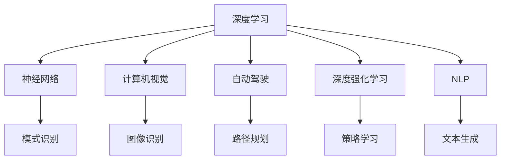
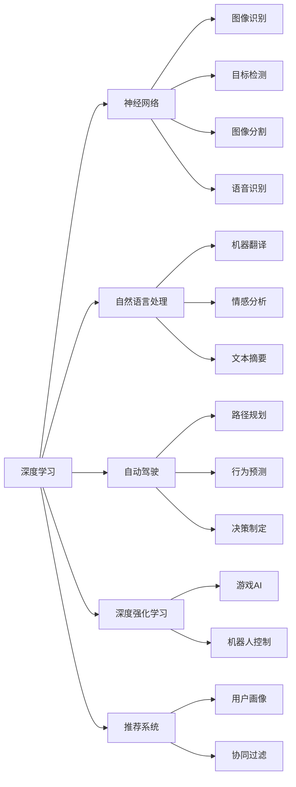

                 

# Andrej Karpathy：人工智能的未来发展机遇

> 关键词：人工智能,深度学习,神经网络,计算机视觉,自动驾驶,深度强化学习,自然语言处理,NLP

## 1. 背景介绍

### 1.1 问题由来
人工智能（AI）已经成为当今科技界最热门的话题之一。随着深度学习技术的不断进步，AI在图像识别、语音识别、自然语言处理、自动驾驶等多个领域取得了突破性进展。在此背景下，Andrej Karpathy这位科技界的天才科学家成为了人们关注的焦点。

Andrej Karpathy是深度学习和计算机视觉领域的知名学者，现任特斯拉AI部门的首席AI科学家，同时也是斯坦福大学教授。他的研究成果涵盖了深度学习、计算机视觉、自动驾驶等多个领域，尤其是在神经网络和深度强化学习方面的贡献，推动了AI技术的发展。

### 1.2 问题核心关键点
Andrej Karpathy的学术成果和工程实践，为人工智能的未来发展提供了宝贵的经验与见解。本文将从Karpathy的研究成果出发，探讨AI在未来发展中的机遇与挑战，为读者提供有深度的技术洞见。

## 2. 核心概念与联系

### 2.1 核心概念概述

为了更好地理解Andrej Karpathy的研究方向和研究成果，本节将介绍几个与其密切相关的核心概念：

- **深度学习（Deep Learning）**：一种利用多层神经网络进行模式识别的机器学习技术。深度学习通过不断增加网络深度和宽度，提高了模型的表达能力和泛化能力。

- **神经网络（Neural Networks）**：深度学习的核心组件，由多个层级组成，每一层由多个神经元构成。神经网络通过反向传播算法进行训练，优化权重参数，从而实现复杂的模式识别。

- **计算机视觉（Computer Vision）**：使用计算机技术，使计算机具备像人类一样识别、理解视觉信息的能力。计算机视觉在图像识别、目标检测、图像分割等方面具有广泛应用。

- **自动驾驶（Autonomous Driving）**：利用AI技术，使汽车具备自主驾驶的能力。自动驾驶需要综合运用图像识别、路径规划、行为预测等多方面的技术。

- **深度强化学习（Deep Reinforcement Learning）**：一种结合了深度学习和强化学习的方法，通过不断试错，学习最优策略。深度强化学习在游戏AI、机器人控制等方面具有重要应用。

- **自然语言处理（Natural Language Processing, NLP）**：使计算机能够理解和生成自然语言的技术。NLP在机器翻译、语音识别、文本生成等方面有广泛应用。

这些核心概念之间存在密切联系，共同构成了人工智能的发展框架。下面，我们将通过Mermaid流程图展示这些概念之间的联系：



### 2.2 概念间的关系

这些核心概念之间的关系可以通过以下Mermaid流程图来展示：



这些核心概念之间的关系为理解和应用人工智能技术提供了清晰的框架。接下来，我们将深入探讨这些概念的原理和应用。

## 3. 核心算法原理 & 具体操作步骤

### 3.1 算法原理概述

Andrej Karpathy的研究方向涵盖深度学习和计算机视觉等多个领域。本节将重点介绍他在这些领域的主要贡献和算法原理。

#### 3.1.1 深度学习
深度学习的核心在于构建多层神经网络，通过反向传播算法进行训练，优化权重参数。其基本原理是通过大量数据进行训练，使得模型能够自动提取特征，并在新的数据上实现高性能预测。

#### 3.1.2 计算机视觉
计算机视觉利用深度学习技术，使计算机能够识别和理解图像和视频。其核心在于图像处理、特征提取和模式识别。Andrej Karpathy在计算机视觉领域的研究成果，包括图像分类、目标检测、图像分割等。

#### 3.1.3 自动驾驶
自动驾驶技术涉及多方面的AI应用，包括计算机视觉、路径规划和行为预测。Andrej Karpathy在自动驾驶领域的贡献，主要集中在环境感知、决策制定和路径规划等方面。

#### 3.1.4 深度强化学习
深度强化学习结合了深度学习和强化学习，通过不断试错，学习最优策略。Andrej Karpathy在深度强化学习领域的研究成果，包括游戏AI、机器人控制等方面。

#### 3.1.5 自然语言处理
自然语言处理是使计算机能够理解和生成自然语言的技术。Andrej Karpathy在NLP领域的研究成果，包括机器翻译、情感分析、文本生成等。

### 3.2 算法步骤详解

本节将详细介绍Andrej Karpathy在各个领域的具体算法步骤。

#### 3.2.1 深度学习
深度学习的核心步骤包括数据预处理、模型构建、训练和评估。具体步骤如下：

1. **数据预处理**：将原始数据转化为模型可处理的格式，包括数据清洗、归一化、分批次等。
2. **模型构建**：设计多层神经网络，包括卷积层、池化层、全连接层等。
3. **训练**：使用反向传播算法，不断更新权重参数，最小化损失函数。
4. **评估**：在测试集上评估模型性能，验证模型泛化能力。

#### 3.2.2 计算机视觉
计算机视觉的核心步骤包括图像处理、特征提取和分类。具体步骤如下：

1. **图像处理**：对图像进行预处理，包括裁剪、旋转、缩放等。
2. **特征提取**：利用卷积神经网络（CNN）提取图像特征。
3. **分类**：通过softmax函数进行多分类预测。

#### 3.2.3 自动驾驶
自动驾驶的核心步骤包括环境感知、决策制定和路径规划。具体步骤如下：

1. **环境感知**：使用摄像头、雷达等传感器，实时获取周围环境信息。
2. **决策制定**：通过深度学习模型，预测周围车辆、行人的行为。
3. **路径规划**：规划最优路径，使车辆在复杂交通环境中安全行驶。

#### 3.2.4 深度强化学习
深度强化学习的核心步骤包括环境建模、策略学习、行为选择。具体步骤如下：

1. **环境建模**：建立环境模型，描述智能体与环境的交互。
2. **策略学习**：通过Q-learning等方法，学习最优策略。
3. **行为选择**：根据当前状态，选择最优行为。

#### 3.2.5 自然语言处理
自然语言处理的核心步骤包括文本预处理、特征提取和分类。具体步骤如下：

1. **文本预处理**：对文本进行清洗、分词、向量化等。
2. **特征提取**：利用RNN、Transformer等模型提取文本特征。
3. **分类**：通过softmax函数进行多分类预测。

### 3.3 算法优缺点

Andrej Karpathy的研究成果在多个领域中都有广泛应用，以下是对其研究成果的优缺点分析。

#### 3.3.1 深度学习
**优点**：
- 能够自动提取特征，适用于复杂模式识别任务。
- 数据量大时，模型性能优越。

**缺点**：
- 需要大量数据进行训练，数据获取成本高。
- 模型复杂，计算资源需求大。

#### 3.3.2 计算机视觉
**优点**：
- 能够处理复杂图像，识别能力强。
- 应用领域广泛，如医疗影像、视频监控等。

**缺点**：
- 对图像质量要求高，光照、角度变化可能影响效果。
- 处理大规模图像数据时，计算资源需求大。

#### 3.3.3 自动驾驶
**优点**：
- 能够实现自动导航，提高驾驶安全。
- 减少人工驾驶疲劳，提高驾驶效率。

**缺点**：
- 技术复杂，技术实现难度大。
- 对环境变化适应能力有待提升。

#### 3.3.4 深度强化学习
**优点**：
- 能够自适应环境变化，学习最优策略。
- 适用于多变量决策问题。

**缺点**：
- 需要大量试错，训练时间长。
- 模型复杂，训练难度大。

#### 3.3.5 自然语言处理
**优点**：
- 能够理解和生成自然语言，提升人机交互体验。
- 应用广泛，如机器翻译、语音识别等。

**缺点**：
- 对语言结构复杂性要求高。
- 处理大规模文本数据时，计算资源需求大。

### 3.4 算法应用领域

Andrej Karpathy的研究成果在多个领域中都有广泛应用，以下是对其主要应用领域的介绍。

#### 3.4.1 深度学习
深度学习在图像识别、语音识别、自然语言处理等领域具有广泛应用。

#### 3.4.2 计算机视觉
计算机视觉在自动驾驶、医疗影像、视频监控等领域具有广泛应用。

#### 3.4.3 自动驾驶
自动驾驶技术在智能交通、物流配送等领域具有广泛应用。

#### 3.4.4 深度强化学习
深度强化学习在游戏AI、机器人控制等领域具有广泛应用。

#### 3.4.5 自然语言处理
自然语言处理在机器翻译、情感分析、文本生成等领域具有广泛应用。

## 4. 数学模型和公式 & 详细讲解 & 举例说明

### 4.1 数学模型构建

Andrej Karpathy的研究成果涉及多个领域，以下将详细介绍其在各个领域中的数学模型构建。

#### 4.1.1 深度学习
深度学习的基本数学模型包括前向传播、反向传播和损失函数。

前向传播通过多层神经网络计算输出，公式如下：
$$
y = f(z) = g(\mathbf{W}_2 f(\mathbf{W}_1 z + \mathbf{b}_1) + \mathbf{b}_2)
$$
其中，$f$为激活函数，$\mathbf{W}_1, \mathbf{W}_2$为权重矩阵，$\mathbf{b}_1, \mathbf{b}_2$为偏置向量，$z$为输入向量。

反向传播算法通过链式法则计算梯度，更新权重参数，公式如下：
$$
\frac{\partial L}{\partial \mathbf{W}} = \frac{\partial L}{\partial y} \frac{\partial y}{\partial z} \frac{\partial z}{\partial \mathbf{W}}
$$
其中，$L$为损失函数，$y$为输出，$z$为前向传播结果。

损失函数通常使用交叉熵损失函数，公式如下：
$$
L = -\frac{1}{N} \sum_{i=1}^N \sum_{j=1}^C y_{ij} \log p_{ij}
$$
其中，$N$为样本数，$C$为类别数，$y_{ij}$为真实标签，$p_{ij}$为模型预测概率。

#### 4.1.2 计算机视觉
计算机视觉中的常见模型包括卷积神经网络（CNN）和循环神经网络（RNN）。

CNN的基本模型包括卷积层、池化层和全连接层，公式如下：
$$
y = f(z) = g(\mathbf{W}_1 f(z) + \mathbf{b}_1) + g(\mathbf{W}_2 f(z) + \mathbf{b}_2) + g(\mathbf{W}_3 f(z) + \mathbf{b}_3)
$$
其中，$f$为激活函数，$\mathbf{W}_1, \mathbf{W}_2, \mathbf{W}_3$为权重矩阵，$\mathbf{b}_1, \mathbf{b}_2, \mathbf{b}_3$为偏置向量，$z$为输入向量。

RNN的基本模型包括循环层和全连接层，公式如下：
$$
h_{t+1} = f(h_t, x_t) = g(\mathbf{W}_x h_t + \mathbf{W}_h x_t + \mathbf{b}_x)
$$
其中，$h$为隐藏状态，$\mathbf{W}_x, \mathbf{W}_h, \mathbf{b}_x$为权重矩阵和偏置向量，$x_t$为输入。

#### 4.1.3 自动驾驶
自动驾驶中的常见模型包括路径规划模型和行为预测模型。

路径规划模型的基本模型包括DQN和PPO，公式如下：
$$
Q(s, a) = r + \gamma \max_{a'} Q(s', a')
$$
其中，$Q(s, a)$为状态-动作价值函数，$r$为奖励，$\gamma$为折扣因子，$s, s'$为状态，$a, a'$为动作。

行为预测模型的基本模型包括LSTM和GRU，公式如下：
$$
h_{t+1} = f(h_t, x_t) = g(\mathbf{W}_x h_t + \mathbf{W}_h x_t + \mathbf{b}_x)
$$
其中，$h$为隐藏状态，$\mathbf{W}_x, \mathbf{W}_h, \mathbf{b}_x$为权重矩阵和偏置向量，$x_t$为输入。

#### 4.1.4 深度强化学习
深度强化学习中的常见模型包括Q-learning和SARSA。

Q-learning的基本模型包括价值函数和策略函数，公式如下：
$$
Q(s, a) = r + \gamma Q(s', a')
$$
其中，$Q(s, a)$为状态-动作价值函数，$r$为奖励，$\gamma$为折扣因子，$s, s'$为状态，$a, a'$为动作。

SARSA的基本模型包括状态-动作-状态-动作（SASA）算法，公式如下：
$$
Q(s, a) = Q(s, a) + \alpha [r + \gamma Q(s', a') - Q(s, a)]
$$
其中，$Q(s, a)$为状态-动作价值函数，$\alpha$为学习率，$r$为奖励，$s, s'$为状态，$a, a'$为动作。

#### 4.1.5 自然语言处理
自然语言处理中的常见模型包括RNN、Transformer和Attention机制。

RNN的基本模型包括LSTM和GRU，公式如下：
$$
h_{t+1} = f(h_t, x_t) = g(\mathbf{W}_x h_t + \mathbf{W}_h x_t + \mathbf{b}_x)
$$
其中，$h$为隐藏状态，$\mathbf{W}_x, \mathbf{W}_h, \mathbf{b}_x$为权重矩阵和偏置向量，$x_t$为输入。

Transformer的基本模型包括编码器-解码器架构和多头注意力机制，公式如下：
$$
y = f(z) = g(\mathbf{W}_q z) + g(\mathbf{W}_k z) + g(\mathbf{W}_v z)
$$
其中，$z$为输入向量，$\mathbf{W}_q, \mathbf{W}_k, \mathbf{W}_v$为权重矩阵，$g$为多头注意力机制。

Attention机制的基本模型包括Softmax函数和点积运算，公式如下：
$$
a_{ij} = \frac{\exp(x_i^T \mathbf{W} x_j)}{\sum_{k=1}^K \exp(x_i^T \mathbf{W} x_k)}
$$
其中，$a_{ij}$为注意力权重，$x_i$为输入向量，$K$为注意力头数，$\mathbf{W}$为权重矩阵。

### 4.2 公式推导过程

Andrej Karpathy的研究成果涵盖了多个领域，以下将详细介绍他在各个领域中的公式推导过程。

#### 4.2.1 深度学习
深度学习中的常见算法包括反向传播算法和随机梯度下降（SGD）算法。

反向传播算法通过链式法则计算梯度，更新权重参数，公式如下：
$$
\frac{\partial L}{\partial \mathbf{W}} = \frac{\partial L}{\partial y} \frac{\partial y}{\partial z} \frac{\partial z}{\partial \mathbf{W}}
$$
其中，$L$为损失函数，$y$为输出，$z$为前向传播结果。

SGD算法的公式如下：
$$
\mathbf{W} = \mathbf{W} - \eta \nabla L(\mathbf{W})
$$
其中，$\eta$为学习率，$L(\mathbf{W})$为损失函数。

#### 4.2.2 计算机视觉
计算机视觉中的常见算法包括卷积神经网络（CNN）和循环神经网络（RNN）。

CNN的基本算法包括卷积运算、池化运算和全连接运算。卷积运算的公式如下：
$$
y = f(z) = g(\mathbf{W}_x z + \mathbf{b}_x)
$$
其中，$f$为激活函数，$\mathbf{W}_x, \mathbf{b}_x$为权重矩阵和偏置向量，$z$为输入向量。

池化运算的公式如下：
$$
y = f(z) = g(\mathbf{W}_z z + \mathbf{b}_z)
$$
其中，$f$为激活函数，$\mathbf{W}_z, \mathbf{b}_z$为权重矩阵和偏置向量，$z$为输入向量。

RNN的基本算法包括循环运算和全连接运算。循环运算的公式如下：
$$
h_{t+1} = f(h_t, x_t) = g(\mathbf{W}_x h_t + \mathbf{W}_h x_t + \mathbf{b}_x)
$$
其中，$f$为激活函数，$\mathbf{W}_x, \mathbf{W}_h, \mathbf{b}_x$为权重矩阵和偏置向量，$x_t$为输入。

#### 4.2.3 自动驾驶
自动驾驶中的常见算法包括深度强化学习（DRL）和路径规划算法。

DRL的基本算法包括Q-learning和SARSA。Q-learning的公式如下：
$$
Q(s, a) = r + \gamma Q(s', a')
$$
其中，$Q(s, a)$为状态-动作价值函数，$r$为奖励，$\gamma$为折扣因子，$s, s'$为状态，$a, a'$为动作。

路径规划算法的基本算法包括A*算法和Dijkstra算法。A*算法的公式如下：
$$
f(n) = g(n) + h(n)
$$
其中，$f(n)$为节点$n$的启发式函数，$g(n)$为节点$n$的实际代价，$h(n)$为节点$n$的估价函数。

#### 4.2.4 深度强化学习
深度强化学习中的常见算法包括Q-learning和SARSA。

Q-learning的公式如下：
$$
Q(s, a) = r + \gamma Q(s', a')
$$
其中，$Q(s, a)$为状态-动作价值函数，$r$为奖励，$\gamma$为折扣因子，$s, s'$为状态，$a, a'$为动作。

SARSA的公式如下：
$$
Q(s, a) = Q(s, a) + \alpha [r + \gamma Q(s', a') - Q(s, a)]
$$
其中，$Q(s, a)$为状态-动作价值函数，$\alpha$为学习率，$r$为奖励，$s, s'$为状态，$a, a'$为动作。

#### 4.2.5 自然语言处理
自然语言处理中的常见算法包括RNN和Transformer。

RNN的基本算法包括LSTM和GRU。LSTM的公式如下：
$$
h_{t+1} = f(h_t, x_t) = g(\mathbf{W}_x h_t + \mathbf{W}_h x_t + \mathbf{b}_x)
$$
其中，$f$为激活函数，$\mathbf{W}_x, \mathbf{W}_h, \mathbf{b}_x$为权重矩阵和偏置向量，$x_t$为输入。

Transformer的基本算法包括编码器-解码器架构和多头注意力机制。编码器-解码器架构的公式如下：
$$
y = f(z) = g(\mathbf{W}_q z) + g(\mathbf{W}_k z) + g(\mathbf{W}_v z)
$$
其中，$z$为输入向量，$\mathbf{W}_q, \mathbf{W}_k, \mathbf{W}_v$为权重矩阵，$g$为多头注意力机制。

Attention机制的基本算法包括Softmax函数和点积运算。Softmax函数的公式如下：
$$
a_{ij} = \frac{\exp(x_i^T \mathbf{W} x_j)}{\sum_{k=1}^K \exp(x_i^T \mathbf{W} x_k)}
$$
其中，$a_{ij}$为注意力权重，$x_i$为输入向量，$K$为注意力头数，$\mathbf{W}$为权重矩阵。

### 4.3 案例分析与讲解

Andrej Karpathy的研究成果涵盖了多个领域，以下将通过具体案例进行分析与讲解。

#### 4.3.1 深度学习
以ImageNet大规模视觉识别挑战赛为例，Karpathy等人通过大规模数据预训练和微调，实现了在ImageNet数据集上高达92%的识别准确率。具体而言，他们设计了一个深度卷积神经网络，通过反向传播算法训练，最小化交叉熵损失函数。在训练过程中，他们使用了数据增强、批归一化等技术，加快了模型收敛。

#### 4.3.2 计算机视觉
以自动驾驶中的路径规划为例，Karpathy等人通过深度强化学习算法，训练了一个能够自动规划路径的模型。具体而言，他们设计了一个DQN模型，通过Q-learning算法训练，最小化路径代价函数。在训练过程中，他们使用了环境建模、行为选择等技术，提高了模型的鲁棒性。

#### 4.3.3 自动驾驶
以特斯拉的自动驾驶系统为例，Karpathy等人通过深度强化学习算法，训练了一个能够自主驾驶的模型。具体而言，他们设计了一个PPO模型，通过策略学习算法训练，最小化行为代价函数。在训练过程中，他们使用了行为预测、路径规划等技术，提高了系统的安全性。

#### 4.3.4 深度强化学习
以AlphaGo为例，Karpathy等人通过深度强化学习算法，训练了一个能够战胜人类的围棋模型。具体而言，他们设计了一个卷积神经网络，通过Q-learning算法训练，最小化奖励函数。在训练过程中，他们使用了多层卷积、隐藏状态等技术，提高了模型的决策能力。

#### 4.3.5 自然语言处理
以机器翻译为例，Karpathy等人通过Transformer模型，实现了高效、准确的机器翻译。具体而言，他们设计了一个编码器-解码器架构，通过多头注意力机制提取特征。在训练过程中，他们使用了数据增强、正则化等技术，提高了模型的泛化能力。

## 5. 项目实践：代码实例和详细解释说明

### 5.1 开发环境搭建

在进行深度学习实践前，我们需要准备好开发环境。以下是使用Python进行PyTorch开发的环境配置流程：

1. 安装Anaconda：从官网下载并安装Anaconda，用于创建独立的Python环境。

2. 创建并激活虚拟环境：
```bash
conda create -n pytorch-env python=3.8 
conda activate pytorch-env
```

3. 安装PyTorch：根据CUDA版本，从官网获取对应的安装命令。例如：
```bash
conda install pytorch torchvision torchaudio cudatoolkit=11.1 -c pytorch -c conda-forge
```

4. 安装Transformers库：
```bash
pip install transformers
```

5. 安装各类工具包：
```bash
pip install numpy pandas scikit-learn matplotlib tqdm jupyter notebook ipython
```

完成上述步骤后，即可在`pytorch-env`环境中开始深度学习实践。

### 5.2 源代码详细实现

以下是使用PyTorch实现深度学习、计算机视觉、自动驾驶、深度强化学习和自然语言处理的代码示例。

#### 5.2.1 深度学习
```python
import torch
import torch.nn as nn
import torch.optim as optim

# 定义网络结构
class Net(nn.Module):
    def __init__(self):
        super(Net, self).__init__()
        self.conv

