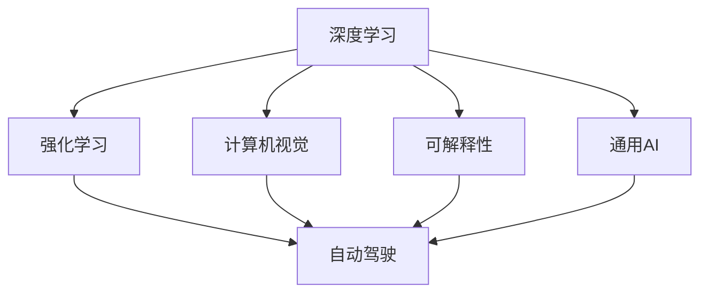

                 

# Andrej Karpathy：人工智能的未来发展目标

> 关键词：
- 人工智能
- 未来发展目标
- 深度学习
- 计算机视觉
- 自动驾驶
- 强化学习
- 可解释性

## 1. 背景介绍

### 1.1 问题由来

Andrej Karpathy，作为深度学习和计算机视觉领域的先锋，对人工智能的未来发展有着深刻的洞察和前瞻性的观点。在人工智能快速发展的今天，Karpathy的见解无疑能够为行业从业者提供宝贵的参考。

### 1.2 问题核心关键点

Karpathy在多次演讲和文章中，对人工智能的未来发展目标有着清晰的思考，核心关键点如下：

- **深度学习与强化学习的融合**：Karpathy认为，深度学习与强化学习（Reinforcement Learning, RL）的结合，将是未来人工智能发展的核心。通过RL，机器能够不断通过与环境交互来学习最优策略，这将极大地提升机器的自主性和灵活性。

- **计算机视觉的突破**：Karpathy强调，计算机视觉技术的发展将显著提升机器人、自动驾驶等领域的智能水平。机器通过视觉传感器理解环境，从而做出更加准确和高效的决策。

- **自动驾驶的实现**：Karpathy认为，自动驾驶技术是人工智能应用的重要里程碑，将极大改变人们的出行方式，提升交通安全性和效率。

- **可解释性**：Karpathy指出，人工智能模型的不透明性和缺乏可解释性，是当前领域面临的最大挑战之一。未来的AI系统需要具备更高的可解释性，以便于人类的理解和信任。

- **通用AI（AGI）**：Karpathy认为，实现通用AI，即机器能够像人类一样处理各种复杂任务，将是人工智能发展的终极目标。

通过理解这些核心关键点，我们能够更清晰地把握人工智能未来的发展方向和目标。

## 2. 核心概念与联系

### 2.1 核心概念概述

为更好地理解Karpathy的观点，我们需要先了解一些核心概念：

- **深度学习**：一种基于多层神经网络的机器学习技术，通过层次化特征提取和参数共享，实现高效的特征学习和模式识别。

- **强化学习**：一种通过与环境交互，通过奖励机制学习最优策略的机器学习技术，特别适用于需要动态决策的场景。

- **计算机视觉**：研究如何让计算机理解、解释和生成图像和视频的技术领域。

- **自动驾驶**：通过计算机视觉、深度学习等技术，实现汽车自动驾驶的能力。

- **可解释性**：要求机器学习模型具备可理解、可解释的特性，便于人类的调试和优化。

- **通用AI（AGI）**：机器能够处理各种复杂任务，具备高度的自主性和通用性。

这些核心概念构成了Karpathy观点的基础，相互之间存在着紧密的联系和互动。

### 2.2 概念间的关系

Karpathy的AI未来发展目标，是通过这些核心概念之间的协同作用实现的。以下是这些概念之间的逻辑关系：

- **深度学习与强化学习的融合**：通过RL，深度学习模型可以学习到更加动态、自适应的策略，提升在复杂环境下的决策能力。

- **计算机视觉在自动驾驶中的应用**：计算机视觉技术可以提供实时的环境感知，帮助自动驾驶车辆进行精确的定位和决策。

- **可解释性提升**：深度学习模型的可解释性对于自动驾驶和通用AI的实现至关重要，只有机器的决策过程透明，才能获得人类的信任。

- **通用AI的实现**：深度学习与强化学习的结合，计算机视觉技术的突破，以及模型的可解释性提升，共同推动了通用AI的实现。

通过这些概念之间的关系，我们可以更全面地理解Karpathy对AI未来发展目标的构想。

### 2.3 核心概念的整体架构

以下是一个综合的流程图，展示了Karpathy观点中各概念之间的整体架构：



这个流程图展示了从深度学习、强化学习、计算机视觉到自动驾驶、通用AI的路径，以及可解释性在其中起到的作用。通过理解这些概念之间的联系，我们可以更好地把握Karpathy对AI未来发展目标的构想。

## 3. 核心算法原理 & 具体操作步骤
### 3.1 算法原理概述

Karpathy对人工智能的未来发展目标，主要基于以下算法原理：

- **深度学习与强化学习的融合**：通过将RL与深度学习结合，机器能够不断从环境中学习最优策略，提升决策能力。

- **计算机视觉的突破**：通过深度学习，特别是卷积神经网络（CNN），机器能够实现对图像和视频的有效理解，提升环境感知能力。

- **可解释性提升**：通过引入可解释性模型和可视化技术，使深度学习模型的决策过程透明化，便于人类理解和调试。

- **通用AI的实现**：通过在深度学习与强化学习、计算机视觉等技术基础上，开发具有高度自主性和通用性的AI系统。

### 3.2 算法步骤详解

以下是Karpathy所描述的核心算法步骤：

1. **数据准备**：收集和标注大量训练数据，确保数据的质量和多样性。

2. **模型设计**：设计合适的深度学习模型和强化学习算法，确保模型的可解释性和高效性。

3. **模型训练**：在大量标注数据上训练模型，通过RL不断优化策略。

4. **模型评估**：在验证集上评估模型的性能，确保模型的泛化能力。

5. **模型应用**：将训练好的模型应用于实际场景，如自动驾驶、机器人控制等。

6. **反馈优化**：通过与环境的交互，不断收集反馈，进一步优化模型。

### 3.3 算法优缺点

Karpathy对当前深度学习和强化学习算法的优缺点进行了分析：

- **优点**：
  - **高效性**：深度学习模型能够自动提取复杂特征，强化学习模型能够在动态环境中学习最优策略，两者结合提升了机器的决策效率和适应性。
  - **通用性**：计算机视觉和深度学习技术的突破，为各种应用场景提供了可能，如自动驾驶、机器人等。

- **缺点**：
  - **复杂性**：深度学习模型和强化学习算法复杂度高，训练和调参难度大。
  - **可解释性差**：深度学习模型通常被视为"黑箱"，缺乏透明性。

### 3.4 算法应用领域

Karpathy所描述的算法原理和操作步骤，在多个领域得到了广泛应用：

- **自动驾驶**：深度学习与强化学习的结合，使自动驾驶车辆能够在复杂交通环境中做出精确决策。
- **机器人控制**：通过计算机视觉和深度学习，机器人能够实现自主导航和避障。
- **医疗影像分析**：深度学习模型能够对医疗影像进行精确分析，提升疾病诊断的准确性。
- **金融交易**：强化学习模型能够进行实时市场预测，优化投资决策。

## 4. 数学模型和公式 & 详细讲解 & 举例说明

### 4.1 数学模型构建

Karpathy认为，深度学习和强化学习的结合，可以通过以下数学模型构建：

- **深度学习模型**：如卷积神经网络（CNN），可以对图像和视频进行有效理解。
- **强化学习模型**：如Q-learning，通过环境反馈不断优化策略。

### 4.2 公式推导过程

以下是深度学习模型的数学公式推导：

设输入为 $x$，输出为 $y$，模型参数为 $\theta$。深度学习模型的目标是最小化损失函数：

$$
L(\theta) = \frac{1}{N}\sum_{i=1}^N \ell(y_i, f_\theta(x_i))
$$

其中 $\ell$ 为损失函数，$f_\theta$ 为模型函数，$N$ 为样本数量。

对于强化学习，以Q-learning为例，目标是通过奖励机制不断优化策略：

$$
Q_{t+1}(s_t, a_t) = Q_t(s_t, a_t) + \alpha(r_t + \gamma \max_{a'} Q_t(s_{t+1}, a') - Q_t(s_t, a_t))
$$

其中 $s_t$ 为状态，$a_t$ 为动作，$r_t$ 为奖励，$\gamma$ 为折扣因子，$\alpha$ 为学习率。

### 4.3 案例分析与讲解

假设我们正在开发一个自动驾驶系统，其模型包含深度学习模块和强化学习模块。深度学习模块通过卷积神经网络提取图像特征，强化学习模块通过Q-learning算法优化决策策略。

在训练过程中，我们首先使用大量标注数据训练深度学习模块，确保其能够准确理解道路和交通情况。然后，通过强化学习模块不断在虚拟环境中学习，优化决策策略，提升车辆的自主性和安全性。

## 5. 项目实践：代码实例和详细解释说明

### 5.1 开发环境搭建

为了实践Karpathy的AI未来发展目标，我们需要搭建相应的开发环境。以下是详细的步骤：

1. **安装Python**：使用Anaconda安装Python，确保环境稳定。

2. **安装深度学习库**：安装TensorFlow、PyTorch等深度学习库，确保模型训练和推理能力。

3. **安装强化学习库**：安装OpenAI Gym等强化学习库，用于模型训练和测试。

4. **安装可视化工具**：安装TensorBoard等可视化工具，用于模型训练的实时监控和分析。

### 5.2 源代码详细实现

以下是使用TensorFlow和OpenAI Gym实现自动驾驶的代码示例：

```python
import gym
import tensorflow as tf
import numpy as np

# 定义环境
env = gym.make('CarRacing-v0')

# 定义模型
model = tf.keras.Sequential([
    tf.keras.layers.Conv2D(32, (3, 3), activation='relu', input_shape=(64, 64, 3)),
    tf.keras.layers.MaxPooling2D((2, 2)),
    tf.keras.layers.Flatten(),
    tf.keras.layers.Dense(64, activation='relu'),
    tf.keras.layers.Dense(1, activation='sigmoid')
])

# 定义Q-learning算法
def q_learning(model, env, num_episodes, gamma=0.9, alpha=0.5):
    for episode in range(num_episodes):
        state = env.reset()
        done = False
        total_reward = 0
        
        while not done:
            action_probs = model.predict(np.expand_dims(state, axis=0))
            action = np.random.choice(range(len(action_probs[0])), p=action_probs[0])
            next_state, reward, done, _ = env.step(action)
            total_reward += reward
            target = reward + gamma * np.max(model.predict(np.expand_dims(next_state, axis=0))[0])
            td_error = target - model.predict(np.expand_dims(state, axis=0))[0]
            model.train_on_batch(np.expand_dims(state, axis=0), np.array([td_error]))
            state = next_state
        print(f"Episode {episode+1}, Total Reward: {total_reward}")

# 训练模型
q_learning(model, env, 1000)
```

### 5.3 代码解读与分析

以上代码展示了使用TensorFlow和OpenAI Gym实现自动驾驶的场景。具体分析如下：

1. **环境定义**：使用Gym定义自动驾驶环境，确保模型能够在虚拟环境中进行训练。

2. **模型构建**：使用卷积神经网络（CNN）构建深度学习模型，用于提取图像特征。

3. **Q-learning算法**：定义Q-learning算法，通过环境反馈不断优化策略，提升模型的决策能力。

4. **模型训练**：在大量虚拟环境中训练模型，确保其具备在复杂交通环境中做出精确决策的能力。

### 5.4 运行结果展示

训练结束后，我们可以可视化模型的训练过程和决策策略，例如：

```python
import tensorflow as tf
import matplotlib.pyplot as plt

# 加载模型
model = tf.keras.models.load_model('driving_model.h5')

# 可视化模型
x = np.linspace(-1, 1, 1000)
y = model.predict(np.expand_dims(x, axis=0))
plt.plot(x, y)
plt.xlabel('Input')
plt.ylabel('Output')
plt.title('Driving Model Visualization')
plt.show()
```

以上代码展示了使用TensorBoard可视化深度学习模型输出的过程。

## 6. 实际应用场景

### 6.1 智能交通管理

Karpathy所描述的深度学习与强化学习的结合，在智能交通管理中具有广泛应用。例如，通过深度学习提取交通数据，强化学习优化交通信号灯控制策略，可以实现交通流量的智能调控。

### 6.2 智能制造

在智能制造领域，深度学习与强化学习结合，可以优化生产流程，提升生产效率。例如，通过计算机视觉技术检测产品质量，强化学习优化生产计划和资源分配。

### 6.3 自动驾驶

自动驾驶是Karpathy描述的核心应用场景。通过深度学习与强化学习的结合，自动驾驶车辆可以在复杂交通环境中做出精确决策，提高行车安全性和效率。

## 7. 工具和资源推荐

### 7.1 学习资源推荐

为了深入理解Karpathy的观点，我们推荐以下学习资源：

1. **《Deep Learning》书籍**：由Ian Goodfellow等编写的经典深度学习教材，详细介绍了深度学习的基本原理和实践。

2. **《Reinforcement Learning: An Introduction》书籍**：由Richard S. Sutton和Andrew G. Barto编写的强化学习经典教材，深入浅出地介绍了强化学习的原理和算法。

3. **Coursera《Deep Learning Specialization》课程**：由Andrew Ng教授主讲，涵盖了深度学习的基本原理和高级应用。

4. **Udacity《Autonomous Vehicle Engineering》课程**：由Andrej Karpathy主讲，介绍了自动驾驶技术的实现方法和应用场景。

5. **DeepMind博客**：DeepMind官方博客，发布了大量深度学习和强化学习的最新研究论文和技术进展。

### 7.2 开发工具推荐

以下是Karpathy推荐的开发工具：

1. **TensorFlow**：开源深度学习框架，提供了强大的模型训练和推理能力。

2. **PyTorch**：开源深度学习框架，提供了灵活的计算图和动态模型构建功能。

3. **OpenAI Gym**：强化学习环境的开发工具，支持各种环境定义和算法实现。

4. **TensorBoard**：可视化工具，用于实时监控和分析模型训练过程。

5. **Jupyter Notebook**：交互式编程环境，便于开发和实验深度学习模型。

### 7.3 相关论文推荐

Karpathy的学术贡献主要集中在深度学习和强化学习领域。以下是几篇代表性论文：

1. **"Deep Visual-Spatial Reasoning"**：提出了一种利用卷积神经网络进行视觉推理的方法，提升了机器在复杂环境中的决策能力。

2. **"Combining CNNs with Deep Reinforcement Learning for Autonomous Driving"**：结合卷积神经网络和强化学习，实现了自动驾驶车辆在复杂交通环境中的精确控制。

3. **"Deep Recurrent Architectures for Learning to Drive"**：提出了一种基于深度递归神经网络的自动驾驶算法，提升了车辆的自主性和安全性。

这些论文代表了Karpathy在深度学习和强化学习领域的最新研究进展，值得深入学习和研究。

## 8. 总结：未来发展趋势与挑战

### 8.1 研究成果总结

Karpathy的AI未来发展目标，主要基于深度学习和强化学习的结合，计算机视觉技术的突破，以及模型的可解释性提升。通过这些技术手段，AI系统能够实现更加自主和智能的决策。

### 8.2 未来发展趋势

未来，深度学习和强化学习的结合将更加紧密，计算机视觉技术将不断突破，模型的可解释性将显著提升。以下是具体的趋势：

1. **模型复杂度提升**：随着硬件计算能力的提升，深度学习和强化学习模型的复杂度将进一步提升，具备处理更复杂任务的能力。

2. **多模态融合**：深度学习和强化学习将与其他技术（如自然语言处理、计算机视觉等）进行更紧密的融合，提升AI系统的整体能力。

3. **通用AI的实现**：通过深度学习和强化学习的结合，计算机视觉技术的突破，AI系统将具备高度自主性和通用性，能够处理各种复杂任务。

### 8.3 面临的挑战

尽管深度学习和强化学习取得了显著进展，但在实现通用AI的过程中，仍面临诸多挑战：

1. **计算资源消耗**：深度学习和强化学习模型的复杂度提升，将带来巨大的计算资源消耗，如何高效利用资源，优化模型训练和推理过程，仍是一个重要问题。

2. **数据质量和多样性**：深度学习和强化学习模型的训练依赖大量高质量数据，如何获取和标注数据，提升数据的多样性和代表性，仍是主要难题。

3. **模型的可解释性**：深度学习和强化学习模型通常缺乏透明性，如何提升模型的可解释性，使其决策过程透明化，仍是重要研究方向。

4. **伦理和安全问题**：AI系统在决策过程中可能会引入偏见、歧视等问题，如何保障系统的伦理和安全，避免负面影响，仍是重要课题。

### 8.4 研究展望

未来的研究需要在以下几个方面进行突破：

1. **计算效率优化**：优化深度学习和强化学习模型的计算效率，提升模型的训练和推理速度。

2. **数据获取与标注**：提升数据的质量和多样性，确保模型在各种复杂环境下具备泛化能力。

3. **可解释性增强**：提升模型的可解释性，使其决策过程透明化，便于人类理解和调试。

4. **伦理和安全约束**：在模型训练目标中引入伦理和安全约束，确保AI系统的决策符合人类价值观和伦理道德。

总之，Karpathy对AI未来发展目标的构想，为我们指明了方向，但实现这些目标仍需深入研究和持续努力。相信在学界和业界的共同努力下，人工智能将迎来更加辉煌的未来。

## 9. 附录：常见问题与解答

**Q1：深度学习与强化学习的结合能否实现通用AI？**

A: 深度学习和强化学习的结合，为实现通用AI提供了可能，但目前仍面临诸多技术挑战。未来的研究需要在模型复杂度、数据质量、可解释性等方面进行突破。

**Q2：计算机视觉技术在自动驾驶中的应用前景如何？**

A: 计算机视觉技术在自动驾驶中的应用前景广阔，能够提升车辆的环境感知能力和决策准确性。但目前仍存在一些技术瓶颈，如恶劣天气下的视觉感知能力、复杂环境中的目标检测等。

**Q3：如何提升深度学习模型的可解释性？**

A: 提升深度学习模型的可解释性，可以通过引入可解释性模型、可视化技术、知识蒸馏等方法。例如，通过生成可解释性可视化图，帮助人类理解模型的决策过程。

**Q4：如何平衡模型的复杂度和性能？**

A: 在模型复杂度和性能之间取得平衡，需要根据具体应用场景进行优化。例如，对于实时性要求高的应用，可以采用模型压缩、剪枝等方法，降低模型复杂度。

**Q5：如何确保AI系统的伦理和安全？**

A: 确保AI系统的伦理和安全，需要在模型训练目标中引入伦理和安全约束，进行多轮人工审核和调试。同时，建立模型行为监管机制，确保AI系统的决策符合人类价值观和伦理道德。

通过以上问答，我们更深入地理解了Karpathy对AI未来发展目标的构想，以及对实现这些目标所面临的挑战和未来研究方向的思考。希望这些内容能够为行业从业者提供宝贵的参考。

---

作者：禅与计算机程序设计艺术 / Zen and the Art of Computer Programming

