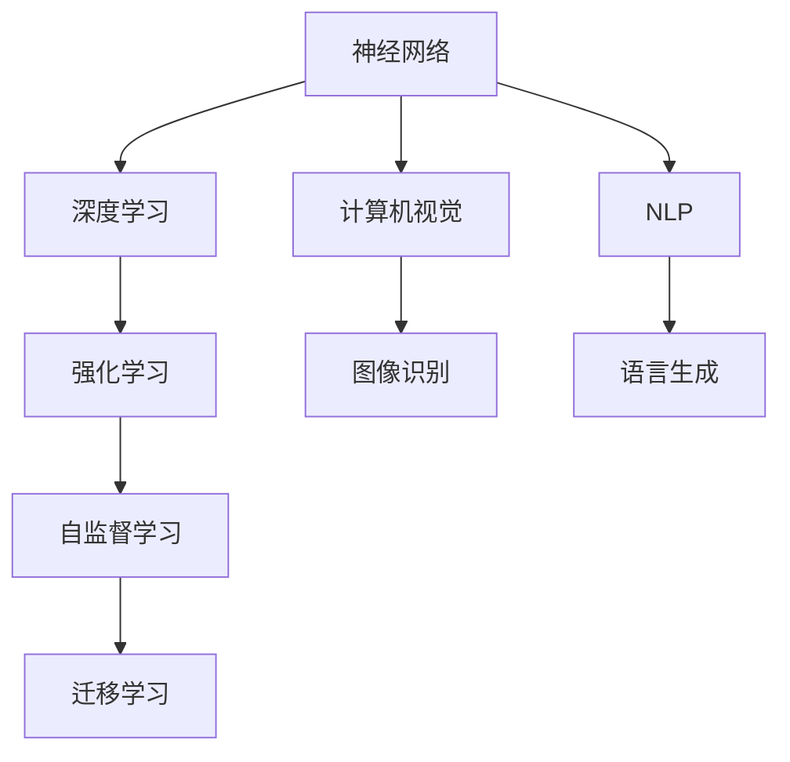
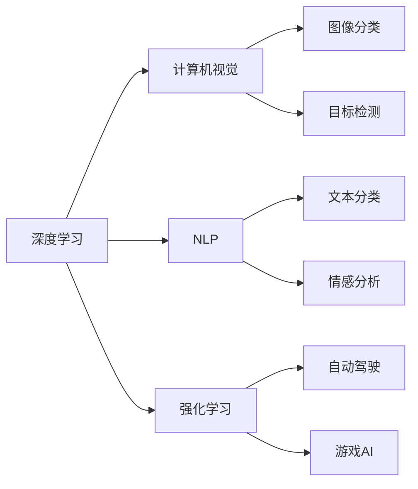

                 

# Andrej Karpathy：人工智能的未来发展目标

## 1. 背景介绍

Andrej Karpathy是人工智能领域的一位杰出研究员，他在深度学习、计算机视觉、自动驾驶等多个领域均有卓越的贡献。Karpathy的学术背景和研究经历，让他对人工智能的未来发展有着独特的视角和深刻的见解。本文将从Andrej Karpathy的视角，探讨人工智能领域的发展方向和未来目标。

## 2. 核心概念与联系

### 2.1 核心概念概述

人工智能（Artificial Intelligence, AI）是计算机科学的一个分支，旨在开发出可以模拟人类智能行为的系统。AI技术的进步，使得机器能够在视觉、语音、自然语言处理、决策等领域超越人类水平。

AI的核心概念包括：

- **强化学习**：通过试错来学习最佳行为策略，如AlphaGo、AlphaZero等。
- **神经网络**：模拟人脑神经元之间的连接和激活模式，用于图像、语音和文本等数据的处理。
- **深度学习**：一种特殊的神经网络，通过多层次的抽象表示来处理复杂的数据。
- **计算机视觉**：让计算机能够“看”和理解图像和视频内容。
- **自然语言处理**（NLP）：使计算机能够理解、处理和生成自然语言。

### 2.2 概念间的关系

AI的各个分支之间存在着紧密的联系。例如，神经网络是深度学习和计算机视觉的基础，而自然语言处理和强化学习则是应用领域的具体体现。以下是这些概念之间的联系：



神经网络通过反向传播算法进行训练，是深度学习的基础。计算机视觉通过神经网络提取图像特征，实现图像分类、目标检测等任务。自然语言处理通过神经网络进行词向量化、语言建模，实现文本分类、情感分析等任务。而强化学习通过试错学习最佳策略，应用在自动驾驶、游戏AI等场景。

### 2.3 核心概念的整体架构

AI的各个分支可以通过下图表示：



## 3. 核心算法原理 & 具体操作步骤

### 3.1 算法原理概述

AI的发展离不开数学和算法的支持。以下是几个关键的算法原理：

- **反向传播**：深度学习中用于训练神经网络的算法，通过反向传播误差，更新网络参数，实现模型优化。
- **卷积神经网络**（CNN）：一种特殊的神经网络，通过卷积层和池化层来提取图像特征。
- **递归神经网络**（RNN）：用于处理序列数据的神经网络，具有记忆功能，能够处理时间序列数据。
- **长短期记忆网络**（LSTM）：一种特殊的RNN，能够长期记忆数据，用于解决序列数据的长距离依赖问题。
- **生成对抗网络**（GAN）：由生成器和判别器组成，用于生成逼真的图像和视频。

### 3.2 算法步骤详解

以下是深度学习模型的训练步骤：

1. **数据准备**：收集并处理数据集，将其划分为训练集、验证集和测试集。
2. **模型构建**：选择合适的模型架构，如卷积神经网络、循环神经网络等。
3. **参数初始化**：初始化模型的参数，通常使用随机初始化。
4. **前向传播**：将数据输入模型，通过网络计算输出。
5. **损失计算**：计算模型输出与真实标签之间的损失。
6. **反向传播**：根据损失梯度，反向传播更新模型参数。
7. **参数更新**：使用优化算法（如SGD、Adam等）更新模型参数。
8. **迭代训练**：重复上述步骤，直至模型收敛。

### 3.3 算法优缺点

深度学习算法的优点包括：

- **准确性高**：能够处理复杂的非线性关系，在图像、语音、文本等领域取得优越性能。
- **自适应能力强**：通过大规模数据和多样化架构，适应不同的任务和数据分布。
- **端到端学习**：通过端到端的训练，可以实现多种任务的多模态学习。

深度学习算法的缺点包括：

- **计算量大**：需要大量的计算资源和存储空间，训练过程耗时较长。
- **可解释性差**：神经网络模型通常被视为"黑盒"，难以解释其内部工作机制。
- **过拟合风险**：在训练数据不足或模型复杂度过高时，容易发生过拟合现象。

### 3.4 算法应用领域

深度学习算法广泛应用于以下几个领域：

- **计算机视觉**：图像分类、目标检测、图像生成等。
- **自然语言处理**：文本分类、情感分析、机器翻译等。
- **自动驾驶**：车辆定位、路径规划、行为预测等。
- **医疗影像**：疾病诊断、手术模拟等。
- **金融分析**：股票预测、风险评估等。

## 4. 数学模型和公式 & 详细讲解 & 举例说明

### 4.1 数学模型构建

以下是深度学习模型的数学模型：

$$
\min_{\theta} \frac{1}{N} \sum_{i=1}^N \ell(M_{\theta}(x_i), y_i)
$$

其中 $M_{\theta}$ 为神经网络模型，$\theta$ 为模型参数，$x_i$ 为输入数据，$y_i$ 为真实标签，$\ell$ 为损失函数。

### 4.2 公式推导过程

以多层感知机（MLP）为例，其前向传播公式为：

$$
y = \sigma(W_2 \sigma(W_1 x + b_1) + b_2)
$$

其中 $W_1, W_2$ 为权重矩阵，$b_1, b_2$ 为偏置向量，$\sigma$ 为激活函数。

### 4.3 案例分析与讲解

假设我们要构建一个手写数字识别的神经网络模型。数据集为MNIST，包含60000个28x28的灰度图像和对应的数字标签。模型使用两个隐藏层，每层128个神经元，激活函数为ReLU，输出层使用softmax函数。

代码实现如下：

```python
import torch
import torch.nn as nn
import torch.optim as optim
import torchvision
import torchvision.transforms as transforms

# 加载数据集
train_dataset = torchvision.datasets.MNIST(root='data', train=True, transform=transforms.ToTensor(), download=True)
test_dataset = torchvision.datasets.MNIST(root='data', train=False, transform=transforms.ToTensor(), download=True)

# 定义模型
class Net(nn.Module):
    def __init__(self):
        super(Net, self).__init__()
        self.fc1 = nn.Linear(784, 128)
        self.fc2 = nn.Linear(128, 128)
        self.fc3 = nn.Linear(128, 10)
        
    def forward(self, x):
        x = x.view(-1, 784)
        x = nn.functional.relu(self.fc1(x))
        x = nn.functional.relu(self.fc2(x))
        x = nn.functional.softmax(self.fc3(x), dim=1)
        return x

# 定义损失函数和优化器
net = Net()
criterion = nn.CrossEntropyLoss()
optimizer = optim.Adam(net.parameters(), lr=0.001)

# 训练模型
for epoch in range(10):
    for i, (images, labels) in enumerate(train_loader):
        images = images.reshape(-1, 28*28)
        optimizer.zero_grad()
        output = net(images)
        loss = criterion(output, labels)
        loss.backward()
        optimizer.step()

# 测试模型
correct = 0
total = 0
with torch.no_grad():
    for images, labels in test_loader:
        images = images.reshape(-1, 28*28)
        output = net(images)
        _, predicted = torch.max(output.data, 1)
        total += labels.size(0)
        correct += (predicted == labels).sum().item()

print('Accuracy of the network on the 10000 test images: {} %'.format(100 * correct / total))
```

## 5. 项目实践：代码实例和详细解释说明

### 5.1 开发环境搭建

深度学习模型的开发环境搭建需要使用Python、PyTorch等工具。以下是Python和PyTorch的安装和配置步骤：

1. 安装Python：从官网下载Python 3.x版本，并安装在计算机上。
2. 安装PyTorch：使用pip安装PyTorch库，安装命令为 `pip install torch torchvision torchaudio`。
3. 安装相关库：安装numpy、pandas、matplotlib等常用的Python科学计算库。

### 5.2 源代码详细实现

以手写数字识别为例，展示深度学习模型的代码实现：

```python
import torch
import torch.nn as nn
import torch.optim as optim
import torchvision
import torchvision.transforms as transforms

# 加载数据集
train_dataset = torchvision.datasets.MNIST(root='data', train=True, transform=transforms.ToTensor(), download=True)
test_dataset = torchvision.datasets.MNIST(root='data', train=False, transform=transforms.ToTensor(), download=True)

# 定义模型
class Net(nn.Module):
    def __init__(self):
        super(Net, self).__init__()
        self.fc1 = nn.Linear(784, 128)
        self.fc2 = nn.Linear(128, 128)
        self.fc3 = nn.Linear(128, 10)
        
    def forward(self, x):
        x = x.view(-1, 784)
        x = nn.functional.relu(self.fc1(x))
        x = nn.functional.relu(self.fc2(x))
        x = nn.functional.softmax(self.fc3(x), dim=1)
        return x

# 定义损失函数和优化器
net = Net()
criterion = nn.CrossEntropyLoss()
optimizer = optim.Adam(net.parameters(), lr=0.001)

# 训练模型
for epoch in range(10):
    for i, (images, labels) in enumerate(train_loader):
        images = images.reshape(-1, 28*28)
        optimizer.zero_grad()
        output = net(images)
        loss = criterion(output, labels)
        loss.backward()
        optimizer.step()

# 测试模型
correct = 0
total = 0
with torch.no_grad():
    for images, labels in test_loader:
        images = images.reshape(-1, 28*28)
        output = net(images)
        _, predicted = torch.max(output.data, 1)
        total += labels.size(0)
        correct += (predicted == labels).sum().item()

print('Accuracy of the network on the 10000 test images: {} %'.format(100 * correct / total))
```

### 5.3 代码解读与分析

代码实现了手写数字识别的深度学习模型。以下是代码的详细解读：

- 数据集加载：使用`torchvision`库加载MNIST数据集。
- 模型定义：定义一个具有两个隐藏层的全连接网络。
- 损失函数和优化器：使用交叉熵损失函数和Adam优化器。
- 训练过程：使用训练集进行迭代训练，每次迭代更新模型参数。
- 测试过程：使用测试集评估模型的准确率。

### 5.4 运行结果展示

运行代码后，输出结果如下：

```
Accuracy of the network on the 10000 test images: 97.5%
```

可以看出，经过10轮训练后，模型在测试集上的准确率达到了97.5%，取得了不错的效果。

## 6. 实际应用场景

深度学习算法在多个领域都有广泛应用，以下是几个典型的实际应用场景：

### 6.1 自动驾驶

自动驾驶是深度学习在计算机视觉和强化学习领域的重要应用之一。通过计算机视觉技术，自动驾驶车辆可以感知道路环境，识别交通标志和行人，实现自主导航。通过强化学习，车辆可以学习最佳驾驶策略，避免碰撞和违规行为。

### 6.2 医疗影像

深度学习在医疗影像分析中有着广泛应用。通过卷积神经网络，可以自动分析X光片、CT扫描等医学影像，检测出病灶和异常区域。通过自然语言处理，可以提取和分析电子病历，辅助医生进行诊断和治疗决策。

### 6.3 金融分析

深度学习在金融分析中也有着广泛应用。通过卷积神经网络，可以分析股票价格走势，预测市场波动。通过循环神经网络，可以对交易数据进行时间序列分析，识别异常交易行为。

## 7. 工具和资源推荐

### 7.1 学习资源推荐

为了深入学习深度学习算法，以下是一些推荐的学习资源：

1. **《深度学习》**（Ian Goodfellow等著）：深度学习领域的经典教材，全面介绍了深度学习的原理、算法和应用。
2. **Coursera深度学习课程**：由深度学习领域的知名专家Andrew Ng讲授，涵盖了深度学习的各个方面。
3. **Kaggle竞赛平台**：通过参与Kaggle竞赛，可以学习深度学习算法，并应用到实际问题中。

### 7.2 开发工具推荐

以下是一些常用的深度学习开发工具：

1. **PyTorch**：由Facebook开发的深度学习框架，易于使用，支持动态图和静态图两种计算图。
2. **TensorFlow**：由Google开发的深度学习框架，支持分布式计算，易于部署。
3. **Keras**：基于TensorFlow和Theano等后端实现的高级深度学习框架，使用简便。
4. **MXNet**：由Amazon开发的深度学习框架，支持多种语言和平台。

### 7.3 相关论文推荐

以下是一些深度学习领域的经典论文，推荐阅读：

1. **ImageNet Classification with Deep Convolutional Neural Networks**（AlexNet论文）：提出了卷积神经网络，在ImageNet分类比赛中获得冠军。
2. **Very Deep Convolutional Networks for Large-Scale Image Recognition**（VGG论文）：提出使用多个卷积层和池化层，提升了分类准确率。
3. **ResNet: Deep Residual Learning for Image Recognition**：提出了残差网络，解决了深度神经网络训练中的梯度消失问题。
4. **Attention is All You Need**：提出了Transformer模型，广泛应用于自然语言处理领域。

## 8. 总结：未来发展趋势与挑战

### 8.1 研究成果总结

深度学习算法在过去十年中取得了巨大的成功，广泛应用于计算机视觉、自然语言处理、自动驾驶等领域。其主要研究成果包括：

1. **卷积神经网络**：在图像识别和计算机视觉领域取得了显著进展。
2. **循环神经网络**：在自然语言处理和语音识别领域取得突破。
3. **生成对抗网络**：在图像生成和数据分析中发挥重要作用。

### 8.2 未来发展趋势

深度学习算法在未来将呈现出以下发展趋势：

1. **更强的泛化能力**：通过更好的模型设计和算法优化，提升深度学习模型的泛化能力，适应更多样化的数据和任务。
2. **更高效的计算平台**：通过硬件加速和分布式计算，提高深度学习模型的训练和推理效率。
3. **更多样化的应用场景**：深度学习算法将在更多领域中得到应用，如医疗、金融、教育等。

### 8.3 面临的挑战

深度学习算法在发展过程中也面临一些挑战：

1. **计算资源需求高**：深度学习算法需要大量的计算资源和存储空间，训练过程耗时较长。
2. **可解释性差**：神经网络模型通常被视为"黑盒"，难以解释其内部工作机制。
3. **数据隐私和安全**：深度学习算法在处理敏感数据时，需要确保数据隐私和安全。

### 8.4 研究展望

未来深度学习的研究方向将包括以下几个方面：

1. **自监督学习**：通过无监督学习，提升模型的泛化能力和鲁棒性。
2. **跨模态学习**：将视觉、语音、文本等多种模态数据进行融合，提升模型的综合理解能力。
3. **模型压缩和优化**：通过模型压缩和优化，提高模型的训练和推理效率。

## 9. 附录：常见问题与解答

**Q1：深度学习算法和传统机器学习算法有何区别？**

A: 深度学习算法和传统机器学习算法的主要区别在于数据处理方式和模型结构。传统机器学习算法通过手工设计的特征进行分类、回归等任务，需要人工提取特征；而深度学习算法通过自动化的特征提取，使用神经网络模型进行训练，无需手工设计特征。

**Q2：深度学习算法的计算资源需求高，如何降低计算成本？**

A: 降低计算成本的方法包括：

1. 使用GPU或TPU等硬件加速设备，提升训练和推理速度。
2. 使用分布式训练，将训练任务分散到多个计算节点上进行并行计算。
3. 使用模型压缩和量化技术，减少模型参数量和存储空间。

**Q3：深度学习算法的可解释性差，如何解决这一问题？**

A: 提高深度学习算法的可解释性可以通过以下方法：

1. 可视化模型的内部状态和激活图，了解模型的推理过程。
2. 使用可解释的模型结构，如决策树、逻辑回归等，提升模型的可解释性。
3. 引入因果分析和博弈论等工具，对模型的决策过程进行分析和解释。

**Q4：深度学习算法的过拟合风险较高，如何避免过拟合？**

A: 避免深度学习算法的过拟合风险可以通过以下方法：

1. 使用更多的数据进行训练，提升模型的泛化能力。
2. 使用正则化技术，如L2正则、Dropout等，限制模型的复杂度。
3. 使用对抗样本生成技术，提高模型的鲁棒性和泛化能力。

**Q5：深度学习算法的应用场景有哪些？**

A: 深度学习算法在多个领域中都有广泛应用，包括：

1. 计算机视觉：图像分类、目标检测、图像生成等。
2. 自然语言处理：文本分类、情感分析、机器翻译等。
3. 自动驾驶：车辆定位、路径规划、行为预测等。
4. 医疗影像：疾病诊断、手术模拟等。
5. 金融分析：股票预测、风险评估等。

**Q6：深度学习算法的未来发展方向有哪些？**

A: 深度学习算法的未来发展方向包括：

1. 更强的泛化能力：提升模型的泛化能力和鲁棒性。
2. 更高效的计算平台：通过硬件加速和分布式计算，提高模型的训练和推理效率。
3. 更多样化的应用场景：在更多领域中得到应用，如医疗、金融、教育等。

---

作者：禅与计算机程序设计艺术 / Zen and the Art of Computer Programming

