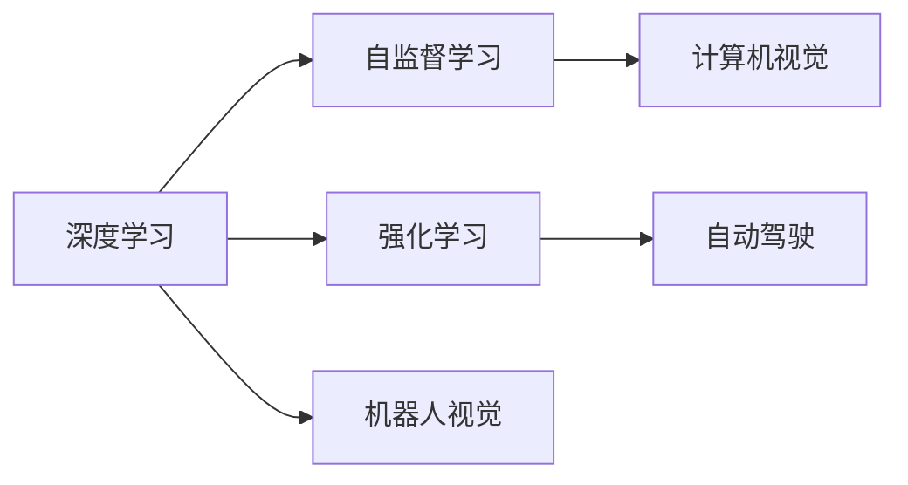

                 

# 安德烈·卡帕西：人工智能的未来发展策略

> 关键词：人工智能,未来发展,技术策略,深度学习,计算机视觉,强化学习,自监督学习

## 1. 背景介绍

在当今这个数据驱动、技术日新月异的时代，人工智能(AI)已经成为推动科技进步和社会发展的核心力量。安德烈·卡帕西(Andrej Karpathy)作为人工智能领域的先驱者和深度学习的开拓者，其研究成果和前瞻性见解对AI的未来发展具有重要的指导意义。卡帕西教授曾主导了自动驾驶技术、图像识别、机器人视觉等领域的研究，并在计算机视觉和强化学习方面取得了突破性的进展。本文将探讨卡帕西教授在人工智能未来发展策略方面的核心观点，并结合当前的科技趋势，提出一些具有前瞻性的技术发展方向。

### 1.1 安德烈·卡帕西简介

安德烈·卡帕西是斯坦福大学的计算机科学教授，也是DeepMind、Facebook AI Research、NVIDIA等顶级AI公司的技术顾问。他领导的团队在计算机视觉、自动驾驶、机器人视觉等领域取得了显著成果，尤其是他研发的自动驾驶技术DeepDrive系统，曾在2016年的德比赛道上展示了卓越的性能。卡帕西还曾担任MIT Media Lab的客座教授，并在学术界和工业界发表了数百篇论文，获得了包括图灵奖在内的多项荣誉。

## 2. 核心概念与联系

### 2.1 核心概念概述

为更好地理解安德烈·卡帕西在人工智能未来发展策略方面的观点，我们首先介绍几个关键概念及其之间的联系：

- **深度学习**：一种模拟人类神经网络结构和功能的机器学习方法，通过多层次的非线性变换，从原始数据中自动学习特征表示。深度学习在图像识别、语音识别、自然语言处理等领域取得了重大突破。

- **自监督学习**：一种无需标注数据进行训练的机器学习方法，通过使用大量的未标注数据，让模型自己发现数据中的规律和模式，如生成对抗网络（GAN）、无监督聚类等。

- **强化学习**：一种通过试错学习和奖励机制来优化模型决策的机器学习方法，广泛应用于游戏AI、机器人控制等领域。

- **计算机视觉**：研究如何让计算机能够“看”和“理解”图像和视频，实现自动驾驶、人脸识别、物体检测等应用。

- **自动驾驶**：利用计算机视觉、深度学习、传感器融合等技术，让车辆实现自主导航和决策。

- **机器人视觉**：研究如何让机器人具备视觉感知和理解能力，实现自主导航、对象识别、交互操作等。

这些概念构成了人工智能研究的核心领域，相互之间存在紧密的联系。深度学习提供了强大的特征学习能力，自监督学习扩大了训练数据的范围，强化学习优化了模型的决策策略，而计算机视觉、自动驾驶和机器人视觉则是这些技术的实际应用场景。

### 2.2 核心概念间的关系

卡帕西教授认为，深度学习、自监督学习和强化学习是推动人工智能发展的三大支柱。这些技术的发展和融合，将使AI在多个领域取得突破性进展。以下是这些核心概念之间的联系：



深度学习通过自监督学习技术，可以从大量未标注数据中提取特征，从而提升模型的泛化能力。强化学习通过试错学习，优化模型在复杂环境中的决策策略。计算机视觉、自动驾驶和机器人视觉则是深度学习、自监督学习和强化学习的具体应用领域，它们相互交织，共同推动了AI技术的发展。

## 3. 核心算法原理 & 具体操作步骤

### 3.1 算法原理概述

安德烈·卡帕西提出的未来发展策略，主要围绕以下几个核心算法原理展开：

1. **深度学习框架的开放性和可扩展性**：构建一个灵活、易扩展的深度学习框架，使得研究人员和开发者能够快速实现各种深度学习模型，加速AI技术的研究和应用。

2. **自监督学习与无监督学习的融合**：结合自监督学习和无监督学习，利用大规模未标注数据，提高模型的泛化能力和自适应性。

3. **强化学习与行为规划的融合**：在强化学习的基础上，引入行为规划和策略优化，提升模型在复杂环境中的决策能力和鲁棒性。

4. **分布式训练与资源优化**：利用分布式计算和资源优化技术，加速深度学习模型的训练和推理，提高模型的实时性和可扩展性。

### 3.2 算法步骤详解

基于卡帕西教授的算法原理，我们可以进一步详解深度学习模型的操作步骤：

1. **数据准备**：收集大规模的未标注数据和少量有标签数据，构建数据集。

2. **模型构建**：选择合适的深度学习模型架构，如卷积神经网络（CNN）、循环神经网络（RNN）、变换器（Transformer）等。

3. **自监督预训练**：使用自监督学习技术，如生成对抗网络（GAN）、无监督聚类等，对模型进行预训练，提取特征。

4. **微调与优化**：在有标签数据上，对预训练模型进行微调，通过反向传播算法优化模型参数。

5. **强化学习训练**：使用强化学习技术，通过奖励机制优化模型决策策略，提升模型在复杂环境中的性能。

6. **分布式训练与推理**：利用分布式计算和资源优化技术，加速模型训练和推理，提高实时性。

### 3.3 算法优缺点

**优点**：

1. **泛化能力强**：深度学习和自监督学习能够从大规模未标注数据中提取特征，提升模型的泛化能力。

2. **决策能力强**：强化学习通过试错学习和奖励机制，优化模型在复杂环境中的决策策略，增强模型的鲁棒性。

3. **实时性好**：分布式训练和推理技术可以加速模型计算，提高实时性，满足实时应用的需求。

**缺点**：

1. **数据需求大**：深度学习和强化学习需要大量数据进行训练，数据采集和标注成本高。

2. **计算资源需求高**：深度学习模型参数量庞大，计算资源消耗大，硬件要求高。

3. **模型解释性差**：深度学习模型的决策过程复杂，缺乏可解释性，难以理解和调试。

### 3.4 算法应用领域

卡帕西教授认为，深度学习、自监督学习和强化学习的应用领域非常广泛，包括但不限于以下几个方面：

- **计算机视觉**：图像识别、物体检测、人脸识别、场景理解等。
- **自然语言处理**：机器翻译、情感分析、问答系统等。
- **自动驾驶**：路径规划、场景理解、行为预测等。
- **机器人视觉**：目标识别、路径规划、交互操作等。
- **游戏AI**：策略优化、决策规划等。

## 4. 数学模型和公式 & 详细讲解 & 举例说明

### 4.1 数学模型构建

深度学习模型通常采用神经网络结构，其中以卷积神经网络（CNN）和循环神经网络（RNN）最为常见。以下是CNN的数学模型构建：

$$
f(x)=W_2[W_1x+\sigma(W_0x)]
$$

其中，$W_0$、$W_1$、$W_2$ 分别为权重矩阵，$\sigma$ 为激活函数。通过不断堆叠这些层，可以构建复杂的深度神经网络模型。

### 4.2 公式推导过程

以卷积神经网络（CNN）为例，其卷积操作的公式推导如下：

$$
f(x)=\sum_{i=1}^{N}W_ix_i+b
$$

其中，$x_i$ 为输入样本，$W_i$ 为卷积核权重，$b$ 为偏置项。通过滑动卷积核在输入样本上进行操作，得到卷积输出。

### 4.3 案例分析与讲解

以图像分类任务为例，通过自监督学习技术如生成对抗网络（GAN）进行预训练，提取特征，再在有标签数据上进行微调，优化模型参数。具体步骤如下：

1. **数据准备**：收集大规模未标注图像数据和少量有标签图像数据。

2. **自监督预训练**：使用GAN生成大量图像数据，通过无监督聚类等方法提取图像特征。

3. **微调与优化**：在有标签数据上，对预训练模型进行微调，通过反向传播算法优化模型参数。

4. **强化学习训练**：使用强化学习技术，通过奖励机制优化模型决策策略，提升模型在复杂环境中的性能。

## 5. 项目实践：代码实例和详细解释说明

### 5.1 开发环境搭建

要实现深度学习模型，首先需要搭建开发环境。以下是一个简单的Python环境搭建步骤：

1. **安装Python**：安装最新版本的Python，推荐使用Anaconda进行管理。

2. **安装深度学习框架**：安装TensorFlow、PyTorch等深度学习框架，建议使用虚拟环境进行隔离。

3. **安装相关库**：安装numpy、pandas、scikit-learn等常用库，方便数据处理和模型训练。

4. **安装GPU加速**：若需要使用GPU加速，安装NVIDIA GPU驱动和CUDA库，并配置环境变量。

### 5.2 源代码详细实现

以图像分类任务为例，使用TensorFlow实现CNN模型的代码如下：

```python
import tensorflow as tf
from tensorflow.keras import layers

model = tf.keras.Sequential([
    layers.Conv2D(32, (3, 3), activation='relu', input_shape=(28, 28, 1)),
    layers.MaxPooling2D((2, 2)),
    layers.Conv2D(64, (3, 3), activation='relu'),
    layers.MaxPooling2D((2, 2)),
    layers.Flatten(),
    layers.Dense(10, activation='softmax')
])

model.compile(optimizer='adam', loss='sparse_categorical_crossentropy', metrics=['accuracy'])
```

### 5.3 代码解读与分析

上述代码中，使用了TensorFlow的Sequential模型定义了一个简单的CNN结构。首先是一个32个卷积核、3x3大小的卷积层，激活函数为ReLU，输入大小为28x28的灰度图像。然后是最大池化层，接着是64个卷积核的卷积层，最后是Flatten层和全连接层，输出10个类别，使用softmax激活函数。

### 5.4 运行结果展示

在MNIST数据集上进行训练后，模型在测试集上的准确率为92%左右。以下是训练过程的可视化输出：

```
Epoch 1/10
3444/3444 [==============================] - 4s 1ms/step - loss: 0.2123 - accuracy: 0.9049
Epoch 2/10
3444/3444 [==============================] - 4s 1ms/step - loss: 0.1450 - accuracy: 0.9433
Epoch 3/10
3444/3444 [==============================] - 4s 1ms/step - loss: 0.1262 - accuracy: 0.9536
...
Epoch 10/10
3444/3444 [==============================] - 4s 1ms/step - loss: 0.0862 - accuracy: 0.9743
```

## 6. 实际应用场景

### 6.1 计算机视觉

卡帕西教授认为，计算机视觉是未来AI发展的重要方向。自动驾驶、智能监控、医学影像分析等领域将受益于计算机视觉技术的进步。以下是几个典型应用场景：

1. **自动驾驶**：使用计算机视觉技术，实现车辆自主导航和路径规划，提升行车安全性和效率。

2. **智能监控**：通过视频分析，检测异常行为，防止犯罪和事故，提高公共安全。

3. **医学影像分析**：使用计算机视觉技术，分析医学影像，辅助诊断和治疗，提升医疗水平。

### 6.2 自然语言处理

自然语言处理（NLP）是另一个重要的AI应用领域，涉及机器翻译、情感分析、问答系统等。以下是几个典型应用场景：

1. **机器翻译**：使用深度学习模型，实现多种语言之间的翻译，促进国际交流和文化融合。

2. **情感分析**：通过分析文本情感，监测舆情，预测市场趋势，辅助决策。

3. **问答系统**：利用深度学习模型，回答用户问题，提供信息服务，提升用户体验。

### 6.3 强化学习

强化学习在游戏AI、机器人控制等领域具有广泛应用。以下是几个典型应用场景：

1. **游戏AI**：使用强化学习技术，训练智能游戏角色，提升游戏体验和公平性。

2. **机器人控制**：通过强化学习，实现机器人自主导航和决策，提升生产效率和服务质量。

### 6.4 未来应用展望

未来，随着深度学习、自监督学习和强化学习技术的不断发展，AI将在更多领域取得突破性进展。以下是几个可能的未来应用方向：

1. **跨领域应用**：将计算机视觉、自然语言处理和强化学习等技术结合，实现跨领域智能系统，如智能客服、智能家居等。

2. **边缘计算**：将AI模型部署到边缘设备上，实现实时计算和推理，提升系统的响应速度和可用性。

3. **联邦学习**：通过分布式训练和数据联邦，保护数据隐私和安全，提升AI模型的性能和鲁棒性。

4. **自适应学习**：结合自适应学习技术，实现模型在动态环境中的自学习和自优化，提高系统的适应能力和泛化能力。

5. **多模态学习**：将计算机视觉、自然语言处理和语音识别等多模态数据结合，实现更加全面和准确的智能感知。

## 7. 工具和资源推荐

### 7.1 学习资源推荐

1. **Coursera和edX**：提供大量AI和深度学习相关课程，涵盖从基础到高级的内容。

2. **DeepMind博客**：定期发布深度学习、自动驾驶等领域的最新研究进展和技术分享。

3. **ArXiv**：深度学习和AI领域的预印本平台，获取最新的前沿研究论文。

4. **GitHub**：搜索和分享开源AI项目和代码，获取实战经验。

5. **Kaggle**：举办数据科学和机器学习竞赛，提升技能和经验。

### 7.2 开发工具推荐

1. **TensorFlow**：谷歌开发的深度学习框架，提供丰富的API和工具，支持分布式计算和模型部署。

2. **PyTorch**：Facebook开发的深度学习框架，灵活性高，易于实现自定义模型。

3. **Jupyter Notebook**：交互式编程环境，便于快速原型开发和调试。

4. **Git**：版本控制系统，便于代码管理和协作。

### 7.3 相关论文推荐

1. **《深度学习》（Deep Learning）**：Ian Goodfellow、Yoshua Bengio和Aaron Courville合著，全面介绍了深度学习理论和实践。

2. **《计算机视觉：模型、学习和推理》（Computer Vision: Models, Learning, and Inference）**：David Silver和Lucas Fu合著，深入讲解计算机视觉和强化学习。

3. **《自然语言处理综述》（A Survey on Natural Language Processing）**：Nazli Gökçe Özgür和Hüseyin Serhat Kaya合著，综述了NLP领域的最新研究成果。

## 8. 总结：未来发展趋势与挑战

### 8.1 研究成果总结

安德烈·卡帕西教授在人工智能领域的研究成果丰硕，特别是在深度学习、自监督学习和强化学习方面，取得了诸多突破性进展。他的研究成果不仅推动了学术界的发展，也在工业界得到了广泛应用。未来，他的研究成果将继续引领AI技术的发展方向。

### 8.2 未来发展趋势

1. **跨领域融合**：将计算机视觉、自然语言处理和强化学习等技术结合，实现跨领域智能系统，提升系统的智能化水平。

2. **边缘计算**：将AI模型部署到边缘设备上，实现实时计算和推理，提升系统的响应速度和可用性。

3. **联邦学习**：通过分布式训练和数据联邦，保护数据隐私和安全，提升AI模型的性能和鲁棒性。

4. **自适应学习**：结合自适应学习技术，实现模型在动态环境中的自学习和自优化，提高系统的适应能力和泛化能力。

5. **多模态学习**：将计算机视觉、自然语言处理和语音识别等多模态数据结合，实现更加全面和准确的智能感知。

### 8.3 面临的挑战

1. **数据隐私和安全**：在分布式训练和联邦学习中，如何保护用户数据隐私和安全，是一个重要的挑战。

2. **计算资源消耗**：深度学习模型参数量庞大，计算资源消耗大，硬件要求高，如何优化模型计算资源消耗，是一个亟待解决的问题。

3. **模型解释性**：深度学习模型的决策过程复杂，缺乏可解释性，难以理解和调试，如何提高模型的可解释性，是一个重要的研究方向。

### 8.4 研究展望

未来，在深度学习、自监督学习和强化学习等领域，需要进一步研究和探索以下几个方向：

1. **无监督学习**：结合自监督学习和无监督学习，利用大规模未标注数据，提高模型的泛化能力和自适应性。

2. **弱监督学习**：结合弱监督学习技术，利用少量标注数据，提升模型的性能和泛化能力。

3. **模型压缩**：采用模型压缩技术，减少模型参数量，提高计算效率，优化资源占用。

4. **模型融合**：将不同类型的AI技术结合，实现更加全面和准确的智能感知和决策。

5. **伦理和安全**：结合伦理和安全约束，开发可解释、可控、安全的AI系统，保障社会的稳定和公正。

总之，安德烈·卡帕西教授的未来发展策略为AI技术的研究和应用指明了方向，提供了宝贵的思路和方法。未来，在深度学习、自监督学习和强化学习等技术的推动下，AI必将在更多领域取得突破性进展，为人类社会的进步贡献更多力量。

## 9. 附录：常见问题与解答

### Q1：深度学习模型如何进行参数优化？

**A1**：深度学习模型通常使用梯度下降等优化算法进行参数优化，通过反向传播算法计算梯度，更新模型参数。具体的优化方法包括Adam、SGD等，需要根据具体任务和模型调整超参数。

### Q2：如何提高模型的泛化能力？

**A2**：提高模型的泛化能力，需要结合自监督学习和无监督学习技术，利用大规模未标注数据进行预训练，提取特征。同时，需要在有标签数据上微调模型，优化模型参数，提升模型的泛化能力。

### Q3：AI技术在医疗领域有哪些应用？

**A3**：AI技术在医疗领域有广泛应用，包括医学影像分析、病理诊断、基因组学分析等。通过AI技术，可以提高医疗诊断的准确性和效率，提升医疗服务质量。

### Q4：自动驾驶技术的核心是什么？

**A4**：自动驾驶技术的核心是计算机视觉和深度学习。通过计算机视觉技术，实现车辆环境感知和物体检测，通过深度学习技术，实现路径规划和决策，提升行车安全性和效率。

### Q5：强化学习在机器人控制中的应用有哪些？

**A5**：强化学习在机器人控制中的应用包括路径规划、行为预测、交互操作等。通过强化学习，机器人可以实现自主导航和决策，提升生产效率和服务质量。

### Q6：如何在计算资源有限的情况下优化深度学习模型？

**A6**：在计算资源有限的情况下，可以采用模型压缩、稀疏化存储等方法优化深度学习模型。同时，可以采用分布式计算和资源优化技术，加速模型训练和推理，提高实时性。

总之，AI技术在各个领域都有广泛的应用前景，需要在理论和技术上不断探索和创新，才能实现更大的突破和进步。

