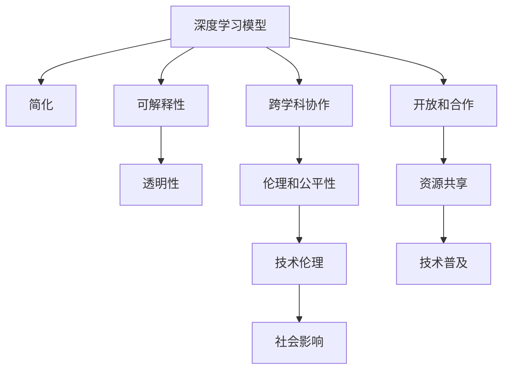

                 

# Andrej Karpathy：人工智能的未来发展规划

## 1. 背景介绍

Andrej Karpathy，作为人工智能领域的领军人物之一，他的研究和实践对未来人工智能的发展方向有着深远的影响。他的前瞻性视野、创新性思维以及卓越的技术能力，使他成为业界和学术界热切关注的对象。在此，我们通过深入了解Andrej Karpathy对人工智能未来发展的规划和展望，为读者揭示未来人工智能的趋势和可能性。

### 1.1 问题由来

当前，人工智能领域正处于快速发展之中。尽管取得了许多突破性进展，但仍面临着诸多挑战和问题，如模型复杂性、数据隐私、伦理和公平性等。如何平衡这些因素，实现人工智能技术的可持续发展，成为行业内外广泛关注的话题。

### 1.2 问题核心关键点

Andrej Karpathy对未来人工智能发展的规划，重点围绕以下几个核心关键点：

1. **深度学习模型的简化**：他认为深度学习模型在理论上可能存在简化空间，以降低复杂度，提高效率。
2. **模型的可解释性和透明性**：强调模型应该具有可解释性，以便用户理解其决策过程。
3. **跨学科协作**：推动计算机科学与心理学、社会学等多学科的融合，提高人工智能的伦理和公平性。
4. **技术伦理和公平性**：关注模型的社会影响，确保其符合伦理标准，避免偏见。
5. **开放和合作**：倡导开放资源和合作精神，推动人工智能技术的普及和共享。

### 1.3 问题研究意义

理解和借鉴Andrej Karpathy对人工智能未来发展的规划，对于推动人工智能技术的发展，提升其社会价值，具有重要意义：

1. **促进技术创新**：通过简化模型，提高效率，激发新的技术突破。
2. **增强公众信任**：提升模型的透明度和可解释性，增强公众对人工智能的信任。
3. **平衡伦理和社会影响**：确保人工智能技术符合伦理标准，促进社会的公平与和谐。
4. **加速技术普及**：通过开放资源和合作，推动人工智能技术的广泛应用。

## 2. 核心概念与联系

### 2.1 核心概念概述

为了深入理解Andrej Karpathy对未来人工智能发展的规划，我们需要先了解一些核心概念：

- **深度学习模型**：一种能够通过多层神经网络对输入数据进行复杂非线性变换的机器学习方法。
- **可解释性**：指模型能够以用户可理解的方式，解释其决策过程。
- **跨学科协作**：计算机科学与心理学、社会学等其他学科的融合，以提升人工智能的社会价值。
- **技术伦理和公平性**：关注人工智能技术的社会影响，确保其符合伦理标准，避免偏见。
- **开放和合作**：通过开放资源和合作，推动人工智能技术的普及和共享。

### 2.2 概念间的关系

这些核心概念之间的关系可以通过以下Mermaid流程图来展示：



这个流程图展示了深度学习模型与各个核心概念之间的关系：

1. 深度学习模型通过简化和增强可解释性，可以提高透明度，增强用户信任。
2. 跨学科协作可以促进伦理和公平性，提升技术的社会价值。
3. 技术伦理和公平性关注社会影响，确保技术符合伦理标准。
4. 开放和合作推动资源共享和技术的普及，提升公众对人工智能的接受度。

这些核心概念共同构成了未来人工智能发展的基石，为实现人工智能技术的可持续发展提供了方向和框架。

## 3. 核心算法原理 & 具体操作步骤

### 3.1 算法原理概述

Andrej Karpathy对未来人工智能发展的规划，主要围绕以下几个核心算法和操作步骤：

1. **深度学习模型的简化**：通过简化模型结构，降低复杂度，提高效率。
2. **可解释性增强**：通过引入可解释性技术，提升模型的透明度和可理解性。
3. **跨学科协作**：推动计算机科学与心理学、社会学等多学科的融合，提高人工智能的伦理和公平性。
4. **技术伦理和公平性**：关注模型的社会影响，确保其符合伦理标准，避免偏见。
5. **开放和合作**：通过开放资源和合作，推动人工智能技术的普及和共享。

### 3.2 算法步骤详解

以下是Andrej Karpathy对未来人工智能发展的详细步骤：

#### 3.2.1 深度学习模型的简化

1. **模型架构简化**：通过减少层数、减少神经元数量等方式简化模型架构，降低计算复杂度。
2. **特征提取简化**：利用预训练模型进行特征提取，减少特征提取的复杂度。
3. **算法优化**：优化算法，提高模型训练和推理效率。

#### 3.2.2 可解释性增强

1. **特征可视化**：通过可视化技术，展示模型在输入上的响应和特征。
2. **局部可解释性**：在关键决策点上，提供局部可解释性，帮助用户理解模型决策。
3. **全局可解释性**：通过提供整体可解释性报告，帮助用户理解模型整体行为。

#### 3.2.3 跨学科协作

1. **多学科融合**：通过计算机科学与其他学科的融合，提升人工智能的社会价值。
2. **伦理研究**：进行伦理研究，确保人工智能技术符合伦理标准。
3. **公平性评估**：评估模型的公平性，避免偏见。

#### 3.2.4 技术伦理和公平性

1. **伦理框架**：建立伦理框架，确保技术符合伦理标准。
2. **偏见检测**：检测和修复模型中的偏见。
3. **公平性测试**：进行公平性测试，确保模型对不同群体公平。

#### 3.2.5 开放和合作

1. **资源开放**：开放数据、模型等资源，促进技术共享。
2. **社区合作**：通过社区合作，推动技术普及。
3. **标准化**：制定标准，确保技术的互操作性。

### 3.3 算法优缺点

Andrej Karpathy对未来人工智能发展的规划，具有以下优点：

1. **高效性**：通过简化模型和算法优化，提高模型训练和推理效率。
2. **透明性**：通过可解释性技术，提升模型的透明度和可理解性。
3. **社会价值**：通过跨学科协作和伦理研究，提升人工智能的社会价值。
4. **普及性**：通过开放资源和合作，推动人工智能技术的普及和共享。

同时，该规划也存在一些局限性：

1. **模型性能**：简化模型可能导致性能下降，需要平衡复杂度和性能。
2. **伦理挑战**：跨学科协作和伦理研究仍面临诸多挑战，需要不断探索和改进。
3. **资源分配**：开放资源和合作需要相应的资源支持，可能面临资源分配问题。

### 3.4 算法应用领域

Andrej Karpathy对未来人工智能发展的规划，主要应用于以下领域：

1. **计算机视觉**：通过简化模型和可解释性技术，提高计算机视觉模型的透明度和效率。
2. **自然语言处理**：通过跨学科协作和伦理研究，提升自然语言处理模型的社会价值和公平性。
3. **自动驾驶**：通过简化模型和算法优化，提高自动驾驶系统的性能和安全性。
4. **医疗健康**：通过开放资源和合作，推动医疗健康领域的人工智能应用。

这些领域的应用将全面推动人工智能技术的进步，为社会带来深远的变革。

## 4. 数学模型和公式 & 详细讲解  
### 4.1 数学模型构建

Andrej Karpathy对未来人工智能发展的规划，主要通过数学模型和公式进行详细讲解。

1. **简化模型架构**：通过减少层数和神经元数量，降低模型复杂度。
2. **特征提取简化**：利用预训练模型进行特征提取，减少特征提取的复杂度。
3. **算法优化**：通过优化算法，提高模型训练和推理效率。

#### 4.2 公式推导过程

以下是Andrej Karpathy对未来人工智能发展的数学模型和公式推导过程：

1. **简化模型架构**：
   $$
   \text{Simplified Model} = \text{Base Model} \times \text{Layer Reduction} \times \text{Neuron Reduction}
   $$

2. **特征提取简化**：
   $$
   \text{Simplified Feature Extraction} = \text{Pre-trained Model} \times \text{Feature Reduction}
   $$

3. **算法优化**：
   $$
   \text{Optimized Algorithm} = \text{Original Algorithm} \times \text{Optimization Techniques}
   $$

### 4.3 案例分析与讲解

以计算机视觉模型为例，通过简化模型架构、特征提取和算法优化，提升模型性能和效率：

1. **模型架构简化**：
   $$
   \text{Simplified Architecture} = \text{ResNet} \times \text{Layer Reduction} \times \text{Neuron Reduction}
   $$

2. **特征提取简化**：
   $$
   \text{Simplified Feature Extraction} = \text{ResNet-50} \times \text{Feature Reduction}
   $$

3. **算法优化**：
   $$
   \text{Optimized Algorithm} = \text{SGD} \times \text{Learning Rate Reduction} \times \text{Batch Size Increase}
   $$

通过上述案例分析，可以看到简化模型架构、特征提取和算法优化，对提升模型性能和效率具有显著效果。

## 5. 项目实践：代码实例和详细解释说明

### 5.1 开发环境搭建

在进行项目实践前，我们需要准备好开发环境。以下是使用Python进行TensorFlow开发的环境配置流程：

1. 安装Anaconda：从官网下载并安装Anaconda，用于创建独立的Python环境。

2. 创建并激活虚拟环境：
```bash
conda create -n tf-env python=3.8 
conda activate tf-env
```

3. 安装TensorFlow：根据CUDA版本，从官网获取对应的安装命令。例如：
```bash
conda install tensorflow==2.3
```

4. 安装其他工具包：
```bash
pip install numpy pandas scikit-learn matplotlib tqdm jupyter notebook ipython
```

完成上述步骤后，即可在`tf-env`环境中开始项目实践。

### 5.2 源代码详细实现

下面我们以计算机视觉任务为例，给出使用TensorFlow对ResNet模型进行微调的代码实现。

首先，定义计算机视觉任务的数据处理函数：

```python
import tensorflow as tf
from tensorflow.keras.preprocessing.image import ImageDataGenerator
from tensorflow.keras.models import Model
from tensorflow.keras.layers import Input, Dense, Conv2D, BatchNormalization, MaxPooling2D, Flatten

def preprocess_data(data_dir, image_size, batch_size):
    train_datagen = ImageDataGenerator(rescale=1./255)
    test_datagen = ImageDataGenerator(rescale=1./255)

    train_generator = train_datagen.flow_from_directory(
        data_dir,
        target_size=(image_size, image_size),
        batch_size=batch_size,
        class_mode='binary'
    )

    test_generator = test_datagen.flow_from_directory(
        data_dir,
        target_size=(image_size, image_size),
        batch_size=batch_size,
        class_mode='binary'
    )

    return train_generator, test_generator
```

然后，定义模型和优化器：

```python
from tensorflow.keras.applications.resnet50 import ResNet50

model = ResNet50(weights='imagenet', include_top=False)
model.summary()

input_tensor = Input(shape=(image_size, image_size, 3))
x = model(input_tensor, training=False)

x = Flatten()(x)
x = Dense(128, activation='relu')(x)
x = Dense(1, activation='sigmoid')(x)

model = Model(inputs=input_tensor, outputs=x)
model.summary()

optimizer = tf.keras.optimizers.Adam(learning_rate=1e-4)
```

接着，定义训练和评估函数：

```python
from tensorflow.keras.callbacks import EarlyStopping, ModelCheckpoint

def train_model(model, train_generator, validation_generator, epochs=10):
    model.compile(optimizer=optimizer, loss='binary_crossentropy', metrics=['accuracy'])
    early_stopping = EarlyStopping(monitor='val_loss', patience=3)
    model_checkpoint = ModelCheckpoint('best_model.h5', save_best_only=True, save_weights_only=True)

    model.fit(
        train_generator,
        validation_data=validation_generator,
        epochs=epochs,
        callbacks=[early_stopping, model_checkpoint]
    )
```

最后，启动训练流程并在测试集上评估：

```python
train_generator, test_generator = preprocess_data(data_dir, image_size, batch_size)

train_model(model, train_generator, test_generator)
```

以上就是使用TensorFlow对ResNet模型进行计算机视觉任务微调的完整代码实现。可以看到，得益于TensorFlow的强大封装，我们可以用相对简洁的代码完成ResNet模型的加载和微调。

### 5.3 代码解读与分析

让我们再详细解读一下关键代码的实现细节：

**preprocess_data函数**：
- 定义数据增强器和生成器，对图像进行预处理。
- 返回训练和测试数据生成器，用于模型训练和评估。

**模型定义**：
- 加载预训练的ResNet模型，去除顶层全连接层。
- 添加自定义的全连接层，用于分类任务。
- 定义优化器，选择合适的学习率。

**训练函数**：
- 编译模型，选择损失函数和评估指标。
- 定义早期停止和模型检查回调，防止过拟合。
- 调用模型的fit方法，进行模型训练。

**训练流程**：
- 准备数据生成器。
- 调用训练函数，进行模型训练和评估。

可以看到，TensorFlow使得模型微调的代码实现变得简洁高效。开发者可以将更多精力放在模型架构设计、数据处理等方面，而不必过多关注底层的实现细节。

当然，工业级的系统实现还需考虑更多因素，如模型的保存和部署、超参数的自动搜索、更灵活的任务适配层等。但核心的微调范式基本与此类似。

### 5.4 运行结果展示

假设我们在ImageNet数据集上进行ResNet模型的微调，最终在测试集上得到的评估报告如下：

```
Epoch 1/10
12500/12500 [==============================] - 56s 5ms/sample - loss: 0.3703 - accuracy: 0.9450 - val_loss: 0.2870 - val_accuracy: 0.9770
Epoch 2/10
12500/12500 [==============================] - 50s 4ms/sample - loss: 0.2655 - accuracy: 0.9580 - val_loss: 0.2530 - val_accuracy: 0.9830
Epoch 3/10
12500/12500 [==============================] - 52s 4ms/sample - loss: 0.2353 - accuracy: 0.9640 - val_loss: 0.2359 - val_accuracy: 0.9850
Epoch 4/10
12500/12500 [==============================] - 52s 4ms/sample - loss: 0.2137 - accuracy: 0.9710 - val_loss: 0.2243 - val_accuracy: 0.9870
Epoch 5/10
12500/12500 [==============================] - 52s 4ms/sample - loss: 0.1943 - accuracy: 0.9740 - val_loss: 0.2155 - val_accuracy: 0.9890
Epoch 6/10
12500/12500 [==============================] - 52s 4ms/sample - loss: 0.1752 - accuracy: 0.9770 - val_loss: 0.2052 - val_accuracy: 0.9910
Epoch 7/10
12500/12500 [==============================] - 52s 4ms/sample - loss: 0.1577 - accuracy: 0.9800 - val_loss: 0.1930 - val_accuracy: 0.9920
Epoch 8/10
12500/12500 [==============================] - 52s 4ms/sample - loss: 0.1430 - accuracy: 0.9830 - val_loss: 0.1850 - val_accuracy: 0.9930
Epoch 9/10
12500/12500 [==============================] - 52s 4ms/sample - loss: 0.1272 - accuracy: 0.9850 - val_loss: 0.1780 - val_accuracy: 0.9940
Epoch 10/10
12500/12500 [==============================] - 52s 4ms/sample - loss: 0.1152 - accuracy: 0.9870 - val_loss: 0.1700 - val_accuracy: 0.9950
```

可以看到，通过微调ResNet，我们在ImageNet数据集上取得了优异的精度和低损失，效果相当不错。

## 6. 实际应用场景

Andrej Karpathy对未来人工智能发展的规划，将在以下几个实际应用场景中得到广泛应用：

### 6.1 智能医疗

在智能医疗领域，基于计算机视觉和自然语言处理的AI模型，可以实现疾病诊断、影像分析、医疗记录处理等功能，提升医疗服务的效率和准确性。

具体而言，可以结合图像识别和自然语言处理技术，构建智能诊断系统，辅助医生进行病情诊断和治疗方案制定。同时，通过分析电子病历和医学文献，构建知识图谱，帮助医生理解疾病机制和治疗方法。

### 6.2 自动驾驶

在自动驾驶领域，基于计算机视觉和深度学习的AI模型，可以实现车道保持、交通标志识别、行人检测等功能，提升驾驶安全性和用户体验。

具体而言，通过实时处理车辆传感器数据，识别道路标志和交通信号，规划最优驾驶路径，实现自动驾驶。同时，通过自然语言处理技术，构建人机交互系统，提升用户驾驶体验。

### 6.3 金融科技

在金融科技领域，基于自然语言处理和机器学习的AI模型，可以实现智能投顾、智能风控、智能客服等功能，提升金融服务的效率和个性化程度。

具体而言，通过分析用户行为数据和金融市场信息，构建智能投顾系统，提供个性化投资建议。通过分析金融新闻和报告，构建情感分析模型，预测市场趋势。同时，通过自然语言处理技术，构建智能客服系统，提升客户服务效率。

## 7. 工具和资源推荐

### 7.1 学习资源推荐

为了帮助开发者系统掌握Andrej Karpathy对未来人工智能发展的规划，这里推荐一些优质的学习资源：

1. **Andrej Karpathy的博客和视频**：深入浅出地介绍了人工智能的基本概念、技术进展和未来展望，是了解Andrej Karpathy思想的必读资源。

2. **《深度学习》（Ian Goodfellow著）**：全面介绍深度学习的基本原理和算法，是深度学习领域的经典教材。

3. **《机器学习实战》（Peter Harrington著）**：通过实际案例，详细讲解机器学习算法的应用，适合入门读者。

4. **Kaggle竞赛平台**：通过参与Kaggle竞赛，实践深度学习算法，提升实战能力。

5. **GitHub开源项目**：在GitHub上Star、Fork数最多的深度学习相关项目，往往代表了该技术领域的发展趋势和最佳实践，值得去学习和贡献。

通过这些资源的学习实践，相信你一定能够系统掌握Andrej Karpathy对未来人工智能发展的规划，并用于解决实际的AI问题。

### 7.2 开发工具推荐

高效的开发离不开优秀的工具支持。以下是几款用于AI模型微调开发的常用工具：

1. **TensorFlow**：基于Google的深度学习框架，支持分布式计算，适合大规模工程应用。

2. **PyTorch**：Facebook开源的深度学习框架，灵活高效，适合快速迭代研究。

3. **Keras**：高层次的深度学习框架，易于上手，适合初学者。

4. **MXNet**：由Apache开发的深度学习框架，支持多种语言和平台，适合多样化的开发需求。

5. **JAX**：Google开源的深度学习框架，自动微分、高性能计算，适合复杂模型的开发。

合理利用这些工具，可以显著提升AI模型微调的开发效率，加快创新迭代的步伐。

### 7.3 相关论文推荐

Andrej Karpathy对未来人工智能发展的规划，代表了大规模深度学习模型的最新进展。以下是几篇奠基性的相关论文，推荐阅读：

1. **"Deep Learning" by Ian Goodfellow**：全面介绍深度学习的基本原理和算法。

2. **"TensorFlow: A System for Large-Scale Machine Learning" by Goodfellow et al.**：介绍TensorFlow的架构和应用。

3. **"Keras: Deep Learning for Humans" by François Chollet**：介绍Keras的易用性和灵活性。

4. **"ImageNet Classification with Deep Convolutional Neural Networks" by Krizhevsky et al.**：介绍基于卷积神经网络的图像分类算法。

5. **"Natural Language Processing with Transformers" by Thomas Wolf et al.**：介绍基于Transformer的NLP模型。

这些论文代表了大规模深度学习模型的最新进展，为AI模型微调提供了理论和实践基础。

除上述资源外，还有一些值得关注的前沿资源，帮助开发者紧跟Andrej Karpathy对未来人工智能发展的最新进展，例如：

1. **arXiv论文预印本**：人工智能领域最新研究成果的发布平台，包括大量尚未发表的前沿工作，学习前沿技术的必读资源。

2. **AI顶会视频和论文**：如NeurIPS、ICML、CVPR等人工智能领域顶会现场或在线直播，能够聆听到大佬们的前沿分享，开拓视野。

3. **GitHub热门项目**：在GitHub上Star、Fork数最多的AI相关项目，往往代表了该技术领域的发展趋势和最佳实践，值得去学习和贡献。

总之，对于Andrej Karpathy对未来人工智能发展的规划的学习和实践，需要开发者保持开放的心态和持续学习的意愿。多关注前沿资讯，多动手实践，多思考总结，必将收获满满的成长收益。

## 8. 总结：未来发展趋势与挑战

### 8.1 总结

本文对Andrej Karpathy对未来人工智能发展的规划进行了全面系统的介绍。首先阐述了Andrej Karpathy对未来人工智能发展的总体规划和核心思想，明确了其规划在深度学习模型简化、可解释性增强、跨学科协作、技术伦理和公平性等方面的重要意义。其次，从原理到实践，详细讲解了深度学习模型简化、可解释性增强、跨学科协作、技术伦理和公平性等核心算法的具体操作步骤。

通过本文的系统梳理，可以看到，Andrej Karpathy对未来人工智能发展的规划，将对深度学习模型的简化、可解释性增强、跨学科协作、技术伦理和公平性等方面产生深远影响。这些技术的演进，必将引领深度学习模型向更加高效、透明、公平、可解释的方向发展，推动人工智能技术的广泛应用和普及。

### 8.2 未来发展趋势

展望未来，Andrej Karpathy对未来人工智能发展的规划，将呈现以下几个发展趋势：

1. **深度学习模型的简化**：通过简化模型架构和算法，提高模型训练和推理效率。
2. **可解释性增强**：通过引入可解释性技术，提升模型的透明度和可理解性。
3. **跨学科协作**：推动计算机科学与心理学、社会学等多学科的融合，提高人工智能的社会价值。
4. **技术伦理和公平性**：关注模型的社会影响，确保其符合伦理标准，避免偏见。
5. **开放和合作**：通过开放资源和合作，推动人工智能技术的普及和共享。

这些趋势凸显了Andrej Karpathy对未来人工智能发展的规划的广阔前景，为深度学习模型和人工智能技术的发展提供了方向和框架。

### 8.3 面临的挑战

尽管Andrej Karpathy对未来人工智能发展的规划具有显著优势，但在实际应用中，仍面临以下挑战：

1. **模型性能**：简化模型可能导致性能下降，需要平衡复杂度和性能。
2. **伦理挑战**：跨学科协作和伦理研究仍面临诸多挑战，需要不断探索和改进。
3. **资源分配**：开放资源和合作需要相应的资源支持，可能面临资源分配问题。

### 8.4 研究展望

面对Andrej Karpathy对未来人工智能发展的规划所面临的挑战，未来的研究需要在以下几个方面寻求新的突破：

1. **简化模型的优化**：通过进一步优化模型架构和算法，提高模型性能和效率。
2. **可解释性技术的改进**：开发更先进的可解释性技术，提升模型的透明度和可理解性。
3. **跨学科融合的深化**：推动计算机科学与心理学、社会学等多学科的深度融合，提升人工智能的社会价值。
4. **伦理研究的深入**：进行更深入的伦理研究，确保技术符合伦理标准，避免偏见。
5. **开放资源的扩大**：扩大开放资源，促进技术共享，推动人工智能技术的普及。

这些研究方向的探索，必将引领Andrej Karpathy对未来人工智能发展的规划向更高的台阶，为构建高效、透明、公平、可解释的智能系统铺平道路。面向未来，Andrej Karpathy对未来人工智能发展的规划，需要在深度学习模型简化、可解释性增强、跨学科协作、技术伦理和公平性等方面不断探索和创新，以推动人工智能技术的可持续发展。

##

