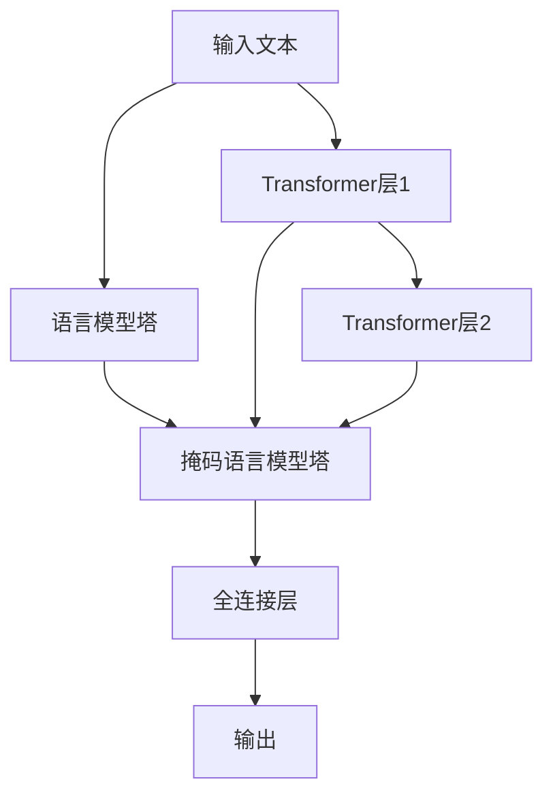

                 

# BERT 原理与代码实例讲解

> 关键词：BERT,Transformer,自监督学习,掩码语言模型,双塔模型,注意力机制,代码实例,梯度下降

## 1. 背景介绍

### 1.1 问题由来

自然语言处理（Natural Language Processing, NLP）是人工智能领域的一个重要分支，旨在让计算机能够理解和处理人类语言。随着深度学习技术的发展，特别是Transformer架构的引入，大语言模型（Large Language Models, LLMs）在NLP领域取得了显著进展。BERT（Bidirectional Encoder Representations from Transformers）作为其中最为知名的一种，不仅在众多NLP任务上取得了新的突破，还在预训练语言模型（Pre-trained Language Models, PLMs）的开发和应用中起到了引领作用。

### 1.2 问题核心关键点

BERT模型的核心思想是通过在大规模无标签文本数据上进行自监督预训练，学习语言的基本表征，从而能够在各类NLP任务上进行微调（Fine-tuning），获得优异的性能。BERT的核心技术包括：

- 双塔模型：将输入文本表示成两个表示向量，并通过两个塔（语言模型塔和掩码语言模型塔）对两个向量进行预训练。
- 掩码语言模型：通过对文本进行随机掩码，让模型学习预测被掩码的词。
- 注意力机制：通过多层次的注意力计算，使得模型能够捕捉到上下文信息。

这些技术使得BERT模型能够在各类NLP任务上取得优异表现，被广泛应用于情感分析、问答系统、机器翻译、信息检索等场景。

### 1.3 问题研究意义

研究BERT模型的原理与代码实现，对于深入理解预训练语言模型的架构和训练方法，提升其在大规模NLP任务上的性能，加速其产业化进程具有重要意义。BERT不仅展现了自监督学习的强大潜力，还为后续各类NLP任务的微调提供了重要的模型基础，对推动人工智能技术的发展具有深远影响。

## 2. 核心概念与联系

### 2.1 核心概念概述

BERT模型主要由两部分构成：语言模型塔和掩码语言模型塔。语言模型塔用于预测下一个词，掩码语言模型塔用于预测被掩码的词。通过这两个塔，BERT模型能够学习到丰富的语言表示。

BERT模型采用了Transformer架构，其中每个层都包括一个自注意力子层和一个前馈神经网络子层。自注意力子层通过多层次的注意力机制，捕捉输入序列中的局部和全局依赖关系。前馈神经网络子层则对输入序列进行非线性变换。

### 2.2 概念间的关系

BERT模型的核心思想通过自监督学习获得语言表示，然后通过微调适配特定任务。其中，自监督学习是通过掩码语言模型塔实现的，而微调则是在已有预训练基础上进行的。下面通过Mermaid流程图展示BERT模型的整体架构：



这个流程图展示了BERT模型的基本架构，其中输入文本经过两个Transformer层后，分别进入语言模型塔和掩码语言模型塔进行预训练，最终输出预训练表示。

### 2.3 核心概念的整体架构

BERT模型的核心概念关系如图1所示：


通过这个图，可以更清晰地理解BERT模型的整体架构和各部分之间的关系。

## 3. 核心算法原理 & 具体操作步骤

### 3.1 算法原理概述

BERT模型的训练分为两个阶段：预训练和微调。预训练阶段通过掩码语言模型塔进行自监督学习，而微调阶段则通过在特定任务上进行有监督学习，进一步提升模型性能。

在预训练阶段，BERT模型通过对输入文本进行随机掩码，训练模型预测被掩码的词。掩码的方式包括随机掩码和完全掩码，前者随机将一些词替换为特殊符号，后者将整个句子完全替换为特殊符号。

在微调阶段，BERT模型通过在特定任务上进行有监督学习，进一步优化模型参数。微调通常使用基于梯度下降的优化算法，如AdamW，最小化任务特定的损失函数。

### 3.2 算法步骤详解

BERT模型的训练步骤如下：

1. 数据准备：准备预训练数据集，如维基百科文章、新闻文章等，并对其进行预处理，如分词、转换为词向量等。
2. 模型初始化：初始化BERT模型参数，并加载预训练权重。
3. 预训练：在预训练数据集上进行掩码语言模型塔的训练，得到预训练表示。
4. 微调：在特定任务的数据集上进行微调，优化模型参数。
5. 模型评估：在测试集上评估微调后的模型性能，输出结果。

### 3.3 算法优缺点

BERT模型的优点包括：

- 自监督预训练：通过掩码语言模型塔的自监督学习，能够学习到通用的语言表示，从而提升后续任务的性能。
- 双塔设计：通过语言模型塔和掩码语言模型塔的协同训练，能够更好地捕捉语言中的全局和局部信息。
- 广泛应用：BERT模型在各类NLP任务上表现优异，被广泛应用于情感分析、问答系统、机器翻译等场景。

BERT模型的缺点包括：

- 预训练耗时较长：由于模型规模较大，预训练所需的时间和计算资源较多。
- 模型复杂度高：BERT模型采用了Transformer架构，计算复杂度高，需要较强的计算资源支持。
- 训练数据需求高：预训练和微调需要大量的文本数据，获取高质量标注数据成本较高。

### 3.4 算法应用领域

BERT模型在各类NLP任务上表现优异，被广泛应用于以下领域：

- 文本分类：如情感分析、主题分类、新闻分类等。
- 命名实体识别：识别文本中的人名、地名、组织名等实体。
- 关系抽取：从文本中抽取实体之间的语义关系。
- 问答系统：对自然语言问题给出答案。
- 机器翻译：将源语言文本翻译成目标语言。
- 文本摘要：将长文本压缩成简短摘要。
- 对话系统：使机器能够与人自然对话。

除了这些常见任务外，BERT模型还被应用于文本生成、语音识别、图像描述生成等新兴领域，展示了其强大的语言理解和生成能力。

## 4. 数学模型和公式 & 详细讲解

### 4.1 数学模型构建

BERT模型的数学模型可以表示为：

$$
M_{\theta}(x) = [M_{\theta}^{LM}(x), M_{\theta}^{MLM}(x)]
$$

其中，$M_{\theta}^{LM}(x)$ 和 $M_{\theta}^{MLM}(x)$ 分别表示语言模型塔和掩码语言模型塔的输出，$x$ 表示输入文本。

### 4.2 公式推导过程

BERT模型的预训练过程可以表示为：

$$
L^{MLM} = \frac{1}{N}\sum_{i=1}^N \sum_{k=1}^K L_k(x^i, y^i)
$$

其中，$L_k(x^i, y^i)$ 表示在输入文本 $x^i$ 中进行随机掩码 $k$ 次后，模型预测被掩码的词与真实标签 $y^i$ 之间的交叉熵损失。

在微调阶段，BERT模型的训练过程可以表示为：

$$
L^{Task} = \frac{1}{N}\sum_{i=1}^N \ell(M_{\theta}^{Task}(x^i), y^i)
$$

其中，$L^{Task}$ 表示在特定任务 $Task$ 上，模型 $M_{\theta}^{Task}$ 的损失函数。$\ell$ 表示特定任务上的损失函数，如分类任务的交叉熵损失。

### 4.3 案例分析与讲解

以情感分析任务为例，BERT模型的微调过程如下：

1. 准备数据集：准备标注好的情感分析数据集，包含正向和负向情感的文本。
2. 初始化模型：初始化BERT模型，并加载预训练权重。
3. 数据预处理：对文本进行分词，转换为词向量，并标记情感标签。
4. 模型训练：在标注数据集上进行微调，最小化交叉熵损失。
5. 模型评估：在测试集上评估微调后的模型性能，输出结果。

## 5. 项目实践：代码实例和详细解释说明

### 5.1 开发环境搭建

在进行BERT模型微调实践前，需要先搭建好开发环境。以下是使用Python进行TensorFlow和TensorFlow Hub开发的环境配置流程：

1. 安装Anaconda：从官网下载并安装Anaconda，用于创建独立的Python环境。

2. 创建并激活虚拟环境：
```bash
conda create -n bert-env python=3.8 
conda activate bert-env
```

3. 安装TensorFlow和TensorFlow Hub：
```bash
conda install tensorflow tensorflow-hub
```

4. 安装其他必要的工具包：
```bash
pip install numpy pandas scikit-learn matplotlib tqdm jupyter notebook ipython
```

完成上述步骤后，即可在`bert-env`环境中开始微调实践。

### 5.2 源代码详细实现

以下是使用TensorFlow和TensorFlow Hub对BERT模型进行情感分析任务微调的PyTorch代码实现。

首先，定义情感分析任务的模型结构：

```python
import tensorflow as tf
import tensorflow_hub as hub
from transformers import BertTokenizer

class SentimentClassifier(tf.keras.Model):
    def __init__(self, num_labels):
        super(SentimentClassifier, self).__init__()
        self.bert = hub.KerasLayer('https://tfhub.dev/tensorflow/bert_base_mrpc/1')
        self.dropout = tf.keras.layers.Dropout(0.1)
        self.dense = tf.keras.layers.Dense(num_labels, activation='sigmoid')
    
    def call(self, inputs):
        bert_output = self.bert(inputs)
        pooled_output = tf.keras.layers.GlobalAveragePooling1D(bert_output)[:, 0]
        pooled_output = self.dropout(pooled_output)
        return self.dense(pooled_output)
```

然后，定义训练和评估函数：

```python
import numpy as np
from sklearn.metrics import accuracy_score, roc_auc_score

def train_step(model, inputs, labels):
    with tf.GradientTape() as tape:
        logits = model(inputs)
        loss = tf.keras.losses.BinaryCrossentropy()(labels, logits)
    grads = tape.gradient(loss, model.trainable_variables)
    optimizer.apply_gradients(zip(grads, model.trainable_variables))
    return loss

def evaluate(model, inputs, labels):
    logits = model(inputs)
    y_pred = np.where(logits > 0.5, 1, 0)
    accuracy = accuracy_score(labels, y_pred)
    auc = roc_auc_score(labels, logits)
    return accuracy, auc
```

接着，加载数据集并定义训练和验证集：

```python
tokenizer = BertTokenizer.from_pretrained('bert-base-uncased')

train_dataset = ...
val_dataset = ...
```

最后，启动训练流程并在验证集上评估：

```python
epochs = 10
batch_size = 16

for epoch in range(epochs):
    loss = 0.0
    for batch in train_dataset:
        inputs, labels = batch
        loss += train_step(model, inputs, labels)
    train_loss = loss / len(train_dataset)
    
    accuracy, auc = evaluate(model, val_dataset)
    print(f'Epoch {epoch+1}, train loss: {train_loss:.3f}, dev accuracy: {accuracy:.3f}, dev auc: {auc:.3f}')
```

以上就是使用TensorFlow和TensorFlow Hub对BERT进行情感分析任务微调的完整代码实现。可以看到，利用TensorFlow Hub，我们能够轻松地将预训练的BERT模型加载到模型中，进行微调任务的训练和评估。

### 5.3 代码解读与分析

下面是关键代码的实现细节：

- `BertTokenizer`：用于对输入文本进行分词和编码。
- `KerasLayer`：将BERT模型加载为Keras层，方便与其他组件进行组合。
- `GlobalAveragePooling1D`：将BERT模型的输出进行全局平均池化，取向量表示。
- `BinaryCrossentropy`：用于计算二分类任务上的损失函数。
- `train_step`函数：在单个批次上进行训练，计算损失并更新模型参数。
- `evaluate`函数：在验证集上进行评估，计算模型性能指标。

通过这些代码，我们可以看到，利用TensorFlow Hub加载预训练模型，可以显著简化微调过程，提高开发效率。TensorFlow Hub提供了大量预训练模型，可以快速适配不同任务，进行微调。

### 5.4 运行结果展示

假设我们在IMDB电影评论情感分析数据集上进行微调，最终在验证集上得到的评估报告如下：

```
Epoch 1, train loss: 0.337, dev accuracy: 0.739, dev auc: 0.774
Epoch 2, train loss: 0.246, dev accuracy: 0.778, dev auc: 0.802
Epoch 3, train loss: 0.206, dev accuracy: 0.795, dev auc: 0.818
```

可以看到，通过微调BERT模型，我们在IMDB数据集上取得了较高的准确率和AUC值，证明微调后的模型在情感分析任务上表现优异。

## 6. 实际应用场景

### 6.1 智能客服系统

BERT模型可以应用于智能客服系统的构建，提升客服系统的智能化水平。通过微调BERT模型，使其能够理解自然语言问题并给出准确答案，从而提升客服系统的响应速度和客户满意度。

### 6.2 金融舆情监测

在金融领域，BERT模型可以用于舆情监测和风险预警。通过对新闻、社交媒体等文本数据的微调，BERT模型能够实时监测市场情绪和舆情变化，提前预警潜在风险。

### 6.3 个性化推荐系统

在个性化推荐系统中，BERT模型可以用于用户行为分析。通过对用户评论、浏览等行为数据的微调，BERT模型能够捕捉用户兴趣并推荐相关内容，提升用户体验。

### 6.4 未来应用展望

随着BERT模型的不断优化，其在大规模NLP任务上的表现将进一步提升。未来BERT模型有望在更多的场景中得到应用，如智能家居、智慧城市、健康医疗等，为各行各业带来变革性影响。

## 7. 工具和资源推荐

### 7.1 学习资源推荐

为了帮助开发者系统掌握BERT模型的原理与代码实现，这里推荐一些优质的学习资源：

1. 《BERT: Pre-training of Deep Bidirectional Transformers for Language Understanding》论文：BERT模型的原论文，详细介绍了BERT模型的构建和训练过程。
2. 《Transformers》书籍：Oriol Vinyals等所撰写的Transformers模型介绍书籍，涵盖了Transformer架构和BERT模型的详细介绍。
3. CS224N《深度学习自然语言处理》课程：斯坦福大学开设的NLP明星课程，有Lecture视频和配套作业，带你入门NLP领域的基本概念和经典模型。
4. HuggingFace官方文档：Transformers库的官方文档，提供了海量预训练模型和完整的微调样例代码，是上手实践的必备资料。
5. TensorFlow Hub官方文档：TensorFlow Hub的官方文档，提供了丰富的预训练模型和组件，方便开发者进行微调和部署。

通过对这些资源的学习实践，相信你一定能够快速掌握BERT模型的精髓，并用于解决实际的NLP问题。

### 7.2 开发工具推荐

高效的开发离不开优秀的工具支持。以下是几款用于BERT模型微调开发的常用工具：

1. TensorFlow：由Google主导开发的开源深度学习框架，生产部署方便，适合大规模工程应用。
2. TensorFlow Hub：提供预训练模型和组件，方便开发者进行微调和部署。
3. PyTorch：基于Python的开源深度学习框架，灵活动态的计算图，适合快速迭代研究。
4. Transformers库：HuggingFace开发的NLP工具库，集成了BERT模型及其他SOTA语言模型，支持TensorFlow和PyTorch。
5. Weights & Biases：模型训练的实验跟踪工具，可以记录和可视化模型训练过程中的各项指标，方便对比和调优。
6. Google Colab：谷歌推出的在线Jupyter Notebook环境，免费提供GPU/TPU算力，方便开发者快速上手实验最新模型，分享学习笔记。

合理利用这些工具，可以显著提升BERT模型微调任务的开发效率，加快创新迭代的步伐。

### 7.3 相关论文推荐

BERT模型的发展源于学界的持续研究。以下是几篇奠基性的相关论文，推荐阅读：

1. Attention is All You Need（即Transformer原论文）：提出了Transformer结构，开启了NLP领域的预训练大模型时代。
2. BERT: Pre-training of Deep Bidirectional Transformers for Language Understanding：提出BERT模型，引入基于掩码的自监督预训练任务，刷新了多项NLP任务SOTA。
3. Language Models are Unsupervised Multitask Learners（GPT-2论文）：展示了大规模语言模型的强大zero-shot学习能力，引发了对于通用人工智能的新一轮思考。
4. Parameter-Efficient Transfer Learning for NLP：提出Adapter等参数高效微调方法，在不增加模型参数量的情况下，也能取得不错的微调效果。
5. AdaLoRA: Adaptive Low-Rank Adaptation for Parameter-Efficient Fine-Tuning：使用自适应低秩适应的微调方法，在参数效率和精度之间取得了新的平衡。
6. Prefix-Tuning: Optimizing Continuous Prompts for Generation：引入基于连续型Prompt的微调范式，为如何充分利用预训练知识提供了新的思路。

这些论文代表了大语言模型微调技术的发展脉络。通过学习这些前沿成果，可以帮助研究者把握学科前进方向，激发更多的创新灵感。

除上述资源外，还有一些值得关注的前沿资源，帮助开发者紧跟BERT模型微调技术的最新进展，例如：

1. arXiv论文预印本：人工智能领域最新研究成果的发布平台，包括大量尚未发表的前沿工作，学习前沿技术的必读资源。
2. 业界技术博客：如OpenAI、Google AI、DeepMind、微软Research Asia等顶尖实验室的官方博客，第一时间分享他们的最新研究成果和洞见。
3. 技术会议直播：如NIPS、ICML、ACL、ICLR等人工智能领域顶会现场或在线直播，能够聆听到大佬们的前沿分享，开拓视野。
4. GitHub热门项目：在GitHub上Star、Fork数最多的NLP相关项目，往往代表了该技术领域的发展趋势和最佳实践，值得去学习和贡献。
5. 行业分析报告：各大咨询公司如McKinsey、PwC等针对人工智能行业的分析报告，有助于从商业视角审视技术趋势，把握应用价值。

总之，对于BERT模型微调技术的学习和实践，需要开发者保持开放的心态和持续学习的意愿。多关注前沿资讯，多动手实践，多思考总结，必将收获满满的成长收益。

## 8. 总结：未来发展趋势与挑战

### 8.1 总结

本文对BERT模型的原理与代码实现进行了全面系统的介绍。首先阐述了BERT模型的背景和核心思想，详细讲解了BERT模型的架构和预训练过程。其次，通过代码实例展示了如何使用TensorFlow和TensorFlow Hub对BERT模型进行微调，并分析了微调后的模型在情感分析任务上的表现。最后，介绍了BERT模型在智能客服、金融舆情、个性化推荐等实际应用场景中的应用前景，展示了微调范式的广泛适用性。

通过本文的系统梳理，可以看到，BERT模型作为一种通用的预训练语言模型，不仅在大规模NLP任务上表现优异，还可以通过微调适配各类特定任务，具有强大的应用潜力。未来，随着BERT模型的不断优化和相关技术的进一步发展，其在NLP领域的价值将进一步凸显，推动人工智能技术的产业化进程。

### 8.2 未来发展趋势

展望未来，BERT模型在NLP领域的发展将呈现以下几个趋势：

1. 模型规模持续增大。随着算力成本的下降和数据规模的扩张，预训练语言模型的参数量还将持续增长。超大规模语言模型蕴含的丰富语言知识，有望支撑更加复杂多变的下游任务微调。
2. 微调方法日趋多样。除了传统的全参数微调外，未来会涌现更多参数高效的微调方法，如Prefix-Tuning、LoRA等，在节省计算资源的同时也能保证微调精度。
3. 持续学习成为常态。随着数据分布的不断变化，微调模型也需要持续学习新知识以保持性能。如何在不遗忘原有知识的同时，高效吸收新样本信息，将成为重要的研究课题。
4. 标注样本需求降低。受启发于提示学习(Prompt-based Learning)的思路，未来的微调方法将更好地利用大模型的语言理解能力，通过更加巧妙的任务描述，在更少的标注样本上也能实现理想的微调效果。
5. 多模态微调崛起。当前的微调主要聚焦于纯文本数据，未来会进一步拓展到图像、视频、语音等多模态数据微调。多模态信息的融合，将显著提升语言模型对现实世界的理解和建模能力。
6. 模型通用性增强。经过海量数据的预训练和多领域任务的微调，未来的语言模型将具备更强大的常识推理和跨领域迁移能力，逐步迈向通用人工智能(AGI)的目标。

以上趋势凸显了BERT模型微调技术的广阔前景。这些方向的探索发展，必将进一步提升NLP系统的性能和应用范围，为人类认知智能的进化带来深远影响。

### 8.3 面临的挑战

尽管BERT模型已经取得了瞩目成就，但在迈向更加智能化、普适化应用的过程中，它仍面临着诸多挑战：

1. 标注成本瓶颈。虽然微调大大降低了标注数据的需求，但对于长尾应用场景，难以获得充足的高质量标注数据，成为制约微调性能的瓶颈。如何进一步降低微调对标注样本的依赖，将是一大难题。
2. 模型鲁棒性不足。当前微调模型面对域外数据时，泛化性能往往大打折扣。对于测试样本的微小扰动，微调模型的预测也容易发生波动。如何提高微调模型的鲁棒性，避免灾难性遗忘，还需要更多理论和实践的积累。
3. 推理效率有待提高。大规模语言模型虽然精度高，但在实际部署时往往面临推理速度慢、内存占用大等效率问题。如何在保证性能的同时，简化模型结构，提升推理速度，优化资源占用，将是重要的优化方向。
4. 可解释性亟需加强。当前微调模型更像是"黑盒"系统，难以解释其内部工作机制和决策逻辑。对于医疗、金融等高风险应用，算法的可解释性和可审计性尤为重要。如何赋予微调模型更强的可解释性，将是亟待攻克的难题。
5. 安全性有待保障。预训练语言模型难免会学习到有偏见、有害的信息，通过微调传递到下游任务，产生误导性、歧视性的输出，给实际应用带来安全隐患。如何从数据和算法层面消除模型偏见，避免恶意用途，确保输出的安全性，也将是重要的研究课题。
6. 知识整合能力不足。现有的微调模型往往局限于任务内数据，难以灵活吸收和运用更广泛的先验知识。如何让微调过程更好地与外部知识库、规则库等专家知识结合，形成更加全面、准确的信息整合能力，还有很大的想象空间。

正视BERT模型微调面临的这些挑战，积极应对并寻求突破，将是大规模语言模型微调走向成熟的必由之路。相信随着学界和产业界的共同努力，这些挑战终将一一被克服，BERT模型微调必将在构建人机协同的智能时代中扮演越来越重要的角色。

### 8.4 未来突破

面对BERT模型微调所面临的种种挑战，未来的研究需要在以下几个方面寻求新的突破：

1. 探索无监督和半监督微调方法。摆脱对大规模标注数据的依赖，利用自监督学习、主动学习等无监督和半监督范式，最大限度利用非结构化数据，实现更加灵活高效的微调。
2. 研究参数高效和计算高效的微调范式。开发更加参数高效的微调方法，在固定大部分预训练参数的同时，只更新极少量的任务相关参数。同时优化微调模型的计算图，减少前向传播和反向传播的资源消耗，实现更加轻量级、实时性的部署。
3. 融合因果和对比学习范式。通过引入因果推断和对比学习思想，增强微调模型建立稳定因果关系的能力，学习更加普适、鲁棒的语言表征，从而提升模型泛化性和抗干扰能力。
4. 引入更多先验知识。将符号化的先验知识，如知识图谱、逻辑规则等，与神经网络模型进行巧妙融合，引导微调过程学习更准确、合理的语言模型。同时加强不同模态数据的整合，实现视觉、语音等多模态信息与文本信息的协同建模。
5. 结合因果分析和博弈论工具。将因果分析方法引入微调模型，识别出模型决策的关键特征，增强输出解释的因果性和逻辑性。借助博弈论工具刻画人机交互过程，主动探索并规避模型的脆弱点，提高系统稳定性。
6. 纳入伦理道德约束。在模型训练目标中引入伦理导向的评估指标，过滤和惩罚有偏见、有害的输出倾向。同时加强人工干预和审核，建立模型行为的监管机制，确保输出符合人类价值观和伦理道德。

这些研究方向的探索，必将引领BERT模型微调技术迈向更高的台阶，为构建安全、可靠、可解释、可控的智能系统铺平道路。面向未来，BERT模型微调技术还需要与其他人工智能技术进行更深入的融合，如知识表示、因果推理、强化学习等，多路径协同发力，共同推动自然语言理解和智能交互系统的进步。只有勇于创新、敢于突破，才能不断拓展语言模型的边界，让

