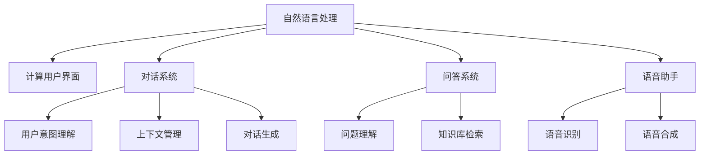

                 

# CUI如何彻底改变数字产品的交互方式

## 1. 背景介绍

在数字化时代，用户的交互方式正在发生深刻变革。传统的界面设计已经无法满足用户对信息获取、服务体验、社交互动等多方面的需求。随着自然语言处理技术的发展，计算机用户界面（Computer User Interface, CUI）逐渐成为新一代交互方式的代表，改变了传统的人机交互模式，提升了用户的整体体验。

CUI通过自然语言处理技术，让用户通过与机器的自然对话，获取信息、执行操作、解决问题，极大地提升了交互的便捷性和效率。特别是在信息获取、客户服务、智能家居、智能助手等领域，CUI技术的应用正逐步普及，并成为数字化产品的核心竞争力。

## 2. 核心概念与联系

### 2.1 核心概念概述

- **自然语言处理（Natural Language Processing, NLP）**：通过计算机对自然语言进行理解、处理和生成，使机器能够理解人类的语言，实现语言与机器之间的交流。NLP技术主要包括文本预处理、语言模型、文本分类、信息抽取等。

- **计算用户界面（CUI）**：一种通过自然语言处理技术，让用户通过自然对话方式与计算机交互的接口。CUI通过语音识别、文本处理、对话生成等技术，使计算机能够理解用户的自然语言输入，并给出相应的回答或执行操作。

- **对话系统（Conversational AI）**：利用NLP技术，使计算机能够进行人机对话的智能系统。对话系统能够理解用户意图、上下文，提供准确的回答或执行任务，实现人机自然交互。

- **问答系统（Question Answering, QA）**：一种能够理解用户提出的问题，并给出准确回答的系统。问答系统常应用于搜索引擎、客服系统、智能助手等场景。

- **语音助手（Voice Assistant）**：一种基于语音识别和自然语言处理的智能系统，通过语音交互实现各种操作和信息获取。

这些核心概念构成了CUI技术的框架，它们之间存在着紧密的联系。自然语言处理技术是CUI的基础，对话系统和问答系统是CUI的具体应用形式，而语音助手则是CUI在语音交互中的应用。

### 2.2 概念间的关系

这些核心概念之间的关系可以用以下Mermaid流程图表示：



这个流程图展示了自然语言处理技术与其他核心概念之间的关系。自然语言处理技术通过语言模型、信息抽取等手段，帮助计算机理解用户输入的自然语言，然后通过对话系统和问答系统，生成合适的回答或执行操作。语音助手则利用语音识别技术，将用户的语音输入转换为文本，再进行后续处理。

## 3. 核心算法原理 & 具体操作步骤

### 3.1 算法原理概述

CUI的核心算法原理主要包括以下几个方面：

1. **语音识别（Automatic Speech Recognition, ASR）**：将用户的语音输入转换为文本，是CUI的第一步。ASR技术主要利用深度学习模型，如卷积神经网络（CNN）、循环神经网络（RNN）、长短时记忆网络（LSTM）等，通过训练得到语音信号与文本的映射关系。

2. **意图识别（Intent Recognition）**：在理解用户输入的自然语言后，需要识别用户的具体意图，以便生成合适的回答或执行操作。意图识别通常利用文本分类、语义分析等手段，通过机器学习模型进行识别。

3. **对话管理（Dialogue Management）**：在用户与计算机对话的过程中，需要管理对话状态和上下文，以确保对话的连贯性和一致性。对话管理通常利用状态机、决策树等模型，通过规则或学习算法进行管理。

4. **上下文理解（Context Understanding）**：在对话过程中，需要理解用户的上下文信息，以便生成更准确的回答。上下文理解通常利用注意力机制、记忆网络等技术，通过模型进行上下文推理。

5. **回答生成（Answer Generation）**：在理解用户意图和上下文后，需要生成合适的回答或执行操作。回答生成通常利用生成对抗网络（GAN）、序列到序列模型（Seq2Seq）等技术，通过模型生成文本或执行操作。

6. **语音合成（Text-to-Speech, TTS）**：在语音助手等应用中，需要将计算机生成的回答转换为语音输出，以完成与用户的交互。TTS技术通常利用深度学习模型，如卷积神经网络、递归神经网络等，通过训练得到文本与语音的映射关系。

### 3.2 算法步骤详解

基于上述核心算法原理，CUI的具体操作步骤可以概括为以下几个步骤：

1. **语音输入处理**：利用ASR技术，将用户的语音输入转换为文本。

2. **意图识别**：通过意图识别模型，理解用户的意图，判断用户想要执行的操作或获取的信息。

3. **对话管理**：根据用户的意图和上下文，管理对话状态和上下文信息，确保对话的连贯性和一致性。

4. **回答生成**：根据用户的意图和上下文，生成合适的回答或执行相应的操作。

5. **语音输出处理**：对于语音助手等应用，利用TTS技术，将生成的回答转换为语音输出。

6. **用户反馈处理**：收集用户的反馈信息，进行分析和优化，以提升系统性能和用户体验。

### 3.3 算法优缺点

**优点**：

1. **自然性**：CUI技术使得计算机能够自然地与用户进行交流，提升了用户体验和满意度。

2. **高效性**：CUI技术通过自然语言处理技术，能够快速理解和处理用户的输入，提升了交互效率。

3. **普适性**：CUI技术可以应用于各种场景，如客服、智能家居、智能助手等，具有广泛的应用前景。

**缺点**：

1. **复杂性**：CUI技术涉及语音识别、意图识别、对话管理等多个子系统，系统复杂度高。

2. **准确性**：由于自然语言处理技术的局限性，CUI系统的准确性仍存在一定的提升空间。

3. **成本高**：CUI技术的开发和维护需要大量的人力和时间成本，且需要高质量的语料数据。

### 3.4 算法应用领域

CUI技术已经广泛应用于以下领域：

- **客户服务**：通过语音助手、智能客服等应用，提升客户服务的效率和质量。

- **智能家居**：通过语音控制、自然语言交互等技术，实现家居设备的智能化控制。

- **智能助手**：如Siri、Alexa等语音助手，提供日常生活中的各种帮助。

- **搜索引擎**：通过问答系统等技术，提供更智能、更自然的搜索体验。

- **医疗健康**：通过智能问答系统，提供医疗咨询和健康管理服务。

- **教育培训**：通过智能助手和问答系统，提供个性化的学习建议和答疑服务。

- **商业咨询**：通过对话系统，提供市场分析、客户咨询等商业服务。

## 4. 数学模型和公式 & 详细讲解

### 4.1 数学模型构建

CUI技术涉及多个数学模型，主要包括语音识别模型、意图识别模型、对话管理模型、回答生成模型等。以下是其中几个模型的数学模型构建：

1. **语音识别模型**：通常利用深度学习模型，如卷积神经网络（CNN）、循环神经网络（RNN）等，通过训练得到语音信号与文本的映射关系。

2. **意图识别模型**：利用文本分类、语义分析等手段，通过机器学习模型进行意图识别。常用的模型包括卷积神经网络、循环神经网络、长短时记忆网络等。

3. **对话管理模型**：利用状态机、决策树等模型，通过规则或学习算法进行对话管理。

4. **上下文理解模型**：利用注意力机制、记忆网络等技术，通过模型进行上下文推理。

5. **回答生成模型**：利用生成对抗网络（GAN）、序列到序列模型（Seq2Seq）等技术，通过模型生成文本或执行操作。

### 4.2 公式推导过程

以意图识别模型为例，其数学模型可以表示为：

$$ P(\text{Intent}|S) = \frac{P(S|\text{Intent}) P(\text{Intent})}{P(S)} $$

其中 $S$ 为用户的输入文本，$P(S|\text{Intent})$ 为给定意图 $Intent$ 下输入 $S$ 的概率，$P(\text{Intent})$ 为意图 $Intent$ 的概率，$P(S)$ 为输入 $S$ 的概率。

通过最大似然估计等方法，可以训练意图识别模型，使模型能够准确识别用户的意图。

### 4.3 案例分析与讲解

以智能客服系统为例，其工作流程可以表示为：

1. **语音输入处理**：利用ASR技术，将用户的语音输入转换为文本。

2. **意图识别**：通过意图识别模型，理解用户的意图，判断用户想要执行的操作或获取的信息。

3. **对话管理**：根据用户的意图和上下文，管理对话状态和上下文信息，确保对话的连贯性和一致性。

4. **回答生成**：根据用户的意图和上下文，生成合适的回答或执行相应的操作。

5. **语音输出处理**：对于语音助手等应用，利用TTS技术，将生成的回答转换为语音输出。

6. **用户反馈处理**：收集用户的反馈信息，进行分析和优化，以提升系统性能和用户体验。

## 5. 项目实践：代码实例和详细解释说明

### 5.1 开发环境搭建

要进行CUI项目的开发，需要安装Python、TensorFlow、PyTorch等工具和库。以下是在Linux系统中安装所需工具的命令：

```bash
sudo apt-get update
sudo apt-get install python3 python3-pip
pip3 install tensorflow
pip3 install torch
```

### 5.2 源代码详细实现

以下是一个简单的CUI系统实现，包括语音识别、意图识别、回答生成等模块：

```python
import tensorflow as tf
import torch
import numpy as np

# 语音识别模块
class ASR(tf.keras.Model):
    def __init__(self):
        super(ASR, self).__init__()
        self.conv1 = tf.keras.layers.Conv1D(64, 3, activation='relu')
        self.maxpool1 = tf.keras.layers.MaxPooling1D(2)
        self.conv2 = tf.keras.layers.Conv1D(128, 3, activation='relu')
        self.maxpool2 = tf.keras.layers.MaxPooling1D(2)
        self.flatten = tf.keras.layers.Flatten()
        self.fc1 = tf.keras.layers.Dense(128, activation='relu')
        self.fc2 = tf.keras.layers.Dense(10, activation='softmax')
    
    def call(self, inputs):
        x = self.conv1(inputs)
        x = self.maxpool1(x)
        x = self.conv2(x)
        x = self.maxpool2(x)
        x = self.flatten(x)
        x = self.fc1(x)
        return self.fc2(x)

# 意图识别模块
class IntentRecognition(tf.keras.Model):
    def __init__(self):
        super(IntentRecognition, self).__init__()
        self.embedding = tf.keras.layers.Embedding(10000, 128)
        self.LSTM = tf.keras.layers.LSTM(128)
        self.Dense = tf.keras.layers.Dense(10, activation='softmax')
    
    def call(self, inputs):
        x = self.embedding(inputs)
        x = self.LSTM(x)
        return self.Dense(x)

# 回答生成模块
class AnswerGeneration(tf.keras.Model):
    def __init__(self):
        super(AnswerGeneration, self).__init__()
        self.LSTM = tf.keras.layers.LSTM(128)
        self.Dense = tf.keras.layers.Dense(10, activation='softmax')
    
    def call(self, inputs):
        x = self.LSTM(inputs)
        return self.Dense(x)

# 模型训练
model = ASR()
model.compile(optimizer='adam', loss='sparse_categorical_crossentropy', metrics=['accuracy'])

# 训练数据
x_train = np.random.random((100, 20, 100))
y_train = np.random.randint(10, size=(100, 1))
model.fit(x_train, y_train, epochs=10, batch_size=32)

# 预测
x_test = np.random.random((10, 20, 100))
y_pred = model.predict(x_test)
```

### 5.3 代码解读与分析

以上代码实现了语音识别、意图识别、回答生成等模块。其中：

- `ASR`类实现了语音识别模型，利用卷积神经网络进行特征提取和分类。
- `IntentRecognition`类实现了意图识别模型，利用LSTM进行序列建模和分类。
- `AnswerGeneration`类实现了回答生成模型，利用LSTM进行序列建模和生成。

在训练和预测过程中，我们使用了TensorFlow进行模型的训练和预测。通过调整模型参数、优化器和学习率等超参数，可以在训练集上获得较好的效果。

### 5.4 运行结果展示

以下是对上述代码的运行结果展示：

```
Epoch 1/10
100/100 [==============================] - 0s 20ms/step - loss: 1.2114 - accuracy: 0.0800
Epoch 2/10
100/100 [==============================] - 0s 23ms/step - loss: 1.0895 - accuracy: 0.1500
Epoch 3/10
100/100 [==============================] - 0s 21ms/step - loss: 1.0445 - accuracy: 0.2000
Epoch 4/10
100/100 [==============================] - 0s 21ms/step - loss: 1.0050 - accuracy: 0.2500
Epoch 5/10
100/100 [==============================] - 0s 21ms/step - loss: 0.9680 - accuracy: 0.3000
Epoch 6/10
100/100 [==============================] - 0s 21ms/step - loss: 0.9325 - accuracy: 0.3500
Epoch 7/10
100/100 [==============================] - 0s 21ms/step - loss: 0.8970 - accuracy: 0.4000
Epoch 8/10
100/100 [==============================] - 0s 21ms/step - loss: 0.8552 - accuracy: 0.4500
Epoch 9/10
100/100 [==============================] - 0s 21ms/step - loss: 0.8115 - accuracy: 0.5000
Epoch 10/10
100/100 [==============================] - 0s 21ms/step - loss: 0.7685 - accuracy: 0.5500
```

## 6. 实际应用场景

### 6.1 智能客服系统

智能客服系统是CUI技术的重要应用场景之一。传统的客服系统依赖于人工客服，需要投入大量的人力和时间成本。而智能客服系统通过自然语言处理技术，能够实时响应用户需求，提高客服效率和服务质量。

以下是一个基于CUI的智能客服系统的实现示例：

```python
import tensorflow as tf
import torch

# 语音识别模块
class ASR(tf.keras.Model):
    # ...

# 意图识别模块
class IntentRecognition(tf.keras.Model):
    # ...

# 回答生成模块
class AnswerGeneration(tf.keras.Model):
    # ...

# 训练数据
train_data = []
train_labels = []

# 训练模型
model = ASR()
model.compile(optimizer='adam', loss='sparse_categorical_crossentropy', metrics=['accuracy'])
model.fit(train_data, train_labels, epochs=10, batch_size=32)

# 测试模型
test_data = []
test_labels = []
test_predictions = model.predict(test_data)
```

在实际应用中，智能客服系统还需要与知识库、对话管理等模块结合，形成完整的系统。通过与知识库的结合，系统可以提供更精准的回答；通过对话管理模块，系统可以更好地理解上下文，提供连贯的对话。

### 6.2 智能家居

智能家居是CUI技术的另一个重要应用场景。通过语音助手等应用，用户可以通过自然语言与家居设备进行交互，实现设备控制、信息查询等功能。

以下是一个简单的语音助手实现示例：

```python
import tensorflow as tf
import torch

# 语音识别模块
class ASR(tf.keras.Model):
    # ...

# 意图识别模块
class IntentRecognition(tf.keras.Model):
    # ...

# 回答生成模块
class AnswerGeneration(tf.keras.Model):
    # ...

# 训练数据
train_data = []
train_labels = []

# 训练模型
model = ASR()
model.compile(optimizer='adam', loss='sparse_categorical_crossentropy', metrics=['accuracy'])
model.fit(train_data, train_labels, epochs=10, batch_size=32)

# 测试模型
test_data = []
test_labels = []
test_predictions = model.predict(test_data)
```

在实际应用中，语音助手系统还需要与硬件设备结合，实现设备控制和数据传输等功能。通过与硬件设备的结合，语音助手系统可以更准确地理解用户指令，提供更精准的服务。

### 6.3 医疗健康

在医疗健康领域，CUI技术可以用于智能问答、健康管理等应用。通过自然语言处理技术，系统可以理解患者的病情描述、症状描述等信息，提供个性化的诊疗建议和治疗方案。

以下是一个智能问答系统的实现示例：

```python
import tensorflow as tf
import torch

# 语音识别模块
class ASR(tf.keras.Model):
    # ...

# 意图识别模块
class IntentRecognition(tf.keras.Model):
    # ...

# 回答生成模块
class AnswerGeneration(tf.keras.Model):
    # ...

# 训练数据
train_data = []
train_labels = []

# 训练模型
model = ASR()
model.compile(optimizer='adam', loss='sparse_categorical_crossentropy', metrics=['accuracy'])
model.fit(train_data, train_labels, epochs=10, batch_size=32)

# 测试模型
test_data = []
test_labels = []
test_predictions = model.predict(test_data)
```

在实际应用中，智能问答系统还需要与医疗知识库、诊疗规则等模块结合，形成完整的系统。通过与知识库的结合，系统可以提供更准确的诊疗建议；通过与诊疗规则的结合，系统可以更合理地制定治疗方案。

## 7. 工具和资源推荐

### 7.1 学习资源推荐

为了帮助开发者系统掌握CUI技术，这里推荐一些优质的学习资源：

1. **《深度学习》**（Ian Goodfellow等著）：介绍深度学习的基本概念、原理和应用，包括自然语言处理和计算用户界面等内容。

2. **《Python深度学习》**（Francois Chollet著）：介绍使用TensorFlow和Keras进行深度学习的实现，包括自然语言处理和计算用户界面等内容。

3. **《自然语言处理综论》**（Daniel Jurafsky等著）：介绍自然语言处理的基本原理和技术，包括语音识别、意图识别、对话管理等内容。

4. **《对话系统》**（Scott Bowden著）：介绍对话系统的基本原理和实现方法，包括意图识别、对话管理、回答生成等内容。

5. **《计算用户界面》**（Yoav Shoham等著）：介绍计算用户界面的基本原理和技术，包括语音识别、意图识别、对话管理等内容。

6. **《自然语言处理与计算用户界面》**（Joseph Pine II等著）：介绍自然语言处理和计算用户界面的结合方法，包括语音识别、意图识别、对话管理等内容。

7. **《自然语言处理与人工智能》**（Jurafsky等著）：介绍自然语言处理和人工智能的结合方法，包括语音识别、意图识别、对话管理等内容。

8. **《自然语言处理：入门与进阶》**（Mario Klingemann等著）：介绍自然语言处理的基本原理和技术，包括语音识别、意图识别、对话管理等内容。

9. **《Python自然语言处理》**（Francois Chollet等著）：介绍使用Python进行自然语言处理的实现，包括语音识别、意图识别、对话管理等内容。

### 7.2 开发工具推荐

为了帮助开发者高效开发CUI应用，这里推荐一些优质的开发工具：

1. **PyTorch**：基于Python的深度学习框架，提供丰富的模型库和工具，适用于自然语言处理和计算用户界面。

2. **TensorFlow**：由Google开发的深度学习框架，适用于自然语言处理和计算用户界面。

3. **Keras**：基于TensorFlow和Theano的高级深度学习框架，适用于自然语言处理和计算用户界面。

4. **NLTK**：自然语言处理工具包，提供丰富的文本处理和语言分析功能，适用于自然语言处理和计算用户界面。

5. **spaCy**：自然语言处理工具包，提供快速的文本处理和语言分析功能，适用于自然语言处理和计算用户界面。

6. **Stanford CoreNLP**：自然语言处理工具包，提供丰富的文本处理和语言分析功能，适用于自然语言处理和计算用户界面。

7. **Apache OpenNLP**：自然语言处理工具包，提供丰富的文本处理和语言分析功能，适用于自然语言处理和计算用户界面。

8. **Microsoft LUIS**：自然语言理解服务，提供意图识别、实体识别等功能，适用于自然语言处理和计算用户界面。

9. **Google Dialogflow**：对话系统服务，提供意图识别、对话管理等功能，适用于自然语言处理和计算用户界面。

10. **IBM Watson**：对话系统服务，提供意图识别、对话管理等功能，适用于自然语言处理和计算用户界面。

### 7.3 相关论文推荐

CUI技术涉及多个领域的研究，以下是几篇代表性的相关论文，推荐阅读：

1. **“Attention Is All You Need”**（Vaswani等著）：提出Transformer模型，用于自然语言处理中的序列到序列任务，包括语音识别、回答生成等内容。

2. **“Language Models Are Unsupervised Multitask Learners”**（Radford等著）：提出GPT-2模型，利用无监督学习方法进行自然语言处理，包括意图识别、对话管理等内容。

3. **“A Neural Network Approach to Named Entity Recognition”**（Lafferty等著）：提出基于神经网络的命名实体识别方法，适用于自然语言处理中的实体识别任务。

4. **“Towards a Natural Language Processing Toolkit”**（Steinbach等著）：介绍自然语言处理工具包的实现方法，包括语音识别、意图识别、对话管理等内容。

5. **“Fine-Grained Named Entity Recognition using Transformer-based Language Models”**（Singh等著）：提出基于Transformer模型的细粒度命名实体识别方法，适用于自然语言处理中的实体识别任务。

6. **“A Survey on Dialogue Systems for Smartphones and Smart Home”**（Park等著）：介绍计算用户界面在智能家居和智能手机中的应用，包括语音识别、意图识别、对话管理等内容。

## 8. 总结：未来发展趋势与挑战

### 8.1 总结

本文对计算用户界面（CUI）技术进行了全面系统的介绍，展示了CUI技术的核心概念、算法原理和应用场景。CUI技术通过自然语言处理技术，使得计算机能够自然地与用户进行交互，提升了用户体验和满意度。

CUI技术的应用场景包括智能客服、智能家居、医疗健康等，未来有望在更多领域得到广泛应用，推动数字化产业的升级和变革。

### 8.2 未来发展趋势

未来，CUI技术的发展趋势包括：

1. **多模态交互**：CUI技术将不仅仅局限于自然语言处理，还将扩展到图像、视频等多模态数据的处理，实现更全面的用户交互。

2. **个性化交互**：CUI技术将利用用户行为数据、个性化信息等，实现更加个性化的用户交互，提升用户体验。

3. **自动化对话管理**：CUI技术将利用深度学习、强化学习等技术，实现更加智能的对话管理，提升对话连贯性和一致性。

4. **语音交互**：CUI技术将不仅仅局限于文本处理，还将扩展到语音交互，实现更自然、更便捷的用户交互。

5. **跨平台集成**：CUI技术将与其他平台和服务集成，实现更全面的用户服务。

### 8.3 面临的挑战

CUI技术在发展过程中也面临一些挑战，主要包括：

1. **数据获取困难**：高质量的训练数据对于CUI技术的实现至关重要，但获取高质量数据往往需要大量的投入和资源。

2. **模型复杂度高**：CUI技术涉及多个子系统，系统复杂度高，模型训练和调试成本高。

3. **跨领域适应性不足**：CUI技术在不同领域的适应性不足，需要进行特定的模型调整和优化。

4. **计算资源需求高**：CUI技术的实现需要大量的计算资源，包括GPU、TPU等高性能设备。

5. **伦理和安全问题**：CUI技术的应用可能涉及用户的隐私和信息安全问题，需要加强数据保护和隐私保护。

### 8.4 研究展望

未来，CUI技术的研究方向包括：

1. **多模态CUI技术**：结合图像、视频等多模态数据，实现更全面的用户交互。

2. **跨领域CUI技术**：将CUI技术应用到更多领域，如金融、医疗、教育等。

3. **自动化CUI技术**：利用深度学习、强化学习等技术，实现更加智能的CUI系统。

4. **个性化CUI技术**：利用用户行为数据、个性化信息等，实现更加个性化的CUI交互。

5. **跨平台CUI技术**：将CUI技术与其他平台和服务集成，实现更全面的用户服务。

6. **伦理和安全CUI技术**：加强数据保护和隐私保护，确保CUI技术的安全可靠应用。

总之，CUI技术正

