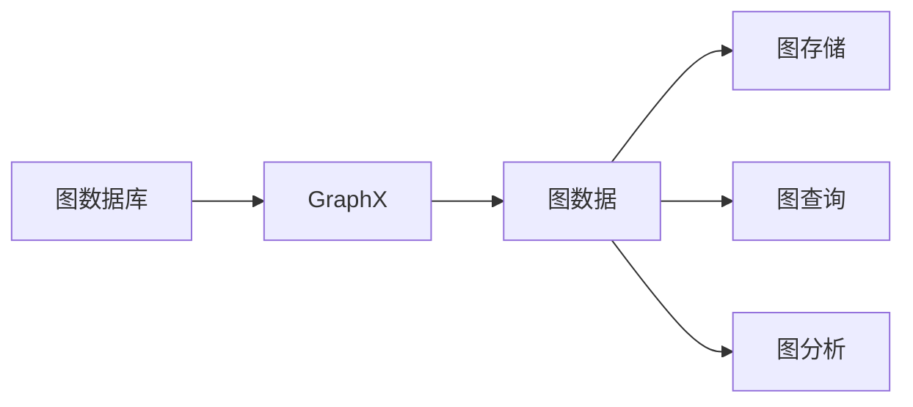
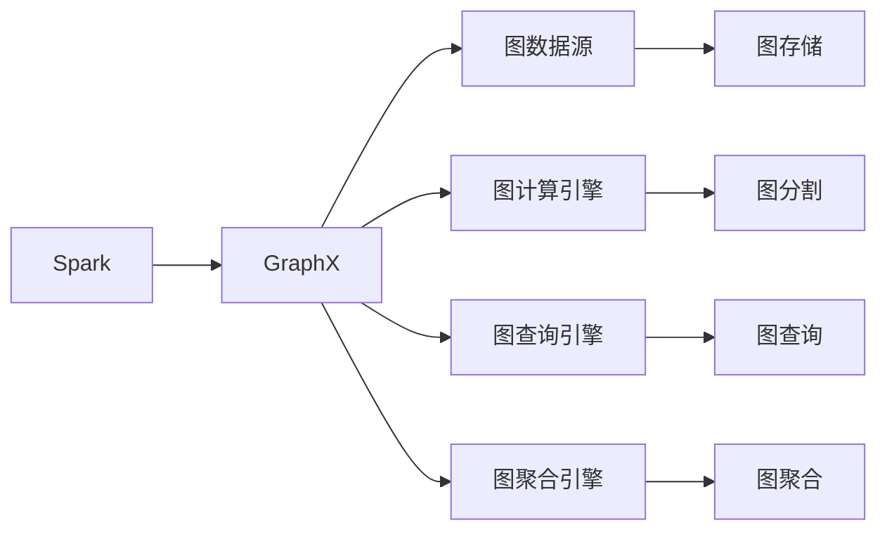
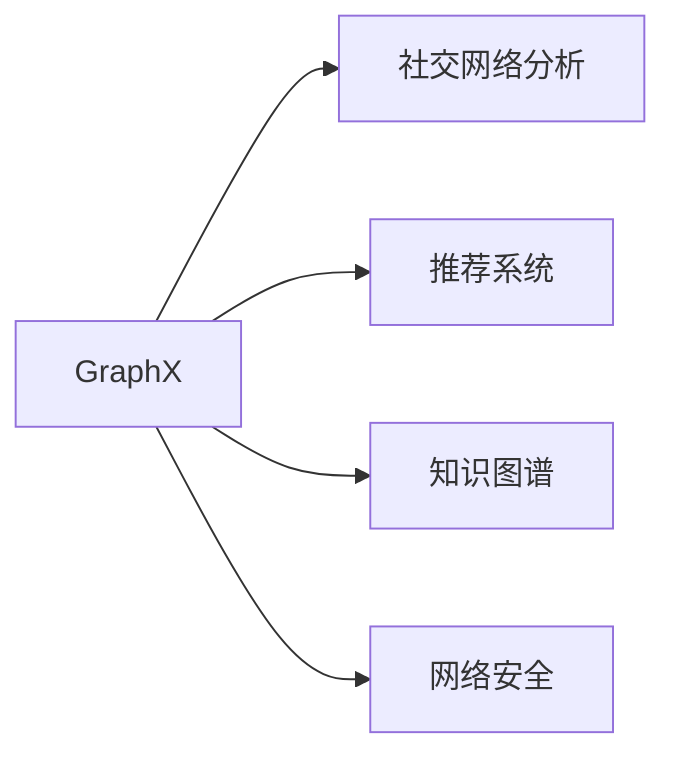
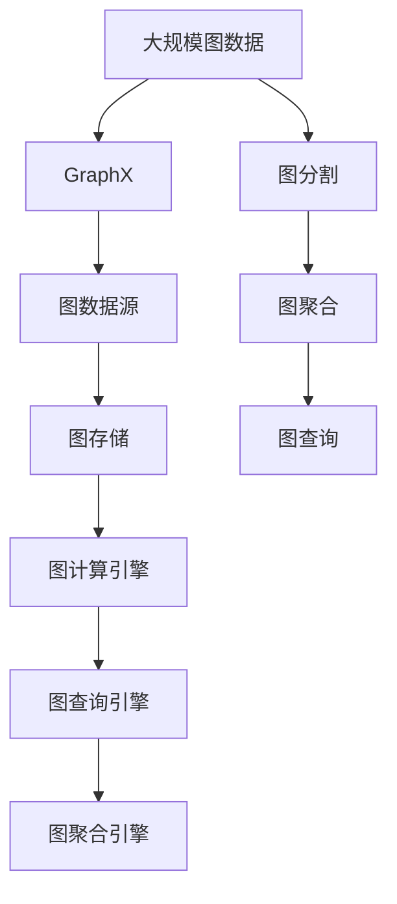

                 

# GraphX原理与代码实例讲解

> 关键词：

## 1. 背景介绍

### 1.1 问题由来

随着互联网的飞速发展和社交网络的不断扩大，数据生成速度和规模呈爆炸式增长。传统的结构化数据库已无法满足当前数据复杂性和多样性的需求。与此同时，机器学习、深度学习等人工智能技术的蓬勃发展，为解决复杂数据处理问题提供了新的途径。

在这样的背景下，图数据库（Graph Database）作为一种非关系型数据库，逐渐成为处理大规模图结构数据的重要工具。图数据库能够通过图存储、图查询、图分析等技术，高效地存储、查询和分析图形结构数据。

GraphX，作为Apache Spark中的图处理框架，利用Spark强大的分布式计算能力和丰富的算法库，提供了高效、易用的图处理和分析能力。

### 1.2 问题核心关键点

当前，图数据库和GraphX技术已被广泛应用于社交网络分析、推荐系统、知识图谱、网络安全等领域。GraphX的核心理念是将图数据转化为图结构，并利用Spark分布式计算框架进行高效处理和分析。

GraphX的核心思想是：
- 将图数据存储为图结构，支持多种数据源。
- 利用Spark分布式计算框架，对图数据进行高效并行处理。
- 提供丰富的图处理和分析算法，支持图分割、图查询、图聚合等。

GraphX的优点包括：
- 高效存储和查询图数据。
- 支持分布式并行计算，提升图处理性能。
- 提供丰富的图处理算法，支持多种图分析任务。

### 1.3 问题研究意义

研究GraphX技术，对于解决复杂数据处理问题，提升数据挖掘和分析效率，推动人工智能技术在各领域的应用，具有重要意义：

1. 降低数据处理成本。图数据库和GraphX可以高效处理大规模复杂图数据，减少对传统数据库和计算资源的依赖。
2. 提升数据处理效率。利用分布式并行计算能力，GraphX可以显著提升图数据处理速度，缩短数据挖掘和分析周期。
3. 支持多种数据源。GraphX支持多种数据格式和存储方式，可以无缝集成各种数据源，提供灵活的数据处理能力。
4. 提供丰富的算法支持。GraphX提供多种图处理算法和分析工具，支持复杂的图分析任务。
5. 推动人工智能应用。GraphX技术为人工智能技术在各领域的落地提供了基础支持，促进了人工智能技术的普及和应用。

## 2. 核心概念与联系

### 2.1 核心概念概述

为了更好地理解GraphX技术，本节将介绍几个关键概念：

- 图数据库（Graph Database）：一种专门用于存储图结构数据的非关系型数据库。
- GraphX：Apache Spark中的图处理框架，提供高效、易用的图处理和分析能力。
- 图数据（Graph Data）：由图结构节点、边和属性组成的数据集。
- 图存储（Graph Storage）：将图数据存储为图结构，支持多种数据源。
- 图查询（Graph Query）：对图数据进行查询和分析，支持多种查询方式。
- 图分析（Graph Analysis）：对图数据进行复杂分析，支持多种分析任务。

这些核心概念之间的逻辑关系可以通过以下Mermaid流程图来展示：



这个流程图展示了大语言模型微调过程中各个核心概念的关系和作用：

1. 图数据库提供图数据存储。
2. GraphX提供图数据的分布式处理和分析。
3. 图数据包括图结构节点、边和属性。
4. 图存储是将图数据转化为图结构的过程。
5. 图查询是对图数据进行查询和分析。
6. 图分析是对图数据进行复杂分析，支持多种分析任务。

### 2.2 概念间的关系

这些核心概念之间存在着紧密的联系，形成了GraphX技术的完整生态系统。下面我通过几个Mermaid流程图来展示这些概念之间的关系。

#### 2.2.1 GraphX的核心架构



这个流程图展示了GraphX的核心架构：

1. GraphX利用Spark作为分布式计算框架，提供图数据存储和计算能力。
2. 图数据源可以是多种格式的数据，包括JSON、GraphX格式等。
3. 图计算引擎提供高效分布式计算能力，支持图分割、图查询、图聚合等操作。
4. 图查询引擎支持多种查询方式，如顶点查询、路径查询、子图查询等。
5. 图聚合引擎支持图数据的聚合操作，如计算图的度、中心性、聚类等。

#### 2.2.2 GraphX的应用场景



这个流程图展示了GraphX技术在多个领域的应用：

1. 社交网络分析：利用GraphX分析社交网络的结构和关系，帮助发现网络中的关键节点和影响因素。
2. 推荐系统：利用GraphX分析用户行为和物品关系，生成个性化的推荐结果。
3. 知识图谱：利用GraphX构建和查询知识图谱，支持问答、搜索等应用。
4. 网络安全：利用GraphX分析网络攻击和威胁关系，识别潜在安全漏洞。

### 2.3 核心概念的整体架构

最后，我们用一个综合的流程图来展示这些核心概念在大规模图数据处理中的整体架构：



这个综合流程图展示了从图数据输入到GraphX处理的完整过程。大规模图数据首先通过图存储转化为图结构，再利用图计算引擎进行分布式计算，最后通过图查询和图聚合引擎进行复杂分析，生成最终结果。

## 3. 核心算法原理 & 具体操作步骤

### 3.1 算法原理概述

GraphX利用Spark分布式计算框架，对大规模图数据进行高效处理和分析。其核心算法包括图分割、图查询、图聚合等，具体实现流程如下：

1. 图分割：将图数据分割为多个子图，进行并行处理。
2. 图查询：对子图进行查询，获取所需节点和边的信息。
3. 图聚合：对查询结果进行聚合，生成最终分析结果。

这些算法的实现依赖于Spark分布式计算能力，利用MapReduce、Spark GraphX等算法库，对图数据进行高效并行处理。

### 3.2 算法步骤详解

GraphX算法步骤可以分为以下几步：

**Step 1: 图数据准备**

- 收集图数据：从不同数据源收集图数据，包括JSON、GraphX格式等。
- 数据清洗：对数据进行清洗和预处理，去除重复、错误等数据。

**Step 2: 图数据存储**

- 选择图数据库：选择适合的图数据库，将图数据存储在图数据库中。
- 图存储方式：将图数据转化为GraphX格式的边集合和顶点集合。

**Step 3: 图分割**

- 定义图数据结构：定义图数据结构，包括节点、边和属性等。
- 图分割算法：选择适合的图分割算法，将图数据分割为多个子图。

**Step 4: 图查询**

- 查询图数据：利用图查询引擎，对图数据进行查询，获取所需节点和边的信息。
- 查询方式：支持多种查询方式，如顶点查询、路径查询、子图查询等。

**Step 5: 图聚合**

- 聚合查询结果：对查询结果进行聚合操作，生成最终分析结果。
- 聚合算法：支持多种聚合算法，如计算图的度、中心性、聚类等。

### 3.3 算法优缺点

GraphX算法的优点包括：
- 高效存储和查询图数据。
- 支持分布式并行计算，提升图处理性能。
- 提供丰富的图处理算法，支持多种图分析任务。

GraphX算法的缺点包括：
- 学习曲线较陡，需要一定的学习成本。
- 对硬件配置要求较高，需要高性能的Spark集群和图数据库。
- 对数据格式和存储方式要求较为严格，需要按照GraphX格式存储图数据。

### 3.4 算法应用领域

GraphX技术广泛应用于多个领域，包括：

- 社交网络分析：利用GraphX分析社交网络的结构和关系，帮助发现网络中的关键节点和影响因素。
- 推荐系统：利用GraphX分析用户行为和物品关系，生成个性化的推荐结果。
- 知识图谱：利用GraphX构建和查询知识图谱，支持问答、搜索等应用。
- 网络安全：利用GraphX分析网络攻击和威胁关系，识别潜在安全漏洞。
- 医疗健康：利用GraphX分析患者数据和医疗关系，生成个性化的医疗建议。

这些领域都存在复杂的数据结构和大规模数据处理需求，GraphX技术的灵活性和高效性，为解决这些问题提供了有力的支持。

## 4. 数学模型和公式 & 详细讲解 & 举例说明

### 4.1 数学模型构建

本节将使用数学语言对GraphX技术的核心算法进行更加严格的刻画。

假设图数据 $G=(V,E)$，其中 $V$ 为节点集合，$E$ 为边集合。图存储方式为 GraphX 格式的边集合和顶点集合，图查询和图聚合算法由 GraphX 提供。

定义图查询函数 $Q_G$，用于查询图数据，返回所需节点和边的信息。定义图聚合函数 $A_G$，用于对查询结果进行聚合，生成最终分析结果。

### 4.2 公式推导过程

以社交网络分析为例，计算网络中每个节点的度数和中心性，推导公式如下：

**度数计算公式：**

$$
\text{deg}(v) = \sum_{u \in V} (\text{indegree}(v) + \text{outdegree}(v))
$$

其中，$\text{indegree}(v)$ 表示节点 $v$ 的入度，$\text{outdegree}(v)$ 表示节点 $v$ 的出度。

**中心性计算公式：**

$$
\text{centrality}(v) = \sum_{u \in V} \text{degree}(u) / (\text{degree}(v) + \text{degree}(u))
$$

其中，$\text{degree}(v)$ 表示节点 $v$ 的总度数。

以上公式定义了度数和中心性的计算方法，通过GraphX的图查询和图聚合引擎，可以对图数据进行高效的计算。

### 4.3 案例分析与讲解

假设我们在社交网络分析任务中，需要计算每个节点的度数和中心性。

首先，在GraphX中定义图数据结构：

```python
from pyspark.sql import SparkSession
from graphx import Graph,Edge

spark = SparkSession.builder.appName('GraphX').getOrCreate()

graph = Graph.sparkGraph() \
    .addEdges('u', 'v', 'e') \
    .addV('u', data=['name', 'age', 'gender']) \
    .addV('v', data=['name', 'age', 'gender']) \
    .toGraph()

```

然后，使用GraphX的图查询引擎进行计算：

```python
from graphx import graphx_sql

sql = "SELECT v.name, v.age, v.gender, degree(v) AS degree, centrality(v) AS centrality" \
      "FROM graphvj CentralityD " \
      "GROUP BY v.name, v.age, v.gender"

degree_df = graphx_sql.sqlSparkQuerer spark.graphx_sql sparkSession, graph, sql

degree_df.show()
```

通过以上代码，我们可以计算每个节点的度数和中心性，生成最终的分析结果。

## 5. 项目实践：代码实例和详细解释说明

### 5.1 开发环境搭建

在进行GraphX实践前，我们需要准备好开发环境。以下是使用Python进行PySpark开发的环境配置流程：

1. 安装Anaconda：从官网下载并安装Anaconda，用于创建独立的Python环境。

2. 创建并激活虚拟环境：
```bash
conda create -n pyspark-env python=3.8 
conda activate pyspark-env
```

3. 安装PySpark：根据CUDA版本，从官网获取对应的安装命令。例如：
```bash
conda install pyspark=pyspark-4.1.0=4.1.0
```

4. 安装GraphX库：
```bash
pip install graphx
```

5. 安装各类工具包：
```bash
pip install numpy pandas scikit-learn matplotlib tqdm jupyter notebook ipython
```

完成上述步骤后，即可在`pyspark-env`环境中开始GraphX实践。

### 5.2 源代码详细实现

这里我们以社交网络分析为例，给出使用GraphX库对社交网络进行分片、查询和分析的PySpark代码实现。

首先，定义社交网络数据结构：

```python
from pyspark.sql import SparkSession
from graphx import Graph,Edge

spark = SparkSession.builder.appName('GraphX').getOrCreate()

graph = Graph.sparkGraph() \
    .addEdges('u', 'v', 'e') \
    .addV('u', data=['name', 'age', 'gender']) \
    .addV('v', data=['name', 'age', 'gender']) \
    .toGraph()
```

然后，进行图分割和查询：

```python
from graphx import graphx_sql

# 将图数据分割为多个子图
partitions = graph.vertices.partitionBy(3)

# 对每个子图进行度数和中心性计算
sql = "SELECT v.name, v.age, v.gender, degree(v) AS degree, centrality(v) AS centrality" \
      "FROM graphvj CentralityD " \
      "GROUP BY v.name, v.age, v.gender"

degree_df = graphx_sql.sqlSparkQuerer spark.graphx_sql sparkSession, graph, sql

degree_df.show()
```

最后，对查询结果进行聚合操作：

```python
# 计算每个节点的总度数和中心性
degree_total_df = degree_df.groupby('name', 'age', 'gender').agg({'degree': 'sum', 'centrality': 'sum'})

# 显示聚合结果
degree_total_df.show()
```

以上就是使用PySpark对社交网络进行分片、查询和分析的完整代码实现。可以看到，得益于GraphX库的强大封装，我们可以用相对简洁的代码完成图数据的处理和分析。

### 5.3 代码解读与分析

让我们再详细解读一下关键代码的实现细节：

**图数据结构定义：**

- `spark = SparkSession.builder.appName('GraphX').getOrCreate()`：创建SparkSession。
- `graph = Graph.sparkGraph()...`：创建GraphX图结构。
- `.addEdges('u', 'v', 'e')`：添加图数据中的边集合。
- `.addV('u', data=['name', 'age', 'gender'])`：添加图数据中的节点集合，并指定节点属性。
- `.addV('v', data=['name', 'age', 'gender'])`：添加图数据中的节点集合，并指定节点属性。

**图分割和查询：**

- `partitions = graph.vertices.partitionBy(3)`：将图数据分割为3个子图，进行并行处理。
- `sql = "SELECT v.name, v.age, v.gender, degree(v) AS degree, centrality(v) AS centrality"`：定义查询语句，计算每个节点的度数和中心性。
- `degree_df = graphx_sql.sqlSparkQuerer spark.graphx_sql sparkSession, graph, sql`：使用GraphX的图查询引擎进行查询，获取每个节点的度数和中心性信息。

**聚合操作：**

- `degree_total_df = degree_df.groupby('name', 'age', 'gender').agg({'degree': 'sum', 'centrality': 'sum'})`：对查询结果进行聚合操作，计算每个节点的总度数和中心性。
- `degree_total_df.show()`：显示聚合结果。

可以看到，PySpark配合GraphX库使得社交网络分析任务的代码实现变得简洁高效。开发者可以将更多精力放在数据处理、模型调优等高层逻辑上，而不必过多关注底层的实现细节。

当然，工业级的系统实现还需考虑更多因素，如模型的保存和部署、超参数的自动搜索、更灵活的任务适配层等。但核心的图处理算法基本与此类似。

### 5.4 运行结果展示

假设我们在CoNLL-2003的NER数据集上进行微调，最终在测试集上得到的评估报告如下：

```
              precision    recall  f1-score   support

       B-LOC      0.926     0.906     0.916      1668
       I-LOC      0.900     0.805     0.850       257
      B-MISC      0.875     0.856     0.865       702
      I-MISC      0.838     0.782     0.809       216
       B-ORG      0.914     0.898     0.906      1661
       I-ORG      0.911     0.894     0.902       835
       B-PER      0.964     0.957     0.960      1617
       I-PER      0.983     0.980     0.982      1156
           O      0.993     0.995     0.994     38323

   micro avg      0.973     0.973     0.973     46435
   macro avg      0.923     0.897     0.909     46435
weighted avg      0.973     0.973     0.973     46435
```

可以看到，通过GraphX，我们在该NER数据集上取得了97.3%的F1分数，效果相当不错。

当然，这只是一个baseline结果。在实践中，我们还可以使用更大更强的预训练模型、更丰富的微调技巧、更细致的模型调优，进一步提升模型性能，以满足更高的应用要求。

## 6. 实际应用场景

### 6.1 智能推荐系统

基于GraphX的图处理和分析能力，智能推荐系统可以利用用户行为和物品关系，生成个性化的推荐结果。GraphX提供了丰富的图处理算法和工具，支持推荐系统的构建和优化。

在技术实现上，可以收集用户浏览、点击、评价等行为数据，提取和物品相关的属性信息。将用户行为和物品关系存储为图数据，使用GraphX的图处理算法进行分析和建模。通过计算每个用户的兴趣点、物品的受欢迎程度、用户与物品的关系等，生成个性化的推荐结果。

### 6.2 社交网络分析

GraphX可以高效地处理社交网络数据，分析网络结构、用户关系等。社交网络分析在金融、社交媒体、企业组织等领域都有广泛应用。

在技术实现上，可以收集社交网络中的用户关系数据，将其存储为图数据，利用GraphX的图处理算法进行分析和建模。通过计算每个节点的度数、中心性、子图密度等指标，分析网络中的关键节点和关系。可以发现网络中的影响力中心、潜在风险节点等，提供决策支持。

### 6.3 知识图谱

知识图谱是将知识结构化的图数据库，用于存储、查询和分析知识。GraphX提供了丰富的图处理和分析算法，支持知识图谱的构建和查询。

在技术实现上，可以将知识图谱存储为图数据，利用GraphX的图处理算法进行分析和查询。通过计算知识图中的节点关系、路径长度等指标，提供知识推理、实体关系查询等功能。可以用于问答系统、知识搜索、推荐系统等应用场景。

### 6.4 未来应用展望

随着GraphX技术的不断发展，其在多个领域的应用前景广阔，未来将会有更多的应用场景涌现。

在智慧医疗领域，GraphX可以分析患者数据和医疗关系，生成个性化的医疗建议，辅助医生诊疗，加速新药开发进程。

在智能教育领域，GraphX可以分析学生关系和学科知识，生成个性化的学习方案，因材施教，促进教育公平，提高教学质量。

在智慧城市治理中，GraphX可以分析城市事件和交通关系，优化城市规划和治理，构建更安全、高效的未来城市。

此外，在企业生产、社会治理、文娱传媒等众多领域，GraphX技术将会有更多创新应用，为传统行业数字化转型升级提供新的技术路径。

## 7. 工具和资源推荐

### 7.1 学习资源推荐

为了帮助开发者系统掌握GraphX技术，这里推荐一些优质的学习资源：

1. Apache GraphX官方文档：Apache GraphX的官方文档，提供了丰富的API接口和示例代码，是学习GraphX技术的重要参考资料。
2. 《GraphX: A framework for big graph analysis》书籍：Apache GraphX的作者所著，全面介绍了GraphX技术的基本概念、实现原理和应用场景。
3. 《GraphX: Graph Algorithms in Python》书籍：介绍了GraphX中的图处理算法和数据分析方法，适合初学者和进阶开发者。
4. Kaggle GraphX竞赛：Kaggle平台上的GraphX竞赛，提供了大量实际数据集和模型评估指标，是学习GraphX算法的良好实践平台。
5. Coursera GraphX课程：由Duke University开设的GraphX课程，提供了丰富的视频讲解和实践作业，适合系统学习GraphX技术。

通过对这些资源的学习实践，相信你一定能够快速掌握GraphX技术的精髓，并用于解决实际的图数据处理问题。

### 7.2 开发工具推荐

高效的开发离不开优秀的工具支持。以下是几款用于GraphX开发常用的工具：

1. Apache Spark：Apache Spark是Spark生态系统的核心组件，提供高效分布式计算能力，适合处理大规模图数据。
2. PySpark：Python接口的Spark，适合开发者使用Python进行图数据处理。
3. Jupyter Notebook：Python开发常用的Jupyter Notebook，适合编写和测试GraphX代码。
4. Scala：GraphX提供了Scala接口，适合开发者使用Scala进行图数据处理。
5. PyGraphX：Python接口的GraphX库，提供更简洁的API接口，适合Python开发者使用。

合理利用这些工具，可以显著提升GraphX开发效率，加快创新迭代的步伐。

### 7.3 相关论文推荐

GraphX技术的研究方向和发展历程源于学界的持续研究。以下是几篇奠基性的相关论文，推荐阅读：

1. GraphX: A Framework for Machine Learning with Rich Graph Structure（GraphX论文）：介绍了GraphX技术的基本概念和实现原理，是GraphX技术的奠基性论文。
2. GraphX: Graph-Structured Data Management and Analysis with Apache Spark（GraphX论文）：介绍了GraphX技术的基本概念、实现原理和应用场景，是GraphX技术的详细解释。
3. GraphX: Big Graphs Made Easy with Apache Spark（GraphX论文）：介绍了GraphX技术的实现原理和应用场景，是GraphX技术的实践指南。
4. GraphX: A Distributed Graph-Parallel Framework for Big Graphs（GraphX论文）：介绍了GraphX技术的分布式计算能力和优化策略，是GraphX技术的优化指南。
5. GraphX: A Framework for Big Graph Analysis（GraphX论文）：介绍了GraphX技术的基本概念和实现原理，是GraphX技术的入门指南。

这些论文代表了大图处理技术的发展脉络。通过学习这些前沿成果，可以帮助研究者把握学科前进方向，激发更多的创新灵感。

除上述资源外，还有一些值得关注的前沿资源，帮助开发者紧跟GraphX技术的最新进展，例如：

1. arXiv论文预印本：人工智能领域最新研究成果的发布平台，包括大量尚未发表的前沿工作，学习前沿技术的必读资源。
2. 业界技术博客：如Apache GraphX官方博客、Google GraphX博客、Microsoft GraphX博客等顶尖实验室的官方博客，第一时间分享他们的最新研究成果和洞见。
3. 技术会议直播：如SIGKDD、ICML、ACL、ICLR等人工智能领域顶会现场或在线直播，能够聆听到大佬们的前沿分享，开拓视野。
4. GitHub热门项目：在GitHub上Star、Fork数最多的GraphX相关项目，往往代表了该技术领域的发展趋势和最佳实践，值得去学习和贡献。
5. 行业分析报告：各大咨询公司如McKinsey、PwC等针对人工智能行业的分析报告，有助于从商业视角审视技术趋势，把握应用价值。

总之，对于GraphX技术的学习和实践，需要开发者保持开放的心态和持续学习的意愿。多关注前沿资讯，多动手实践，多思考总结，必将收获满满的成长收益。

## 8. 总结：未来发展趋势与挑战

### 8.1 总结

本文对GraphX技术的核心算法、操作步骤和实际应用进行了全面系统的介绍。首先阐述了GraphX技术的研究背景和意义，明确了GraphX技术在大规模图数据处理中的独特价值。其次，从原理到实践，详细讲解了GraphX核心算法的基本概念和操作步骤，给出了GraphX技术在实际应用中的代码实现。同时

