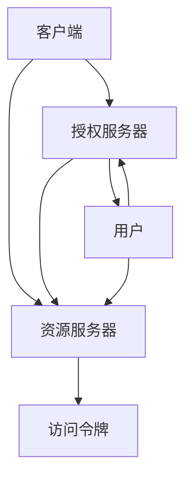

                 

# OAuth 2.0 的优点和实现

## 1. 背景介绍

在现代社会，我们的数字生活与互联网密不可分。无论是社交网络、电子商务还是在线教育，各类服务都为我们提供了便利的同时，也带来了对个人隐私和数据安全的担忧。如何安全地共享个人信息，同时又不必记住和管理大量的用户名和密码，成为了一个亟待解决的问题。这正是 OAuth 2.0 协议应运而生的初衷。

OAuth 2.0 是互联网开放标准，用于授权第三方应用程序访问用户资源。通过 OAuth 2.0，用户可以轻松地授权应用程序访问其社交媒体账户、电子邮件和其他在线服务，而无需共享其用户名和密码。这一协议已经成为现代互联网应用中最常用的身份验证和授权机制之一。

## 2. 核心概念与联系

为了更好地理解 OAuth 2.0 的工作原理和实现细节，我们首先需要了解一些核心概念和它们之间的联系。

### 2.1 核心概念概述

- **OAuth 2.0**：互联网开放标准，用于授权第三方应用程序访问用户资源。
- **客户端**：发起请求的应用程序或服务，通常是用户提供个人信息的第三方。
- **资源服务器**：存储用户资源的服务器，通常是社交媒体、邮件服务或其他在线服务提供商。
- **授权服务器**：验证用户身份和授权请求的服务器，通常是提供 OAuth 2.0 认证的服务商。
- **访问令牌**：OAuth 2.0 协议中用于访问用户资源的凭证，通常是一个短期的、加密的字符串。
- **刷新令牌**：用于获取新的访问令牌的凭证，通常是一个长期的、加密的字符串。

这些概念构成了 OAuth 2.0 协议的核心架构。客户端向授权服务器发起授权请求，授权服务器验证用户身份并返回访问令牌。客户端使用访问令牌访问资源服务器上的用户资源，资源服务器验证访问令牌的有效性并返回用户资源。如果访问令牌过期，客户端可以使用刷新令牌获取新的访问令牌。

### 2.2 核心概念间的关系

通过以下 Mermaid 流程图，我们可以更清晰地理解这些核心概念之间的关系：



这个流程图展示了 OAuth 2.0 的基本流程：

1. 客户端向授权服务器发起授权请求，请求访问用户资源。
2. 授权服务器验证用户身份，并要求用户授权。
3. 用户授权后，授权服务器返回访问令牌。
4. 客户端使用访问令牌访问资源服务器上的用户资源。
5. 如果访问令牌过期，客户端可以使用刷新令牌获取新的访问令牌。

## 3. 核心算法原理 & 具体操作步骤

### 3.1 算法原理概述

OAuth 2.0 协议的核心原理是使用授权码流（Authorization Code Flow）进行身份验证和授权。其主要流程如下：

1. 客户端向授权服务器发起授权请求，请求访问用户资源。
2. 授权服务器要求用户登录并授权。
3. 用户授权后，授权服务器返回授权码（Authorization Code）。
4. 客户端使用授权码向授权服务器请求访问令牌（Access Token）。
5. 授权服务器验证授权码，并返回访问令牌。
6. 客户端使用访问令牌访问资源服务器上的用户资源。

### 3.2 算法步骤详解

接下来，我们将详细讲解 OAuth 2.0 协议的具体操作步骤。

**Step 1: 客户端发起授权请求**

客户端向授权服务器发起授权请求，请求访问用户资源。请求通常包含以下参数：

- `client_id`：客户端的标识符。
- `redirect_uri`：客户端在授权成功后的重定向 URI。

授权请求的示例如下：

```http
GET /authorize?response_type=code&client_id=CLIENT_ID&redirect_uri=REDIRECT_URI&scope=SCOPE HTTP/1.1
Host: auth.example.com
```

**Step 2: 用户授权**

授权服务器要求用户登录并授权。用户登录后，授权服务器将显示客户端请求的资源范围（Scope）和授权码（Authorization Code）。用户可以通过以下方式授权：

- 同意授权。
- 拒绝授权。

**Step 3: 客户端请求访问令牌**

用户授权后，授权服务器返回授权码（Authorization Code）。客户端使用授权码向授权服务器请求访问令牌。请求通常包含以下参数：

- `client_id`：客户端的标识符。
- `client_secret`：客户端的机密密钥。
- `grant_type=authorization_code`：授权类型。
- `code`：授权码。
- `redirect_uri`：客户端在授权成功后的重定向 URI。

访问令牌请求的示例如下：

```http
POST /token HTTP/1.1
Content-Type: application/x-www-form-urlencoded

client_id=CLIENT_ID&client_secret=CLIENT_SECRET&grant_type=authorization_code&code=AUTHORIZATION_CODE&redirect_uri=REDIRECT_URI
```

**Step 4: 授权服务器返回访问令牌**

授权服务器验证授权码，并返回访问令牌（Access Token）和刷新令牌（Refresh Token）。

```http
HTTP/1.1 200 OK
Content-Type: application/json

{
    "access_token": "ACCESS_TOKEN",
    "token_type": "Bearer",
    "expires_in": 3600,
    "refresh_token": "REFRESH_TOKEN"
}
```

**Step 5: 客户端访问用户资源**

客户端使用访问令牌访问资源服务器上的用户资源。资源请求的示例如下：

```http
GET /api/user HTTP/1.1
Host: resource.example.com
Authorization: Bearer ACCESS_TOKEN
```

### 3.3 算法优缺点

OAuth 2.0 协议具有以下优点：

- **安全性高**：用户不需要共享用户名和密码，只需授权即可访问资源。
- **授权控制灵活**：用户可以授权第三方应用程序访问特定资源，或仅访问基本信息。
- **互操作性好**：支持多种授权类型，如授权码流、隐式授权、客户端认证等，适用于不同应用场景。

但 OAuth 2.0 协议也存在一些缺点：

- **流程复杂**：授权流程较为复杂，需要用户和客户端多次交互。
- **安全性依赖**：授权服务器和资源服务器的安全性依赖于安全协议和加密算法。

### 3.4 算法应用领域

OAuth 2.0 协议广泛应用于各种互联网服务中，例如：

- 社交媒体：用户授权第三方应用程序访问其社交媒体账户。
- 电子商务：用户授权第三方应用程序访问其订单和支付信息。
- 在线教育：用户授权第三方应用程序访问其学习进度和成绩。
- 金融服务：用户授权第三方应用程序访问其金融账户信息。

## 4. 数学模型和公式 & 详细讲解

### 4.1 数学模型构建

在 OAuth 2.0 协议中，数学模型主要涉及加密算法和访问令牌的计算。以下是对这些数学模型的详细介绍。

#### 4.1.1 加密算法

OAuth 2.0 协议中使用的加密算法包括 RSASSA-PKCS1-v1_5、HS256、HS384、HS512 等。这些算法用于保护授权码和访问令牌的安全性。

#### 4.1.2 访问令牌计算

访问令牌的计算公式如下：

$$
\text{Access Token} = \text{client\_id}|\text{client\_secret}|\text{scope}
$$

其中，`client\_id` 和 `client\_secret` 是客户端的标识符和机密密钥，`scope` 是资源范围。例如，使用 HS256 算法计算的访问令牌如下：

$$
\text{Access Token} = HMAC\left(\text{HS256}, \text{client\_id}|\text{client\_secret}|\text{scope}\right)
$$

### 4.2 公式推导过程

在 OAuth 2.0 协议中，访问令牌的计算公式推导如下：

1. 计算哈希值：

$$
\text{hash} = HMAC\left(\text{Hash Algorithm}, \text{client\_id}|\text{client\_secret}|\text{scope}\right)
$$

2. 计算访问令牌：

$$
\text{Access Token} = \text{Hash Algorithm}(\text{hash})
$$

其中，`Hash Algorithm` 是哈希算法。例如，使用 HS256 算法计算的访问令牌如下：

$$
\text{Access Token} = HMAC\left(\text{HS256}, \text{client\_id}|\text{client\_secret}|\text{scope}\right)
$$

### 4.3 案例分析与讲解

假设客户端使用 HS256 算法请求访问令牌。客户端的标识符为 `CLIENT_ID`，客户端的机密密钥为 `CLIENT_SECRET`，资源范围为 `SCOPE`。

1. 计算哈希值：

$$
\text{hash} = HMAC\left(\text{HS256}, \text{CLIENT\_ID}|\text{CLIENT\_SECRET}|\text{SCOPE}\right)
$$

2. 计算访问令牌：

$$
\text{Access Token} = HMAC\left(\text{HS256}, \text{hash}\right)
$$

在实际应用中，访问令牌的计算过程通常由授权服务器实现。客户端在收到授权码后，使用相同的算法和参数计算出访问令牌，验证其有效性。

## 5. 项目实践：代码实例和详细解释说明

### 5.1 开发环境搭建

在进行 OAuth 2.0 实践前，我们需要准备好开发环境。以下是使用 Python 进行 Flask 开发的环境配置流程：

1. 安装 Python：从官网下载并安装 Python，确保版本为 3.6 及以上。

2. 安装 Flask：使用 pip 安装 Flask 库，确保版本为 1.1 及以上。

3. 安装 Flask-OAuthlib：使用 pip 安装 Flask-OAuthlib 库，用于处理 OAuth 2.0 认证。

```bash
pip install flask flask-oauthlib
```

完成上述步骤后，即可在 Python 环境中开始 OAuth 2.0 实践。

### 5.2 源代码详细实现

下面我们以 Flask 应用为例，给出使用 Flask-OAuthlib 实现 OAuth 2.0 认证的 PyTorch 代码实现。

首先，定义 OAuth 2.0 认证的客户端和资源服务器：

```python
from flask import Flask, request
from flask_oauthlib.provider import OAuth2Provider

app = Flask(__name__)

# 定义客户端
CLIENT_ID = 'CLIENT_ID'
CLIENT_SECRET = 'CLIENT_SECRET'
REDIRECT_URI = 'REDIRECT_URI'

# 定义资源服务器
RESOURCE_URI = '/api/user'

# 定义 OAuth2Provider 实例
oauth = OAuth2Provider(app, CLIENT_ID, CLIENT_SECRET)
```

然后，定义 OAuth 2.0 认证的授权和令牌接口：

```python
@app.route('/authorize')
def authorize():
    # 授权请求
    return oauth.authorize()

@app.route('/token')
def token():
    # 令牌请求
    return oauth.token()

@app.route('/api/user')
def user():
    # 资源请求
    return 'Hello, World!'
```

最后，启动 Flask 应用并访问授权和资源接口：

```python
if __name__ == '__main__':
    app.run()
```

以上就是使用 Flask 和 Flask-OAuthlib 实现 OAuth 2.0 认证的 PyTorch 代码实现。可以看到，OAuth 2.0 认证的实现相对简洁，主要通过 Flask 和 OAuth2Provider 库即可完成。

### 5.3 代码解读与分析

让我们再详细解读一下关键代码的实现细节：

**OAuth2Provider 实例**：
- 初始化时，传入 Flask 应用、客户端 ID 和客户端机密密钥。

**授权请求接口**：
- 使用 `oauth.authorize()` 方法处理授权请求，返回授权码。

**令牌请求接口**：
- 使用 `oauth.token()` 方法处理令牌请求，返回访问令牌。

**资源请求接口**：
- 使用 `@app.route('/api/user')` 装饰器定义资源接口，使用访问令牌验证用户身份，返回用户资源。

**运行 Flask 应用**：
- 使用 `app.run()` 方法启动 Flask 应用，默认监听本地地址 127.0.0.1 和端口 5000。

可以看到，OAuth 2.0 认证的实现主要依赖于 Flask 和 OAuth2Provider 库，提供了简洁、高效的身份验证和授权机制。开发者可以方便地在自己的应用中集成 OAuth 2.0 认证，保护用户隐私和数据安全。

### 5.4 运行结果展示

假设我们在本地启动 Flask 应用，并访问授权接口：

```bash
python app.py
curl -X GET http://127.0.0.1:5000/authorize?response_type=code&redirect_uri=http://127.0.0.1:5000/token
```

在授权请求页面上，用户授权成功后，我们将获得一个授权码，使用该授权码访问令牌接口：

```bash
curl -X POST http://127.0.0.1:5000/token -d "grant_type=authorization_code&code=AUTHORIZATION_CODE&redirect_uri=http://127.0.0.1:5000/token"
```

在令牌请求页面上，授权服务器验证授权码后，返回访问令牌和刷新令牌。我们可以使用访问令牌访问资源服务器：

```bash
curl -X GET http://127.0.0.1:5000/api/user -H "Authorization: Bearer ACCESS_TOKEN"
```

将获得返回的 `Hello, World!` 响应，验证了 OAuth 2.0 认证的实现效果。

## 6. 实际应用场景

### 6.1 社交媒体平台

社交媒体平台广泛使用 OAuth 2.0 协议，允许用户授权第三方应用程序访问其社交媒体账户。用户可以在第三方应用程序上分享自己的状态、评论和照片，而无需共享用户名和密码。

### 6.2 电子商务平台

电子商务平台使用 OAuth 2.0 协议，允许用户授权第三方应用程序访问其订单和支付信息。用户可以在第三方应用程序上查看订单状态、修改配送信息和退货申请，而无需共享用户名和密码。

### 6.3 在线教育平台

在线教育平台使用 OAuth 2.0 协议，允许用户授权第三方应用程序访问其学习进度和成绩。用户可以在第三方应用程序上查看课程内容、提交作业和参与讨论，而无需共享用户名和密码。

### 6.4 未来应用展望

随着 OAuth 2.0 协议的不断发展和普及，未来将有更多的应用场景和行业领域采用 OAuth 2.0 认证。

在智慧医疗领域，OAuth 2.0 协议可以用于授权医疗设备访问患者健康数据，保护患者隐私。

在智能家居领域，OAuth 2.0 协议可以用于授权智能设备访问家庭网络和用户信息，提高家居设备的安全性和便捷性。

在物联网领域，OAuth 2.0 协议可以用于授权传感器和设备访问用户数据，实现智能家居和城市管理的自动化和智能化。

## 7. 工具和资源推荐

### 7.1 学习资源推荐

为了帮助开发者系统掌握 OAuth 2.0 协议的理论基础和实践技巧，这里推荐一些优质的学习资源：

1. 《OAuth 2.0 入门》系列博文：由OAuth 2.0专家撰写，详细介绍了OAuth 2.0协议的基本概念和实现方法。

2. 《OAuth 2.0 权威指南》书籍：OAuth 2.0协议的权威指南，全面介绍了OAuth 2.0协议的工作原理和实现细节。

3. RFC 6749：OAuth 2.0协议的正式文档，提供了OAuth 2.0协议的完整规范和标准。

4. OWASP OAuth Cheat Sheet：OAuth 2.0协议的安全性和最佳实践指南，帮助开发者防范安全威胁，提高认证系统的安全性。

5. Flask-OAuthlib 文档：Flask-OAuthlib库的官方文档，提供了OAuth 2.0认证的完整实现示例。

通过对这些资源的学习实践，相信你一定能够快速掌握 OAuth 2.0 协议的精髓，并用于解决实际的认证问题。

### 7.2 开发工具推荐

高效的开发离不开优秀的工具支持。以下是几款用于 OAuth 2.0 认证开发的常用工具：

1. Flask：基于Python的Web框架，简单易用，适合快速迭代开发。

2. OAuth2Provider：Flask-OAuthlib库，提供了OAuth 2.0认证的封装实现，方便开发者集成。

3. Postman：API测试和调试工具，可以轻松地测试OAuth 2.0认证的各个接口。

4. Charles Proxy：HTTP代理工具，可以方便地调试OAuth 2.0认证的请求和响应。

5. JWT.io：JSON Web Token（JWT）工具，可以方便地验证和测试访问令牌。

合理利用这些工具，可以显著提升OAuth 2.0认证的开发效率，加快创新迭代的步伐。

### 7.3 相关论文推荐

OAuth 2.0协议的发展源于学界的持续研究。以下是几篇奠基性的相关论文，推荐阅读：

1. OAuth 2.0：互联网开放标准，用于授权第三方应用程序访问用户资源。

2. OAuth 2.0：安全协议规范，提供了OAuth 2.0协议的完整规范和标准。

3. OAuth 2.0：最佳实践指南，提供了OAuth 2.0协议的安全性和最佳实践建议。

4. OAuth 2.0：应用案例研究，介绍了OAuth 2.0协议在不同应用场景中的实际应用。

5. OAuth 2.0：未来展望，探讨了OAuth 2.0协议的未来发展趋势和研究方向。

这些论文代表了大语言模型微调技术的发展脉络。通过学习这些前沿成果，可以帮助研究者把握学科前进方向，激发更多的创新灵感。

除上述资源外，还有一些值得关注的前沿资源，帮助开发者紧跟OAuth 2.0认证技术的最新进展，例如：

1. arXiv论文预印本：人工智能领域最新研究成果的发布平台，包括大量尚未发表的前沿工作，学习前沿技术的必读资源。

2. OAuth 2.0官方博客：OAuth 2.0协议的官方博客，可以第一时间获得OAuth 2.0协议的最新消息和洞见。

3. OAuth 2.0会议论文：OAuth 2.0协议的顶级会议论文，展示了OAuth 2.0协议的最新研究成果和技术进展。

4. GitHub开源项目：在GitHub上Star、Fork数最多的OAuth 2.0协议相关项目，往往代表了该技术领域的发展趋势和最佳实践，值得去学习和贡献。

5. OAuth 2.0国家标准：各国针对OAuth 2.0协议制定的国家标准，提供了OAuth 2.0协议的权威规范和标准。

总之，对于OAuth 2.0认证技术的学习和实践，需要开发者保持开放的心态和持续学习的意愿。多关注前沿资讯，多动手实践，多思考总结，必将收获满满的成长收益。

## 8. 总结：未来发展趋势与挑战

### 8.1 总结

本文对 OAuth 2.0 协议进行了全面系统的介绍。首先阐述了 OAuth 2.0 协议的研究背景和意义，明确了OAuth 2.0协议在授权第三方应用程序访问用户资源方面的独特价值。其次，从原理到实践，详细讲解了OAuth 2.0协议的具体操作步骤，并提供了完整代码实现。同时，本文还广泛探讨了OAuth 2.0协议在社交媒体、电子商务、在线教育等多个领域的应用前景，展示了OAuth 2.0协议的巨大潜力。最后，本文精选了OAuth 2.0协议的学习资源，力求为读者提供全方位的技术指引。

通过本文的系统梳理，可以看到，OAuth 2.0协议已经成为互联网领域最为重要的授权机制之一，极大地提升了用户隐私和数据安全，推动了各类互联网应用的发展。未来，随着互联网技术的不断演进，OAuth 2.0协议的应用场景和领域将更加广泛，用户和第三方应用程序的互动将更加安全、便捷。

### 8.2 未来发展趋势

展望未来，OAuth 2.0协议将呈现以下几个发展趋势：

1. **标准化程度提升**：OAuth 2.0协议将更加标准化，成为互联网应用的标配。更多的应用场景和行业领域将采用OAuth 2.0协议，保护用户隐私和数据安全。

2. **安全性持续改进**：OAuth 2.0协议将不断加强安全性，防范各种安全威胁，确保用户数据的安全性。

3. **互操作性增强**：OAuth 2.0协议将增强互操作性，支持更多认证类型和授权方式，实现更广泛的应用场景。

4. **用户体验提升**：OAuth 2.0协议将提升用户授权体验，简化授权流程，使用户更轻松地授权第三方应用程序访问其资源。

5. **跨平台支持**：OAuth 2.0协议将支持更多平台和设备，实现跨平台无缝认证。

以上趋势凸显了OAuth 2.0协议的发展前景。这些方向的探索发展，必将进一步提升OAuth 2.0协议的安全性和用户体验，使其成为互联网认证的主流范式。

### 8.3 面临的挑战

尽管OAuth 2.0协议已经取得了巨大成功，但在迈向更加智能化、普适化应用的过程中，它仍面临着诸多挑战：

1. **安全性问题**：OAuth 2.0协议的安全性依赖于客户端和授权服务器的安全性，一旦出现安全漏洞，用户数据将面临巨大风险。

2. **授权流程复杂**：OAuth 2.0协议的授权流程较为复杂，需要用户和客户端多次交互，用户体验较差。

3. **跨域认证困难**：OAuth 2.0协议在跨域认证方面存在一些挑战，如CSRF攻击等，需要进一步优化和改进。

4. **兼容性问题**：OAuth 2.0协议的兼容性问题需要进一步解决，确保各种平台和设备能够无缝集成OAuth 2.0认证。

5. **算法和协议的演进**：OAuth 2.0协议的算法和协议需要不断演进，以应对新的安全威胁和技术挑战。

6. **用户隐私保护**：OAuth 2.0协议需要在用户隐私保护方面做出更多努力，确保用户数据不被滥用。

7. **技术标准化**：OAuth 2.0协议需要在技术标准化方面做出更多努力，确保各平台和设备的一致性和互操作性。

正视OAuth 2.0协议面临的这些挑战，积极应对并寻求突破，将使其在互联网认证中扮演更加重要的角色。相信随着学界和产业界的共同努力，这些挑战终将一一被克服，OAuth 2.0协议必将在构建安全、便捷、跨平台的互联网认证中发挥更大的作用。

### 8.4 研究展望

面对OAuth 2.0协议所面临的种种挑战，未来的研究需要在以下几个方面寻求新的突破：

1. **安全性增强**：研发更加安全、高效的OAuth 2.0协议，提高用户数据的安全性。

2. **授权流程简化**：简化OAuth 2.0协议的授权流程，提高用户体验。

3. **跨域认证优化**：优化OAuth 2.0协议的跨域认证机制，防范CSRF等安全威胁。

4. **算法和协议演进**：研发更加高效、安全的算法和协议，确保OAuth 2.0协议的长期发展。

5. **用户隐私保护**：研发更加严格的用户隐私保护机制，确保用户数据不被滥用。

6. **技术标准化**：推动OAuth 2.0协议的技术标准化，确保各平台和设备的一致性和互操作性。

这些研究方向的探索，必将引领OAuth 2.0协议迈向更高的台阶，为构建安全、便捷、跨平台的互联网认证提供强有力的支持。面向未来，OAuth 2.0协议需要与其他安全协议和技术进行更深入的融合，共同推动互联网认证技术的进步。只有勇于创新、敢于突破，才能不断拓展OAuth 2.0协议的边界，让互联网认证技术更好地服务于用户和社会。

## 9. 附录：常见问题与解答

**Q1：OAuth 2.0协议是否适用于所有Web应用？**

A: OAuth 2.0协议主要适用于Web应用，但也可以扩展到移动应用、桌面应用等其他平台。由于OAuth 2.0协议依赖于Web服务器，无法直接应用于本地应用程序。

**Q2：OAuth 2.0协议是否适用于所有第三方应用程序？**

A: OAuth 2.0协议适用于大多数第三方应用程序，但需要注意以下几点：

1. 需要满足OAuth 2.0协议的安全性和互操作性要求。
2. 需要获得用户授权，并在授权后使用访问令牌访问用户资源。
3. 需要支持HTTPS协议，确保数据传输的安全性。

**Q3：OAuth 2.0协议是否适用于所有身份验证场景？**

A: OAuth 2.0协议适用于大多数身份验证场景，但需要注意以下几点：

1. 需要满足OAuth 2.0协议的安全性和互操作性要求。
2. 需要获得用户授权，并在授权后使用访问令牌访问用户资源。
3. 需要支持HTTPS协议，确保数据传输的安全性。

**Q4：OAuth 2.0协议是否适用于所有认证协议？**

A: OAuth 2.0协议主要适用于基于Web的身份验证和授权协议，如OAuth 1.0a、OAuth 2.0等。但对于其他认证协议，如SAML、Kerberos等，需要根据具体协议进行适配。

**Q5：OAuth 2.0协议是否适用于所有数据格式？**

A: OAuth 2.0协议适用于各种数据格式，如JSON、XML、HTML等。但需要注意以下几点：

1. 需要支持OAuth 2.0协议的各项规范和标准。
2. 需要根据具体应用场景选择适当的数据格式。

总之，OAuth 2.0协议适用于大多数Web应用和第三方应用程序，但需要根据具体场景进行

