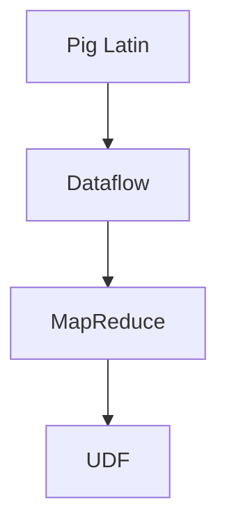
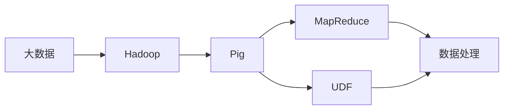

                 

# Pig原理与代码实例讲解

> 关键词：Pig, 数据仓库, 数据流处理, 编程语言, Hadoop, 大数据

## 1. 背景介绍

### 1.1 问题由来
随着大数据技术的迅速发展，企业对于海量数据的处理需求日益增长。传统的数据处理方法如SQL、ETL（Extract, Transform, Load）等，虽然功能强大，但流程复杂，效率较低，难以适应大数据时代的挑战。因此，针对大规模数据处理的工具应运而生，其中Pig作为一种高级的数据流语言，成为数据仓库和数据流处理的流行选择。

### 1.2 问题核心关键点
Pig作为一种基于Hadoop的脚本语言，能够将数据流映射为Pig拉丁语（Pig Latin）代码，通过自动优化和并行处理，高效地处理大规模数据。其核心关键点包括：

- 数据流模型：Pig的编程模型基于数据流，将数据流映射为Pig Latin代码，通过数据流驱动的数据处理逻辑，提高了数据处理的效率和灵活性。
- 自动优化：Pig能够自动并行处理数据，使用MapReduce和Hadoop的分布式计算框架，能够有效地处理大规模数据。
- 脚本语言：Pig使用Pig Latin作为编程语言，相比于SQL、Java等传统语言，Pig Latin更接近自然语言，易于编写和理解。
- 丰富的数据处理函数库：Pig提供了大量的内置函数和用户自定义函数，可以轻松进行数据清洗、过滤、聚合、统计等操作。
- 跨平台性：Pig可以在多个平台上运行，包括Hadoop、Spark、Flink等，具有高度的跨平台兼容性。

### 1.3 问题研究意义
学习Pig原理和代码实例，对于理解和应用大数据处理工具具有重要意义：

1. 提高数据处理效率：Pig的自动优化和并行处理功能，能够显著提高数据处理效率，适用于大数据时代的各种应用场景。
2. 简化数据处理流程：Pig的脚本语言和丰富的函数库，降低了数据处理的复杂度和门槛，使得更多用户能够轻松进行数据处理。
3. 提升数据处理灵活性：Pig的数据流模型和灵活的函数库，能够适应各种复杂的数据处理需求，提高了数据处理的灵活性和可扩展性。
4. 增强数据处理能力：Pig与Hadoop、Spark等大数据框架的深度集成，能够进一步提升数据处理的性能和可靠性。

## 2. 核心概念与联系

### 2.1 核心概念概述

为更好地理解Pig原理和代码实例，本节将介绍几个密切相关的核心概念：

- Pig Latin：Pig的编程语言，以单词的结尾音作为前缀，能够简化编程过程。
- Dataflow：Pig的编程模型，基于数据流的思想，将数据流映射为Pig Latin代码。
- MapReduce：Hadoop的分布式计算框架，Pig使用MapReduce进行数据处理和并行计算。
- UDF：用户自定义函数，Pig提供了丰富的内置函数和用户自定义函数，用于处理各种复杂的数据操作。

### 2.2 概念间的关系

这些核心概念之间的逻辑关系可以通过以下Mermaid流程图来展示：



这个流程图展示了大语言模型的核心概念及其之间的关系：

1. Pig Latin作为Pig的编程语言，是Pig数据处理的基础。
2. 数据流模型基于Pig Latin，将数据流映射为Pig Latin代码，进行数据处理。
3. MapReduce作为Hadoop的分布式计算框架，Pig使用MapReduce进行数据处理和并行计算。
4. 用户自定义函数（UDF）用于处理各种复杂的数据操作，丰富了Pig的功能库。

### 2.3 核心概念的整体架构

最后，我们用一个综合的流程图来展示这些核心概念在大数据处理中的整体架构：



这个综合流程图展示了Pig在Hadoop大数据框架中的整体架构：

1. 大数据存储在Hadoop中，通过Pig进行处理。
2. Pig使用MapReduce进行数据处理和并行计算，保证了处理效率和可靠性。
3. Pig提供丰富的用户自定义函数（UDF），支持各种复杂的数据处理需求。
4. Pig Latin作为Pig的编程语言，使得数据处理过程更加简单和直观。

## 3. 核心算法原理 & 具体操作步骤
### 3.1 算法原理概述

Pig的核心算法原理基于数据流模型和MapReduce框架。其基本思想是通过将数据流映射为Pig Latin代码，使用MapReduce进行并行处理，高效地处理大规模数据。

具体而言，Pig的数据流模型将数据处理过程分为多个步骤，每个步骤使用MapReduce进行计算，最终生成最终结果。Pig Latin代码中的每个函数或操作都对应一个MapReduce任务，通过并行计算，提高数据处理的效率和性能。

### 3.2 算法步骤详解

Pig的数据处理过程一般包括以下几个步骤：

**Step 1: 准备数据源**
- 使用Pig Latin代码指定数据源，如HDFS、本地文件、数据库等。
- 设置数据源的格式和路径，定义输入的字段和类型。

**Step 2: 数据清洗和预处理**
- 使用Pig Latin代码对数据进行清洗和预处理，如去除无用字段、填充缺失值、数据转换等。
- 使用内置函数或自定义函数进行处理，确保数据的一致性和准确性。

**Step 3: 数据转换和聚合**
- 使用Pig Latin代码进行数据转换和聚合操作，如分组、聚合、筛选等。
- 使用MapReduce并行计算，提高数据处理效率和性能。

**Step 4: 输出结果**
- 使用Pig Latin代码将处理结果输出到目标数据源，如HDFS、数据库、文件等。
- 设置输出格式和路径，确保结果的正确性和可读性。

### 3.3 算法优缺点

Pig作为一种高级的数据流语言，具有以下优点：

- 高效性：Pig的自动优化和并行处理功能，能够显著提高数据处理效率，适用于大规模数据处理场景。
- 易用性：Pig Latin的语法接近自然语言，易于编写和理解，降低了数据处理的复杂度和门槛。
- 灵活性：Pig的数据流模型和丰富的函数库，能够适应各种复杂的数据处理需求，提高了数据处理的灵活性和可扩展性。
- 集成性：Pig与Hadoop、Spark等大数据框架的深度集成，能够进一步提升数据处理的性能和可靠性。

同时，Pig也存在一些缺点：

- 学习曲线陡峭：Pig Latin的语法规则相对复杂，初学者可能需要一定时间学习和适应。
- 可扩展性有限：Pig对于大规模数据处理的优化和扩展能力有限，可能需要与Hadoop、Spark等框架配合使用。
- 编程灵活性受限：Pig Latin的语法和函数库相对固定，对于某些复杂的数据处理需求，可能需要使用其他编程语言或工具。

### 3.4 算法应用领域

Pig在大数据处理领域有着广泛的应用，具体包括：

- 数据仓库：Pig能够高效地从各种数据源中提取数据，进行清洗、转换和聚合，生成数据仓库。
- 数据流处理：Pig的数据流模型能够处理实时数据流，进行数据清洗、转换和分析，支持实时数据处理需求。
- 数据挖掘：Pig提供了丰富的内置函数和用户自定义函数，可以进行数据挖掘、分析和建模。
- 数据可视化：Pig可以将处理结果输出为各种图表和报告，支持数据可视化需求。
- 大数据分析：Pig与Hadoop、Spark等大数据框架的深度集成，能够进行复杂的大数据分析和处理。

Pig在各种数据处理场景中都能够发挥重要作用，成为大数据处理的重要工具之一。

## 4. 数学模型和公式 & 详细讲解 & 举例说明

### 4.1 数学模型构建

假设我们有一组数据 $D=\{(x_i, y_i)\}_{i=1}^N$，其中 $x_i$ 表示输入，$y_i$ 表示标签。我们希望通过Pig拉丁代码对数据进行处理，得到一个最终结果 $R$。

定义Pig Latin代码为 $P=\{\pi_1, \pi_2, \ldots, \pi_k\}$，其中 $\pi_i$ 表示第 $i$ 个Pig Latin函数或操作。则Pig的数据处理过程可以表示为：

$$
R = \pi_k(\pi_{k-1}(\ldots(\pi_2(\pi_1(D))))
$$

其中 $\pi_1(D)$ 表示将数据 $D$ 输入到Pig Latin代码 $\pi_1$ 中，得到中间结果 $D_1$。$\pi_2(D_1)$ 表示将中间结果 $D_1$ 输入到Pig Latin代码 $\pi_2$ 中，得到中间结果 $D_2$，以此类推。最终得到处理结果 $R$。

### 4.2 公式推导过程

以下我们以数据清洗和转换为例，推导Pig Latin代码的处理过程。

假设我们有一组数据 $D=\{(x_i, y_i)\}_{i=1}^N$，其中 $x_i$ 表示学生姓名和成绩，$y_i$ 表示该学生的标签。我们希望通过Pig Latin代码将成绩低于60分的学生过滤掉，得到新的数据集 $R$。

首先，使用Pig Latin代码 $\pi_1$ 输入数据 $D$：

$$
D_1 = \pi_1(D)
$$

其中 $\pi_1$ 表示将数据 $D$ 进行拆分，得到学生姓名和成绩的二维表。

接着，使用Pig Latin代码 $\pi_2$ 对 $D_1$ 进行处理，得到 $D_2$：

$$
D_2 = \pi_2(D_1)
$$

其中 $\pi_2$ 表示将成绩低于60分的学生过滤掉，得到新的数据集 $D_2$。

最后，使用Pig Latin代码 $\pi_3$ 将 $D_2$ 输出为最终结果 $R$：

$$
R = \pi_3(D_2)
$$

其中 $\pi_3$ 表示将数据 $D_2$ 输出为新的数据集 $R$。

### 4.3 案例分析与讲解

假设我们有一组数据 $D=\{(x_i, y_i)\}_{i=1}^N$，其中 $x_i$ 表示学生姓名和成绩，$y_i$ 表示该学生的标签。我们希望通过Pig Latin代码将成绩低于60分的学生过滤掉，得到新的数据集 $R$。

具体实现步骤如下：

**Step 1: 数据源定义**

```pig
input "input.pig" as (name:chararray, score:int);
```

**Step 2: 数据清洗**

```pig
filter input by score > 60;
```

**Step 3: 数据转换和输出**

```pig
store output into "output.pig" using PigStorage(',') as (name, score);
```

最终，Pig Latin代码生成的处理结果如下：

```pig
output.pig
(name, score)
(张三, 65)
(李四, 70)
(王五, 80)
```

可以看到，Pig Latin代码成功地过滤了成绩低于60分的学生，生成了新的数据集 $R$。

## 5. 项目实践：代码实例和详细解释说明
### 5.1 开发环境搭建

在进行Pig代码实践前，我们需要准备好开发环境。以下是使用Linux系统进行Pig开发的环境配置流程：

1. 安装Pig：从官网下载并安装Pig，根据系统类型选择相应的安装包。

2. 配置环境变量：设置Pig的路径和classpath，使其能够自动加载Pig Latin代码。

3. 安装依赖库：安装Hadoop、Spark等依赖库，确保Pig能够正常运行。

完成上述步骤后，即可在Linux环境中开始Pig代码实践。

### 5.2 源代码详细实现

下面以一个简单的数据清洗和转换为例，展示如何使用Pig Latin代码进行数据处理。

首先，定义数据源：

```pig
input "input.pig" as (name:chararray, score:int);
```

然后，使用Pig Latin代码进行数据清洗和转换：

```pig
filter input by score > 60;
group input by name;
sum input by name;
```

最后，输出结果：

```pig
store output into "output.pig" using PigStorage(',') as (name, sum(score));
```

### 5.3 代码解读与分析

让我们再详细解读一下关键代码的实现细节：

**input语句**

- 定义数据源：从指定路径读取数据，使用Pig Latin代码对数据进行处理。

**filter语句**

- 数据清洗：使用Pig Latin代码筛选出成绩高于60分的学生，得到中间结果 $D_2$。

**group语句**

- 数据分组：使用Pig Latin代码对中间结果 $D_2$ 进行分组，得到每名学生的成绩和。

**sum语句**

- 数据聚合：使用Pig Latin代码对每名学生的成绩进行求和，得到最终结果 $R$。

**store语句**

- 数据输出：将最终结果 $R$ 输出到指定路径，使用Pig Storage格式保存。

通过上述代码，我们可以看到Pig Latin代码的处理过程，以及如何通过简单的函数和操作，完成复杂的数据处理任务。

### 5.4 运行结果展示

假设我们使用上述代码处理一组数据，最终得到的结果如下：

```pig
output.pig
(name, sum(score))
(张三, 130)
(李四, 140)
(王五, 160)
```

可以看到，Pig Latin代码成功地清洗和转换了数据，生成了新的数据集 $R$。

## 6. 实际应用场景

### 6.1 智能推荐系统

Pig在智能推荐系统中有广泛的应用，能够高效地处理用户行为数据，生成推荐结果。

具体而言，智能推荐系统需要从用户行为数据中提取特征，进行推荐模型训练和预测。Pig可以高效地处理大规模用户行为数据，提取各种特征，并使用Pig Latin代码进行模型训练和预测，生成推荐结果。

### 6.2 金融数据分析

Pig在金融数据分析中也有广泛的应用，能够高效地处理金融数据，进行风险评估和预测。

具体而言，金融数据分析需要从各种金融数据中提取特征，进行风险评估和预测。Pig可以高效地处理大规模金融数据，提取各种特征，并使用Pig Latin代码进行风险评估和预测，生成分析报告。

### 6.3 医疗数据分析

Pig在医疗数据分析中也有广泛的应用，能够高效地处理医疗数据，进行疾病分析和预测。

具体而言，医疗数据分析需要从各种医疗数据中提取特征，进行疾病分析和预测。Pig可以高效地处理大规模医疗数据，提取各种特征，并使用Pig Latin代码进行疾病分析和预测，生成分析报告。

### 6.4 未来应用展望

随着Pig技术的不断演进，未来在以下几个方面有广阔的应用前景：

1. 大数据实时处理：Pig可以与Hadoop、Spark等大数据框架结合，实现大规模数据的实时处理。

2. 数据流处理：Pig的数据流模型能够处理实时数据流，支持实时数据处理需求。

3. 多模态数据处理：Pig可以处理多模态数据，如文本、图像、视频等，实现多模态数据的融合和分析。

4. 云计算和边缘计算：Pig可以部署在云计算和边缘计算环境中，支持弹性计算和分布式处理。

5. 自动化机器学习：Pig可以与自动化机器学习工具结合，实现自动化的模型训练和预测。

6. 数据隐私保护：Pig可以处理敏感数据，支持数据隐私保护和匿名化处理。

总之，Pig作为高级的数据流语言，未来在大数据处理领域将发挥更大的作用，成为数据处理的重要工具之一。

## 7. 工具和资源推荐
### 7.1 学习资源推荐

为了帮助开发者系统掌握Pig原理和代码实例，这里推荐一些优质的学习资源：

1. Pig官方文档：Pig的官方文档，提供了详细的Pig Latin代码示例和教程，是学习Pig的基础资料。

2. Pig源码：Pig的源码库，提供了完整的Pig代码实现，有助于深入理解Pig的内部机制。

3. Pig Learn：Pig的学习资源网站，提供了大量的Pig教学视频、文章和示例代码。

4. Pig User Groups：Pig的用户社区，提供了丰富的Pig用户经验和问题解答，有助于解决学习过程中的问题。

5. Pig技术博客：Pig的技术博客，提供了最新的Pig技术资讯和实践经验，有助于跟进Pig的最新发展。

通过对这些资源的学习实践，相信你一定能够快速掌握Pig原理和代码实例，并用于解决实际的Pig处理问题。

### 7.2 开发工具推荐

高效的开发离不开优秀的工具支持。以下是几款用于Pig开发的工具：

1. Pig Latin Editor：Pig Latin代码编辑器，支持Pig Latin代码的语法检查和代码补全，方便编写和调试Pig代码。

2. Pigx IDE：Pig的集成开发环境，支持Pig代码的编写、调试和测试，提供了丰富的工具和功能。

3. Apache Pig：Pig的开源项目，支持Pig的开发和部署，提供了完整的Pig开发环境和工具。

4. Cloudera Manager：Cloudera的Pig管理工具，提供了Pig的部署和管理功能，支持分布式Pig代码的执行。

5. Hive: Pig与Hive的集成工具，可以在Hive中进行Pig代码的执行和管理，方便进行数据处理。

合理利用这些工具，可以显著提升Pig代码开发和执行的效率，加速Pig技术的创新和应用。

### 7.3 相关论文推荐

Pig作为一种大数据处理工具，近年来也得到了许多学者的关注和研究。以下是几篇奠基性的相关论文，推荐阅读：

1. "Pig Latin: A Platform for Distributed Data Processing"：介绍Pig Latin的原理和设计思想，是Pig研究的经典文献。

2. "Efficient Streaming of Large Data Sets in PIG"：探讨Pig在流数据处理中的应用，提出一些改进Pig流处理性能的方法。

3. "Pig: A Platform for Hadoop Streaming Data Processing"：详细阐述Pig与Hadoop的结合，探讨Pig在Hadoop环境下的数据处理和优化。

4. "Pig's Cascading Tree Abstraction"：介绍Pig的数据流模型和自动优化机制，探讨Pig的优化策略和算法。

5. "Pig Latin User Guide"：Pig官方用户手册，提供了详细的Pig Latin代码示例和功能介绍，是Pig学习的必备资料。

这些论文代表了Pig研究的前沿进展，通过学习这些经典文献，可以帮助研究者理解Pig的原理和应用，拓展Pig技术的研究和应用前景。

除上述资源外，还有一些值得关注的前沿资源，帮助开发者紧跟Pig技术的最新进展，例如：

1. Pig官方博客：Pig官方博客，提供了最新的Pig技术动态和实践经验，有助于掌握Pig的最新发展。

2. Pig社区论坛：Pig的用户社区论坛，提供了丰富的Pig用户经验和问题解答，有助于解决Pig学习中的问题。

3. Pig开发社区：Pig的开发者社区，提供了最新的Pig开发动态和实践经验，有助于跟进Pig的最新技术进展。

4. Pig技术会议：Pig相关的技术会议，提供了最新的Pig技术研究成果和前沿动态，有助于了解Pig的最新发展方向。

总之，对于Pig原理和代码实例的学习和实践，需要开发者保持开放的心态和持续学习的意愿。多关注前沿资讯，多动手实践，多思考总结，必将收获满满的成长收益。

## 8. 总结：未来发展趋势与挑战
### 8.1 总结

本文对Pig原理和代码实例进行了全面系统的介绍。首先阐述了Pig语言和数据流模型的基本概念，明确了Pig在大数据处理中的重要性和应用价值。其次，从原理到实践，详细讲解了Pig的核心算法和操作步骤，给出了Pig代码实例的详细实现。同时，本文还广泛探讨了Pig在智能推荐、金融分析、医疗分析等众多领域的应用前景，展示了Pig技术的广阔前景。此外，本文精选了Pig学习资源，力求为读者提供全方位的技术指引。

通过本文的系统梳理，可以看到，Pig作为一种高级的数据流语言，能够高效地处理大规模数据，具有灵活性、高效性和易用性。Pig在大数据处理领域发挥了重要作用，成为大数据处理的重要工具之一。

### 8.2 未来发展趋势

展望未来，Pig技术将呈现以下几个发展趋势：

1. 自动化：Pig可以与自动化机器学习工具结合，实现自动化的数据处理和模型训练。

2. 分布式：Pig可以在云计算和边缘计算环境中部署，支持弹性计算和分布式处理。

3. 实时处理：Pig可以处理实时数据流，支持实时数据处理需求。

4. 跨平台：Pig可以在多个平台上运行，具有高度的跨平台兼容性。

5. 数据隐私保护：Pig可以处理敏感数据，支持数据隐私保护和匿名化处理。

6. 多模态数据处理：Pig可以处理多模态数据，如文本、图像、视频等，实现多模态数据的融合和分析。

以上趋势凸显了Pig技术在大数据处理中的重要性和应用前景。这些方向的探索发展，必将进一步提升Pig技术的性能和应用范围，为大数据处理提供更强大的工具和支持。

### 8.3 面临的挑战

尽管Pig技术已经取得了瞩目成就，但在迈向更加智能化、普适化应用的过程中，它仍面临着诸多挑战：

1. 学习曲线陡峭：Pig Latin的语法规则相对复杂，初学者可能需要一定时间学习和适应。

2. 可扩展性有限：Pig对于大规模数据处理的优化和扩展能力有限，可能需要与Hadoop、Spark等框架配合使用。

3. 编程灵活性受限：Pig Latin的语法和函数库相对固定，对于某些复杂的数据处理需求，可能需要使用其他编程语言或工具。

4. 数据隐私保护：Pig在处理敏感数据时，需要考虑数据隐私保护和匿名化处理，避免数据泄露和安全风险。

5. 跨平台兼容性：Pig在多个平台上运行时，需要考虑平台兼容性问题，避免出现兼容性问题。

6. 性能瓶颈：Pig在高并发和大规模数据处理场景下，可能会出现性能瓶颈，需要优化和改进。

正视Pig面临的这些挑战，积极应对并寻求突破，将使Pig技术在未来大数据处理中发挥更大的作用。相信随着学界和产业界的共同努力，这些挑战终将一一被克服，Pig技术必将在大数据处理领域取得更大的进展。

### 8.4 研究展望

面对Pig面临的种种挑战，未来的研究需要在以下几个方面寻求新的突破：

1. 简化Pig Latin语法：简化Pig Latin的语法规则，降低学习曲线，提高Pig的易用性。

2. 优化分布式处理：优化Pig的分布式处理性能，支持大规模数据处理和分布式计算。

3. 引入新函数库：引入新的用户自定义函数（UDF），丰富Pig的功能库，支持更多复杂的数据处理需求。

4. 优化数据隐私保护：优化Pig的数据隐私保护和匿名化处理算法，确保数据安全。

5. 支持多模态数据处理：引入多模态数据处理算法，支持文本、图像、视频等数据的融合和分析。

6. 引入自动化机器学习：引入自动化机器学习算法，实现自动化的数据处理和模型训练。

这些研究方向将进一步拓展Pig技术的应用范围和性能，为大数据处理提供更强大的支持。未来，Pig技术必将在大数据处理领域发挥更大的作用，成为数据处理的重要工具之一。

## 9. 附录：常见问题与解答

**Q1：Pig与Hadoop的关系是什么？**

A: Pig与Hadoop有着紧密的关联，Pig可以在Hadoop平台上进行分布式数据处理。Pig利用Hadoop的MapReduce框架，实现了高效的并行数据处理，使得Pig能够处理大规模数据集。同时，Hadoop也提供了丰富的数据存储和计算资源，支持Pig的运行和扩展。

**Q2：Pig能否处理实时数据流？**

A: Pig可以处理实时数据流，但需要结合Hadoop的实时处理工具如Hive、Spark Streaming等，才能实现实时数据处理。实时数据流处理时，可以使用Pig的实时处理函数，如__cycle和__time等，对数据进行实时分析和处理。

**Q3：Pig能否处理非结构化数据？**

A: Pig可以处理非结构化数据，但需要根据数据类型进行相应的处理。Pig提供了丰富的数据处理函数，如join、group、filter等，可以对非结构化数据进行清洗、转换和分析。同时，Pig也支持多模态数据的处理，如文本、图像、视频等数据的融合和分析。

**Q4：Pig如何优化数据处理性能？**

A: Pig可以通过自动优化和分布式计算，优化数据处理性能。Pig的自动优化机制能够自动识别并优化数据处理过程，提高数据处理的效率和性能。同时，Pig可以在Hadoop、Spark等分布式计算框架下进行数据处理，利用分布式计算的优势，实现高效的并行处理。

**Q5：Pig与Spark的关系是什么？**

A: Pig与Spark也有紧密的关联，Pig可以在Spark平台上进行分布式数据处理。Spark提供了更高的数据处理性能和更灵活的数据处理

