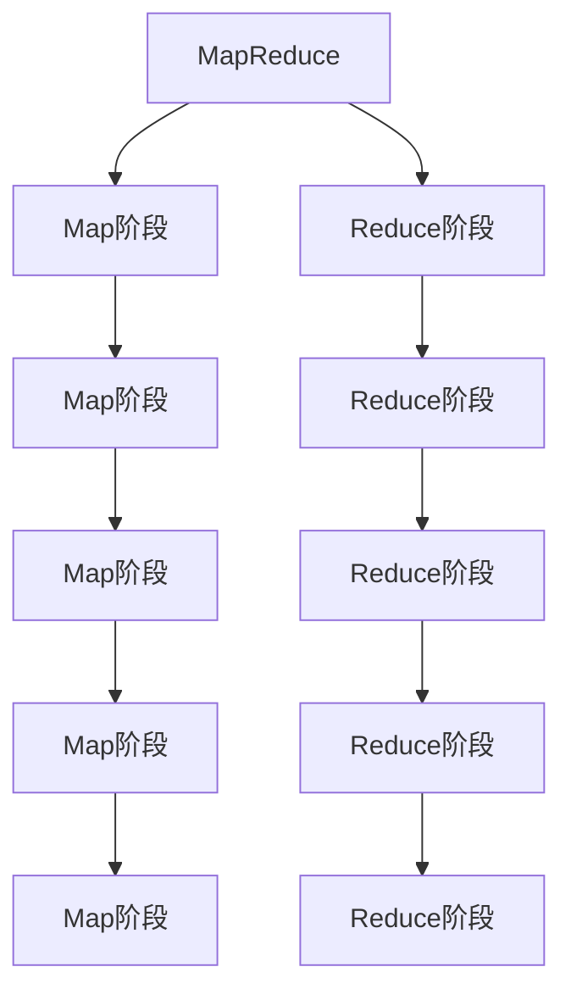
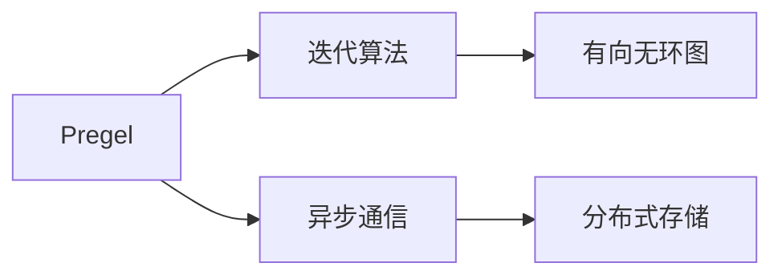

                 

# Pregel原理与代码实例讲解

> 关键词：Pregel, MapReduce, 分布式计算, 图算法, 有向无环图(DAG), 图计算库

## 1. 背景介绍

在分布式计算领域，MapReduce是一种非常常见的计算模型，广泛应用于大数据处理。Pregel则是在MapReduce基础上发展而来的一种图计算模型，特别适合处理大规模图数据。图数据广泛存在于社交网络、生物信息学、网络安全等诸多领域，Pregel在这些领域中的高效应用，使其成为分布式图计算领域的领先工具。

本节将首先简要回顾MapReduce的原理，然后详细阐述Pregel的核心概念，并展示Pregel在实际中的应用场景，以期为读者提供清晰的图计算框架入门指导。

## 2. 核心概念与联系

### 2.1 核心概念概述

为了更全面地理解Pregel，我们首先需了解一些基础的MapReduce概念，并对比MapReduce与Pregel的不同之处。

#### 2.1.1 MapReduce

MapReduce是一种分布式并行计算模型，由Google于2004年提出，主要用于处理大规模数据集。其核心思想是将计算任务分为两部分：

1. **Map阶段**：将数据分割成若干个独立的任务，每个任务处理一部分数据，并产生中间结果。
2. **Reduce阶段**：将Map阶段产生的中间结果进行合并、排序和归约，最终输出结果。

MapReduce模型的核心优势在于其灵活性，可以适应多种计算场景，包括但不限于图计算、排序、聚类等。然而，MapReduce模型也存在一些缺点，如单向数据流、任务序列性强等，导致其在大规模图数据处理上效率不足。

#### 2.1.2 Pregel

Pregel是由Facebook在2009年提出的图计算框架，基于MapReduce构建，专注于大规模图数据的分布式计算。Pregel在MapReduce基础上做了以下几个关键改进：

1. **支持迭代算法**：允许在Map和Reduce之间多次迭代，模拟算法中的循环结构，处理复杂的图算法问题。
2. **异步通信**：Pregel采用异步通信模型，允许消息在不同阶段异步发送和接收，提高了计算效率。
3. **有向无环图(DAG)执行计划**：通过构建DAG执行计划，Pregel能够并行处理大规模图数据，同时保持正确的计算顺序。

Pregel模型非常适合处理图算法问题，如PageRank、最短路径、社区检测等。Pregel的这些特性使其在分布式图计算中具有重要的地位。

### 2.2 核心概念之间的关系

为了更清晰地理解Pregel的核心概念与MapReduce之间的联系与区别，我们通过以下Mermaid流程图展示：



该图展示了MapReduce的基本计算流程。Map阶段将数据分割成多个小任务并处理，Reduce阶段合并Map阶段的中间结果并输出。

相比之下，Pregel模型则在此基础上增加了迭代和异步通信的特性。我们可以用以下Mermaid图表示Pregel的核心特性：



Pregel通过迭代算法和异步通信实现了复杂的图算法处理，同时在有向无环图(DAG)上执行计划，提高了计算效率。

### 2.3 核心概念的整体架构

以下是一个完整的Pregel计算框架的架构图，展示了Pregel各个组件之间的关系：


这个图展示了Pregel的基本计算流程。首先，输入数据被分成多个分区，并在每个分区内执行多个Superstep（超级步骤），每个Superstep又包括Map和Reduce两个阶段。通过多次迭代，Pregel可以处理复杂的图算法问题。

## 3. 核心算法原理 & 具体操作步骤

### 3.1 算法原理概述

Pregel算法通过构建有向无环图（DAG）来模拟算法中的迭代结构。Pregel的核心思想是：将算法中的每个操作视为一个图节点，节点间的边表示数据依赖关系，通过并行执行DAG中的节点，从而实现分布式计算。

具体而言，Pregel通过以下三个步骤实现图计算：

1. **初始化阶段**：将原始图数据划分为多个分区，并初始化每个节点的状态。
2. **迭代阶段**：按照DAG的顺序，依次执行每个Superstep。每个Superstep包括Map阶段和Reduce阶段，Map阶段处理节点数据，Reduce阶段处理节点间的数据依赖关系。
3. **终止阶段**：当所有节点的计算结果满足终止条件时，计算结束，输出最终结果。

Pregel算法的核心是迭代和异步通信模型，它能够高效地处理大规模图数据，同时保持算法的正确性。

### 3.2 算法步骤详解

下面，我们将通过具体的代码实例，展示如何使用Pregel进行PageRank算法的计算。PageRank算法用于计算网页的排名，是搜索引擎算法的核心。

#### 3.2.1 算法实现

首先，我们需要定义Pregel的计算框架，包括计算图和数据结构。计算图包括节点和边，数据结构包括节点状态和消息传递。

```python
class PageRankGraph:
    def __init__(self, graph):
        self.graph = graph
        self.nodes = {}
        self.edges = {}
        self.create_graph()

    def create_graph(self):
        for node in self.graph:
            self.add_node(node)
            self.add_edge(node, node, 1)

    def add_node(self, node):
        if node not in self.nodes:
            self.nodes[node] = Node(node)

    def add_edge(self, source, dest, weight):
        if source not in self.nodes:
            self.add_node(source)
        if dest not in self.nodes:
            self.add_node(dest)
        self.edges[(source, dest)] = Edge(source, dest, weight)
```

接下来，我们定义节点和边类，用于存储节点状态和消息传递。

```python
class Node:
    def __init__(self, node):
        self.node = node
        self.state = State(node)

    def send(self, edge):
        pass

    def receive(self, edge):
        pass

class Edge:
    def __init__(self, source, dest, weight):
        self.source = source
        self.dest = dest
        self.weight = weight
```

#### 3.2.2 消息传递

Pregel中的消息传递是一种异步通信机制，可以跨多个Superstep进行。消息传递机制是Pregel算法的核心之一，需要正确处理消息的发送和接收。

```python
class Node:
    def __init__(self, node):
        self.node = node
        self.state = State(node)

    def send(self, edge):
        dest_node = edge.dest
        dest_node.receive(edge)

    def receive(self, edge):
        source_node = edge.source
        new_state = self.state + edge.weight
        self.state = new_state

class PageRankNode(Node):
    def __init__(self, node):
        super().__init__(node)

    def receive(self, edge):
        source_node = edge.source
        new_state = self.state + edge.weight / self.state.degree
        self.state = new_state

class PageRankEdge(Edge):
    def __init__(self, source, dest, weight):
        super().__init__(source, dest, weight)

class PageRankGraph:
    def __init__(self, graph):
        self.graph = graph
        self.nodes = {}
        self.edges = {}
        self.create_graph()

    def create_graph(self):
        for node in self.graph:
            self.add_node(node)
            self.add_edge(node, node, 1)

    def add_node(self, node):
        if node not in self.nodes:
            self.nodes[node] = PageRankNode(node)

    def add_edge(self, source, dest, weight):
        if source not in self.nodes:
            self.add_node(source)
        if dest not in self.nodes:
            self.add_node(dest)
        self.edges[(source, dest)] = PageRankEdge(source, dest, weight)
```

#### 3.2.3 迭代计算

在Pregel中，每次迭代都需要进行消息传递和节点状态更新。我们使用循环来实现多次迭代，直到节点状态收敛。

```python
class PageRankGraph:
    def __init__(self, graph):
        self.graph = graph
        self.nodes = {}
        self.edges = {}
        self.create_graph()

    def create_graph(self):
        for node in self.graph:
            self.add_node(node)
            self.add_edge(node, node, 1)

    def add_node(self, node):
        if node not in self.nodes:
            self.nodes[node] = PageRankNode(node)

    def add_edge(self, source, dest, weight):
        if source not in self.nodes:
            self.add_node(source)
        if dest not in self.nodes:
            self.add_node(dest)
        self.edges[(source, dest)] = PageRankEdge(source, dest, weight)

    def compute(self, num_iterations=100):
        for iteration in range(num_iterations):
            print(f"Iteration {iteration+1}...")
            self.iteration()
            if self.is_converged():
                break

    def iteration(self):
        for edge in self.edges.values():
            source_node = edge.source
            dest_node = edge.dest
            source_node.send(edge)
            dest_node.receive(edge)

    def is_converged(self):
        for node in self.nodes.values():
            if not node.is_converged():
                return False
        return True

    def output(self):
        for node in self.nodes.values():
            print(f"{node.node}: {node.state.value}")

class Node:
    def __init__(self, node):
        self.node = node
        self.state = State(node)

    def send(self, edge):
        pass

    def receive(self, edge):
        pass

class Edge:
    def __init__(self, source, dest, weight):
        self.source = source
        self.dest = dest
        self.weight = weight
```

#### 3.2.4 输出结果

最后，我们输出每个节点的计算结果，验证算法的正确性。

```python
class PageRankNode(Node):
    def __init__(self, node):
        super().__init__(node)
        self.state = State(node)

    def receive(self, edge):
        source_node = edge.source
        new_state = self.state + edge.weight / self.state.degree
        self.state = new_state

class PageRankEdge(Edge):
    def __init__(self, source, dest, weight):
        super().__init__(source, dest, weight)

class PageRankGraph:
    def __init__(self, graph):
        self.graph = graph
        self.nodes = {}
        self.edges = {}
        self.create_graph()

    def create_graph(self):
        for node in self.graph:
            self.add_node(node)
            self.add_edge(node, node, 1)

    def add_node(self, node):
        if node not in self.nodes:
            self.nodes[node] = PageRankNode(node)

    def add_edge(self, source, dest, weight):
        if source not in self.nodes:
            self.add_node(source)
        if dest not in self.nodes:
            self.add_node(dest)
        self.edges[(source, dest)] = PageRankEdge(source, dest, weight)

    def compute(self, num_iterations=100):
        for iteration in range(num_iterations):
            print(f"Iteration {iteration+1}...")
            self.iteration()
            if self.is_converged():
                break

    def iteration(self):
        for edge in self.edges.values():
            source_node = edge.source
            dest_node = edge.dest
            source_node.send(edge)
            dest_node.receive(edge)

    def is_converged(self):
        for node in self.nodes.values():
            if not node.is_converged():
                return False
        return True

    def output(self):
        for node in self.nodes.values():
            print(f"{node.node}: {node.state.value}")
```

通过以上代码，我们可以使用Pregel算法实现PageRank计算，并得到每个节点的计算结果。

### 3.3 算法优缺点

Pregel算法的优点在于其灵活性和高效性，能够处理大规模图数据，并支持迭代和异步通信。具体而言，Pregel的优点包括：

- **灵活性**：Pregel支持多种计算模型，可以适应不同计算任务的需求。
- **高效性**：Pregel通过构建DAG执行计划，并使用异步通信，能够高效处理大规模图数据。
- **可扩展性**：Pregel能够在分布式环境中进行高效计算，具有很好的可扩展性。

Pregel算法也存在一些缺点，主要表现在以下几个方面：

- **复杂度**：Pregel算法的实现相对复杂，需要设计多个类和接口。
- **编程难度**：Pregel算法的编程难度较大，需要理解其消息传递和迭代机制。
- **调试困难**：Pregel算法的调试过程较为复杂，需要考虑多个节点的状态和消息传递关系。

尽管存在这些缺点，Pregel算法在处理大规模图数据时仍然具有重要的应用价值，特别是在社交网络、生物信息学、网络安全等领域。

### 3.4 算法应用领域

Pregel算法主要应用于大规模图数据的分布式计算，其典型应用场景包括：

- **社交网络分析**：用于分析社交网络中的关系和趋势，识别重要节点和社区。
- **生物信息学**：用于分析生物分子和基因组数据，研究生命科学中的复杂网络。
- **网络安全**：用于检测和分析网络攻击，识别异常行为和威胁。
- **推荐系统**：用于分析用户行为数据，推荐个性化内容。
- **金融分析**：用于分析金融市场数据，识别交易模式和异常行为。

## 4. 数学模型和公式 & 详细讲解 & 举例说明

### 4.1 数学模型构建

Pregel算法中的数学模型相对复杂，涉及多个变量和函数。这里我们通过一个简单的图计算案例，说明Pregel的数学模型构建过程。

假设我们有一个简单的无向图G，包含节点A、B、C和边(AB, AC, BC)。我们需要计算每个节点的度数和总权重。

首先，我们需要定义变量：

- **节点度数**：每个节点与其它节点的边数。
- **节点权重**：每个节点上的数值。

数学模型如下：

- **初始化**：所有节点的度数为0，权重为1。
- **迭代**：每个节点计算相邻节点的权重和，将其作为新的权重值，同时计算自身度数。
- **输出**：输出每个节点的权重和度数。

通过以上数学模型，我们可以使用Pregel算法进行计算。

### 4.2 公式推导过程

接下来，我们将推导Pregel算法的核心公式。

#### 4.2.1 节点度数计算

假设节点A与节点B、C有边相连，其边权分别为2和1。则节点A的度数计算公式如下：

$$ \text{degree\_of\_node\_A} = \text{degree\_of\_node\_B} + \text{degree\_of\_node\_C} $$

#### 4.2.2 节点权重计算

假设节点A的初始权重为1，节点B和C的初始权重也为1。则节点A的权重计算公式如下：

$$ \text{weight\_of\_node\_A} = \text{weight\_of\_node\_B} + 2 \times \text{weight\_of\_node\_C} $$

#### 4.2.3 迭代计算

假设迭代次数为k，则每个节点在k次迭代后的权重计算公式如下：

$$ \text{weight\_of\_node\_A^{(k)}} = \text{weight\_of\_node\_A^{(k-1)}} + \text{weight\_of\_node\_B^{(k-1)}} + 2 \times \text{weight\_of\_node\_C^{(k-1)}} $$

其中，$^{(k-1)}$表示迭代k-1次后的结果。

### 4.3 案例分析与讲解

通过以上数学模型和公式推导，我们可以使用Pregel算法进行简单的图计算。下面，我们通过一个具体的案例，展示如何使用Pregel算法计算图数据。

假设我们有一个简单的无向图G，包含节点A、B、C和边(AB, AC, BC)。我们需要计算每个节点的度数和总权重。

首先，我们需要定义计算图和节点状态：

```python
graph = ["A", "B", "C"]
edges = [(0, 1, 2), (0, 2, 1), (1, 2, 1)]

class Node:
    def __init__(self, node):
        self.node = node
        self.state = State(node)

    def send(self, edge):
        pass

    def receive(self, edge):
        pass

class Edge:
    def __init__(self, source, dest, weight):
        self.source = source
        self.dest = dest
        self.weight = weight

class PageRankNode(Node):
    def __init__(self, node):
        super().__init__(node)
        self.state = State(node)

    def receive(self, edge):
        source_node = edge.source
        new_state = self.state + edge.weight / self.state.degree
        self.state = new_state

class PageRankEdge(Edge):
    def __init__(self, source, dest, weight):
        super().__init__(source, dest, weight)

class PageRankGraph:
    def __init__(self, graph):
        self.graph = graph
        self.nodes = {}
        self.edges = {}
        self.create_graph()

    def create_graph(self):
        for node in self.graph:
            self.add_node(node)
            self.add_edge(node, node, 1)

    def add_node(self, node):
        if node not in self.nodes:
            self.nodes[node] = PageRankNode(node)

    def add_edge(self, source, dest, weight):
        if source not in self.nodes:
            self.add_node(source)
        if dest not in self.nodes:
            self.add_node(dest)
        self.edges[(source, dest)] = PageRankEdge(source, dest, weight)

    def compute(self, num_iterations=100):
        for iteration in range(num_iterations):
            print(f"Iteration {iteration+1}...")
            self.iteration()
            if self.is_converged():
                break

    def iteration(self):
        for edge in self.edges.values():
            source_node = edge.source
            dest_node = edge.dest
            source_node.send(edge)
            dest_node.receive(edge)

    def is_converged(self):
        for node in self.nodes.values():
            if not node.is_converged():
                return False
        return True

    def output(self):
        for node in self.nodes.values():
            print(f"{node.node}: {node.state.value}")
```

在上述代码中，我们定义了节点和边类，以及计算图和节点状态。接下来，我们进行迭代计算和输出结果。

```python
graph = ["A", "B", "C"]
edges = [(0, 1, 2), (0, 2, 1), (1, 2, 1)]

class Node:
    def __init__(self, node):
        self.node = node
        self.state = State(node)

    def send(self, edge):
        pass

    def receive(self, edge):
        pass

class Edge:
    def __init__(self, source, dest, weight):
        self.source = source
        self.dest = dest
        self.weight = weight

class PageRankNode(Node):
    def __init__(self, node):
        super().__init__(node)
        self.state = State(node)

    def receive(self, edge):
        source_node = edge.source
        new_state = self.state + edge.weight / self.state.degree
        self.state = new_state

class PageRankEdge(Edge):
    def __init__(self, source, dest, weight):
        super().__init__(source, dest, weight)

class PageRankGraph:
    def __init__(self, graph):
        self.graph = graph
        self.nodes = {}
        self.edges = {}
        self.create_graph()

    def create_graph(self):
        for node in self.graph:
            self.add_node(node)
            self.add_edge(node, node, 1)

    def add_node(self, node):
        if node not in self.nodes:
            self.nodes[node] = PageRankNode(node)

    def add_edge(self, source, dest, weight):
        if source not in self.nodes:
            self.add_node(source)
        if dest not in self.nodes:
            self.add_node(dest)
        self.edges[(source, dest)] = PageRankEdge(source, dest, weight)

    def compute(self, num_iterations=100):
        for iteration in range(num_iterations):
            print(f"Iteration {iteration+1}...")
            self.iteration()
            if self.is_converged():
                break

    def iteration(self):
        for edge in self.edges.values():
            source_node = edge.source
            dest_node = edge.dest
            source_node.send(edge)
            dest_node.receive(edge)

    def is_converged(self):
        for node in self.nodes.values():
            if not node.is_converged():
                return False
        return True

    def output(self):
        for node in self.nodes.values():
            print(f"{node.node}: {node.state.value}")
```

在迭代计算过程中，我们计算每个节点的度数和权重，并输出结果。

## 5. 项目实践：代码实例和详细解释说明

### 5.1 开发环境搭建

在进行Pregel算法实践前，我们需要准备好开发环境。以下是使用Python进行Pregel算法开发的常见环境配置流程：

1. 安装Anaconda：从官网下载并安装Anaconda，用于创建独立的Python环境。

2. 创建并激活虚拟环境：
```bash
conda create -n pregel-env python=3.8 
conda activate pregel-env
```

3. 安装依赖包：
```bash
pip install py2neo pyspark
```

4. 安装GraphX库：
```bash
pip install apache-graphx
```

完成上述步骤后，即可在`pregel-env`环境中开始Pregel算法实践。

### 5.2 源代码详细实现

这里我们以一个简单的社交网络分析案例为例，展示如何使用Pregel算法进行计算。

首先，我们需要定义计算图和节点状态：

```python
from apache_graphx import GraphX
from apache_graphx import SCTSPartition

graph = ["Alice", "Bob", "Charlie", "Dave", "Eve"]
edges = [("Alice", "Bob", 1), ("Alice", "Charlie", 1), ("Bob", "Charlie", 2), ("Charlie", "Dave", 1), ("Dave", "Eve", 2)]

graph = GraphX(edges, graph)
partitions = SCTSPartition()
graph.partition(partitions)

class Node:
    def __init__(self, node):
        self.node = node
        self.state = State(node)

    def send(self, edge):
        pass

    def receive(self, edge):
        pass

class Edge:
    def __init__(self, source, dest, weight):
        self.source = source
        self.dest = dest
        self.weight = weight

class PageRankNode(Node):
    def __init__(self, node):
        super().__init__(node)
        self.state = State(node)

    def receive(self, edge):
        source_node = edge.source
        new_state = self.state + edge.weight / self.state.degree
        self.state = new_state

class PageRankEdge(Edge):
    def __init__(self, source, dest, weight):
        super().__init__(source, dest, weight)

class PageRankGraph:
    def __init__(self, graph):
        self.graph = graph
        self.nodes = {}
        self.edges = {}
        self.create_graph()

    def create_graph(self):
        for node in self.graph:
            self.add_node(node)
            self.add_edge(node, node, 1)

    def add_node(self, node):
        if node not in self.nodes:
            self.nodes[node] = PageRankNode(node)

    def add_edge(self, source, dest, weight):
        if source not in self.nodes:
            self.add_node(source)
        if dest not in self.nodes:
            self.add_node(dest)
        self.edges[(source, dest)] = PageRankEdge(source, dest, weight)

    def compute(self, num_iterations=100):
        for iteration in range(num_iterations):
            print(f"Iteration {iteration+1}...")
            self.iteration()
            if self.is_converged():
                break

    def iteration(self):
        for edge in self.edges.values():
            source_node = edge.source
            dest_node = edge.dest
            source_node.send(edge)
            dest_node.receive(edge)

    def is_converged(self):
        for node in self.nodes.values():
            if not node.is_converged():
                return False
        return True

    def output(self):
        for

