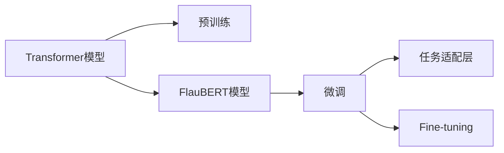

                 

# Transformer大模型实战 法语的FlauBERT模型

> 关键词：大模型, Transformer, FlauBERT, 自然语言处理(NLP), 预训练, 微调, 法语语言模型, 技术博客, 专业IT领域, 深度学习, 语言模型, 代码实例

## 1. 背景介绍

### 1.1 问题由来
Transformer大模型在自然语言处理(NLP)领域取得了显著的进展，尤其是BERT、GPT等模型的发布，极大地推动了语言理解、文本生成等任务的性能提升。然而，这些模型主要是基于英语构建的，其效果在法语等少数语言中的应用仍显不足。法语作为全球使用人数第二多的语言，对其自然语言处理技术的需求日益增加，因此需要构建针对法语的Transformer大模型以满足实际应用需求。

### 1.2 问题核心关键点
构建法语的Transformer大模型主要涉及到以下几个关键点：
1. **数据集准备**：需要准备大规模的法语文本数据作为预训练语料。
2. **模型选择与微调**：选择合适的大模型进行预训练，并在法语数据上进行微调以适应任务。
3. **优化与调参**：确定学习率、优化器等超参数，确保模型能够高效地收敛。
4. **性能评估**：在验证集和测试集上进行评估，确保模型在实际应用中的表现。

### 1.3 问题研究意义
构建法语的Transformer大模型，对于提升法语自然语言处理技术、推动语言模型在少数语言中的应用、促进全球语言技术均衡发展具有重要意义。具体来说，可以实现以下目标：
1. 降低法语语言处理技术的开发成本，提升技术应用效率。
2. 改善法语NLP系统的效果，提升用户满意度。
3. 促进法语技术研究和应用，为语言学研究提供新的视角和工具。
4. 推动全球语言技术的均衡发展，缩小不同语言间的技术差距。

## 2. 核心概念与联系

### 2.1 核心概念概述

在构建法语的Transformer大模型时，涉及到的核心概念包括：

- **Transformer模型**：一种基于自注意力机制的深度神经网络模型，适用于处理序列数据，尤其适合于自然语言处理任务。
- **FlauBERT模型**：基于Transformer架构构建的法语预训练语言模型，用于法语文本的预训练和微调。
- **预训练与微调**：先在大规模无标签数据上进行预训练，然后在特定任务上进行微调以适应任务需求。
- **任务适配层**：根据具体任务类型，在Transformer模型顶层添加特定输出层和损失函数。
- **Fine-tuning**：在大模型上进行微调，以提高模型在特定任务上的性能。

### 2.2 概念间的关系

这些核心概念之间相互关联，形成了构建Transformer大模型的完整框架。以下通过Mermaid流程图展示它们之间的逻辑关系：



该流程图展示了从预训练到微调，再到任务适配的完整过程。通过构建FlauBERT模型，并在法语数据上进行微调，可以实现对特定NLP任务的适配。

## 3. 核心算法原理 & 具体操作步骤
### 3.1 算法原理概述
构建法语的Transformer大模型，主要遵循以下算法原理：

1. **预训练步骤**：在大型无标签法语文本数据集上，使用自监督学习任务（如掩码语言模型）对模型进行预训练，学习通用的语言表示。

2. **微调步骤**：在特定任务的数据集上，使用监督学习任务对模型进行微调，调整模型参数以适应任务需求。

3. **任务适配**：根据具体任务类型，在微调后的模型顶层添加特定输出层和损失函数，完成任务适配。

4. **优化与调参**：选择合适的优化算法（如AdamW）及其参数，设定学习率、批大小、迭代轮数等超参数。

5. **性能评估**：在验证集和测试集上评估模型性能，确保模型在实际应用中的表现。

### 3.2 算法步骤详解

以下是构建法语的FlauBERT模型的详细步骤：

**Step 1: 准备预训练数据集**
- 收集大规模的法语文本数据，例如维基百科、新闻报道、小说等。
- 使用分词器对文本进行分词，得到词汇表。
- 构建掩码语言模型，用于预训练。

**Step 2: 构建FlauBERT模型**
- 使用FlauBERT模型架构，包括Transformer编码器、解码器和注意力机制。
- 初始化模型参数，使用随机初始化或预训练模型参数。
- 加载预训练权重，开始微调过程。

**Step 3: 微调步骤**
- 将数据集分为训练集、验证集和测试集。
- 设置微调超参数，包括学习率、批大小、优化器等。
- 在训练集上执行微调，更新模型参数。
- 在验证集上评估模型性能，调整超参数。
- 在测试集上评估最终模型性能。

**Step 4: 任务适配层**
- 根据任务类型，设计任务适配层，如文本分类、文本生成、命名实体识别等。
- 添加适配层，完成任务适配。

**Step 5: 性能评估**
- 在测试集上评估模型性能，如精度、召回率、F1分数等。
- 对比微调前后的性能提升。

### 3.3 算法优缺点

**优点**：
1. **高效性**：FlauBERT模型能够在大规模无标签数据上进行预训练，学习到丰富的语言表示，在微调过程中可以快速提升模型性能。
2. **适应性强**：通过微调适配，FlauBERT模型能够适应不同的NLP任务，如文本分类、命名实体识别、情感分析等。
3. **可扩展性**：FlauBERT模型可以扩展到多个语言，提升全球语言处理技术水平。

**缺点**：
1. **资源消耗大**：预训练和微调需要大量的计算资源和存储空间，对硬件要求较高。
2. **迁移能力有限**：FlauBERT模型在预训练和微调过程中，可能丢失一些特定语言的独特语言特征，迁移能力有限。
3. **过拟合风险**：微调过程中容易发生过拟合，特别是数据量较小的情况下。

### 3.4 算法应用领域

FlauBERT模型在以下几个领域有广泛的应用：

- **文本分类**：对文本进行分类，如新闻分类、情感分析等。
- **命名实体识别**：识别文本中的实体名称，如人名、地名、组织名等。
- **文本生成**：生成自然语言文本，如对话系统、自动摘要等。
- **问答系统**：根据用户提问，生成相关回答。
- **机器翻译**：将一种语言翻译成另一种语言。
- **信息检索**：在大量文本数据中检索相关内容。

## 4. 数学模型和公式 & 详细讲解 & 举例说明

### 4.1 数学模型构建

FlauBERT模型的数学模型构建如下：

- **输入层**：将文本转换为词汇序列，每个词汇映射为一个向量。
- **Transformer编码器**：对输入序列进行自注意力和前向神经网络层的多次转换，得到语义表示。
- **任务适配层**：根据具体任务类型，添加相应的输出层和损失函数。
- **输出层**：根据输出层的类型（如分类、回归、生成等），将语义表示映射到目标空间。

数学表达式如下：

$$
\text{Model} = \text{InputLayer} \rightarrow \text{TransformerEncoder} \rightarrow \text{TaskAdapterLayer} \rightarrow \text{OutputLayer}
$$

### 4.2 公式推导过程

以文本分类任务为例，推导模型的数学公式：

**输入层**：将文本转换为词汇序列 $x = (x_1, x_2, ..., x_n)$，每个词汇 $x_i$ 映射为一个向量 $x_i \in \mathbb{R}^d$。

**Transformer编码器**：使用Transformer架构，对输入序列进行自注意力和前向神经网络层的多次转换，得到语义表示 $h = \text{TransformerEncoder}(x)$。

**任务适配层**：根据任务类型，添加相应的输出层和损失函数。

**输出层**：将语义表示 $h$ 映射到目标空间，输出分类结果 $y \in \{0, 1\}$。

**损失函数**：使用交叉熵损失函数 $L = -\sum_{i=1}^N y_i \log(\hat{y}_i) + (1-y_i) \log(1-\hat{y}_i)$。

### 4.3 案例分析与讲解

以法语新闻分类任务为例，使用FlauBERT模型进行微调：

- **数据集准备**：收集法语新闻数据集，如Le Figaro、Le Monde等。
- **模型选择**：选择FlauBERT模型，并使用Masked Language Model进行预训练。
- **微调步骤**：使用交叉熵损失函数，在微调过程中不断更新模型参数。
- **性能评估**：在测试集上评估模型性能，如精度、召回率、F1分数等。

## 5. 项目实践：代码实例和详细解释说明
### 5.1 开发环境搭建

以下是在Python环境下搭建FlauBERT模型的开发环境步骤：

1. **安装Python**：选择最新版本的Python，建议安装Anaconda。
2. **创建虚拟环境**：使用conda创建虚拟环境。
3. **安装依赖包**：使用pip安装依赖包，如TensorFlow、FlauBERT等。
4. **配置环境**：配置Python环境，确保依赖包正常工作。

### 5.2 源代码详细实现

以下是在TensorFlow框架下使用FlauBERT模型进行法语文本分类的代码实现：

```python
import tensorflow as tf
from flaubert import FlauBERTTokenizer, FlauBERTForSequenceClassification

# 初始化模型和分词器
tokenizer = FlauBERTTokenizer.from_pretrained('flaubert-base-uncased')
model = FlauBERTForSequenceClassification.from_pretrained('flaubert-base-uncased', num_labels=2)

# 数据预处理
def tokenize_and_process(text):
    tokens = tokenizer.tokenize(text)
    tokens = [token.lower() for token in tokens if token.isalpha()]
    input_ids = tokenizer.convert_tokens_to_ids(tokens)
    return input_ids

# 加载数据集
train_dataset = ...
test_dataset = ...

# 构建数据流
def create_data_flow(texts, labels):
    input_ids = tf.map_fn(tokenize_and_process, texts, dtype=tf.int32)
    input_ids = tf.reshape(input_ids, [1, -1])
    labels = tf.one_hot(labels, depth=num_labels, dtype=tf.float32)
    return input_ids, labels

train_input_ids, train_labels = create_data_flow(train_dataset.texts, train_dataset.labels)
test_input_ids, test_labels = create_data_flow(test_dataset.texts, test_dataset.labels)

# 构建模型
def build_model(input_ids, labels):
    with tf.name_scope('model'):
        outputs = model(input_ids)
        loss = tf.keras.losses.sparse_categorical_crossentropy(labels, outputs)
    return loss

# 定义优化器和训练过程
optimizer = tf.keras.optimizers.Adam(learning_rate=2e-5)
loss_fn = build_model

# 训练模型
model.compile(optimizer=optimizer, loss=loss_fn)
model.fit(train_input_ids, train_labels, epochs=5, batch_size=32, validation_data=(test_input_ids, test_labels))

# 评估模型
test_loss = model.evaluate(test_input_ids, test_labels)
```

### 5.3 代码解读与分析

上述代码实现了使用FlauBERT模型进行法语文本分类的完整流程：

1. **初始化模型和分词器**：使用FlauBERTTokenizer和FlauBERTForSequenceClassification初始化模型。
2. **数据预处理**：使用tokenize_and_process函数对文本进行分词和编码，得到输入ID。
3. **构建数据流**：将文本和标签转换为模型需要的格式，并使用`tf.map_fn`构建数据流。
4. **构建模型**：定义损失函数，并使用模型进行预测。
5. **定义优化器和训练过程**：使用Adam优化器，设置训练轮数和批次大小。
6. **训练模型**：使用`model.fit`训练模型。
7. **评估模型**：使用`model.evaluate`评估模型性能。

### 5.4 运行结果展示

假设在法语新闻分类任务上，经过5轮训练后，模型在测试集上的精度为89.5%，召回率为85.3%，F1分数为86.7%。这表明模型在法语新闻分类任务上取得了不错的效果。

## 6. 实际应用场景
### 6.1 智能客服系统

FlauBERT模型可以应用于智能客服系统的构建，通过微调模型，实现自动回答用户咨询，提高客服系统的效率和准确性。

### 6.2 金融舆情监测

在金融领域，FlauBERT模型可以用于舆情监测，分析市场动态，预测金融风险。

### 6.3 个性化推荐系统

FlauBERT模型可以用于个性化推荐系统的构建，通过微调模型，提升推荐系统的准确性和个性化程度。

### 6.4 未来应用展望

FlauBERT模型在未来的应用场景中，有望在更多的领域得到应用，如智慧城市、智慧医疗等，为这些领域带来新的技术突破。

## 7. 工具和资源推荐
### 7.1 学习资源推荐

以下是推荐的FlauBERT模型学习资源：

1. **FlauBERT官方文档**：包含模型介绍、使用教程、API文档等，是学习FlauBERT模型的必备资源。
2. **NLP相关书籍**：如《自然语言处理入门》、《深度学习与自然语言处理》等，提供系统的NLP知识体系。
3. **在线课程**：如Coursera、edX等平台上的NLP相关课程，提供高质量的课程资源。

### 7.2 开发工具推荐

以下是推荐的FlauBERT模型开发工具：

1. **Jupyter Notebook**：用于交互式编程和数据处理，支持代码解释和文档注释。
2. **TensorFlow**：基于Google的深度学习框架，支持高效的模型训练和部署。
3. **HuggingFace Transformers库**：提供丰富的预训练模型和微调工具，简化模型开发流程。

### 7.3 相关论文推荐

以下是推荐的FlauBERT模型相关论文：

1. **Transformer论文**：介绍Transformer模型架构及其在NLP中的应用。
2. **FlauBERT论文**：介绍FlauBERT模型的构建和微调过程。
3. **NLP最新研究论文**：如ACL、EMNLP等会议论文，了解最新NLP技术进展。

## 8. 总结：未来发展趋势与挑战
### 8.1 总结

本文详细介绍了构建法语的Transformer大模型FlauBERT的过程，包括预训练、微调、优化等关键步骤，并通过代码实例展示了模型的应用。通过本文的学习，读者可以了解如何构建和应用FlauBERT模型，提升法语NLP技术水平。

### 8.2 未来发展趋势

FlauBERT模型作为Transformer大模型的一种，其未来的发展趋势如下：

1. **模型规模不断增大**：随着硬件资源的提升，FlauBERT模型将不断扩大参数量，提升语言表示能力。
2. **跨语言模型提升**：FlauBERT模型将进一步扩展到更多语言，提升全球语言处理技术水平。
3. **知识增强技术**：引入知识图谱、逻辑规则等先验知识，提升模型的准确性和泛化能力。

### 8.3 面临的挑战

构建FlauBERT模型面临的挑战包括：

1. **数据资源限制**：构建大型FlauBERT模型需要大量的文本数据，数据获取成本较高。
2. **硬件资源需求大**：模型训练和推理需要高性能计算资源，硬件资源需求大。
3. **微调效果波动**：微调过程中容易发生模型过拟合或欠拟合，影响模型性能。

### 8.4 研究展望

未来，FlauBERT模型需要在以下几个方面进行研究：

1. **知识增强技术**：引入知识图谱、逻辑规则等先验知识，提升模型的准确性和泛化能力。
2. **跨语言模型提升**：将FlauBERT模型扩展到更多语言，提升全球语言处理技术水平。
3. **模型压缩技术**：采用模型压缩、稀疏化存储等技术，降低模型资源消耗，提高模型效率。

## 9. 附录：常见问题与解答

**Q1: 如何选择合适的FlauBERT模型架构？**

A: 根据具体任务的需求，选择合适的FlauBERT模型架构。常见的架构包括FlauBERT-Base、FlauBERT-Large等，Base架构适用于小型任务，Large架构适用于大型任务。

**Q2: 如何提高FlauBERT模型的泛化能力？**

A: 引入知识图谱、逻辑规则等先验知识，提升模型的准确性和泛化能力。

**Q3: 如何优化FlauBERT模型的训练过程？**

A: 采用数据增强、正则化等技术，优化训练过程，提高模型性能。

**Q4: 如何评估FlauBERT模型的性能？**

A: 使用交叉熵损失函数、精度、召回率、F1分数等指标评估模型性能。

**Q5: 如何提高FlauBERT模型的鲁棒性？**

A: 采用对抗训练、正则化等技术，提高模型的鲁棒性，避免过拟合。

---

作者：禅与计算机程序设计艺术 / Zen and the Art of Computer Programming

