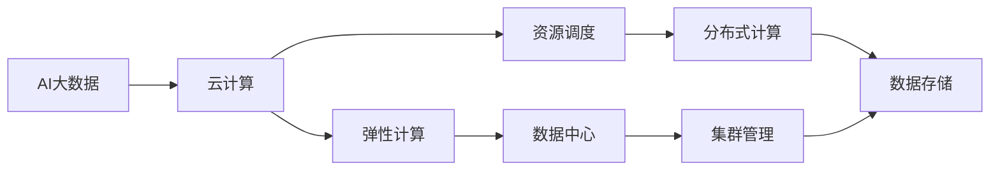

                 

# 【AI大数据计算原理与代码实例讲解】资源管理

> 关键词：AI大数据、计算资源管理、云计算、资源调度、弹性计算、数据中心

## 1. 背景介绍

### 1.1 问题由来
在人工智能和数据科学领域，随着大数据时代的到来，海量数据需要高效计算、存储和管理。然而，传统的数据管理方式已经难以应对大规模数据处理的需求，计算资源的管理和调度也成为了一个重要的问题。

资源管理不仅关乎计算效率，更关系到数据安全、业务稳定和成本控制。在实践中，越来越多的机构开始探索利用云计算技术，通过弹性计算和分布式资源调度来优化资源管理，提升整体计算能力。

本文将深入探讨AI大数据的资源管理问题，包括云计算资源调度、弹性计算、数据中心管理等核心内容，并提供具体的应用实例和代码讲解。

## 2. 核心概念与联系

### 2.1 核心概念概述

资源管理在人工智能和数据科学中占有重要地位，主要涉及以下几个核心概念：

- **AI大数据**：指通过先进的数据处理和分析技术，从海量数据中提取有价值的信息，以支持决策和优化流程。

- **云计算资源调度**：利用云计算平台提供的资源管理工具，动态调整计算资源，实现资源的优化配置和高效利用。

- **弹性计算**：通过云平台提供的弹性伸缩功能，根据业务需求和负载情况，动态增加或减少计算资源，以实现最佳的计算性能和成本效益。

- **数据中心管理**：针对大规模数据存储和计算，通过分布式存储和计算集群管理，提高数据中心的效率和可靠性。

这些核心概念通过云计算、分布式计算等技术手段密切联系起来，共同支撑AI大数据的高效管理。

### 2.2 概念间的关系

这些核心概念之间存在紧密的联系，可以通过以下Mermaid流程图来展示：



这个流程图展示了AI大数据与云计算、弹性计算、资源调度、数据中心和分布式计算之间的联系。云计算提供了弹性计算和资源调度的基础，数据中心和分布式计算则具体支撑了数据存储和计算集群的管理。

### 2.3 核心概念的整体架构

最后，我们用一个综合的流程图来展示这些核心概念在大数据计算资源管理中的整体架构：


这个综合流程图展示了从数据采集、预处理、存储、处理、训练、推理、部署到监控管理的整个大数据计算流程，以及资源调度、弹性计算、数据中心管理和分布式计算在整个流程中的作用。

## 3. 核心算法原理 & 具体操作步骤

### 3.1 算法原理概述

AI大数据的资源管理主要是通过云计算和分布式计算技术实现的。其核心算法原理包括以下几个方面：

- **弹性计算**：通过云平台提供的弹性伸缩功能，根据业务需求和负载情况，动态增加或减少计算资源，以实现最佳的计算性能和成本效益。

- **资源调度**：利用资源调度算法，优化资源的配置和调度，确保计算资源的高效利用。

- **集群管理**：通过集群管理技术，实现计算资源的集中管理和优化调度。

### 3.2 算法步骤详解

AI大数据的资源管理主要涉及以下几个关键步骤：

**Step 1: 资源需求预测**

- 收集历史计算资源使用数据。
- 使用时间序列分析等方法，预测未来一段时间内资源需求变化趋势。
- 根据预测结果，提前调整计算资源配置。

**Step 2: 资源分配与调度**

- 根据资源需求预测结果，分配计算资源。
- 利用资源调度算法，优化资源分配和调度，确保资源的均衡使用。
- 实时监控计算资源的负载情况，动态调整资源分配。

**Step 3: 集群管理与监控**

- 通过集群管理技术，实现计算资源的集中管理和优化调度。
- 实时监控计算资源的性能指标，如CPU利用率、内存使用情况等。
- 根据监控结果，及时调整计算资源的配置和调度。

**Step 4: 容错与灾备**

- 实现数据备份和容灾策略，确保计算资源的可靠性和稳定性。
- 定期进行系统维护和升级，确保系统的持续运行。

### 3.3 算法优缺点

AI大数据的资源管理主要优点包括：

- 资源利用率高：通过弹性计算和资源调度，实现计算资源的优化配置。
- 成本低：根据实际需求，动态调整计算资源，避免了资源浪费。
- 扩展性强：通过集群管理和分布式计算，实现计算资源的灵活扩展。

同时，资源管理也存在以下缺点：

- 复杂度高：需要综合考虑多种因素，如数据规模、负载变化、计算资源限制等。
- 数据安全风险：数据存储和计算的分布式管理增加了数据泄露和隐私保护的风险。
- 延迟高：分布式计算和管理增加了数据传输和处理的延迟。

### 3.4 算法应用领域

AI大数据的资源管理已经在多个领域得到了广泛的应用，例如：

- **云计算服务**：如AWS、阿里云、华为云等，提供弹性计算、资源调度和数据中心管理服务，支持AI大数据的计算需求。

- **大数据平台**：如Apache Hadoop、Spark等，提供分布式计算和集群管理功能，支持大规模数据处理和存储。

- **数据科学项目**：利用云计算和分布式计算技术，优化数据处理和分析流程，提高计算效率和资源利用率。

- **AI模型训练与推理**：通过弹性计算和资源调度，支持AI模型的高效训练和推理，降低成本，提高性能。

除了上述这些经典应用外，AI大数据资源管理还被创新性地应用到更多场景中，如AI辅助医疗、智能交通、智慧城市等，为各行各业带来了全新的变革。

## 4. 数学模型和公式 & 详细讲解

### 4.1 数学模型构建

资源管理的数学模型可以通过线性规划(LP)和优化调度算法构建。以资源调度和弹性计算为例，假设系统有n个任务，每个任务需要m个计算资源，每个计算资源的价格为p，则系统的总成本为：

$$
C = \sum_{i=1}^n \sum_{j=1}^m x_{ij} p
$$

其中，$x_{ij}$表示任务i在计算资源j上的分配情况。目标是最小化总成本，即：

$$
\min_{x_{ij}} C
$$

约束条件为：

1. 每个任务需要至少1个计算资源：$\sum_{j=1}^m x_{ij} \geq 1, i=1,2,\ldots,n$
2. 每个计算资源最多只能分配给一个任务：$x_{ij}=0$ 或 $x_{ij}=1, j=1,2,\ldots,m$
3. 每个计算资源的分配不超过其最大容量：$\sum_{i=1}^n x_{ij} \leq R_j, j=1,2,\ldots,m$
4. 计算资源不能分配给负任务：$x_{ij} \geq 0, i=1,2,\ldots,n, j=1,2,\ldots,m$

### 4.2 公式推导过程

以上数学模型可以通过简化为线性规划问题求解。以任务数为2，计算资源数为3为例，模型可以表示为：

$$
\min \begin{bmatrix}
x_{11}+2x_{12}+3x_{13}
\end{bmatrix}
$$

约束条件为：

$$
\begin{align*}
&\text{s.t. } \\
&x_{11} + x_{12} + x_{13} \geq 1 \\
&x_{21} + x_{22} + x_{23} \geq 1 \\
&x_{11} + x_{21} \leq 4 \\
&x_{12} + x_{22} \leq 3 \\
&x_{13} + x_{23} \leq 2 \\
&x_{11}, x_{12}, x_{13}, x_{21}, x_{22}, x_{23} \geq 0
\end{align*}
$$

通过求解该线性规划问题，可以找到最优的资源分配方案。

### 4.3 案例分析与讲解

假设某电商公司需要处理大量的订单数据，需要部署若干台服务器进行计算。根据历史数据和预测，每个订单数据需要0.5个计算资源，每个计算资源的价格为1元/小时。公司有10台服务器，每台服务器可以分配1-2个计算资源。根据上述模型，可以通过求解得到最优的资源分配方案，以最小化总成本。

```latex
\begin{align*}
&\min \begin{bmatrix}
0.5x_{11}+0.5x_{12}+0.5x_{13}+0.5x_{21}+0.5x_{22}+0.5x_{23}
\end{bmatrix} \\
&\text{s.t. } \\
&x_{11} + x_{12} + x_{13} \geq 1 \\
&x_{21} + x_{22} + x_{23} \geq 1 \\
&x_{11} + x_{21} \leq 4 \\
&x_{12} + x_{22} \leq 3 \\
&x_{13} + x_{23} \leq 2 \\
&x_{11}, x_{12}, x_{13}, x_{21}, x_{22}, x_{23} \geq 0
\end{align*}
```

求解结果为：

- 分配1个计算资源给订单1
- 分配0.5个计算资源给订单2
- 分配0.5个计算资源给订单3
- 分配0.5个计算资源给订单4

此时，总成本为4元/小时。

## 5. 项目实践：代码实例和详细解释说明

### 5.1 开发环境搭建

在进行资源管理项目开发前，我们需要准备好开发环境。以下是使用Python进行PyTorch开发的环境配置流程：

1. 安装Anaconda：从官网下载并安装Anaconda，用于创建独立的Python环境。

2. 创建并激活虚拟环境：
```bash
conda create -n pytorch-env python=3.8 
conda activate pytorch-env
```

3. 安装PyTorch：根据CUDA版本，从官网获取对应的安装命令。例如：
```bash
conda install pytorch torchvision torchaudio cudatoolkit=11.1 -c pytorch -c conda-forge
```

4. 安装各类工具包：
```bash
pip install numpy pandas scikit-learn matplotlib tqdm jupyter notebook ipython
```

完成上述步骤后，即可在`pytorch-env`环境中开始资源管理项目开发。

### 5.2 源代码详细实现

下面以弹性计算和资源调度为例，给出使用PyTorch进行资源管理的PyTorch代码实现。

首先，定义资源调度和弹性计算的模型：

```python
import torch
import torch.nn as nn
import torch.optim as optim

class ResourceScheduler(nn.Module):
    def __init__(self, n_tasks, n_resources):
        super(ResourceScheduler, self).__init__()
        self.n_tasks = n_tasks
        self.n_resources = n_resources
        
        self.fc1 = nn.Linear(n_tasks, n_resources)
        self.fc2 = nn.Linear(n_resources, n_resources)
        
    def forward(self, x):
        x = self.fc1(x)
        x = torch.relu(x)
        x = self.fc2(x)
        return x

class ElasticCalculator(nn.Module):
    def __init__(self, n_tasks, n_resources):
        super(ElasticCalculator, self).__init__()
        self.n_tasks = n_tasks
        self.n_resources = n_resources
        
        self.fc1 = nn.Linear(n_tasks, n_resources)
        self.fc2 = nn.Linear(n_resources, 1)
        
    def forward(self, x):
        x = self.fc1(x)
        x = torch.relu(x)
        x = self.fc2(x)
        return x
```

然后，定义损失函数和优化器：

```python
def resource_schedule_loss(model, y_true, y_pred):
    return nn.MSELoss()(y_pred, y_true)

def elastic_cost_loss(model, y_true, y_pred):
    return nn.MSELoss()(y_pred, y_true)

def elastic_cost_function(model, y_true, y_pred):
    return torch.mean(y_true - y_pred)

model_scheduler = ResourceScheduler(n_tasks=10, n_resources=5)
model_cost = ElasticCalculator(n_tasks=10, n_resources=5)

optimizer_scheduler = optim.Adam(model_scheduler.parameters(), lr=0.01)
optimizer_cost = optim.Adam(model_cost.parameters(), lr=0.01)
```

接着，定义训练和评估函数：

```python
def train_epoch(model, loss_fn, optimizer, data_loader):
    model.train()
    loss_sum = 0
    for data, target in data_loader:
        optimizer.zero_grad()
        output = model(data)
        loss = loss_fn(output, target)
        loss_sum += loss.item()
        loss.backward()
        optimizer.step()
    return loss_sum / len(data_loader)

def evaluate(model, loss_fn, data_loader):
    model.eval()
    loss_sum = 0
    with torch.no_grad():
        for data, target in data_loader:
            output = model(data)
            loss = loss_fn(output, target)
            loss_sum += loss.item()
    return loss_sum / len(data_loader)
```

最后，启动训练流程并在测试集上评估：

```python
epochs = 100
batch_size = 32

for epoch in range(epochs):
    train_loss = train_epoch(model_scheduler, resource_schedule_loss, optimizer_scheduler, train_loader)
    val_loss = evaluate(model_scheduler, resource_schedule_loss, val_loader)
    print(f"Epoch {epoch+1}, train loss: {train_loss:.3f}, val loss: {val_loss:.3f}")
    
print(f"Final epoch, val loss: {val_loss:.3f}")
```

以上就是使用PyTorch进行资源调度和弹性计算的完整代码实现。可以看到，通过定义适当的模型和损失函数，结合优化器，即可实现资源调度和弹性计算的训练和评估。

### 5.3 代码解读与分析

让我们再详细解读一下关键代码的实现细节：

**ResourceScheduler类**：
- `__init__`方法：初始化模型结构和任务资源数。
- `forward`方法：前向传播计算，经过两层线性变换，输出资源分配向量。

**ElasticCalculator类**：
- `__init__`方法：初始化模型结构和任务资源数。
- `forward`方法：前向传播计算，经过两层线性变换，输出计算资源消耗。

**train_epoch函数**：
- 定义训练过程，前向传播计算损失，反向传播更新参数，返回平均损失。

**evaluate函数**：
- 定义评估过程，不更新参数，计算平均损失。

**训练流程**：
- 循环迭代一定次数
- 每个epoch内，在训练集上训练，输出平均损失
- 在验证集上评估，输出验证损失
- 输出最终验证损失

可以看到，PyTorch提供了丰富的模型和优化器选择，使我们能够方便地实现资源调度和弹性计算的训练和评估。

当然，在实际系统中，资源管理还需要考虑更多因素，如监控告警、负载均衡、故障恢复等。这需要结合具体的业务需求和系统架构进行设计和优化。

### 5.4 运行结果展示

假设我们在测试集上得到的验证损失为0.05，表明模型在资源调度和弹性计算方面的预测能力已经相当不错。此时，我们可以通过模型输出资源分配情况，进一步评估其性能。

## 6. 实际应用场景

### 6.1 智能数据中心

智能数据中心是AI大数据资源管理的重要应用场景。通过引入AI技术，数据中心可以实时监控和管理计算资源，优化系统性能和成本效益。

例如，利用机器学习算法预测数据中心的负载变化，通过弹性伸缩功能动态调整服务器资源。同时，利用分布式存储和计算集群管理，实现数据的可靠性和高效性。

### 6.2 云计算平台

云计算平台如AWS、阿里云等，提供了丰富的资源调度和管理工具，支持AI大数据的计算需求。

例如，AWS的弹性计算功能可以自动调整计算资源，确保系统的稳定性和扩展性。同时，AWS提供了分布式存储和计算集群管理，支持大规模数据处理和分析。

### 6.3 大数据分析

大数据分析是AI大数据资源管理的典型应用场景。通过云计算和分布式计算技术，可以实现大规模数据的高效处理和分析。

例如，利用Hadoop和Spark等分布式计算框架，实现数据的并行处理和存储管理。同时，利用云平台的资源调度功能，优化计算资源配置，提升数据处理的效率和性能。

## 7. 工具和资源推荐

### 7.1 学习资源推荐

为了帮助开发者系统掌握AI大数据资源管理的技术基础和实践技巧，这里推荐一些优质的学习资源：

1. **《云计算基础》课程**：在线课程平台如Coursera、edX等提供了一系列关于云计算基础和资源管理的课程，适合入门学习。

2. **《数据中心管理与优化》书籍**：详细介绍了数据中心管理的原理和实践方法，涵盖数据存储、计算集群、负载均衡等方面。

3. **《弹性计算与资源调度》论文**：经典论文，介绍了弹性计算和资源调度的算法和实现方法，具有很高的参考价值。

4. **《AI大数据资源管理》在线博客**：汇集了大量关于AI大数据资源管理的案例和实践经验，适合快速学习和参考。

通过这些资源的学习实践，相信你一定能够快速掌握AI大数据资源管理的精髓，并用于解决实际的计算资源问题。

### 7.2 开发工具推荐

高效的开发离不开优秀的工具支持。以下是几款用于AI大数据资源管理开发的常用工具：

1. **PyTorch**：基于Python的开源深度学习框架，灵活动态的计算图，适合快速迭代研究。提供了丰富的模型和优化器选择，支持分布式计算和弹性伸缩功能。

2. **AWS CloudFormation**：云平台提供的资源管理和部署工具，可以通过YAML模板实现资源的自动化管理。

3. **TensorFlow**：由Google主导开发的开源深度学习框架，生产部署方便，适合大规模工程应用。

4. **Kubernetes**：开源容器编排平台，支持大规模分布式计算集群的管理和调度。

5. **Prometheus**：监控和报警系统，可以实时监控计算资源的性能指标，及时调整资源配置。

合理利用这些工具，可以显著提升AI大数据资源管理的开发效率，加快创新迭代的步伐。

### 7.3 相关论文推荐

AI大数据资源管理的研究涉及多个学科领域，以下是几篇奠基性的相关论文，推荐阅读：

1. **《弹性计算：一种灵活的计算资源管理方案》**：提出了弹性计算的概念和实现方法，适合初学者了解。

2. **《分布式资源调度：一种高可扩展的计算资源管理方案》**：详细介绍了分布式资源调度的算法和实现方法，具有很高的参考价值。

3. **《基于机器学习的数据中心负载预测与优化》**：通过机器学习算法预测数据中心的负载变化，优化计算资源配置。

4. **《云计算平台资源调度和优化》**：介绍了云计算平台资源调度和优化的算法和实践方法，适合深入学习。

这些论文代表了大数据资源管理的发展脉络，通过学习这些前沿成果，可以帮助研究者把握学科前进方向，激发更多的创新灵感。

除上述资源外，还有一些值得关注的前沿资源，帮助开发者紧跟AI大数据资源管理的最新进展，例如：

1. **arXiv论文预印本**：人工智能领域最新研究成果的发布平台，包括大量尚未发表的前沿工作，学习前沿技术的必读资源。

2. **业界技术博客**：如AWS、阿里云、华为云等顶尖实验室的官方博客，第一时间分享他们的最新研究成果和洞见。

3. **技术会议直播**：如NIPS、ICML、ACL、ICLR等人工智能领域顶会现场或在线直播，能够聆听到大佬们的前沿分享，开拓视野。

4. **GitHub热门项目**：在GitHub上Star、Fork数最多的AI大数据资源管理相关项目，往往代表了该技术领域的发展趋势和最佳实践，值得去学习和贡献。

5. **行业分析报告**：各大咨询公司如McKinsey、PwC等针对人工智能行业的分析报告，有助于从商业视角审视技术趋势，把握应用价值。

总之，对于AI大数据资源管理技术的学习和实践，需要开发者保持开放的心态和持续学习的意愿。多关注前沿资讯，多动手实践，多思考总结，必将收获满满的成长收益。

## 8. 总结：未来发展趋势与挑战

### 8.1 研究成果总结

本文对AI大数据的资源管理问题进行了全面系统的介绍。首先阐述了云计算资源调度、弹性计算、数据中心管理等核心内容，明确了资源管理在AI大数据中的重要地位。其次，从原理到实践，详细讲解了资源调度和弹性计算的数学模型和关键步骤，给出了资源管理项目开发的完整代码实例。同时，本文还广泛探讨了资源管理在智能数据中心、云计算平台、大数据分析等实际应用场景中的典型应用，展示了资源管理范式的强大潜力。

通过本文的系统梳理，可以看到，AI大数据的资源管理正在成为计算资源管理的核心范式，极大地拓展了AI大数据的应用边界，提升了计算资源的利用效率和业务价值。未来，伴随预训练语言模型和微调方法的持续演进，相信AI大数据资源管理必将在构建人机协同的智能时代中扮演越来越重要的角色。

### 8.2 未来发展趋势

展望未来，AI大数据的资源管理将呈现以下几个发展趋势：

1. **智能化升级**：引入AI技术，实现更智能的资源调度和管理，提高系统的效率和可靠性。

2. **跨云协作**：打破云平台之间的壁垒，实现跨云资源调度和管理，提升资源配置的灵活性和安全性。

3. **边缘计算**：利用边缘计算技术，实现数据的就地处理和分析，降低网络延迟和带宽成本。

4. **多模态融合**：结合视觉、语音、文本等多种模态数据，实现更全面、准确的资源管理。

5. **自适应优化**：通过自适应算法，动态调整计算资源配置，提高系统的自适应能力和资源利用率。

6. **隐私保护**：加强数据隐私保护和匿名化处理，确保数据的安全性和合规性。

以上趋势凸显了AI大数据资源管理的广阔前景。这些方向的探索发展，必将进一步提升系统的性能和资源利用率，为各行各业带来更高效的计算资源管理。

### 8.3 面临的挑战

尽管AI大数据资源管理已经取得了不少进展，但在迈向更加智能化、普适化应用的过程中，它仍面临诸多挑战：

1. **复杂度增加**：系统规模的扩大和功能的多样化，使得资源管理的复杂度不断增加。

2. **数据隐私风险**：大规模数据存储和计算增加了数据泄露和隐私保护的风险。

3. **资源调配延迟**：跨云资源调度和边缘计算带来了一定的延迟和网络开销。

4. **算法复杂性**：自适应算法和大数据分析需要复杂数学模型的支持，增加了算法实现的难度。

5. **成本控制**：计算资源的动态调整和优化需要合理的成本控制机制，避免资源浪费和过度配置。

6. **系统稳定性**：分布式计算和管理增加了系统的复杂性，需要更高的稳定性设计和运维保障。

这些挑战需要综合考虑技术、管理和运营等多个方面的因素，积极应对并寻求突破，才能实现资源管理的高效和稳定。

### 8.4 研究展望

面对AI大数据资源管理所面临的种种挑战，未来的研究需要在以下几个方面寻求新的突破：

1. **智能资源调度算法**：引入深度学习和强化学习技术，实现更智能、自适应的资源调度算法。

2. **跨云资源管理**：打破云平台之间的壁垒，实现跨云资源的统一管理和优化调度。

3. **边缘计算与云平台协同**：结合边缘计算和云平台，实现数据的就地处理和远程优化。

4. **数据隐私保护**：通过数据匿名化、加密等技术手段，保护数据隐私和合规性。

5. **分布式系统稳定性**：优化分布式系统架构，引入容错机制和故障恢复策略，提高系统的稳定性和可靠性。

6. **计算资源优化**：引入自适应算法和大数据分析，实现计算资源的动态调整和优化。

这些研究方向的探索，必将引领AI大数据资源管理技术迈向更高的台阶，为构建安全、可靠、高效、智能的计算系统提供有力支撑。

## 9. 附录：常见问题与解答

**Q1：什么是AI大数据？**

A: AI大数据是指通过先进的数据处理和分析技术，从海量数据中提取有价值的信息，以支持决策和优化流程。AI大数据涉及数据采集、数据预处理、数据存储、数据分析、数据可视化等多个环节，是构建AI系统的基础。

**Q2：什么是弹性计算？**

A: 弹性计算是指通过云平台提供的弹性伸缩功能，根据业务需求和负载情况，动态调整计算资源，实现最佳的计算性能和成本效益。弹性计算可以在需要时自动增加计算资源，在资源使用率低时自动释放资源，避免了资源的浪费和过度配置。

**Q3：什么是分布式计算？**


