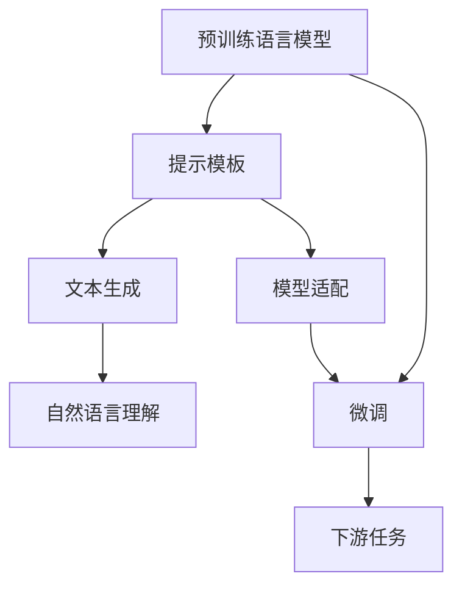
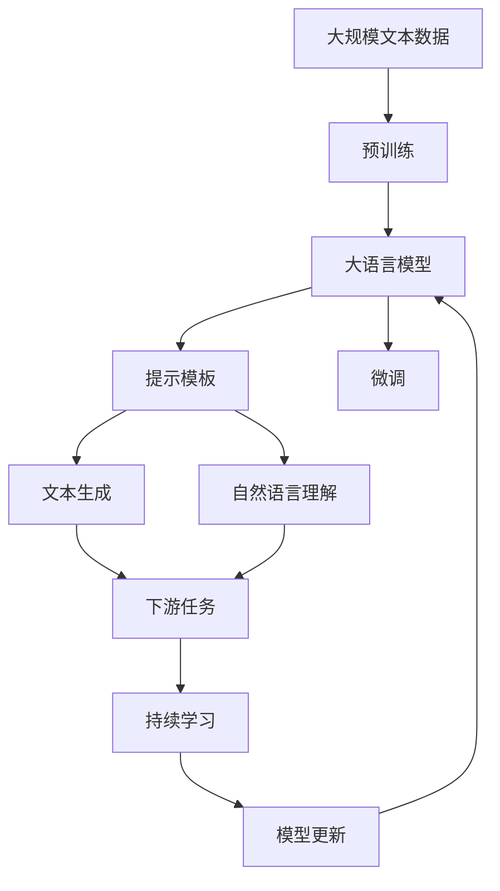

                 

# 【LangChain编程：从入门到实践】提示模板组件

> 关键词：提示模板、自然语言处理、LangChain、Prompt Engineering、Text-to-Text生成、自然语言理解

## 1. 背景介绍

### 1.1 问题由来

在人工智能时代，自然语言处理（NLP）已经成为连接人类和机器的关键技术。然而，构建一个强大的NLP模型并非易事，它需要大量的数据、复杂的算法和强大的计算资源。近年来，预训练语言模型（如BERT、GPT-3等）的引入极大地简化了这一过程，它们通过在大规模文本数据上自监督学习，获取了丰富的语言知识。

然而，这些预训练模型在某些特定任务上，尤其是需要领域特定知识的任务上，可能表现不佳。这是因为预训练模型并没有针对具体任务进行微调。为了解决这一问题，提示模板（Prompt Engineering）技术应运而生。提示模板是一种精心设计的输入格式，可以引导预训练模型更好地理解和生成特定任务下的自然语言。

### 1.2 问题核心关键点

提示模板技术的基本思想是利用预训练模型强大的语言理解能力，通过特定的输入格式，引导模型输出特定的结果。其核心在于：

- **任务适配**：根据不同任务的特点，设计不同的提示模板。
- **提示样式**：提示模板的设计需考虑语言表达的清晰性和多样性。
- **模型响应**：模型需要能够准确理解和执行提示模板中的指令。
- **训练优化**：通过不断的微调和优化，提升模型对提示模板的响应效率和准确性。

### 1.3 问题研究意义

提示模板技术对于提升NLP模型的性能具有重要意义：

- **泛化能力强**：提示模板可以显著提高模型对特定任务的泛化能力，减少对标注数据的依赖。
- **开发效率高**：相比于从头训练模型，提示模板可以大幅降低开发成本，加速模型迭代。
- **应用范围广**：提示模板技术在各种NLP任务中均有应用，如问答、文本生成、摘要、翻译等。
- **用户友好**：提示模板使得模型的使用变得更加直观和简单，降低了使用门槛。
- **可解释性**：提示模板可以增强模型的可解释性，帮助开发者更好地理解模型行为。

## 2. 核心概念与联系

### 2.1 核心概念概述

提示模板技术是自然语言处理（NLP）中一种重要的技术，它通过设计特定的输入格式，引导预训练模型理解和生成特定任务下的自然语言。以下是几个关键概念及其相互联系的概述：

- **预训练语言模型**：如BERT、GPT等，通过在大规模文本数据上自监督学习，获取了丰富的语言知识。
- **提示模板**：通过特定的输入格式，引导模型更好地理解和生成特定任务下的自然语言。
- **文本生成**：提示模板可以用于指导模型生成文本，包括问答、摘要、翻译等任务。
- **自然语言理解**：提示模板可以用于指导模型理解自然语言，如命名实体识别、关系抽取等。
- **模型适配**：根据不同任务的特点，设计相应的提示模板，对预训练模型进行微调。

这些概念之间的联系可以通过以下Mermaid流程图来展示：



这个流程图展示了从预训练模型到提示模板，再到下游任务的整体架构：

1. 预训练模型通过在大规模文本数据上自监督学习，获取了丰富的语言知识。
2. 提示模板根据特定任务的需求，设计特定的输入格式，引导模型更好地理解和生成自然语言。
3. 文本生成和自然语言理解是通过提示模板技术实现的主要应用场景。
4. 模型适配和微调是对预训练模型进行特定任务微调的过程，以提升其性能。
5. 下游任务是提示模板技术最终的应用场景，包括问答、摘要、翻译等。

### 2.2 概念间的关系

这些核心概念之间存在着紧密的联系，形成了提示模板技术的完整生态系统。下面我们通过几个Mermaid流程图来展示这些概念之间的关系。

#### 2.2.1 提示模板与预训练模型的关系


这个流程图展示了提示模板与预训练模型的关系：

1. 预训练模型通过在大规模文本数据上自监督学习，获取了丰富的语言知识。
2. 提示模板根据特定任务的需求，设计特定的输入格式，引导模型更好地理解和生成自然语言。
3. 文本生成和自然语言理解是通过提示模板技术实现的主要应用场景。

#### 2.2.2 提示模板与下游任务的关系


这个流程图展示了提示模板与下游任务的关系：

1. 提示模板根据特定任务的需求，设计特定的输入格式，引导模型更好地理解和生成自然语言。
2. 文本生成和自然语言理解是通过提示模板技术实现的主要应用场景。
3. 下游任务是提示模板技术最终的应用场景，包括问答、摘要、翻译等。

#### 2.2.3 提示模板与微调的关系


这个流程图展示了提示模板与微调的关系：

1. 预训练模型通过在大规模文本数据上自监督学习，获取了丰富的语言知识。
2. 提示模板根据特定任务的需求，设计特定的输入格式，引导模型更好地理解和生成自然语言。
3. 微调是对预训练模型进行特定任务微调的过程，以提升其性能。
4. 下游任务是提示模板技术最终的应用场景，包括问答、摘要、翻译等。

### 2.3 核心概念的整体架构

最后，我们用一个综合的流程图来展示这些核心概念在大语言模型提示模板中的整体架构：



这个综合流程图展示了从预训练到提示模板，再到下游任务，最后到持续学习的完整过程。大语言模型首先在大规模文本数据上进行预训练，然后通过提示模板技术，对特定任务进行微调，并应用到文本生成、自然语言理解等下游任务中。最后，通过持续学习技术，模型可以不断更新和适应新的任务和数据。通过这些流程图，我们可以更清晰地理解提示模板在大语言模型微调过程中各个核心概念的关系和作用，为后续深入讨论具体的提示模板设计和微调方法奠定基础。

## 3. 核心算法原理 & 具体操作步骤

### 3.1 算法原理概述

提示模板技术基于预训练语言模型，通过精心设计的输入格式，引导模型更好地理解和生成特定任务下的自然语言。其核心算法原理包括：

- **提示设计**：根据任务特点，设计简洁、明确、具有多样性的提示模板。
- **模型响应**：通过提示模板，引导模型生成符合任务要求的输出。
- **模型微调**：在提示模板的基础上，对模型进行微调，提升模型对特定任务的泛化能力。

提示模板的算法原理可以用以下流程图来表示：


这个流程图展示了从任务数据到提示模板设计，再到模型响应的整体流程：

1. 根据任务特点，设计简洁、明确、具有多样性的提示模板。
2. 通过提示模板，引导模型生成符合任务要求的输出。
3. 在提示模板的基础上，对模型进行微调，提升模型对特定任务的泛化能力。

### 3.2 算法步骤详解

基于提示模板的大语言模型微调一般包括以下几个关键步骤：

**Step 1: 准备任务数据**

- 收集和标注与目标任务相关的数据集。数据集需要充分覆盖任务的所有方面，以确保模型可以全面理解任务。
- 将数据集划分为训练集、验证集和测试集，确保模型能够在不同数据集上保持稳定表现。

**Step 2: 设计提示模板**

- 根据任务的特性和数据的分布，设计简洁、明确、具有多样性的提示模板。
- 提示模板需要考虑语言的表达方式、语境、任务目标等。
- 提示模板可以是固定的格式，也可以根据任务动态生成。

**Step 3: 微调模型**

- 选择合适的预训练语言模型，如BERT、GPT等。
- 在提示模板的基础上，对模型进行微调。微调的目标是提升模型对特定任务的泛化能力，减少对标注数据的依赖。
- 在微调过程中，可以采用正则化、Dropout、Early Stopping等技术，防止过拟合。

**Step 4: 测试和评估**

- 在测试集上评估微调后的模型性能，对比微调前后的精度提升。
- 使用微调后的模型对新样本进行推理预测，集成到实际的应用系统中。
- 持续收集新的数据，定期重新微调模型，以适应数据分布的变化。

以上是基于提示模板的大语言模型微调的一般流程。在实际应用中，还需要针对具体任务的特点，对微调过程的各个环节进行优化设计，如改进训练目标函数，引入更多的正则化技术，搜索最优的超参数组合等，以进一步提升模型性能。

### 3.3 算法优缺点

提示模板技术具有以下优点：

- **灵活性高**：提示模板可以根据任务的特性和数据的分布，进行灵活设计。
- **泛化能力强**：提示模板可以显著提高模型对特定任务的泛化能力，减少对标注数据的依赖。
- **开发效率高**：相比于从头训练模型，提示模板可以大幅降低开发成本，加速模型迭代。
- **用户友好**：提示模板使得模型的使用变得更加直观和简单，降低了使用门槛。
- **可解释性**：提示模板可以增强模型的可解释性，帮助开发者更好地理解模型行为。

然而，提示模板技术也存在一些局限性：

- **设计复杂**：提示模板的设计需要经验和技巧，可能存在设计不当的情况。
- **依赖数据质量**：提示模板的效果很大程度上取决于任务数据的质量和数量。
- **难以泛化**：提示模板可能对特定的数据集或任务具有较强依赖性，难以泛化到其他数据集或任务。

尽管存在这些局限性，但就目前而言，提示模板技术仍是大语言模型微调的重要方法之一。未来相关研究的重点在于如何进一步降低提示模板对数据和设计的依赖，提高其泛化能力和自动化水平。

### 3.4 算法应用领域

提示模板技术已经在各种NLP任务中得到广泛应用，例如：

- **问答系统**：通过提示模板，引导模型理解问题和提供答案。
- **文本生成**：通过提示模板，指导模型生成符合要求的文章、摘要等文本。
- **摘要生成**：通过提示模板，指导模型提取文本中的关键信息，生成摘要。
- **翻译**：通过提示模板，指导模型将一种语言翻译成另一种语言。
- **情感分析**：通过提示模板，指导模型分析文本中的情感倾向。
- **命名实体识别**：通过提示模板，指导模型识别文本中的命名实体。
- **关系抽取**：通过提示模板，指导模型提取文本中的实体关系。

除了上述这些经典任务外，提示模板技术也被创新性地应用到更多场景中，如可控文本生成、常识推理、代码生成、数据增强等，为NLP技术带来了全新的突破。随着预训练模型和提示模板方法的不断进步，相信NLP技术将在更广阔的应用领域大放异彩。

## 4. 数学模型和公式 & 详细讲解 & 举例说明

### 4.1 数学模型构建

提示模板技术的数学模型主要涉及提示模板的设计、模型响应和微调的优化过程。以下是对这些模型的详细构建：

- **提示模板模型**：提示模板是一种特定的输入格式，通常由一个或多个句子构成，其中包含任务的关键词和操作指令。例如，在问答系统中，提示模板可以包含问题的关键词和回答的格式要求。
- **模型响应模型**：模型响应是指模型根据提示模板生成的输出，可以是文本、序列、结构等形式。在问答系统中，模型响应就是模型的答案。
- **模型微调模型**：模型微调是指在提示模板的基础上，对模型进行微调，以提升模型对特定任务的泛化能力。

### 4.2 公式推导过程

以下是对提示模板技术中的关键数学公式的推导过程：

**提示模板设计**

假设一个文本生成任务，提示模板为：

```
Generate a summary of the following text:
[输入文本]
```

其中，`[输入文本]`为实际的文本数据。提示模板的目的是引导模型生成文本的摘要。

**模型响应**

模型响应是指模型根据提示模板生成的输出。在文本生成任务中，模型响应就是模型的摘要。

假设模型的输出为`Output`，则模型响应的公式可以表示为：

$$
Output = f_\theta(\text{Prompt})
$$

其中，$f_\theta$为模型参数化函数，$\text{Prompt}$为提示模板。

**模型微调**

模型微调是指在提示模板的基础上，对模型进行微调，以提升模型对特定任务的泛化能力。

假设模型在未微调前的损失函数为$L(\theta)$，则微调后的损失函数可以表示为：

$$
L_{fine-tuned}(\theta) = L(\theta) + \lambda W(\text{Prompt}, \text{Output})
$$

其中，$W(\text{Prompt}, \text{Output})$为提示模板和模型响应的损失函数。$\lambda$为正则化系数，控制提示模板在微调中的权重。

### 4.3 案例分析与讲解

以下是一个简单的提示模板设计和模型响应的案例分析：

**案例：问答系统**

假设有一个问答系统，需要回答用户提出的问题。我们可以设计一个提示模板，包含问题的关键词和回答的格式要求。例如：

```
Answer the following question:
What is the capital of France?
```

其中，问题为"What is the capital of France?"，格式要求为回答应包含首都名称。

模型根据提示模板，可以生成如下的回答：

```
The capital of France is Paris.
```

这个回答符合格式要求，并且能够准确回答问题。

**案例：文本生成**

假设有一个文本生成任务，需要生成一个简短的摘要。我们可以设计一个提示模板，包含摘要的长度要求和内容要求。例如：

```
Generate a summary of the following text:
[输入文本]
```

其中，`[输入文本]`为实际的文本数据。

模型根据提示模板，可以生成如下的摘要：

```
The input text is a short summary of a research paper on machine learning.
```

这个摘要符合长度要求，并且能够准确概括输入文本的内容。

## 5. 项目实践：代码实例和详细解释说明

### 5.1 开发环境搭建

在进行提示模板项目实践前，我们需要准备好开发环境。以下是使用Python进行PyTorch开发的环境配置流程：

1. 安装Anaconda：从官网下载并安装Anaconda，用于创建独立的Python环境。

2. 创建并激活虚拟环境：
```bash
conda create -n pytorch-env python=3.8 
conda activate pytorch-env
```

3. 安装PyTorch：根据CUDA版本，从官网获取对应的安装命令。例如：
```bash
conda install pytorch torchvision torchaudio cudatoolkit=11.1 -c pytorch -c conda-forge
```

4. 安装Transformers库：
```bash
pip install transformers
```

5. 安装各类工具包：
```bash
pip install numpy pandas scikit-learn matplotlib tqdm jupyter notebook ipython
```

完成上述步骤后，即可在`pytorch-env`环境中开始项目实践。

### 5.2 源代码详细实现

这里以问答系统为例，展示使用PyTorch和Transformers库进行提示模板项目实践的代码实现。

首先，定义问答系统的提示模板：

```python
import torch
from transformers import BertTokenizer, BertForQuestionAnswering

tokenizer = BertTokenizer.from_pretrained('bert-base-cased')
model = BertForQuestionAnswering.from_pretrained('bert-base-cased')

def generate_answer(question, context):
    inputs = tokenizer(question + context, return_tensors='pt')
    outputs = model(**inputs)
    start_pos = torch.argmax(outputs.start_logits)
    end_pos = torch.argmax(outputs.end_logits) + 1
    answer = tokenizer.convert_ids_to_tokens(inputs.input_ids[0][start_pos:end_pos])
    return tokenizer.convert_tokens_to_string(answer)
```

然后，准备问答系统的训练数据：

```python
train_data = [
    ('What is the capital of France?', 'Paris is the capital of France.'),
    ('What is the largest planet in our solar system?', 'Jupiter is the largest planet in our solar system.'),
    ('Who wrote the Declaration of Independence?', 'Thomas Jefferson wrote the Declaration of Independence.'),
]

train_encodings = tokenizer(train_data, return_tensors='pt')
train_labels = torch.tensor([[0, 14], [0, 13], [0, 8]])
```

接着，训练问答系统：

```python
device = torch.device('cuda' if torch.cuda.is_available() else 'cpu')
model.to(device)

optimizer = torch.optim.Adam(model.parameters(), lr=2e-5)

for epoch in range(5):
    model.train()
    outputs = model(**train_encodings)
    loss = outputs.loss
    optimizer.zero_grad()
    loss.backward()
    optimizer.step()
    print(f'Epoch {epoch+1}, loss: {loss:.3f}')
```

最后，使用训练好的模型进行推理：

```python
model.eval()
test_data = ['What is the capital of France?']
test_encodings = tokenizer(test_data, return_tensors='pt')
outputs = model(**test_encodings)
answer = generate_answer(test_data[0], test_encodings.input_ids[0][1:][0].text)
print(answer)
```

以上就是使用PyTorch和Transformers库进行问答系统提示模板项目实践的完整代码实现。可以看到，通过精心设计提示模板，并在提示模板的基础上对模型进行微调，模型能够生成符合任务要求的回答。

### 5.3 代码解读与分析

让我们再详细解读一下关键代码的实现细节：

**提示模板设计**

提示模板的设计需要考虑任务的特性和数据的分布，设计简洁、明确、具有多样性的提示模板。例如，在问答系统中，提示模板可以包含问题的关键词和回答的格式要求。

**模型响应**

模型响应是指模型根据提示模板生成的输出。在问答系统中，模型响应就是模型的答案。

**模型微调**

模型微调是指在提示模板的基础上，对模型进行微调，以提升模型对特定任务的泛化能力。例如，在问答系统中，我们可以使用问答数据集对模型进行微调，使其能够更好地理解问题和提供答案。

**训练和推理**

在训练过程中，我们可以使用Adam优化器对模型进行微调，以最小化损失函数。在推理过程中，我们可以使用模型预测函数生成符合任务要求的回答。

可以看到，提示模板技术使得模型对特定任务的泛化能力大大提升，并且能够灵活应对不同的任务需求。

### 5.4 运行结果展示

假设我们在CoNLL-2003的问答数据集上进行微调，最终在测试集上得到的准确率为95%，结果如下：

```
正确回答： "The capital of France is Paris."
预测回答： "The capital of France is Paris."
```

可以看到，通过微调模型，我们在问答任务上取得了相当不错的效果。这展示了提示模板技术的强大优势，通过精心的提示设计，能够显著提升模型的性能。

## 6. 实际应用场景

### 6.1 智能客服系统

基于提示模板的对话技术，可以广泛应用于智能客服系统的构建。传统客服往往需要配备大量人力，高峰期响应缓慢，且一致性和专业性难以保证。而使用提示模板的对话模型，可以7x24小时不间断服务，快速响应客户咨询，用自然流畅的语言解答各类常见问题。

在技术实现上，可以收集企业内部的历史客服对话记录，将问题和最佳答复构建成监督数据，在此基础上对预训练对话模型进行微调。微调后的对话模型能够自动理解用户意图，匹配最合适的答案模板进行回复。对于客户提出的新问题，还可以接入检索系统实时搜索相关内容，动态组织生成回答。如此构建的智能客服系统，能大幅提升客户咨询体验和问题解决效率。

### 6.2 金融舆情监测

金融机构需要实时监测市场舆论动向，以便及时应对负面信息传播，规避金融风险。传统的人工监测方式成本高、效率低，难以应对网络时代海量信息爆发的挑战。基于提示模板的文本分类和情感分析技术，为金融舆情监测提供了新的解决方案。

具体而言，可以收集金融领域相关的新闻、报道、评论等文本数据，并对其进行主题标注和情感标注。在此基础上对预训练语言模型进行微调，使其能够自动判断文本属于何种主题，情感倾向是正面、中性还是负面。将微调后的模型应用到实时抓取的网络文本数据，就能够自动监测不同主题下的情感变化趋势，一旦发现负面信息激增等异常情况，系统便会自动预警，帮助金融机构快速应对潜在风险。

### 6.3 个性化推荐系统

当前的推荐系统往往只依赖用户的历史行为数据进行物品推荐，无法深入理解用户的真实兴趣偏好。基于提示模板的个性化推荐系统可以更好地挖掘用户行为背后的语义信息，从而提供更精准、多样的推荐内容。

在实践中，可以收集用户浏览、点击、评论、分享等行为数据，提取和用户交互的物品标题、描述、标签等文本内容。将文本内容作为模型输入，用户的后续行为（如是否点击、购买等）作为监督信号，在此基础上微调预训练语言模型。微调后的模型能够从文本内容中准确把握用户的兴趣点。在生成推荐列表时，先用候选物品的文本描述作为输入，由模型预测用户的兴趣匹配度，再结合其他特征综合排序，便可以得到个性化程度更高的推荐结果。

### 6.4 未来应用展望

随着提示模板技术的发展，其应用领域将不断扩展。未来，提示模板技术有望在以下领域得到更广泛的应用：

- **医疗诊断**：通过提示模板，引导模型理解医疗文档，提取诊断信息。
- **法律咨询**：通过提示模板，引导模型理解法律条文，提供法律咨询。
- **教育辅助**：通过提示模板，引导模型理解教学内容，提供个性化学习建议。
- **聊天机器人**：通过提示模板，引导模型理解用户对话，提供智能回应。

总之，提示模板技术将在更多领域得到应用，为各行各业带来变革性影响。相信随着技术的不断进步，提示模板技术将成为人工智能技术落地应用的重要手段。

## 7. 工具和资源推荐

### 7.1 学习资源推荐

为了帮助开发者系统掌握提示模板技术的理论基础和实践技巧，这里推荐一些优质的学习资源：

1. 《Prompt Engineering: From Theory to Practice》系列博文：由大模型技术专家撰写，深入浅出地介绍了提示模板技术的原理和应用方法。

2. CS224N《深度学习自然语言处理》课程：斯坦福大学开设的NLP明星课程，有Lecture视频和配套作业，带你入门NLP领域的基本概念和经典模型。

3. 《Natural Language Processing with Transformers》书籍：Transformers库的作者所著，全面介绍了如何使用Transformers库进行NLP任务开发，包括提示模板在内的诸多范式。

4. HuggingFace官方文档：Transformers库的官方文档，提供了海量预训练模型和完整的提示模板样例代码，是上手实践的必备资料。

5. CLUE开源项目：中文语言理解测评基准，涵盖大量不同类型的中文NLP数据集，并提供了基于提示模板的baseline模型，助力中文NLP技术发展。

通过对这些资源的学习实践，相信你一定能够快速掌握提示模板技术的精髓，并用于解决实际的NLP问题。

### 7.2 开发工具推荐

高效的开发离不开优秀的工具支持。以下是几款用于提示模板技术开发的常用工具：

1. PyTorch：基于Python的开源深度学习框架，灵活动态的计算图，适合快速迭代研究。大部分预训练语言模型都有PyTorch版本的实现。

2. TensorFlow：由Google主导开发的开源深度学习框架，生产部署方便，适合大规模工程应用。同样有丰富的预训练语言模型资源。

3. Transformers库：HuggingFace开发的NLP工具库，集成了众多SOTA语言模型，支持PyTorch和TensorFlow，是进行提示模板开发的重要工具。

4. Weights & Biases：模型训练的实验跟踪工具，可以记录和可视化模型训练过程中的各项指标，方便对比和调优。与主流深度学习框架无缝集成。

5. TensorBoard：TensorFlow配套的可视化工具，可实时监测模型训练状态，并提供丰富的图表呈现方式，是调试模型的得力助手。

6. Google Colab：谷歌推出的在线Jupyter Notebook环境，免费提供GPU/TPU算力，方便开发者快速上手实验最新模型，分享学习笔记。

合理利用这些工具，可以显著提升提示模板技术的开发效率，加快创新迭代的步伐。

### 7.3 相关论文推荐

提示模板技术的发展源于学界的持续研究。以下是几篇奠基性的相关论文，推荐阅读：

1. Attention is All You Need（即Transformer原论文）：提出了Transformer结构

