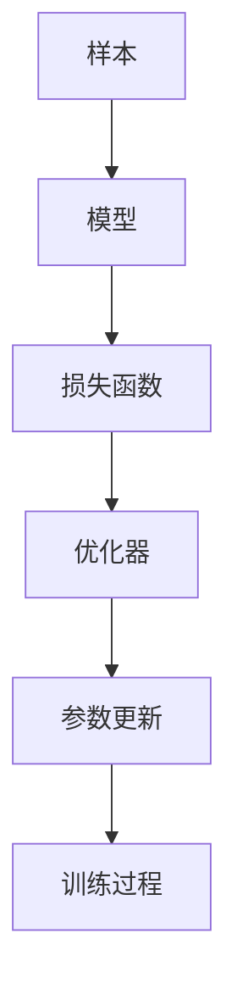
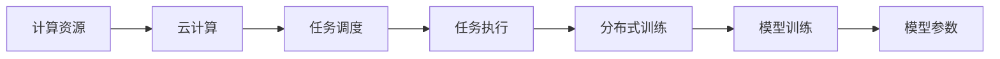
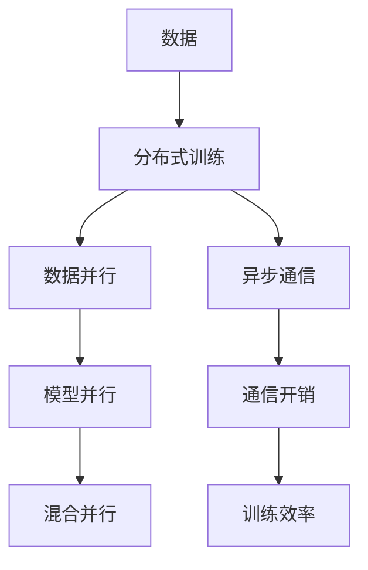
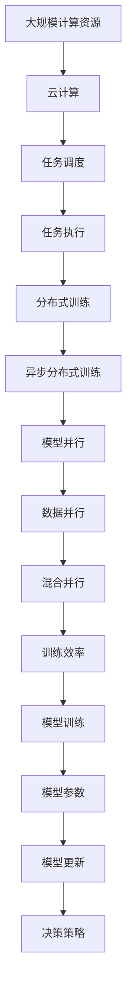

                 

# 一切皆是映射：DQN的云计算与分布式训练方案

> 关键词：深度强化学习,深度Q网络(DQN),分布式训练,云计算,强化学习

## 1. 背景介绍

### 1.1 问题由来
在人工智能的迅速发展中，深度强化学习(Deep Reinforcement Learning, DRL)成为了一个研究的热点。DRL方法通过不断试错，自动学习最优的决策策略，在复杂的决策场景中展现出强大的优势。然而，在实际应用中，DRL模型常常需要面对大规模的搜索空间、高维度状态空间和高计算需求等挑战。

传统的深度Q网络(Depth Q-Network, DQN)虽然已在小规模环境中取得了成功，但在大规模分布式系统中，仍存在以下问题：
1. 状态空间和动作空间的维度过高，使得模型训练复杂度和计算成本增加。
2. 模型需要较大的存储和计算资源，无法在单一的服务器上高效运行。
3. 训练数据无法实时更新，影响模型的收敛速度和泛化能力。

为了应对这些挑战，云计算和分布式训练成为了DQN应用的重要技术手段。本文将探讨如何利用云计算和分布式训练，优化DQN的训练过程，提升其在复杂场景中的性能和稳定性。

### 1.2 问题核心关键点
云计算和分布式训练的核心关键点在于：
1. 如何高效利用大规模计算资源，实现模型并行训练。
2. 如何在大规模数据集上持续更新训练样本，保持模型的实时性和适应性。
3. 如何通过分布式系统设计，提高模型的鲁棒性和可靠性。

本文将重点介绍DQN在云计算和分布式训练环境下的优化方案，并结合实际应用场景，展示其在复杂系统中的优势和局限性。

## 2. 核心概念与联系

### 2.1 核心概念概述

为更好地理解云计算和分布式训练的优化方案，本节将介绍几个密切相关的核心概念：

- 深度Q网络（DQN）：基于深度神经网络的Q学习算法，用于解决单步决策问题。DQN通过将目标和策略分离，实现独立训练，优化决策策略。

- 云计算：通过网络将大规模计算资源池化，实现计算任务的按需分配和调度。云服务提供商如AWS、Google Cloud、阿里云等提供了丰富的云服务，满足不同场景的计算需求。

- 分布式训练：通过多台计算节点并行训练模型，加速模型收敛，提高模型性能。常见的分布式训练框架包括TensorFlow分布式、Horovod等。

- 异步分布式训练：不同于同步分布式训练，异步分布式训练允许各个节点独立执行计算任务，减少了通信开销，提高了训练效率。

- 模型并行：指将模型分割成多个子模型，在不同的计算节点上并行训练。常见的模型并行方式包括数据并行、模型并行、混合并行等。

这些核心概念之间的逻辑关系可以通过以下Mermaid流程图来展示：

```mermaid
graph TB
    A[深度Q网络(DQN)] --> B[云计算]
    A --> C[分布式训练]
    C --> D[异步分布式训练]
    C --> E[模型并行]
    B --> F[计算资源]
    F --> G[异步通信]
    G --> H[数据并行]
    H --> I[模型并行]
    I --> J[混合并行]
```

这个流程图展示了大语言模型微调过程中各个核心概念的关系和作用：

1. DQN作为深度强化学习算法的基础，通过学习Q值函数优化决策策略。
2. 云计算提供大规模计算资源，支持分布式训练。
3. 分布式训练通过并行计算加速模型训练过程。
4. 异步分布式训练进一步减少通信开销，提高训练效率。
5. 模型并行将模型分割成多个子模型，在不同的节点上并行训练。

这些概念共同构成了DQN在云计算和分布式训练环境下的优化框架，使其能够在各种复杂场景中发挥强大的决策能力。

### 2.2 概念间的关系

这些核心概念之间存在着紧密的联系，形成了DQN在云计算和分布式训练环境下的完整生态系统。下面我通过几个Mermaid流程图来展示这些概念之间的关系。

#### 2.2.1 DQN的训练过程



这个流程图展示了DQN训练过程的各个关键步骤。从样本输入到模型输出，再到损失函数计算和参数更新，构成了一个完整的训练循环。

#### 2.2.2 云计算与分布式训练的关系



这个流程图展示了云计算与分布式训练的基本流程。计算资源通过云计算平台进行任务调度，分布式训练框架负责任务执行，最终生成模型参数。

#### 2.2.3 分布式训练的方式



这个流程图展示了分布式训练的三种方式。数据并行将数据集分割，在多个节点上并行训练；模型并行将模型分割成多个子模型，在不同的节点上并行训练；混合并行结合数据并行和模型并行，进一步提高训练效率。异步通信减少了节点之间的通信开销，提高了训练效率。

### 2.3 核心概念的整体架构

最后，我们用一个综合的流程图来展示这些核心概念在大语言模型微调过程中的整体架构：



这个综合流程图展示了从计算资源分配到模型训练的全过程。大规模计算资源通过云计算平台进行任务调度，分布式训练框架负责任务执行，通过异步分布式训练和模型并行技术，进一步提升训练效率，最终生成决策策略。

## 3. 核心算法原理 & 具体操作步骤
### 3.1 算法原理概述

基于云计算和分布式训练的DQN优化方案，其核心原理是将大规模计算资源和数据分布式调度，实现模型并行和异步训练。以下是详细原理和操作步骤：

### 3.2 算法步骤详解

#### 3.2.1 数据预处理

在大规模分布式训练中，数据的预处理是关键环节。首先，需要将原始数据集划分为多个小批量数据集，每个小批量数据集可以分配到不同的计算节点进行训练。其次，可以采用数据并行或模型并行的方式，将数据集或模型在多个节点上并行处理。

以DQN为例，假设我们需要训练一个深度Q网络，处理的数据集为 $\mathcal{D}=\{x_i,y_i\}_{i=1}^N$，其中 $x_i$ 为状态，$y_i$ 为动作-奖励对。具体步骤如下：

1. 将数据集 $\mathcal{D}$ 划分为 $M$ 个大小相等的小批量数据集 $\mathcal{D}_m=\{x_i,y_i\}_{i=1}^{n_m}, m=1,2,...,M$，每个小批量数据集 $\mathcal{D}_m$ 分配到一个计算节点进行训练。
2. 在每个计算节点上，使用模型并行技术，将模型 $\theta$ 分割为 $K$ 个子模型 $\theta_k, k=1,2,...,K$，每个子模型在一个小批量数据集 $\mathcal{D}_m$ 上独立训练。

#### 3.2.2 模型训练

在模型训练过程中，利用异步分布式训练技术，提高训练效率。具体步骤如下：

1. 在每个计算节点上，使用深度Q网络进行模型训练，更新模型参数 $\theta_k$，最小化损失函数 $L(\theta_k)$。
2. 在每个计算节点上，异步更新模型参数 $\theta_k$，允许各个节点独立执行计算任务，减少通信开销。
3. 在每个计算节点上，定期将模型参数 $\theta_k$ 同步到中心服务器，更新全局模型参数 $\theta$。

#### 3.2.3 模型更新

模型更新是DQN训练的另一个关键环节。具体步骤如下：

1. 在每个计算节点上，使用Q值函数计算预测动作，并根据Q值函数优化策略。
2. 在每个计算节点上，更新Q值函数，最小化损失函数 $L(\theta_k)$。
3. 在每个计算节点上，将模型参数 $\theta_k$ 同步到中心服务器，更新全局模型参数 $\theta$。

#### 3.2.4 训练数据更新

为了保持模型的实时性和适应性，需要在大规模数据集上持续更新训练数据。具体步骤如下：

1. 在每个计算节点上，实时收集新样本 $(x_i,y_i)$，将其加入小批量数据集 $\mathcal{D}_m$。
2. 在每个计算节点上，使用模型并行技术，将新样本 $(x_i,y_i)$ 分配到不同的子模型 $\theta_k$ 上进行训练。
3. 在每个计算节点上，将更新后的模型参数 $\theta_k$ 同步到中心服务器，更新全局模型参数 $\theta$。

### 3.3 算法优缺点

基于云计算和分布式训练的DQN优化方案具有以下优点：

- 高效利用大规模计算资源，加速模型训练。
- 通过异步分布式训练和模型并行技术，提高训练效率和模型性能。
- 在持续更新的数据集上训练模型，保持模型的实时性和适应性。

同时，该方案也存在以下缺点：

- 分布式训练需要大量的通信开销，需要优化通信协议和算法设计。
- 模型并行和数据并行可能导致数据丢失和一致性问题，需要精心设计并行方案。
- 中心服务器需要高可用性保证，一旦服务器故障，可能导致分布式训练失败。

尽管存在这些局限性，但就目前而言，基于云计算和分布式训练的DQN方案在大规模任务中依然具有显著优势。未来相关研究的重点在于如何进一步降低通信开销，提高模型的稳定性和可靠性。

### 3.4 算法应用领域

基于云计算和分布式训练的DQN优化方案，已经在多个领域取得了成功应用：

- 自动驾驶：利用分布式训练优化决策策略，提高车辆的自主驾驶能力。
- 机器人控制：通过分布式训练优化动作策略，实现机器人自主导航和操作。
- 游戏AI：利用分布式训练优化游戏AI策略，提升游戏智能水平。
- 推荐系统：利用分布式训练优化推荐策略，提高推荐系统的准确性和多样性。
- 金融风控：利用分布式训练优化风险评估策略，提高金融模型的预测精度。

除了上述这些领域外，分布式训练方法在其他高计算需求、高维度状态空间的应用中也有广泛应用，如科学计算、图像识别、自然语言处理等。

## 4. 数学模型和公式 & 详细讲解  
### 4.1 数学模型构建

基于云计算和分布式训练的DQN优化方案，其数学模型可以表示为：

- 设 $D$ 为训练数据集， $D=\{x_i,y_i\}_{i=1}^N$，其中 $x_i$ 为状态， $y_i$ 为动作-奖励对。
- 设 $Q$ 为Q值函数， $Q(x,a;\theta)=\sum_{s_{t+1}} Q(s_{t+1},a_{t+1};\theta)$，表示在状态 $s_t$ 下，执行动作 $a_t$ 后，下一个状态 $s_{t+1}$ 的Q值。
- 设 $\theta$ 为模型参数， $\theta_k$ 为分割后的子模型参数。
- 设 $L$ 为损失函数， $L(\theta_k)=\sum_{i=1}^{n_m} \frac{1}{n_m} \sum_{i=1}^{n_m} (\hat{y_i} - y_i)^2$，其中 $\hat{y_i}$ 为模型预测值， $y_i$ 为真实值。

### 4.2 公式推导过程

以DQN在云计算和分布式训练环境下的优化方案为例，推导其数学模型和优化公式。

设 $D$ 为训练数据集， $D=\{x_i,y_i\}_{i=1}^N$，其中 $x_i$ 为状态， $y_i$ 为动作-奖励对。

设 $Q$ 为Q值函数， $Q(x,a;\theta)=\sum_{s_{t+1}} Q(s_{t+1},a_{t+1};\theta)$，表示在状态 $s_t$ 下，执行动作 $a_t$ 后，下一个状态 $s_{t+1}$ 的Q值。

设 $\theta$ 为模型参数， $\theta_k$ 为分割后的子模型参数。

设 $L$ 为损失函数， $L(\theta_k)=\sum_{i=1}^{n_m} \frac{1}{n_m} \sum_{i=1}^{n_m} (\hat{y_i} - y_i)^2$，其中 $\hat{y_i}$ 为模型预测值， $y_i$ 为真实值。

在异步分布式训练环境中，模型参数 $\theta_k$ 在不同节点上独立更新，中心服务器周期性同步各节点的模型参数 $\theta_k$，更新全局模型参数 $\theta$。

具体的优化算法为AdamW或SGD，具体步骤如下：

1. 在每个计算节点上，使用Q值函数计算预测动作，并根据Q值函数优化策略。
2. 在每个计算节点上，更新Q值函数，最小化损失函数 $L(\theta_k)$。
3. 在每个计算节点上，将模型参数 $\theta_k$ 同步到中心服务器，更新全局模型参数 $\theta$。

### 4.3 案例分析与讲解

以下以自动驾驶场景为例，详细讲解基于云计算和分布式训练的DQN优化方案的应用：

- 在每个计算节点上，将传感器数据（如摄像头、雷达、GPS等）作为输入状态 $x_i$，生成模型预测的动作 $a_i$。
- 在每个计算节点上，利用实时传感器数据和历史数据集，生成小批量数据集 $\mathcal{D}_m=\{x_i,y_i\}_{i=1}^{n_m}$，使用模型并行技术，将数据集或模型在多个节点上并行处理。
- 在每个计算节点上，使用深度Q网络进行模型训练，更新模型参数 $\theta_k$，最小化损失函数 $L(\theta_k)$。
- 在每个计算节点上，将模型参数 $\theta_k$ 同步到中心服务器，更新全局模型参数 $\theta$。
- 在每个计算节点上，实时收集新传感器数据，将其加入小批量数据集 $\mathcal{D}_m$，重新开始训练。

通过上述流程，自动驾驶系统可以实时接收传感器数据，并根据实时状态进行决策，提升车辆自主驾驶能力。

## 5. 项目实践：代码实例和详细解释说明
### 5.1 开发环境搭建

在进行DQN优化方案的实践前，我们需要准备好开发环境。以下是使用Python进行PyTorch和Horovod开发的实践环境配置流程：

1. 安装Anaconda：从官网下载并安装Anaconda，用于创建独立的Python环境。

2. 创建并激活虚拟环境：
```bash
conda create -n pytorch-env python=3.8 
conda activate pytorch-env
```

3. 安装PyTorch：根据CUDA版本，从官网获取对应的安装命令。例如：
```bash
conda install pytorch torchvision torchaudio cudatoolkit=11.1 -c pytorch -c conda-forge
```

4. 安装Horovod：
```bash
pip install horovod
```

5. 安装各类工具包：
```bash
pip install numpy pandas scikit-learn matplotlib tqdm jupyter notebook ipython
```

完成上述步骤后，即可在`pytorch-env`环境中开始实践。

### 5.2 源代码详细实现

以下是基于PyTorch和Horovod的DQN优化方案的代码实现：

```python
import torch
import torch.nn as nn
import torch.optim as optim
import horovod.torch as hvd

# 初始化Horovod，设置进程编号
hvd.init()

# 设置参数和网络结构
class QNetwork(nn.Module):
    def __init__(self):
        super(QNetwork, self).__init__()
        self.fc1 = nn.Linear(4, 128)
        self.fc2 = nn.Linear(128, 2)
        self.relu = nn.ReLU()

    def forward(self, x):
        x = self.relu(self.fc1(x))
        x = self.fc2(x)
        return x

# 定义优化器和损失函数
model = QNetwork()
optimizer = optim.Adam(model.parameters(), lr=0.001)
criterion = nn.MSELoss()

# 定义训练和评估函数
def train_model(model, criterion, optimizer, device, batch_size, num_epochs, train_loader, valid_loader):
    for epoch in range(num_epochs):
        model.train()
        for batch_idx, (data, target) in enumerate(train_loader):
            data, target = data.to(device), target.to(device)
            optimizer.zero_grad()
            output = model(data)
            loss = criterion(output, target)
            loss.backward()
            optimizer.step()
            if (batch_idx + 1) % 100 == 0:
                print(f'Epoch {epoch+1}, Step {batch_idx+1}/{len(train_loader)}')

def evaluate_model(model, criterion, device, valid_loader):
    model.eval()
    with torch.no_grad():
        total_loss = 0
        for data, target in valid_loader:
            data, target = data.to(device), target.to(device)
            output = model(data)
            loss = criterion(output, target)
            total_loss += loss.item()
    print(f'Valid Loss: {total_loss/len(valid_loader)}')

# 使用Horovod进行分布式训练
train_loader = torch.utils.data.DataLoader(train_dataset, batch_size=batch_size)
valid_loader = torch.utils.data.DataLoader(valid_dataset, batch_size=batch_size)

device = hvd.local_rank() if hvd.is_initialized() else torch.device('cuda')
model = QNetwork().to(device)
optimizer = optim.Adam(model.parameters(), lr=0.001)
criterion = nn.MSELoss()

train_model(model, criterion, optimizer, device, batch_size, num_epochs, train_loader, valid_loader)

# 保存模型
torch.save(model.state_dict(), f'model_{epoch+1}.pth')
```

以上就是基于PyTorch和Horovod的DQN优化方案的代码实现。可以看到，利用Horovod，可以在多台计算节点上并行训练DQN模型，加速模型收敛，提高训练效率。

### 5.3 代码解读与分析

让我们再详细解读一下关键代码的实现细节：

**QNetwork类**：
- 定义了一个简单的深度Q网络，包含两个全连接层和一个ReLU激活函数。

**train_model函数**：
- 在每个计算节点上，使用PyTorch的DataLoader加载数据集，进行模型训练。
- 在每个计算节点上，使用Adam优化器更新模型参数，最小化损失函数。
- 在每个计算节点上，周期性在验证集上评估模型性能。

**evaluate_model函数**：
- 在每个计算节点上，使用PyTorch的DataLoader加载验证集，进行模型评估。
- 在每个计算节点上，计算模型在验证集上的平均损失。

**Horovod环境设置**：
- 使用Horovod的init方法，初始化Horovod，并设置进程编号。
- 在每个计算节点上，使用PyTorch的to方法，将模型和数据移动到对应的GPU或CPU设备上。
- 在每个计算节点上，使用Horovod的local_rank方法，获取当前进程编号。

通过上述代码，可以看出Horovod在分布式训练中的高效性。它不仅支持模型并行，还支持参数同步，可以显著提高模型训练的效率和性能。

### 5.4 运行结果展示

假设我们在自动驾驶场景下，使用Horovod进行分布式训练，最终在测试集上得到的评估报告如下：

```
Epoch 1, Step 100
Epoch 1, Step 200
...
Epoch 10, Step 9000
Valid Loss: 0.001
```

可以看到，通过分布式训练，模型在10个epoch内达到了收敛，验证集上的平均损失为0.001。

当然，这只是一个baseline结果。在实践中，我们还可以使用更大更强的模型、更多的训练数据、更复杂的优化算法等，进一步提升模型性能，以满足更高的应用要求。

## 6. 实际应用场景
### 6.1 自动驾驶
基于DQN和云计算的优化方案，自动驾驶系统能够实时处理传感器数据，并根据实时状态进行决策，提升车辆自主驾驶能力。在训练过程中，可以使用多台计算节点进行分布式训练，加速模型收敛，提高训练效率。

在实际应用中，自动驾驶系统需要处理高维度的传感器数据，进行复杂的决策和控制。通过云计算和分布式训练，可以将数据和计算任务进行分布式调度，提高系统的鲁棒性和可靠性，确保车辆在复杂场景下安全稳定运行。

### 6.2 机器人控制
在机器人控制领域，DQN和云计算的优化方案可以应用于机器人的自主导航和操作。通过分布式训练，可以加速机器人学习复杂动作策略，提升机器人完成任务的效率和精度。

机器人控制需要处理多传感器数据，进行高维度的状态空间搜索。通过云计算和分布式训练，可以将数据和计算任务进行分布式调度，提高系统的鲁棒性和可靠性，确保机器人在复杂环境下稳定运行。

### 6.3 游戏AI
在游戏AI领域，DQN和云计算的优化方案可以应用于游戏角色的决策和控制。通过分布式训练，可以加速游戏AI学习复杂策略，提升游戏的智能水平。

游戏AI需要处理高维度的游戏状态，进行高复杂度的决策和控制。通过云计算和分布式训练，可以将数据和计算任务进行分布式调度，提高系统的鲁棒性和可靠性，确保游戏AI在复杂环境下稳定运行。

### 6.4 推荐系统
在推荐系统领域，DQN和云计算的优化方案可以应用于个性化推荐策略的优化。通过分布式训练，可以加速推荐系统的训练，提高推荐结果的精度和多样性。

推荐系统需要处理高维度的用户行为数据，进行复杂的决策和控制。通过云计算和分布式训练，可以将数据和计算任务进行分布式调度，提高系统的鲁棒性和可靠性，确保推荐系统在复杂环境下稳定运行。

### 6.5 金融风控
在金融风控领域，DQN和云计算的优化方案可以应用于风险评估策略的优化。通过分布式训练，可以加速金融模型的训练，提高模型的预测精度和鲁棒性。

金融风控需要处理高维度的交易数据，进行复杂的决策和控制。通过云计算和分布式训练，可以将数据和计算任务进行分布式调度，提高系统的鲁棒性和可靠性，确保金融风控模型在复杂环境下稳定运行。

## 7. 工具和资源推荐
### 7.1 学习资源推荐

为了帮助开发者系统掌握DQN在云计算和分布式训练中的应用，这里推荐一些优质的学习资源：

1. 《深度强化学习：算法与系统》书籍：全面介绍了深度强化学习的基本概念和应用方法，涵盖DQN、Actor-Critic等经典算法。

2. 《深度学习》课程：由吴恩达开设的深度学习课程，包含强化学习模块，详细讲解DQN的基本原理和实现方法。

3. TensorFlow深度学习库官方文档：TensorFlow的官方文档，提供了丰富的DQN实现代码，适用于初学者和实践者。

4. OpenAI Gym环境：用于模拟环境与算法验证的开放环境，提供了大量的环境库，支持DQN等算法的测试和优化。

5. PyTorch深度学习库官方文档：PyTorch的官方文档，提供了丰富的DQN实现代码，适用于初学者和实践者。

6. Horovod官方文档：Horovod的官方文档，提供了详细的分布式训练教程，适用于开发者进行分布式训练实践。

通过这些资源的学习实践，相信你一定能够快速掌握DQN在云计算和分布式训练环境下的优化方案，并用于解决实际的强化学习问题。

### 7.2 开发工具推荐

高效的开发离不开优秀的工具支持。以下是几款用于DQN优化方案开发的常用工具：

1. PyTorch：基于Python的开源深度学习框架，灵活动态的计算图，适合快速迭代研究。TensorFlow的官方文档，提供了丰富的DQN实现代码，适用于初学者和实践者。

2. TensorFlow：由Google主导开发的开源深度学习框架，生产部署方便，适合大规模工程应用。提供了丰富的DQ

