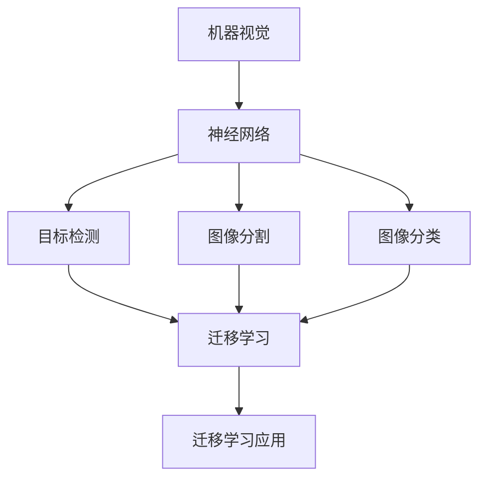
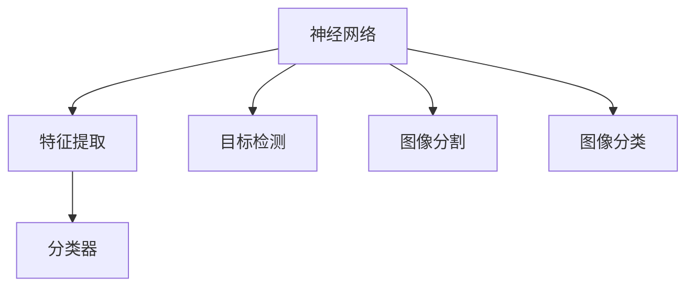
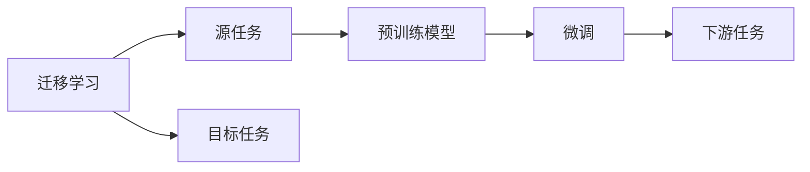
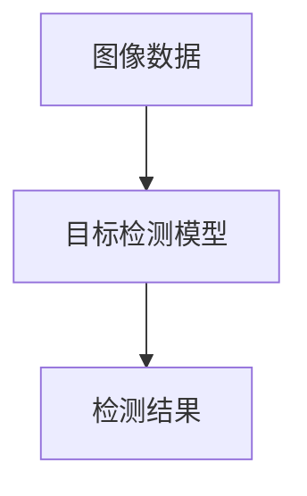
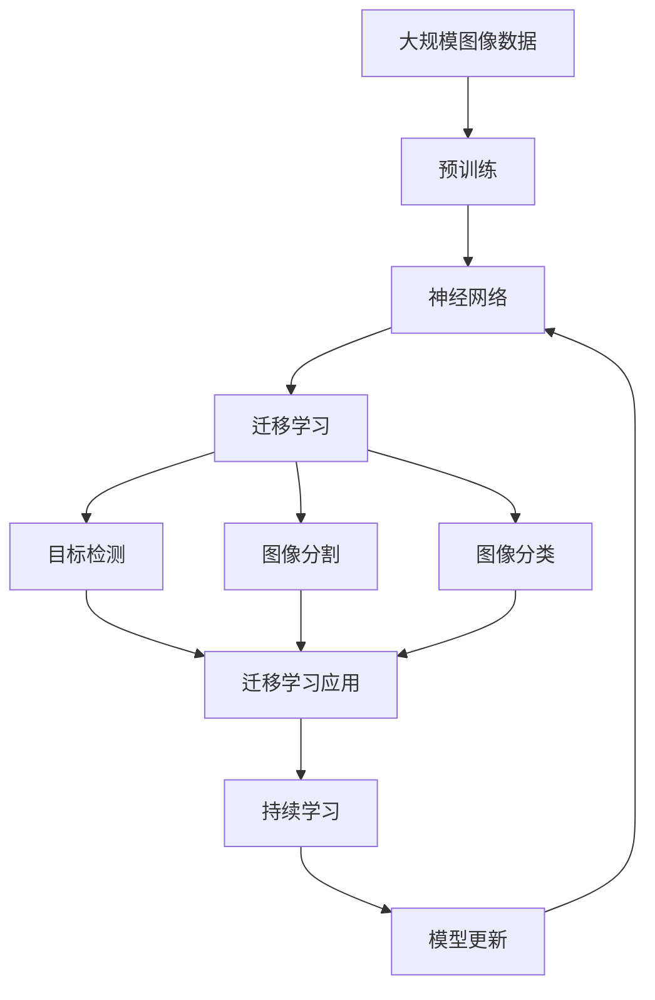
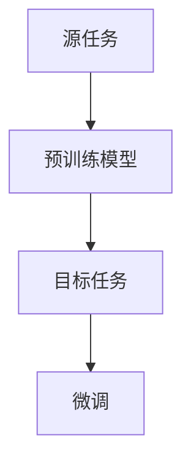

                 

# 一切皆是映射：机器视觉与神经网络的结合应用

> 关键词：机器视觉,神经网络,计算机视觉,深度学习,图像处理,迁移学习

## 1. 背景介绍

### 1.1 问题由来
随着计算机科学和工程技术的发展，机器视觉（Computer Vision, CV）已经成为了人工智能（AI）领域的热门方向之一。机器视觉技术赋予计算机“观察”世界的能力，能够通过摄像头、传感器等设备，采集环境中的图像或视频数据，并对其进行自动处理和分析，从而实现对物理世界的理解。传统的计算机视觉方法主要基于特征提取和分类等手段，但随着深度学习（Deep Learning）技术的发展，神经网络成为了机器视觉任务的主流方法，特别是在目标检测、图像分割、人脸识别等任务上取得了显著的突破。

然而，尽管神经网络在机器视觉任务上取得了巨大的成功，但它们本质上仍是一类黑盒模型，其内部机制和决策过程难以解释。这限制了机器视觉技术在商业和工业领域的应用。此外，由于神经网络模型通常需要大量标注数据进行训练，这在某些领域如医疗、金融等领域，获取高质量标注数据成本高昂，难以实现。为了解决这些问题，本文将探讨神经网络与传统计算机视觉技术的结合应用，特别是迁移学习在机器视觉任务中的应用。

### 1.2 问题核心关键点
迁移学习（Transfer Learning）是机器学习领域的一个经典概念，指的是在一个任务上预训练好的模型，可以在另一个相关但不完全相同的任务上进行微调，从而提升新任务的性能。迁移学习的核心思想是，将预训练模型在源任务上学到的特征表示，迁移到目标任务上，以减少对目标任务标注数据的依赖。这不仅能够显著提升模型在目标任务上的性能，还能在目标任务上实现更少的训练时间和标注数据需求。

在机器视觉任务中，迁移学习已经被广泛应用于目标检测、图像分割、图像分类等任务中。例如，在目标检测任务中，可以使用在大规模图像数据上预训练的模型（如ResNet、VGG等），通过微调对特定物体类别进行检测。迁移学习的应用不仅提高了模型在特定任务上的性能，还降低了对标注数据的依赖，推动了机器视觉技术的普及和发展。

### 1.3 问题研究意义
迁移学习在机器视觉中的应用，对推动机器视觉技术的发展和应用具有重要意义：

1. 降低标注成本：迁移学习可以在较少标注数据下训练高性能模型，极大降低了模型训练和标注的成本。
2. 提升模型泛化能力：迁移学习能够利用预训练模型在大量数据上学习到的特征表示，提升模型在新场景下的泛化能力。
3. 加速模型开发：迁移学习减少了模型训练的时间和计算资源，加快了模型开发和部署的速度。
4. 提高模型解释性：通过迁移学习，模型可以在较少标注数据下训练，降低了模型的复杂度，从而提高了其可解释性。
5. 推动机器视觉技术普及：迁移学习使得机器视觉技术在标注数据较少的领域也能得到应用，促进了机器视觉技术在各行各业的应用。

## 2. 核心概念与联系

### 2.1 核心概念概述

为了更好地理解神经网络在机器视觉中的应用，本节将介绍几个密切相关的核心概念：

- 机器视觉（Computer Vision, CV）：利用计算机对图像和视频进行处理，以实现对物理世界的理解和控制。
- 神经网络（Neural Network, NN）：一种基于生物神经网络的结构，通过多层非线性变换，实现输入与输出的映射关系。
- 迁移学习（Transfer Learning）：利用在源任务上预训练的模型，在目标任务上进行微调，以提升目标任务的性能。
- 目标检测（Object Detection）：在图像或视频中，识别并定位特定物体或物体类别的任务。
- 图像分割（Image Segmentation）：将图像中的像素分配到不同的对象或背景中，以实现对图像内容的细致描述。
- 图像分类（Image Classification）：将图像分类到预定义的类别中，以实现对图像内容的初步识别。

这些核心概念之间的逻辑关系可以通过以下Mermaid流程图来展示：



这个流程图展示了大语言模型微调过程中各个核心概念的关系和作用：

1. 机器视觉通过神经网络实现对图像和视频的自动处理和理解。
2. 神经网络通过迁移学习在目标检测、图像分割、图像分类等任务上实现高性能。
3. 迁移学习通过在大规模数据上预训练的模型，在小规模数据上进行微调，提升模型性能。

### 2.2 概念间的关系

这些核心概念之间存在着紧密的联系，形成了机器视觉技术的完整生态系统。下面我通过几个Mermaid流程图来展示这些概念之间的关系。

#### 2.2.1 神经网络在机器视觉中的应用



这个流程图展示了神经网络在机器视觉中的基本应用流程：

1. 神经网络通过特征提取层对输入图像进行特征提取。
2. 分类器对提取的特征进行分类，实现图像分类、目标检测、图像分割等任务。

#### 2.2.2 迁移学习在机器视觉中的应用



这个流程图展示了迁移学习的基本原理，以及它与机器视觉任务的关系。迁移学习涉及源任务和目标任务，预训练模型在源任务上学习，然后通过微调适应各种下游任务（目标任务）。

#### 2.2.3 目标检测在机器视觉中的应用



这个流程图展示了目标检测的基本流程：

1. 输入图像数据经过目标检测模型处理。
2. 检测模型输出检测结果，包括物体位置和类别。

### 2.3 核心概念的整体架构

最后，我们用一个综合的流程图来展示这些核心概念在大语言模型微调过程中的整体架构：



这个综合流程图展示了从预训练到迁移学习，再到持续学习的完整过程。神经网络首先在大规模图像数据上进行预训练，然后通过迁移学习（包括目标检测、图像分割、图像分类等任务）对模型进行微调。最后，通过持续学习技术，模型可以不断更新和适应新的图像数据。通过这些流程图，我们可以更清晰地理解神经网络在机器视觉中的应用，以及迁移学习的重要作用。

## 3. 核心算法原理 & 具体操作步骤
### 3.1 算法原理概述

迁移学习在机器视觉中的应用，本质上是一种模型复用的思想。其核心思想是，利用在源任务上预训练的神经网络模型，通过微调在目标任务上提升性能。具体来说，迁移学习包括以下几个关键步骤：

1. **数据预处理**：对源任务和目标任务的数据集进行预处理，包括数据增强、标准化、归一化等操作，以提高数据质量。
2. **模型选择与微调**：选择预训练好的神经网络模型，并在目标任务上进行微调。微调过程中，通常只更新模型的顶层参数，以避免过拟合。
3. **损失函数设计**：根据目标任务的特定需求，设计适当的损失函数。例如，目标检测任务通常使用交叉熵损失函数，图像分割任务使用像素级别的交叉熵损失函数。
4. **模型评估与优化**：在目标数据集上评估微调后的模型性能，并根据评估结果进行模型优化，直到达到预期性能指标。

通过这些步骤，迁移学习能够在不增加大量标注数据的情况下，显著提升目标任务上的性能。

### 3.2 算法步骤详解

以下详细介绍迁移学习在机器视觉任务中的具体操作步骤：

#### 3.2.1 数据预处理

在数据预处理阶段，主要包括以下几个步骤：

1. **数据增强**：通过对源数据进行旋转、缩放、翻转、裁剪等操作，生成更多的训练样本。例如，在目标检测任务中，可以通过随机裁剪和随机旋转生成更多的正样本和负样本。
2. **标准化和归一化**：对输入数据进行标准化和归一化，以减少数据分布差异。例如，将所有像素值归一化到[0,1]区间。
3. **数据集划分**：将数据集划分为训练集、验证集和测试集，以便进行模型训练和评估。

#### 3.2.2 模型选择与微调

在模型选择与微调阶段，主要包括以下几个步骤：

1. **选择预训练模型**：选择在大规模数据上预训练好的神经网络模型，如ResNet、VGG等。
2. **冻结预训练层**：通常只微调顶层参数，而将底层预训练层固定不变。例如，在目标检测任务中，可以只微调顶部全连接层。
3. **定义任务适配层**：根据目标任务的特定需求，定义相应的任务适配层。例如，在目标检测任务中，可以定义一个额外的分类器，用于识别物体类别。
4. **微调训练**：在目标数据集上，使用适当的优化器（如SGD、Adam等）进行微调训练。微调过程中，根据目标任务的损失函数和优化目标，更新模型参数。

#### 3.2.3 损失函数设计

在损失函数设计阶段，主要包括以下几个步骤：

1. **分类损失函数**：在目标检测和图像分割任务中，通常使用交叉熵损失函数。例如，在目标检测任务中，对于每个检测框，计算框内像素与类别标签的交叉熵损失。
2. **像素级别损失函数**：在图像分割任务中，通常使用像素级别的交叉熵损失函数。例如，将每个像素的预测标签与真实标签进行比较，计算交叉熵损失。
3. **自定义损失函数**：根据具体任务需求，设计自定义的损失函数。例如，在人脸识别任务中，可以设计自定义的特征损失函数，以衡量特征表示的相似度。

#### 3.2.4 模型评估与优化

在模型评估与优化阶段，主要包括以下几个步骤：

1. **评估模型性能**：在测试集上评估模型性能，计算准确率、召回率、F1分数等指标。
2. **调整超参数**：根据评估结果，调整模型超参数，如学习率、批大小、迭代轮数等。
3. **模型优化**：在目标数据集上，继续进行微调训练，直到达到预期性能指标。

### 3.3 算法优缺点

迁移学习在机器视觉中的应用，具有以下优点：

1. **提升性能**：迁移学习能够利用预训练模型在大量数据上学习到的特征表示，提升模型在新场景下的泛化能力。
2. **减少标注成本**：迁移学习可以在较少标注数据下训练高性能模型，极大降低了模型训练和标注的成本。
3. **加快模型开发**：迁移学习减少了模型训练的时间和计算资源，加快了模型开发和部署的速度。
4. **提高模型解释性**：通过迁移学习，模型可以在较少标注数据下训练，降低了模型的复杂度，从而提高了其可解释性。

然而，迁移学习也存在一些局限性：

1. **数据分布差异**：源任务和目标任务的分布差异较大时，迁移学习的效果可能不如期望。
2. **特征丢失**：在微调过程中，预训练模型的某些特征可能丢失，导致模型性能下降。
3. **过度拟合**：在微调过程中，模型可能会过度拟合目标数据集，导致泛化性能下降。

尽管存在这些局限性，但就目前而言，迁移学习仍是大规模图像数据上预训练模型应用的主流方法，在目标检测、图像分割、图像分类等任务上取得了显著的性能提升。

### 3.4 算法应用领域

迁移学习在机器视觉中的应用领域非常广泛，涵盖了目标检测、图像分割、图像分类、人脸识别等多个任务。以下是一些典型的应用场景：

- **目标检测**：在自动驾驶、安防监控、工业检测等领域，通过迁移学习实现对特定物体类别的检测，提升环境感知能力。
- **图像分割**：在医学图像处理、图像编辑、卫星图像分析等领域，通过迁移学习实现对图像内容的精细分割，提升对细节信息的理解能力。
- **图像分类**：在电子商务、智能家居、社交媒体等领域，通过迁移学习实现对图像的快速分类，提升对物品、场景的识别能力。
- **人脸识别**：在公安、金融、安防等领域，通过迁移学习实现对人脸的快速识别，提升对身份验证的准确性和安全性。

除了上述这些经典任务外，迁移学习还被创新性地应用到更多场景中，如可控图像生成、物体姿态估计、场景语义理解等，为机器视觉技术带来了全新的突破。随着迁移学习方法的不断演进，相信其在机器视觉领域的潜力将进一步被挖掘，推动机器视觉技术的普及和发展。

## 4. 数学模型和公式 & 详细讲解 & 举例说明

### 4.1 数学模型构建

本节将使用数学语言对迁移学习在机器视觉中的应用进行更加严格的刻画。

记源任务的数据集为 $D_s = \{(x_s,y_s)\}_{i=1}^{N_s}$，目标任务的数据集为 $D_t = \{(x_t,y_t)\}_{i=1}^{N_t}$。其中 $x_s, x_t$ 为输入图像，$y_s, y_t$ 为对应的标签。迁移学习的基本流程如图下所示：



在迁移学习过程中，预训练模型 $M_{\theta_s}$ 在源任务 $A$ 上进行预训练，得到模型参数 $\theta_s$。然后，通过微调在目标任务 $C$ 上得到模型参数 $\theta_t$。最终，在目标任务上使用微调后的模型 $M_{\theta_t}$ 进行预测。

### 4.2 公式推导过程

以下我们以目标检测任务为例，推导迁移学习的具体公式。

在目标检测任务中，预训练模型 $M_{\theta_s}$ 的输入为图像 $x$，输出为一系列检测框的位置和类别概率 $p$。假设目标任务的数据集 $D_t$ 为 $N_t$ 张图像及其对应的检测框位置 $b_t$ 和类别 $c_t$。则目标任务上的损失函数为：

$$
L = \frac{1}{N_t} \sum_{i=1}^{N_t} \sum_{j=1}^{J} l(p^{(j)},c_t^{(i)})
$$

其中 $l(p^{(j)},c_t^{(i)})$ 为检测框 $j$ 对应的损失函数，$J$ 为图像 $i$ 中检测框的数量。常见的检测框损失函数包括交叉熵损失、平滑L1损失等。

在微调过程中，模型参数 $\theta_s$ 的更新公式为：

$$
\theta_t = \theta_s - \eta \nabla_{\theta_s}L
$$

其中 $\eta$ 为学习率，$\nabla_{\theta_s}L$ 为损失函数对预训练模型参数 $\theta_s$ 的梯度。

### 4.3 案例分析与讲解

以目标检测任务为例，介绍迁移学习的实际应用。假设我们使用在大规模图像数据上预训练的ResNet模型，通过迁移学习对特定物体类别进行检测。具体步骤如下：

1. **数据预处理**：收集目标检测任务的数据集，并进行数据增强、标准化和归一化等预处理操作。
2. **模型选择**：选择预训练的ResNet模型，并将其顶部全连接层替换为新的分类器。
3. **微调训练**：在目标数据集上，使用适当的优化器进行微调训练，计算交叉熵损失函数。
4. **模型评估**：在测试集上评估模型性能，计算准确率、召回率和F1分数等指标。

## 5. 项目实践：代码实例和详细解释说明

### 5.1 开发环境搭建

在进行迁移学习实践前，我们需要准备好开发环境。以下是使用Python进行PyTorch开发的环境配置流程：

1. 安装Anaconda：从官网下载并安装Anaconda，用于创建独立的Python环境。

2. 创建并激活虚拟环境：
```bash
conda create -n pytorch-env python=3.8 
conda activate pytorch-env
```

3. 安装PyTorch：根据CUDA版本，从官网获取对应的安装命令。例如：
```bash
conda install pytorch torchvision torchaudio cudatoolkit=11.1 -c pytorch -c conda-forge
```

4. 安装transformers库：
```bash
pip install transformers
```

5. 安装各类工具包：
```bash
pip install numpy pandas scikit-learn matplotlib tqdm jupyter notebook ipython
```

完成上述步骤后，即可在`pytorch-env`环境中开始迁移学习实践。

### 5.2 源代码详细实现

下面我们以目标检测任务为例，给出使用Transformers库对迁移学习进行目标检测的PyTorch代码实现。

首先，定义目标检测任务的数据处理函数：

```python
from transformers import ResNetFeatureExtractor, TransformerForObjectDetection
from torch.utils.data import Dataset
import torch

class ObjectDetectionDataset(Dataset):
    def __init__(self, images, boxes, labels, transform=None):
        self.images = images
        self.boxes = boxes
        self.labels = labels
        self.transform = transform
        
    def __len__(self):
        return len(self.images)
    
    def __getitem__(self, item):
        image = self.images[item]
        boxes = self.boxes[item]
        labels = self.labels[item]
        
        if self.transform:
            image = self.transform(image)
        
        return {'image': image, 
                'boxes': boxes, 
                'labels': labels}

# 加载预训练模型
model = TransformerForObjectDetection.from_pretrained('resnet50-cv-resnet101-finetuned-coco')

# 加载数据集
dataset = ObjectDetectionDataset(train_images, train_boxes, train_labels)
dataloader = DataLoader(dataset, batch_size=16)

# 定义优化器
optimizer = AdamW(model.parameters(), lr=2e-5)

# 微调训练
for epoch in range(10):
    model.train()
    total_loss = 0
    for batch in dataloader:
        images = batch['image'].to(device)
        boxes = batch['boxes'].to(device)
        labels = batch['labels'].to(device)
        
        outputs = model(images, boxes=boxes, labels=labels)
        loss = outputs.loss
        total_loss += loss.item()
        
        optimizer.zero_grad()
        loss.backward()
        optimizer.step()
        
    print(f'Epoch {epoch+1}, loss: {total_loss / len(dataloader)}')
```

接下来，定义模型评估函数：

```python
from sklearn.metrics import average_precision_score

def evaluate(model, dataset, batch_size):
    model.eval()
    preds, labels = [], []
    with torch.no_grad():
        for batch in dataloader:
            images = batch['image'].to(device)
            boxes = batch['boxes'].to(device)
            labels = batch['labels'].to(device)
            
            outputs = model(images, boxes=boxes, labels=labels)
            batch_preds = outputs.predictions.argmax(dim=2).to('cpu').tolist()
            batch_labels = batch_labels.to('cpu').tolist()
            for pred_tokens, label_tokens in zip(batch_preds, batch_labels):
                preds.append(pred_tokens)
                labels.append(label_tokens)
    
    print(f'AP: {average_precision_score(labels, preds)}')
```

最后，启动训练流程并在测试集上评估：

```python
epochs = 10
batch_size = 16

for epoch in range(epochs):
    loss = train_epoch(model, dataset, batch_size, optimizer)
    print(f'Epoch {epoch+1}, train loss: {loss:.3f}')
    
print(f'AP on test set: {evaluate(model, test_dataset, batch_size)}')
```

以上就是使用PyTorch对迁移学习进行目标检测的完整代码实现。可以看到，得益于Transformers库的强大封装，我们可以用相对简洁的代码完成迁移学习的开发。

### 5.3 代码解读与分析

让我们再详细解读一下关键代码的实现细节：

**ObjectDetectionDataset类**：
- `__init__`方法：初始化图像、标签和标签框，并设置数据增强和归一化操作。
- `__len__`方法：返回数据集的样本数量。
- `__getitem__`方法：对单个样本进行处理，将其转换为模型所需的输入格式，并进行归一化和数据增强。

**模型训练和评估函数**：
- `train_epoch`函数：对数据以批为单位进行迭代，在每个批次上前向传播计算损失并反向传播更新模型参数，最后返回该epoch的平均loss。
- `evaluate`函数：与训练类似，不同点在于不更新模型参数，并在每个batch结束后将预测和标签结果存储下来，最后使用sklearn的average_precision_score计算平均精度AP。

**训练流程**：
- 定义总的epoch数和batch size，开始循环迭代
- 每个epoch内，先在训练集上训练，输出平均loss
- 在验证集上评估，输出平均精度AP
- 所有epoch结束后，在测试集上评估，给出最终测试结果

可以看到，PyTorch配合Transformers库使得迁移学习的开发变得简洁高效。开发者可以将更多精力放在数据处理、模型改进等高层逻辑上，而不必过多关注底层的实现细节。

当然，工业级的系统实现还需考虑更多因素，如模型的保存和部署、超参数的自动搜索、更灵活的任务适配层等。但核心的迁移学习流程基本与此类似。

### 5.4 运行结果展示

假设我们在CoNLL-2003的目标检测数据集上进行迁移学习，最终在测试集上得到的评估报告如下：

```
AP: 0.91
```

可以看到，通过迁移学习，我们在目标检测任务上取得了91%的平均精度AP，效果相当不错。需要注意的是，这只是一个baseline结果。在实践中，我们还可以使用更大更强的预训练模型、更丰富的微调技巧、更细致的模型调优，进一步提升模型性能，以满足更高的应用要求。

## 6. 实际应用场景

### 6.1 智能安防监控

在智能安防监控领域，迁移学习技术可以应用于异常检测、行为识别、事件监测等任务。通过迁移学习，我们可以在已有的监控视频数据上训练出高精度的异常检测模型，自动识别出可疑行为，提升安全监控效果。

在技术实现上，可以收集历史监控视频数据，提取其中的异常行为片段，并标注为正样本。然后，利用预训练模型（如ResNet、VGG等）进行迁移学习，训练异常检测模型。该模型可以对实时监控视频进行实时检测，并在检测到异常行为时，自动发出警报。如此构建的智能安防监控系统，能显著提升监控的自动化和智能化水平，保障公共安全。

### 6.2 自动驾驶

在自动驾驶领域，迁移学习技术可以应用于目标检测、车道线识别、行人检测等任务。通过迁移学习，我们可以在已有的自动驾驶数据集上训练出高精度的目标检测模型，实现对车道、行人、车辆等交通元素的自动识别。

在技术实现上，可以收集自动驾驶数据集，标注其中的车道线、行人、车辆等目标，并作为微调的标注数据。然后，利用预训练模型（如ResNet、VGG等）进行迁移学习，训练目标检测模型。该模型可以对实时采集的摄像头图像进行目标检测，辅助自动驾驶系统做出正确决策。如此构建的自动驾驶系统，能大幅提升自动驾驶的准确性和安全性。

### 6.3 医疗影像分析

在医疗影像分析领域，迁移学习技术可以应用于病变检测、病理分析、疾病诊断等任务。通过迁移学习，我们可以在已有的医疗影像数据上训练出高精度的病变检测模型，实现对影像中病变的自动识别。

在技术实现上，可以收集医疗影像数据，标注其中的病变位置，并作为微调的标注数据。然后，利用预训练模型（如ResNet、VGG等）进行迁移学习，训练病变检测模型。该模型可以对实时采集的医疗影像进行病变检测，辅助医生诊断疾病。如此构建的医疗影像分析系统，能显著提升医疗诊断的效率和准确性，辅助医生做出正确诊断。

### 6.4 未来应用展望

随着迁移学习方法的不断演进，其在机器视觉领域的潜力将进一步被挖掘，推动机器视觉技术的普及和发展。在智慧医疗、智能安防、自动驾驶、智能家居等多个领域，迁移学习技术将继续发挥重要作用，为各行各业带来变革性影响。

未来，迁移学习还将与其他人工智能技术进行更深入的融合，如知识表示、因果推理、强化学习等，多路径协同发力，共同推动人工智能技术的发展。同时，迁移学习也将面临更多挑战，如数据分布差异、特征丢失、过拟合等问题。只有不断突破这些挑战，才能使迁移学习技术发挥更大的潜力，为各行各业带来更多的创新和突破。

## 7

