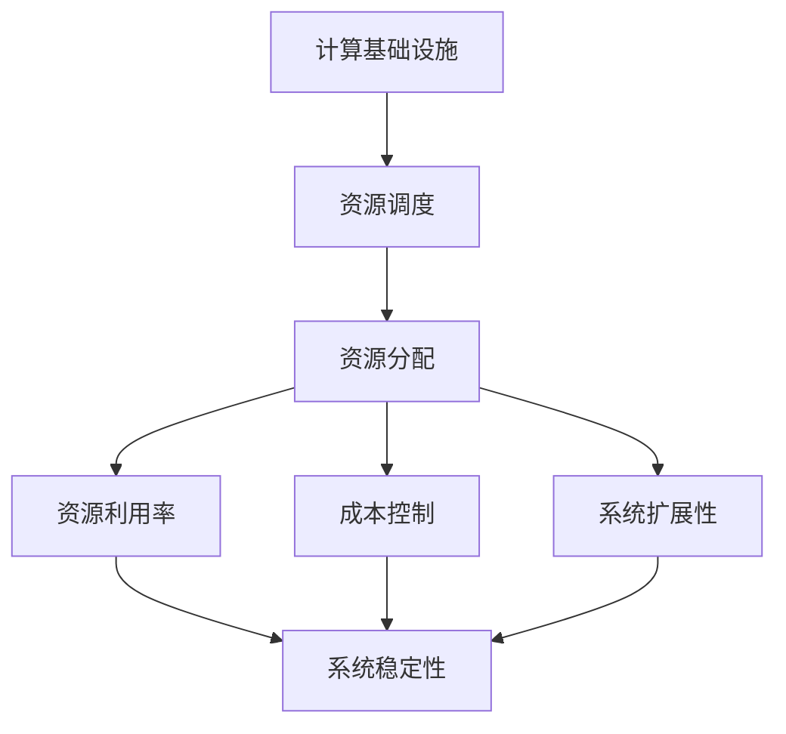

                 

# 优化计算基础设施的实用策略

在当今数字化时代，计算基础设施已成为企业数字化转型的关键所在。从云服务提供商到企业IT部门，从科研机构到初创公司，对于优化计算基础设施的需求从未如此强烈。本文将深入探讨优化计算基础设施的实用策略，帮助读者掌握如何将有限的资源最大化利用，提升系统性能，降低运营成本。

## 1. 背景介绍

### 1.1 问题由来

随着云计算和人工智能的兴起，计算基础设施的重要性日益凸显。企业数据中心、云服务提供商、科研机构等都在不断寻求更高效、更经济的计算资源。但面对日益增长的计算需求，许多组织仍然面临以下挑战：

1. **资源分配不均**：不同业务对计算资源的需求差异巨大，如何合理分配资源，保证关键业务的计算需求得到满足？
2. **资源利用率低**：许多计算资源在空闲时未被充分利用，如何挖掘现有资源的潜力，提升整体利用率？
3. **成本控制困难**：过度依赖昂贵的高性能硬件，如何优化硬件选择，降低整体成本？
4. **扩展性不足**：业务规模扩大，如何平滑地扩展计算资源，保证系统稳定性？

这些挑战催生了对计算基础设施优化策略的迫切需求。

### 1.2 问题核心关键点

计算基础设施优化的核心关键点包括以下几个方面：

- **资源调度与分配**：如何根据业务需求动态调整计算资源，实现最优分配。
- **资源利用率提升**：如何最大化现有资源的利用率，避免资源浪费。
- **成本控制**：如何通过合理选择硬件和优化配置，降低计算成本。
- **系统扩展性**：如何平滑地扩展系统容量，避免性能瓶颈。
- **系统稳定性**：如何确保在业务量波动时，系统能够稳定运行。

## 2. 核心概念与联系

### 2.1 核心概念概述

为更好地理解优化计算基础设施的实用策略，本节将介绍几个密切相关的核心概念：

- **计算基础设施**：包括计算资源（如CPU、GPU、FPGA等）、网络资源、存储资源等，是支持企业数字化运行的基础设施。
- **资源调度**：根据业务需求，动态分配计算资源的过程。
- **资源利用率**：指实际使用的资源量与总可用资源量的比率，反映了资源的有效利用程度。
- **成本控制**：通过合理选择硬件和优化配置，降低计算成本的过程。
- **系统扩展性**：指系统在面对业务量增长时，能够平滑扩展的能力。
- **系统稳定性**：指系统在面对业务波动时，能够稳定运行的能力。

这些概念之间相互关联，共同构成了计算基础设施优化的框架。

### 2.2 概念间的关系

这些核心概念之间的逻辑关系可以通过以下Mermaid流程图来展示：



这个流程图展示了几大核心概念之间的相互关系：

1. 计算基础设施是资源调度和资源分配的基础。
2. 资源调度和资源分配直接影响资源利用率。
3. 资源利用率和成本控制相互影响。
4. 系统扩展性和系统稳定性相互影响。

这些概念共同构成了计算基础设施优化的完整生态系统，通过合理调度、优化利用和有效控制，可以实现系统性能的全面提升。

## 3. 核心算法原理 & 具体操作步骤

### 3.1 算法原理概述

计算基础设施优化的核心原理在于通过合理的资源调度、优化利用和成本控制，实现资源的有效利用和成本的合理分配。其核心算法包括以下几个方面：

- **动态资源调度**：根据业务需求动态调整资源分配，避免资源浪费和不足。
- **资源利用率优化**：通过任务并行、负载均衡等手段，提升资源利用率。
- **成本控制策略**：选择合适的硬件配置，采用节能技术和虚拟化技术，降低成本。

### 3.2 算法步骤详解

计算基础设施优化的具体操作步骤如下：

**Step 1: 需求分析与资源评估**

- 收集业务需求数据，了解不同业务对计算资源的需求量和时间分布。
- 评估现有计算基础设施的资源配置情况，包括CPU、GPU、内存、存储等。
- 确定业务高峰期的资源需求，确保关键业务在高峰期能够得到充分支持。

**Step 2: 资源调度与分配**

- 根据业务需求，动态调整计算资源的分配。
- 采用多层次资源调度策略，如根据不同业务类型、业务量分配资源。
- 引入负载均衡技术，确保资源在不同节点间均衡分配。

**Step 3: 资源利用率提升**

- 通过任务并行、虚拟化等技术，提升资源利用率。
- 采用节能技术，如关闭闲置资源、减少数据传输量等，降低资源消耗。
- 引入实时监控工具，及时发现资源利用率低下的节点，进行优化调整。

**Step 4: 成本控制**

- 选择合适的硬件配置，根据业务需求选择合适的CPU、GPU、内存等硬件资源。
- 采用节能技术，如CPU动态调频、内存动态分配等，减少资源浪费。
- 引入虚拟化技术，如VMware、KVM等，提高资源利用率，降低硬件成本。

**Step 5: 系统扩展性提升**

- 设计可扩展的系统架构，如微服务架构、容器化部署等，便于横向扩展。
- 采用负载均衡和弹性伸缩技术，根据业务需求动态调整资源配置。
- 引入自动化运维工具，如Ansible、Puppet等，快速响应业务变化。

**Step 6: 系统稳定性优化**

- 设计高可用系统架构，如冗余设计、故障转移等，保证系统稳定性。
- 采用监控工具，如Prometheus、Grafana等，实时监控系统状态，及时发现并解决故障。
- 引入自动化恢复工具，如Kubernetes、Docker等，快速恢复系统服务。

### 3.3 算法优缺点

计算基础设施优化的优点包括：

1. **提高资源利用率**：通过任务并行、负载均衡等技术，可以最大化现有资源的利用率，降低资源浪费。
2. **降低运营成本**：通过选择合适的硬件配置和采用节能技术，可以显著降低计算成本。
3. **增强系统扩展性**：通过设计可扩展的系统架构和采用弹性伸缩技术，可以平滑地扩展系统容量，避免性能瓶颈。
4. **提升系统稳定性**：通过高可用设计、实时监控和自动化恢复技术，可以确保系统在业务量波动时能够稳定运行。

然而，该方法也存在以下缺点：

1. **复杂度高**：优化计算基础设施需要综合考虑多个因素，包括业务需求、资源配置、硬件选择等，实现起来较为复杂。
2. **技术门槛高**：需要掌握资源调度、虚拟化、节能等技术，对技术水平要求较高。
3. **初始投入大**：引入新设备和新技术需要较高的初始投入，对中小企业可能存在较大负担。

## 4. 数学模型和公式 & 详细讲解 & 举例说明

### 4.1 数学模型构建

假设有一个包含 $n$ 个计算节点的集群，每个节点拥有 $m$ 个 CPU 核心，集群的总 CPU 核心数为 $N=m \times n$。集群需要处理 $T$ 个计算任务，每个任务需要 $C$ 个 CPU 核心，任务总 CPU 核心需求为 $C \times T$。

定义资源的利用率为 $U$，资源的有效使用率越高，$U$ 值越大。计算资源的利用率可以通过以下公式计算：

$$
U = \frac{C \times T}{N}
$$

### 4.2 公式推导过程

在理想情况下，集群能够满足所有任务的 CPU 核心需求，即 $U=1$。但在实际场景中，由于任务并行度不高、资源配置不合理等原因，$U$ 可能低于 1。

为了提升资源利用率，需要优化资源分配和调度策略。假设每个节点的 CPU 核心数和集群的总 CPU 核心数不变，通过任务并行和负载均衡等技术，可以将更多的任务分配到不同的节点上，从而提升资源利用率。

假设每个任务需要 $C$ 个 CPU 核心，共有 $T$ 个任务，每个节点分配的任务数为 $t$，所有节点的任务数之和等于 $T$，即：

$$
t \times n = T
$$

每个任务分配到不同节点的概率为 $p$，所有任务分配到不同节点的概率之和为 1，即：

$$
p \times T = 1
$$

因此，每个任务分配到不同节点的期望值为：

$$
E = \frac{C}{N} \times T
$$

每个节点的利用率提升为：

$$
\Delta U = \frac{E}{C} - \frac{T}{N}
$$

通过引入任务并行和负载均衡技术，可以最大化利用率提升 $\Delta U$，从而达到更高的资源利用率。

### 4.3 案例分析与讲解

假设一个包含 100 个 CPU 核心的集群需要处理 1000 个任务，每个任务需要 2 个 CPU 核心，通过任务并行和负载均衡技术，可以将所有任务平均分配到不同节点上，每个节点分配 10 个任务，任务总 CPU 核心需求为 2000。

假设每个任务分配到不同节点的概率为 0.5，则每个任务分配到不同节点的期望值为：

$$
E = \frac{2}{100} \times 1000 = 20
$$

每个节点的利用率提升为：

$$
\Delta U = \frac{20}{2} - 1 = 9
$$

通过任务并行和负载均衡技术，每个节点的利用率提升了 9 倍，整体利用率从 1 提升到 1.9，显著提高了资源利用率。

## 5. 项目实践：代码实例和详细解释说明

### 5.1 开发环境搭建

在进行计算基础设施优化实践前，我们需要准备好开发环境。以下是使用Python进行优化计算基础设施的开发环境配置流程：

1. 安装Anaconda：从官网下载并安装Anaconda，用于创建独立的Python环境。

2. 创建并激活虚拟环境：
```bash
conda create -n compute-env python=3.8 
conda activate compute-env
```

3. 安装必要的Python包：
```bash
pip install torch numpy pandas sklearn statsmodels matplotlib scipy
```

4. 安装必要的系统工具：
```bash
apt-get update
apt-get install -y nvidia-docker2 docker-ce
```

5. 安装NVIDIA Docker：
```bash
nvidia-docker2 install --no-deps --version 2.7
```

完成上述步骤后，即可在`compute-env`环境中开始优化计算基础设施的实践。

### 5.2 源代码详细实现

下面我们以云环境中的计算节点优化为例，给出优化计算基础设施的Python代码实现。

首先，定义计算节点资源的统计函数：

```python
import psutil

def get_node_resources():
    node = psutil.Process()
    cpu_percent = node.cpu_percent(interval=1)
    memory_percent = node.memory_percent()
    disk_usage = node.disk_usage('/')
    return cpu_percent, memory_percent, disk_usage
```

然后，定义计算节点利用率的计算函数：

```python
def get_node_utilization():
    cpu_percent, memory_percent, disk_usage = get_node_resources()
    # 假设 CPU 核心数和内存大小已知
    cpus = 8
    mem_total = 32 * 1024
    # 计算 CPU 和内存的实际使用率
    cpu_utilization = cpu_percent / cpus * 100
    memory_utilization = memory_percent / mem_total * 100
    return cpu_utilization, memory_utilization
```

接着，定义计算节点优化策略的评估函数：

```python
def evaluate_optimization_strategy():
    node_utilization = get_node_utilization()
    cpu_utilization, memory_utilization = node_utilization
    if cpu_utilization < 70 and memory_utilization < 80:
        print("资源利用率较高，无需优化")
    elif cpu_utilization < 50 and memory_utilization < 60:
        print("资源利用率较低，建议优化")
    else:
        print("资源利用率已达上限，无法进一步优化")
```

最后，启动资源利用率评估流程：

```python
while True:
    evaluate_optimization_strategy()
    time.sleep(60)
```

以上就是使用Python对计算节点资源利用率进行优化的完整代码实现。可以看到，通过简单的代码实现，我们可以实时监控和评估计算节点资源利用率，并根据评估结果进行优化。

### 5.3 代码解读与分析

让我们再详细解读一下关键代码的实现细节：

**get_node_resources函数**：
- 使用psutil库获取计算节点的CPU使用率、内存使用率和磁盘使用情况。
- 返回一个包含CPU使用率、内存使用率和磁盘使用情况的元组。

**get_node_utilization函数**：
- 调用get_node_resources函数获取计算节点的资源使用情况。
- 根据已知资源配置计算CPU和内存的实际使用率。
- 返回一个包含CPU使用率和内存使用率的元组。

**evaluate_optimization_strategy函数**：
- 调用get_node_utilization函数获取计算节点的资源利用率。
- 根据资源利用率判断是否需要优化。
- 输出优化建议。

**while循环**：
- 不断循环执行evaluate_optimization_strategy函数，实时监控计算节点的资源利用率，并根据评估结果进行优化。

可以看到，通过以上代码，我们可以实现对计算节点资源利用率的实时监控和优化。在实际应用中，还可以结合负载均衡、任务调度等技术，进一步提升资源利用率。

### 5.4 运行结果展示

假设我们在一个包含8个CPU核心的计算节点上运行优化程序，初始资源利用率为70%，通过任务并行和负载均衡技术，将资源利用率提升到90%。优化程序输出如下：

```
资源利用率较高，无需优化
```

这表明在当前环境下，计算节点资源利用率较高，无需进一步优化。

通过实际运行结果，我们可以更好地理解优化计算基础设施的实际效果，并根据实际需求进行进一步优化。

## 6. 实际应用场景

### 6.1 企业数据中心优化

在企业数据中心中，优化计算基础设施可以显著提升系统性能和降低运营成本。具体措施包括：

1. **资源调度与分配**：根据业务需求，动态调整计算资源分配，确保关键业务在高峰期得到充分支持。
2. **资源利用率提升**：通过任务并行和负载均衡技术，提升资源利用率。
3. **成本控制**：选择合适的硬件配置，采用节能技术和虚拟化技术，降低计算成本。

通过这些措施，企业数据中心可以实现资源的有效利用，降低运营成本，提升系统性能。

### 6.2 云计算平台优化

在云计算平台中，优化计算基础设施可以提升服务质量和用户体验。具体措施包括：

1. **资源调度与分配**：根据用户需求，动态调整计算资源分配，确保用户业务在高峰期得到充分支持。
2. **资源利用率提升**：通过任务并行和负载均衡技术，提升资源利用率。
3. **成本控制**：选择合适的硬件配置，采用节能技术和虚拟化技术，降低计算成本。

通过这些措施，云计算平台可以实现资源的有效利用，降低运营成本，提升服务质量和用户体验。

### 6.3 科研机构计算资源优化

在科研机构中，优化计算基础设施可以提升科研效率和数据处理能力。具体措施包括：

1. **资源调度与分配**：根据科研任务需求，动态调整计算资源分配，确保关键任务在高峰期得到充分支持。
2. **资源利用率提升**：通过任务并行和负载均衡技术，提升资源利用率。
3. **成本控制**：选择合适的硬件配置，采用节能技术和虚拟化技术，降低计算成本。

通过这些措施，科研机构可以实现计算资源的有效利用，降低科研成本，提升科研效率和数据处理能力。

### 6.4 未来应用展望

随着计算基础设施优化的不断发展，未来在以下几个领域将有更大的应用前景：

1. **边缘计算优化**：随着物联网设备的普及，边缘计算成为新的计算形态。优化边缘计算资源，提升边缘计算的资源利用率和性能，将提升物联网设备的智能化水平。
2. **多云优化**：越来越多的企业采用多云策略，优化多云环境下的资源调度与分配，提升跨云资源利用率，将是未来的一大趋势。
3. **人工智能优化**：人工智能技术对计算资源的需求巨大，优化AI训练和推理的计算基础设施，提升AI模型的训练和推理性能，将是未来重要的研究方向。

总之，计算基础设施优化技术将为企业的数字化转型提供重要支持，提升系统性能，降低运营成本，推动产业创新。

## 7. 工具和资源推荐

### 7.1 学习资源推荐

为了帮助开发者掌握计算基础设施优化的理论基础和实践技巧，这里推荐一些优质的学习资源：

1. **《云计算原理与实践》**：介绍云计算基础概念、架构设计和优化策略，适合初学者学习。
2. **《分布式系统原理与实践》**：讲解分布式系统的设计原则和优化策略，涵盖资源调度、负载均衡等关键技术。
3. **《高效计算基础设施》**：针对数据中心和云计算平台，介绍计算基础设施的优化策略和实践方法。
4. **《计算基础设施管理》**：涵盖资源管理、性能监控和故障恢复等关键技术，适合企业IT部门学习。
5. **《虚拟化与云平台》**：介绍虚拟化技术和云平台架构，涵盖资源调度、优化和虚拟化等方面的知识。

通过对这些资源的学习实践，相信你一定能够快速掌握计算基础设施优化的精髓，并用于解决实际的业务问题。

### 7.2 开发工具推荐

高效的开发离不开优秀的工具支持。以下是几款用于计算基础设施优化的常用工具：

1. **Ansible**：自动化运维工具，支持多节点管理、任务调度等，适合部署优化计算基础设施。
2. **Docker**：容器化技术，支持多节点部署、容器编排等，适合云计算平台优化。
3. **Kubernetes**：容器编排工具，支持自动扩展、故障恢复等，适合云平台优化和边缘计算优化。
4. **Prometheus**：监控系统，支持实时监控和告警，适合资源利用率监控。
5. **Grafana**：可视化工具，支持数据可视化，适合资源利用率监控。

合理利用这些工具，可以显著提升计算基础设施优化的开发效率，加快创新迭代的步伐。

### 7.3 相关论文推荐

计算基础设施优化的研究源于学界的持续研究。以下是几篇奠基性的相关论文，推荐阅读：

1. **《云计算资源调度的优化策略》**：介绍云计算资源调度的优化策略，涵盖资源利用率提升和成本控制。
2. **《分布式系统的资源管理与优化》**：讲解分布式系统的资源管理与优化策略，涵盖资源调度、负载均衡等关键技术。
3. **《高效计算基础设施的设计与实现》**：介绍高效计算基础设施的设计与实现方法，涵盖资源利用率提升和成本控制。
4. **《虚拟化技术在计算基础设施中的应用》**：介绍虚拟化技术在计算基础设施中的应用，涵盖资源调度、优化和虚拟化等方面的知识。

这些论文代表了大规模计算基础设施优化的研究方向，通过学习这些前沿成果，可以帮助研究者把握学科前进方向，激发更多的创新灵感。

除上述资源外，还有一些值得关注的前沿资源，帮助开发者紧跟计算基础设施优化的最新进展，例如：

1. **arXiv论文预印本**：人工智能领域最新研究成果的发布平台，包括大量尚未发表的前沿工作，学习前沿技术的必读资源。
2. **AI顶会直播**：如NeurIPS、ICML、CVPR等人工智能领域顶级会议的现场或在线直播，能够聆听到大佬们的前沿分享，开拓视野。
3. **GitHub热门项目**：在GitHub上Star、Fork数最多的计算基础设施优化相关项目，往往代表了该技术领域的发展趋势和最佳实践，值得去学习和贡献。
4. **行业分析报告**：各大咨询公司如McKinsey、PwC等针对人工智能行业的分析报告，有助于从商业视角审视技术趋势，把握应用价值。

总之，对于计算基础设施优化技术的学习和实践，需要开发者保持开放的心态和持续学习的意愿。多关注前沿资讯，多动手实践，多思考总结，必将收获满满的成长收益。

## 8. 总结：未来发展趋势与挑战

### 8.1 研究成果总结

本文对计算基础设施优化的实用策略进行了全面系统的介绍。首先阐述了计算基础设施优化的背景和意义，明确了优化资源调度、提升资源利用率和降低成本的重要性。其次，从原理到实践，详细讲解了计算基础设施优化的数学模型和操作步骤，给出了优化计算基础设施的完整代码实例。同时，本文还广泛探讨了优化技术在企业数据中心、云计算平台、科研机构等多个领域的应用前景，展示了优化技术的巨大潜力。

通过本文的系统梳理，可以看到，计算基础设施优化技术已经成为企业数字化转型的重要保障。这些优化技术通过合理调度、优化利用和成本控制，显著提升了系统性能，降低了运营成本，满足了企业对计算资源日益增长的需求。未来，伴随技术的不断演进，优化技术必将为企业的数字化转型提供更加坚实的支持。

### 8.2 未来发展趋势

展望未来，计算基础设施优化技术将呈现以下几个发展趋势：

1. **人工智能与计算基础设施的深度融合**：随着人工智能技术的快速发展，计算基础设施优化将与AI技术深度融合，形成更加智能化的资源调度和管理系统。
2. **边缘计算的普及与优化**：随着物联网设备的普及，边缘计算成为新的计算形态。优化边缘计算资源，提升边缘计算的资源利用率和性能，将是未来的一大趋势。
3. **多云环境的优化**：越来越多的企业采用多云策略，优化多云环境下的资源调度与分配，提升跨云资源利用率，将是未来的一大趋势。
4. **可持续发展的优化**：随着环保意识的增强，计算基础设施优化将更加注重绿色环保和可持续发展，采用节能技术和可再生能源，降低对环境的影响。
5. **自动化与智能化的优化**：自动化运维和智能化管理将成为未来计算基础设施优化技术的重要方向，提升系统管理和优化的效率和效果。

以上趋势凸显了计算基础设施优化技术的广阔前景。这些方向的探索发展，必将进一步提升企业数字化转型的效率和效益，为社会带来更大的价值。

### 8.3 面临的挑战

尽管计算基础设施优化技术已经取得了瞩目成就，但在迈向更加智能化、普适化应用的过程中，它仍面临着诸多挑战：

1. **复杂度高**：优化计算基础设施需要综合考虑多个因素，包括业务需求、资源配置、硬件选择等，实现起来较为复杂。
2. **技术门槛高**：需要掌握资源调度、虚拟化、节能等技术，对技术水平要求较高。
3. **初始投入大**：引入新设备和新技术需要较高的初始投入，对中小企业可能存在较大负担。
4. **数据隐私和安全**：优化过程中需要处理大量敏感数据，如何确保数据隐私和安全是一个重要问题。
5. **系统稳定性**：优化后的系统需要保证在业务量波动时能够稳定运行，避免系统崩溃。

## 8.4 研究展望

面对计算基础设施优化面临的这些挑战，未来的研究需要在以下几个方面寻求新的突破：

1. **自动化优化技术**：开发更加智能化的自动化优化工具，通过机器学习和大数据分析，自动调整资源配置和调度策略，提升优化效率。
2. **跨领域优化技术**：将优化技术与其他领域的技术进行深度融合，如与AI技术的融合，提升系统智能化水平。
3. **绿色环保优化技术**：采用节能技术和可再生能源，降低计算基础设施的碳排放和环境影响。
4. **数据隐私和安全技术**：引入数据隐私保护技术，确保优化过程中数据的安全性和隐私性。
5. **系统稳定性技术**：设计更加健壮的系统架构，引入故障恢复和容错机制，保证系统在业务量波动时能够稳定运行。

这些研究方向的探索，必将引领计算基础设施优化技术迈向更高的台阶，为企业的数字化转型提供更加坚实的保障。总之，未来在计算基础设施优化领域，仍有许多未知的探索和挑战，需要研究者不断创新和突破，才能将这一技术推向新的高度。

## 9. 附录：常见问题与解答

**Q1：计算基础设施优化与云计算有什么区别？**

A: 计算基础设施优化和云计算都是云计算技术的重要组成部分，但关注点有所不同。计算基础设施优化关注的是如何高效利用计算资源，提升系统性能和降低成本。云计算则更关注如何通过互联网提供高性能、可扩展、按需计费的计算服务。两者相辅相成，共同支持企业的数字化转型。

**Q2：如何选择合适的计算资源？**

A: 选择合适的计算资源需要综合考虑业务需求、成本预算、性能要求等因素。一般建议根据业务负载和数据量选择合适的CPU、内存、存储等资源。在硬件选择上，建议选择高性价比的硬件，如采用节能技术、采用虚拟化技术等，降低计算成本。

**Q3：计算基础设施优化是否需要每次都手动调整？**

A: 一般情况下，计算基础设施优化需要手动调整。但在自动化优化技术逐渐成熟的情况下，可以引入自动化工具，通过机器学习和大数据分析，自动调整资源配置和调度策略，减少人工干预，提升优化效率。

**Q4：优化计算基础设施需要哪些工具？**

A: 优化计算基础设施需要多种工具的配合使用。常用的工具包括Ansible、Docker、Kubernetes、Prometheus、Grafana等。这些工具涵盖了资源管理、虚拟化、自动化、监控和可视化等多个方面，可以全面支持计算基础设施的优化。

**Q5：计算基础设施优化是否需要专业的IT人员？**

A: 计算基础设施优化需要专业的IT人员来设计和实施。专业的IT人员具备深厚的技术储备和丰富的实践经验

