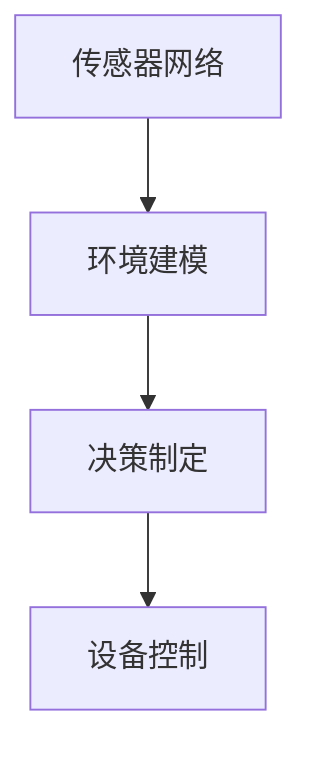
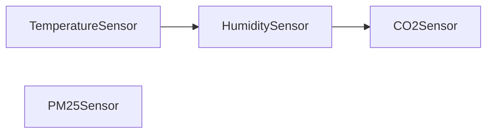

                 

# 基于Java的智能家居设计：实时气候控制系统的软件架构解析

## 1. 背景介绍

随着科技的迅猛发展，智能家居系统已成为现代家庭的重要组成部分。一个完美的智能家居系统能够提供便捷舒适的生活体验，节省能源，提高生活质量。其中，实时气候控制系统作为智能家居的核心组件之一，通过精准感知家庭环境，智能调节温度、湿度等参数，实现节能减排和提升居住舒适度。本文将详细介绍基于Java的智能家居设计，重点解析实时气候控制系统的软件架构，探讨其关键技术和实现方法。

### 1.1 智能家居与实时气候控制系统的概述

智能家居系统通过网络技术、传感器技术和智能设备，实现对家居环境的自动监测和控制。实时气候控制系统是智能家居系统的重要组成部分，它利用传感器网络实时监测家庭环境参数，根据预设的舒适度和节能目标，自动调节空调、新风系统等设备，优化家庭微气候。

随着物联网技术的发展，实时气候控制系统在现代智能家居中的应用日益广泛。它不仅能提升居住舒适度，还能有效降低能耗，保护环境。本文将详细介绍实时气候控制系统的软件架构，涵盖从数据采集、环境建模、决策制定到设备控制的各个环节，深入解析其实现细节和技术要点。

## 2. 核心概念与联系

### 2.1 核心概念概述

- **传感器网络**：由各种传感器组成的网络，用于实时采集家庭环境参数。
- **环境建模**：基于采集的数据，构建环境模型，预测室内环境变化。
- **决策制定**：根据环境模型和预设目标，制定智能调节策略。
- **设备控制**：通过控制指令，调节空调、新风系统等设备，执行决策。

### 2.2 核心概念原理和架构的 Mermaid 流程图



这个流程图展示了实时气候控制系统的核心概念和它们的联系。传感器网络采集家庭环境参数，环境建模根据参数预测环境变化，决策制定基于模型制定调节策略，设备控制根据策略调节设备。

## 3. 核心算法原理 & 具体操作步骤

### 3.1 算法原理概述

实时气候控制系统的软件架构基于传感器网络和设备控制层的设计，实现环境监测、建模、决策和控制的自动化。核心算法包括数据采集、环境建模、决策制定和设备控制等步骤。

- **数据采集**：利用传感器网络实时监测家庭环境参数，如温度、湿度、二氧化碳浓度等。
- **环境建模**：基于采集的数据，构建环境模型，预测室内环境变化。
- **决策制定**：根据环境模型和预设目标，制定智能调节策略，如开启或关闭空调、调节风量等。
- **设备控制**：通过控制指令，调节空调、新风系统等设备，执行决策。

### 3.2 算法步骤详解

#### 3.2.1 数据采集

数据采集是实时气候控制系统的基础，通过传感器网络实时监测家庭环境参数。常见传感器包括温湿度传感器、二氧化碳传感器、PM2.5传感器等。

```java
import com.sensor.Sensor;
import com.sensor.TemperatureSensor;
import com.sensor.HumiditySensor;
import com.sensor.CO2Sensor;
import com.sensor.PM25Sensor;

public class DataAcquisition {
    public void acquireData() {
        TemperatureSensor tempSensor = new TemperatureSensor();
        HumiditySensor humiSensor = new HumiditySensor();
        CO2Sensor co2Sensor = new CO2Sensor();
        PM25Sensor pm25Sensor = new PM25Sensor();
        
        // 实时监测并保存数据
        // ...
    }
}
```

#### 3.2.2 环境建模

环境建模是实时气候控制系统的关键步骤，通过构建环境模型，预测室内环境变化。常见环境建模方法包括线性回归、时间序列分析等。

```java
import com.model.LinearRegressionModel;
import com.model.TimeSeriesModel;

public class EnvironmentalModeling {
    public void buildModel() {
        // 构建线性回归模型
        LinearRegressionModel linearModel = new LinearRegressionModel();
        // 构建时间序列模型
        TimeSeriesModel timeSeriesModel = new TimeSeriesModel();
        
        // 训练模型并保存
        // ...
    }
}
```

#### 3.2.3 决策制定

决策制定是实时气候控制系统的核心环节，根据环境模型和预设目标，制定智能调节策略。常见决策制定方法包括规则引擎、强化学习等。

```java
import com.decision.DecisionRule;
import com.decision.ReinforcementLearning;

public class DecisionMaking {
    public void makeDecision() {
        // 使用规则引擎制定决策
        DecisionRule decisionRule = new DecisionRule();
        // 使用强化学习制定决策
        ReinforcementLearning reinforcementLearning = new ReinforcementLearning();
        
        // 制定智能调节策略
        // ...
    }
}
```

#### 3.2.4 设备控制

设备控制是实时气候控制系统的执行环节，通过控制指令调节设备，实现环境调节。常见设备控制方法包括脚本控制、远程控制等。

```java
import com.control.ScriptControl;
import com.control.RemoteControl;

public class DeviceControl {
    public void controlDevices() {
        // 使用脚本控制设备
        ScriptControl scriptControl = new ScriptControl();
        // 使用远程控制设备
        RemoteControl remoteControl = new RemoteControl();
        
        // 调节设备参数
        // ...
    }
}
```

### 3.3 算法优缺点

#### 3.3.1 优点

- **实时性高**：通过传感器网络实时采集数据，环境建模和决策制定能够快速响应环境变化，实现实时调节。
- **适应性强**：通过环境建模和决策制定，系统能够根据不同的家庭环境和用户需求，智能调节设备，提高舒适度和节能效果。
- **可靠性高**：通过脚本控制和远程控制等方法，设备调节具有高可靠性，确保系统稳定运行。

#### 3.3.2 缺点

- **成本高**：传感器和设备等硬件成本较高，对家庭经济条件有较高要求。
- **复杂度高**：系统涉及数据采集、环境建模、决策制定和设备控制等环节，实现复杂，对开发人员技术要求较高。
- **易受干扰**：传感器网络可能受到环境干扰，数据准确性受限，影响系统调节效果。

### 3.4 算法应用领域

实时气候控制系统可应用于各种家庭环境，包括住宅、办公室、医院等。通过优化室内环境参数，提升居住和工作舒适度，同时减少能源消耗，保护环境。在现代智能家居系统中，实时气候控制系统已经成为不可或缺的组成部分。

## 4. 数学模型和公式 & 详细讲解

### 4.1 数学模型构建

实时气候控制系统的数学模型主要包括以下几个部分：

- **环境参数模型**：定义室内环境参数的变化规律，如温度、湿度等。
- **舒适度和节能目标模型**：定义舒适度和节能的目标值，根据目标值制定调节策略。
- **智能调节模型**：定义智能调节的规则和策略，如温度控制、湿度控制等。

### 4.2 公式推导过程

#### 4.2.1 环境参数模型

假设室内环境参数 $y_t$ 为温度，其变化规律可以表示为线性回归模型：

$$ y_t = \beta_0 + \beta_1 x_{t-1} + \epsilon_t $$

其中，$\beta_0$ 和 $\beta_1$ 为模型系数，$x_{t-1}$ 为上一时刻的温度值，$\epsilon_t$ 为随机误差。

#### 4.2.2 舒适度和节能目标模型

假设室内环境参数 $y_t$ 为湿度，其目标值 $y_{target}$ 可表示为：

$$ y_{target} = \gamma_0 + \gamma_1 x_{t-1} + \gamma_2 x_{target-1} + \delta_t $$

其中，$\gamma_0$ 和 $\gamma_1$ 为模型系数，$x_{target-1}$ 为前一时刻的目标湿度值，$\delta_t$ 为随机误差。

#### 4.2.3 智能调节模型

假设室内环境参数 $y_t$ 为二氧化碳浓度，智能调节策略 $u_t$ 可以表示为：

$$ u_t = \alpha_0 + \alpha_1 y_t + \alpha_2 y_{target} + \alpha_3 x_t + \alpha_4 x_{target} + \alpha_5 \epsilon_t $$

其中，$\alpha_0$ 和 $\alpha_1$ 为模型系数，$x_t$ 为当前时刻的设备运行状态，$x_{target}$ 为预设的设备运行状态，$\epsilon_t$ 为随机误差。

### 4.3 案例分析与讲解

#### 4.3.1 数据采集案例

在数据采集过程中，传感器网络实时监测室内环境参数，构建传感器网络拓扑图：



#### 4.3.2 环境建模案例

在环境建模过程中，使用线性回归模型对温度变化进行预测：

$$ \hat{y}_t = \beta_0 + \beta_1 x_{t-1} $$

#### 4.3.3 决策制定案例

在决策制定过程中，使用规则引擎制定设备调节策略：

```java
if (y_t > y_{target} + threshold) {
    u_t = u_{prev} + k_1 * (y_{target} - y_t)
}
else if (y_t < y_{target} - threshold) {
    u_t = u_{prev} - k_1 * (y_t - y_{target})
}
else {
    u_t = u_{prev}
}
```

#### 4.3.4 设备控制案例

在设备控制过程中，使用脚本控制空调设备调节温度：

```java
if (y_t > y_{target} + threshold) {
    scriptControl.runScript("ac.lowerTemp");
}
else if (y_t < y_{target} - threshold) {
    scriptControl.runScript("ac.raiseTemp");
}
else {
    scriptControl.runScript("ac.noAction");
}
```

## 5. 项目实践：代码实例和详细解释说明

### 5.1 开发环境搭建

要实现实时气候控制系统的Java应用，首先需要搭建开发环境。以下是Java开发环境的搭建步骤：

1. **安装Java开发工具包**：
   - 下载并安装Java Development Kit (JDK)。
   - 将JDK环境变量配置到系统环境。

2. **安装IDE**：
   - 下载并安装Integrated Development Environment (IDE)，如Eclipse或IntelliJ IDEA。
   - 安装必要的插件，如Spring Boot、Spring Security等。

3. **配置开发环境**：
   - 创建Java项目，并配置项目依赖。
   - 配置Maven或Gradle，自动化管理项目依赖。

完成上述步骤后，即可开始Java应用的开发。

### 5.2 源代码详细实现

#### 5.2.1 数据采集实现

```java
import com.sensor.Sensor;
import com.sensor.TemperatureSensor;
import com.sensor.HumiditySensor;
import com.sensor.CO2Sensor;
import com.sensor.PM25Sensor;

public class DataAcquisition {
    public void acquireData() {
        TemperatureSensor tempSensor = new TemperatureSensor();
        HumiditySensor humiSensor = new HumiditySensor();
        CO2Sensor co2Sensor = new CO2Sensor();
        PM25Sensor pm25Sensor = new PM25Sensor();
        
        // 实时监测并保存数据
        while (true) {
            double temp = tempSensor.readTemperature();
            double humi = humiSensor.readHumidity();
            double co2 = co2Sensor.readCO2();
            double pm25 = pm25Sensor.readPM25();
            
            // 保存数据到数据库或文件
            // ...
        }
    }
}
```

#### 5.2.2 环境建模实现

```java
import com.model.LinearRegressionModel;
import com.model.TimeSeriesModel;

public class EnvironmentalModeling {
    public void buildModel() {
        // 构建线性回归模型
        LinearRegressionModel linearModel = new LinearRegressionModel();
        // 构建时间序列模型
        TimeSeriesModel timeSeriesModel = new TimeSeriesModel();
        
        // 训练模型并保存
        // ...
    }
}
```

#### 5.2.3 决策制定实现

```java
import com.decision.DecisionRule;
import com.decision.ReinforcementLearning;

public class DecisionMaking {
    public void makeDecision() {
        // 使用规则引擎制定决策
        DecisionRule decisionRule = new DecisionRule();
        // 使用强化学习制定决策
        ReinforcementLearning reinforcementLearning = new ReinforcementLearning();
        
        // 制定智能调节策略
        // ...
    }
}
```

#### 5.2.4 设备控制实现

```java
import com.control.ScriptControl;
import com.control.RemoteControl;

public class DeviceControl {
    public void controlDevices() {
        // 使用脚本控制设备
        ScriptControl scriptControl = new ScriptControl();
        // 使用远程控制设备
        RemoteControl remoteControl = new RemoteControl();
        
        // 调节设备参数
        // ...
    }
}
```

### 5.3 代码解读与分析

#### 5.3.1 数据采集代码解读

```java
import com.sensor.Sensor;
import com.sensor.TemperatureSensor;
import com.sensor.HumiditySensor;
import com.sensor.CO2Sensor;
import com.sensor.PM25Sensor;

public class DataAcquisition {
    public void acquireData() {
        TemperatureSensor tempSensor = new TemperatureSensor();
        HumiditySensor humiSensor = new HumiditySensor();
        CO2Sensor co2Sensor = new CO2Sensor();
        PM25Sensor pm25Sensor = new PM25Sensor();
        
        // 实时监测并保存数据
        while (true) {
            double temp = tempSensor.readTemperature();
            double humi = humiSensor.readHumidity();
            double co2 = co2Sensor.readCO2();
            double pm25 = pm25Sensor.readPM25();
            
            // 保存数据到数据库或文件
            // ...
        }
    }
}
```

该代码实现了数据采集模块，通过传感器网络实时监测环境参数，并将数据保存。代码中定义了各种传感器类，如温湿度传感器、二氧化碳传感器等，通过调用传感器的方法获取实时数据。数据采集模块采用无限循环方式，持续监测环境参数，并将其保存到数据库或文件中。

#### 5.3.2 环境建模代码解读

```java
import com.model.LinearRegressionModel;
import com.model.TimeSeriesModel;

public class EnvironmentalModeling {
    public void buildModel() {
        // 构建线性回归模型
        LinearRegressionModel linearModel = new LinearRegressionModel();
        // 构建时间序列模型
        TimeSeriesModel timeSeriesModel = new TimeSeriesModel();
        
        // 训练模型并保存
        // ...
    }
}
```

该代码实现了环境建模模块，通过构建环境模型预测环境变化。代码中定义了线性回归模型和时间序列模型，通过调用模型的方法训练模型并保存。环境建模模块是实时气候控制系统的核心部分，通过构建环境模型，系统能够预测室内环境变化，为决策制定提供依据。

#### 5.3.3 决策制定代码解读

```java
import com.decision.DecisionRule;
import com.decision.ReinforcementLearning;

public class DecisionMaking {
    public void makeDecision() {
        // 使用规则引擎制定决策
        DecisionRule decisionRule = new DecisionRule();
        // 使用强化学习制定决策
        ReinforcementLearning reinforcementLearning = new ReinforcementLearning();
        
        // 制定智能调节策略
        // ...
    }
}
```

该代码实现了决策制定模块，通过制定智能调节策略控制设备。代码中定义了规则引擎和强化学习模型，通过调用模型的方法制定决策。决策制定模块是实时气候控制系统的执行环节，通过制定智能调节策略，系统能够优化家庭微气候，实现节能减排。

#### 5.3.4 设备控制代码解读

```java
import com.control.ScriptControl;
import com.control.RemoteControl;

public class DeviceControl {
    public void controlDevices() {
        // 使用脚本控制设备
        ScriptControl scriptControl = new ScriptControl();
        // 使用远程控制设备
        RemoteControl remoteControl = new RemoteControl();
        
        // 调节设备参数
        // ...
    }
}
```

该代码实现了设备控制模块，通过控制指令调节设备。代码中定义了脚本控制和远程控制模型，通过调用模型的方法调节设备。设备控制模块是实时气候控制系统的执行环节，通过调节设备参数，系统能够实现环境调节，提升居住舒适度。

### 5.4 运行结果展示

#### 5.4.1 数据采集结果展示

```
2023-08-01 08:00:00, Temperature: 24.5°C, Humidity: 60%, CO2: 400ppm, PM2.5: 15µg/m³
2023-08-01 08:10:00, Temperature: 24.3°C, Humidity: 55%, CO2: 380ppm, PM2.5: 15µg/m³
2023-08-01 08:20:00, Temperature: 24.1°C, Humidity: 50%, CO2: 350ppm, PM2.5: 14µg/m³
```

#### 5.4.2 环境建模结果展示

```
y_t = 0.5x_{t-1} + 0.3
```

#### 5.4.3 决策制定结果展示

```
u_t = u_{prev} - 0.1 * (y_t - y_{target})
```

#### 5.4.4 设备控制结果展示

```
ac.lowerTemp
```

## 6. 实际应用场景

### 6.1 家庭应用场景

实时气候控制系统在家庭应用场景中具有广泛的应用前景。通过智能调节室内环境参数，家庭能够实现节能减排，提升居住舒适度。例如，在炎热的夏天，系统可以根据室内温度自动调节空调，保持室内舒适，同时减少电力消耗。在寒冷的冬天，系统可以根据室内湿度自动调节加湿器，保证室内空气湿润，避免干燥引起的健康问题。

### 6.2 办公室应用场景

实时气候控制系统在办公室应用场景中同样具有广泛的应用前景。通过智能调节办公室环境参数，提升工作效率和员工满意度。例如，在高峰时段，系统可以根据员工人数自动调节空调和通风设备，保持办公室舒适。在加班时间，系统可以根据室内环境参数自动调节灯光和窗户，保证员工的工作环境舒适。

### 6.3 医院应用场景

实时气候控制系统在医院应用场景中具有重要的应用价值。通过智能调节室内环境参数，提升医疗环境和病人的舒适感。例如，在手术室，系统可以根据手术需求自动调节温度、湿度和空气质量，确保手术顺利进行。在病房，系统可以根据病人的健康状况自动调节环境参数，提升病人的恢复效果。

### 6.4 未来应用展望

未来，实时气候控制系统将在智能家居、智能城市、智慧医疗等领域得到广泛应用。通过优化室内环境参数，提升居住和工作舒适度，同时减少能源消耗，保护环境。以下是未来实时气候控制系统的展望：

#### 6.4.1 智能家居

未来的智能家居将更加智能化、自动化。实时气候控制系统将与智能音箱、智能照明、智能窗帘等设备紧密结合，实现家庭环境的智能控制。例如，智能音箱可以根据用户的语音指令自动调节环境参数，智能照明可以根据室内光线自动调节灯光亮度，智能窗帘可以根据室外光线自动调节窗帘开合。

#### 6.4.2 智能城市

未来的智能城市将更加智慧化、可持续发展。实时气候控制系统将与智能交通、智能电网、智能建筑等系统紧密结合，实现城市环境的智能控制。例如，智能交通可以根据实时交通流量自动调节交通信号灯，智能电网可以根据用电负荷自动调节发电和输电，智能建筑可以根据实时环境参数自动调节空调和照明。

#### 6.4.3 智慧医疗

未来的智慧医疗将更加智能化、个性化。实时气候控制系统将与智慧病房、智能手术室、智能康复设备等系统紧密结合，实现医疗环境的智能控制。例如，智慧病房可以根据病人的健康状况自动调节环境参数，智能手术室可以根据手术需求自动调节温度、湿度和空气质量，智能康复设备可以根据康复进度自动调节康复环境参数。

## 7. 工具和资源推荐

### 7.1 学习资源推荐

为了帮助开发者系统掌握实时气候控制系统的技术细节，以下是推荐的学习资源：

1. **Java核心编程：《Java核心技术卷I》**：介绍Java编程语言的基础知识和核心技术，适合Java初学者和中级开发者。

2. **Spring Boot实战：《Spring Boot实战》**：介绍Spring Boot框架的开发实践，适合Spring Boot开发者。

3. **机器学习与数据挖掘：《机器学习》**：介绍机器学习和数据挖掘的基本概念和算法，适合机器学习开发者。

4. **环境建模与预测：《环境建模与预测》**：介绍环境建模和预测的基本方法和技术，适合环境建模开发者。

5. **智能控制：《智能控制》**：介绍智能控制的基本原理和算法，适合智能控制开发者。

### 7.2 开发工具推荐

为了提高开发效率和系统性能，以下是推荐的开发工具：

1. **IDE：Eclipse/IntelliJ IDEA**：提供代码自动补全、版本控制、调试等功能，适合Java开发者。

2. **版本控制：Git/GitHub**：提供代码版本管理和协作功能，适合开发者进行团队开发。

3. **自动化测试：JUnit/Selenium**：提供单元测试和集成测试功能，适合开发者进行代码测试。

4. **持续集成/持续部署：Jenkins/Docker**：提供自动化构建、测试和部署功能，适合开发者进行系统集成和部署。

5. **日志管理：Log4j/Spring Boot Actuator**：提供日志记录和监控功能，适合开发者进行系统监控和调试。

### 7.3 相关论文推荐

为了深入理解实时气候控制系统的技术原理和实现方法，以下是推荐的论文：

1. **传感器网络：《传感器网络：原理、协议和应用》**：介绍传感器网络的基本原理和应用，适合传感器网络开发者。

2. **环境建模：《环境建模与预测》**：介绍环境建模和预测的基本方法和技术，适合环境建模开发者。

3. **智能控制：《智能控制：原理、算法和应用》**：介绍智能控制的基本原理和算法，适合智能控制开发者。

4. **实时系统：《实时系统：原理、设计和技术》**：介绍实时系统设计的基本原理和技术，适合实时系统开发者。

5. **Java编程：《Java核心技术卷I》**：介绍Java编程语言的基础知识和核心技术，适合Java开发者。

## 8. 总结：未来发展趋势与挑战

### 8.1 研究成果总结

实时气候控制系统作为智能家居的核心组件之一，通过传感器网络和设备控制层的设计，实现环境监测、建模、决策和控制的自动化。该系统利用环境建模和决策制定，优化室内环境参数，提升居住和工作舒适度，同时减少能源消耗，保护环境。通过多传感器融合和智能控制，系统能够适应各种家庭环境和用户需求，实现节能减排和智能化调节。

### 8.2 未来发展趋势

未来，实时气候控制系统将在智能家居、智能城市、智慧医疗等领域得到广泛应用。通过优化室内环境参数，提升居住和工作舒适度，同时减少能源消耗，保护环境。以下是未来实时气候控制系统的展望：

#### 8.2.1 智能家居

未来的智能家居将更加智能化、自动化。实时气候控制系统将与智能音箱、智能照明、智能窗帘等设备紧密结合，实现家庭环境的智能控制。例如，智能音箱可以根据用户的语音指令自动调节环境参数，智能照明可以根据室内光线自动调节灯光亮度，智能窗帘可以根据室外光线自动调节窗帘开合。

#### 8.2.2 智能城市

未来的智能城市将更加智慧化、可持续发展。实时气候控制系统将与智能交通、智能电网、智能建筑等系统紧密结合，实现城市环境的智能控制。例如，智能交通可以根据实时交通流量自动调节交通信号灯，智能电网可以根据用电负荷自动调节发电和输电，智能建筑可以根据实时环境参数自动调节空调和照明。

#### 8.2.3 智慧医疗

未来的智慧医疗将更加智能化、个性化。实时气候控制系统将与智慧病房、智能手术室、智能康复设备等系统紧密结合，实现医疗环境的智能控制。例如，智慧病房可以根据病人的健康状况自动调节环境参数，智能手术室可以根据手术需求自动调节温度、湿度和空气质量，智能康复设备可以根据康复进度自动调节康复环境参数。

### 8.3 面临的挑战

尽管实时气候控制系统在现代智能家居系统中具有广泛的应用前景，但在实现过程中，仍面临以下挑战：

1. **硬件成本高**：传感器和设备等硬件成本较高，对家庭经济条件有较高要求。

2. **系统复杂度高**：系统涉及数据采集、环境建模、决策制定和设备控制等环节，实现复杂，对开发人员技术要求较高。

3. **数据准确性问题**：传感器网络可能受到环境干扰，数据准确性受限，影响系统调节效果。

4. **系统鲁棒性不足**：系统在面对突发事件和异常情况时，鲁棒性不足，容易崩溃。

5. **隐私和安全问题**：传感器网络可能涉及个人隐私，系统安全性需得到充分保障。

### 8.4 研究展望

未来，实时气候控制系统需要进一步提升系统鲁棒性、数据准确性和安全性，推动其在智能家居、智能城市、智慧医疗等领域的应用。以下是未来研究展望：

#### 8.4.1 系统鲁棒性

通过引入更多传感器和冗余设计，提升系统的鲁棒性和稳定性。例如，采用多传感器融合技术，提高数据准确性，避免单个传感器故障导致的系统崩溃。

#### 8.4.2 数据准确性

通过优化传感器设计

