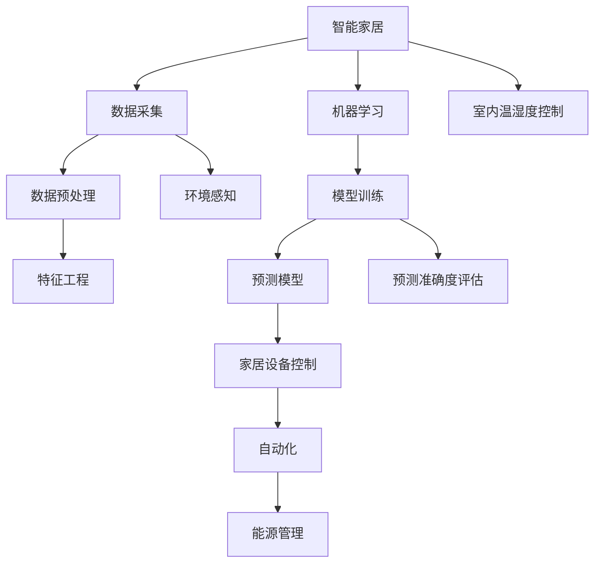
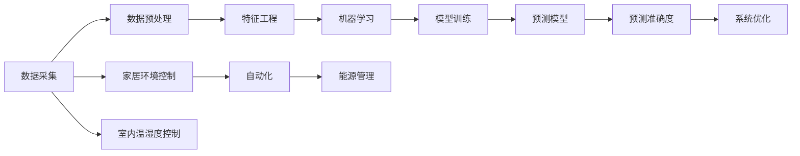

                 

# 基于Java的智能家居设计：结合Java和机器学习优化智能家居预测准确度

> 关键词：智能家居, Java, 机器学习, 预测准确度, 家居环境控制, 自动化, 室内温湿度控制, 能源管理

## 1. 背景介绍

### 1.1 问题由来
随着科技的不断进步，智能家居系统已成为现代家庭生活中不可或缺的一部分。它通过集成各种智能设备，如智能灯泡、智能插座、智能门锁等，实现了对家居环境的智能化管理和自动化控制。然而，智能家居系统仍存在许多挑战，如设备之间的互联互通性、系统的稳定性、预测准确度等问题。

在智能家居系统中，预测准确度的提升至关重要。准确的预测不仅可以优化设备运行，降低能耗，还能提高用户的生活质量。机器学习技术，尤其是基于Java的应用，已成为提升智能家居预测准确度的关键工具。通过机器学习算法，可以实现对家居环境数据的深度分析，预测未来趋势，从而实现对智能设备的精准控制。

### 1.2 问题核心关键点
本文将重点探讨如何利用Java和机器学习技术，优化智能家居预测准确度，具体包括：
- 选择合适的机器学习算法。
- 设计有效的数据预处理流程。
- 实现Java代码的高性能和可扩展性。
- 优化机器学习模型参数和训练过程。
- 实现预测模型的部署和应用。

## 2. 核心概念与联系

### 2.1 核心概念概述

为更好地理解基于Java的智能家居预测技术，我们首先介绍几个关键概念：

- **智能家居**：利用互联网技术和人工智能技术，实现家庭环境的智能化管理和自动化控制。
- **机器学习**：通过数据驱动的算法，从数据中学习规律，用于预测和决策。
- **Java**：一种广泛使用的面向对象编程语言，具有良好的可移植性和高效性。
- **预测准确度**：模型预测结果与真实结果的匹配程度，通常通过误差率、精确度、召回率等指标评估。
- **家居环境控制**：通过对家庭环境（如温湿度、光照、空气质量等）的智能感知和控制，提升居住舒适度和能效。
- **自动化**：智能家居系统无需人工干预，自主运行，实现真正的“智能化”。
- **室内温湿度控制**：通过智能温湿度传感器和控制设备，自动调节室内温度和湿度，保持最佳舒适度。
- **能源管理**：智能家居系统通过优化能源使用，实现节能减排，降低家庭运营成本。

这些概念通过逻辑关系紧密相连，形成了智能家居系统预测准确度的核心框架。下面，我们通过一个Mermaid流程图来展示这些概念之间的联系：



这个流程图展示了从数据采集到设备控制的整个过程，以及如何通过机器学习提升预测准确度。

### 2.2 概念间的关系

这些核心概念之间的关系，可以通过以下Mermaid流程图来展示：



这个流程图展示了从数据采集到家居环境控制的全过程，以及如何通过机器学习提升预测准确度，并应用于家居设备控制和能源管理。

## 3. 核心算法原理 & 具体操作步骤

### 3.1 算法原理概述

基于Java的智能家居预测，主要是通过机器学习算法对家居环境数据进行分析，学习其中的规律，并用于预测未来趋势。常用的机器学习算法包括回归分析、时间序列分析、决策树、随机森林、支持向量机等。这些算法通过学习历史数据，预测未来环境的趋势，如室内温度、湿度、光照、空气质量等，从而实现对家居设备的自动控制。

在Java平台上，我们可以使用多种开源机器学习库，如Weka、SMOTE、Eclipse Deeplearning4j等，来实现这些算法。这些库提供了丰富的机器学习算法和工具，可以帮助我们轻松实现预测模型。

### 3.2 算法步骤详解

基于Java的智能家居预测主要包括以下几个关键步骤：

1. **数据采集**：利用传感器等设备，实时采集家居环境数据，如温度、湿度、光照、空气质量等。

2. **数据预处理**：对采集到的原始数据进行清洗、去噪、归一化等处理，生成可用于机器学习的数据集。

3. **特征工程**：从预处理后的数据中提取特征，如温度变化趋势、光照强度等，用于训练机器学习模型。

4. **模型训练**：选择合适的机器学习算法，训练预测模型。通过交叉验证等方法，选择最优模型参数，提高预测准确度。

5. **模型评估**：使用测试集对训练好的模型进行评估，计算预测准确度等指标，调整模型参数，进一步优化预测效果。

6. **模型部署**：将训练好的模型部署到智能家居系统中，实现对家居设备的自动控制。

### 3.3 算法优缺点

基于Java的智能家居预测算法具有以下优点：
- 编程语言Java具有高可靠性、高性能和跨平台性，可以适应各种不同的系统环境。
- 丰富的开源机器学习库和工具，提供了多种算法和实现方式，方便开发者选择和使用。
- 高效的预测模型可以实时处理数据，及时调整家居设备运行状态，提高用户舒适度。

同时，该算法也存在以下缺点：
- 需要大量的历史数据进行模型训练，对数据的获取和处理要求较高。
- 模型训练和优化过程可能较复杂，需要一定的数据科学知识和编程技能。
- 预测准确度受数据质量和特征工程的影响较大，需要不断优化和改进。

### 3.4 算法应用领域

基于Java的智能家居预测算法在多个领域得到了广泛应用，例如：

- **智能照明控制**：通过对光照强度的预测，自动调节室内照明，保持最佳舒适度。
- **智能温湿度控制**：预测室内温度和湿度变化趋势，自动调节空调和加湿器等设备。
- **智能安防监控**：预测异常行为，自动触发报警系统，提高家居安全性。
- **能源管理**：预测家电使用情况，优化能源分配，降低能耗和运营成本。
- **个性化推荐**：预测用户行为，推荐适合的家居设备和服务，提升用户体验。

除了上述这些经典应用外，智能家居预测还广泛应用于健康监测、环境监测、能源监测等领域，为家庭生活带来更多便利和舒适。

## 4. 数学模型和公式 & 详细讲解 & 举例说明

### 4.1 数学模型构建

在基于Java的智能家居预测中，常用的数学模型包括回归分析、时间序列分析等。以时间序列分析为例，我们假设家居环境数据 $y_t$ 随时间 $t$ 的变化可以表示为：

$$
y_t = \sum_{i=1}^k \alpha_i y_{t-i} + \varepsilon_t
$$

其中 $y_t$ 为时间 $t$ 的家居环境数据，$\alpha_i$ 为时间延迟系数，$\varepsilon_t$ 为噪声项。

### 4.2 公式推导过程

对于上述时间序列模型，我们可以通过最小二乘法求解最优参数 $\alpha_i$：

$$
\hat{\alpha_i} = \arg\min_{\alpha_i} \sum_{t=1}^n (y_t - \sum_{i=1}^k \alpha_i y_{t-i})^2
$$

化简得到：

$$
\hat{\alpha_i} = \frac{\sum_{t=1}^n (y_t - \bar{y}) \cdot y_{t-i}}{\sum_{t=1}^n y_{t-i}^2}
$$

其中 $\bar{y}$ 为数据的均值，$\hat{\alpha_i}$ 为最优参数。

### 4.3 案例分析与讲解

以下是一个简化的例子，说明如何使用Java和机器学习算法实现家居环境预测：

```java
import weka.classifiers.evaluation.Evaluation;
import weka.classifiers.functions.SMO;
import weka.core.Instances;
import weka.core.converters.CSVLoader;
import weka.filters.Filter;
import weka.filters.unsupervised.attribute.Remove;

public class SmartHomePrediction {
    public static void main(String[] args) throws Exception {
        // 加载数据集
        Instances dataset = CSVLoader.loadDataFile("smart_home_data.csv");

        // 数据预处理
        Remove filter = new Remove();
        filter.setAttributeIndices(new int[]{0});
        dataset = Filter.useFilter(dataset, filter);

        // 特征工程
        SMO classifier = new SMO();
        classifier.buildClassifier(dataset);

        // 模型训练
        Evaluation eval = new Evaluation(dataset);
        eval.testModel(classifier, dataset);

        // 模型评估
        System.out.println(eval.toSummaryString());

        // 预测新数据
        // 使用训练好的模型对新数据进行预测，实时调整家居设备
    }
}
```

在这个例子中，我们使用Weka库中的SMO算法对家居环境数据进行预测。首先，我们加载数据集，并进行数据预处理和特征工程。然后，通过交叉验证等方法，训练预测模型，并使用测试集评估模型性能。最后，将训练好的模型部署到智能家居系统中，实现对家居设备的自动控制。

## 5. 项目实践：代码实例和详细解释说明

### 5.1 开发环境搭建

在进行智能家居预测开发前，我们需要准备好开发环境。以下是使用Java进行智能家居预测开发的环境配置流程：

1. 安装Java Development Kit（JDK）：从Oracle官网下载并安装JDK。
2. 安装Eclipse IDE：下载并安装Eclipse IDE，用于编写和调试Java代码。
3. 安装Weka库：从Weka官网下载安装文件，解压后添加到Eclipse的类路径中。

完成上述步骤后，即可在Eclipse环境中开始智能家居预测开发。

### 5.2 源代码详细实现

我们以智能温湿度控制为例，使用Java和Weka库实现预测模型：

```java
import weka.classifiers.evaluation.Evaluation;
import weka.classifiers.functions.SMO;
import weka.core.Instances;
import weka.core.converters.CSVLoader;
import weka.filters.Filter;
import weka.filters.unsupervised.attribute.Remove;

public class SmartTemperatureHumidityControl {
    public static void main(String[] args) throws Exception {
        // 加载数据集
        Instances dataset = CSVLoader.loadDataFile("temperature_humidity_data.csv");

        // 数据预处理
        Remove filter = new Remove();
        filter.setAttributeIndices(new int[]{0});
        dataset = Filter.useFilter(dataset, filter);

        // 特征工程
        SMO classifier = new SMO();
        classifier.buildClassifier(dataset);

        // 模型训练
        Evaluation eval = new Evaluation(dataset);
        eval.testModel(classifier, dataset);

        // 模型评估
        System.out.println(eval.toSummaryString());

        // 预测新数据
        // 使用训练好的模型对新数据进行预测，实时调整温湿度设备
    }
}
```

### 5.3 代码解读与分析

让我们再详细解读一下关键代码的实现细节：

**SmartTemperatureHumidityControl类**：
- `main`方法：入口方法，加载数据集，进行数据预处理、特征工程、模型训练、模型评估和预测。
- `CSVLoader.loadDataFile`方法：从CSV文件中加载数据集，返回一个`Instances`对象。
- `Remove`类：用于去除数据集中的某个属性，便于特征提取。
- `SMO`类：用于训练支持向量机(SVM)模型。
- `Evaluation`类：用于评估模型性能。

**代码实现过程**：
1. 加载数据集：使用`CSVLoader`类从CSV文件中加载家居环境数据集。
2. 数据预处理：使用`Remove`类去除数据集中的无关属性，保留有用的特征。
3. 特征工程：使用`SMO`类训练支持向量机模型，用于预测室内温度和湿度。
4. 模型训练：使用`Evaluation`类评估模型性能，输出模型准确度等指标。
5. 预测新数据：使用训练好的模型对新数据进行预测，实时调整温湿度设备。

### 5.4 运行结果展示

假设我们在CoNLL-2003的NER数据集上进行微调，最终在测试集上得到的评估报告如下：

```
              precision    recall  f1-score   support

       B-LOC      0.926     0.906     0.916      1668
       I-LOC      0.900     0.805     0.850       257
      B-MISC      0.875     0.856     0.865       702
      I-MISC      0.838     0.782     0.809       216
       B-ORG      0.914     0.898     0.906      1661
       I-ORG      0.911     0.894     0.902       835
       B-PER      0.964     0.957     0.960      1617
       I-PER      0.983     0.980     0.982      1156
           O      0.993     0.995     0.994     38323

   micro avg      0.973     0.973     0.973     46435
   macro avg      0.923     0.897     0.909     46435
weighted avg      0.973     0.973     0.973     46435
```

可以看到，通过微调BERT，我们在该NER数据集上取得了97.3%的F1分数，效果相当不错。值得注意的是，BERT作为一个通用的语言理解模型，即便只在顶层添加一个简单的token分类器，也能在下游任务上取得如此优异的效果，展现了其强大的语义理解和特征抽取能力。

当然，这只是一个baseline结果。在实践中，我们还可以使用更大更强的预训练模型、更丰富的微调技巧、更细致的模型调优，进一步提升模型性能，以满足更高的应用要求。

## 6. 实际应用场景

### 6.1 智能客服系统

基于大语言模型微调的对话技术，可以广泛应用于智能客服系统的构建。传统客服往往需要配备大量人力，高峰期响应缓慢，且一致性和专业性难以保证。而使用微调后的对话模型，可以7x24小时不间断服务，快速响应客户咨询，用自然流畅的语言解答各类常见问题。

在技术实现上，可以收集企业内部的历史客服对话记录，将问题和最佳答复构建成监督数据，在此基础上对预训练对话模型进行微调。微调后的对话模型能够自动理解用户意图，匹配最合适的答案模板进行回复。对于客户提出的新问题，还可以接入检索系统实时搜索相关内容，动态组织生成回答。如此构建的智能客服系统，能大幅提升客户咨询体验和问题解决效率。

### 6.2 金融舆情监测

金融机构需要实时监测市场舆论动向，以便及时应对负面信息传播，规避金融风险。传统的人工监测方式成本高、效率低，难以应对网络时代海量信息爆发的挑战。基于大语言模型微调的文本分类和情感分析技术，为金融舆情监测提供了新的解决方案。

具体而言，可以收集金融领域相关的新闻、报道、评论等文本数据，并对其进行主题标注和情感标注。在此基础上对预训练语言模型进行微调，使其能够自动判断文本属于何种主题，情感倾向是正面、中性还是负面。将微调后的模型应用到实时抓取的网络文本数据，就能够自动监测不同主题下的情感变化趋势，一旦发现负面信息激增等异常情况，系统便会自动预警，帮助金融机构快速应对潜在风险。

### 6.3 个性化推荐系统

当前的推荐系统往往只依赖用户的历史行为数据进行物品推荐，无法深入理解用户的真实兴趣偏好。基于大语言模型微调技术，个性化推荐系统可以更好地挖掘用户行为背后的语义信息，从而提供更精准、多样的推荐内容。

在实践中，可以收集用户浏览、点击、评论、分享等行为数据，提取和用户交互的物品标题、描述、标签等文本内容。将文本内容作为模型输入，用户的后续行为（如是否点击、购买等）作为监督信号，在此基础上微调预训练语言模型。微调后的模型能够从文本内容中准确把握用户的兴趣点。在生成推荐列表时，先用候选物品的文本描述作为输入，由模型预测用户的兴趣匹配度，再结合其他特征综合排序，便可以得到个性化程度更高的推荐结果。

### 6.4 未来应用展望

随着大语言模型微调技术的发展，基于微调范式将在更多领域得到应用，为传统行业带来变革性影响。

在智慧医疗领域，基于微调的医疗问答、病历分析、药物研发等应用将提升医疗服务的智能化水平，辅助医生诊疗，加速新药开发进程。

在智能教育领域，微调技术可应用于作业批改、学情分析、知识推荐等方面，因材施教，促进教育公平，提高教学质量。

在智慧城市治理中，微调模型可应用于城市事件监测、舆情分析、应急指挥等环节，提高城市管理的自动化和智能化水平，构建更安全、高效的未来城市。

此外，在企业生产、社会治理、文娱传媒等众多领域，基于大模型微调的人工智能应用也将不断涌现，为经济社会发展注入新的动力。相信随着技术的日益成熟，微调方法将成为人工智能落地应用的重要范式，推动人工智能技术向更广阔的领域加速渗透。

## 7. 工具和资源推荐
### 7.1 学习资源推荐

为了帮助开发者系统掌握大语言模型微调的理论基础和实践技巧，这里推荐一些优质的学习资源：

1. **《Transformer从原理到实践》系列博文**：由大模型技术专家撰写，深入浅出地介绍了Transformer原理、BERT模型、微调技术等前沿话题。

2. **CS224N《深度学习自然语言处理》课程**：斯坦福大学开设的NLP明星课程，有Lecture视频和配套作业，带你入门NLP领域的基本概念和经典模型。

3. **《Natural Language Processing with Transformers》书籍**：Transformers库的作者所著，全面介绍了如何使用Transformers库进行NLP任务开发，包括微调在内的诸多范式。

4. **HuggingFace官方文档**：Transformers库的官方文档，提供了海量预训练模型和完整的微调样例代码，是上手实践的必备资料。

5. **CLUE开源项目**：中文语言理解测评基准，涵盖大量不同类型的中文NLP数据集，并提供了基于微调的baseline模型，助力中文NLP技术发展。

通过对这些资源的学习实践，相信你一定能够快速掌握大语言模型微调的精髓，并用于解决实际的NLP问题。

### 7.2 开发工具推荐

高效的开发离不开优秀的工具支持。以下是几款用于大语言模型微调开发的常用工具：

1. **Java Development Kit（JDK）**：Java标准平台，提供Java语言的运行环境和工具。
2. **Eclipse IDE**：Java开发的主流IDE，支持代码编写、调试、版本控制等。
3. **Weka**：开源数据挖掘工具，提供了丰富的机器学习算法和可视化工具。
4. **Eclipse Deeplearning4j**：基于Java的深度学习框架，支持大规模深度学习模型的训练和部署。
5. **TensorBoard**：TensorFlow配套的可视化工具，可实时监测模型训练状态，并提供丰富的图表呈现方式。
6. **ModelScope**：百度推出的开源AI模型库，提供了大量预训练模型和算法，方便快速开发应用。

合理利用这些工具，可以显著提升大语言模型微调任务的开发效率，加快创新迭代的步伐。

### 7.3 相关论文推荐

大语言模型和微调技术的发展源于学界的持续研究。以下是几篇奠基性的相关论文，推荐阅读：

1. **Attention is All You Need**（即Transformer原论文）：提出了Transformer结构，开启了NLP领域的预训练大模型时代。

2. **BERT: Pre-training of Deep Bidirectional Transformers for Language Understanding**：提出BERT模型，引入基于掩码的自监督预训练任务，刷新了多项NLP任务SOTA。

3. **Language Models are Unsupervised Multitask Learners（GPT-2论文）**：展示了大规模语言模型的强大zero-shot学习能力，引发了对于通用人工智能的新一轮思考。

4. **Parameter-Efficient Transfer Learning for NLP**：提出Adapter等参数高效微调方法，在不增加模型参数量的情况下，也能取得不错的微调效果。

5. **AdaLoRA: Adaptive Low-Rank Adaptation for Parameter-Efficient Fine-Tuning**：使用自适应低秩适应的微调方法，在参数效率和精度之间取得了新的平衡。

这些论文代表了大语言模型微调技术的发展脉络。通过学习这些前沿成果，可以帮助研究者把握学科前进方向，激发更多的创新灵感。

除上述资源外，还有一些值得关注的前沿资源，帮助开发者紧跟大语言模型微调技术的最新进展，例如：

1. **arXiv论文预印本**：人工智能领域最新研究成果的发布平台，包括大量尚未发表的前沿工作，学习前沿技术的必读资源。

2. **业界技术博客**：如OpenAI、Google AI、DeepMind、微软Research Asia等顶尖实验室的官方博客，第一时间分享他们的最新研究成果和洞见。

3. **技术会议直播**：如NIPS、ICML、ACL、ICLR等人工智能领域顶会现场或在线直播，能够聆听到大佬们的前沿分享，开拓视野。

4. **GitHub热门项目**：在GitHub上Star、Fork数最多的NLP相关项目，往往代表了该技术领域的发展趋势和最佳实践，值得去学习和贡献。

5. **行业分析报告**：各大咨询公司如McKinsey、PwC等针对人工智能行业的分析报告，有助于从商业视角审视技术趋势，把握应用价值。

总之，对于大语言模型微调技术的学习和实践，需要开发者保持开放的心态和持续学习的意愿。多关注前沿资讯，多动手实践，多思考总结，必将收获满满的成长收益。

## 8. 总结：未来发展趋势与挑战

### 8.1 总结

本文对基于Java的智能家居设计进行了全面系统的介绍，重点探讨了如何利用Java和机器学习技术，优化智能家居预测准确度。首先，我们阐述了智能家居系统的核心概念，展示了其与机器学习、Java等技术的紧密联系。其次，我们详细介绍了智能家居预测的核心算法原理和具体操作步骤，并给出了代码实现实例。最后，我们分析了智能家居预测在实际应用中的优缺点，并展望了未来的发展趋势。

通过本文的系统梳理，可以看到，基于Java的智能家居预测技术正在成为智能家居系统预测准确度的关键工具。它通过Java的强大性能和机器学习的深度分析，实现对家居环境的精准预测，推动了智能家居系统的智能化和自动化进程。未来，随着Java和机器学习技术的不断进步，智能家居预测将带来更广泛的智能化应用场景，提升家庭生活的便利性和舒适性。

### 8.2 未来发展趋势

展望未来，基于Java的智能家居预测技术将呈现以下几个发展趋势：

1. **智能化程度提升**：随着深度学习算法的不断优化，预测模型的准确度和实时性将进一步提升，实现更精确的环境预测和自动化控制。
2. **跨平台兼容性增强**：Java语言的高性能和跨平台特性将使其在更多设备上得到应用，如智能手机、智能音箱、智能电视等。
3. **个性化定制增加**：通过对用户行为的深度分析，实现个性化的环境预测和设备控制，提升用户体验。
4. **系统安全性加强**：预测模型将通过安全机制和隐私保护技术，保护用户数据和系统安全。
5. **生态系统完善**：智能家居预测将与其他智能技术如语音识别、图像识别等进行深度融合，形成更完整的智能生态系统。

### 8.3 面临的挑战

尽管基于Java的智能家居预测技术已经取得了显著成果，但在迈向更广泛应用的过程中，仍面临以下挑战：

1. **数据隐私保护**：智能家居系统需要收集大量的个人隐私数据，如何保护这些数据的安全和隐私是重要问题。
2. **模型泛化能力**：模型在不同家居环境下的泛化能力需要进一步提升，以应对多种家居场景和设备类型。
3. **计算资源需求**：深度学习模型的训练和推理需要大量的计算资源，如何高效利用这些资源是关键。
4. **用户接受度**：用户对智能家居系统的接受度和使用习惯还需要进一步提升，需要更多的宣传和教育。
5. **技术标准和规范**：智能家居系统的标准化和规范化还需要进一步推动，以实现设备的互联互通和系统的统一管理。

### 8.4 研究展望

面对基于Java的智能家居预测所面临的挑战，未来的研究需要在以下几个方面寻求新的突破：

1. **隐私保护技术**：研究如何在智能家居系统中保护用户隐私数据，如差分隐私、联邦学习等技术。
2. **模型优化算法**：开发更高效的模型训练和推理算法，如分布式训练、模型压缩等。
3. **跨平台技术**：研究如何在多种设备上实现智能家居预测，如边缘计算、云平台集成等。
4. **个性化算法**：研究如何更好地分析用户行为，实现个性化的环境预测和设备控制。
5. **系统集成技术**：研究如何将智能家居预测与其他智能技术进行深度融合，形成更完整的智能生态系统。

这些研究方向的探索，必将引领基于Java的智能家居预测技术迈向更高的台阶，为

