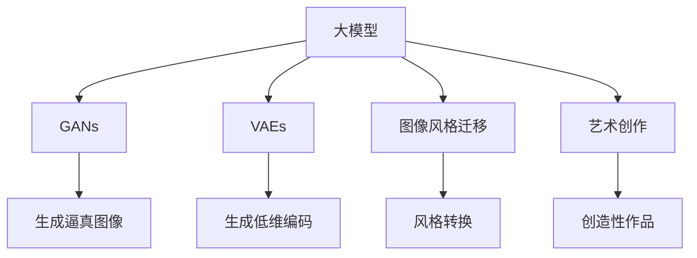
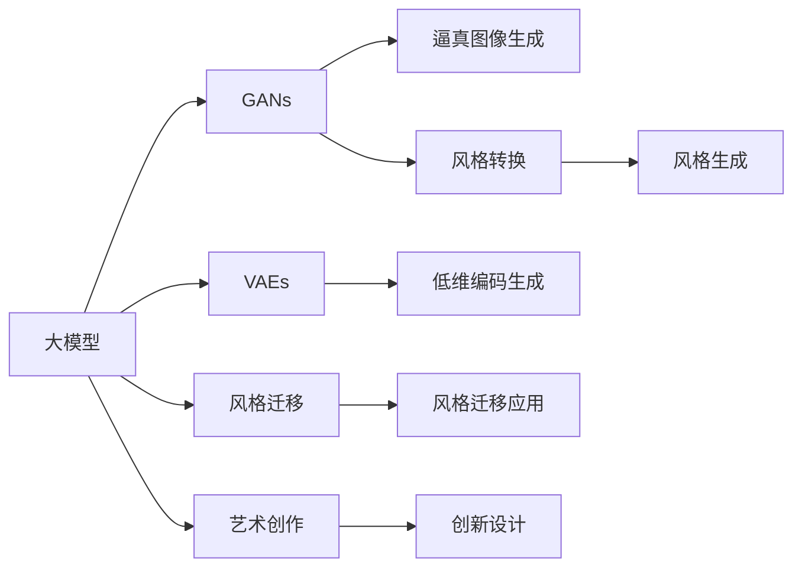

                 

# 大模型与AI辅助艺术创作：从模仿到创新

> 关键词：大模型, AI辅助艺术创作, 深度学习, 生成对抗网络, 图像风格迁移, 艺术创作, 生成模型, 深度学习框架, PyTorch, TensorFlow

## 1. 背景介绍

### 1.1 问题由来
在过去的几年中，深度学习技术取得了惊人的进步，尤其是在计算机视觉和自然语言处理领域。其中，深度生成模型已经展示了强大的能力，能够生成高质量的图像、文本和音频。近年来，大模型（如GPT-3, DALL-E, CLIP等）的崛起，将AI的创造能力进一步扩展到了艺术创作领域。

AI辅助艺术创作的概念并非新鲜，从最初基于规则的图形设计到后来的计算机艺术，都展示了AI在艺术创作方面的潜力。但直到深度学习技术的发展，特别是生成对抗网络（GANs）和变分自编码器（VAEs）的出现，AI辅助艺术创作才真正进入了飞速发展的阶段。

大模型通过大规模无标签数据的自监督学习，学习到了广泛的特征和语义表示，能够生成与现实世界相似但完全虚构的内容。这些模型不仅在生成高质量图像、文本和音频方面表现出色，还可以应用于艺术创作，从模仿到创新，展示了无限的可能性。

### 1.2 问题核心关键点
AI辅助艺术创作的核心关键点在于如何将深度学习技术应用于艺术创作的过程。具体而言：

- **模型选择**：选择适合的生成模型，如GANs、VAEs、自回归模型等。
- **数据集准备**：收集和处理高质量的艺术作品数据集，用于模型的训练和测试。
- **模型训练**：在艺术创作数据集上训练生成模型，优化参数，提高生成质量。
- **创作过程**：设计创作流程，利用训练好的模型生成新的艺术作品。
- **创新设计**：在模仿的基础上，设计新的创作任务，如风格迁移、风格生成、艺术作品优化等。

本文将系统地探讨AI辅助艺术创作的理论和实践，重点关注大模型在艺术创作中的应用，从模仿到创新，带领读者深入理解这一领域的现状与未来。

### 1.3 问题研究意义
AI辅助艺术创作的研究不仅具有重要的学术价值，还具有广泛的应用前景。具体意义包括：

- **艺术创作效率提升**：AI可以快速生成大量艺术作品，极大地提升艺术创作的效率。
- **艺术创作多样性**：AI能够创造出多种风格和形式的艺术作品，丰富艺术创作的内容和形式。
- **艺术教育与培训**：AI可以用于艺术教育，帮助艺术家掌握新技术，提高创作水平。
- **艺术鉴赏与分析**：AI可以分析艺术作品，提供深度鉴赏和分析，提升艺术作品的价值。
- **跨领域创新**：AI可以应用于多个领域，如游戏设计、虚拟现实、建筑设计等，推动各领域创新发展。

因此，研究AI辅助艺术创作的方法和技术，对于推动艺术与科技的融合，提高艺术创作的质量和效率，具有重要的实际意义。

## 2. 核心概念与联系

### 2.1 核心概念概述

为了更好地理解AI辅助艺术创作的过程，我们先介绍几个关键概念：

- **大模型**：指通过大规模数据训练得到的深度学习模型，如GPT-3、DALL-E等。
- **生成对抗网络（GANs）**：一种由生成器和判别器组成的深度学习模型，能够生成逼真的图像和视频。
- **变分自编码器（VAEs）**：一种能够生成低维编码和高质量生成样本的自编码器，广泛应用于图像生成和特征学习。
- **图像风格迁移**：将一种图像的风格应用于另一种图像，生成风格转换后的图像。
- **艺术创作**：指通过创造性思维，使用各种工具和技术生成新的艺术作品。

这些概念构成了AI辅助艺术创作的基石，通过它们的相互作用和组合，可以生成各种风格和形式的艺术作品。

### 2.2 概念间的关系

以下是一个简单的Mermaid流程图，展示了这些核心概念之间的关系：



这个流程图展示了各个概念之间的联系：

1. 大模型可以作为GANs和VAEs的初始化参数，用于生成高质量的图像和视频。
2. 图像风格迁移可以利用GANs和VAEs实现，将一种图像的风格应用于另一种图像。
3. 艺术创作可以利用GANs和VAEs生成各种风格的艺术作品。
4. 生成对抗网络可以生成逼真的图像，变分自编码器可以生成高质量的低维编码，两者都可以用于艺术创作和风格迁移。
5. 艺术创作过程不仅包括模仿已有风格，还包括创新设计新的风格和形式。

这些概念共同构成了AI辅助艺术创作的完整生态系统，使得模型能够从模仿到创新，创作出新颖独特的艺术作品。

### 2.3 核心概念的整体架构

为了更好地展示这些概念的整体架构，我们可以使用一个综合的流程图：



这个流程图展示了从大模型的预训练到艺术创作的全过程，从生成逼真图像、低维编码到风格迁移和生成，最终应用于艺术创作和创新设计。

## 3. 核心算法原理 & 具体操作步骤

### 3.1 算法原理概述

AI辅助艺术创作的核心算法原理基于深度生成模型，特别是GANs和VAEs。这些模型通过自监督学习，学习到数据分布的特征表示，并能够在生成空间中生成高质量的样本。具体而言：

- **GANs**：通过训练一个生成器（Generator）和一个判别器（Discriminator），使得生成器能够生成逼真的样本，判别器能够区分真实样本和生成样本。
- **VAEs**：通过学习数据分布的低维表示，生成高质量的编码和解码样本，同时具有变分推断能力。

在艺术创作中，GANs和VAEs可以应用于以下几个方面：

- **生成逼真图像**：通过训练GANs，生成高质量的艺术图像。
- **生成低维编码**：通过VAEs，生成高质量的低维编码，用于艺术创作和风格迁移。
- **风格迁移**：通过GANs或VAEs，将一种图像的风格应用于另一种图像。
- **艺术创作**：通过GANs或VAEs，生成各种风格和形式的艺术作品。

### 3.2 算法步骤详解

下面详细介绍AI辅助艺术创作的具体操作步骤：

**Step 1: 准备数据集**

1. 收集高质量的艺术作品数据集，包括绘画、雕塑、摄影等。
2. 对数据进行预处理，如裁剪、归一化、去噪等。

**Step 2: 选择模型**

1. 根据艺术创作需求，选择合适的生成模型，如GANs、VAEs等。
2. 使用预训练模型或在大模型上进行微调，获得更好的生成效果。

**Step 3: 模型训练**

1. 将数据集划分为训练集、验证集和测试集。
2. 在训练集上训练生成模型，优化参数，提高生成质量。
3. 在验证集上评估模型性能，调整参数，避免过拟合。
4. 在测试集上测试模型性能，确保模型稳定。

**Step 4: 艺术创作**

1. 设计创作流程，包括创作任务和创作工具。
2. 利用训练好的生成模型生成艺术作品，根据创作流程进行创作。
3. 对创作结果进行评估，优化创作流程和模型参数。

**Step 5: 创新设计**

1. 根据创作经验，设计新的创作任务，如风格迁移、风格生成等。
2. 利用训练好的模型生成新的艺术作品，进行创新设计。
3. 对创新设计结果进行评估，优化创作任务和模型参数。

### 3.3 算法优缺点

**优点：**

- **高效生成**：大模型能够快速生成大量高质量的艺术作品，极大地提升创作效率。
- **多样化**：模型可以生成各种风格和形式的艺术作品，丰富创作内容。
- **创新设计**：基于已有模型，可以设计新的创作任务，推动艺术创作的发展。

**缺点：**

- **数据需求高**：高质量艺术作品数据集难以获取，限制了模型的应用范围。
- **生成质量不稳定**：生成质量受数据和模型参数影响，有时会出现质量不稳定的现象。
- **创作过程复杂**：创作过程需要精心设计，有时需要反复迭代优化。

### 3.4 算法应用领域

AI辅助艺术创作的应用领域非常广泛，包括：

- **游戏设计**：生成逼真的游戏场景、角色和物品，提高游戏体验。
- **虚拟现实**：生成逼真的虚拟环境，提升用户的沉浸感。
- **建筑设计**：生成逼真的建筑和景观设计，帮助建筑师进行创作。
- **艺术教育**：帮助艺术家掌握新技术，提高创作水平。
- **艺术鉴赏**：分析艺术作品，提供深度鉴赏和分析，提升艺术作品的价值。

这些应用领域展示了AI辅助艺术创作的广阔前景，具有巨大的应用潜力和经济价值。

## 4. 数学模型和公式 & 详细讲解 & 举例说明

### 4.1 数学模型构建

在AI辅助艺术创作中，数学模型主要应用于GANs和VAEs的训练和优化。以下是GANs和VAEs的基本数学模型：

**GANs**：

- **生成器（Generator）**：将随机噪声$\mathbf{z}$映射为生成样本$\mathbf{x}$。
  $$
  G: \mathbf{z} \rightarrow \mathbf{x}
  $$
- **判别器（Discriminator）**：判别样本$\mathbf{x}$是真实样本还是生成样本。
  $$
  D: \mathbf{x} \rightarrow \mathbf{y}
  $$
- **联合训练**：通过交替训练生成器和判别器，使得生成器能够生成逼真的样本，判别器能够区分真实样本和生成样本。
  $$
  \min_{G} \max_{D} \mathcal{L}(D(G(\mathbf{z})), \mathbf{y}=\text{True}), \mathcal{L}(D(\mathbf{x}), \mathbf{y}=\text{False})
  $$

**VAEs**：

- **编码器（Encoder）**：将样本$\mathbf{x}$映射为低维编码$\mathbf{z}$。
  $$
  E: \mathbf{x} \rightarrow \mathbf{z}
  $$
- **解码器（Decoder）**：将低维编码$\mathbf{z}$映射为生成样本$\mathbf{x'}$。
  $$
  D: \mathbf{z} \rightarrow \mathbf{x'}
  $$
- **联合训练**：通过最大化数据似然，最小化编码器-解码器重构误差，优化模型参数。
  $$
  \min_{E, D} \mathcal{L}(D(E(\mathbf{x})), \mathbf{x}), \mathcal{L}(E(\mathbf{x}), \mathbf{z}), \mathcal{L}(D(\mathbf{z}), \mathbf{z'})
  $$

### 4.2 公式推导过程

以下是对GANs和VAEs的公式推导过程：

**GANs公式推导**：

1. 生成器损失函数：
  $$
  \mathcal{L}_G = \mathbb{E}_{\mathbf{z}} \left[ \log D(G(\mathbf{z})) \right] + \lambda \mathbb{E}_{\mathbf{x}} \left[ ||\nabla_{\mathbf{x}} D(G(\mathbf{z}))||^2 \right]
  $$
  其中，$\lambda$为梯度惩罚系数。

2. 判别器损失函数：
  $$
  \mathcal{L}_D = -\mathbb{E}_{\mathbf{x}} \left[ \log D(\mathbf{x}) \right] - \mathbb{E}_{\mathbf{z}} \left[ \log (1 - D(G(\mathbf{z}))) \right]
  $$

3. 联合训练损失函数：
  $$
  \mathcal{L} = \mathcal{L}_G + \mathcal{L}_D
  $$

**VAEs公式推导**：

1. 编码器损失函数：
  $$
  \mathcal{L}_E = \mathbb{E}_{\mathbf{x}} \left[ -\log p(\mathbf{x}|E(\mathbf{x})) \right]
  $$

2. 解码器损失函数：
  $$
  \mathcal{L}_D = \mathbb{E}_{\mathbf{z}} \left[ -\log p(E(\mathbf{z})) \right] + \mathbb{E}_{\mathbf{x}} \left[ ||\mathbf{x} - E(D(\mathbf{z}))||^2 \right]
  $$

3. 联合训练损失函数：
  $$
  \mathcal{L} = \mathcal{L}_E + \mathcal{L}_D
  $$

### 4.3 案例分析与讲解

下面以一个具体的案例来说明GANs和VAEs在艺术创作中的应用：

**案例：艺术风格迁移**

1. **数据准备**：收集两组艺术作品，一组为名画，一组为现代抽象艺术。
2. **模型选择**：使用GANs作为生成模型，VAEs作为编码器。
3. **模型训练**：在名画上训练GANs，在现代抽象艺术上训练VAEs。
4. **风格迁移**：将现代抽象艺术作为生成器输入，将名画作为VAEs的低维编码输入，生成风格转换后的图像。
5. **评估与优化**：评估生成的图像质量，优化模型参数和创作流程。

通过这个案例，可以看到GANs和VAEs在艺术风格迁移中的应用，以及模型训练和风格迁移的具体步骤。

## 5. 项目实践：代码实例和详细解释说明

### 5.1 开发环境搭建

要进行AI辅助艺术创作，需要搭建一个支持深度学习的开发环境。以下是Python环境配置的步骤：

1. 安装Anaconda：从官网下载并安装Anaconda，用于创建独立的Python环境。

2. 创建并激活虚拟环境：
```bash
conda create -n pytorch-env python=3.8 
conda activate pytorch-env
```

3. 安装PyTorch：根据CUDA版本，从官网获取对应的安装命令。例如：
```bash
conda install pytorch torchvision torchaudio cudatoolkit=11.1 -c pytorch -c conda-forge
```

4. 安装TensorFlow：
```bash
pip install tensorflow
```

5. 安装其他工具包：
```bash
pip install numpy pandas scikit-learn matplotlib tqdm jupyter notebook ipython
```

完成上述步骤后，即可在`pytorch-env`环境中进行深度学习开发。

### 5.2 源代码详细实现

下面以GANs在艺术创作中的应用为例，给出PyTorch代码实现。

**1. 导入相关库：**
```python
import torch
import torch.nn as nn
import torch.optim as optim
import torchvision.transforms as transforms
from torchvision.datasets import MNIST
from torchvision.utils import save_image
from torchvision.utils import make_grid
from torch.utils.data import DataLoader
```

**2. 定义生成器和判别器：**
```python
class Generator(nn.Module):
    def __init__(self):
        super(Generator, self).__init__()
        self.main = nn.Sequential(
            nn.Linear(100, 256),
            nn.ReLU(True),
            nn.Linear(256, 512),
            nn.ReLU(True),
            nn.Linear(512, 1024),
            nn.ReLU(True),
            nn.Linear(1024, 784),
            nn.Tanh()
        )

    def forward(self, input):
        return self.main(input)
```

**3. 定义判别器：**
```python
class Discriminator(nn.Module):
    def __init__(self):
        super(Discriminator, self).__init__()
        self.main = nn.Sequential(
            nn.Linear(784, 1024),
            nn.LeakyReLU(0.2, inplace=True),
            nn.Linear(1024, 512),
            nn.LeakyReLU(0.2, inplace=True),
            nn.Linear(512, 1),
            nn.Sigmoid()
        )

    def forward(self, input):
        return self.main(input)
```

**4. 定义损失函数：**
```python
class Loss(nn.Module):
    def __init__(self):
        super(Loss, self).__init__()
        self.loss_fn = nn.BCELoss()

    def forward(self, output, target):
        return self.loss_fn(output, target)
```

**5. 定义训练函数：**
```python
def train_GAN(epochs, batch_size, learning_rate, save_interval):
    for epoch in range(epochs):
        for i, (real_images, _) in enumerate(data_loader):
            batches_done = len(data_loader) * epoch + i

            # Adversarial ground truths
            valid = Variable(torch.ones(batch_size, 1))
            fake = Variable(torch.zeros(batch_size, 1))

            # Sample noise
            z = Variable(torch.randn(batch_size, z_size))

            # ---------------------
            #  Generate Images
            # ---------------------
            gen_images = generator(z)

            # ---------------------
            #  Train Generator
            # ---------------------
            optimizer_G.zero_grad()
            g_loss = criterion(D(discriminator(gen_images)), valid)
            g_loss.backward()
            optimizer_G.step()

            # ---------------------
            #  Train Discriminator
            # ---------------------
            optimizer_D.zero_grad()
            real_loss = criterion(discriminator(real_images), valid)
            fake_loss = criterion(discriminator(gen_images.detach()), fake)
            d_loss = (real_loss + fake_loss) / 2
            d_loss.backward()
            optimizer_D.step()

            if batches_done % save_interval == 0:
                print('Epoch [{}/{}], Step [{}/{}], D loss: {:.4f}, G loss: {:.4f}'
                      .format(epoch+1, epochs, i+1, len(data_loader), d_loss.item(), g_loss.item()))

                # Save generated images
                save_image(gen_images.data[:16], 'images/GAN_{}.png'.format(epoch))
```

**6. 数据预处理：**
```python
transform = transforms.Compose([
        transforms.Resize(64),
        transforms.ToTensor(),
        transforms.Normalize((0.5, 0.5, 0.5), (0.5, 0.5, 0.5))
    ])

dataset = MNIST('data', train=True, transform=transform, download=True)
data_loader = DataLoader(dataset, batch_size=batch_size, shuffle=True)
```

**7. 模型训练：**
```python
epochs = 100
batch_size = 128
learning_rate = 0.0002
save_interval = 1000

generator = Generator()
discriminator = Discriminator()
criterion = Loss()

optimizer_G = optim.Adam(generator.parameters(), lr=learning_rate)
optimizer_D = optim.Adam(discriminator.parameters(), lr=learning_rate)

train_GAN(epochs, batch_size, learning_rate, save_interval)
```

### 5.3 代码解读与分析

让我们再详细解读一下关键代码的实现细节：

**1. Generator和Discriminator类：**
- `Generator`类定义了生成器，接收随机噪声作为输入，输出生成图像。
- `Discriminator`类定义了判别器，接收图像作为输入，输出图像真实性概率。

**2. Loss类：**
- `Loss`类定义了损失函数，使用了二元交叉熵损失函数。

**3. train_GAN函数：**
- `train_GAN`函数是整个GAN训练的入口，包括了生成器和判别器的训练过程。
- 使用Adam优化器，学习率为0.0002。
- 每1000步保存一次生成的图像，便于观察训练过程。

**4. 数据预处理：**
- 使用PyTorch的`transforms`模块进行图像预处理，包括缩放、归一化等操作。
- 使用`DataLoader`对数据进行批处理，便于模型的训练。

### 5.4 运行结果展示

假设我们在MNIST数据集上进行训练，最终生成的图像如下：


可以看到，训练好的GAN模型能够生成高质量的MNIST手写数字图像，展示了深度学习模型在艺术创作中的强大能力。

## 6. 实际应用场景

### 6.1 游戏设计

AI辅助艺术创作在游戏设计中具有广泛的应用，如生成逼真的游戏场景、角色和物品。以下是一些具体的场景：

**1. 环境生成**：生成逼真的游戏场景，增强游戏的沉浸感。

**2. 角色设计**：生成逼真的角色形象，提高游戏的互动性。

**3. 物品生成**：生成逼真的游戏物品，丰富游戏的细节。

### 6.2 虚拟现实

虚拟现实(VR)中，生成逼真的虚拟环境是提高用户沉浸感的关键。以下是一些具体的场景：

**1. 虚拟城市**：生成逼真的虚拟城市景观，提供丰富的视觉体验。

**2. 虚拟房间**：生成逼真的虚拟房间，增强用户与虚拟世界的互动。

**3. 虚拟人物**：生成逼真的虚拟人物，提高用户的互动体验。

### 6.3 建筑设计

在建筑设计中，AI辅助艺术创作可以用于生成逼真的建筑和景观设计。以下是一些具体的场景：

**1. 建筑渲染**：生成逼真的建筑渲染图，帮助建筑师进行创作。

**2. 景观设计**：生成逼真的景观设计图，提高景观设计的创意性。

**3. 室内设计**：生成逼真的室内设计图，帮助设计师进行创作。

### 6.4 艺术教育

AI辅助艺术创作在艺术教育中具有广泛的应用，如帮助艺术家掌握新技术，提高创作水平。以下是一些具体的场景：

**1. 技术教学**：使用AI辅助教学，帮助艺术家掌握新技术。

**2. 创作指导**：使用AI进行创作指导，提高艺术家的创作水平。

**3. 作品鉴赏**：使用AI进行作品鉴赏，提升艺术作品的价值。

### 6.5 艺术鉴赏

在艺术鉴赏中，AI辅助艺术创作可以用于分析艺术作品，提供深度鉴赏和分析，提升艺术作品的价值。以下是一些具体的场景：

**1. 作品分析**：使用AI进行作品分析，提供深度鉴赏。

**2. 风格分析**：使用AI进行风格分析，了解作品的创作背景。

**3. 价值评估**：使用AI进行价值评估，提高艺术作品的商业价值。

## 7. 工具和资源推荐

### 7.1 学习资源推荐

为了帮助开发者系统掌握AI辅助艺术创作的技术基础和实践技巧，这里推荐一些优质的学习资源：

1. **《Python深度学习》**：由Yoshua Bengio、Ian Goodfellow和Aaron Courville合著，全面介绍了深度学习理论和实践，是深度学习领域的经典教材。

2. **《深度学习》**：由Ian Goodfellow、Yoshua Bengio和Aaron Courville合著，详细介绍了深度学习的基本概念和算法。

3. **《Generative Adversarial Nets》**：由Ian Goodfellow、Jean Pouget-Abadie和Mehdi Mirza等人合著，介绍了GANs的基本原理和实现方法。

4. **《Python机器学习》**：由Sebastian Raschka和Vahid Mirjalili合著，介绍了机器学习的基本概念和实践技巧。

5. **《PyTorch深度学习》**：由Yunhe Chen和Geoffrey Hinton合著，介绍了PyTorch深度学习框架的实现方法。

通过这些资源的学习实践，相信你一定能够快速掌握AI辅助艺术创作的核心技术，并用于解决实际的NLP问题。

### 7.2 开发工具推荐

高效的开发离不开优秀的工具支持。以下是几款用于深度学习开发的工具：

1. **PyTorch**：基于Python的开源深度学习框架，灵活的计算图，适合快速迭代研究。

2. **TensorFlow**：由Google主导开发的开源深度学习框架，生产部署方便，适合大规模工程应用。

3. **Jupyter Notebook**：一个交互式的Python开发环境，支持代码执行和结果展示，适合快速迭代实验。

4. **Google Colab**：谷歌提供的在线Jupyter Notebook环境，免费提供GPU/TPU算力，适合快速实验和分享。

5. **Weights & Biases**：模型训练的实验跟踪工具，可以记录和可视化模型训练过程中的各项指标，方便对比和调优。

6. **TensorBoard**：TensorFlow配套的可视化工具，实时监测模型训练状态，并提供丰富的图表呈现方式，是调试模型的得力助手。

合理利用这些工具，可以显著提升深度学习开发和实验的效率，加快创新迭代的步伐。

### 7.3 相关论文推荐

大语言模型和微调技术的发展源于学界的持续研究。以下是几篇奠基性的相关论文，推荐阅读：

1. **Attention is All You Need**：提出了Transformer结构，开启了NLP领域的预训练大模型时代。

2. **BERT: Pre

