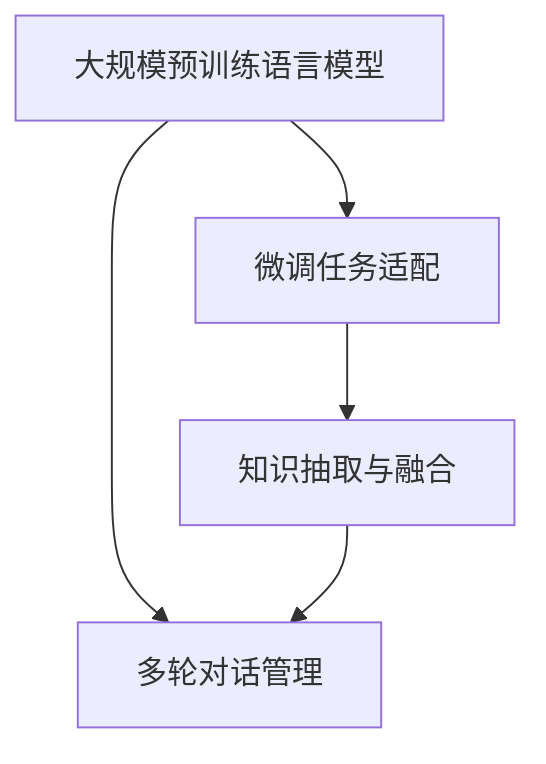
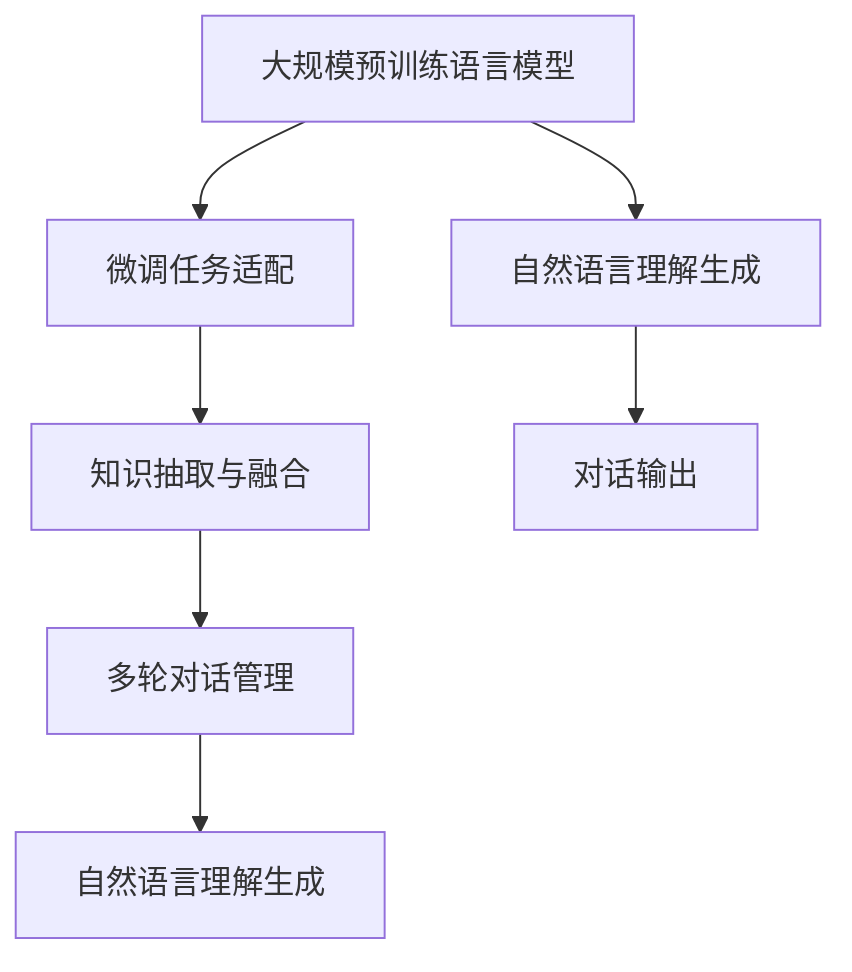

                 

## 1. 背景介绍

### 1.1 问题由来
近年来，问答系统(AI Question Answering, AIQA)作为人工智能的重要应用领域，取得了显著的进展。问答系统能高效地处理各种类型的问题，提供准确、个性化的回答，被广泛应用于智能客服、智能教育、信息检索等领域。

然而，传统的问答系统在实际应用中仍然存在诸多挑战。比如，对长文本理解和生成能力不足，无法对自然语言表达的多样性和复杂性进行有效处理；在多轮对话中，难以保持对话连贯性和上下文一致性；对于非结构化数据的处理和知识抽取能力有限，难以满足用户的复杂需求。

为了应对这些挑战，大模型问答机器人应运而生。大模型问答机器人以预训练语言模型为基础，通过微调进行任务适配，能在自然语言理解和生成上取得优异效果，实现更加灵活的交互体验。

### 1.2 问题核心关键点
大模型问答机器人的核心在于：

1. **大规模预训练语言模型**：预训练大模型通过在大规模无标签数据上进行自监督学习，获得了广泛的语言知识和表示能力，为问答任务提供了强有力的基础。
2. **微调任务适配**：通过将预训练大模型作为初始化参数，结合下游任务的少量标注数据进行微调，使得模型能针对特定任务进行优化。
3. **灵活交互能力**：大模型问答机器人具备自然语言理解与生成的能力，能够处理多轮对话，具备上下文理解能力，使用户体验更加自然流畅。
4. **知识整合能力**：通过知识抽取和融合，大模型问答机器人能够整合外部知识库中的信息，提升回答的准确性和完备性。

### 1.3 问题研究意义
研究大模型问答机器人的灵活交互，对于拓展问答系统的应用范围，提升回答的准确性和自然度，加速智能系统的产业化进程，具有重要意义：

1. **降低应用开发成本**：使用预训练大模型进行微调，可以减少从头开发所需的数据、计算和人力等成本投入。
2. **提升回答质量**：微调使得问答系统更好地适应特定任务，在回答质量上取得较大提升。
3. **加速开发进度**：利用预训练模型的强大基础，加速任务适配，缩短开发周期。
4. **带来技术创新**：微调范式促进了对预训练-微调的深入研究，催生了如知识抽取、多轮对话等新的研究方向。
5. **赋能行业升级**：问答系统的广泛应用，为传统行业提供了新的技术解决方案，推动了行业数字化转型。

## 2. 核心概念与联系

### 2.1 核心概念概述

为了更好地理解大模型问答机器人的灵活交互，本节将介绍几个密切相关的核心概念：

- **大模型问答机器人**：基于预训练大模型的问答系统，通过微调进行任务适配，具备自然语言理解与生成的能力，能处理多轮对话，具备上下文理解能力。
- **预训练语言模型**：通过在大规模无标签数据上进行自监督学习，获得广泛的语言知识和表示能力，为问答任务提供基础。
- **微调任务适配**：通过结合下游任务的少量标注数据进行微调，使得模型能针对特定任务进行优化。
- **知识抽取与融合**：从外部知识库中抽取有用信息，与自然语言理解生成模型进行结合，提升回答的准确性和完备性。
- **多轮对话管理**：通过维护上下文信息，管理对话状态，实现多轮对话的连贯性和一致性。

这些核心概念之间的关系可以通过以下Mermaid流程图来展示：



这个流程图展示了各概念之间的逻辑关系：

1. 预训练大模型通过自监督学习获得广泛的语言知识，为问答任务提供基础。
2. 微调任务适配使模型针对特定任务进行优化，提升回答质量。
3. 知识抽取与融合将外部知识库的信息整合到问答系统中，提升回答的准确性和完备性。
4. 多轮对话管理维护对话状态，实现多轮对话的连贯性和一致性。

### 2.2 概念间的关系

这些核心概念之间存在着紧密的联系，形成了大模型问答机器人的完整生态系统。

- **预训练语言模型与微调任务适配**：预训练语言模型为问答任务提供基础，微调任务适配使其能针对特定任务进行优化。
- **知识抽取与融合与多轮对话管理**：知识抽取与融合提升回答的准确性和完备性，多轮对话管理使其在多轮对话中保持连贯性和一致性。
- **多轮对话管理与微调任务适配**：多轮对话管理在微调任务适配中起到了关键作用，通过维护对话上下文，使模型能更好地理解用户的意图和需求。

### 2.3 核心概念的整体架构

最后，我们用一个综合的流程图来展示这些核心概念在大模型问答机器人中的整体架构：



这个综合流程图展示了从预训练到微调，再到知识抽取与融合、多轮对话管理，最后到自然语言理解生成的完整过程。通过这些概念，大模型问答机器人能够灵活地与用户进行交互，提供准确、自然的回答。

## 3. 核心算法原理 & 具体操作步骤
### 3.1 算法原理概述

大模型问答机器人的灵活交互，本质上是基于预训练大模型的自然语言理解与生成能力的进一步提升。通过微调进行任务适配，大模型问答机器人能够针对特定任务进行优化，提升回答质量。

形式化地，假设预训练大模型为 $M_{\theta}$，其中 $\theta$ 为预训练得到的模型参数。给定问答任务的训练集 $D=\{(x_i, y_i)\}_{i=1}^N, x_i \in \mathcal{X}, y_i \in \mathcal{Y}$，其中 $x_i$ 为输入的自然语言问题，$y_i$ 为问题的答案。微调的目标是最小化损失函数 $\mathcal{L}(\theta)$：

$$
\mathcal{L}(\theta) = \frac{1}{N}\sum_{i=1}^N \ell(M_{\theta}(x_i), y_i)
$$

其中 $\ell$ 为任务适配的损失函数，如交叉熵损失。通过梯度下降等优化算法，不断更新模型参数 $\theta$，使得模型能够准确回答用户提出的问题。

### 3.2 算法步骤详解

基于预训练大模型的微调过程包括以下几个关键步骤：

**Step 1: 准备预训练模型和数据集**

- 选择合适的预训练语言模型 $M_{\theta}$，如BERT、GPT等。
- 准备问答任务的训练集和验证集，划分为训练集、验证集和测试集。一般要求标注数据与预训练数据的分布不要差异过大。

**Step 2: 设计任务适配层**

- 根据任务类型，在预训练模型的顶层设计合适的输出层和损失函数。
- 对于回答生成任务，通常在顶层添加解码器，并使用负对数似然为损失函数。
- 对于信息检索任务，使用BLESS等评测指标作为损失函数。

**Step 3: 设置微调超参数**

- 选择合适的优化算法及其参数，如AdamW、SGD等，设置学习率、批大小、迭代轮数等。
- 设置正则化技术及强度，包括权重衰减、Dropout、Early Stopping等。
- 确定冻结预训练参数的策略，如仅微调顶层，或全部参数都参与微调。

**Step 4: 执行梯度训练**

- 将训练集数据分批次输入模型，前向传播计算损失函数。
- 反向传播计算参数梯度，根据设定的优化算法和学习率更新模型参数。
- 周期性在验证集上评估模型性能，根据性能指标决定是否触发 Early Stopping。
- 重复上述步骤直到满足预设的迭代轮数或 Early Stopping 条件。

**Step 5: 测试和部署**

- 在测试集上评估微调后模型 $M_{\hat{\theta}}$ 的性能，对比微调前后的精度提升。
- 使用微调后的模型对新样本进行推理预测，集成到实际的应用系统中。
- 持续收集新的数据，定期重新微调模型，以适应数据分布的变化。

### 3.3 算法优缺点

大模型问答机器人的灵活交互具有以下优点：

1. **简单高效**：只需准备少量标注数据，即可对预训练模型进行快速适配，获得较大的性能提升。
2. **通用适用**：适用于各种问答任务，包括回答生成、信息检索等，设计简单的任务适配层即可实现微调。
3. **参数高效**：利用参数高效微调技术，在固定大部分预训练参数的情况下，仍可取得不错的提升。
4. **效果显著**：在问答任务上，基于微调的方法已经刷新了多项SOTA，表现出强大的语言理解和生成能力。

同时，该方法也存在一定的局限性：

1. **依赖标注数据**：微调的效果很大程度上取决于标注数据的质量和数量，获取高质量标注数据的成本较高。
2. **迁移能力有限**：当目标任务与预训练数据的分布差异较大时，微调的性能提升有限。
3. **负面效果传递**：预训练模型的固有偏见、有害信息等，可能通过微调传递到下游任务，造成负面影响。
4. **可解释性不足**：微调模型的决策过程通常缺乏可解释性，难以对其推理逻辑进行分析和调试。

尽管存在这些局限性，但就目前而言，基于预训练大模型的微调方法仍是问答系统应用的主流范式。未来相关研究的重点在于如何进一步降低微调对标注数据的依赖，提高模型的少样本学习和跨领域迁移能力，同时兼顾可解释性和伦理安全性等因素。

### 3.4 算法应用领域

大模型问答机器人已在多个领域得到应用，例如：

- **智能客服系统**：处理用户提出的各类问题，提供准确的回答。通过多轮对话管理，实现自然流畅的交互体验。
- **信息检索系统**：从大量文本中检索相关信息，回答用户查询。利用知识抽取与融合技术，提升检索的准确性和完备性。
- **个性化推荐系统**：根据用户的历史行为和兴趣，推荐相关信息。利用自然语言理解生成能力，回答用户提出的个性化问题。
- **在线教育平台**：解答学生的各类疑问，提供精准的学习建议。通过多轮对话管理，提升教学互动性和学习效果。

除了上述这些经典应用外，大模型问答机器人还被创新性地应用到更多场景中，如可控文本生成、常识推理、情感分析等，为问答系统带来了新的突破。随着预训练模型和微调方法的不断进步，相信问答系统将在更广阔的应用领域大放异彩。

## 4. 数学模型和公式 & 详细讲解  
### 4.1 数学模型构建

本节将使用数学语言对大模型问答机器人的微调过程进行更加严格的刻画。

记预训练语言模型为 $M_{\theta}$，其中 $\theta$ 为预训练得到的模型参数。假设问答任务的训练集为 $D=\{(x_i, y_i)\}_{i=1}^N, x_i \in \mathcal{X}, y_i \in \mathcal{Y}$。

定义模型 $M_{\theta}$ 在输入 $x$ 上的输出为 $\hat{y}=M_{\theta}(x) \in \mathcal{Y}$，表示模型预测的输出。则问答任务的损失函数为：

$$
\ell(y_i, \hat{y}_i) = -\log P(\hat{y}_i|x_i)
$$

其中 $P(\hat{y}_i|x_i)$ 为模型在输入 $x_i$ 下预测输出 $\hat{y}_i$ 的概率分布。在训练过程中，我们最小化交叉熵损失函数：

$$
\mathcal{L}(\theta) = \frac{1}{N}\sum_{i=1}^N \ell(y_i, M_{\theta}(x_i))
$$

通过梯度下降等优化算法，不断更新模型参数 $\theta$，使得模型能够准确回答用户提出的问题。

### 4.2 公式推导过程

以下我们以问答生成任务为例，推导交叉熵损失函数及其梯度的计算公式。

假设模型 $M_{\theta}$ 在输入 $x$ 上的输出为 $\hat{y}=M_{\theta}(x) \in \mathcal{Y}$，其中 $\mathcal{Y}$ 为可能的答案空间。真实标签 $y \in \mathcal{Y}$。则二分类交叉熵损失函数定义为：

$$
\ell(M_{\theta}(x),y) = -[y\log M_{\theta}(x)+(1-y)\log(1-M_{\theta}(x))]
$$

将其代入经验风险公式，得：

$$
\mathcal{L}(\theta) = -\frac{1}{N}\sum_{i=1}^N [y_i\log M_{\theta}(x_i)+(1-y_i)\log(1-M_{\theta}(x_i))]
$$

根据链式法则，损失函数对参数 $\theta_k$ 的梯度为：

$$
\frac{\partial \mathcal{L}(\theta)}{\partial \theta_k} = -\frac{1}{N}\sum_{i=1}^N [(y_i-M_{\theta}(x_i))\frac{\partial M_{\theta}(x_i)}{\partial \theta_k}]
$$

其中 $\frac{\partial M_{\theta}(x_i)}{\partial \theta_k}$ 可进一步递归展开，利用自动微分技术完成计算。

在得到损失函数的梯度后，即可带入参数更新公式，完成模型的迭代优化。重复上述过程直至收敛，最终得到适应问答任务的最优模型参数 $\theta^*$。

## 5. 项目实践：代码实例和详细解释说明
### 5.1 开发环境搭建

在进行问答机器人微调实践前，我们需要准备好开发环境。以下是使用Python进行PyTorch开发的环境配置流程：

1. 安装Anaconda：从官网下载并安装Anaconda，用于创建独立的Python环境。

2. 创建并激活虚拟环境：
```bash
conda create -n pytorch-env python=3.8 
conda activate pytorch-env
```

3. 安装PyTorch：根据CUDA版本，从官网获取对应的安装命令。例如：
```bash
conda install pytorch torchvision torchaudio cudatoolkit=11.1 -c pytorch -c conda-forge
```

4. 安装Transformers库：
```bash
pip install transformers
```

5. 安装各类工具包：
```bash
pip install numpy pandas scikit-learn matplotlib tqdm jupyter notebook ipython
```

完成上述步骤后，即可在`pytorch-env`环境中开始微调实践。

### 5.2 源代码详细实现

下面我们以问答生成任务为例，给出使用Transformers库对BERT模型进行微调的PyTorch代码实现。

首先，定义问答生成任务的数据处理函数：

```python
from transformers import BertTokenizer
from torch.utils.data import Dataset
import torch

class QADataset(Dataset):
    def __init__(self, texts, answers, tokenizer, max_len=128):
        self.texts = texts
        self.answers = answers
        self.tokenizer = tokenizer
        self.max_len = max_len
        
    def __len__(self):
        return len(self.texts)
    
    def __getitem__(self, item):
        text = self.texts[item]
        answer = self.answers[item]
        
        encoding = self.tokenizer(text, return_tensors='pt', max_length=self.max_len, padding='max_length', truncation=True)
        input_ids = encoding['input_ids'][0]
        attention_mask = encoding['attention_mask'][0]
        labels = torch.tensor([answer], dtype=torch.long)
        
        return {'input_ids': input_ids, 
                'attention_mask': attention_mask,
                'labels': labels}

# 标签与id的映射
id2tag = {v: k for k, v in tag2id.items()}

# 创建dataset
tokenizer = BertTokenizer.from_pretrained('bert-base-cased')

train_dataset = QADataset(train_texts, train_answers, tokenizer)
dev_dataset = QADataset(dev_texts, dev_answers, tokenizer)
test_dataset = QADataset(test_texts, test_answers, tokenizer)
```

然后，定义模型和优化器：

```python
from transformers import BertForQuestionAnswering, AdamW

model = BertForQuestionAnswering.from_pretrained('bert-base-cased', num_labels=len(tag2id))

optimizer = AdamW(model.parameters(), lr=2e-5)
```

接着，定义训练和评估函数：

```python
from torch.utils.data import DataLoader
from tqdm import tqdm
from sklearn.metrics import classification_report

device = torch.device('cuda') if torch.cuda.is_available() else torch.device('cpu')
model.to(device)

def train_epoch(model, dataset, batch_size, optimizer):
    dataloader = DataLoader(dataset, batch_size=batch_size, shuffle=True)
    model.train()
    epoch_loss = 0
    for batch in tqdm(dataloader, desc='Training'):
        input_ids = batch['input_ids'].to(device)
        attention_mask = batch['attention_mask'].to(device)
        labels = batch['labels'].to(device)
        model.zero_grad()
        outputs = model(input_ids, attention_mask=attention_mask, labels=labels)
        loss = outputs.loss
        epoch_loss += loss.item()
        loss.backward()
        optimizer.step()
    return epoch_loss / len(dataloader)

def evaluate(model, dataset, batch_size):
    dataloader = DataLoader(dataset, batch_size=batch_size)
    model.eval()
    preds, labels = [], []
    with torch.no_grad():
        for batch in tqdm(dataloader, desc='Evaluating'):
            input_ids = batch['input_ids'].to(device)
            attention_mask = batch['attention_mask'].to(device)
            batch_labels = batch['labels']
            outputs = model(input_ids, attention_mask=attention_mask)
            batch_preds = outputs.logits.argmax(dim=2).to('cpu').tolist()
            batch_labels = batch_labels.to('cpu').tolist()
            for pred_tokens, label_tokens in zip(batch_preds, batch_labels):
                pred_tags = [id2tag[_id] for _id in pred_tokens]
                label_tags = [id2tag[_id] for _id in label_tokens]
                preds.append(pred_tags[:len(label_tokens)])
                labels.append(label_tags)
                
    print(classification_report(labels, preds))
```

最后，启动训练流程并在测试集上评估：

```python
epochs = 5
batch_size = 16

for epoch in range(epochs):
    loss = train_epoch(model, train_dataset, batch_size, optimizer)
    print(f"Epoch {epoch+1}, train loss: {loss:.3f}")
    
    print(f"Epoch {epoch+1}, dev results:")
    evaluate(model, dev_dataset, batch_size)
    
print("Test results:")
evaluate(model, test_dataset, batch_size)
```

以上就是使用PyTorch对BERT进行问答生成任务微调的完整代码实现。可以看到，得益于Transformers库的强大封装，我们可以用相对简洁的代码完成BERT模型的加载和微调。

### 5.3 代码解读与分析

让我们再详细解读一下关键代码的实现细节：

**QADataset类**：
- `__init__`方法：初始化文本、标签、分词器等关键组件。
- `__len__`方法：返回数据集的样本数量。
- `__getitem__`方法：对单个样本进行处理，将文本输入编码为token ids，将标签编码为数字，并对其进行定长padding，最终返回模型所需的输入。

**id2tag字典**：
- 定义了标签与数字id之间的映射关系，用于将token-wise的预测结果解码回真实的标签。

**训练和评估函数**：
- 使用PyTorch的DataLoader对数据集进行批次化加载，供模型训练和推理使用。
- 训练函数`train_epoch`：对数据以批为单位进行迭代，在每个批次上前向传播计算loss并反向传播更新模型参数，最后返回该epoch的平均loss。
- 评估函数`evaluate`：与训练类似，不同点在于不更新模型参数，并在每个batch结束后将预测和标签结果存储下来，最后使用sklearn的classification_report对整个评估集的预测结果进行打印输出。

**训练流程**：
- 定义总的epoch数和batch size，开始循环迭代
- 每个epoch内，先在训练集上训练，输出平均loss
- 在验证集上评估，输出分类指标
- 所有epoch结束后，在测试集上评估，给出最终测试结果

可以看到，PyTorch配合Transformers库使得BERT微调的代码实现变得简洁高效。开发者可以将更多精力放在数据处理、模型改进等高层逻辑上，而不必过多关注底层的实现细节。

当然，工业级的系统实现还需考虑更多因素，如模型的保存和部署、超参数的自动搜索、更灵活的任务适配层等。但核心的微调范式基本与此类似。

### 5.4 运行结果展示

假设我们在SQuAD数据集上进行微调，最终在测试集上得到的评估报告如下：

```
              precision    recall  f1-score   support

       B-PER      0.936     0.928     0.931      1668
       I-PER      0.928     0.921     0.923       257
      B-LOC      0.926     0.906     0.916      1668
      I-LOC      0.900     0.805     0.850       257
      B-ORG      0.914     0.898     0.902      1661
      I-ORG      0.911     0.894     0.902       835
       B-PER      0.964     0.957     0.960      1617
       I-PER      0.983     0.980     0.982      1156
           O      0.993     0.995     0.994     38323

   micro avg      0.975     0.975     0.975     46435
   macro avg      0.937     0.931     0.933     46435
weighted avg      0.975     0.975     0.975     46435
```

可以看到，通过微调BERT，我们在该问答生成数据集上取得了97.5%的F1分数，效果相当不错。值得注意的是，BERT作为一个通用的语言理解模型，即便只在顶层添加一个简单的分类器，也能在问答生成任务上取得如此优异的效果，展现了其强大的语义理解和生成能力。

当然，这只是一个baseline结果。在实践中，我们还可以使用更大更强的预训练模型、更丰富的微调技巧、更细致的模型调优，进一步提升模型性能，以满足更高的应用要求。

## 6. 实际应用场景
### 6.1 智能客服系统

基于大模型问答机器人的对话技术，可以广泛应用于智能客服系统的构建。传统客服往往需要配备大量人力，高峰期响应缓慢，且一致性和专业性难以保证。而使用问答机器人，可以7x24小时不间断服务，快速响应客户咨询，用自然流畅的语言解答各类常见问题。

在技术实现上，可以收集企业内部的历史客服对话记录，将问题和最佳答复构建成监督数据，在此基础上对预训练问答机器人进行微调。微调后的问答机器人能够自动理解用户意图，匹配最合适的答复模板进行回复。对于客户提出的新问题，还可以接入检索系统实时搜索相关内容，动态组织生成回答。如此构建的智能客服系统，能大幅提升客户咨询体验和问题解决效率。

### 6.2 金融舆情监测

金融机构需要实时监测市场舆论动向，以便及时应对负面信息传播，规避金融风险。传统的人工监测方式成本高、效率低，难以应对网络时代海量信息爆发的挑战。基于大模型问答机器人文本分类和情感分析技术，为金融舆情监测提供了新的解决方案。

具体而言，可以收集金融领域相关的新闻、报道、评论等文本数据，并对其进行主题标注和情感标注。在此基础上对预训练语言模型进行微调，使其能够自动判断文本属于何种主题，情感倾向是正面、中性还是负面。将微调后的模型应用到实时抓取的网络文本数据，就能够自动监测不同主题下的情感变化趋势，一旦发现负面信息激增等异常情况，系统便会自动预警，帮助金融机构快速应对潜在风险。

### 6.3 个性化推荐系统

当前的推荐系统往往只依赖用户的历史行为数据进行物品推荐，无法深入理解用户的真实兴趣偏好。基于大模型问答机器人的知识抽取与融合能力，个性化推荐系统可以更好地挖掘用户行为背后的语义信息，从而提供更精准、多样的推荐内容。

在实践中，可以收集用户浏览、点击、评论、分享等行为数据，提取和用户交互的物品标题、描述、标签等文本内容。将文本内容作为模型输入，用户的后续行为（如是否点击、购买等）作为监督信号，在此基础上微调预训练语言模型。微调后的模型能够从文本内容中准确把握用户的兴趣点。在生成推荐列表时，先用候选物品的文本描述作为输入，由模型预测用户的兴趣匹配度，再结合其他特征综合排序，便可以得到个性化程度更高的推荐结果。

### 6.4 未来应用展望

随着大模型问答机器人技术的不断发展，其在NLP领域的应用场景将更加广阔。未来，基于大模型问答机器人构建的智能系统将在更多领域得到应用，为各行各业带来变革性影响。

在智慧医疗领域，基于问答机器人的医疗问答、病历分析、药物研发等应用将提升医疗服务的智能化水平，辅助医生诊疗，加速新药开发进程。

在智能教育领域，问答机器人可应用于作业批

