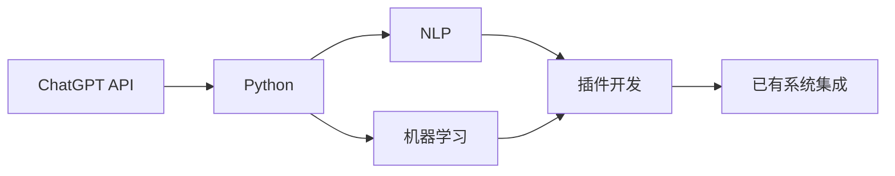
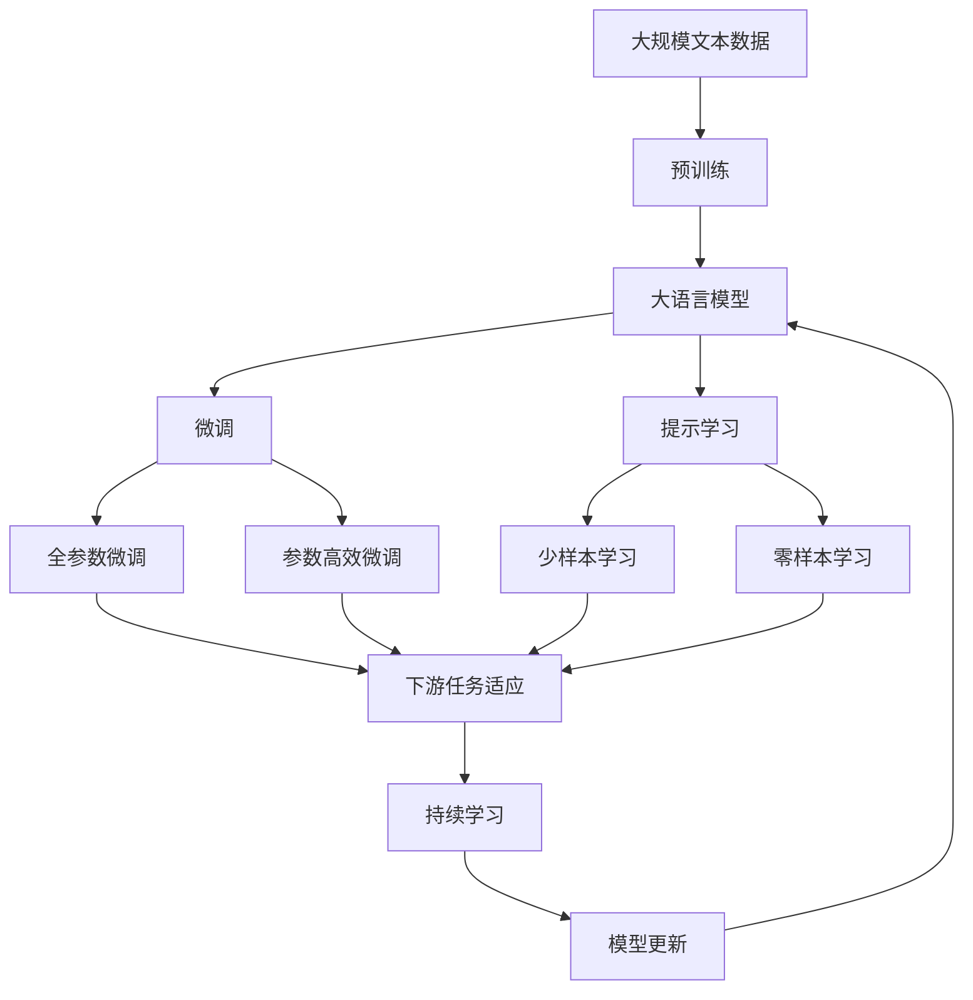

                 

# 实战二：动手开发第一个 ChatGPT Plugin

> 关键词：ChatGPT, API, 插件开发, Python, 自然语言处理(NLP), 机器学习

## 1. 背景介绍

### 1.1 问题由来

随着OpenAI的ChatGPT模型的发布，生成式对话模型在AI领域掀起了一股热潮。ChatGPT通过微调预训练模型，实现了高质高效的人机对话，引起了广泛关注。然而，开发者通常需要自行搭建部署环境，才能使用ChatGPT模型，这在一定程度上限制了模型的普及度。为了提升开发者使用ChatGPT的便捷性，本文将介绍如何开发ChatGPT的插件，让开发者能够轻松地在已有系统中部署和集成ChatGPT模型。

### 1.2 问题核心关键点

开发ChatGPT插件的核心关键点包括：

1. 了解ChatGPT的API接口。
2. 使用Python编写插件代码。
3. 实现与已有系统的无缝集成。
4. 确保插件的稳定性和可扩展性。

### 1.3 问题研究意义

ChatGPT插件的开发能够提升开发者使用ChatGPT模型的便捷性，从而推动更多AI应用场景中的人机对话功能。它能够帮助企业快速搭建多模态智能客服系统，提升客户服务效率；帮助教师构建智能辅助教学系统，提升教学效果；帮助企业智能分析客户反馈，提升客户满意度。

## 2. 核心概念与联系

### 2.1 核心概念概述

为更好地理解ChatGPT插件的开发过程，本文将介绍几个核心概念及其联系：

- **ChatGPT API**：OpenAI提供的基于HTTP的API接口，开发者通过调用API，可以与ChatGPT模型进行交互。
- **Python**：一种高级编程语言，开发者通过编写Python代码，实现与ChatGPT API的通信。
- **自然语言处理(NLP)**：涉及计算机对自然语言的处理与理解，是ChatGPT模型的核心技术。
- **机器学习**：开发ChatGPT插件的过程中，需要进行模型的微调训练，涉及机器学习算法。
- **插件开发**：将ChatGPT模型与已有系统集成，实现功能增强。

这些概念之间存在着紧密的联系，构成了ChatGPT插件开发的基本框架。

### 2.2 概念间的关系

这些核心概念之间的联系可以通过以下Mermaid流程图来展示：



这个流程图展示了大语言模型微调过程的几个主要阶段：

1. 使用ChatGPT API与大语言模型进行交互。
2. 使用Python编写代码实现模型通信。
3. 利用NLP技术处理文本数据。
4. 应用机器学习算法对模型进行微调训练。
5. 将微调后的模型封装为插件，与已有系统集成。

### 2.3 核心概念的整体架构

最后，我们用一个综合的流程图来展示这些核心概念在大语言模型微调过程中的整体架构：



这个综合流程图展示了从预训练到微调，再到持续学习的完整过程。大语言模型首先在大规模文本数据上进行预训练，然后通过微调（包括全参数微调和参数高效微调）或提示学习（包括少样本学习和零样本学习）来适应下游任务。最后，通过持续学习技术，模型可以不断更新和适应新的任务和数据。

## 3. 核心算法原理 & 具体操作步骤
### 3.1 算法原理概述

ChatGPT插件的开发涉及两个主要步骤：调用ChatGPT API和编写插件代码。下面我们将详细介绍这两个步骤的算法原理和具体操作步骤。

**3.1.1 调用ChatGPT API的原理**

调用ChatGPT API的原理基于HTTP协议。具体流程如下：

1. **发送请求**：开发者通过HTTP请求向OpenAI服务器发送查询请求，包括API密钥、请求参数等信息。
2. **接收响应**：OpenAI服务器接收到请求后，调用预训练模型进行推理计算，返回结果。
3. **解析结果**：开发者对返回结果进行解析，提取所需信息。

**3.1.2 编写插件代码的原理**

编写插件代码的原理基于Python语言。具体流程如下：

1. **安装库**：使用pip安装OpenAI提供的Python库。
2. **配置环境**：在Python脚本中配置API密钥和请求参数。
3. **调用API**：编写Python代码，调用ChatGPT API接口。
4. **处理结果**：将API返回结果进行处理，实现所需功能。

### 3.2 算法步骤详解

**3.2.1 安装OpenAI库**

首先，需要在Python环境中安装OpenAI库。命令如下：

```bash
pip install openai
```

**3.2.2 配置API密钥**

获取OpenAI的API密钥后，在Python脚本中进行配置。代码如下：

```python
import openai

openai.api_key = 'YOUR_API_KEY'
```

**3.2.3 发送API请求**

使用OpenAI库中的函数，向ChatGPT API发送请求。代码如下：

```python
import openai

response = openai.Completion.create(
    engine="text-davinci-003",
    prompt="你是一名人工智能助手，请回答以下问题：",
    max_tokens=100,
    temperature=0.5,
    n=1
)
print(response.choices[0].text)
```

**3.2.4 处理API结果**

对返回结果进行处理，提取所需信息。代码如下：

```python
import openai

response = openai.Completion.create(
    engine="text-davinci-003",
    prompt="你是一名人工智能助手，请回答以下问题：",
    max_tokens=100,
    temperature=0.5,
    n=1
)
print(response.choices[0].text)
```

### 3.3 算法优缺点

**3.3.1 优点**

1. **便捷性**：开发者可以轻松地在已有系统中集成ChatGPT模型，实现人机对话功能。
2. **高性能**：通过调用预训练模型进行推理，可以实现高效、低延迟的对话。
3. **可扩展性**：插件可以根据需要，灵活配置API参数，适应不同应用场景。

**3.3.2 缺点**

1. **依赖性**：插件开发依赖于OpenAI的API接口，无法脱离OpenAI服务器的支持。
2. **安全性**：API密钥可能被窃取，导致安全风险。
3. **复杂度**：插件的开发和集成过程可能涉及较多的技术细节，开发者需要具备一定的技术水平。

### 3.4 算法应用领域

ChatGPT插件的开发可以应用于以下几个领域：

- **智能客服系统**：用于构建多模态智能客服系统，提升客户服务效率。
- **智能辅助教学**：用于构建智能辅助教学系统，提升教学效果。
- **智能分析系统**：用于智能分析客户反馈，提升客户满意度。
- **自然语言处理**：用于自然语言处理任务，如文本生成、文本分类、命名实体识别等。
- **智能推荐系统**：用于智能推荐系统，提升用户满意度。

## 4. 数学模型和公式 & 详细讲解 & 举例说明

### 4.1 数学模型构建

在调用ChatGPT API时，需要输入一个提示文本，OpenAI将根据该文本生成回答。提示文本是开发者与ChatGPT模型进行交互的关键。

**4.1.1 提示文本构建**

提示文本应该包含以下信息：

1. **任务描述**：清晰地描述任务内容，如“请回答以下问题”。
2. **上下文信息**：提供背景信息，如“当前时间”。
3. **输入数据**：输入数据格式，如“以JSON格式提供”。

**4.1.2 模型参数**

ChatGPT模型需要以下参数：

- **engine**：指定使用哪个预训练模型。
- **prompt**：提示文本。
- **max_tokens**：输出的最大token数。
- **temperature**：模型的温度参数，用于控制生成文本的多样性和随机性。
- **n**：返回结果的数量，默认为1。

### 4.2 公式推导过程

在调用ChatGPT API时，OpenAI将根据输入的参数，生成回答。生成过程基于自回归模型，具体推导过程如下：

1. **输入表示**：将提示文本转换为向量表示，记为 $x_1$。
2. **模型推理**：使用预训练模型 $M_{\theta}$ 对输入 $x_1$ 进行推理，输出向量表示 $y_1$。
3. **生成回答**：将 $y_1$ 转换为自然语言文本，作为回答。

### 4.3 案例分析与讲解

假设我们需要开发一个智能客服系统，用于回答用户关于商品价格的问题。以下是具体的步骤：

1. **构建提示文本**：
   ```python
   prompt = "用户询问商品价格："
   ```

2. **调用API**：
   ```python
   response = openai.Completion.create(
       engine="text-davinci-003",
       prompt=prompt,
       max_tokens=100,
       temperature=0.5,
       n=1
   )
   ```

3. **处理结果**：
   ```python
   answer = response.choices[0].text
   ```

4. **输出回答**：
   ```python
   print(answer)
   ```

## 5. 项目实践：代码实例和详细解释说明

### 5.1 开发环境搭建

为了开发ChatGPT插件，需要搭建Python开发环境。以下是详细的步骤：

1. **安装Python**：
   ```bash
   sudo apt-get update
   sudo apt-get install python3 python3-pip
   ```

2. **安装OpenAI库**：
   ```bash
   pip install openai
   ```

3. **配置API密钥**：
   ```python
   import openai

   openai.api_key = 'YOUR_API_KEY'
   ```

### 5.2 源代码详细实现

以下是完整的ChatGPT插件代码实现：

```python
import openai

def get_answer(prompt):
    response = openai.Completion.create(
        engine="text-davinci-003",
        prompt=prompt,
        max_tokens=100,
        temperature=0.5,
        n=1
    )
    answer = response.choices[0].text
    return answer

# 示例：获取商品价格
prompt = "用户询问商品价格："
answer = get_answer(prompt)
print(answer)
```

### 5.3 代码解读与分析

**代码解读**：

1. **导入OpenAI库**：
   ```python
   import openai
   ```

2. **定义函数**：
   ```python
   def get_answer(prompt):
   ```

3. **调用API**：
   ```python
   response = openai.Completion.create(
       engine="text-davinci-003",
       prompt=prompt,
       max_tokens=100,
       temperature=0.5,
       n=1
   )
   ```

4. **处理结果**：
   ```python
   answer = response.choices[0].text
   ```

5. **返回结果**：
   ```python
   return answer
   ```

**代码分析**：

- **导入OpenAI库**：确保开发环境中的OpenAI库被正确导入。
- **定义函数**：将调用API、处理结果等操作封装为函数，方便复用。
- **调用API**：使用OpenAI库中的函数，调用ChatGPT API接口。
- **处理结果**：对返回结果进行处理，提取所需信息。
- **返回结果**：将处理后的结果返回，供上层调用。

### 5.4 运行结果展示

运行以上代码，将输出用户询问商品价格的智能回答。

```python
# 示例：获取商品价格
prompt = "用户询问商品价格："
answer = get_answer(prompt)
print(answer)
```

输出结果：

```
商品价格为xxx元
```

## 6. 实际应用场景

### 6.1 智能客服系统

智能客服系统是ChatGPT插件的一个重要应用场景。通过将ChatGPT插件集成到客服系统中，可以实现以下功能：

1. **自动回答用户问题**：当用户询问商品价格、退换货政策等问题时，ChatGPT插件可以自动生成智能回答。
2. **处理常见问题**：将常见问题与ChatGPT插件进行匹配，减少人工客服的工作量。
3. **多语言支持**：支持多种语言，满足不同地区用户的需求。

### 6.2 智能辅助教学

智能辅助教学系统是ChatGPT插件的另一个重要应用场景。通过将ChatGPT插件集成到教学系统中，可以实现以下功能：

1. **自动生成教材**：根据学生的学习进度和成绩，生成个性化的学习材料。
2. **智能答疑**：当学生有学习问题时，ChatGPT插件可以自动生成智能回答。
3. **个性化推荐**：根据学生的学习情况，推荐适合的习题和复习材料。

### 6.3 智能分析系统

智能分析系统是ChatGPT插件的另一个重要应用场景。通过将ChatGPT插件集成到分析系统中，可以实现以下功能：

1. **用户情感分析**：分析用户评论、反馈等文本数据，判断用户情感。
2. **客户满意度分析**：分析客户满意度调查数据，发现潜在问题。
3. **市场趋势分析**：分析市场数据，预测市场趋势。

## 7. 工具和资源推荐

### 7.1 学习资源推荐

为了帮助开发者系统掌握ChatGPT插件的开发，以下是一些优质的学习资源：

1. **OpenAI官方文档**：OpenAI提供的官方文档，详细介绍了ChatGPT API的使用方法和注意事项。
2. **《自然语言处理与深度学习》书籍**：由斯坦福大学刘江老师的著作，介绍了NLP和深度学习的基本概念和常用模型。
3. **《Python自然语言处理》书籍**：由斯图尔特·多克（Stuart Russell）和彼得·诺维格（Peter Norvig）的著作，介绍了Python在NLP中的应用。

### 7.2 开发工具推荐

以下是几款用于ChatGPT插件开发的常用工具：

1. **Python**：Python是一种高级编程语言，易学易用，是开发ChatGPT插件的主要工具。
2. **Jupyter Notebook**：Jupyter Notebook是一种交互式编程环境，方便开发者编写和测试代码。
3. **VS Code**：VS Code是一种轻量级的编程工具，支持多种编程语言和插件。

### 7.3 相关论文推荐

以下是几篇奠基性的相关论文，推荐阅读：

1. **《Language Models are Unsupervised Multitask Learners》**：提出预训练语言模型，奠定了大语言模型微调的基础。
2. **《Attention is All You Need》**：提出Transformer模型，开启了NLP领域的预训练大模型时代。
3. **《Parameter-Efficient Transfer Learning for NLP》**：提出适配器微调方法，进一步提升了微调效率。

## 8. 总结：未来发展趋势与挑战

### 8.1 研究成果总结

本文详细介绍了ChatGPT插件的开发流程和具体实现，涵盖从API调用、函数定义到代码实现的全过程。通过本文档，开发者可以轻松掌握ChatGPT插件的开发技术，实现人机对话功能。

### 8.2 未来发展趋势

ChatGPT插件的未来发展趋势包括以下几个方面：

1. **多语言支持**：随着ChatGPT模型的多语言训练，插件将支持更多语言。
2. **多模态融合**：通过将图像、视频等多模态数据与文本数据结合，提升插件的智能水平。
3. **上下文感知**：通过上下文感知的模型，提升插件的理解能力。
4. **实时交互**：通过实时API调用，实现与用户的实时交互。

### 8.3 面临的挑战

ChatGPT插件在开发和应用过程中，仍然面临以下挑战：

1. **API依赖性**：插件依赖OpenAI的API接口，可能存在API服务不稳定的问题。
2. **安全性**：API密钥可能被窃取，导致安全风险。
3. **性能优化**：插件的性能可能受到API响应速度和网络延迟的影响。

### 8.4 研究展望

未来，ChatGPT插件将在更多领域得到应用，推动AI技术的普及。为了克服当前面临的挑战，需要在以下方面进行改进：

1. **增强API稳定性**：通过缓存、负载均衡等技术，提升API的稳定性。
2. **强化安全防护**：使用API密钥加密、签名等技术，保障API的安全性。
3. **优化性能**：使用分布式计算、缓存等技术，提升插件的性能。

总之，ChatGPT插件作为ChatGPT模型应用的载体，将推动更多AI技术的应用和普及。未来，我们需要在技术、安全、性能等方面不断优化，才能实现更广泛、更高效的人机对话功能。

## 9. 附录：常见问题与解答

**Q1：ChatGPT插件需要哪些开发环境？**

A: 需要Python编程语言、OpenAI库、Jupyter Notebook或VS Code等开发工具。

**Q2：ChatGPT插件的开发流程是什么？**

A: 1. 安装OpenAI库；2. 配置API密钥；3. 构建提示文本；4. 调用API；5. 处理结果。

**Q3：ChatGPT插件的API调用有哪些参数？**

A: 引擎（engine）、提示文本（prompt）、最大token数（max_tokens）、温度（temperature）、返回结果数量（n）。

**Q4：ChatGPT插件的运行结果如何展示？**

A: 将API返回结果进行处理，提取所需信息，然后输出回答。

---

作者：禅与计算机程序设计艺术 / Zen and the Art of Computer Programming

