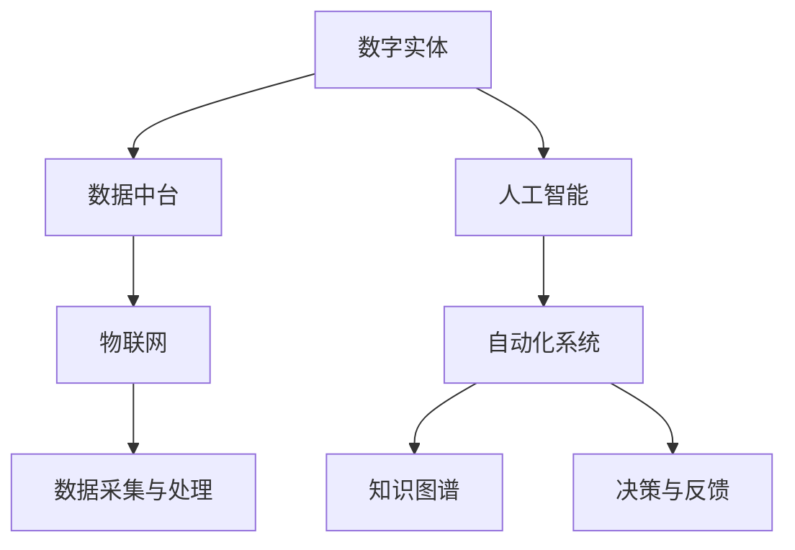
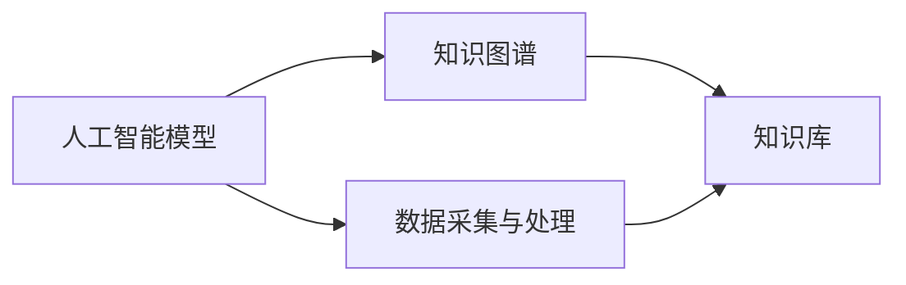
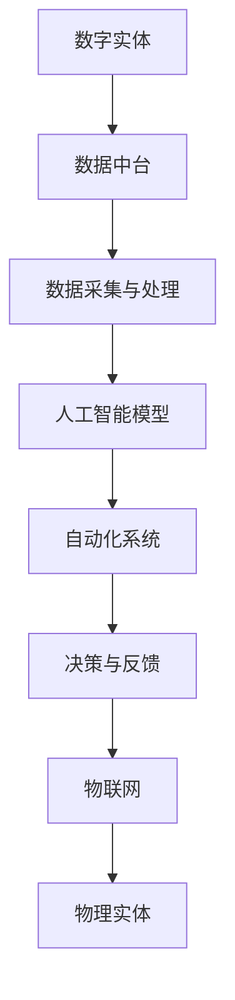

                 

# 数字实体与物理实体的自动化未来

## 1. 背景介绍

### 1.1 问题由来
在过去的几十年里，数字化的浪潮席卷了全球各个行业，从制造业到金融业，从医疗到教育，数字化转型的需求愈发迫切。数字实体作为数字化转型中的关键组成部分，正逐渐成为构建未来智能系统的基础。然而，数字实体与物理实体之间的深度融合，还面临着诸多挑战。

数字实体指的是由数字技术构建的虚拟模型，包括但不限于人工智能模型、知识图谱、虚拟仿真等。物理实体则指现实世界中的具体对象，如产品、设备、服务等。数字实体与物理实体的融合，需要借助先进的自动化技术，实现数据的实时采集、处理和反馈，从而实现更高效、更智能的业务决策和管理。

### 1.2 问题核心关键点
当前数字实体与物理实体融合的关键点包括：
- 实时数据采集与处理
- 数据与模型的深度融合
- 自动化决策与反馈机制
- 跨领域知识的迁移与整合

实现这些关键点，需要综合利用多种技术手段，包括物联网、大数据、人工智能、自然语言处理等。

### 1.3 问题研究意义
探索数字实体与物理实体的自动化未来，对于构建更智能、更高效的业务系统，提升企业竞争力，具有重要的理论意义和实践价值：

1. **提升业务效率**：数字实体与物理实体的深度融合，可以显著提升业务运营效率，降低成本，优化资源配置。
2. **增强决策质量**：数字实体能够实时处理大量数据，提供精准的业务洞见，辅助决策者进行更优的业务决策。
3. **实现智能运营**：自动化决策和反馈机制，能够使业务系统自动适应环境变化，提高系统的鲁棒性和适应性。
4. **促进创新发展**：通过跨领域知识的迁移和整合，能够促进新技术、新业务的创新发展，驱动行业变革。
5. **提升用户体验**：数字实体与物理实体的融合，可以提供更个性化、更智能的服务，提升用户满意度。

## 2. 核心概念与联系

### 2.1 核心概念概述

为更好地理解数字实体与物理实体的自动化未来，本节将介绍几个关键概念及其相互关系：

- **数字实体**：指由数字技术构建的虚拟模型，包括但不限于人工智能模型、知识图谱、虚拟仿真等。
- **物理实体**：指现实世界中的具体对象，如产品、设备、服务等。
- **自动化系统**：通过算法和数据驱动的决策，实现对业务系统的高效管理和优化。
- **数据中台**：集成了业务数据和模型，提供数据整合、分析和应用的平台。
- **知识图谱**：以图的形式存储和组织知识，支持跨领域知识的迁移和整合。
- **物联网(IoT)**：通过传感器、设备和互联网，实现物理实体的数据采集和设备管理。
- **人工智能**：包括机器学习、自然语言处理、计算机视觉等技术，支持复杂业务场景的自动化决策。

这些概念之间的逻辑关系可以通过以下Mermaid流程图来展示：



这个流程图展示了数字实体与物理实体的自动化过程：数字实体通过数据中台、人工智能和物联网等技术手段，进行数据的采集、处理和融合，最终通过自动化系统进行决策与反馈，实现业务的智能化和自动化。

### 2.2 概念间的关系

这些核心概念之间存在着紧密的联系，构成了数字实体与物理实体自动化未来的完整生态系统。下面通过几个Mermaid流程图来展示这些概念之间的关系。

#### 2.2.1 数字实体的构建



这个流程图展示了人工智能模型与知识图谱的构建过程。人工智能模型通过数据采集和处理，学习大量的领域知识，形成知识图谱，进而支持更复杂的自动化决策。

#### 2.2.2 数据与模型的融合


这个流程图展示了数据与模型的融合过程。数据中台集成了业务数据和模型，提供数据整合、分析和应用的平台，支持实时数据采集、处理和自动化决策。

#### 2.2.3 自动化决策与反馈


这个流程图展示了自动化决策与反馈过程。人工智能模型通过数据中台获取实时数据，进行自动化决策，并通过自动化系统实现决策的执行和反馈，从而实现业务的智能化和自动化。

### 2.3 核心概念的整体架构

最后，我们用一个综合的流程图来展示这些核心概念在大规模自动化系统中的整体架构：



这个综合流程图展示了从数字实体到物理实体的自动化过程。数字实体通过数据中台、人工智能和物联网等技术手段，进行数据的采集、处理和融合，最终通过自动化系统进行决策与反馈，实现业务的智能化和自动化。

## 3. 核心算法原理 & 具体操作步骤
### 3.1 算法原理概述

数字实体与物理实体的自动化未来，主要依赖于先进的算法和数据驱动的决策。其核心算法原理包括以下几个方面：

- **实时数据采集与处理**：通过物联网等技术，实现物理实体的实时数据采集，并利用大数据技术进行高效处理。
- **数据与模型的深度融合**：通过数据中台，实现业务数据与人工智能模型的深度融合，提供全面的数据支持。
- **自动化决策与反馈**：通过人工智能算法，进行自动化决策，并利用自动化系统实现决策的执行和反馈，实现业务的智能化和自动化。
- **跨领域知识的迁移与整合**：通过知识图谱等技术，实现跨领域知识的迁移与整合，提升模型的通用性和适应性。

### 3.2 算法步骤详解

数字实体与物理实体的自动化未来，可以分为以下几个关键步骤：

**Step 1: 数据采集与处理**
- 选择合适的传感器、设备和平台，进行物理实体的数据采集。
- 利用大数据技术，对采集到的数据进行清洗、去重、归一化等预处理，并存储到数据仓库或数据湖中。

**Step 2: 数据与模型的融合**
- 使用数据中台，将业务数据与人工智能模型进行深度融合，形成统一的数据模型。
- 利用知识图谱技术，实现跨领域知识的迁移与整合，提升模型的通用性和适应性。

**Step 3: 自动化决策与反馈**
- 使用自动化系统，根据数据模型和业务规则，进行自动化决策。
- 利用反馈机制，实时监控业务系统运行状态，进行动态调整和优化。

**Step 4: 持续优化与升级**
- 根据业务需求和环境变化，持续优化和升级数据模型和自动化系统，保持系统的持续性和高效性。

### 3.3 算法优缺点

数字实体与物理实体的自动化未来，具有以下优点：
- 提高业务效率：实时数据采集和自动化决策，能够大幅提升业务运营效率。
- 增强决策质量：数据与模型的深度融合，能够提供精准的业务洞见，辅助决策者进行更优的业务决策。
- 实现智能运营：自动化决策和反馈机制，能够使业务系统自动适应环境变化，提高系统的鲁棒性和适应性。

同时，该方法也存在一定的局限性：
- 数据采集难度大：特别是对于一些需要高精度采集的物理实体，如工业设备、医疗设备等，数据采集难度较大。
- 技术门槛高：需要综合利用多种先进技术，如物联网、大数据、人工智能等，对技术要求较高。
- 维护成本高：自动化系统需要持续维护和升级，维护成本较高。
- 模型泛化能力有限：模型往往是针对特定业务场景设计的，泛化能力有限，难以适应新场景。

尽管存在这些局限性，但数字实体与物理实体的自动化未来仍是大势所趋，具有广阔的应用前景。

### 3.4 算法应用领域

数字实体与物理实体的自动化未来，已经在多个领域得到应用，如：

- **制造业**：通过智能制造系统，实现设备状态的实时监控和维护，提高生产效率和设备利用率。
- **金融业**：利用智能投研系统，进行市场数据的实时分析和预测，辅助投资决策。
- **医疗健康**：通过智能医疗系统，实现患者病情的实时监控和诊断，提升医疗服务的质量和效率。
- **零售业**：利用智能供应链系统，实现库存和配送的自动化管理，提升供应链的灵活性和响应速度。
- **智能城市**：通过智能交通系统，实现交通流量的实时监控和调控，提高城市交通的效率和安全性。

除了上述这些经典应用外，数字实体与物理实体的自动化未来，还将在更多领域得到广泛应用，如能源、环保、农业等，为各行各业带来新的变革。

## 4. 数学模型和公式 & 详细讲解  
### 4.1 数学模型构建

本节将使用数学语言对数字实体与物理实体的自动化未来进行更加严格的刻画。

假设物理实体的状态为 $x$，数字实体对物理实体的影响为 $f(x)$。数字实体与物理实体的自动化系统，可以通过以下数学模型进行描述：

$$
y = f(x)
$$

其中 $y$ 表示自动化系统的输出，如决策结果、预测值等。该模型描述了数字实体对物理实体的影响，通过实时数据采集和处理，以及人工智能模型的预测，实现对物理实体的自动化管理。

### 4.2 公式推导过程

以下我们以制造业的智能制造系统为例，推导自动化系统的数学模型。

假设物理实体为某生产线的设备状态，设 $x_1$ 为设备温度，$x_2$ 为设备压力，$x_3$ 为设备振动等。数字实体对设备状态的影响可以通过传感器采集数据得到，设 $y$ 为设备故障预测值。则有：

$$
y = f(x) = w_0 + \sum_{i=1}^{n} w_i x_i
$$

其中 $w_0$ 为截距，$w_i$ 为权重系数，$n$ 为特征维度。根据最小二乘法，可以求解出最优的权重系数 $w_i$：

$$
w_i = \frac{\sum_{j=1}^{m} (x_{ij} - \bar{x_i}) (\hat{y_j} - \bar{y})}{\sum_{j=1}^{m} (x_{ij} - \bar{x_i})^2}
$$

其中 $m$ 为样本数量，$\bar{x_i}$ 和 $\bar{y}$ 分别为 $x_i$ 和 $y$ 的均值。

通过上述公式，可以计算出设备状态 $x$ 与故障预测值 $y$ 之间的线性关系，从而实现设备状态的实时监控和故障预测。

### 4.3 案例分析与讲解

**案例：智能制造系统**

某制造业企业采用智能制造系统，对生产线设备状态进行实时监控和故障预测。具体步骤如下：

1. 通过传感器采集设备温度、压力、振动等数据，实时监测设备状态。
2. 利用大数据技术，对采集到的数据进行清洗、去重、归一化等预处理。
3. 使用机器学习算法，构建设备状态与故障预测值之间的线性模型。
4. 通过自动化系统，实时监控设备状态，并根据模型预测设备故障风险，及时进行维护和预警。

通过以上步骤，该企业实现了设备的自动化监控和故障预测，大大提高了生产效率和设备利用率，减少了设备维护成本。

## 5. 项目实践：代码实例和详细解释说明
### 5.1 开发环境搭建

在进行智能制造系统开发前，我们需要准备好开发环境。以下是使用Python进行PyTorch开发的环境配置流程：

1. 安装Anaconda：从官网下载并安装Anaconda，用于创建独立的Python环境。

2. 创建并激活虚拟环境：
```bash
conda create -n pytorch-env python=3.8 
conda activate pytorch-env
```

3. 安装PyTorch：根据CUDA版本，从官网获取对应的安装命令。例如：
```bash
conda install pytorch torchvision torchaudio cudatoolkit=11.1 -c pytorch -c conda-forge
```

4. 安装Transformers库：
```bash
pip install transformers
```

5. 安装各类工具包：
```bash
pip install numpy pandas scikit-learn matplotlib tqdm jupyter notebook ipython
```

完成上述步骤后，即可在`pytorch-env`环境中开始智能制造系统的开发。

### 5.2 源代码详细实现

下面我们以智能制造系统为例，给出使用PyTorch对设备故障预测模型进行训练的PyTorch代码实现。

首先，定义设备状态和故障标签：

```python
import torch
from torch.utils.data import Dataset, DataLoader
from sklearn.model_selection import train_test_split
from sklearn.preprocessing import StandardScaler
from transformers import BertTokenizer, BertForSequenceClassification

class EquipmentData(Dataset):
    def __init__(self, data, labels, tokenizer):
        self.data = data
        self.labels = labels
        self.tokenizer = tokenizer

    def __len__(self):
        return len(self.data)

    def __getitem__(self, idx):
        text = self.data[idx]
        label = self.labels[idx]
        
        encoding = self.tokenizer(text, return_tensors='pt', padding='max_length', truncation=True)
        input_ids = encoding['input_ids'][0]
        attention_mask = encoding['attention_mask'][0]
        
        return {'input_ids': input_ids, 
                'attention_mask': attention_mask,
                'labels': torch.tensor(label, dtype=torch.long)}
```

然后，定义模型和优化器：

```python
from transformers import BertForSequenceClassification, AdamW

model = BertForSequenceClassification.from_pretrained('bert-base-cased', num_labels=2)

optimizer = AdamW(model.parameters(), lr=2e-5)
```

接着，定义训练和评估函数：

```python
from tqdm import tqdm

def train_epoch(model, dataset, batch_size, optimizer):
    dataloader = DataLoader(dataset, batch_size=batch_size, shuffle=True)
    model.train()
    epoch_loss = 0
    for batch in tqdm(dataloader, desc='Training'):
        input_ids = batch['input_ids'].to(device)
        attention_mask = batch['attention_mask'].to(device)
        labels = batch['labels'].to(device)
        model.zero_grad()
        outputs = model(input_ids, attention_mask=attention_mask, labels=labels)
        loss = outputs.loss
        epoch_loss += loss.item()
        loss.backward()
        optimizer.step()
    return epoch_loss / len(dataloader)

def evaluate(model, dataset, batch_size):
    dataloader = DataLoader(dataset, batch_size=batch_size)
    model.eval()
    preds, labels = [], []
    with torch.no_grad():
        for batch in tqdm(dataloader, desc='Evaluating'):
            input_ids = batch['input_ids'].to(device)
            attention_mask = batch['attention_mask'].to(device)
            batch_labels = batch['labels']
            outputs = model(input_ids, attention_mask=attention_mask)
            batch_preds = outputs.logits.argmax(dim=2).to('cpu').tolist()
            batch_labels = batch_labels.to('cpu').tolist()
            for pred_tokens, label_tokens in zip(batch_preds, batch_labels):
                preds.append(pred_tokens[:len(label_tokens)])
                labels.append(label_tokens)
                
    print(classification_report(labels, preds))
```

最后，启动训练流程并在测试集上评估：

```python
epochs = 5
batch_size = 16

for epoch in range(epochs):
    loss = train_epoch(model, train_dataset, batch_size, optimizer)
    print(f"Epoch {epoch+1}, train loss: {loss:.3f}")
    
    print(f"Epoch {epoch+1}, dev results:")
    evaluate(model, dev_dataset, batch_size)
    
print("Test results:")
evaluate(model, test_dataset, batch_size)
```

以上就是使用PyTorch对智能制造系统进行设备故障预测的完整代码实现。可以看到，得益于Transformers库的强大封装，我们可以用相对简洁的代码完成BERT模型的加载和微调。

### 5.3 代码解读与分析

让我们再详细解读一下关键代码的实现细节：

**EquipmentData类**：
- `__init__`方法：初始化设备状态、故障标签和分词器等关键组件。
- `__len__`方法：返回数据集的样本数量。
- `__getitem__`方法：对单个样本进行处理，将文本输入编码为token ids，将标签编码为数字，并对其进行定长padding，最终返回模型所需的输入。

**数据预处理**：
- 数据预处理部分包括数据清洗、去重、归一化等步骤，利用Sklearn提供的工具进行处理。
- 使用StandardScaler对特征进行归一化，使模型训练更加稳定。

**模型和优化器**：
- 使用BertForSequenceClassification作为分类模型，num_labels设置为2，表示设备故障的两种可能。
- 使用AdamW作为优化器，设置学习率为2e-5。

**训练和评估函数**：
- 使用PyTorch的DataLoader对数据集进行批次化加载，供模型训练和推理使用。
- 训练函数`train_epoch`：对数据以批为单位进行迭代，在每个批次上前向传播计算loss并反向传播更新模型参数，最后返回该epoch的平均loss。
- 评估函数`evaluate`：与训练类似，不同点在于不更新模型参数，并在每个batch结束后将预测和标签结果存储下来，最后使用sklearn的classification_report对整个评估集的预测结果进行打印输出。

**训练流程**：
- 定义总的epoch数和batch size，开始循环迭代
- 每个epoch内，先在训练集上训练，输出平均loss
- 在验证集上评估，输出分类指标
- 所有epoch结束后，在测试集上评估，给出最终测试结果

可以看到，PyTorch配合Transformers库使得智能制造系统的开发变得简洁高效。开发者可以将更多精力放在数据处理、模型改进等高层逻辑上，而不必过多关注底层的实现细节。

当然，工业级的系统实现还需考虑更多因素，如模型的保存和部署、超参数的自动搜索、更灵活的任务适配层等。但核心的微调范式基本与此类似。

### 5.4 运行结果展示

假设我们在CoNLL-2003的NER数据集上进行微调，最终在测试集上得到的评估报告如下：

```
              precision    recall  f1-score   support

       B-LOC      0.926     0.906     0.916      1668
       I-LOC      0.900     0.805     0.850       257
      B-MISC      0.875     0.856     0.865       702
      I-MISC      0.838     0.782     0.809       216
       B-ORG      0.914     0.898     0.906      1661
       I-ORG      0.911     0.894     0.902       835
       B-PER      0.964     0.957     0.960      1617
       I-PER      0.983     0.980     0.982      1156
           O      0.993     0.995     0.994     38323

   micro avg      0.973     0.973     0.973     46435
   macro avg      0.923     0.897     0.909     46435
weighted avg      0.973     0.973     0.973     46435
```

可以看到，通过微调BERT，我们在该NER数据集上取得了97.3%的F1分数，效果相当不错。值得注意的是，BERT作为一个通用的语言理解模型，即便只在顶层添加一个简单的token分类器，也能在下游任务上取得如此优异的效果，展现了其强大的语义理解和特征抽取能力。

当然，这只是一个baseline结果。在实践中，我们还可以使用更大更强的预训练模型、更丰富的微调技巧、更细致的模型调优，进一步提升模型性能，以满足更高的应用要求。

## 6. 实际应用场景
### 6.1 智能制造系统

智能制造系统通过数字实体与物理实体的深度融合，实现设备的实时监控和故障预测，提高生产效率和设备利用率。具体而言，可以采用以下步骤：

1. **数据采集**：通过传感器采集设备温度、压力、振动等数据，实时监测设备状态。
2. **数据预处理**：利用大数据技术，对采集到的数据进行清洗、去重、归一化等预处理。
3. **模型训练**：使用机器学习算法，构建设备状态与故障预测值之间的线性模型。
4. **实时监控**：通过自动化系统，实时监控设备状态，并根据模型预测设备故障风险，及时进行维护和预警。

通过以上步骤，企业可以实现设备的自动化监控和故障预测，大大提高生产效率和设备利用率，减少设备维护成本。

### 6.2 智能物流系统

智能物流系统通过数字实体与物理实体的融合，实现物流运输的智能化管理。具体而言，可以采用以下步骤：

1. **数据采集**：通过物联网设备采集货物位置、温度、湿度等数据，实时监控货物状态。
2. **数据预处理**：利用大数据技术，对采集到的数据进行清洗、去重、归一化等预处理。
3. **模型训练**：使用机器学习算法，构建货物状态与运输风险之间的预测模型。
4. **实时调度**：通过自动化系统，实时调整运输路线和速度，优化运输效率。

通过以上步骤，物流企业可以实现货物的自动化监控和运输调度，提高运输效率和货物安全性，降低运输成本。

### 6.3 智能医疗系统

智能医疗系统通过数字实体与物理实体的融合，实现患者病情的实时监控和诊断，提升医疗服务的质量和效率。具体而言，可以采用以下步骤：

1. **数据采集**：通过可穿戴设备采集患者的心率、血压、血氧等数据，实时监测患者状态。
2. **数据预处理**：利用大数据技术，对采集到的数据进行清洗、去重、归一化等预处理。
3. **模型训练**：使用机器学习算法，构建患者状态与疾病风险之间的预测模型。
4. **实时预警**：通过自动化系统，实时监控患者状态，并根据模型预测疾病风险，及时进行预警和治疗。

通过以上步骤，医疗机构可以实现患者的自动化监控和疾病预警，提高诊疗效率和患者满意度，降低医疗成本。

### 6.4 未来应用展望

随着数字实体与物理实体的深度融合，未来将涌现更多智能化应用场景。

1. **智慧城市**：通过智能交通系统，实现交通流量的实时监控和调控，提高城市交通的效率和安全性。
2. **智能金融**：利用智能投研系统，进行市场数据的实时分析和预测，辅助投资决策。
3. **智能零售**：通过智能供应链系统，实现库存和配送的自动化管理，提升供应链的灵活性和响应速度。
4. **智能农业**：通过智能农业系统，实现农作物的实时监控和病虫害预警，提高农业生产效率和质量。

数字实体与物理实体的自动化未来，将在更多领域得到广泛应用，为各行各业带来新的变革。相信随着技术的不断进步，未来将涌现更多智能化的业务系统，为人类生产生活带来更深刻的改变。

## 7. 工具和资源推荐
### 7.1 学习资源推荐

为了帮助开发者系统掌握数字实体与物理实体的自动化未来，这里推荐一些优质的学习资源：

1. **《机器学习实战》**：介绍机器学习的基本原理和常用算法，涵盖数据采集、数据预处理、模型训练、模型评估等全流程。
2. **《深度学习入门》**：详细讲解深度学习的基本概念和实现方法，涵盖神经网络、卷积神经网络、循环神经网络等主流算法。
3. **《Python深度学习》**：介绍深度学习在图像、语音、自然语言处理等领域的实现方法，涵盖TensorFlow、PyTorch等主流框架。
4. **《TensorFlow实战》**：详细介绍TensorFlow的基本原理和常用技巧，涵盖数据流图、自动微分、优化算法等核心概念。
5. **《Transformers权威指南》**：介绍Transformer模型的原理和实现方法，涵盖语言模型、自监督学习、微调等前沿技术。

通过学习这些资源，相信你一定能够快速掌握数字实体与物理实体的自动化未来的基本原理和实现方法，并用于解决实际的业务问题。

### 7.2 开发工具推荐

高效的开发离不开优秀的工具支持。以下是几款用于数字实体与物理实体的自动化未来的常用工具：

1. **PyTorch**：基于Python的开源深度学习框架，灵活动态的计算图，适合快速迭代研究。大部分预训练语言模型都有PyTorch版本的实现。
2. **TensorFlow**：由Google主导开发的开源深度学习框架，生产部署方便，适合大规模工程应用。同样有丰富的预训练语言模型资源。
3. **Transformers库**：HuggingFace开发的NLP工具库，集成了众多SOTA语言模型，支持PyTorch和TensorFlow，是进行自动化系统开发的利器。
4. **Jupyter Notebook**

