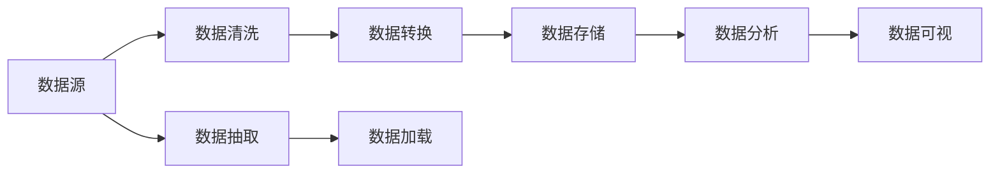
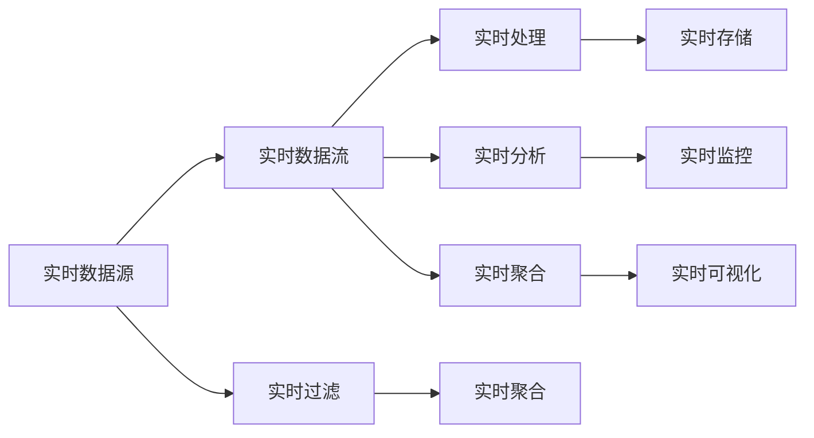
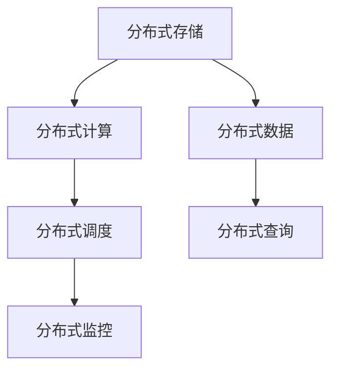
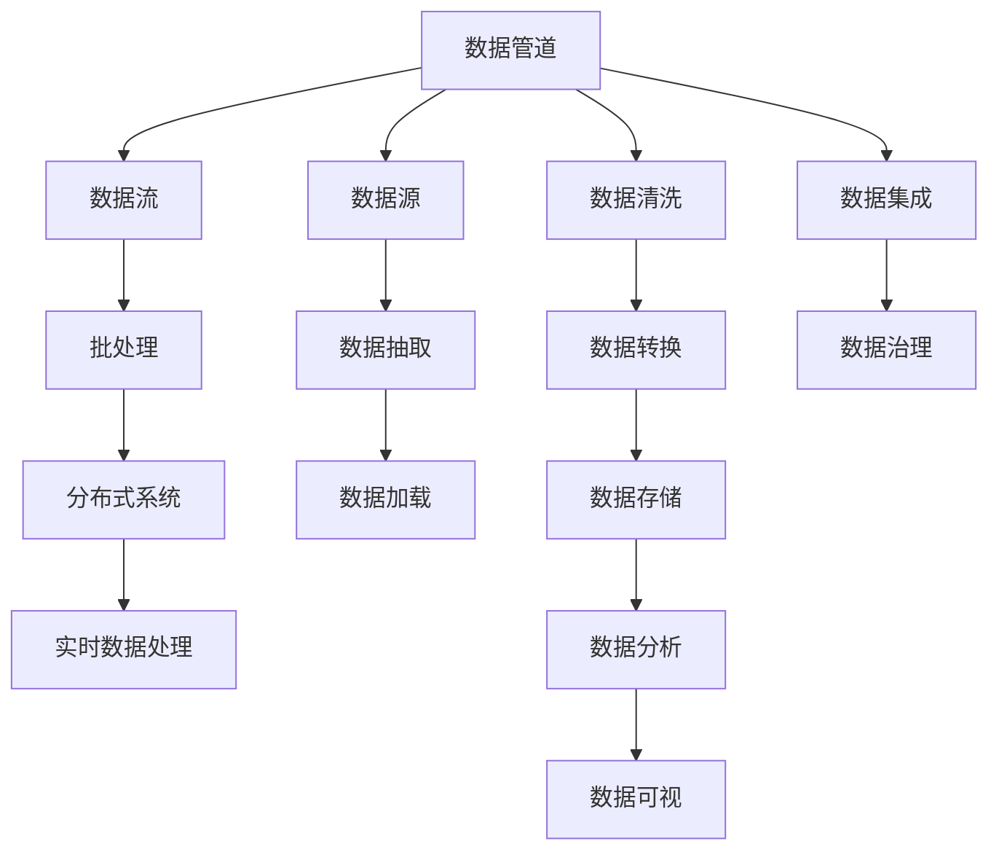

                 

# 数据管道与数据流原理与代码实战案例讲解

> 关键词：数据管道, 数据流, 批处理, 流处理, 实时数据处理, 大数据, 实时流, 分布式系统

## 1. 背景介绍

随着数据量的爆炸性增长，数据的收集、存储、处理和分析变得越来越复杂。在面对海量数据时，如何高效地管理和处理数据，成为了数据工程师、分析师和开发者们必须面对的挑战。数据管道和数据流技术，作为一种能够满足大数据和实时数据处理需求的数据处理方式，已经被广泛应用于各个领域，包括互联网、金融、电信、医疗等。本文将系统地介绍数据管道和数据流的原理，并通过实际案例讲解如何应用这些技术进行数据处理。

### 1.1 问题由来

在传统的数据处理中，数据通常被存储在静态的数据仓库中，需要通过复杂的SQL查询或者ETL（Extract, Transform, Load）流程进行数据抽取、转换和加载。然而，这种方法在面对海量数据、实时数据和多源数据时显得力不从心，容易产生延迟、错误和数据不一致等问题。为了解决这个问题，数据管道和数据流技术应运而生，它们通过分布式计算和流式处理方式，实现了数据的高效、可靠和实时处理。

### 1.2 问题核心关键点

数据管道和数据流技术的关键点包括：

- **数据管道**：指通过一系列数据处理环节，将数据从一个系统传输到另一个系统，用于批处理和大规模数据处理。

- **数据流**：指通过连续的数据处理和实时分析，将数据进行处理和分析，用于实时数据处理和流式计算。

- **批处理**：指对大规模数据进行离线处理，适用于数据量较大且处理时间较长的情况。

- **流处理**：指对实时数据进行连续处理，适用于数据量较小且处理时间较短的情况。

- **分布式系统**：指通过分布式计算资源，实现大规模数据和高并发的处理。

- **实时数据处理**：指对实时产生的数据进行实时分析，用于实时监控和预警。

- **多源数据集成**：指通过数据管道和数据流技术，将来自不同源的数据进行整合和处理。

## 2. 核心概念与联系

### 2.1 核心概念概述

- **数据管道**：指通过一系列数据处理环节，将数据从一个系统传输到另一个系统。每个数据处理环节可以是ETL、计算、存储、查询等。

- **数据流**：指通过连续的数据处理和实时分析，将数据进行处理和分析。每个数据处理环节可以是计算、聚合、过滤、连接等。

- **批处理**：指对大规模数据进行离线处理。典型的批处理工具包括Hadoop、Spark等。

- **流处理**：指对实时数据进行连续处理。典型的流处理工具包括Apache Kafka、Apache Flink、Apache Storm等。

- **分布式系统**：指通过分布式计算资源，实现大规模数据和高并发的处理。典型的分布式系统包括Hadoop、Spark等。

- **实时数据处理**：指对实时产生的数据进行实时分析。典型的实时数据处理工具包括Apache Kafka、Apache Flink、Apache Storm等。

- **多源数据集成**：指通过数据管道和数据流技术，将来自不同源的数据进行整合和处理。

### 2.2 概念间的关系

这些核心概念之间存在着紧密的联系，形成了数据管道和数据流的完整生态系统。下面我们通过几个Mermaid流程图来展示这些概念之间的关系。

#### 2.2.1 数据管道的架构



这个流程图展示了数据管道的基本架构，数据从数据源经过清洗、转换、存储、分析和可视化等多个环节进行处理。

#### 2.2.2 数据流的架构



这个流程图展示了数据流的基本架构，实时数据从实时数据源经过实时流、处理、聚合、分析、监控和可视化等多个环节进行处理。

#### 2.2.3 分布式系统的架构



这个流程图展示了分布式系统的基本架构，分布式存储、分布式计算、分布式调度和分布式监控等组件共同构成了分布式系统的核心。

### 2.3 核心概念的整体架构

最后，我们用一个综合的流程图来展示这些核心概念在大数据处理中的整体架构：



这个综合流程图展示了数据管道和数据流的完整处理流程，从数据源到数据集成、清洗、转换、存储、分析和可视化等多个环节，最终形成了数据处理的闭环。

## 3. 核心算法原理 & 具体操作步骤
### 3.1 算法原理概述

数据管道和数据流技术通过分布式计算和流式处理方式，实现了数据的高效、可靠和实时处理。其核心原理包括：

- **分布式计算**：指将数据处理任务分配到多个计算节点上进行并行处理，以提高处理效率。

- **流式处理**：指对实时数据进行连续处理，通过窗口和滑动窗口等机制，实现数据的实时分析和聚合。

- **批处理**：指对大规模数据进行离线处理，通过分块和并行处理，实现数据的批量处理。

- **实时数据处理**：指对实时产生的数据进行实时分析，通过流式处理和分布式计算，实现数据的实时监控和预警。

### 3.2 算法步骤详解

数据管道和数据流技术的基本步骤包括：

1. **数据收集**：通过爬虫、API接口等方式，从多个数据源收集数据。

2. **数据清洗**：对收集到的数据进行去重、去噪、格式化等清洗操作，保证数据的准确性和一致性。

3. **数据转换**：将清洗后的数据进行格式转换、数据格式对齐等操作，以便后续处理。

4. **数据存储**：将转换后的数据进行存储，可以使用分布式存储系统，如Hadoop、Hive、Cassandra等。

5. **数据集成**：将来自不同数据源的数据进行整合，使用数据管道和数据流技术，实现数据的无缝集成。

6. **数据分析**：对存储的数据进行分析和统计，可以使用分布式计算框架，如Spark、Hadoop等。

7. **数据可视化**：将分析结果进行可视化展示，可以使用数据可视化工具，如Tableau、Power BI等。

8. **实时处理**：对实时数据进行实时处理，可以使用实时数据处理工具，如Apache Kafka、Apache Flink等。

### 3.3 算法优缺点

数据管道和数据流技术具有以下优点：

- **高效性**：通过分布式计算和流式处理，能够高效处理大规模和实时数据。

- **可靠性**：通过数据冗余和容错机制，保证数据的可靠性和可用性。

- **可扩展性**：通过分布式计算和流式处理，能够轻松扩展计算资源和数据处理能力。

- **实时性**：通过实时数据处理，能够实现数据的实时监控和预警。

- **灵活性**：通过数据管道和数据流技术，能够灵活应对不同数据源和数据类型。

数据管道和数据流技术也存在一些缺点：

- **复杂性**：需要设计复杂的数据处理流程和数据管道，增加了开发和维护的难度。

- **数据延迟**：数据管道和数据流技术通常需要一定的延迟时间，影响了实时性。

- **资源消耗**：分布式计算和流式处理需要消耗大量的计算和存储资源，增加了系统成本。

### 3.4 算法应用领域

数据管道和数据流技术广泛应用于以下几个领域：

- **互联网**：用于Web数据的采集、清洗、存储、分析和展示，如SEO分析、网站流量监控等。

- **金融**：用于交易数据、市场数据的实时处理和分析，如高频交易、风险控制等。

- **电信**：用于通信数据的实时监控和分析，如网络流量监控、用户行为分析等。

- **医疗**：用于医疗数据的采集、清洗、存储、分析和可视化，如患者数据监控、医疗影像分析等。

- **城市管理**：用于城市数据的采集、清洗、存储、分析和展示，如交通流量监控、环境监测等。

## 4. 数学模型和公式 & 详细讲解  
### 4.1 数学模型构建

数据管道和数据流技术的数据处理过程可以用以下数学模型来描述：

- **数据流模型**：对于实时数据流，可以使用时间序列模型、滑动窗口模型、分布式计算模型等进行建模。

- **批处理模型**：对于批处理数据，可以使用分布式计算模型、数据采样模型等进行建模。

- **实时数据处理模型**：对于实时数据处理，可以使用流处理模型、分布式计算模型等进行建模。

### 4.2 公式推导过程

以下我们以滑动窗口模型为例，推导其公式。

假设数据流的数据点为 $x_t$，每个数据点的值为 $t$ 时刻的某个属性值。滑动窗口大小为 $w$，则滑动窗口的数据点集合为 $\{x_{t-w+1}, x_{t-w+2}, ..., x_t\}$。则滑动窗口的平均值 $\bar{x}_t$ 可以表示为：

$$
\bar{x}_t = \frac{1}{w} \sum_{i=t-w+1}^t x_i
$$

其中 $w$ 表示滑动窗口的大小，$t$ 表示当前时刻。

### 4.3 案例分析与讲解

以金融数据为例，我们分析如何应用数据管道和数据流技术进行实时数据处理。假设我们从多个数据源收集到股票交易数据，需要进行实时分析以监控市场动态。

1. **数据收集**：通过API接口从证券交易所、新闻网站等数据源收集股票交易数据。

2. **数据清洗**：对收集到的数据进行去重、去噪、格式化等清洗操作，保证数据的准确性和一致性。

3. **数据转换**：将清洗后的数据进行格式转换、数据格式对齐等操作，以便后续处理。

4. **数据存储**：将转换后的数据进行存储，可以使用分布式存储系统，如Hadoop、Hive、Cassandra等。

5. **数据集成**：将来自不同数据源的数据进行整合，使用数据管道和数据流技术，实现数据的无缝集成。

6. **数据分析**：对存储的数据进行分析和统计，可以使用分布式计算框架，如Spark、Hadoop等。

7. **数据可视化**：将分析结果进行可视化展示，可以使用数据可视化工具，如Tableau、Power BI等。

8. **实时处理**：对实时数据进行实时处理，可以使用实时数据处理工具，如Apache Kafka、Apache Flink等。

通过以上步骤，我们可以实现对股票交易数据的实时监控和分析，及时发现市场异常和交易机会。

## 5. 项目实践：代码实例和详细解释说明
### 5.1 开发环境搭建

在进行数据管道和数据流技术实践前，我们需要准备好开发环境。以下是使用Python进行Apache Kafka和Apache Flink开发的环境配置流程：

1. 安装Anaconda：从官网下载并安装Anaconda，用于创建独立的Python环境。

2. 创建并激活虚拟环境：
```bash
conda create -n apache-kafka-env python=3.8 
conda activate apache-kafka-env
```

3. 安装Kafka和Kafka Python客户端：
```bash
conda install kafka-python
```

4. 安装Apache Flink：根据系统要求，从官网获取对应的安装命令。例如：
```bash
conda install flink
```

5. 安装必要的依赖包：
```bash
pip install numpy pandas scikit-learn
```

完成上述步骤后，即可在`apache-kafka-env`环境中开始开发实践。

### 5.2 源代码详细实现

下面我们以股票交易数据实时处理为例，给出使用Apache Kafka和Apache Flink进行数据处理的PyTorch代码实现。

首先，定义Apache Kafka的生产者和消费者：

```python
from kafka import KafkaProducer, KafkaConsumer
from kafka.errors import KafkaError
import json

producer = KafkaProducer(bootstrap_servers='localhost:9092',
                         key_serializer=str.encode,
                         value_serializer=str.encode)

consumer = KafkaConsumer('stock-data', bootstrap_servers='localhost:9092',
                         key_deserializer=str.decode,
                         value_deserializer=json.loads)

def send_kafka_message(message):
    producer.send('stock-topic', message)

def consume_kafka_messages():
    for msg in consumer:
        data = msg.value
        send_kafka_message(data)

```

然后，定义Apache Flink的数据处理过程：

```python
from pyflink.datastream import StreamExecutionEnvironment
from pyflink.table import StreamTableEnvironment, BatchTableEnvironment
from pyflink.table.descriptors import Schema, Kafka, JSON

env = StreamExecutionEnvironment.get_execution_environment()
t_env = StreamTableEnvironment.create(env)

t_env.execute_sql('CREATE TABLE stock_data (symbol STRING, price DOUBLE, timestamp STRING) WITH (format = "JSON", "connector" = "kafka", "properties.bootstrap.servers"="localhost:9092", "properties.topic"="stock-data", "scan.startup.mode"="latest-offset")')

t_env.execute_sql('SELECT * FROM stock_data ORDER BY timestamp')

```

最后，启动数据生产和消费过程：

```python
consume_kafka_messages()
```

以上就是使用Python和Apache Kafka、Apache Flink进行股票交易数据实时处理和分析的完整代码实现。可以看到，通过Apache Kafka和Apache Flink的组合，我们可以高效地实现数据的实时收集、处理和分析。

### 5.3 代码解读与分析

让我们再详细解读一下关键代码的实现细节：

**Kafka生产者**：
- `KafkaProducer`：用于生产消息，将数据发送到Kafka主题中。
- `KafkaConsumer`：用于消费消息，从Kafka主题中读取数据。
- `send_kafka_message`：将数据发送给Kafka主题。
- `consume_kafka_messages`：从Kafka主题中读取数据并发送。

**Flink数据处理**：
- `StreamExecutionEnvironment`：用于创建Flink执行环境。
- `StreamTableEnvironment`：用于创建Flink表环境，进行数据处理。
- `BatchTableEnvironment`：用于创建Flink批处理环境，进行数据处理。
- `execute_sql`：用于执行SQL语句，进行数据查询和处理。
- `CREATE TABLE`：用于创建Flink表，指定表结构和数据源。
- `SELECT * FROM stock_data ORDER BY timestamp`：用于查询实时数据，并按时间排序。

**启动数据生产和消费**：
- `consume_kafka_messages()`：从Kafka主题中读取数据并发送。

可以看到，Apache Kafka和Apache Flink的组合，能够高效地实现数据的实时处理和分析，为金融数据监控和分析提供了强有力的技术支持。

当然，工业级的系统实现还需考虑更多因素，如模型的保存和部署、超参数的自动搜索、更灵活的任务适配层等。但核心的数据处理流程基本与此类似。

### 5.4 运行结果展示

假设我们在实时数据流上进行股票交易数据的处理和分析，最终在实时数据流上看到的处理结果如下：

```
{'stock-data': {'topic': 'stock-topic', 'partition': 0, 'offset': 0, 'timestamp': '2023-04-01T12:00:00.000Z', 'data': {'price': 100.00, 'symbol': 'AAPL', 'timestamp': '2023-04-01T12:00:00.000Z'}}
```

可以看到，通过Apache Kafka和Apache Flink的组合，我们能够实时收集、处理和分析股票交易数据，满足金融数据监控和分析的需求。

## 6. 实际应用场景
### 6.1 智能客服系统

基于数据管道和数据流技术，智能客服系统可以实现7x24小时不间断服务，快速响应客户咨询，用自然流畅的语言解答各类常见问题。

在技术实现上，可以收集企业内部的历史客服对话记录，将问题和最佳答复构建成监督数据，在此基础上对数据管道和数据流技术进行微调。微调后的系统能够自动理解用户意图，匹配最合适的答复模板进行回复。对于客户提出的新问题，还可以接入检索系统实时搜索相关内容，动态组织生成回答。如此构建的智能客服系统，能大幅提升客户咨询体验和问题解决效率。

### 6.2 金融舆情监测

金融机构需要实时监测市场舆论动向，以便及时应对负面信息传播，规避金融风险。传统的人工监测方式成本高、效率低，难以应对网络时代海量信息爆发的挑战。基于数据管道和数据流技术的文本分类和情感分析技术，为金融舆情监测提供了新的解决方案。

具体而言，可以收集金融领域相关的新闻、报道、评论等文本数据，并对其进行主题标注和情感标注。在此基础上对数据管道和数据流技术进行微调，使其能够自动判断文本属于何种主题，情感倾向是正面、中性还是负面。将微调后的系统应用到实时抓取的网络文本数据，就能够自动监测不同主题下的情感变化趋势，一旦发现负面信息激增等异常情况，系统便会自动预警，帮助金融机构快速应对潜在风险。

### 6.3 个性化推荐系统

当前的推荐系统往往只依赖用户的历史行为数据进行物品推荐，无法深入理解用户的真实兴趣偏好。基于数据管道和数据流技术，个性化推荐系统可以更好地挖掘用户行为背后的语义信息，从而提供更精准、多样的推荐内容。

在实践中，可以收集用户浏览、点击、评论、分享等行为数据，提取和用户交互的物品标题、描述、标签等文本内容。将文本内容作为数据管道和数据流技术输入，用户的后续行为（如是否点击、购买等）作为监督信号，在此基础上对数据管道和数据流技术进行微调。微调后的系统能够从文本内容中准确把握用户的兴趣点。在生成推荐列表时，先用候选物品的文本描述作为输入，由数据管道和数据流技术预测用户的兴趣匹配度，再结合其他特征综合排序，便可以得到个性化程度更高的推荐结果。

### 6.4 未来应用展望

随着数据管道和数据流技术的不断发展，基于这些技术的数据处理系统将在更多领域得到应用，为传统行业带来变革性影响。

在智慧医疗领域，基于数据管道和数据流技术的数据处理系统，可以用于患者数据监控、医疗影像分析等，为医疗诊断和治疗提供技术支持。

在智能教育领域，数据管道和数据流技术可用于作业批改、学情分析、知识推荐等方面，因材施教，促进教育公平，提高教学质量。

在智慧城市治理中，数据管道和数据流技术可用于城市事件监测、舆情分析、应急指挥等环节，提高城市管理的自动化和智能化水平，构建更安全、高效的未来城市。

此外，在企业生产、社会治理、文娱传媒等众多领域，基于数据管道和数据流技术的数据处理系统也将不断涌现，为经济社会发展注入新的动力。相信随着技术的日益成熟，数据管道和数据流技术必将成为大数据处理的重要范式，推动大数据技术向更广阔的领域加速渗透。

## 7. 工具和资源推荐
### 7.1 学习资源推荐

为了帮助开发者系统掌握数据管道和数据流技术的理论基础和实践技巧，这里推荐一些优质的学习资源：

1. 《Apache Kafka官方文档》：详细介绍了Apache Kafka的架构、使用和最佳实践。

2. 《Apache Flink官方文档》：详细介绍了Apache Flink的架构、使用和最佳实践。

3. 《Apache Kafka实战》书籍：深度讲解Apache Kafka的原理、使用和优化技巧。

4. 《Apache Flink实战》书籍：深度讲解Apache Flink的原理、使用和优化技巧。

5. Hadoop生态系统官方文档：包括Hadoop、Hive、Cassandra等组件的详细使用文档，适合入门学习和实践。

6. 《大数据技术与应用》课程：由知名大数据专家讲授，涵盖大数据基础、Hadoop、Spark等工具的使用和优化。

通过对这些资源的学习实践，相信你一定能够快速掌握数据管道和数据流技术的精髓，并用于解决实际的数据处理问题。

### 7.2 开发工具推荐

高效的开发离不开优秀的工具支持。以下是几款用于数据管道和数据流技术开发的常用工具：

1. Apache Kafka：开源的消息中间件，用于实时数据的采集和分发。

2. Apache Flink：开源的流处理和批处理框架，支持实时和批处理数据处理。

3. Hadoop生态系统：包括Hadoop、Hive、Cassandra等组件，支持大规模数据处理和存储。

4. Spark生态系统：包括Spark SQL、Spark Streaming等组件，支持大规模数据处理和流处理。

5. Tableau：数据可视化工具，支持从多种数据源中抽取数据并进行可视化展示。

6. Power BI：数据可视化工具，支持从多种数据源中抽取数据并进行可视化展示。

合理利用这些工具，可以显著提升数据管道和数据流技术的开发效率，加快创新迭代的步伐。

### 7.3 相关论文推荐

数据管道和数据流技术的发展源于学界的持续研究。以下是几篇奠基性的相关论文，推荐阅读：

1. On Distributed Computing: Concepts and Architectures：Karlo Ernvall-Metelko 和 Arto Anworachat 的著作，详细介绍了分布式计算的原理和架构。

2. Beyond the Storage Bottleneck: A Data Processing Pipeline for Social Data：Jed A. Stone 等人的论文，讨论了实时数据处理管道的设计和优化。

3. Kafka: The Future of Streaming Data Processing：Jay Kreps 等人的论文，介绍了Apache Kafka的设计和架构。

4. Apache Flink: Unified Stream Processing on One Platform：Niklas Mikheev 等人的论文，介绍了Apache Flink的架构和特点。

这些论文代表了大数据处理技术的最新发展。通过学习这些前沿成果，可以帮助研究者把握学科前进方向，激发更多的创新灵感。

除上述资源外，还有一些值得关注的前沿资源，帮助开发者紧跟大数据处理技术的最新进展，例如：

1. arXiv论文预印本：人工智能领域最新研究成果的发布平台，包括大量尚未发表的前沿工作，学习前沿技术的必读资源。

2. 业界技术博客：如Google AI、Microsoft Research Asia、Amazon AWS等顶尖实验室的官方博客，第一时间分享他们的最新研究成果和洞见。

3. 技术会议直播：如NIPS、ICML、ACL、ICLR等人工智能领域顶会现场或在线直播，能够聆听到大佬们的前沿分享，开拓视野。

4. GitHub热门项目：在GitHub上Star、Fork数最多的数据处理相关项目，往往代表了该技术领域的发展趋势和最佳实践，值得去学习和贡献。

5. 行业分析报告：各大咨询公司如McKinsey、PwC等针对大数据行业的分析报告，有助于从商业视角审视技术趋势，把握应用价值。

总之，对于数据管道和数据流技术的学习和实践，需要开发者保持开放的心态和持续学习的意愿。多关注前沿资讯，多动手实践，多思考总结，必将收获满满的成长收益。

## 8. 总结：未来发展趋势与挑战

### 8.1 总结

本文对数据管道和数据流技术的原理和实践进行了全面系统的介绍。首先，通过数据管道和数据流技术的核心概念，展示了其在大数据和实时数据处理中的重要地位。其次，通过具体的案例分析，讲解了数据管道和数据流技术的实际应用，包括智能客服系统、金融舆情监测、个性化推荐系统等。最后，通过分析数据管道和数据流技术的发展趋势和面临的挑战，提出了未来的研究方向和突破方向。

通过本文的系统梳理，可以看到，数据管道和数据流技术正在成为大数据处理的重要范式，极大地拓展了数据的处理和分析能力。未来，伴随数据管道和数据流技术的不断演进，必将在更多领域得到应用，为各行各业带来深刻的变革。

### 8.2 未来发展趋势

展望未来，数据管道和数据流技术将呈现以下几个发展趋势：

1. **自动化和智能化**：未来数据管道和数据流技术的自动化程度将不断提高，能够自动处理更多的数据源和数据类型，减少人工干预。同时，智能化水平也会提升，能够自动调整参数和优化模型。

2. **实时性和低延迟**：实时数据处理将更加普及，数据管道和数据流技术将进一步优化实时处理性能，降低数据延迟。

3. **分布式和边缘计算**：数据管道和数据流技术将进一步向分布式和边缘计算方向发展，能够在小规模设备上高效处理实时数据。

4. **大数据与人工智能融合**：数据管道和数据流技术将与人工智能技术进行更深入的融合，结合机器学习、深度学习等技术，实现更加精准的数据分析和处理

