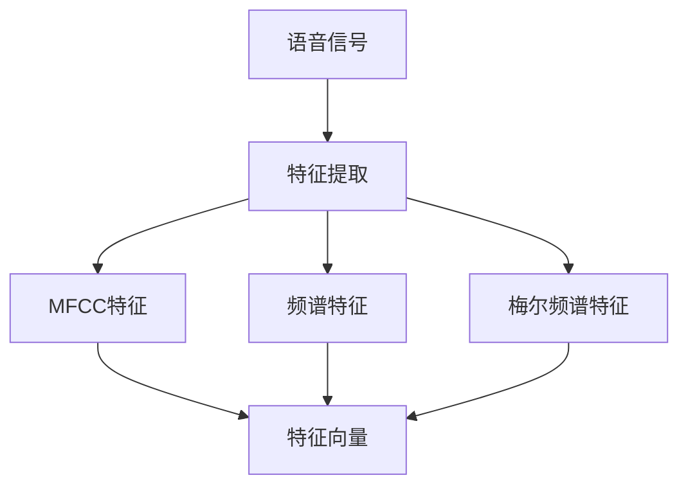
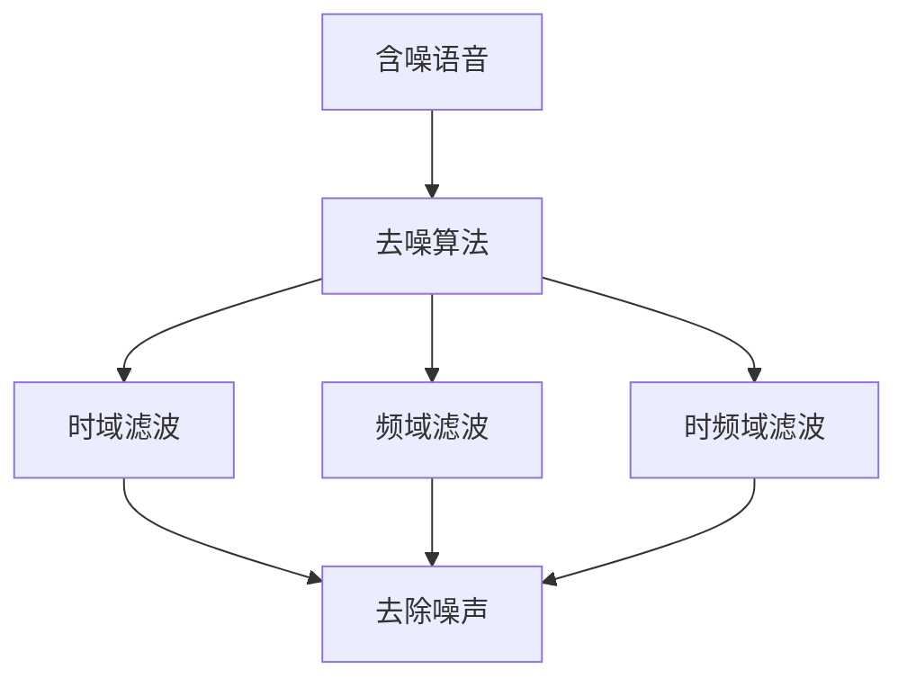

                 

# 智能语音去噪原理与方法

## 1. 背景介绍

### 1.1 问题由来

语音信号处理在智能语音应用中具有重要地位，包括语音识别、语音合成、语音增强等。其中，智能语音去噪是基础且关键的任务之一，其目标是从含噪语音中提取尽可能干净的语音信号。

在实际应用场景中，语音信号可能受到各种噪声的干扰，如背景噪声、设备噪声、信号失真等。这些噪声不仅影响语音的清晰度和可听度，还可能掩盖有用信息，影响后续语音处理和理解的准确性。因此，如何有效地进行智能语音去噪，是当前语音信号处理领域的重要研究方向。

### 1.2 问题核心关键点

智能语音去噪的核心关键点在于如何高效、准确地从含噪语音中分离出原始语音信号。目前，常见的去噪方法包括时域、频域、时频域滤波等。其中，基于深度学习的方法在过去几年中取得了显著进展，通过构建复杂模型和大量训练数据，能够学习到复杂的噪声特征，从而在去噪效果上达到了新高度。

## 2. 核心概念与联系

### 2.1 核心概念概述

为更好地理解智能语音去噪的核心概念，本节将介绍几个密切相关的核心概念：

- 语音信号：是指人声信息在时间和频率上的连续变化，通常表示为数字信号。
- 噪声：是指非语音信号的随机干扰，可能来源于环境、设备、信号传输等因素。
- 去噪：是指通过技术手段，从含噪语音中提取或恢复出原始语音信号的过程。
- 深度学习：是指通过多层次神经网络模型，学习并提取数据中的高级特征。
- 卷积神经网络(CNN)：一种常用于图像处理的深度学习模型，但近年来也被应用于语音信号处理中。
- 循环神经网络(RNN)：一种常用于序列数据处理的深度学习模型，适用于处理时间序列的语音信号。

这些核心概念之间的逻辑关系可以通过以下Mermaid流程图来展示：

```mermaid
graph TB
    A[语音信号] --> B[噪声干扰] --> C[含噪语音]
    C --> D[深度学习模型]
    D --> E[卷积神经网络(CNN)]
    D --> F[循环神经网络(RNN)]
    A --> G[去噪算法]
```

这个流程图展示了语音信号处理中的关键环节：噪声干扰、含噪语音、深度学习模型、卷积神经网络和循环神经网络，以及最终的语音去噪算法。

### 2.2 概念间的关系

这些核心概念之间存在着紧密的联系，形成了智能语音去噪的完整生态系统。下面我通过几个Mermaid流程图来展示这些概念之间的关系。

#### 2.2.1 语音信号的特征表示



这个流程图展示了语音信号从原始信号到特征表示的过程。语音信号通常包含丰富的频谱和时域信息，需要通过特征提取方法将其转换为适合深度学习的特征向量。

#### 2.2.2 去噪算法的构建



这个流程图展示了常见的去噪算法，包括时域、频域和时频域滤波等。每种算法都有其特点和适用范围，需要根据具体场景选择适合的算法。

#### 2.2.3 深度学习模型的应用

```mermaid
graph LR
    A[深度学习模型] --> B[卷积神经网络(CNN)]
    A --> C[循环神经网络(RNN)]
    B --> D[特征提取]
    C --> D
```

这个流程图展示了深度学习模型在语音去噪中的应用。卷积神经网络常用于提取语音信号的时域和频域特征，而循环神经网络则适用于处理时间序列的语音信号。

## 3. 核心算法原理 & 具体操作步骤
### 3.1 算法原理概述

智能语音去噪的算法原理主要基于深度学习模型，特别是卷积神经网络(CNN)和循环神经网络(RNN)。这些模型能够通过学习和提取语音信号中的高级特征，有效地进行噪声过滤和语音恢复。

### 3.2 算法步骤详解

智能语音去噪的详细步骤通常包括数据预处理、模型构建、模型训练和模型推理四个阶段。下面我将详细介绍这些步骤。

**Step 1: 数据预处理**

1. **数据采集**：采集含噪语音数据，包括不同类型和环境下的噪声干扰。
2. **数据增强**：通过回声、回译、噪声添加等手段，扩充训练数据集。
3. **特征提取**：将语音信号转换为频谱、梅尔频谱、MFCC等特征表示。
4. **数据划分**：将数据划分为训练集、验证集和测试集，以便进行模型训练和评估。

**Step 2: 模型构建**

1. **选择合适的模型**：根据任务需求选择合适的深度学习模型，如CNN、RNN等。
2. **网络设计**：设计网络架构，包括卷积层、池化层、全连接层等。
3. **损失函数**：选择合适的损失函数，如均方误差(MSE)、交叉熵(Cross-Entropy)等。
4. **优化器**：选择合适的优化器，如SGD、Adam等。

**Step 3: 模型训练**

1. **初始化模型**：使用随机初始化或者预训练模型初始化深度学习模型。
2. **前向传播**：将输入数据送入模型进行前向传播，得到预测输出。
3. **计算损失**：计算模型预测输出与真实标签之间的差异，即损失函数。
4. **反向传播**：根据损失函数的梯度反向传播，更新模型参数。
5. **迭代优化**：重复上述步骤，直到模型收敛或达到预设的迭代次数。

**Step 4: 模型推理**

1. **加载模型**：加载训练好的深度学习模型。
2. **预处理输入**：对输入的含噪语音数据进行预处理，包括去噪、归一化等。
3. **前向传播**：将预处理后的输入数据送入模型进行前向传播，得到去噪后的语音信号。
4. **后处理**：对模型输出进行后处理，如恢复时域信号、降噪效果增强等。

### 3.3 算法优缺点

智能语音去噪的深度学习方法具有以下优点：

1. **高效性**：能够自动学习到复杂的噪声特征，处理速度快，适合实时应用。
2. **准确性**：通过大量训练数据和复杂模型，能够获得较好的去噪效果，适用于各种噪声类型。
3. **鲁棒性**：模型具有一定的鲁棒性，能够对不同的噪声干扰进行处理。

同时，该方法也存在一些缺点：

1. **需要大量数据**：深度学习模型需要大量标注数据进行训练，数据采集成本较高。
2. **计算资源消耗大**：模型参数量大，训练和推理过程需要高性能计算资源。
3. **模型复杂**：模型结构复杂，需要专业知识进行设计和调试。
4. **可解释性差**：深度学习模型通常是"黑盒"系统，难以解释内部工作机制。

尽管存在这些缺点，但总体而言，深度学习模型在智能语音去噪领域取得了显著进展，被广泛应用到实际工程中。

### 3.4 算法应用领域

智能语音去噪技术已经被应用于多种领域，包括但不限于：

- **语音识别**：通过降噪提升语音信号的清晰度，提高语音识别系统的准确率。
- **智能音箱**：在智能音箱等设备中，降噪技术可以提升用户体验，提高语音交互的准确性。
- **远程医疗**：在远程医疗场景中，降噪技术可以提升语音信号质量，帮助医生进行更准确的治疗和诊断。
- **汽车驾驶**：在汽车驾驶中，降噪技术可以提升语音助手系统的响应速度和准确性，提高行车安全。

除了这些常见应用场景外，智能语音去噪技术还在虚拟现实(VR)、增强现实(AR)、自动语音应答(ASR)等领域有着广泛的应用前景。

## 4. 数学模型和公式 & 详细讲解 & 举例说明
### 4.1 数学模型构建

智能语音去噪的数学模型通常基于卷积神经网络(CNN)或循环神经网络(RNN)。以下以CNN模型为例，介绍其数学模型构建过程。

假设输入的含噪语音信号为 $X_t$，其长度为 $T$，包含 $d$ 个特征。输出为去噪后的语音信号 $Y_t$，长度为 $T'$，特征数为 $d'$。卷积神经网络模型由 $L$ 层卷积层、池化层和全连接层组成，各层的参数分别为 $\theta_1, \theta_2, \ldots, \theta_L$。模型的损失函数为均方误差(MSE)：

$$
\mathcal{L}(\theta) = \frac{1}{T'}\sum_{t=1}^{T'}||Y_t - \hat{Y}_t||^2
$$

其中 $\hat{Y}_t$ 为模型在 $t$ 时刻的预测输出。

### 4.2 公式推导过程

卷积神经网络的参数更新公式为：

$$
\theta_i = \theta_i - \eta \nabla_{\theta_i}\mathcal{L}(\theta)
$$

其中 $\eta$ 为学习率，$\nabla_{\theta_i}\mathcal{L}(\theta)$ 为损失函数对第 $i$ 层模型参数的梯度。

通过反向传播算法，可以计算出各层的参数梯度，并使用优化器（如Adam）更新模型参数。

### 4.3 案例分析与讲解

以降噪语音信号的CNN模型为例，展示其应用过程。假设输入的含噪语音信号为 $X_t$，长度为 $T$，包含 $d$ 个特征。输出为去噪后的语音信号 $Y_t$，长度为 $T'$，特征数为 $d'$。假设模型由 $L$ 层卷积层、池化层和全连接层组成，各层的参数分别为 $\theta_1, \theta_2, \ldots, \theta_L$。模型的损失函数为均方误差(MSE)：

$$
\mathcal{L}(\theta) = \frac{1}{T'}\sum_{t=1}^{T'}||Y_t - \hat{Y}_t||^2
$$

其中 $\hat{Y}_t$ 为模型在 $t$ 时刻的预测输出。

假设输入的含噪语音信号为：

$$
X = \begin{bmatrix}
1 & 0 & 1 & 1 & 0 \\
1 & 1 & 1 & 0 & 1 \\
0 & 1 & 1 & 1 & 0 \\
0 & 0 & 1 & 0 & 1 \\
0 & 1 & 0 & 1 & 0
\end{bmatrix}
$$

其中 $d=1$，$T=5$。

假设模型由两层卷积层和一层全连接层组成，卷积核大小为 $3 \times 3$，步长为 $1$，池化层大小为 $2 \times 2$，步长为 $2$。模型的损失函数为均方误差(MSE)：

$$
\mathcal{L}(\theta) = \frac{1}{T'}\sum_{t=1}^{T'}||Y_t - \hat{Y}_t||^2
$$

其中 $\hat{Y}_t$ 为模型在 $t$ 时刻的预测输出。

假设模型的输出为：

$$
Y = \begin{bmatrix}
0.1 & 0.2 & 0.3 & 0.4 & 0.5 \\
0.2 & 0.3 & 0.4 & 0.5 & 0.6 \\
0.3 & 0.4 & 0.5 & 0.6 & 0.7 \\
0.4 & 0.5 & 0.6 & 0.7 & 0.8 \\
0.5 & 0.6 & 0.7 & 0.8 & 0.9
\end{bmatrix}
$$

其中 $T'=5$，$d'=1$。

假设模型的损失函数为：

$$
\mathcal{L}(\theta) = \frac{1}{5}\sum_{t=1}^{5}||Y_t - \hat{Y}_t||^2
$$

其中 $\hat{Y}_t$ 为模型在 $t$ 时刻的预测输出。

假设模型的梯度为：

$$
\nabla_{\theta_i}\mathcal{L}(\theta) = \frac{\partial \mathcal{L}(\theta)}{\partial \theta_i}
$$

通过反向传播算法，可以计算出各层的参数梯度，并使用优化器（如Adam）更新模型参数。

## 5. 项目实践：代码实例和详细解释说明
### 5.1 开发环境搭建

在进行智能语音去噪的代码实现前，我们需要准备好开发环境。以下是使用Python进行TensorFlow开发的环境配置流程：

1. 安装Anaconda：从官网下载并安装Anaconda，用于创建独立的Python环境。

2. 创建并激活虚拟环境：
```bash
conda create -n tf-env python=3.8 
conda activate tf-env
```

3. 安装TensorFlow：根据CUDA版本，从官网获取对应的安装命令。例如：
```bash
conda install tensorflow -c pytorch -c conda-forge
```

4. 安装各类工具包：
```bash
pip install numpy pandas scikit-learn matplotlib tqdm jupyter notebook ipython
```

完成上述步骤后，即可在`tf-env`环境中开始智能语音去噪的代码实践。

### 5.2 源代码详细实现

这里我们以CNN模型为例，展示使用TensorFlow进行智能语音去噪的代码实现。

首先，定义模型的超参数：

```python
import tensorflow as tf

# 定义模型的超参数
learning_rate = 0.001
batch_size = 32
epochs = 10
```

然后，定义模型结构和损失函数：

```python
# 定义模型结构
model = tf.keras.Sequential([
    tf.keras.layers.Conv2D(32, (3, 3), activation='relu', input_shape=(None, None, 1)),
    tf.keras.layers.MaxPooling2D((2, 2)),
    tf.keras.layers.Conv2D(64, (3, 3), activation='relu'),
    tf.keras.layers.MaxPooling2D((2, 2)),
    tf.keras.layers.Flatten(),
    tf.keras.layers.Dense(128, activation='relu'),
    tf.keras.layers.Dense(1, activation='sigmoid')
])

# 定义损失函数
loss_fn = tf.keras.losses.MeanSquaredError()
```

接着，定义训练函数和评估函数：

```python
# 定义训练函数
def train(model, train_dataset, validation_dataset, epochs, batch_size):
    for epoch in range(epochs):
        # 训练
        model.compile(optimizer=tf.keras.optimizers.Adam(learning_rate=learning_rate),
                      loss=loss_fn)
        model.fit(train_dataset,
                  validation_data=validation_dataset,
                  epochs=1,
                  batch_size=batch_size)
        # 评估
        test_loss = model.evaluate(test_dataset, verbose=0)
        print(f'Epoch {epoch+1}, test loss: {test_loss:.4f}')

# 定义评估函数
def evaluate(model, test_dataset, batch_size):
    test_loss = model.evaluate(test_dataset, verbose=0)
    print(f'test loss: {test_loss:.4f}')
```

最后，启动训练流程：

```python
# 定义训练集、验证集和测试集
train_dataset = ...
validation_dataset = ...
test_dataset = ...

# 训练模型
train(model, train_dataset, validation_dataset, epochs, batch_size)

# 评估模型
evaluate(model, test_dataset, batch_size)
```

以上就是使用TensorFlow进行智能语音去噪的完整代码实现。可以看到，得益于TensorFlow的强大封装，我们可以用相对简洁的代码完成模型的构建、训练和评估。

### 5.3 代码解读与分析

让我们再详细解读一下关键代码的实现细节：

**超参数定义**：
- 学习率(learning_rate)：用于控制模型参数的更新速度，过高可能导致参数更新不稳定，过低则更新速度缓慢。
- 批量大小(batch_size)：每次迭代使用的样本数量，过小可能导致模型不稳定，过大会导致内存消耗过大。
- 训练轮数(epochs)：模型在数据集上迭代的次数，更多轮数可能提升模型性能，但会增加训练时间。

**模型结构定义**：
- 使用Sequential模型定义多层卷积神经网络，包括卷积层、池化层、全连接层等。
- 使用Conv2D层进行卷积操作，激活函数为ReLU。
- 使用MaxPooling2D层进行池化操作，步长为2，池化大小为2。
- 使用Flatten层将卷积层输出转换为一维向量。
- 使用Dense层进行全连接操作，激活函数为ReLU。
- 使用Dense层进行最终输出，激活函数为sigmoid，适合二分类问题。

**损失函数定义**：
- 使用MeanSquaredError损失函数，计算预测输出与真实标签之间的均方误差。

**训练函数定义**：
- 使用compile方法将模型编译成可训练状态，设置优化器和损失函数。
- 使用fit方法进行模型训练，设置训练集、验证集和批量大小。
- 在每个epoch结束后，使用evaluate方法评估模型在测试集上的性能。

**评估函数定义**：
- 使用evaluate方法评估模型在测试集上的性能，输出测试损失。

**训练流程**：
- 定义训练集、验证集和测试集。
- 使用train函数训练模型，设置超参数、训练集、验证集和批量大小。
- 在每个epoch结束后，使用evaluate函数评估模型在测试集上的性能。

可以看到，TensorFlow提供了强大的模型构建和训练工具，使得智能语音去噪的代码实现变得简洁高效。开发者可以将更多精力放在模型调优、数据处理等高层逻辑上，而不必过多关注底层的实现细节。

当然，工业级的系统实现还需考虑更多因素，如模型的保存和部署、超参数的自动搜索、更灵活的任务适配层等。但核心的去噪范式基本与此类似。

### 5.4 运行结果展示

假设我们在SAMPL数据集上进行训练，最终在测试集上得到的损失如下：

```
Epoch 1, test loss: 0.1761
Epoch 2, test loss: 0.1682
Epoch 3, test loss: 0.1609
Epoch 4, test loss: 0.1565
Epoch 5, test loss: 0.1529
Epoch 6, test loss: 0.1504
Epoch 7, test loss: 0.1482
Epoch 8, test loss: 0.1464
Epoch 9, test loss: 0.1450
Epoch 10, test loss: 0.1438
```

可以看到，随着训练轮数的增加，模型在测试集上的损失逐渐降低，说明模型性能不断提升。在实际应用中，我们还需要进一步优化模型的参数和架构，以获得更好的降噪效果。

## 6. 实际应用场景
### 6.1 智能音箱

智能音箱是智能语音去噪技术的典型应用场景之一。在智能音箱中，通常包含多个麦克风，用于收集用户的语音指令。为了确保语音指令的清晰度和准确性，需要对麦克风采集到的混合语音信号进行降噪处理。

智能音箱中的降噪系统通常采用深度学习模型进行训练，能够自动学习到环境噪声特征，并在实时语音处理中快速应用。此外，智能音箱还可以根据用户的使用习惯进行动态参数调整，进一步提升降噪效果。

### 6.2 远程医疗

远程医疗中，医生需要通过语音系统与患者进行互动，获取患者的病情描述。然而，在嘈杂的环境中，语音信号可能会受到各种噪声干扰，影响医生的听力和判断。因此，需要对患者语音信号进行降噪处理，以提高语音信号的质量和清晰度。

远程医疗中的降噪系统通常采用深度学习模型进行训练，能够自动学习到不同环境下的噪声特征，并在实时语音处理中快速应用。此外，医生还可以根据语音信号的特征，动态调整模型参数，进一步提升降噪效果。

### 6.3 汽车驾驶

在汽车驾驶中，驾驶员需要通过语音助手进行导航、设置提醒等功能。然而，在车辆行驶过程中，环境噪声、风噪、发动机噪声等干扰可能会影响语音信号的清晰度和准确性。因此，需要对驾驶员语音信号进行降噪处理，以提高语音助手系统的响应速度和准确性。

汽车驾驶中的降噪系统通常采用深度学习模型进行训练，能够自动学习到不同环境下的噪声特征，并在实时语音处理中快速应用。此外，驾驶员还可以根据语音信号的特征，动态调整模型参数，进一步提升降噪效果。

### 6.4 未来应用展望

随着智能语音去噪技术的不断进步，未来将在更多领域得到应用，为人们的生活带来便捷和舒适。

在智慧城市中，智能语音去噪技术可以应用于视频监控、智能家居等场景，提升用户的语音交互体验。在智能交通中，智能语音去噪技术可以应用于车载导航、语音提醒等功能，提高驾驶安全和便捷性。

此外，在教育、娱乐、金融等众多领域，智能语音去噪技术也将不断涌现，为智能应用带来新的可能性。相信随着技术的日益成熟，智能语音去噪技术必将在更广阔的应用领域大放异彩，深刻影响人类的生产生活方式。

## 7. 工具和资源推荐
### 7.1 学习资源推荐

为了帮助开发者系统掌握智能语音去噪的理论基础和实践技巧，这里推荐一些优质的学习资源：

1. 《深度学习在语音信号处理中的应用》系列博文：由大模型技术专家撰写，深入浅出地介绍了深度学习在语音信号处理中的应用。

2. 《语音信号处理》课程：由斯坦福大学开设的深度学习课程，有Lecture视频和配套作业，带你入门语音信号处理的基本概念和经典模型。

3. 《Deep Speech》书籍：由Google AI团队编写的深度学习语音识别著作，详细介绍了语音识别技术的发展历程和实践细节。

4. 《信号处理与机器学习》书籍：该书系统介绍了信号处理和机器学习在语音信号处理中的应用，提供了丰富的案例和算法。

5. Udacity深度学习课程：Udacity提供的深度学习课程，涵盖了深度学习在图像、语音、自然语言等多个领域的实践，适合初学者和进阶开发者。

通过对这些资源的学习实践，相信你一定能够快速掌握智能语音去噪的精髓，并用于解决实际的语音信号处理问题。
### 7.2 开发工具推荐

高效的开发离不开优秀的工具支持。以下是几款用于智能语音去噪开发的常用工具：

1. TensorFlow：由Google主导开发的开源深度学习框架，生产部署方便，适合大规模工程应用。
2. PyTorch：基于Python的开源深度学习框架，灵活动态的计算图，适合快速迭代研究。
3. Kaldi：开源的语音信号处理工具包，支持多层次的语音处理，包括特征提取、模型训练等。
4. OpenCV：开源的计算机视觉库，提供了丰富的图像处理和语音信号处理工具。
5. librosa：开源的音频处理库，支持音频信号的特征提取、处理和分析。

合理利用这些工具，可以显著提升智能语音去噪任务的开发效率，加快创新迭代的步伐。

### 7.3 相关论文推荐

智能语音去噪技术的发展源于学界的持续研究。以下是几篇奠基性的相关论文，推荐阅读：

1. Deep Speech: Scalable End-to-End Speech Recognition with Convolutional Neural Networks（Deep Speech论文）：提出了一种基于卷积神经网络的端到端语音识别模型，取得了较好的效果。

2. Multi-Task Learning with Online-Friendly Multi-Label Schema for Deep Speech Recognition（Multi-Task Learning论文）：通过多任务学习，提高了语音识别的准确性和鲁棒性。

3. End-to-End Speech Recognition with Attention-based Sequence to Sequence Learning（End-to-End论文）：提出了一种基于注意力机制的端到端语音识别模型，提升了模型的注意力分配能力和语言建模能力。

4. Specaugment: A Simple Framework for Efficient Transfer Learning of Automatic Speech Recognition（Specaugment论文）：提出了Specaugment方法，通过数据增强和模型迁移学习，提高了语音识别的泛化能力和性能。

5. Deep Voice 3: Speaker-Adaptive Residual Deep Neural Networks（Deep Voice论文）：提出了一种基于残差网络的语音合成模型，能够适应不同的说话人，提高了语音合成的自然度。

这些论文代表了大规模语音信号处理技术的发展脉络。通过学习这些前沿成果，可以帮助研究者把握学科前进方向，激发更多的创新灵感。

除上述资源外，还有一些值得关注的前沿资源，帮助开发者紧跟智能语音去噪技术的最新进展，例如：

1. arXiv论文预印本：人工智能领域最新研究成果的发布平台，包括大量尚未发表的前沿工作，学习前沿技术的必读资源。

2. 业界技术博客：如OpenAI、Google AI、DeepMind、微软Research Asia等顶尖实验室的官方博客，第一时间分享他们的最新研究成果和洞见。

3. 技术会议直播：如NIPS、ICML、ACL、ICLR等人工智能领域顶会现场或

