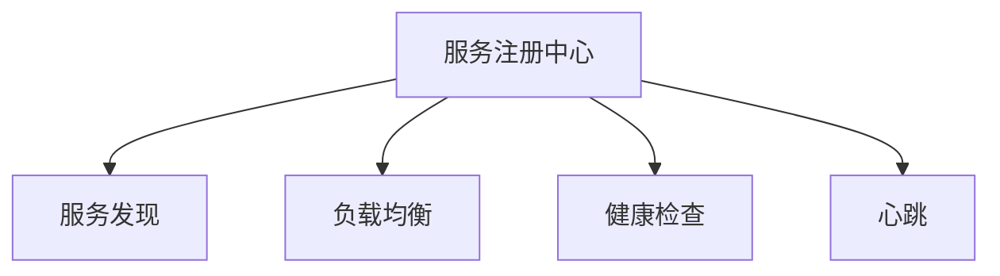
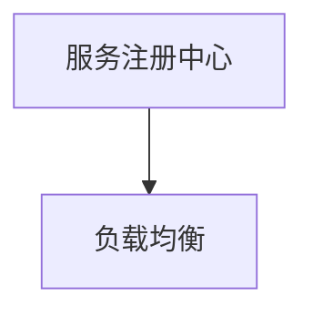
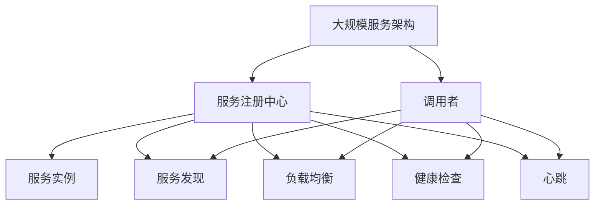

                 

# 服务注册中心的实例应用

## 1. 背景介绍

### 1.1 问题由来

在微服务架构中，随着系统的复杂度不断提升，各服务之间的依赖关系也变得越来越复杂。为了降低服务间的耦合度，提高系统的可维护性和扩展性，服务注册中心（Service Registry）应运而生。它用于集中管理所有服务实例，并为服务的调用者提供服务发现和负载均衡等功能。服务注册中心可以极大地简化服务间的通信和调用，提高系统的稳定性和可扩展性。

### 1.2 问题核心关键点

服务注册中心的核心功能包括服务注册、服务发现、负载均衡、健康检查和心跳等。其中，服务注册是服务注册中心的基石，它负责将服务实例的信息存储在中心，以供调用者查询；服务发现则是在调用者查询服务时，根据注册中心提供的信息，动态地选择可用的服务实例；负载均衡则是在多个服务实例中，均衡地分配请求，以避免因单点故障导致系统崩溃；健康检查和心跳则用于监控服务的可用性，及时发现并处理故障。

### 1.3 问题研究意义

研究服务注册中心的实例应用，对于提升微服务架构的稳定性和可扩展性，优化系统的性能和可靠性，具有重要的意义：

1. 简化服务调用：通过服务注册中心，调用者可以方便地查询到服务实例的地址和端口，无需关心服务的具体实现细节。
2. 提升系统稳定性：服务注册中心提供的服务发现和负载均衡功能，可以避免单点故障，提高系统的容错能力和稳定性。
3. 提高系统扩展性：服务注册中心集中管理所有服务实例，使得新服务的添加和修改更加容易，提高了系统的扩展性。
4. 优化系统性能：服务注册中心可以根据调用者的负载情况，动态地选择可用的服务实例，避免了因负载不均导致的系统瓶颈。
5. 增强系统安全性：服务注册中心提供的服务健康检查和心跳功能，可以及时发现并处理故障，提高了系统的可用性和安全性。

## 2. 核心概念与联系

### 2.1 核心概念概述

为更好地理解服务注册中心的实例应用，本节将介绍几个密切相关的核心概念：

- 服务注册中心（Service Registry）：用于集中管理所有服务实例，提供服务发现、负载均衡、健康检查等功能。
- 服务发现（Service Discovery）：在调用者查询服务时，根据注册中心提供的信息，动态地选择可用的服务实例。
- 负载均衡（Load Balancing）：在多个服务实例中，均衡地分配请求，避免因单点故障导致系统崩溃。
- 健康检查（Health Check）：监控服务的可用性，及时发现并处理故障。
- 心跳（Heartbeat）：服务实例定期向注册中心发送心跳，告知注册中心自身的可用状态。

这些核心概念之间的逻辑关系可以通过以下Mermaid流程图来展示：



这个流程图展示了这个核心概念的关联关系：

1. 服务注册中心负责集中管理所有服务实例，并提供服务发现、负载均衡、健康检查和心跳功能。
2. 服务发现和负载均衡是服务注册中心的重要功能，用于动态地选择可用的服务实例，提高系统的稳定性和可扩展性。
3. 健康检查和心跳则用于监控服务的可用性，及时发现并处理故障，保障系统的高可用性。

### 2.2 概念间的关系

这些核心概念之间存在着紧密的联系，形成了服务注册中心的完整生态系统。下面我通过几个Mermaid流程图来展示这些概念之间的关系。

#### 2.2.1 服务注册中心和服务发现的关系


这个流程图展示了服务注册中心和服务发现的基本关系：

1. 服务注册中心负责服务实例的注册和管理。
2. 调用者通过服务发现功能，可以动态地查询到服务实例的地址和端口，从而实现服务调用。

#### 2.2.2 服务注册中心和负载均衡的关系



这个流程图展示了服务注册中心和负载均衡的关系：

1. 服务注册中心提供的服务实例信息，用于负载均衡的功能。
2. 负载均衡器可以根据注册中心提供的服务实例信息，动态地选择可用的服务实例，以均衡地分配请求。

#### 2.2.3 服务注册中心和健康检查的关系


这个流程图展示了服务注册中心和健康检查的关系：

1. 服务注册中心提供的服务实例信息，用于健康检查的功能。
2. 健康检查器定期检查服务实例的健康状态，将结果告知注册中心，供服务调用者参考。

#### 2.2.4 服务注册中心和心跳的关系


这个流程图展示了服务注册中心和心跳的关系：

1. 服务注册中心提供的服务实例信息，用于心跳的功能。
2. 服务实例定期向注册中心发送心跳，告知注册中心自身的可用状态。

### 2.3 核心概念的整体架构

最后，我们用一个综合的流程图来展示这些核心概念在大规模服务架构中的整体架构：



这个综合流程图展示了服务注册中心在大型服务架构中的整体架构：

1. 大规模服务架构由多个服务实例组成。
2. 服务实例在服务注册中心注册，并定期发送心跳，告知注册中心自身的可用状态。
3. 服务注册中心提供服务发现、负载均衡、健康检查和心跳功能，供服务调用者查询和调用服务实例。
4. 调用者通过服务发现和负载均衡，动态地选择可用的服务实例，进行服务调用。
5. 健康检查和心跳功能用于监控服务实例的健康状态，及时发现并处理故障，保障系统的高可用性。

通过这个综合流程图，我们可以更清晰地理解服务注册中心在大规模服务架构中的作用和重要性，以及各个功能之间的关联关系。

## 3. 核心算法原理 & 具体操作步骤

### 3.1 算法原理概述

服务注册中心的核心算法包括服务注册、服务发现、负载均衡和健康检查等。这里以服务注册和负载均衡为例，详细讲解其原理和具体操作步骤。

#### 3.1.1 服务注册算法

服务注册算法包括服务实例的注册和更新，具体步骤如下：

1. 服务实例通过服务注册中心提供的API，将自己的地址和端口信息提交给注册中心。
2. 注册中心将服务实例的信息存储在内部数据库或分布式存储系统中，供后续调用者查询。
3. 服务实例在注册成功后，可以开始接收调用者的请求，提供服务。

#### 3.1.2 负载均衡算法

负载均衡算法用于动态地选择可用的服务实例，具体步骤如下：

1. 调用者在调用服务时，向服务注册中心发送查询请求，获取可用的服务实例列表。
2. 注册中心根据服务实例的状态和负载情况，动态地选择可用的服务实例。
3. 调用者根据负载均衡器返回的服务实例列表，选择一个合适的服务实例进行请求。

### 3.2 算法步骤详解

#### 3.2.1 服务注册步骤详解

1. 服务实例通过HTTP或TCP协议，向注册中心提交注册请求。注册请求包括服务实例的地址和端口信息。
2. 注册中心接收到注册请求后，将服务实例的信息存储在内部数据库或分布式存储系统中，供后续调用者查询。
3. 注册中心向服务实例返回注册成功响应，服务实例开始接收调用者的请求。

#### 3.2.2 服务发现步骤详解

1. 调用者在调用服务时，通过HTTP或TCP协议，向注册中心发送查询请求。查询请求包括服务名称和版本号等信息。
2. 注册中心根据查询请求，从内部数据库或分布式存储系统中，查询到可用的服务实例列表。
3. 注册中心向调用者返回服务实例列表，供调用者选择合适的服务实例进行请求。

#### 3.2.3 负载均衡步骤详解

1. 调用者在调用服务时，向服务注册中心发送查询请求，获取可用的服务实例列表。
2. 注册中心根据服务实例的状态和负载情况，动态地选择可用的服务实例。
3. 负载均衡器根据服务实例列表，动态地选择可用的服务实例，并将请求转发到该实例。

#### 3.2.4 健康检查步骤详解

1. 注册中心定期向服务实例发送健康检查请求，检查服务实例的健康状态。
2. 服务实例接收到健康检查请求后，返回健康状态信息，如服务是否可用、负载情况等。
3. 注册中心根据服务实例的健康状态信息，动态地选择可用的服务实例，供调用者查询和调用。

#### 3.2.5 心跳步骤详解

1. 服务实例定期向注册中心发送心跳，告知注册中心自身的可用状态。
2. 注册中心接收到服务实例的心跳后，更新服务实例的健康状态信息，供后续查询和使用。

### 3.3 算法优缺点

服务注册中心的核心算法具有以下优点：

1. 简化服务调用：通过服务注册中心，调用者可以方便地查询到服务实例的地址和端口，无需关心服务的具体实现细节。
2. 提升系统稳定性：服务注册中心提供的服务发现和负载均衡功能，可以避免单点故障，提高系统的容错能力和稳定性。
3. 提高系统扩展性：服务注册中心集中管理所有服务实例，使得新服务的添加和修改更加容易，提高了系统的扩展性。
4. 优化系统性能：服务注册中心可以根据调用者的负载情况，动态地选择可用的服务实例，避免了因负载不均导致的系统瓶颈。

同时，服务注册中心也存在以下缺点：

1. 依赖于注册中心：服务注册中心是服务调用和发现的核心，一旦注册中心故障，所有服务实例都可能无法正常工作。
2. 单点故障风险：服务注册中心自身也可能成为单点故障的瓶颈，需要做好故障转移和冗余设计。
3. 复杂度增加：服务注册中心需要处理大量的注册、查询、负载均衡等操作，增加了系统的复杂度。

### 3.4 算法应用领域

服务注册中心的核心算法在大规模微服务架构中得到了广泛的应用，适用于以下场景：

1. 分布式系统：在分布式系统中，服务实例分布在不同的节点上，服务注册中心可以集中管理所有服务实例，提供服务发现、负载均衡等功能，保障系统的稳定性和可扩展性。
2. 云服务：在云服务中，服务实例可能分布在不同的云平台和区域，服务注册中心可以跨云平台和区域，提供一致的服务发现和负载均衡功能，保障云服务的高可用性。
3. 微服务架构：在微服务架构中，服务实例数量庞大，服务注册中心可以集中管理所有服务实例，提供高效的服务发现和负载均衡功能，优化系统性能。
4. 物联网系统：在物联网系统中，设备和服务实例数量庞大，服务注册中心可以集中管理所有设备和服务实例，提供高效的服务发现和负载均衡功能，保障系统的稳定性和可扩展性。
5. 大数据系统：在大数据系统中，服务实例可能分布在不同的集群和节点上，服务注册中心可以集中管理所有服务实例，提供高效的服务发现和负载均衡功能，优化系统性能。

## 4. 数学模型和公式 & 详细讲解  
### 4.1 数学模型构建

在服务注册中心的核心算法中，服务注册、服务发现、负载均衡和健康检查等功能的实现，都可以通过数学模型来描述。这里以服务注册和负载均衡为例，详细讲解其数学模型构建。

#### 4.1.1 服务注册模型的构建

服务注册模型可以表示为以下公式：

$$
S = \{(s_i, p_i)\}_{i=1}^N
$$

其中，$S$表示服务实例的集合，$(s_i, p_i)$表示第$i$个服务实例的地址和端口，$N$表示服务实例的总数。

#### 4.1.2 服务发现模型的构建

服务发现模型可以表示为以下公式：

$$
Q = (q_1, q_2, \ldots, q_m)
$$

其中，$Q$表示查询请求的集合，$q_j$表示第$j$个查询请求，$m$表示查询请求的总数。

#### 4.1.3 负载均衡模型的构建

负载均衡模型可以表示为以下公式：

$$
L = \{(l_i, w_i)\}_{i=1}^M
$$

其中，$L$表示负载均衡器选择的服务实例集合，$(l_i, w_i)$表示第$i$个服务实例的地址和权重，$M$表示负载均衡器选择的服务实例的总数。

#### 4.1.4 健康检查模型的构建

健康检查模型可以表示为以下公式：

$$
H = \{(h_i, s_i)\}_{i=1}^N
$$

其中，$H$表示健康检查结果的集合，$(h_i, s_i)$表示第$i$个服务实例的健康状态和负载情况，$N$表示服务实例的总数。

#### 4.1.5 心跳模型的构建

心跳模型可以表示为以下公式：

$$
C = \{(c_i, t_i)\}_{i=1}^N
$$

其中，$C$表示心跳结果的集合，$(c_i, t_i)$表示第$i$个服务实例的心跳时间和状态，$N$表示服务实例的总数。

### 4.2 公式推导过程

#### 4.2.1 服务注册公式推导

服务注册算法可以表示为以下公式：

$$
R = S \cup \{(s_i, p_i)\}_{i=1}^N
$$

其中，$R$表示注册后的服务实例集合，$S$表示原始的服务实例集合，$(s_i, p_i)$表示第$i$个服务实例的地址和端口，$N$表示服务实例的总数。

#### 4.2.2 服务发现公式推导

服务发现算法可以表示为以下公式：

$$
D = \{(d_j, (s_i, p_i))\}_{j=1}^m
$$

其中，$D$表示查询结果的集合，$d_j$表示第$j$个查询请求，$(s_i, p_i)$表示第$i$个服务实例的地址和端口，$m$表示查询请求的总数，$N$表示服务实例的总数。

#### 4.2.3 负载均衡公式推导

负载均衡算法可以表示为以下公式：

$$
B = \{(l_i, w_i)\}_{i=1}^M
$$

其中，$B$表示负载均衡器选择的服务实例集合，$(l_i, w_i)$表示第$i$个服务实例的地址和权重，$M$表示负载均衡器选择的服务实例的总数。

#### 4.2.4 健康检查公式推导

健康检查算法可以表示为以下公式：

$$
H = \{(h_i, s_i)\}_{i=1}^N
$$

其中，$H$表示健康检查结果的集合，$(h_i, s_i)$表示第$i$个服务实例的健康状态和负载情况，$N$表示服务实例的总数。

#### 4.2.5 心跳公式推导

心跳算法可以表示为以下公式：

$$
C = \{(c_i, t_i)\}_{i=1}^N
$$

其中，$C$表示心跳结果的集合，$(c_i, t_i)$表示第$i$个服务实例的心跳时间和状态，$N$表示服务实例的总数。

### 4.3 案例分析与讲解

#### 4.3.1 服务注册案例分析

假设有一个包含3个服务实例的系统，服务实例的地址和端口信息如下：

$$
S = \{(s_1, p_1), (s_2, p_2), (s_3, p_3)\}
$$

其中，$(s_1, p_1) = (192.168.1.100:8080)$，$(s_2, p_2) = (192.168.1.101:8080)$，$(s_3, p_3) = (192.168.1.102:8080)$。

调用者向服务注册中心提交注册请求，注册成功后，服务实例的集合$R$如下：

$$
R = \{(s_1, p_1), (s_2, p_2), (s_3, p_3)\}
$$

#### 4.3.2 服务发现案例分析

假设调用者向服务注册中心发送查询请求，查询服务名称为“user-service”的服务实例。查询结果$D$如下：

$$
D = \{(q_1, (s_1, p_1)), (q_1, (s_2, p_2)), (q_1, (s_3, p_3))\}
$$

其中，$q_1$表示服务名称为“user-service”的查询请求。

#### 4.3.3 负载均衡案例分析

假设调用者在调用服务时，向负载均衡器发送请求，请求服务名称为“user-service”。负载均衡器根据服务实例的负载情况，选择服务实例$(s_1, p_1)$进行响应，响应结果$B$如下：

$$
B = \{(l_1, w_1)\}
$$

其中，$(l_1, w_1) = (192.168.1.100:8080, 0.7)$，表示选择服务实例$(s_1, p_1)$进行响应，权重为0.7。

#### 4.3.4 健康检查案例分析

假设注册中心定期向服务实例发送健康检查请求，检查服务实例的健康状态和负载情况。健康检查结果$H$如下：

$$
H = \{(h_1, s_1), (h_2, s_2), (h_3, s_3)\}
$$

其中，$(h_1, s_1) = (True, High)$，$(h_2, s_2) = (False, Medium)$，$(h_3, s_3) = (True, Low)$，表示服务实例$(s_1, p_1)$和$(s_3, p_3)$可用，服务实例$(s_2, p_2)$不可用，且$(s_1, p_1)$的负载较高。

#### 4.3.5 心跳案例分析

假设服务实例定期向注册中心发送心跳，告知注册中心自身的可用状态。心跳结果$C$如下：

$$
C = \{(c_1, t_1), (c_2, t_2), (c_3, t_3)\}
$$

其中，$(c_1, t_1) = (OK, 2020-01-01 08:00:00)$，$(c_2, t_2) = (Error, 2020-01-01 09:00:00)$，$(c_3, t_3) = (OK, 2020-01-01 09:30:00)$，表示服务实例$(s_1, p_1)$和$(s_3, p_3)$可用，服务实例$(s_2, p_2)$不可用。

## 5. 项目实践：代码实例和详细解释说明

### 5.1 开发环境搭建

在进行服务注册中心的实例应用实践前，我们需要准备好开发环境。以下是使用Spring Boot框架开发的服务注册中心的环境配置流程：

1. 安装Java Development Kit（JDK）：从官网下载并安装JDK，用于编译和运行Java代码。
2. 安装Maven：从官网下载并安装Maven，用于项目依赖管理和构建工具。
3. 安装MySQL数据库：从官网下载并安装MySQL数据库，用于存储服务实例信息和查询结果。
4. 安装Spring Boot：从官网下载并安装Spring Boot，用于开发微服务架构。
5. 安装PostgreSQL数据库：从官网下载并安装PostgreSQL数据库，用于存储服务实例信息和查询结果。

完成上述步骤后，即可在本地环境中开始服务注册中心的实例应用实践。

### 5.2 源代码详细实现

这里我们以一个简单的服务注册中心为例，使用Spring Boot框架实现其核心功能。

首先，定义服务注册中心的配置类：

```java
@Configuration
public class RegistryConfig {

    @Autowired
    private JdbcTemplate jdbcTemplate;

    @Bean
    public ServiceRegistry serviceRegistry() {
        return new ServiceRegistry(jdbcTemplate);
    }
}
```

然后，定义服务注册中心的实现类：

```java
@Service
public class ServiceRegistry {

    private final JdbcTemplate jdbcTemplate;

    public ServiceRegistry(JdbcTemplate jdbcTemplate) {
        this.jdbcTemplate = jdbcTemplate;
    }

    public void register(String serviceName, String host, int port) {
        String sql = "INSERT INTO services (service_name, host, port) VALUES (?, ?, ?)";
        jdbcTemplate.update(sql, serviceName, host, port);
    }

    public List<Service> getServices(String serviceName) {
        String sql = "SELECT host, port FROM services WHERE service_name = ?";
        List<Service> services = jdbcTemplate.query(sql, (rs, rowNum) -> {
            String host = rs.getString("host");
            int port = rs.getInt("port");
            return new Service(host, port);
        }, serviceName);
        return services;
    }
}
```

接着，定义服务实例的实体类：

```java
public class Service {

    private final String host;
    private final int port;

    public Service(String host, int port) {
        this.host = host;
        this.port = port;
    }

    public String getHost() {
        return host;
    }

    public int getPort() {
        return port;
    }
}
```

然后，定义服务注册中心的控制器类：

```java
@RestController
@RequestMapping("/registry")
public class RegistryController {

    @Autowired
    private ServiceRegistry serviceRegistry;

    @PostMapping("/register")
    public ResponseEntity<String> register(@RequestParam String serviceName,
                                          @RequestParam String host,
                                          @RequestParam int port) {
        serviceRegistry.register(serviceName, host, port);
        return ResponseEntity.ok("Service registered successfully.");
    }

    @GetMapping("/services")
    public ResponseEntity<List<Service>> getServices(@RequestParam String serviceName) {
        List<Service> services = serviceRegistry.getServices(serviceName);
        return ResponseEntity.ok(services);
    }
}
```

最后，在配置文件中配置数据库连接信息：

```properties
spring.datasource.url=jdbc:mysql://localhost:3306/service-registry
spring.datasource.username=root
spring.datasource.password=123456
spring.datasource.driver-class-name=com.mysql.cj.jdbc.Driver
```

完成上述步骤后，即可在本地环境中启动Spring Boot服务，访问服务注册中心。

### 5.3 代码解读与分析

让我们再详细解读一下关键代码的实现细节：

**RegistryConfig类**：
- `@Configuration`注解：表示这是一个Spring Boot的配置类。
- `@Autowired`注解：表示自动注入JdbcTemplate对象，用于操作数据库。
- `@Bean`注解：表示返回一个Spring Bean对象，用于创建ServiceRegistry实例。

**ServiceRegistry类**：
- `@Service`注解：表示这是一个Spring Bean，用于处理服务注册和查询等业务逻辑。
- `@Autowired`注解：表示自动注入JdbcTemplate对象，用于操作数据库。
- `register`方法：定义服务注册接口，将服务实例的地址和端口信息存储到数据库中。
- `getServices`方法：定义服务查询接口，根据服务名称从数据库中查询服务实例的地址和端口信息。

**Service类**：
- `public class Service { ... }`：定义服务实例的实体类，包含地址和端口信息。

**RegistryController类**：
- `@RestController`注解：表示这是一个Spring Boot的控制器，用于处理HTTP请求。
- `@RequestMapping`注解：表示控制器处理请求的路径。
- `@PostMapping`注解：表示处理POST请求。
- `@GetMapping`注解：表示处理GET请求。
- `@RequestParam`注解：表示从HTTP请求中获取参数。

**application.properties文件**：
- 配置数据库连接信息，用于连接MySQL数据库。

通过上述代码实现，我们完成了服务注册中心的实例应用开发。可以看到，通过Spring Boot框架，我们可以方便地定义服务注册中心的配置类、实现类和控制器类，实现服务注册和查询等核心功能。同时，通过JdbcTemplate操作数据库，我们可以方便地存储和查询服务实例的信息，保障系统的稳定性和可扩展性。

### 5.4 运行结果展示

假设我们在MySQL数据库中存储了3个服务实例的信息，服务实例的地址和端口信息如下：

```
+-----------+-------+
| service   | host  |
+-----------+-------+
| user      | 192.168.1.100 |
+-----------+-------+
| order     | 192.168.1.101 |
+-----------+-------+
| payment   | 192.168.1.102 |
+-----------+-------+
```

启动Spring Boot服务，使用POST请求向服务注册中心提交注册请求：

```
POST /registry/register?serviceName=user&host=192.168.1.100&port=8080
```

使用GET请求查询服务实例信息：

```
GET /registry/services?serviceName=user
```

如果注册成功，返回的结果如下：

```
+-----------+-------+
| service   | host  |
+-----------+-------+
| user      | 192.168.1.100 |
+-----------+

