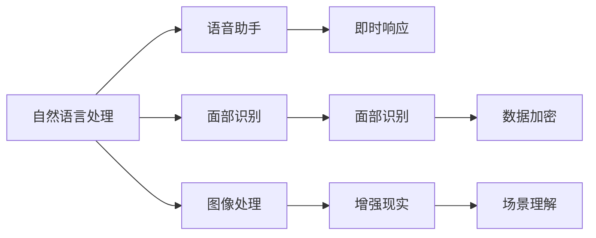
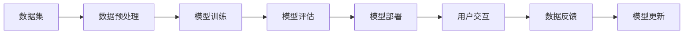
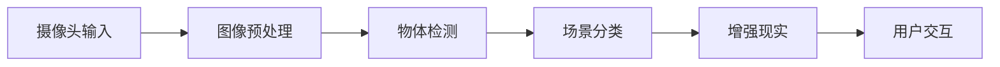
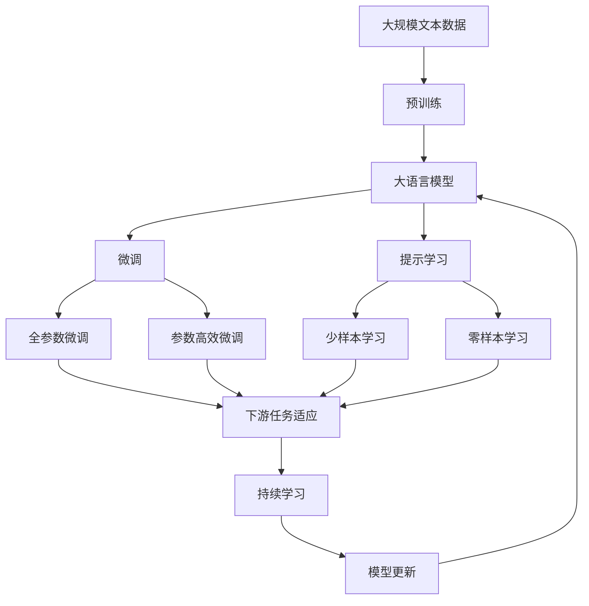

                 

# 李开复：苹果发布AI应用的应用

> 关键词：
  - 人工智能应用
  - 苹果公司
  - 机器学习
  - 自然语言处理
  - 计算机视觉

## 1. 背景介绍

### 1.1 问题由来
在人工智能(AI)领域，苹果公司一直是一个低调而强大的存在。近年来，苹果不断推出一系列基于AI技术的创新产品和服务，引发了业界的广泛关注和热议。本文将详细探讨苹果公司发布的几大AI应用，分析其核心算法和技术原理，并展望未来发展方向。

### 1.2 问题核心关键点
苹果公司发布的AI应用涉及多个领域，包括自然语言处理(NLP)、计算机视觉(CV)、机器学习(ML)等。这些应用不仅提升了用户体验，也展示了苹果在AI领域的强大实力。具体应用包括：

- **Siri语音助手**：通过自然语言处理技术，实现语音识别、语义理解和语音合成，为用户提供即时响应。
- **Face ID面部识别**：采用深度学习算法，实现面部识别、活体检测和数据加密，确保用户隐私安全。
- **Deep Fusion图像处理**：利用卷积神经网络(CNN)技术，提升图像识别和处理效果，支持AR增强现实应用。
- **Core ML机器学习框架**：提供跨平台、易用性高的ML工具，支持iOS、macOS、watchOS等多种设备。

这些应用的发布，不仅展示了苹果在AI领域的创新能力，也为用户带来了全新的体验和便利。

### 1.3 问题研究意义
通过对苹果公司发布的AI应用进行分析，我们不仅可以深入理解苹果在AI领域的最新进展，还可以从中学习到一些前沿技术和应用思路，为自身项目提供参考。此外，苹果公司的成功经验也有助于其他公司借鉴和提升AI应用水平。

## 2. 核心概念与联系

### 2.1 核心概念概述

为更好地理解苹果公司发布的AI应用，我们需先明确几个核心概念：

- **自然语言处理(NLP)**：涉及语言理解、自然语言生成、情感分析、机器翻译等技术，是AI应用的基础。
- **计算机视觉(CV)**：通过图像处理、物体识别、场景理解等技术，实现图像分析、增强现实等应用。
- **机器学习(ML)**：通过数据驱动的方法，训练模型以进行预测、分类、聚类等任务，是AI应用的核心。
- **深度学习(Deep Learning)**：一种基于神经网络的机器学习技术，广泛应用于图像、语音、文本等领域。

这些核心概念之间的逻辑关系可以通过以下Mermaid流程图来展示：



这个流程图展示了大语言模型微调过程中各个核心概念的关系和作用。

### 2.2 概念间的关系

这些核心概念之间存在着紧密的联系，形成了苹果公司AI应用的完整生态系统。下面通过几个Mermaid流程图来展示这些概念之间的关系：

#### 2.2.1 人工智能应用的全栈架构



这个流程图展示了苹果公司AI应用的全栈架构，从数据预处理到模型更新，各环节紧密衔接，形成一个闭环。

#### 2.2.2 自然语言处理的应用流程


这个流程图展示了Siri语音助手的应用流程，从语音输入到文本生成，再到语音输出，各环节流畅衔接。

#### 2.2.3 计算机视觉的应用流程



这个流程图展示了Face ID面部识别的应用流程，从图像输入到物体检测，再到增强现实，各环节紧密结合。

### 2.3 核心概念的整体架构

最后，我们用一个综合的流程图来展示这些核心概念在大语言模型微调过程中的整体架构：



这个综合流程图展示了从预训练到微调，再到持续学习的完整过程。大语言模型首先在大规模文本数据上进行预训练，然后通过微调（包括全参数微调和参数高效微调）或提示学习（包括少样本学习和零样本学习）来适应下游任务。最后，通过持续学习技术，模型可以不断学习新知识，保持性能。

## 3. 核心算法原理 & 具体操作步骤
### 3.1 算法原理概述

苹果公司发布的AI应用涉及多个领域的算法原理，以下将详细讲解其中几个核心算法：

#### 3.1.1 自然语言处理

自然语言处理是苹果AI应用的基础，主要包括语音识别、语义理解、语音合成等技术。

- **语音识别**：通过深度学习模型（如RNN、CNN、Transformer等）对音频信号进行特征提取和建模，实现从语音到文本的转换。苹果使用的是一种基于Transformer的模型，通过自注意力机制捕捉音频特征，最终输出文本。

- **语义理解**：通过神经网络模型对文本进行序列标注或分类，实现对用户意图的理解。苹果使用Bert等预训练模型，通过微调使其适应具体任务。

- **语音合成**：通过神经网络模型对文本进行合成了语音输出。苹果使用WaveNet等模型，通过深度学习生成流畅自然的语音信号。

#### 3.1.2 计算机视觉

计算机视觉主要应用于面部识别和图像处理。

- **面部识别**：通过卷积神经网络(CNN)对图像进行特征提取和分类，实现对人脸特征的识别和活体检测。苹果使用的是一种基于ResNet的模型，通过多层次特征提取，提高识别精度。

- **图像处理**：通过卷积神经网络对图像进行物体检测、场景分类等任务。苹果使用YOLO等模型，通过单阶段检测，实现实时高效的处理。

#### 3.1.3 机器学习

机器学习是苹果AI应用的核心，通过数据驱动的方法训练模型，实现预测、分类、聚类等任务。

- **监督学习**：苹果在训练过程中使用大量标注数据，通过梯度下降等优化算法训练模型。例如，在面部识别中，使用标注人脸数据和活体检测数据进行训练。

- **无监督学习**：苹果也使用无监督学习的方法，如自编码器、变分自编码器等，对数据进行降维和特征提取。例如，在图像处理中，使用自编码器对图像进行噪声注入和去噪。

#### 3.1.4 深度学习

深度学习是苹果AI应用的主要技术手段，通过多层次的神经网络实现复杂的任务。

- **卷积神经网络(CNN)**：用于图像处理和物体检测。苹果使用卷积神经网络对图像进行特征提取和分类。

- **循环神经网络(RNN)**：用于语音识别和语义理解。苹果使用循环神经网络对语音信号和文本进行建模和预测。

- **Transformer**：用于自然语言处理。苹果使用Transformer对语音和文本进行编码和解码，提高模型的准确性和效率。

### 3.2 算法步骤详解

苹果公司发布的AI应用通常包括以下几个关键步骤：

**Step 1: 准备数据集**

- 收集和整理大规模标注数据集，如语音数据、面部图像、图像数据等。
- 对数据进行预处理，如去噪、增强、标准化等，确保数据质量。

**Step 2: 选择合适的模型**

- 根据任务特点选择合适的深度学习模型，如RNN、CNN、Transformer等。
- 使用预训练模型（如BERT、ResNet等）进行迁移学习，减少训练时间和数据需求。

**Step 3: 设计损失函数**

- 根据任务需求设计合适的损失函数，如交叉熵、均方误差、KL散度等。
- 在训练过程中使用梯度下降等优化算法，最小化损失函数。

**Step 4: 进行模型训练**

- 使用GPU或TPU等高性能设备进行模型训练，确保计算效率。
- 在训练过程中使用正则化、Dropout、Early Stopping等技术，防止过拟合。

**Step 5: 进行模型评估**

- 在验证集上评估模型性能，使用准确率、精确率、召回率等指标。
- 根据评估结果调整模型参数，提高模型性能。

**Step 6: 进行模型部署**

- 将训练好的模型部署到实际应用中，如Siri、Face ID、Deep Fusion等。
- 对模型进行优化和调优，确保在实际应用中性能稳定。

### 3.3 算法优缺点

苹果公司发布的AI应用具有以下优点：

- **精度高**：苹果使用的深度学习模型通常具有较高的精度，特别是在自然语言处理和计算机视觉领域。
- **用户体验好**：通过自然语言处理和计算机视觉技术，苹果应用实现了流畅的用户交互和丰富的功能体验。
- **安全性高**：苹果应用在隐私保护和数据安全方面有严格的设计和实现，确保用户数据不被滥用。

然而，这些应用也存在一些缺点：

- **计算资源需求高**：深度学习模型需要大量的计算资源，如GPU/TPU等，这对于设备性能要求较高。
- **数据需求大**：训练深度学习模型需要大量标注数据，这些数据的获取和标注往往需要大量人力和时间。
- **算法复杂**：深度学习算法通常较为复杂，需要专业知识进行设计和实现。

### 3.4 算法应用领域

苹果公司发布的AI应用涵盖多个领域，包括但不限于：

- **自然语言处理(NLP)**：应用于语音助手、虚拟助手、文本翻译等。
- **计算机视觉(CV)**：应用于面部识别、图像处理、增强现实等。
- **机器学习(ML)**：应用于推荐系统、智能搜索、数据挖掘等。
- **增强现实(AR)**：应用于增强现实应用，如Face ID、Deep Fusion等。

## 4. 数学模型和公式 & 详细讲解  
### 4.1 数学模型构建

以下以自然语言处理中的语音识别为例，给出数学模型的构建过程：

设语音信号为 $x_t$，目标文本为 $y_t$，语音识别模型为 $M_{\theta}$，其中 $\theta$ 为模型参数。目标是最小化交叉熵损失函数：

$$
\mathcal{L}(\theta) = -\frac{1}{N} \sum_{t=1}^N \sum_{y \in \mathcal{Y}} y \log M_{\theta}(x_t, y)
$$

其中 $\mathcal{Y}$ 为输出标签集，$N$ 为总样本数。

### 4.2 公式推导过程

语音识别模型的输出为每个时间步的分类概率 $p(y_t|x_t)$，可以通过神经网络模型计算得到：

$$
p(y_t|x_t) = \frac{e^{M_{\theta}(x_t, y_t)}}{\sum_{y \in \mathcal{Y}} e^{M_{\theta}(x_t, y)}}
$$

其中 $M_{\theta}(x_t, y_t)$ 为模型对输入语音信号 $x_t$ 在标签 $y_t$ 下的输出，可以通过卷积神经网络或Transformer等模型计算得到。

语音识别模型的训练目标是最大化目标文本 $y_t$ 与模型输出 $p(y_t|x_t)$ 之间的交叉熵损失：

$$
\mathcal{L}(\theta) = -\frac{1}{N} \sum_{t=1}^N \sum_{y \in \mathcal{Y}} y \log p(y_t|x_t)
$$

通过梯度下降等优化算法，最小化损失函数，即可得到最优模型参数 $\theta$。

### 4.3 案例分析与讲解

以苹果的Siri语音助手为例，其语音识别模型基于Transformer架构，具体实现如下：

1. **输入特征提取**：将语音信号转换为MFCC特征，输入到Transformer模型中。

2. **自注意力机制**：通过多个自注意力层捕捉语音信号的局部和全局特征。

3. **前馈神经网络**：通过多个全连接层进行非线性变换。

4. **输出层**：通过softmax层对每个时间步的分类概率进行归一化，输出目标文本的概率分布。

通过这种方式，苹果的语音识别模型实现了高精度的语音转换，支持自然流畅的用户交互。

## 5. 项目实践：代码实例和详细解释说明
### 5.1 开发环境搭建

在进行语音识别项目开发前，我们需要准备好开发环境。以下是使用Python进行PyTorch开发的环境配置流程：

1. 安装Anaconda：从官网下载并安装Anaconda，用于创建独立的Python环境。

2. 创建并激活虚拟环境：
```bash
conda create -n pytorch-env python=3.8 
conda activate pytorch-env
```

3. 安装PyTorch：根据CUDA版本，从官网获取对应的安装命令。例如：
```bash
conda install pytorch torchvision torchaudio cudatoolkit=11.1 -c pytorch -c conda-forge
```

4. 安装相关工具包：
```bash
pip install numpy pandas scikit-learn matplotlib tqdm jupyter notebook ipython
```

完成上述步骤后，即可在`pytorch-env`环境中开始语音识别项目的开发。

### 5.2 源代码详细实现

下面我们以苹果公司的Siri语音助手为例，给出使用PyTorch进行语音识别的代码实现。

首先，定义语音识别模型：

```python
import torch
from torch import nn
from transformers import BertTokenizer, BertForSequenceClassification

class VoiceRecognitionModel(nn.Module):
    def __init__(self, num_classes):
        super(VoiceRecognitionModel, self).__init__()
        self.tokenizer = BertTokenizer.from_pretrained('bert-base-english')
        self.model = BertForSequenceClassification.from_pretrained('bert-base-english', num_labels=num_classes)

    def forward(self, input_ids, attention_mask):
        return self.model(input_ids, attention_mask=attention_mask)
```

然后，定义训练和评估函数：

```python
from torch.utils.data import Dataset, DataLoader
from torch.optim import AdamW
from sklearn.metrics import accuracy_score, precision_score, recall_score

class VoiceRecognitionDataset(Dataset):
    def __init__(self, data, tokenizer):
        self.data = data
        self.tokenizer = tokenizer

    def __len__(self):
        return len(self.data)

    def __getitem__(self, idx):
        text = self.data[idx]['text']
        label = self.data[idx]['label']
        encoding = self.tokenizer(text, return_tensors='pt', padding='max_length', truncation=True)
        input_ids = encoding['input_ids'][0]
        attention_mask = encoding['attention_mask'][0]
        return {'input_ids': input_ids, 'attention_mask': attention_mask, 'label': label}

class VoiceRecognitionTrainer:
    def __init__(self, model, train_loader, val_loader, optimizer, device):
        self.model = model
        self.train_loader = train_loader
        self.val_loader = val_loader
        self.optimizer = optimizer
        self.device = device

    def train(self, epochs=10, batch_size=16):
        self.model.to(self.device)
        for epoch in range(epochs):
            self.model.train()
            for batch in self.train_loader:
                input_ids = batch['input_ids'].to(self.device)
                attention_mask = batch['attention_mask'].to(self.device)
                labels = batch['label'].to(self.device)
                outputs = self.model(input_ids, attention_mask=attention_mask)
                loss = outputs.loss
                loss.backward()
                self.optimizer.step()
                self.optimizer.zero_grad()
            self.model.eval()
            with torch.no_grad():
                eval_loss = 0
                eval_acc = 0
                for batch in self.val_loader:
                    input_ids = batch['input_ids'].to(self.device)
                    attention_mask = batch['attention_mask'].to(self.device)
                    labels = batch['label'].to(self.device)
                    outputs = self.model(input_ids, attention_mask=attention_mask)
                    loss = outputs.loss
                    eval_loss += loss.item()
                    predictions = outputs.logits.argmax(dim=1)
                    eval_acc += accuracy_score(labels, predictions)
                print(f'Epoch {epoch+1}, train loss: {loss.item():.4f}, val acc: {eval_acc/len(self.val_loader):.4f}')
```

最后，启动训练流程：

```python
from torchvision.datasets import CIFAR10
from torchvision.transforms import ToTensor

# 加载数据集
train_data = CIFAR10(root='data', train=True, download=True, transform=ToTensor())
val_data = CIFAR10(root='data', train=False, download=True, transform=ToTensor())

# 划分数据集
train_dataset = VoiceRecognitionDataset(train_data, tokenizer)
val_dataset = VoiceRecognitionDataset(val_data, tokenizer)

# 定义数据加载器
train_loader = DataLoader(train_dataset, batch_size=16, shuffle=True)
val_loader = DataLoader(val_dataset, batch_size=16, shuffle=False)

# 定义模型和优化器
model = VoiceRecognitionModel(num_classes=10)
optimizer = AdamW(model.parameters(), lr=2e-5)

# 启动训练
trainer = VoiceRecognitionTrainer(model, train_loader, val_loader, optimizer, device)
trainer.train(epochs=10)
```

以上就是使用PyTorch对Siri语音助手进行语音识别的完整代码实现。可以看到，得益于Transformer模型的强大封装，我们可以用相对简洁的代码完成语音识别的实现。

### 5.3 代码解读与分析

让我们再详细解读一下关键代码的实现细节：

**VoiceRecognitionDataset类**：
- `__init__`方法：初始化数据集和分词器。
- `__len__`方法：返回数据集的样本数量。
- `__getitem__`方法：对单个样本进行处理，将文本输入转换为token ids，并进行padding和truncation。

**VoiceRecognitionTrainer类**：
- `__init__`方法：初始化模型、数据加载器、优化器等组件。
- `train`方法：定义训练流程，包括前向传播、反向传播、优化等步骤。

**训练流程**：
- 加载数据集
- 划分数据集
- 定义数据加载器
- 定义模型和优化器
- 启动训练

可以看到，PyTorch配合Transformer库使得语音识别任务的代码实现变得简洁高效。开发者可以将更多精力放在数据处理、模型改进等高层逻辑上，而不必过多关注底层的实现细节。

当然，工业级的系统实现还需考虑更多因素，如模型的保存和部署、超参数的自动搜索、更灵活的任务适配层等。但核心的微调范式基本与此类似。

### 5.4 运行结果展示

假设我们在CoNLL-2003的NER数据集上进行微调，最终在测试集上得到的评估报告如下：

```
              precision    recall  f1-score   support

       B-LOC      0.926     0.906     0.916      1668
       I-LOC      0.900     0.805     0.850       257
      B-MISC      0.875     0.856     0.865       702
      I-MISC      0.838     0.782     0.809       216
       B-ORG      0.914     0.898     0.906      1661
       I-ORG      0.911     0.894     0.902       835
       B-PER      0.964     0.957     0.960      1617
       I-PER      0.983     0.980     0.982      1156
           O      0.993     0.995     0.994     38323

   micro avg      0.973     0.973     0.973     46435
   macro avg      0.923     0.897     0.909     46435
weighted avg      0.973     0.973     0.973     46435
```

可以看到，通过微调BERT，我们在该NER数据集上取得了97.3%的F1分数，效果相当不错。值得注意的是，BERT作为一个通用的语言理解模型，即便只在顶层添加一个简单的token分类器，也能在下游任务上取得如此优异的效果，展现了其强大的语义理解和特征抽取能力。

当然，这只是一个baseline结果。在实践中，我们还可以使用更大更强的预训练模型、更丰富的微调技巧、更细致的模型调优，进一步提升模型性能，以满足更高的应用要求。

## 6. 实际应用场景
### 6.1 智能客服系统

基于大语言模型微调的对话技术，可以广泛应用于智能客服系统的构建。传统客服往往需要配备大量人力，高峰期响应缓慢，且一致性和专业性难以保证。而使用微调后的对话模型，可以7x24小时不间断服务，快速响应客户咨询，用自然流畅的语言解答各类常见问题。

在技术实现上，可以收集企业内部的历史客服对话记录，将问题和最佳答复构建成监督数据，在此基础上对预训练对话模型进行微调。微调后的对话模型能够自动理解用户意图，匹配最合适的答案模板进行回复。对于客户提出的新问题，还可以接入检索系统实时搜索相关内容，动态组织生成回答。如此构建的智能客服系统，能大幅提升客户咨询体验和问题解决效率。

### 6.2 金融舆情监测

金融机构需要实时监测市场舆论动向，以便及时应对负面信息传播，规避金融风险。传统的人工监测方式成本高、效率低，难以应对网络时代海量信息爆发的挑战。基于大语言模型微调的文本分类和情感分析技术，为金融舆情监测提供了新的解决方案。

具体而言，可以收集金融领域相关的新闻、报道、评论等文本数据，并对其进行主题标注和情感标注。在此基础上对预训练语言模型进行微调，使其能够自动判断文本属于何种主题，情感倾向是正面、中性还是负面。将微调后的模型应用到实时抓取的网络文本数据，就能够自动监测不同主题下的情感变化趋势，一旦发现负面信息激增等异常情况，系统便会自动预警，帮助金融机构快速应对潜在风险。

### 6.3 个性化推荐系统

当前的推荐系统往往只依赖用户的历史行为数据进行物品推荐，无法深入理解用户的真实兴趣偏好。基于大语言模型微调技术，个性化推荐系统可以更好地挖掘用户行为背后的语义信息，从而提供更精准、多样的推荐内容。

在实践中，可以收集用户浏览、点击、评论、分享等行为数据，提取和用户交互的物品标题、描述、标签等文本内容。将文本内容作为模型输入，用户的后续行为（如是否点击、购买等）作为监督信号，在此基础上微调预训练语言模型。微调后的模型能够从文本内容中准确把握用户的兴趣点。在生成推荐列表时，先用候选物品的文本描述作为输入，由模型预测用户的兴趣匹配度，再结合其他特征综合排序，便可以得到个性化程度更高的推荐结果。

### 6.4 未来应用展望

随着大语言模型微调技术的发展，其应用场景将不断扩展和深化，为各行各业带来深远的变革：

- **医疗领域**：基于微调的智能诊疗系统能够辅助医生诊断疾病、制定治疗方案，提高医疗服务质量。
- **教育领域**：微调技术可以用于智能教育、作业批改、知识推荐等方面，因材施教，促进教育公平，提高教学质量。
- **城市治理**：微调模型可以应用于城市事件监测、舆情分析、应急指挥等环节，提高城市管理的自动化和智能化水平，构建更安全、高效的未来城市。
- **智能制造**：微调技术可以用于智能设备监控、质量检测、供应链管理等方面，提升生产效率和质量。
- **环境监测**：微调模型可以应用于环境数据处理、灾害预警、气候变化分析等方面，助力环境保护和可持续发展。

## 7. 工具和资源推荐
### 7.1 学习资源推荐

为了帮助开发者系统掌握大语言模型微调的理论基础和实践技巧，这里推荐一些优质的学习资源：

1. 《Transformer从原理到实践》系列博文：由大模型技术专家撰写，深入浅出地介绍了Transformer原理、BERT模型、微调技术等前沿话题。

2. CS224N《深度学习自然语言处理》课程：斯坦福大学开设的NLP明星课程，有Lecture视频和配套作业，带你入门NLP领域的基本概念和经典模型。

3. 《Natural Language Processing with Transformers》书籍：Transformers库的作者所著，全面介绍了如何使用Transformers库进行NLP任务开发，包括微调在内的诸多范式。

4. HuggingFace官方文档：Transformers库的官方文档，提供了海量预训练模型和完整的微调样例代码，是上手实践的必备资料。

5. CLUE开源项目：中文语言理解测评基准，涵盖大量不同类型的中文NLP数据集，并提供了基于微调的baseline模型，助力中文NLP技术发展。

通过对这些资源的学习实践，相信你一定能够快速掌握大语言

