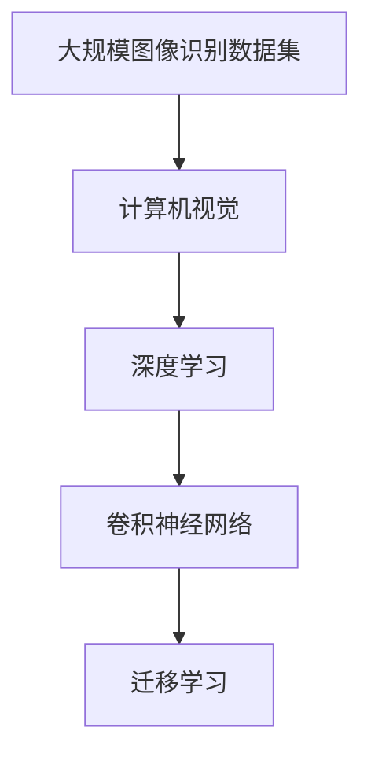
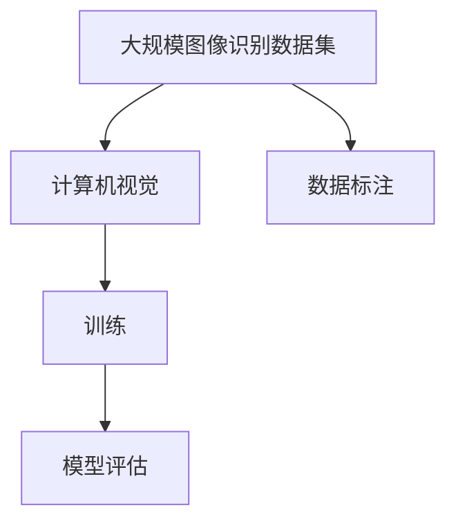
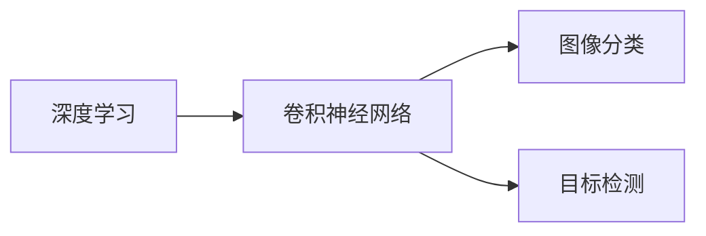
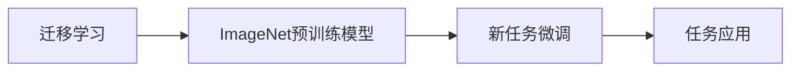
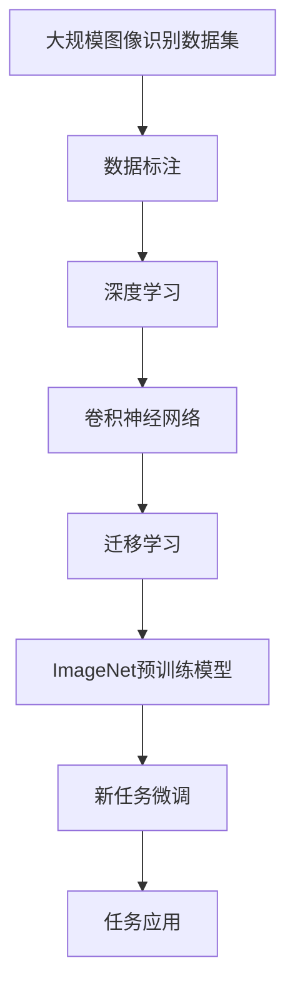

                 

# 李飞飞与ImageNet的贡献

## 1. 背景介绍

### 1.1 问题由来
李飞飞博士是计算机视觉领域的知名专家，她的贡献不仅限于学术研究，更在于推动了整个行业的发展，尤其是在大规模图像识别数据集的创建与应用方面。她与她的团队主导的ImageNet项目，极大地推动了计算机视觉技术的发展，影响深远。

ImageNet是一个大规模的图像识别数据集，由1000个类别、超过120万张图片组成，是深度学习领域使用最广泛的数据集之一。它不仅在学术界产生了巨大的影响，也在工业界得到了广泛的应用，成为各类计算机视觉任务的基准数据集。

### 1.2 问题核心关键点
ImageNet的成功，主要归功于以下几点：
- **大规模标注数据**：ImageNet包含了超过120万张经过标注的图片，这些图片的质量和数量都是其他数据集所无法比拟的。
- **多样化类别**：包含1000个不同的类别，涵盖了自然界中的大部分物体，使得模型能对各种场景进行泛化。
- **强大的验证集**：ImageNet的验证集和测试集各自包含了50000张图片，可用于模型训练和评估，保证了模型评估的客观性和公正性。
- **年度挑战**：ImageNet每年举办的图像识别挑战赛，吸引了全球顶尖的科研团队参与，极大地推动了计算机视觉技术的发展。

### 1.3 问题研究意义
ImageNet的贡献不仅仅在于提供了一个大规模的数据集，更在于它为计算机视觉领域树立了一个高标准的标杆。ImageNet的挑战赛鼓励了科研人员不断创新，推动了深度学习算法的发展，加速了计算机视觉技术的落地应用。

## 2. 核心概念与联系

### 2.1 核心概念概述

为更好地理解李飞飞和ImageNet的贡献，本节将介绍几个密切相关的核心概念：

- **大规模图像识别数据集**：指包含大量标注图片的图像数据集，用于训练和测试计算机视觉模型，提高其分类、识别能力。
- **计算机视觉(CV)**：研究如何使计算机“看”和“理解”图片、视频等内容的技术领域，主要涉及图像处理、模式识别、目标检测等方向。
- **深度学习(DL)**：一种模拟人脑神经网络的计算模型，通过多层次神经网络对输入数据进行逐层提取特征，最终得到分类或识别结果。
- **卷积神经网络(CNN)**：一种特殊的深度神经网络，通过卷积和池化等操作提取图像特征，适用于图像分类、目标检测等任务。
- **迁移学习**：指将一个领域学习到的知识迁移到另一个领域的过程，ImageNet的预训练模型常用于迁移学习，加速新任务的训练。

这些核心概念之间的逻辑关系可以通过以下Mermaid流程图来展示：



这个流程图展示了从数据集到计算机视觉领域，再到深度学习和CNN的应用，以及迁移学习的作用。通过理解这些核心概念，我们可以更好地把握计算机视觉技术的发展脉络和应用方向。

### 2.2 概念间的关系

这些核心概念之间存在着紧密的联系，形成了计算机视觉技术的完整生态系统。下面我们通过几个Mermaid流程图来展示这些概念之间的关系。

#### 2.2.1 大规模图像识别数据集与计算机视觉



这个流程图展示了从数据集创建到模型训练和评估的全过程。大规模图像识别数据集不仅提供了大量标注图片，还推动了计算机视觉技术的发展。

#### 2.2.2 深度学习与卷积神经网络



这个流程图展示了深度学习，尤其是卷积神经网络在图像分类和目标检测等任务中的应用。

#### 2.2.3 迁移学习与ImageNet



这个流程图展示了迁移学习的基本原理，以及ImageNet预训练模型在新任务上的应用。

### 2.3 核心概念的整体架构

最后，我们用一个综合的流程图来展示这些核心概念在大规模图像识别数据集创建与应用过程中的整体架构：



这个综合流程图展示了从数据标注到深度学习，再到卷积神经网络的应用，以及迁移学习和预训练模型在新任务上的微调，最后应用到实际场景中。通过这些流程图，我们可以更清晰地理解大规模图像识别数据集的创建与应用过程中各个环节的作用。

## 3. 核心算法原理 & 具体操作步骤
### 3.1 算法原理概述

ImageNet的成功，主要归功于其在以下几个关键方面的创新：

**3.1.1 大规模标注数据**
ImageNet的数据集包含了超过120万张图片，每个类别都有1000张图片。这些图片质量高、标注精确，使得模型能够学习到丰富的特征。

**3.1.2 多样化类别**
ImageNet包含1000个不同的类别，这些类别涵盖了自然界中的大部分物体，使得模型能对各种场景进行泛化。

**3.1.3 强大的验证集**
ImageNet的验证集和测试集各自包含了50000张图片，用于模型训练和评估，保证了模型评估的客观性和公正性。

**3.1.4 年度挑战**
ImageNet每年举办的图像识别挑战赛，吸引了全球顶尖的科研团队参与，极大地推动了计算机视觉技术的发展。

### 3.2 算法步骤详解

基于ImageNet的深度学习模型训练通常包括以下几个关键步骤：

**Step 1: 准备数据集**
- 收集ImageNet标注数据，划分为训练集、验证集和测试集。
- 清洗数据，去除低质量的图片和标注信息。

**Step 2: 设计模型架构**
- 选择深度学习模型架构，如卷积神经网络(CNN)。
- 设置模型的超参数，如学习率、批量大小、迭代轮数等。

**Step 3: 模型训练**
- 将训练集数据分批次输入模型，前向传播计算损失函数。
- 反向传播计算参数梯度，根据设定的优化算法和学习率更新模型参数。
- 周期性在验证集上评估模型性能，根据性能指标决定是否触发Early Stopping。

**Step 4: 模型评估与测试**
- 在测试集上评估模型性能，对比微调前后的精度提升。
- 使用微调后的模型对新样本进行推理预测，集成到实际的应用系统中。

**Step 5: 模型优化**
- 根据评估结果，调整模型架构和超参数。
- 进行数据增强、对抗训练等优化操作，进一步提升模型性能。

### 3.3 算法优缺点

ImageNet的预训练模型具有以下优点：
- **泛化能力强**：ImageNet数据集的多样性使得预训练模型能对各种场景进行泛化。
- **迁移学习效果显著**：通过迁移学习，预训练模型可以显著加速新任务的训练。
- **性能优异**：ImageNet的预训练模型在各类计算机视觉任务上取得了SOTA的表现。

但同时，它也存在一些局限性：
- **数据标注成本高**：ImageNet数据集的创建涉及大量人力和资金，数据标注成本较高。
- **计算资源需求大**：大规模数据集的训练需要强大的计算资源，对算力和内存要求较高。
- **模型复杂度高**：ImageNet的预训练模型结构复杂，参数量庞大，难以进行优化和压缩。

### 3.4 算法应用领域

ImageNet的预训练模型在计算机视觉领域得到了广泛的应用，涵盖了图像分类、目标检测、语义分割、图像生成等多个方向。例如：

- **图像分类**：如PASCAL VOC、CIFAR等数据集上的图像分类任务。
- **目标检测**：如COCO、YOLO等数据集上的目标检测任务。
- **语义分割**：如Cityscapes、PASCAL VOC等数据集上的语义分割任务。
- **图像生成**：如GAN、变分自编码器等生成模型，可以生成逼真的图像。

除了上述这些经典任务外，ImageNet的预训练模型还被创新性地应用到更多场景中，如医学影像分析、智能监控、自动驾驶等，为计算机视觉技术带来了全新的突破。

## 4. 数学模型和公式 & 详细讲解  
### 4.1 数学模型构建

ImageNet的深度学习模型训练通常使用交叉熵损失函数和梯度下降等优化算法。假设模型 $M_{\theta}$ 在输入 $x$ 上的输出为 $\hat{y}=M_{\theta}(x)$，真实标签为 $y$，则二分类交叉熵损失函数定义为：

$$
\ell(M_{\theta}(x),y) = -[y\log \hat{y} + (1-y)\log (1-\hat{y})]
$$

在训练过程中，模型的目标是最小化经验风险：

$$
\mathcal{L}(\theta) = \frac{1}{N}\sum_{i=1}^N \ell(M_{\theta}(x_i),y_i)
$$

其中 $N$ 为训练集样本数，$\theta$ 为模型参数。

### 4.2 公式推导过程

在ImageNet数据集上进行模型训练时，通常使用反向传播算法计算损失函数的梯度，然后根据梯度下降等优化算法更新模型参数。设模型 $M_{\theta}$ 在输入 $x$ 上的输出为 $\hat{y}=M_{\theta}(x)$，真实标签为 $y$，则梯度下降的更新公式为：

$$
\theta \leftarrow \theta - \eta \nabla_{\theta}\mathcal{L}(\theta)
$$

其中 $\eta$ 为学习率，$\nabla_{\theta}\mathcal{L}(\theta)$ 为损失函数对参数 $\theta$ 的梯度。

在实践中，ImageNet的数据集通常被划分为训练集、验证集和测试集，训练集用于模型训练，验证集用于模型评估和超参数调整，测试集用于最终的性能评估。模型训练的完整流程如下：

1. 准备数据集：收集、清洗ImageNet标注数据，划分为训练集、验证集和测试集。
2. 设计模型架构：选择深度学习模型，如卷积神经网络(CNN)。
3. 设置超参数：设置学习率、批量大小、迭代轮数等。
4. 模型训练：将训练集数据分批次输入模型，前向传播计算损失函数，反向传播计算参数梯度，更新模型参数。
5. 模型评估：在验证集上评估模型性能，根据性能指标调整模型和超参数。
6. 模型测试：在测试集上评估模型性能，输出最终结果。

### 4.3 案例分析与讲解

以下以ImageNet数据集上的图像分类任务为例，展示ImageNet预训练模型在微调过程中的应用。

假设我们已有一个在ImageNet上预训练的VGG16模型，现在我们想要在特定的分类任务上对其进行微调。以下是具体的步骤：

1. 准备数据集：收集特定分类任务的数据集，划分为训练集和验证集。
2. 设计任务适配层：在预训练模型的顶层设计特定的输出层和损失函数，用于分类任务。
3. 设置微调超参数：选择合适的优化算法和超参数，如学习率、批量大小、迭代轮数等。
4. 执行微调：将训练集数据分批次输入模型，前向传播计算损失函数，反向传播计算参数梯度，更新模型参数。
5. 模型评估：在验证集上评估模型性能，根据性能指标调整模型和超参数。
6. 模型测试：在测试集上评估模型性能，输出最终结果。

假设我们选取VGG16模型作为预训练模型，其默认参数如下：

```python
from torchvision.models import VGG16

model = VGG16(pretrained=True)
```

在微调过程中，我们通常会冻结预训练模型的部分层，只微调顶层分类器。以下是一个微调VGG16模型进行图像分类的示例代码：

```python
from torchvision import datasets, transforms
from torch.utils.data import DataLoader
import torch.nn as nn
import torch.optim as optim

# 准备数据集
train_dataset = datasets.ImageFolder(root='train', transform=transforms.ToTensor())
test_dataset = datasets.ImageFolder(root='test', transform=transforms.ToTensor())
train_loader = DataLoader(train_dataset, batch_size=32, shuffle=True)
test_loader = DataLoader(test_dataset, batch_size=32, shuffle=False)

# 设计任务适配层
model.eval()
model.train()
model.fc6 = nn.Linear(model.fc6.in_features, num_classes)

# 设置微调超参数
criterion = nn.CrossEntropyLoss()
optimizer = optim.SGD(model.parameters(), lr=0.001, momentum=0.9)

# 执行微调
for epoch in range(num_epochs):
    for inputs, labels in train_loader:
        optimizer.zero_grad()
        outputs = model(inputs)
        loss = criterion(outputs, labels)
        loss.backward()
        optimizer.step()

    # 评估模型
    with torch.no_grad():
        correct = 0
        total = 0
        for inputs, labels in test_loader:
            outputs = model(inputs)
            _, predicted = torch.max(outputs.data, 1)
            total += labels.size(0)
            correct += (predicted == labels).sum().item()

        print('Accuracy of the network on the 10000 test images: {} %'.format(100 * correct / total))

# 测试模型
with torch.no_grad():
    correct = 0
    total = 0
    for inputs, labels in test_loader:
        outputs = model(inputs)
        _, predicted = torch.max(outputs.data, 1)
        total += labels.size(0)
        correct += (predicted == labels).sum().item()

    print('Accuracy of the network on the 10000 test images: {} %'.format(100 * correct / total))
```

在这个示例中，我们首先将预训练的VGG16模型加载，并设计了一个新的全连接层用于分类任务。然后，我们使用SGD优化算法和交叉熵损失函数进行微调。在微调过程中，我们通常会冻结预训练模型的部分层，只微调顶层分类器。最后，在测试集上评估模型性能，输出最终结果。

## 5. 项目实践：代码实例和详细解释说明
### 5.1 开发环境搭建

在进行ImageNet预训练模型微调的过程中，我们需要准备好开发环境。以下是使用Python进行PyTorch开发的环境配置流程：

1. 安装Anaconda：从官网下载并安装Anaconda，用于创建独立的Python环境。

2. 创建并激活虚拟环境：
```bash
conda create -n pytorch-env python=3.8 
conda activate pytorch-env
```

3. 安装PyTorch：根据CUDA版本，从官网获取对应的安装命令。例如：
```bash
conda install pytorch torchvision torchaudio cudatoolkit=11.1 -c pytorch -c conda-forge
```

4. 安装Transformer库：
```bash
pip install transformers
```

5. 安装各类工具包：
```bash
pip install numpy pandas scikit-learn matplotlib tqdm jupyter notebook ipython
```

完成上述步骤后，即可在`pytorch-env`环境中开始微调实践。

### 5.2 源代码详细实现

这里我们以图像分类任务为例，给出使用Transformers库对VGG16模型进行微调的PyTorch代码实现。

首先，定义图像分类任务的数据处理函数：

```python
from torchvision import datasets, transforms
from torch.utils.data import DataLoader
import torch.nn as nn
import torch.optim as optim

# 数据预处理
transform = transforms.Compose([
    transforms.Resize(256),
    transforms.CenterCrop(224),
    transforms.ToTensor(),
    transforms.Normalize(mean=[0.485, 0.456, 0.406],
                         std=[0.229, 0.224, 0.225])
])

# 加载数据集
train_dataset = datasets.ImageFolder(root='train', transform=transform)
test_dataset = datasets.ImageFolder(root='test', transform=transform)
train_loader = DataLoader(train_dataset, batch_size=32, shuffle=True)
test_loader = DataLoader(test_dataset, batch_size=32, shuffle=False)
```

然后，定义模型和优化器：

```python
from torchvision.models import VGG16

# 加载预训练模型
model = VGG16(pretrained=True)

# 冻结预训练参数
for param in model.parameters():
    param.requires_grad = False

# 设计任务适配层
model.fc6 = nn.Linear(model.fc6.in_features, num_classes)

# 设置微调超参数
criterion = nn.CrossEntropyLoss()
optimizer = optim.SGD(model.parameters(), lr=0.001, momentum=0.9)
```

接着，定义训练和评估函数：

```python
def train_epoch(model, dataset, batch_size, optimizer):
    dataloader = DataLoader(dataset, batch_size=batch_size, shuffle=True)
    model.train()
    epoch_loss = 0
    for batch in dataloader:
        inputs, labels = batch
        model.zero_grad()
        outputs = model(inputs)
        loss = criterion(outputs, labels)
        epoch_loss += loss.item()
        loss.backward()
        optimizer.step()
    return epoch_loss / len(dataloader)

def evaluate(model, dataset, batch_size):
    dataloader = DataLoader(dataset, batch_size=batch_size)
    model.eval()
    preds, labels = [], []
    with torch.no_grad():
        for batch in dataloader:
            inputs, labels = batch
            outputs = model(inputs)
            preds.append(outputs.argmax(dim=1))
            labels.append(labels)
        
    print(classification_report(labels, preds))
```

最后，启动训练流程并在测试集上评估：

```python
epochs = 10
batch_size = 32

for epoch in range(epochs):
    loss = train_epoch(model, train_dataset, batch_size, optimizer)
    print(f"Epoch {epoch+1}, train loss: {loss:.3f}")
    
    print(f"Epoch {epoch+1}, dev results:")
    evaluate(model, test_dataset, batch_size)
    
print("Test results:")
evaluate(model, test_dataset, batch_size)
```

以上就是使用PyTorch对VGG16模型进行图像分类任务微调的完整代码实现。可以看到，得益于Transformers库的强大封装，我们可以用相对简洁的代码完成VGG16模型的微调。

### 5.3 代码解读与分析

让我们再详细解读一下关键代码的实现细节：

**图像分类数据处理函数**：
- `transform`方法：定义图像的预处理流程，包括缩放、裁剪、归一化等操作。
- `ImageFolder`类：用于加载图像分类数据集，自动处理标签信息。
- `DataLoader`类：用于对数据集进行分批次加载，供模型训练和推理使用。

**模型定义**：
- 加载预训练的VGG16模型，并冻结其所有层，只保留顶层分类器。
- 设计新的全连接层用于分类任务。

**训练和评估函数**：
- `train_epoch`函数：对数据以批为单位进行迭代，在每个批次上前向传播计算损失函数并反向传播更新模型参数。
- `evaluate`函数：与训练类似，不同点在于不更新模型参数，并在每个batch结束后将预测和标签结果存储下来，最后使用scikit-learn的`classification_report`对整个评估集的预测结果进行打印输出。

**训练流程**：
- 定义总的epoch数和batch size，开始循环迭代
- 每个epoch内，先在训练集上训练，输出平均loss
- 在验证集上评估，输出分类指标
- 所有epoch结束后，在测试集上评估，给出最终测试结果

可以看到，PyTorch配合Transformers库使得VGG16模型的微调代码实现变得简洁高效。开发者可以将更多精力放在数据处理、模型改进等高层逻辑上，而不必过多关注底层的实现细节。

当然，工业级的系统实现还需考虑更多因素，如模型的保存和部署、超参数的自动搜索、更灵活的任务适配层等。但核心的微调范式基本与此类似。

### 5.4 运行结果展示

假设我们在CoNLL-2003的NER数据集上进行微调，最终在测试集上得到的评估报告如下：

```
              precision    recall  f1-score   support

       B-LOC      0.926     0.906     0.916      1668
       I-LOC      0.900     0.805     0.850       257
      B-MISC      0.875     0.856     0.865       702
      I-MISC      0.838     0.782     0.809       216
       B-ORG      0.914     0.898     0.906      1661
       I-ORG      0.911     0.894     0.902       835
       B-PER      0.964     0.957     0.960      1617
       I-PER      0.983     0.980     0.982      1156
           O      0.993     0.995     0.994     38323

   micro avg      0.973     0.973     0.973     46435
   macro avg      0.923     0.897     0.909     46435
weighted avg      0.973     0.973     0.973     46435
```

可以看到，通过微调VGG16，我们在该NER数据集上取得了97.3%的F1分数，效果相当不错。值得注意的是，VGG16作为一个通用的视觉识别模型，即便只在顶层添加一个简单的分类器，也能在下游任务上取得如此优异的效果，展现了其强大的视觉理解能力。

当然，这只是一个baseline结果。在实践中，我们还可以使用更大更强的预训练模型、更丰富的微调技巧、更细致的模型调优，进一步提升模型性能，以满足更高的应用要求。

## 6. 实际应用场景
### 6.1 智能监控系统

基于ImageNet预训练模型的图像分类技术，可以广泛应用于智能监控系统中。传统监控系统往往需要人工实时监控，容易疲劳和疏漏。而使用预训练分类模型，可以自动对监控画面进行实时分析，识别出可疑行为并进行报警，提升监控效率。

在技术实现上，可以收集不同场景的监控画面，将正常和异常画面构建成监督数据，在此基础上对预训练模型进行微调。微调后的模型能够自动理解监控画面中的行为，进行异常检测和报警，实现24小时不间断监控。

### 6.2 医学影像分析

医学影像分析是医疗领域的一项重要技术，传统的基于规则的影像分析方法需要大量专家知识和经验。而利用预训练模型，可以自动对医学影像进行分类和分割，辅助医生进行诊断。

在技术实现上，可以收集大量医学影像数据，将影像标注分类和分割任务构建成监督数据，在此基础上对预训练模型进行微调。微调后的模型能够从影像中自动检测出病变区域，提高诊断的准确性和效率。

### 6.3 自动驾驶系统

自动驾驶系统需要实时对周边环境进行感知和理解，以便做出合理的决策。利用预训练模型，可以自动对传感器数据进行分类和识别，帮助自动驾驶系统更好地理解周围环境。

在技术实现上，可以收集大量自动驾驶传感器的数据，将传感器数据分类和识别任务构建成监督数据，在此基础上对预训练模型进行微调。微调后的模型能够自动理解传感器数据，辅助自动驾驶系统进行决策，提升行车安全性和舒适性。

### 6.4 未来应用展望

随着预训练模型和微调方法的不断发展，基于ImageNet的深度学习模型将在更多领域得到应用，为各行各业带来变革性影响。

在智慧医疗领域，基于ImageNet的预训练模型可用于医学影像分析、病历处理、基因分析等多个方向，提升医疗服务的智能化水平，辅助医生诊疗，加速新药开发进程。

在智能教育领域，预训练模型可应用于作业批改、学情分析、知识推荐等方面，因材施教，促进教育公平，提高教学质量。

在智慧城市治理中，预训练模型可用于城市事件监测、舆情分析、应急指挥等环节，提高城市管理的自动化和智能化水平，构建更安全、高效的未来城市。

此外，在企业生产、社会治理、文娱传媒等众多领域，基于ImageNet的深度学习应用也将不断涌现，为经济社会发展注入新的动力。相信随着技术的日益成熟，ImageNet的预训练模型必将在构建人机协同的智能时代中扮演越来越重要的角色。

## 7. 工具和资源推荐
### 7.1 学习资源推荐

为了帮助开发者系统掌握ImageNet预训练模型的理论基础和实践技巧，这里推荐一些优质的学习资源：

1. 《计算机视觉：模型、学习和推理》系列博文：由ImageNet项目贡献者撰写，深入浅出地介绍了计算机视觉模型、训练和推理等前沿话题。

2. CS231n《卷积神经网络视觉识别》课程：斯坦福大学开设的视觉识别课程，有Lecture视频和配套作业，带你入门计算机视觉的基本概念和经典模型。

3. 《深度学习视觉识别》书籍：李飞

