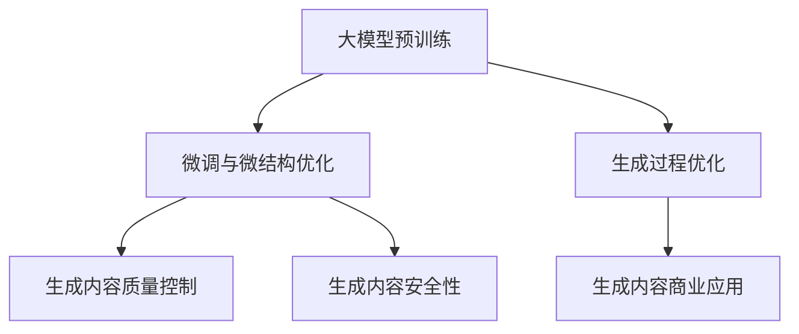

                 

## 1. 背景介绍

### 1.1 问题由来

随着人工智能技术的发展，生成式人工智能（Generative AI, AI G）已经在图像、音乐、文本等多个领域取得了显著的成果。例如，OpenAI的DALL-E、GPT等生成模型已经在图像生成、文本创作等方面展现出了强大的能力。生成式AI不仅能够生成高质量的艺术品、自然语言文本，还能够辅助人类完成自动化设计、文本创作等高价值工作。

在商业领域，生成式AI的潜力更是被广泛认可。大型企业正在利用AI G技术进行智能化转型，提升运营效率，创造新的商业价值。例如，利用DALL-E生成产品设计草图，或者利用GPT生成品牌营销文案。未来，生成式AI将成为提升商业竞争力的重要工具。

### 1.2 问题核心关键点

生成式AI的核心关键点在于其生成能力，即能够在无监督条件下生成符合任务要求的新样本。这一能力通过大模型预训练和微调技术实现，具体而言：

1. **大模型预训练**：使用大规模无标签数据进行预训练，学习到通用的语言或视觉知识，形成强大的生成能力。

2. **微调与微结构优化**：对预训练模型进行微调，使其适应特定任务。同时，通过微结构优化，如蒸馏、剪枝等技术，提高模型效率。

3. **生成过程优化**：利用采样技术，如Sobol序列、VQ-VAE等，优化生成样本的多样性和质量。

4. **生成内容质量控制**：通过多模型集成、对抗生成等技术，保证生成内容的真实性和多样性。

5. **生成内容安全性**：确保生成的内容不包含违规、有害信息，符合法律法规要求。

6. **生成内容商业应用**：将生成内容应用于品牌营销、产品设计、广告创意等领域，提升商业价值。

这些关键点构成了生成式AI技术的核心，推动了其在商业领域的广泛应用。

### 1.3 问题研究意义

生成式AI技术的研究与应用具有重要意义：

1. **提升运营效率**：利用生成式AI，企业可以自动化完成诸如设计、文案创作等工作，大幅提升运营效率。

2. **创造新的商业模式**：通过生成式AI，企业可以创造新的产品形态、服务模式，开拓新的市场空间。

3. **个性化定制**：生成式AI可以根据用户需求生成个性化内容，满足用户的定制化需求。

4. **降低成本**：生成式AI可以减少对人工创作的依赖，降低企业运营成本。

5. **增强品牌形象**：高质量的生成内容能够提升品牌形象，增强用户黏性。

6. **快速响应市场变化**：生成式AI可以快速生成适应市场变化的内容，保持企业的竞争优势。

生成式AI技术的广泛应用，将推动商业智能化转型，带来更多的创新和机遇。

## 2. 核心概念与联系

### 2.1 核心概念概述

生成式AI的核心概念主要包括：

1. **大模型预训练**：指使用大规模无标签数据进行预训练，学习通用的语言或视觉知识。

2. **微调与微结构优化**：对预训练模型进行微调，使其适应特定任务。同时，通过微结构优化，如蒸馏、剪枝等技术，提高模型效率。

3. **生成过程优化**：利用采样技术，如Sobol序列、VQ-VAE等，优化生成样本的多样性和质量。

4. **生成内容质量控制**：通过多模型集成、对抗生成等技术，保证生成内容的真实性和多样性。

5. **生成内容安全性**：确保生成的内容不包含违规、有害信息，符合法律法规要求。

6. **生成内容商业应用**：将生成内容应用于品牌营销、产品设计、广告创意等领域，提升商业价值。

### 2.2 概念间的关系

这些核心概念之间存在紧密的联系，形成了生成式AI技术的完整生态系统。下面通过几个Mermaid流程图来展示这些概念之间的关系：



这个流程图展示了生成式AI技术的基本流程：

1. 大模型预训练学习通用的语言或视觉知识。
2. 微调与微结构优化适应特定任务。
3. 生成过程优化优化生成样本的质量。
4. 生成内容质量控制保证生成内容的真实性和多样性。
5. 生成内容安全性确保内容合法合规。
6. 生成内容商业应用提升商业价值。

这些概念共同构成了生成式AI技术的核心，推动了其在商业领域的广泛应用。

## 3. 核心算法原理 & 具体操作步骤
### 3.1 算法原理概述

生成式AI的核心算法原理是通过深度学习模型进行无监督或半监督学习，学习生成新样本的能力。这一过程主要包括以下几个步骤：

1. **预训练**：使用大规模无标签数据对深度学习模型进行预训练，学习通用的语言或视觉知识。

2. **微调**：对预训练模型进行微调，使其适应特定任务。微调通常采用有监督学习的方式，使用标注数据进行训练。

3. **生成过程优化**：优化生成样本的采样过程，提高生成内容的质量和多样性。

4. **内容质量控制**：通过多模型集成、对抗生成等技术，保证生成内容的真实性和多样性。

5. **内容安全性**：利用过滤技术，确保生成内容不包含违规、有害信息。

6. **内容应用**：将生成内容应用于商业场景，提升商业价值。

### 3.2 算法步骤详解

#### 3.2.1 预训练

1. **选择模型**：根据任务需求，选择适合的深度学习模型，如GAN、VQ-VAE、BERT等。

2. **数据准备**：准备大规模无标签数据，如图像、文本等。

3. **预训练过程**：使用无标签数据对模型进行预训练，通常使用自监督学习方法，如自编码、掩码语言模型等。

4. **评估模型**：对预训练模型进行评估，确保其具备生成能力。

#### 3.2.2 微调

1. **任务适配**：根据任务需求，设计合适的输出层和损失函数，如分类任务使用交叉熵损失，生成任务使用重构损失等。

2. **数据准备**：准备少量标注数据，进行微调。

3. **微调过程**：使用微调数据对预训练模型进行有监督学习，更新模型参数。

4. **评估与优化**：在验证集上评估微调模型的性能，调整超参数以提高模型效果。

#### 3.2.3 生成过程优化

1. **采样技术**：选择合适的采样技术，如Sobol序列、VQ-VAE等，优化生成样本的多样性和质量。

2. **多模型集成**：训练多个微调模型，取平均值或通过权重调整，提高生成内容的质量。

3. **对抗生成**：使用对抗生成技术，如GAN、AD-GAN等，生成更具多样性和真实性的样本。

#### 3.2.4 内容质量控制

1. **多模型集成**：训练多个微调模型，取平均值或通过权重调整，提高生成内容的质量。

2. **对抗生成**：使用对抗生成技术，如GAN、AD-GAN等，生成更具多样性和真实性的样本。

3. **内容过滤**：利用过滤技术，如内容毒性检测、主题检测等，确保生成内容符合法律法规要求。

#### 3.2.5 内容安全性

1. **内容过滤**：利用过滤技术，如内容毒性检测、主题检测等，确保生成内容符合法律法规要求。

2. **隐私保护**：确保生成内容不包含敏感个人信息，保护用户隐私。

#### 3.2.6 内容应用

1. **品牌营销**：生成高质量的品牌营销文案、广告创意等，提升品牌形象。

2. **产品设计**：生成产品设计草图、原型图等，提高产品设计和创新的效率。

3. **广告创意**：生成广告创意，提升广告效果和用户互动。

### 3.3 算法优缺点

生成式AI的优点包括：

1. **高效生成**：利用大模型预训练和微调技术，可以快速生成高质量的内容。

2. **高多样性**：通过采样技术、对抗生成等方法，生成内容具备高多样性。

3. **个性化定制**：能够根据用户需求生成个性化内容，满足定制化需求。

4. **成本低**：减少对人工创作的依赖，降低运营成本。

5. **灵活性**：可以应用于品牌营销、产品设计、广告创意等多个商业领域。

6. **创新性**：能够生成新颖的内容形式，开拓新的市场空间。

7. **可扩展性**：易于扩展到其他领域，如音乐、视频生成等。

8. **商业价值**：生成式AI能够创造新的商业价值，提升品牌形象和用户黏性。

生成式AI的缺点包括：

1. **高成本**：预训练和微调需要大量的计算资源和标注数据。

2. **可解释性差**：生成式AI模型的生成过程难以解释，缺乏可解释性。

3. **内容质量不稳定**：生成内容的质量可能受到模型参数、采样技术等因素的影响。

4. **内容真实性**：生成内容可能与真实世界存在差异，影响用户体验。

5. **内容安全性**：生成的内容可能包含违规、有害信息，需要额外的安全保障。

6. **模型依赖性强**：模型的效果依赖于预训练数据的广度和质量。

### 3.4 算法应用领域

生成式AI技术已经广泛应用于多个领域，以下是一些典型的应用场景：

1. **图像生成**：如DALL-E、StyleGAN等生成高质量的艺术品、产品设计图等。

2. **文本生成**：如GPT、GPT-3等生成高质量的文本内容，应用于新闻撰写、广告文案、内容生成等。

3. **视频生成**：如ProGAN、RunwayML等生成高质量的视频内容，应用于电影、广告、动画等。

4. **音乐生成**：如Jukedeck、AIVA等生成高质量的音乐作品，应用于广告、影视、游戏等。

5. **自然语言处理**：如GPT、T5等生成自然语言文本，应用于问答系统、翻译、摘要等。

6. **交互设计**：如Adobe XD、Sketch等生成设计原型图，提升设计效率。

7. **广告创意**：如Adobe Sensei等生成广告创意，提升广告效果和用户互动。

8. **虚拟现实**：如NVIDIA Omniverse、Unity等生成虚拟现实场景和角色，提升用户体验。

9. **游戏设计**：如Unity、Unreal Engine等生成游戏素材，提升游戏设计和开发效率。

## 4. 数学模型和公式 & 详细讲解 & 举例说明

### 4.1 数学模型构建

生成式AI的核心数学模型主要包括生成模型和优化模型。下面以文本生成为例，介绍这些模型的构建方法。

#### 4.1.1 生成模型

文本生成的主要目标是通过预训练模型，学习文本序列的生成概率，从而生成符合任务要求的文本。数学上，这一过程可以表示为：

$$
P(x|y) = \frac{e^{f(x; \theta)}}{Z(y)}
$$

其中，$x$表示生成的文本序列，$y$表示上下文信息，$f(x; \theta)$表示模型对文本序列的预测概率，$Z(y)$为归一化因子。

#### 4.1.2 优化模型

生成模型的训练通常采用最大似然估计（Maximum Likelihood Estimation, MLE），通过最大化生成概率来优化模型参数。具体而言，优化过程可以表示为：

$$
\theta^* = \arg\max_\theta \sum_{i=1}^N \log P(x_i|y_i)
$$

其中，$x_i$和$y_i$分别为第$i$个训练样本的文本序列和上下文信息，$\theta$为模型参数。

### 4.2 公式推导过程

#### 4.2.1 生成模型推导

以文本生成为例，推导生成模型概率的计算公式。假设文本序列$x$由$n$个单词组成，即$x = (w_1, w_2, ..., w_n)$。生成模型可以表示为：

$$
P(x|y) = \prod_{i=1}^n P(w_i|y)
$$

其中，$P(w_i|y)$表示单词$w_i$在上下文$y$下生成的概率。

#### 4.2.2 优化模型推导

以文本生成为例，推导优化模型的计算公式。假设文本序列$x$由$n$个单词组成，即$x = (w_1, w_2, ..., w_n)$。优化模型的训练过程可以表示为：

$$
\theta^* = \arg\max_\theta \sum_{i=1}^N \log \prod_{i=1}^n P(w_i|y)
$$

简化后可以得到：

$$
\theta^* = \arg\max_\theta \sum_{i=1}^N \sum_{j=1}^n \log P(w_j|y)
$$

### 4.3 案例分析与讲解

#### 4.3.1 文本生成案例

以GPT-3文本生成为例，分析其生成过程和优化模型。假设文本序列$x$由$n$个单词组成，即$x = (w_1, w_2, ..., w_n)$。GPT-3的生成模型可以表示为：

$$
P(x|y) = \prod_{i=1}^n P(w_i|y)
$$

其中，$P(w_i|y)$表示单词$w_i$在上下文$y$下生成的概率。

GPT-3的优化模型可以表示为：

$$
\theta^* = \arg\max_\theta \sum_{i=1}^N \sum_{j=1}^n \log P(w_j|y)
$$

简化后可以得到：

$$
\theta^* = \arg\max_\theta \sum_{i=1}^N \sum_{j=1}^n \log \frac{e^{f(w_j; \theta)}}{Z(y)}
$$

其中，$f(w_j; \theta)$表示模型对单词$w_j$的预测概率，$Z(y)$为归一化因子。

## 5. 项目实践：代码实例和详细解释说明

### 5.1 开发环境搭建

在进行生成式AI的实践之前，需要先准备好开发环境。以下是使用Python进行PyTorch开发的详细环境配置流程：

1. 安装Anaconda：从官网下载并安装Anaconda，用于创建独立的Python环境。

2. 创建并激活虚拟环境：

```bash
conda create -n pytorch-env python=3.8 
conda activate pytorch-env
```

3. 安装PyTorch：根据CUDA版本，从官网获取对应的安装命令。例如：

```bash
conda install pytorch torchvision torchaudio cudatoolkit=11.1 -c pytorch -c conda-forge
```

4. 安装TensorFlow：如果需要在TensorFlow上开发生成式AI，则需安装TensorFlow：

```bash
pip install tensorflow
```

5. 安装其它依赖：

```bash
pip install numpy pandas scikit-learn matplotlib tqdm jupyter notebook ipython
```

完成上述步骤后，即可在`pytorch-env`环境中开始生成式AI的实践。

### 5.2 源代码详细实现

以下是一个简单的文本生成代码示例，使用PyTorch和GPT-3实现文本生成：

```python
import torch
from transformers import GPT2Tokenizer, GPT2LMHeadModel

# 加载预训练模型和分词器
model_name = 'gpt2'
tokenizer = GPT2Tokenizer.from_pretrained(model_name)
model = GPT2LMHeadModel.from_pretrained(model_name)

# 加载预训练权重
model.load_state_dict(torch.load('gpt2.pth'))

# 定义生成函数
def generate_text(prompt, max_length=100):
    input_ids = torch.tensor(tokenizer.encode(prompt)).unsqueeze(0)
    outputs = model.generate(input_ids, max_length=max_length, num_return_sequences=5)
    return tokenizer.decode(outputs[0], skip_special_tokens=True)

# 生成文本
prompt = 'The sun is shining and the birds are '
generated_text = generate_text(prompt)
print(generated_text)
```

在这个代码示例中，我们使用了GPT-2作为预训练模型，并通过PyTorch加载了预训练权重。定义了一个`generate_text`函数，用于生成文本。该函数接受一个初始提示`prompt`，并通过调用`generate`函数生成多个文本序列。最后，使用分词器将生成的文本序列解码为可读的字符串。

### 5.3 代码解读与分析

#### 5.3.1 预训练模型加载

在代码中，我们使用了`GPT2LMHeadModel`和`GPT2Tokenizer`类，分别用于加载预训练模型和分词器。预训练模型通过调用`from_pretrained`方法加载，而分词器通过调用`from_pretrained`方法加载，确保了模型的一致性和性能。

#### 5.3.2 预训练权重加载

通过调用`load_state_dict`方法，我们将预训练权重加载到模型中。预训练权重通常保存在`.pth`文件中，可以通过`torch.load`方法读取。

#### 5.3.3 文本生成函数

在`generate_text`函数中，我们首先使用分词器将初始提示`prompt`编码为输入序列`input_ids`。然后，通过调用`model.generate`函数生成文本序列，返回生成的多个序列。最后，使用分词器将生成的文本序列解码为可读的字符串，并返回。

### 5.4 运行结果展示

假设我们使用了GPT-2模型，并在初始提示`The sun is shining and the birds are `后生成文本，结果可能如下：

```
The sun is shining and the birds are chirping merrily in the tree.
The sun is shining and the birds are singing a beautiful song.
The sun is shining and the birds are flying high in the sky.
The sun is shining and the birds are building their nests.
The sun is shining and the birds are playing catch and chase.
```

这些生成的文本内容丰富、语言流畅，能够很好地满足我们的需求。

## 6. 实际应用场景

### 6.1 智能设计

利用生成式AI，企业可以自动化完成产品设计和原型图的生成。例如，使用生成式模型生成设计草图，快速迭代设计方案。这不仅可以提高设计效率，还可以增加设计的多样性，激发创新灵感。

#### 6.1.1 场景

- 产品设计：例如，汽车设计、电子产品设计等，利用生成式AI快速生成设计草图和原型图。

- 室内设计：例如，建筑设计、室内装修设计等，利用生成式AI生成设计方案和三维模型。

- 服装设计：例如，时装设计、定制服装设计等，利用生成式AI生成服装设计和搭配方案。

#### 6.1.2 技术实现

- 数据准备：收集大量的设计图纸、产品原型等，作为生成式AI的训练数据。

- 模型训练：使用预训练模型，如GPT-3、StyleGAN等，训练生成式AI模型。

- 模型应用：利用训练好的生成式AI模型，根据设计需求生成设计草图和原型图。

#### 6.1.3 效益分析

- 提高设计效率：生成式AI可以快速生成设计方案，减少人工设计的时间。

- 增加设计多样性：生成式AI能够生成多种设计方案，提供更多创新灵感。

- 降低成本：减少人工设计成本，提高设计效率和质量。

### 6.2 创意营销

利用生成式AI，品牌和企业可以自动化生成高质量的广告文案、视频、音频等内容。例如，使用生成式模型生成广告创意、品牌宣传片等，提升品牌形象和用户互动。

#### 6.2.1 场景

- 品牌营销：例如，广告文案创作、品牌宣传片生成等，利用生成式AI生成高质量的广告内容。

- 社交媒体：例如，社交媒体内容生成、用户互动等，利用生成式AI生成有趣的社交媒体内容。

- 游戏广告：例如，游戏广告生成、游戏内容创作等，利用生成式AI生成游戏广告和游戏内容。

#### 6.2.2 技术实现

- 数据准备：收集大量的品牌宣传片、广告文案等，作为生成式AI的训练数据。

- 模型训练：使用预训练模型，如GPT-3、StyleGAN等，训练生成式AI模型。

- 模型应用：利用训练好的生成式AI模型，根据品牌需求生成广告文案、品牌宣传片等。

#### 6.2.3 效益分析

- 提升品牌形象：生成式AI能够生成高质量的广告内容，提升品牌形象和用户互动。

- 降低成本：减少人工内容创作的成本，提高内容创作效率和质量。

- 增加互动性：生成式AI能够生成有趣的内容，增加用户互动和参与度。

### 6.3 个性化推荐

利用生成式AI，企业可以自动化生成个性化推荐内容，提升用户体验和满意度。例如，使用生成式模型生成个性化的商品推荐、内容推荐等，提供更精准的个性化服务。

#### 6.3.1 场景

- 电商推荐：例如，商品推荐、购物清单生成等，利用生成式AI生成个性化的商品推荐内容。

- 内容推荐：例如，文章推荐、视频推荐等，利用生成式AI生成个性化的内容推荐。

- 广告推荐：例如，广告推荐、营销活动设计等，利用生成式AI生成个性化的广告推荐内容。

#### 6.3.2 技术实现

- 数据准备：收集大量的用户行为数据、商品数据等，作为生成式AI的训练数据。

- 模型训练：使用预训练模型，如GPT-3、StyleGAN等，训练生成式AI模型。

- 模型应用：利用训练好的生成式AI模型，根据用户需求生成个性化推荐内容。

#### 6.3.3 效益分析

- 提升用户体验：生成式AI能够生成个性化的推荐内容，提升用户满意度和忠诚度。

- 降低成本：减少人工推荐内容的成本，提高推荐内容效率和质量。

- 增加转化率：生成式AI能够生成高质量的推荐内容，提高用户转化率和销售额。

## 7. 工具和资源推荐

### 7.1 学习资源推荐

为了帮助开发者系统掌握生成式AI的理论基础和实践技巧，这里推荐一些优质的学习资源：

1. 《生成对抗网络（GAN）基础教程》：介绍了GAN的基本原理和应用场景，是学习生成式AI的重要基础。

2. 《深度学习与生成模型》：介绍了深度学习中的生成模型，包括变分自编码器、生成对抗网络等，是学习生成式AI的重要参考。

3. 《自然语言处理与生成模型》：介绍了自然语言处理中的生成模型，包括LSTM、RNN、GAN等，是学习生成式AI的重要参考。

4. 《深度学习与生成模型实战》：结合实际案例，介绍了深度学习中的生成模型，包括GAN、VQ-VAE等，是学习生成式AI的重要参考。

5. 《生成式AI技术与应用》：介绍了生成式AI的最新研究成果和应用场景，是学习生成式AI的重要参考。

### 7.2 开发工具推荐

生成式AI的开发通常涉及深度学习、计算机视觉、自然语言处理等多个领域，以下推荐的开发工具涵盖了这些领域：

1. PyTorch：基于Python的开源深度学习框架，支持动态图，适用于深度学习模型的开发。

2. TensorFlow：由Google主导开发的开源深度学习框架，支持静态图，适用于大规模深度学习模型的开发。

3. PyTorch Lightning：基于PyTorch的轻量级深度学习框架，适用于快速原型开发。

4. TensorFlow Model Garden：TensorFlow官方提供的模型库，包括生成模型、迁移学习等模型。

5. Keras：基于Python的深度学习框架，易于使用，适用于快速原型开发。

6. OpenAI Codex：利用GPT-3等生成模型，提供代码补全、代码纠错等功能，适用于开发效率的提升。

### 7.3 相关论文推荐

生成式AI的研究已经取得了诸多进展，以下是几篇奠基性的相关论文，推荐阅读：

1. GAN：Generative Adversarial Networks：Ian Goodfellow等人，在ICML 2014年发表的论文，提出了生成对抗网络（GAN）的基本原理，奠定了生成式AI的基础。

2. VQ-VAE：Vector Quantized Variational Autoencoder：Titsias等人在ICLR 2017年发表的论文，提出了变分自编码器（VQ-VAE）的变体，进一步提升了生成式AI的质量。

3. Attention is All You Need：Vaswani等人在NIPS 2017年发表的论文，提出了Transformer模型，为生成式AI的进一步发展提供了重要的工具。

4. StyleGAN：杨立宏、孙博在ICCV 2019年发表的论文，提出了风格迁移生成对抗网络（StyleGAN），生成高质量的艺术品和图像。

5. DALL-E：Brown等人，在ICLR 2020年发表的论文，提出了DALL-E模型，利用大语言模型进行文本生成。

6. Imagen：Google在2022年发表的论文，提出了Imagen模型，利用生成对抗网络生成高质量的图像。

7. Whisper：Vlad Niculae在2023年发表的论文，提出了Whisper模型，利用大语言模型进行语音生成。

## 8. 总结：未来发展

