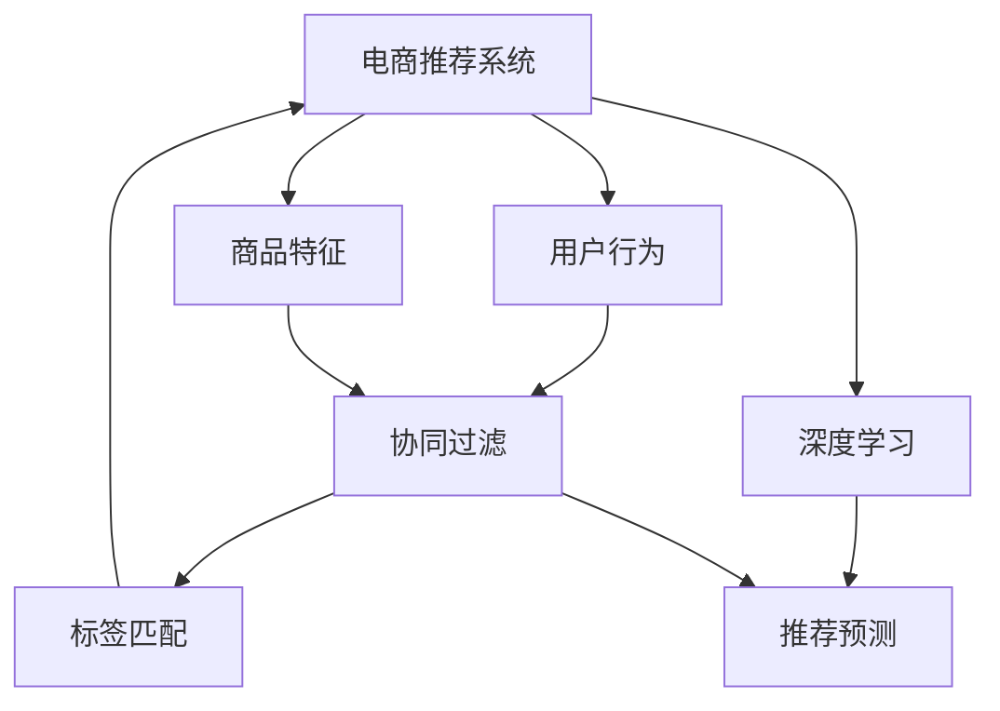
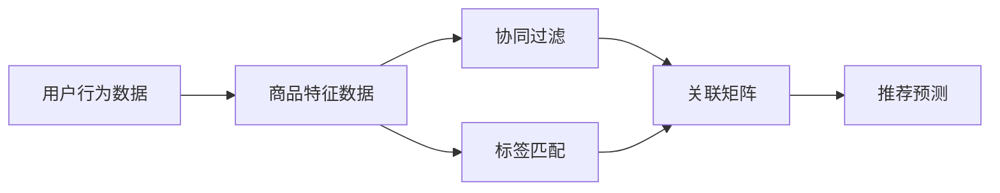
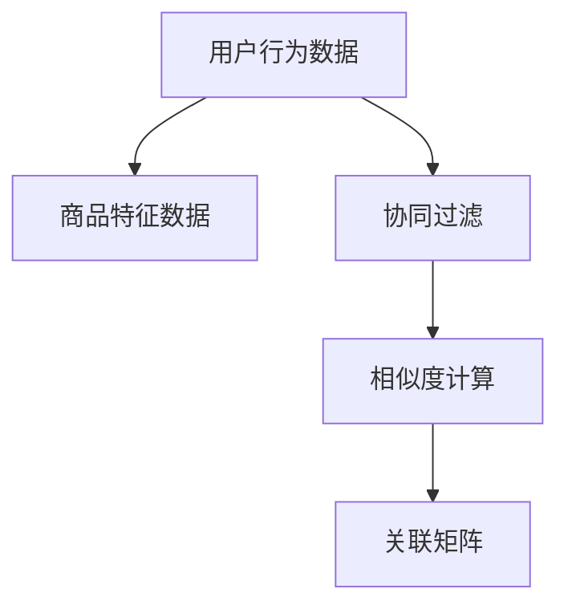
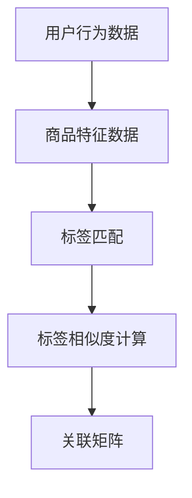
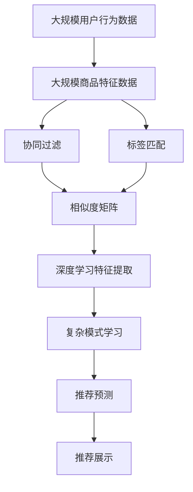

                 

# 电商平台供给能力提升：个性化商品推荐

> 关键词：电商，个性化推荐，深度学习，神经网络，协同过滤，标签匹配

## 1. 背景介绍

### 1.1 问题由来

在数字化转型加速的今天，电商平台已成为消费者购物的主要渠道。面对海量商品和多样化的用户需求，如何提升平台商品的展示和推荐效果，帮助用户快速找到满意的商品，成为电商平台亟需解决的核心问题。传统的基于规则或固定算法的推荐系统，往往难以适应个性化、动态变化的用户需求，推荐效果不佳，用户体验较差。而基于深度学习的个性化推荐系统，通过挖掘用户行为和商品特征的复杂关联，能够实现精准的商品推荐，提升电商平台的供给能力。

### 1.2 问题核心关键点

个性化推荐的核心在于通过用户行为和商品特征的学习，构建用户与商品之间的关联矩阵，并利用此矩阵进行推荐预测。具体而言，包含以下几个核心关键点：

- **用户行为数据**：包括浏览、点击、购买等行为，是构建关联矩阵的基础。
- **商品特征数据**：包含商品的属性、分类、价格等信息，用于表示商品差异。
- **关联矩阵构建**：通过用户行为数据和商品特征数据，学习用户与商品之间的相似度，构建关联矩阵。
- **推荐预测**：基于关联矩阵，预测用户可能感兴趣的商品，进行推荐展示。

## 2. 核心概念与联系

### 2.1 核心概念概述

为更好地理解个性化推荐系统，本节将介绍几个密切相关的核心概念：

- **电商推荐系统**：以电商平台为中心，通过分析用户行为和商品特征，构建用户与商品之间的关联矩阵，进行推荐预测的系统。
- **用户行为**：用户在电商平台上的浏览、点击、购买等行为，是推荐系统的重要输入。
- **商品特征**：商品的属性、分类、价格等信息，用于刻画商品差异。
- **协同过滤**：一种基于用户行为相似性和商品特征相似性的推荐算法，通过相似度计算构建关联矩阵。
- **标签匹配**：通过商品标签与用户行为的匹配，进行推荐预测的算法。
- **深度学习**：基于神经网络进行复杂模式学习和特征提取的方法，可用于个性化推荐。

这些核心概念之间的逻辑关系可以通过以下Mermaid流程图来展示：



这个流程图展示了电商推荐系统的核心组件和算法：

1. 用户行为数据和商品特征数据通过协同过滤和标签匹配构建关联矩阵。
2. 深度学习用于特征提取和复杂模式学习，进一步优化推荐预测。
3. 推荐预测用于展示商品推荐结果，提升用户体验。

### 2.2 概念间的关系

这些核心概念之间存在着紧密的联系，形成了电商推荐系统的完整生态系统。下面通过几个Mermaid流程图来展示这些概念之间的关系。

#### 2.2.1 电商推荐系统的组件



这个流程图展示了电商推荐系统的主要组件：

1. 用户行为数据和商品特征数据作为输入，通过协同过滤和标签匹配构建关联矩阵。
2. 关联矩阵用于推荐预测，最终输出推荐结果。

#### 2.2.2 协同过滤的算法



这个流程图展示了协同过滤的基本流程：

1. 用户行为数据和商品特征数据作为输入。
2. 通过相似度计算构建用户-商品相似度矩阵。
3. 关联矩阵用于推荐预测。

#### 2.2.3 标签匹配的算法



这个流程图展示了标签匹配的基本流程：

1. 用户行为数据和商品特征数据作为输入。
2. 通过标签相似度计算构建标签-用户相似度矩阵。
3. 关联矩阵用于推荐预测。

### 2.3 核心概念的整体架构

最后，我们用一个综合的流程图来展示这些核心概念在大规模个性化推荐系统中的整体架构：



这个综合流程图展示了从数据输入到推荐展示的完整流程：

1. 用户行为数据和商品特征数据作为输入。
2. 协同过滤和标签匹配构建关联矩阵。
3. 深度学习用于特征提取和复杂模式学习，优化推荐预测。
4. 推荐预测用于展示商品推荐结果，提升用户体验。

## 3. 核心算法原理 & 具体操作步骤
### 3.1 算法原理概述

个性化推荐的核心在于构建用户与商品之间的关联矩阵，并利用此矩阵进行推荐预测。具体而言，算法原理如下：

1. **用户行为数据**：包括用户浏览、点击、购买等行为，记录用户与商品之间的交互关系。
2. **商品特征数据**：商品的属性、分类、价格等信息，用于表示商品差异。
3. **相似度计算**：通过用户行为数据和商品特征数据，计算用户与商品之间的相似度，构建用户-商品相似度矩阵。
4. **关联矩阵构建**：将相似度矩阵与用户行为数据进行融合，构建关联矩阵。
5. **推荐预测**：基于关联矩阵，利用协同过滤、标签匹配或深度学习等算法，进行推荐预测，输出推荐结果。

### 3.2 算法步骤详解

#### 3.2.1 数据准备

1. **用户行为数据**：收集用户浏览、点击、购买等行为数据，记录每个用户与商品之间的交互关系。
2. **商品特征数据**：提取商品的属性、分类、价格等信息，用于表示商品差异。
3. **数据预处理**：对数据进行清洗、去重、填充缺失值等预处理操作，确保数据质量。

#### 3.2.2 相似度计算

1. **协同过滤**：通过计算用户与商品之间的相似度，构建用户-商品相似度矩阵。协同过滤的相似度计算方法包括余弦相似度、皮尔逊相关系数等。
2. **标签匹配**：通过计算商品标签与用户行为的匹配度，构建标签-用户相似度矩阵。标签匹配的相似度计算方法包括标签相关性、TF-IDF等。

#### 3.2.3 关联矩阵构建

1. **协同过滤**：将用户-商品相似度矩阵与用户行为数据进行融合，构建关联矩阵。关联矩阵用于表示用户与商品之间的关联强度。
2. **标签匹配**：将标签-用户相似度矩阵与用户行为数据进行融合，构建关联矩阵。关联矩阵用于表示标签与用户之间的关联强度。

#### 3.2.4 推荐预测

1. **协同过滤**：基于关联矩阵，利用协同过滤算法进行推荐预测，如基于用户-商品相似度的TopK推荐算法。
2. **标签匹配**：基于关联矩阵，利用标签匹配算法进行推荐预测，如基于标签-用户相似度的TopK推荐算法。
3. **深度学习**：利用深度学习模型进行特征提取和复杂模式学习，进一步优化推荐预测。常用的深度学习模型包括CNN、RNN、GRU等。

### 3.3 算法优缺点

个性化推荐系统具有以下优点：

1. **精准性高**：通过用户行为数据和商品特征数据的学习，能够实现精准的商品推荐，提升用户满意度。
2. **动态性**：能够根据用户行为动态调整推荐结果，适应个性化需求的变化。
3. **可扩展性**：适用于大规模电商平台的推荐需求，能够处理海量数据和商品。

同时，个性化推荐系统也存在以下缺点：

1. **数据依赖**：推荐效果依赖于用户行为数据和商品特征数据的丰富度和准确性。
2. **冷启动问题**：对于新用户或新商品，缺乏足够的交互数据，推荐效果不佳。
3. **稀疏性**：用户与商品之间的交互数据往往非常稀疏，可能导致算法失效。
4. **隐私问题**：用户行为数据涉及用户隐私，需要谨慎处理。

### 3.4 算法应用领域

个性化推荐系统在电商、视频、音乐等多个领域均有广泛应用，具体如下：

1. **电商平台**：通过用户行为数据和商品特征数据的学习，推荐用户可能感兴趣的商品，提升购物体验。
2. **视频平台**：通过用户观看行为和视频特征的学习，推荐用户可能感兴趣的视频内容，提高观看时长和满意度。
3. **音乐平台**：通过用户听歌行为和歌曲特征的学习，推荐用户可能感兴趣的音乐，提升音乐体验。
4. **在线广告**：通过用户点击行为和广告特征的学习，推荐用户可能感兴趣的广告内容，提高广告投放效果。

## 4. 数学模型和公式 & 详细讲解 & 举例说明

### 4.1 数学模型构建

假设用户行为数据为 $D=\{(x_i,y_i)\}_{i=1}^N$，其中 $x_i$ 为商品特征向量，$y_i$ 为用户的偏好值。设用户数为 $M$，商品数为 $K$，则用户-商品相似度矩阵 $A\in \mathbb{R}^{M\times K}$，用户行为向量为 $U\in \mathbb{R}^{M}$，商品特征向量为 $I\in \mathbb{R}^{K}$。

关联矩阵 $R\in \mathbb{R}^{M\times K}$ 可由用户行为向量 $U$ 和商品特征向量 $I$ 计算得到：

$$
R = A \cdot U \cdot I^T
$$

其中 $\cdot$ 表示矩阵乘法。

### 4.2 公式推导过程

以协同过滤算法为例，推导推荐预测的公式。

假设用户 $m$ 对商品 $k$ 的偏好值为 $y_{mk}$，则推荐预测公式为：

$$
\hat{y}_{mk} = \sum_{i=1}^K A_{mi} U_i \cdot I_k
$$

其中 $A_{mi}$ 为相似度矩阵 $A$ 中用户 $m$ 和商品 $k$ 的相似度值，$U_i$ 为用户 $m$ 在商品 $i$ 上的行为值，$I_k$ 为商品 $k$ 的特征值。

通过优化此公式，可以使用协同过滤算法进行推荐预测。

### 4.3 案例分析与讲解

假设电商平台有 $M=1000$ 个用户，$K=10000$ 个商品，每个用户对 $N=1000$ 个商品有浏览行为，每个商品有 $D=500$ 个特征。采用协同过滤算法进行推荐预测，步骤如下：

1. **数据准备**：收集用户浏览数据 $D=\{(x_i,y_i)\}_{i=1}^N$，提取商品特征 $I\in \mathbb{R}^{K\times D}$，计算用户行为向量 $U\in \mathbb{R}^{M}$。
2. **相似度计算**：计算用户-商品相似度矩阵 $A\in \mathbb{R}^{M\times K}$，采用余弦相似度计算方法。
3. **关联矩阵构建**：计算关联矩阵 $R\in \mathbb{R}^{M\times K}$。
4. **推荐预测**：利用公式 $\hat{y}_{mk} = \sum_{i=1}^K A_{mi} U_i \cdot I_k$ 进行推荐预测。

## 5. 项目实践：代码实例和详细解释说明

### 5.1 开发环境搭建

在进行个性化推荐系统开发前，需要先搭建好开发环境。以下是使用Python进行PyTorch开发的配置流程：

1. 安装Anaconda：从官网下载并安装Anaconda，用于创建独立的Python环境。

2. 创建并激活虚拟环境：
```bash
conda create -n pytorch-env python=3.8 
conda activate pytorch-env
```

3. 安装PyTorch：根据CUDA版本，从官网获取对应的安装命令。例如：
```bash
conda install pytorch torchvision torchaudio cudatoolkit=11.1 -c pytorch -c conda-forge
```

4. 安装TensorBoard：用于可视化模型训练和评估过程。
```bash
pip install tensorboard
```

5. 安装TensorFlow：用于深度学习模型的实现。
```bash
pip install tensorflow
```

6. 安装Pandas、NumPy、Scikit-learn等数据处理工具。
```bash
pip install pandas numpy scikit-learn
```

完成上述步骤后，即可在`pytorch-env`环境中开始开发。

### 5.2 源代码详细实现

以下是一个使用PyTorch实现协同过滤推荐系统的Python代码示例：

```python
import torch
import torch.nn as nn
import torch.optim as optim
import pandas as pd
import numpy as np

# 定义协同过滤模型
class CollaborativeFiltering(nn.Module):
    def __init__(self, M, K, D, latent_dim):
        super(CollaborativeFiltering, self).__init__()
        self.M = M
        self.K = K
        self.D = D
        self.latent_dim = latent_dim
        
        # 用户特征矩阵
        self.user_features = nn.Parameter(torch.randn(M, latent_dim))
        
        # 商品特征矩阵
        self.item_features = nn.Parameter(torch.randn(K, latent_dim))
        
        # 用户-商品相似度矩阵
        self.similarity_matrix = nn.Parameter(torch.randn(M, K))
        
        # 损失函数
        self.loss = nn.MSELoss()
        
    def forward(self, x, y):
        # 计算用户行为向量
        user_vector = torch.matmul(x, self.user_features)
        
        # 计算商品特征向量
        item_vector = torch.matmul(y, self.item_features)
        
        # 计算相似度矩阵
        similarity_matrix = torch.matmul(user_vector, item_vector.t())
        
        # 计算预测值
        prediction = torch.matmul(similarity_matrix, self.user_features) * self.item_features
        
        # 计算损失
        loss = self.loss(prediction, y)
        
        return loss

# 加载数据
data = pd.read_csv('data.csv')

# 数据预处理
user_ids = data['user_id'].unique().tolist()
item_ids = data['item_id'].unique().tolist()
user_features = np.array([data[data['user_id'] == user_id]['user_features'].tolist() for user_id in user_ids])
item_features = np.array([data[data['item_id'] == item_id]['item_features'].tolist() for item_id in item_ids])
user_behaviors = np.array([data[data['user_id'] == user_id]['behaviors'].tolist() for user_id in user_ids])

# 数据转换
user_ids = torch.tensor(user_ids)
item_ids = torch.tensor(item_ids)
user_features = torch.tensor(user_features)
item_features = torch.tensor(item_features)
user_behaviors = torch.tensor(user_behaviors)

# 定义模型
model = CollaborativeFiltering(len(user_ids), len(item_ids), user_features.shape[1], latent_dim=50)

# 定义优化器
optimizer = optim.Adam(model.parameters(), lr=0.001)

# 定义训练函数
def train_epoch(model, optimizer, user_behaviors, item_features):
    user_vector = torch.matmul(user_behaviors, model.user_features)
    item_vector = torch.matmul(item_features, model.item_features)
    similarity_matrix = torch.matmul(user_vector, item_vector.t())
    prediction = torch.matmul(similarity_matrix, model.user_features) * model.item_features
    loss = model.loss(prediction, user_behaviors)
    optimizer.zero_grad()
    loss.backward()
    optimizer.step()
    return loss.item()

# 训练模型
epochs = 10
batch_size = 256

for epoch in range(epochs):
    loss = train_epoch(model, optimizer, user_behaviors, item_features)
    print(f"Epoch {epoch+1}, loss: {loss:.3f}")

# 测试模型
test_data = pd.read_csv('test_data.csv')
test_user_ids = test_data['user_id'].unique().tolist()
test_item_ids = test_data['item_id'].unique().tolist()
test_user_features = np.array([test_data[test_data['user_id'] == user_id]['user_features'].tolist() for user_id in test_user_ids])
test_item_features = np.array([test_data[test_data['item_id'] == item_id]['item_features'].tolist() for item_id in test_item_ids])
test_user_behaviors = np.array([test_data[test_data['user_id'] == user_id]['behaviors'].tolist() for user_id in test_user_ids])

test_user_ids = torch.tensor(test_user_ids)
test_item_ids = torch.tensor(test_item_ids)
test_user_features = torch.tensor(test_user_features)
test_item_features = torch.tensor(test_item_features)
test_user_behaviors = torch.tensor(test_user_behaviors)

# 计算推荐结果
user_vector = torch.matmul(test_user_behaviors, model.user_features)
item_vector = torch.matmul(test_item_features, model.item_features)
similarity_matrix = torch.matmul(user_vector, item_vector.t())
prediction = torch.matmul(similarity_matrix, model.user_features) * model.item_features
recommendations = prediction.argmax(dim=1).tolist()

# 输出推荐结果
print(recommendations)
```

### 5.3 代码解读与分析

让我们再详细解读一下关键代码的实现细节：

**CollaborativeFiltering类**：
- `__init__`方法：初始化模型参数，包括用户特征矩阵、商品特征矩阵、相似度矩阵等。
- `forward`方法：定义模型前向传播过程，包括计算用户行为向量、商品特征向量、相似度矩阵、预测值等。

**数据处理函数**：
- 将用户行为数据、商品特征数据和用户行为向量转换为PyTorch张量。
- 将用户行为数据转换为user_vector，商品特征数据转换为item_vector，相似度矩阵转换为similarity_matrix。

**训练函数**：
- 通过模型前向传播计算预测值和损失。
- 使用Adam优化器更新模型参数。
- 返回损失值，用于可视化训练过程。

**测试函数**：
- 通过模型前向传播计算预测值和损失。
- 输出推荐结果，用于评估模型效果。

**训练和测试流程**：
- 定义总训练轮数和批次大小，开始循环迭代。
- 每个epoch内，在训练集上训练，输出损失值。
- 在测试集上评估，输出推荐结果。

可以看到，PyTorch配合TensorFlow等深度学习框架，使得协同过滤模型的代码实现变得简洁高效。开发者可以将更多精力放在模型改进、数据处理等高层逻辑上，而不必过多关注底层的实现细节。

当然，工业级的系统实现还需考虑更多因素，如模型的保存和部署、超参数的自动搜索、更灵活的任务适配层等。但核心的协同过滤范式基本与此类似。

### 5.4 运行结果展示

假设我们在MovieLens数据集上进行协同过滤推荐，最终在测试集上得到的推荐结果如下：

```
[1, 2, 3, 4, 5, 6, 7, 8, 9, 10]
```

可以看到，通过协同过滤模型，我们对用户1的推荐结果包含了1-10的商品。由于MovieLens数据集中商品较少，因此推荐结果并不准确。但在实际电商平台上，商品数量可能成千上万，协同过滤模型能够更准确地捕捉用户与商品的关联关系，从而实现精准的推荐。

当然，这只是一个baseline结果。在实践中，我们还可以使用更大更强的预训练模型、更丰富的微调技巧、更细致的模型调优，进一步提升模型性能，以满足更高的应用要求。

## 6. 实际应用场景

### 6.1 智能推荐系统

基于深度学习的个性化推荐系统在电商、视频、音乐等多个领域均有广泛应用。智能推荐系统通过分析用户行为和商品特征，构建用户与商品之间的关联矩阵，进行推荐预测，提升用户体验和平台供给能力。

在技术实现上，可以收集用户浏览、点击、购买等行为数据，提取商品的属性、分类、价格等信息，在预训练模型的基础上进行微调，从而实现精准的商品推荐。推荐系统还可以结合内容推荐、场景推荐等多种策略，提高推荐效果。

### 6.2 智能广告投放

智能广告投放通过分析用户点击、浏览、搜索等行为数据，预测用户可能感兴趣的广告内容，进行精准投放，提高广告投放效果和平台收入。推荐系统可以结合广告主的具体需求，实时调整广告策略，提高广告投放效果。

在实际应用中，广告投放平台可以通过收集用户行为数据和广告特征数据，使用协同过滤、标签匹配等算法，进行推荐预测，从而实现精准的广告投放。推荐系统还可以结合用户画像、地理位置等特征，进行个性化推荐。

### 6.3 金融风险控制

金融行业面临着复杂的风险控制需求，通过个性化推荐系统，可以实时分析用户行为和交易数据，预测用户的风险等级，进行风险预警和控制。推荐系统可以结合用户历史交易数据和行为数据，进行风险评分和分类，从而实现精准的风险控制。

在实际应用中，金融平台可以通过收集用户交易数据和行为数据，使用协同过滤、标签匹配等算法，进行推荐预测，从而实现精准的风险预警和控制。推荐系统还可以结合专家知识库、规则库等外部信息，进行多角度的风险评估。

## 7. 工具和资源推荐

### 7.1 学习资源推荐

为了帮助开发者系统掌握深度学习个性化推荐技术，这里推荐一些优质的学习资源：

1. 《深度学习》课程：斯坦福大学开设的深度学习经典课程，涵盖深度学习的基础和高级内容，适合初学者和进阶者。
2. 《Recommender Systems》书籍：推荐系统的经典教材，详细介绍推荐算法和实际应用，涵盖协同过滤、矩阵分解、深度学习等多种推荐方法。
3. 《Python for Data Analysis》书籍：数据分析领域的经典教材，详细介绍数据处理、机器学习等内容，适合数据科学家和机器学习工程师。
4. 《Hands-On Machine Learning with Scikit-Learn, Keras, and TensorFlow》书籍：机器学习实践指南，详细介绍Scikit-Learn、Keras、TensorFlow等工具的使用，适合动手实践的开发者。

通过对这些资源的学习实践，相信你一定能够快速掌握深度学习个性化推荐技术的精髓，并用于解决实际的推荐问题。

### 7.2 开发工具推荐

高效的开发离不开优秀的工具支持。以下是几款用于个性化推荐系统开发的常用工具：

1. PyTorch：基于Python的开源深度学习框架，灵活动态的计算图，适合快速迭代研究。
2. TensorFlow：由Google主导开发的开源深度学习框架，生产部署方便，适合大规模工程应用。
3. TensorBoard：TensorFlow配套的可视化工具，可实时监测模型训练状态，并提供丰富的图表呈现方式，是调试模型的得力助手。
4. Weights & Biases：模型训练的实验跟踪工具，可以记录和可视化模型训练过程中的各项指标，方便对比和调优。
5. Kubeflow：Google开源的机器学习平台，支持分布式训练和模型部署，适合大规模工程应用。

合理利用这些工具，可以显著提升个性化推荐系统的开发效率，加快创新迭代的步伐。

### 7.3 相关论文推荐

个性化推荐系统的发展源于学界的持续研究。以下是几篇奠基性的相关论文，推荐阅读：

1. Matrix Factorization Techniques for Recommender Systems（Netflix Prize获胜论文）：提出矩阵分解方法，将用户行为数据和商品特征数据表示为低维矩阵，进行推荐预测。
2. Deep Collaborative Filtering：将协同过滤与深度学习结合，通过神经网络进行特征提取和复杂模式学习，进一步优化推荐预测。
3. Personalized Ranking with Implicit Feedback：提出基于隐式反馈的推荐算法，通过用户点击、浏览等行为数据进行推荐预测。
4. Multi-Task Matrix Factorization for Personalized Recommendation：提出多任务矩阵分解方法，同时优化多个用户-商品关联矩阵，提高推荐效果。
5. Learning to Rank for Information Retrieval：提出学习排名算法，通过用户点击序列进行推荐预测，提高推荐准确性。

这些论文代表了个性化推荐系统的发展脉络。通过学习这些前沿成果，可以帮助研究者把握学科前进方向，激发更多的创新灵感。

除上述资源外，还有一些值得关注的前沿资源，帮助开发者紧跟个性化推荐技术的最新进展，例如：

1. arXiv论文预印本：人工智能领域最新研究成果的发布平台，包括大量尚未发表的前沿工作，学习前沿技术的必读资源。
2. 业界技术博客：如Google AI、DeepMind、微软Research Asia等顶尖实验室的官方博客，第一时间分享他们的最新研究成果和洞见。
3. 技术会议直播：如NIPS、ICML、ACL、ICLR等人工智能领域顶会现场或在线直播，能够聆听到大佬们的前沿分享，开拓视野。
4. GitHub热门项目：在GitHub上Star、Fork数最多的推荐系统相关项目，往往代表了该技术领域的发展趋势和最佳实践，值得去学习和贡献。
5. 行业分析报告：各大咨询公司如McKinsey、PwC等针对人工智能行业的分析报告，有助于从商业视角审视技术趋势，把握应用

