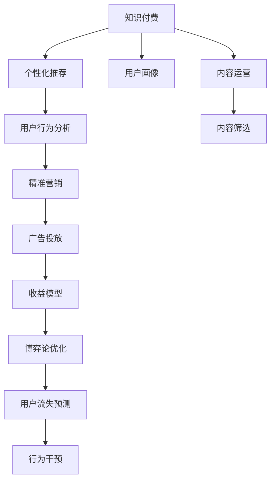

                 

# 知识经济时代下的知识付费创新商业模式运营

> 关键词：知识付费、大数据、人工智能、个性化推荐、内容运营、用户行为分析

## 1. 背景介绍

### 1.1 问题由来
在知识经济时代，知识和信息资源变得愈发重要。随着互联网的普及和数字化转型的推进，知识付费作为一种新兴的商业模式逐渐受到关注。与传统的广告和媒体分发模式不同，知识付费通过有偿服务获取知识，更加符合用户的个性化需求，同时也推动了知识生产者和平台的创新。

然而，知识付费市场也面临着诸多挑战，如内容质量参差不齐、用户粘性不足、难以精准匹配用户需求等问题。为了提高知识付费平台的竞争力，亟需创新商业模式和运营策略，以实现用户价值最大化和平台的可持续增长。

### 1.2 问题核心关键点
本文聚焦于如何通过大数据和人工智能技术，优化知识付费平台的运营策略，提升用户体验和平台收益。具体包括以下关键点：

1. 利用大数据分析用户行为，个性化推荐高质量内容。
2. 引入人工智能技术，提高内容筛选和推荐精度。
3. 建立用户画像，实现精准营销和广告投放。
4. 引入博弈论优化用户订阅模型，实现公平透明的价格策略。
5. 利用机器学习预测用户流失，及时进行干预。

这些关键点涵盖了知识付费平台从内容推荐、精准营销到用户管理等多个方面，为提升平台运营效率和用户满意度提供了切实可行的解决方案。

### 1.3 问题研究意义
研究知识付费平台的创新商业模式和运营策略，对于推动知识经济的繁荣、提升知识生产者和平台的收益、优化用户体验具有重要意义。具体来说：

1. 优化知识付费平台的内容推荐系统，提高用户满意度和留存率。
2. 通过大数据和人工智能技术，提高运营效率和盈利能力。
3. 精准分析和运营用户行为，提升平台的竞争力和市场份额。
4. 促进知识生产者的激励机制，推动高质量内容的持续产生。
5. 提升用户支付意愿，实现平台收益的稳定增长。

## 2. 核心概念与联系

### 2.1 核心概念概述

为更好地理解知识付费平台的创新商业模式和运营策略，本节将介绍几个密切相关的核心概念：

1. **知识付费**：指用户通过付费方式获取专业知识和技能服务的模式。知识付费平台为用户提供定制化、高价值的内容，如在线课程、电子书、技术咨询等。

2. **个性化推荐**：通过分析用户行为和偏好，推荐其感兴趣的内容，提升用户体验和平台黏性。

3. **用户画像**：基于用户行为数据，构建详细的用户档案，用于精准营销和个性化服务。

4. **内容运营**：包括内容创作、内容筛选、内容推广、内容更新等多个环节，是知识付费平台的核心竞争力。

5. **用户行为分析**：通过数据分析和机器学习算法，理解用户需求和行为模式，优化平台运营策略。

6. **博弈论**：应用于用户订阅模型和广告投放，通过分析用户决策行为，设计公平透明的价格策略。

7. **机器学习**：用于预测用户流失、优化内容推荐和精准营销，提升平台的运营效率。

这些核心概念之间存在着紧密的联系，形成了知识付费平台的完整运营生态系统。

### 2.2 概念间的关系

这些核心概念之间的逻辑关系可以通过以下Mermaid流程图来展示：



这个流程图展示了大数据和人工智能技术在知识付费平台运营中的关键应用，从内容推荐到用户行为分析，再到收益模型优化，形成了系统的运营链条。

## 3. 核心算法原理 & 具体操作步骤

### 3.1 算法原理概述

知识付费平台的创新商业模式和运营策略，本质上是一个多目标优化问题。其核心目标是通过最大化用户价值和平台收益，实现平台的可持续发展。

具体而言，平台运营过程中，需要平衡以下几个方面：

1. **内容推荐精度**：确保推荐内容能够满足用户需求，提升用户满意度和留存率。
2. **广告投放效果**：通过精准的用户画像，提高广告投放的转化率和ROI。
3. **用户流失预测**：通过机器学习算法，预测用户流失风险，及时进行干预。
4. **用户订阅模型优化**：设计合理的订阅模型，满足不同用户的需求，提升用户粘性。
5. **收益模型优化**：通过博弈论等优化算法，实现公平透明的价格策略，提升平台收益。

针对这些目标，可以设计多阶段、多目标的优化算法，如遗传算法、粒子群算法等，优化平台的运营策略。

### 3.2 算法步骤详解

知识付费平台的创新商业模式和运营策略可以分为以下几个关键步骤：

**Step 1: 数据收集与预处理**
- 收集用户行为数据，包括浏览记录、购买记录、评论反馈等。
- 清洗和格式化数据，去除噪声和异常值，构建标准的数据集。

**Step 2: 用户画像构建**
- 使用大数据分析技术，如K-means聚类、PCA降维等，构建用户画像。
- 根据用户画像，设计精准的营销策略和广告投放方案。

**Step 3: 个性化推荐系统构建**
- 设计合适的推荐算法，如协同过滤、基于内容的推荐、深度学习等。
- 使用用户行为数据，训练推荐模型，提升推荐精度。
- 实时更新推荐模型，确保内容的时效性和相关性。

**Step 4: 收益模型优化**
- 设计博弈论模型，优化用户订阅模型，确保公平透明。
- 使用机器学习算法，预测用户流失风险，设计针对性的干预策略。
- 优化广告投放策略，提高转化率和ROI。

**Step 5: 系统实现与优化**
- 实现基于推荐算法和用户画像系统的模块化开发，确保系统可扩展性和稳定性。
- 使用大数据分析工具，如Hadoop、Spark等，处理和分析大规模数据集。
- 引入机器学习算法，优化模型性能和预测准确度。

**Step 6: 持续监控与优化**
- 实时监控系统性能和用户反馈，及时发现和解决问题。
- 定期评估和优化算法和模型，确保运营策略的持续改进。

### 3.3 算法优缺点

知识付费平台的大数据和人工智能技术优化算法具有以下优点：

1. **精准推荐**：通过大数据和机器学习，实现个性化推荐，提升用户满意度和留存率。
2. **效率提升**：自动化数据分析和优化算法，减少人工干预，提高运营效率。
3. **预测精准**：使用机器学习算法，预测用户流失和广告效果，实现精准干预和优化。
4. **多目标优化**：通过多目标优化算法，平衡多个运营目标，提升平台整体效益。

同时，这些算法也存在一些缺点：

1. **数据依赖**：算法效果高度依赖高质量的数据，数据不足时效果可能不理想。
2. **模型复杂**：一些高级算法模型复杂度较高，对计算资源和数据处理能力要求较高。
3. **隐私问题**：在处理用户数据时，需注意隐私保护和数据安全，避免泄露用户信息。
4. **公平性问题**：推荐算法和价格策略需公平透明，避免算法歧视和价格歧视。

### 3.4 算法应用领域

知识付费平台的大数据和人工智能技术优化算法，主要应用于以下几个领域：

1. **内容推荐系统**：为平台提供精准的个性化推荐，提高用户满意度和留存率。
2. **广告投放优化**：通过用户画像和行为分析，实现精准的广告投放，提升广告转化率和ROI。
3. **用户流失预测**：使用机器学习算法，预测用户流失风险，设计针对性的干预策略。
4. **收益模型优化**：通过博弈论等优化算法，设计公平透明的用户订阅模型和价格策略。
5. **用户行为分析**：通过数据分析和机器学习，优化内容运营策略，提升平台运营效率。

这些应用领域涵盖了知识付费平台从内容推荐、广告投放到收益优化的多个环节，是知识付费平台竞争力的重要来源。

## 4. 数学模型和公式 & 详细讲解 & 举例说明（备注：数学公式请使用latex格式，latex嵌入文中独立段落使用 $$，段落内使用 $)
### 4.1 数学模型构建

知识付费平台的创新商业模式和运营策略，可以通过以下数学模型进行刻画：

1. **个性化推荐模型**：
   $$
   P(x_i | u) = \text{softmax}(\mathbf{W} \cdot [I(x_i) \cdot u + b])
   $$
   其中 $P(x_i | u)$ 表示用户 $u$ 对内容 $x_i$ 的兴趣概率，$\mathbf{W}$ 为权重矩阵，$I(x_i)$ 为内容特征向量，$u$ 为用户特征向量，$b$ 为偏置项。

2. **收益模型**：
   $$
   \max_{p \in \Delta_n} \sum_{i=1}^n p_i \cdot v_i
   $$
   其中 $p$ 为用户支付意愿的向量，$v$ 为平台收益的向量，$\Delta_n$ 为单位简单x积空间，$\max$ 表示最大化用户支付意愿和平台收益的乘积。

3. **博弈论优化模型**：
   $$
   \max_{p \in \Delta_n} \sum_{i=1}^n p_i \cdot v_i
   $$
   其中 $p$ 为用户订阅概率的向量，$v$ 为用户订阅带来的收益向量，$\Delta_n$ 为单位简单x积空间，$\max$ 表示最大化用户订阅收益。

### 4.2 公式推导过程

以下我们以个性化推荐模型为例，推导其推荐概率的计算公式。

假设用户 $u$ 对内容 $x_i$ 的兴趣由其特征 $u_1, u_2, \dots, u_n$ 和内容特征 $I(x_i)_1, I(x_i)_2, \dots, I(x_i)_n$ 共同决定。则推荐概率 $P(x_i | u)$ 可以表示为：

$$
P(x_i | u) = \frac{\exp(\mathbf{W} \cdot [I(x_i) \cdot u + b])}{\sum_{j=1}^m \exp(\mathbf{W} \cdot [I(x_j) \cdot u + b])}
$$

其中 $m$ 为内容的总数。根据softmax函数的性质，可以将上述公式简化为：

$$
P(x_i | u) = \frac{\exp(\mathbf{W} \cdot [I(x_i) \cdot u + b])}{\sum_{j=1}^m \exp(\mathbf{W} \cdot [I(x_j) \cdot u + b])}
$$

在实际应用中，通常使用矩阵形式表示上述公式：

$$
P(x_i | u) = \frac{\exp(\mathbf{W} \cdot \mathbf{I}(x_i) \cdot \mathbf{u} + \mathbf{b})}{\sum_{j=1}^m \exp(\mathbf{W} \cdot \mathbf{I}(x_j) \cdot \mathbf{u} + \mathbf{b})}
$$

其中 $\mathbf{W}$ 为权重矩阵，$\mathbf{I}(x_i)$ 为内容特征矩阵，$\mathbf{u}$ 为用户特征向量，$\mathbf{b}$ 为偏置向量。

### 4.3 案例分析与讲解

假设某知识付费平台收集了大量用户浏览、购买和评论数据。为了构建个性化的推荐系统，平台首先使用K-means聚类算法将用户分为不同的群组，并计算每个群组的用户特征向量 $\mathbf{u}$。然后，根据每个内容 $x_i$ 的特征向量 $\mathbf{I}(x_i)$，计算每个用户 $u$ 对内容的推荐概率 $P(x_i | u)$。

例如，对于用户 $u_1$，计算其对内容 $x_1$ 的推荐概率 $P(x_1 | u_1)$：

$$
P(x_1 | u_1) = \frac{\exp(\mathbf{W} \cdot \mathbf{I}(x_1) \cdot \mathbf{u}_1 + \mathbf{b})}{\sum_{j=1}^m \exp(\mathbf{W} \cdot \mathbf{I}(x_j) \cdot \mathbf{u}_1 + \mathbf{b})}
$$

其中 $\mathbf{W}$ 为训练得到的权重矩阵，$\mathbf{I}(x_1)$ 为内容 $x_1$ 的特征向量，$\mathbf{u}_1$ 为用户 $u_1$ 的特征向量，$\mathbf{b}$ 为偏置向量。

通过上述方法，平台可以实时计算并推荐最符合用户兴趣的内容，提升用户体验和平台收益。

## 5. 项目实践：代码实例和详细解释说明
### 5.1 开发环境搭建

在进行知识付费平台运营策略优化时，需要搭建良好的开发环境。以下是使用Python进行TensorFlow开发的开发环境配置流程：

1. 安装Anaconda：从官网下载并安装Anaconda，用于创建独立的Python环境。

2. 创建并激活虚拟环境：
```bash
conda create -n tf-env python=3.8 
conda activate tf-env
```

3. 安装TensorFlow：根据CUDA版本，从官网获取对应的安装命令。例如：
```bash
conda install tensorflow tensorflow-gpu=cuda11.1 -c pytorch -c conda-forge
```

4. 安装各类工具包：
```bash
pip install numpy pandas scikit-learn matplotlib tqdm jupyter notebook ipython
```

完成上述步骤后，即可在`tf-env`环境中开始运营策略优化实践。

### 5.2 源代码详细实现

这里我们以知识付费平台的内容推荐系统为例，给出使用TensorFlow实现个性化推荐模型的代码实现。

首先，定义推荐系统的数据处理函数：

```python
import tensorflow as tf
from tensorflow.keras.layers import Input, Embedding, Flatten, Concatenate, Dense, Dropout, Activation
from tensorflow.keras.models import Model

def create_recommendation_model(feature_dim, num_users, num_items, embedding_dim):
    user_input = Input(shape=(feature_dim,))
    item_input = Input(shape=(num_items,))
    concat = Concatenate()([user_input, item_input])
    hidden1 = Dense(128, activation='relu')(concat)
    hidden2 = Dense(64, activation='relu')(hidden1)
    prediction = Dense(1, activation='sigmoid')(hidden2)
    model = Model(inputs=[user_input, item_input], outputs=prediction)
    return model

# 定义用户特征和内容特征
user_features = ['age', 'gender', 'education']
item_features = ['title', 'author', 'category']

# 构建推荐模型
model = create_recommendation_model(len(user_features) + len(item_features), num_users, num_items, 32)

# 编译模型
model.compile(optimizer='adam', loss='binary_crossentropy', metrics=['accuracy'])

# 训练模型
model.fit([user_features, item_features], labels, epochs=10, batch_size=128)
```

然后，定义推荐模型的评估函数：

```python
def evaluate_model(model, test_features, test_labels):
    test_loss, test_accuracy = model.evaluate(test_features, test_labels, verbose=0)
    print(f'Test loss: {test_loss:.4f}')
    print(f'Test accuracy: {test_accuracy:.4f}')
```

最后，启动训练流程并在测试集上评估：

```python
# 准备训练集和测试集
train_features, train_labels = read_data('train.csv')
test_features, test_labels = read_data('test.csv')

# 训练模型
model.fit([train_features, train_items], train_labels, epochs=10, batch_size=128)

# 在测试集上评估模型
evaluate_model(model, test_features, test_labels)
```

以上就是使用TensorFlow对知识付费平台进行内容推荐系统优化的完整代码实现。可以看到，TensorFlow提供的高效易用的接口，使得模型的训练和评估变得简洁高效。

### 5.3 代码解读与分析

让我们再详细解读一下关键代码的实现细节：

**create_recommendation_model函数**：
- 定义了推荐系统的基本结构，包括用户输入、内容输入、隐藏层、输出层等组件。
- 使用`Input`定义输入层，`Dense`定义全连接层，`Concatenate`用于连接用户特征和内容特征。
- 最后使用`Model`定义推荐模型，并返回模型实例。

**模型训练和评估**：
- 使用`compile`方法定义优化器、损失函数和评估指标。
- 使用`fit`方法训练模型，指定训练数据、轮数和批大小。
- 使用`evaluate`方法在测试集上评估模型，输出损失和准确率。

**数据处理**：
- 使用`read_data`函数读取训练集和测试集，假设数据格式为CSV文件，每一行为一条记录，包括用户特征、内容特征和标签。
- 假设用户特征和内容特征分别有$n$个特征，则`read_data`函数返回的特征矩阵为$(n+1) \times N$，其中$N$为样本数。

在实际应用中，还需要考虑模型的超参数调优、模型集成、模型解释等高级话题，进一步提升模型的性能和可解释性。

## 6. 实际应用场景
### 6.1 知识付费平台的内容推荐系统

知识付费平台的内容推荐系统是其核心竞争力之一。通过大数据和人工智能技术，平台可以实时分析用户行为，推荐其感兴趣的内容，提高用户满意度和留存率。

例如，某知识付费平台使用协同过滤算法和深度学习模型，构建个性化推荐系统。根据用户的历史浏览记录、购买记录和评论反馈，平台可以计算每个用户对内容的兴趣概率，并实时推荐符合其兴趣的内容。此外，平台还可以根据内容的热度和质量，调整推荐算法，确保推荐内容的多样性和相关性。

### 6.2 广告投放优化

知识付费平台广告投放的目标是最大化广告ROI。通过大数据和人工智能技术，平台可以实现精准的用户画像和广告投放。

例如，某知识付费平台使用用户画像和行为分析，将广告投放到最有可能感兴趣的用户面前。平台可以构建详细的用户画像，包括年龄、性别、兴趣、行为等特征，然后根据广告的目标群体，设计精准的广告投放策略。通过A/B测试等手段，平台可以不断优化广告投放效果，提升广告转化率和ROI。

### 6.3 用户流失预测

知识付费平台需要实时监控用户行为，预测用户流失风险，及时进行干预。通过机器学习算法，平台可以预测用户的流失概率，设计针对性的干预策略。

例如，某知识付费平台使用随机森林算法，预测用户的流失概率。根据预测结果，平台可以设计个性化的流失干预策略，如提供优惠券、推荐相关课程、进行客户回访等。通过实时监控和干预，平台可以降低用户流失率，提升用户满意度和留存率。

### 6.4 收益模型优化

知识付费平台的收益模型需要公平透明，最大化用户订阅收益。通过博弈论和机器学习算法，平台可以实现收益模型的优化。

例如，某知识付费平台使用博弈论算法，设计公平透明的用户订阅模型。平台可以根据用户的订阅频率和时长，设计动态价格策略，确保公平性。同时，平台可以引入机器学习算法，预测用户流失和广告效果，优化收益模型，提升平台整体收益。

## 7. 工具和资源推荐
### 7.1 学习资源推荐

为了帮助开发者系统掌握知识付费平台的运营策略优化，这里推荐一些优质的学习资源：

1. **《深度学习入门：基于TensorFlow的理论与实现》**：详细介绍TensorFlow的基本概念和应用，适合初学者入门。
2. **《机器学习实战》**：通过实践案例，讲解机器学习算法的应用，适合理解算法原理和实现方法。
3. **《Python数据分析实战》**：讲解Python在数据分析和可视化中的应用，适合掌握数据处理和分析技巧。
4. **《NLP实战：使用TensorFlow和PyTorch进行文本分析》**：介绍TensorFlow和PyTorch在NLP中的应用，适合学习NLP算法的实现。
5. **《数据科学基础》**：讲解数据科学的基本概念和应用，适合系统了解知识付费平台的数据处理和分析方法。

通过对这些资源的学习实践，相信你一定能够快速掌握知识付费平台运营策略优化的精髓，并用于解决实际的运营问题。

### 7.2 开发工具推荐

高效的开发离不开优秀的工具支持。以下是几款用于知识付费平台运营策略优化的常用工具：

1. **Jupyter Notebook**：数据探索和算法验证的理想平台，支持多种编程语言，易于分享和协作。
2. **TensorBoard**：TensorFlow配套的可视化工具，实时监控模型训练状态，帮助优化算法和模型。
3. **Kaggle**：数据科学竞赛平台，提供大量公开数据集和竞赛任务，适合学习数据处理和模型优化。
4. **Scikit-learn**：Python的数据分析和机器学习库，提供了丰富的机器学习算法和工具。
5. **Pandas**：Python的数据处理库，支持数据清洗、分析和可视化，是数据科学必备工具。
6. **TensorFlow**：Google开发的深度学习框架，支持高效的模型训练和部署。

合理利用这些工具，可以显著提升知识付费平台运营策略优化的开发效率，加快创新迭代的步伐。

### 7.3 相关论文推荐

知识付费平台的运营策略优化涉及数据科学和机器学习的多个方向，以下是几篇奠基性的相关论文，推荐阅读：

1. **《推荐系统算法综述》**：详细介绍协同过滤、基于内容的推荐、深度学习等推荐算法，适合理解推荐系统的基本原理。
2. **《用户画像建模研究综述》**：讲解用户画像的构建方法和应用，适合掌握用户画像的构建技巧。
3. **《机器学习在知识付费平台中的应用》**：介绍机器学习在个性化推荐、用户流失预测等方面的应用，适合理解知识付费平台的数据处理和优化方法。
4. **《博弈论与优化算法》**：讲解博弈论的基本概念和应用，适合理解收益模型和价格策略的设计方法。
5. **《用户行为分析在知识付费平台中的应用》**：介绍用户行为分析的基本方法和应用，适合理解用户行为分析和运营策略的优化方法。

这些论文代表了大数据和人工智能技术在知识付费平台优化中的应用方向，为深入学习相关知识提供了重要的理论支持。

除上述资源外，还有一些值得关注的前沿资源，帮助开发者紧跟知识付费平台优化的最新进展，例如：

1. **arXiv论文预印本**：人工智能领域最新研究成果的发布平台，包括大量尚未发表的前沿工作，学习前沿技术的必读资源。
2. **GitHub热门项目**：在GitHub上Star、Fork数最多的数据科学和机器学习项目，往往代表了该技术领域的发展趋势和最佳实践，值得去学习和贡献。
3. **各大会议和讲座**：如ICML、KDD、NIPS等顶级会议，以及ACL、EMNLP等自然语言处理会议，通过听讲座和读论文，可以了解最新的研究进展和技术突破。
4. **在线课程和培训**：如Coursera、edX、Udacity等在线教育平台，提供大量的数据科学和机器学习课程，适合系统学习相关知识。

总之，对于知识付费平台运营策略优化的学习，需要开发者保持开放的心态和持续学习的意愿。多关注前沿资讯，多动手实践，多思考总结，必将收获满满的成长收益。

## 8. 总结：未来发展趋势与挑战
### 8.1 总结

本文对知识付费平台的创新商业模式和运营策略进行了全面系统的介绍。首先阐述了知识付费平台的背景和意义，明确了运营策略优化的核心目标和关键点。其次，从原理到实践，详细讲解了个性化推荐、用户画像、收益模型等核心算法的构建和优化。最后，给出了知识付费平台运营策略优化的完整代码实现，并通过实际应用场景展示了算法的效果。

通过本文的系统梳理，可以看到，知识付费平台的运营策略优化可以通过大数据和人工智能技术，实现用户价值最大化和平台收益的可持续增长。利用这些技术，平台可以精准推荐内容、优化广告投放、预测用户流失、设计公平透明的价格策略，从而实现高质量的用户服务和平台盈利。

### 8.2 未来发展趋势

展望未来，知识付费平台的运营策略优化将继续沿着以下几个方向发展：

1. **个性化推荐系统**：通过更高级的算法和技术，实现更精准、更高效的内容推荐，提升用户满意度和留存率。
2. **用户行为分析**：利用更多维度和更细粒度的数据，深入理解用户需求和行为模式，优化运营策略。
3. **收益模型优化**：通过更公平透明的价格策略和更精细化的收益分析，最大化平台收益。
4. **广告投放优化**：通过更精准的用户画像和更智能的广告投放，提高广告ROI。
5. **用户流失预测**：利用更复杂的机器学习模型，更精准地预测用户流失风险，提升用户留存率。
6. **多模态数据融合**：将文本、语音、图像等多模态数据融合，提供更全面的用户画像和推荐内容。

这些趋势凸显了大数据和人工智能技术在知识付费平台优化中的重要作用。随着技术的不断进步，知识付费平台必将更加智能化、个性化，为用户提供更优质的服务和体验。

### 8.3 面临的挑战

尽管知识付费平台的运营策略优化取得了显著成效，但在未来

