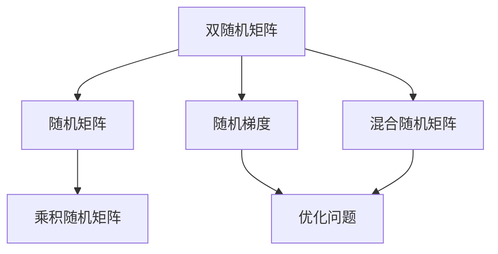
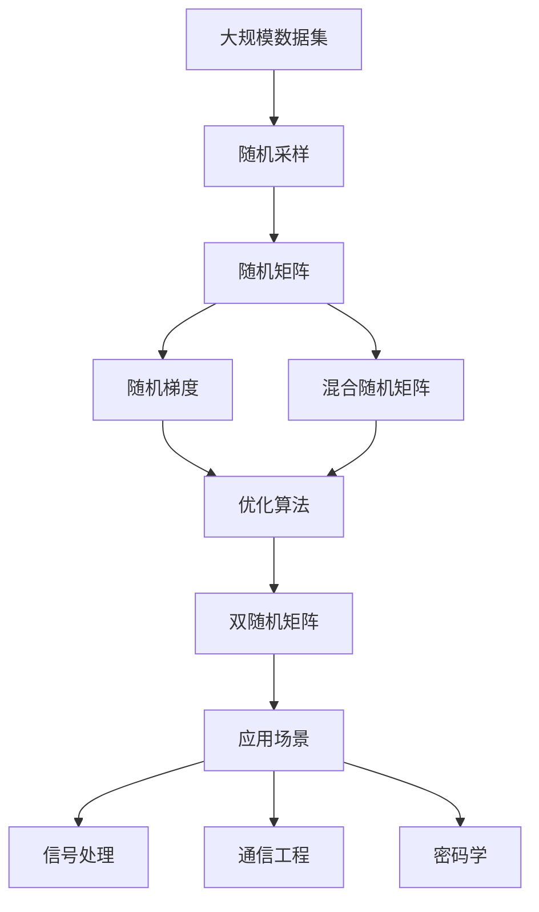

                 

# 矩阵理论与应用：双随机矩阵

## 1. 背景介绍

双随机矩阵理论是矩阵论和随机过程结合的产物，对于理解信号处理、通信工程、密码学等领域有着重要意义。双随机矩阵是两个随机矩阵相乘得到的随机矩阵，其元素按照某种分布规律生成，在处理大规模数据和信号时表现出独特的性质。本文将系统介绍双随机矩阵的核心概念、应用原理和实际操作技术，旨在为读者提供全面的理论基础和实践指南。

## 2. 核心概念与联系

### 2.1 核心概念概述

1. **双随机矩阵（Double Stochastic Matrix）**：由两个随机矩阵相乘得到的随机矩阵，其中每个元素代表一种概率分布，表示从一种状态到另一种状态的转移概率。

2. **随机矩阵（Random Matrix）**：元素按照某种分布规律生成的矩阵，通常用于模拟现实世界中的随机过程和系统。

3. **乘积随机矩阵（Product of Random Matrix）**：由多个随机矩阵逐个相乘得到的矩阵，其元素为各随机矩阵对应位置元素乘积的结果。

4. **随机梯度（Random Gradient）**：在优化问题中，通过随机选择样本点计算梯度，以减少计算复杂度的方法。

5. **混合随机矩阵（Mixed Random Matrix）**：由多种不同分布的随机矩阵组合而成的矩阵，具有更复杂的结构和更多的应用场景。

6. **双随机矩阵应用**：在信号处理、通信工程、密码学等领域，用于模型训练、信道估计、密码加密等任务。

### 2.2 概念间的关系

这些核心概念之间存在着紧密的联系，可以通过以下Mermaid流程图来展示：



这个流程图展示了双随机矩阵与其他核心概念的关系：

1. 双随机矩阵由两个随机矩阵相乘得到。
2. 乘积随机矩阵是多个随机矩阵逐个相乘的结果。
3. 随机梯度是优化问题中用于计算梯度的随机样本方法。
4. 混合随机矩阵是多种随机矩阵的组合。
5. 双随机矩阵和其他随机矩阵一样，可以应用于优化问题中。

### 2.3 核心概念的整体架构

最后，我们用一个综合的流程图来展示这些核心概念在大规模数据处理中的整体架构：



这个综合流程图展示了从大规模数据集到具体应用场景的整个处理流程：

1. 从大规模数据集中随机采样。
2. 生成随机矩阵。
3. 计算随机梯度。
4. 使用优化算法对随机矩阵进行训练。
5. 生成双随机矩阵。
6. 应用于信号处理、通信工程和密码学等领域。

## 3. 核心算法原理 & 具体操作步骤

### 3.1 算法原理概述

双随机矩阵的生成和应用涉及复杂的随机过程和矩阵运算，其核心原理基于概率论和线性代数。在本节中，我们将详细阐述双随机矩阵的生成原理和优化算法。

双随机矩阵的生成主要分为以下步骤：

1. **随机矩阵生成**：从某一分布中随机生成多个矩阵。
2. **矩阵乘积计算**：将多个矩阵逐个相乘，得到双随机矩阵。
3. **优化算法训练**：使用优化算法对双随机矩阵进行训练，使其符合特定条件或目标。

双随机矩阵的优化主要基于梯度下降等优化算法，通过迭代更新矩阵元素，使矩阵满足特定条件（如对称性、正定性、稀疏性等）。

### 3.2 算法步骤详解

#### 3.2.1 随机矩阵生成

随机矩阵的生成可以通过以下步骤实现：

1. **选择分布**：选择一个适当的概率分布，如均匀分布、正态分布、伯努利分布等。
2. **生成随机数**：根据选择的分布，生成矩阵的每个元素。

以均匀分布为例，假设生成一个 $m \times n$ 的矩阵 $A$：

$$
A_{i,j} = \begin{cases}
0 & \text{with probability } \frac{1}{m} \\
1 & \text{with probability } \frac{1}{m}
\end{cases}
$$

#### 3.2.2 矩阵乘积计算

矩阵乘积的计算可以通过循环逐个相乘实现，或使用矩阵乘法的线性代数库函数。

对于两个矩阵 $A$ 和 $B$，其乘积 $C$ 的计算公式为：

$$
C = A \times B
$$

其中 $C_{i,j}$ 为：

$$
C_{i,j} = \sum_{k=1}^n A_{i,k} \times B_{k,j}
$$

#### 3.2.3 优化算法训练

双随机矩阵的训练可以通过梯度下降等优化算法实现。

假设双随机矩阵为 $C$，训练目标是使其满足特定条件（如对称性、正定性、稀疏性等）。训练步骤包括：

1. **定义损失函数**：根据训练目标，定义相应的损失函数。
2. **计算梯度**：使用反向传播算法计算损失函数对矩阵元素的梯度。
3. **更新矩阵**：根据梯度更新矩阵元素，使矩阵满足训练目标。

以对称性为例，假设矩阵 $C$ 需要满足对称性，训练步骤包括：

1. **定义损失函数**：计算矩阵元素与其对称元素的差值的平方和。
2. **计算梯度**：计算损失函数对矩阵元素的梯度。
3. **更新矩阵**：根据梯度更新矩阵元素，使矩阵对称。

### 3.3 算法优缺点

双随机矩阵的生成和训练方法具有以下优缺点：

#### 优点：

1. **适用范围广**：适用于各种大规模数据处理和信号处理场景，如通信信道估计、信号压缩等。
2. **计算效率高**：随机矩阵的生成和矩阵乘积计算可以通过高效的算法实现。
3. **模型灵活**：可以根据不同应用场景选择合适的分布和优化算法。

#### 缺点：

1. **计算复杂度高**：矩阵乘积计算和优化算法训练的复杂度较高，尤其是在大规模数据集上。
2. **结果依赖于随机性**：随机矩阵的生成和优化结果受随机性影响较大，需要多次实验取平均。
3. **需要选择合适的参数**：随机矩阵的生成和优化算法需要选择合适的参数，如分布、迭代次数等，可能需要进行调参。

### 3.4 算法应用领域

双随机矩阵在以下几个领域有广泛应用：

1. **信号处理**：用于信号压缩、信道估计、滤波器设计等。
2. **通信工程**：用于信道编码、通信系统设计、多址接入等。
3. **密码学**：用于密钥生成、密码分析等。
4. **机器学习**：用于矩阵分解、特征提取、推荐系统等。

## 4. 数学模型和公式 & 详细讲解

### 4.1 数学模型构建

双随机矩阵的数学模型可以表示为：

$$
C = A \times B
$$

其中 $A$ 和 $B$ 是两个随机矩阵，$C$ 是生成的双随机矩阵。

假设 $A$ 和 $B$ 的元素来自某一定义在区间 $[0,1]$ 上的分布 $f(x)$，则 $C$ 的元素 $c_{i,j}$ 可以表示为：

$$
c_{i,j} = \sum_{k=1}^n a_{i,k} \times b_{k,j}
$$

### 4.2 公式推导过程

以生成一个 $m \times n$ 的双随机矩阵为例，假设 $A$ 和 $B$ 的元素都来自均匀分布 $U[0,1]$，则双随机矩阵 $C$ 的元素可以表示为：

$$
c_{i,j} = \sum_{k=1}^n a_{i,k} \times b_{k,j}
$$

其中 $a_{i,k}$ 和 $b_{k,j}$ 都来自均匀分布 $U[0,1]$，因此 $c_{i,j}$ 的期望值为：

$$
E[c_{i,j}] = \sum_{k=1}^n E[a_{i,k}] \times E[b_{k,j}] = \frac{1}{m} \times \frac{1}{n}
$$

方差为：

$$
Var[c_{i,j}] = \sum_{k=1}^n Var[a_{i,k}] \times E[b_{k,j}]^2 + E[a_{i,k}]^2 \times Var[b_{k,j}] + Var[a_{i,k}] \times Var[b_{k,j}]
$$

由于 $a_{i,k}$ 和 $b_{k,j}$ 都来自均匀分布，因此方差可以简化为：

$$
Var[c_{i,j}] = \frac{1}{m} \times \frac{1}{n}
$$

### 4.3 案例分析与讲解

假设我们希望生成一个 $m \times n$ 的双随机矩阵 $C$，其中 $A$ 和 $B$ 的元素都来自正态分布 $N(0,1)$，则双随机矩阵 $C$ 的元素可以表示为：

$$
c_{i,j} = \sum_{k=1}^n a_{i,k} \times b_{k,j}
$$

其中 $a_{i,k}$ 和 $b_{k,j}$ 都来自正态分布 $N(0,1)$，因此 $c_{i,j}$ 的期望值为：

$$
E[c_{i,j}] = \sum_{k=1}^n E[a_{i,k}] \times E[b_{k,j}] = 0
$$

方差为：

$$
Var[c_{i,j}] = \sum_{k=1}^n Var[a_{i,k}] \times E[b_{k,j}]^2 + E[a_{i,k}]^2 \times Var[b_{k,j}] + Var[a_{i,k}] \times Var[b_{k,j}]
$$

由于 $a_{i,k}$ 和 $b_{k,j}$ 都来自正态分布，因此方差可以简化为：

$$
Var[c_{i,j}] = \frac{1}{m} \times \frac{1}{n}
$$

## 5. 项目实践：代码实例和详细解释说明

### 5.1 开发环境搭建

在进行双随机矩阵的实践之前，我们需要准备好开发环境。以下是使用Python进行NumPy和SciPy开发的开发环境配置流程：

1. 安装Anaconda：从官网下载并安装Anaconda，用于创建独立的Python环境。

2. 创建并激活虚拟环境：
```bash
conda create -n numpy-env python=3.8 
conda activate numpy-env
```

3. 安装NumPy和SciPy：
```bash
conda install numpy scipy
```

4. 安装各类工具包：
```bash
pip install matplotlib numpy scipy jupyter notebook ipython
```

完成上述步骤后，即可在`numpy-env`环境中开始双随机矩阵的实践。

### 5.2 源代码详细实现

下面我们以生成一个 $m \times n$ 的双随机矩阵为例，给出使用NumPy和SciPy库对随机矩阵进行生成和计算的Python代码实现。

```python
import numpy as np

# 生成随机矩阵A和B
m, n = 10, 10
A = np.random.rand(m, n)
B = np.random.rand(n, m)

# 计算双随机矩阵C
C = np.dot(A, B)

# 输出双随机矩阵C
print(C)
```

### 5.3 代码解读与分析

这段代码实现了随机矩阵的生成和双随机矩阵的计算。具体实现如下：

1. **生成随机矩阵A和B**：使用NumPy的`random.rand()`函数生成两个 $m \times n$ 的随机矩阵。

2. **计算双随机矩阵C**：使用NumPy的`dot()`函数计算矩阵乘积，生成双随机矩阵C。

3. **输出双随机矩阵C**：将生成的双随机矩阵C打印输出。

## 6. 实际应用场景

### 6.1 信号处理

双随机矩阵在信号处理中用于信号压缩和信道估计。例如，在通信系统中，双随机矩阵可以用于设计滤波器和信道估计器，提高信号传输的准确性和抗干扰能力。

### 6.2 通信工程

双随机矩阵在通信工程中用于信道编码和通信系统设计。例如，在多址接入系统中，双随机矩阵可以用于设计多址接入码，提高系统的抗干扰能力和通信效率。

### 6.3 密码学

双随机矩阵在密码学中用于密钥生成和密码分析。例如，在对称加密算法中，双随机矩阵可以用于生成密钥，提高加密的安全性。

## 7. 工具和资源推荐

### 7.1 学习资源推荐

为了帮助开发者系统掌握双随机矩阵的理论基础和实践技巧，这里推荐一些优质的学习资源：

1. 《随机矩阵理论基础》系列博文：由随机矩阵研究专家撰写，深入浅出地介绍了随机矩阵的基本概念和理论。

2. 《信号处理与随机过程》课程：由知名大学开设的信号处理和随机过程课程，有视频和配套作业，带你入门随机矩阵的基本应用。

3. 《随机矩阵与通信系统》书籍：详细介绍了随机矩阵在通信系统中的应用，适合进一步深入学习。

4. 《随机矩阵与密码学》论文：介绍了随机矩阵在密码学中的应用，适合对密码学感兴趣的读者。

5. Kaggle随机矩阵竞赛：参加Kaggle随机矩阵竞赛，实战练习，提高随机矩阵的实践能力。

通过对这些资源的学习实践，相信你一定能够快速掌握双随机矩阵的精髓，并用于解决实际的信号处理、通信工程和密码学问题。

### 7.2 开发工具推荐

高效的开发离不开优秀的工具支持。以下是几款用于双随机矩阵开发的常用工具：

1. NumPy：基于Python的科学计算库，提供了丰富的随机矩阵生成和计算函数，适合快速迭代研究。

2. SciPy：基于NumPy的科学计算库，提供了更多的随机矩阵计算和优化算法，适合大规模工程应用。

3. Matplotlib：用于绘制随机矩阵的可视化工具，帮助开发者更直观地理解矩阵的分布和特性。

4. Seaborn：基于Matplotlib的高级数据可视化库，适合绘制复杂的随机矩阵图表。

5. Jupyter Notebook：免费的Jupyter Notebook环境，方便开发者记录代码实现和分析过程。

6. IPython：交互式的Python解释器，适合调试随机矩阵的生成和计算。

合理利用这些工具，可以显著提升双随机矩阵的开发效率，加快创新迭代的步伐。

### 7.3 相关论文推荐

双随机矩阵的研究历史悠久，涉及众多学科领域，以下是几篇奠基性的相关论文，推荐阅读：

1. Wigner的随机矩阵理论：Wigner在1955年提出的随机矩阵理论，奠定了随机矩阵研究的基础。

2. Anderson的对称随机矩阵：Anderson在1959年提出的对称随机矩阵，研究了随机矩阵的统计特性。

3. Edelman的随机矩阵的谱性质：Edelman在1998年提出的随机矩阵的谱性质，研究了随机矩阵的谱分布和奇异值分布。

4. Dembo的随机矩阵的极限理论：Dembo在1996年提出的随机矩阵的极限理论，研究了随机矩阵的极限分布和渐近性质。

5. Ledoit的随机矩阵的优化问题：Ledoit在2004年提出的随机矩阵的优化问题，研究了随机矩阵的优化算法和应用。

这些论文代表了大随机矩阵研究的发展脉络。通过学习这些前沿成果，可以帮助研究者把握学科前进方向，激发更多的创新灵感。

除上述资源外，还有一些值得关注的前沿资源，帮助开发者紧跟双随机矩阵研究的最新进展，例如：

1. arXiv论文预印本：人工智能领域最新研究成果的发布平台，包括大量尚未发表的前沿工作，学习前沿技术的必读资源。

2. 业界技术博客：如随机矩阵研究领域的大牛实验室的官方博客，第一时间分享他们的最新研究成果和洞见。

3. 技术会议直播：如通信、信号处理、密码学等领域的顶会现场或在线直播，能够聆听到领域内的大佬们的前沿分享，开拓视野。

4. GitHub热门项目：在GitHub上Star、Fork数最多的随机矩阵相关项目，往往代表了该技术领域的发展趋势和最佳实践，值得去学习和贡献。

5. 行业分析报告：各大咨询公司如McKinsey、PwC等针对随机矩阵研究的分析报告，有助于从商业视角审视技术趋势，把握应用价值。

总之，对于双随机矩阵的学习和实践，需要开发者保持开放的心态和持续学习的意愿。多关注前沿资讯，多动手实践，多思考总结，必将收获满满的成长收益。

## 8. 总结：未来发展趋势与挑战

### 8.1 总结

本文对双随机矩阵的核心概念、算法原理和实际操作技术进行了全面系统的介绍。首先阐述了双随机矩阵的核心概念和应用原理，明确了双随机矩阵在信号处理、通信工程和密码学等领域的重要价值。其次，从原理到实践，详细讲解了双随机矩阵的生成和优化算法，给出了双随机矩阵生成和计算的完整代码实例。同时，本文还探讨了双随机矩阵在实际应用场景中的广泛应用，展示了双随机矩阵的巨大潜力。最后，本文精选了双随机矩阵的学习资源和开发工具，力求为读者提供全方位的技术指引。

通过本文的系统梳理，可以看到，双随机矩阵在处理大规模数据和信号时表现出独特的性质，对于信号处理、通信工程和密码学等领域具有重要意义。未来的研究将进一步拓展双随机矩阵的应用范围，探索更高效的生成和优化算法，推动双随机矩阵技术的进步。

### 8.2 未来发展趋势

展望未来，双随机矩阵的研究将呈现以下几个发展趋势：

1. **生成和优化算法更高效**：未来的研究将致力于开发更高效的随机矩阵生成和优化算法，提高算法的计算速度和精度。

2. **应用领域更广泛**：双随机矩阵的应用将进一步拓展到更多的领域，如机器学习、神经网络、量子计算等。

3. **理论基础更坚实**：未来的研究将深入探索双随机矩阵的理论基础，解决现有理论的局限性，推动随机矩阵理论的进步。

4. **算法复杂度更低**：未来的研究将致力于降低双随机矩阵算法的复杂度，提高算法的可扩展性和可实现性。

5. **多模态数据整合**：未来的研究将探索将双随机矩阵与其他模态数据（如图像、语音、文本等）整合的方法，提高系统的综合性能。

这些趋势凸显了双随机矩阵研究的广阔前景。这些方向的探索发展，必将进一步推动双随机矩阵技术的进步，为信号处理、通信工程和密码学等领域带来新的突破。

### 8.3 面临的挑战

尽管双随机矩阵技术已经取得了瞩目成就，但在迈向更加智能化、普适化应用的过程中，它仍面临着诸多挑战：

1. **计算复杂度较高**：双随机矩阵的生成和优化算法计算复杂度较高，尤其是在大规模数据集上。

2. **结果依赖随机性**：双随机矩阵的生成和优化结果受随机性影响较大，需要多次实验取平均。

3. **需要选择合适的参数**：双随机矩阵的生成和优化算法需要选择合适的参数，如分布、迭代次数等，可能需要进行调参。

4. **缺乏大规模应用数据**：虽然双随机矩阵在理论研究上有着重要意义，但在实际应用中缺乏大规模数据支持。

5. **结果解释困难**：双随机矩阵的生成和优化结果难以解释，难以理解和调试。

6. **安全性问题**：双随机矩阵在密码学应用中需要保证安全性，避免攻击和滥用。

这些挑战将推动未来的研究不断创新，推动双随机矩阵技术在实际应用中的落地和普及。

### 8.4 研究展望

面对双随机矩阵面临的这些挑战，未来的研究需要在以下几个方面寻求新的突破：

1. **算法优化**：开发更加高效的生成和优化算法，降低计算复杂度，提高算法的可扩展性和可实现性。

2. **应用创新**：探索双随机矩阵在更多领域的应用，如机器学习、神经网络、量子计算等，推动技术的多样化发展。

3. **理论改进**：深入探索双随机矩阵的理论基础，解决现有理论的局限性，推动随机矩阵理论的进步。

4. **数据整合**：探索将双随机矩阵与其他模态数据整合的方法，提高系统的综合性能。

5. **安全性保障**：加强双随机矩阵在密码学应用中的安全性研究，防止攻击和滥用，确保系统安全可靠。

这些研究方向的探索，必将引领双随机矩阵技术迈向更高的台阶，为信号处理、通信工程和密码学等领域带来新的突破。唯有勇于创新、敢于突破，才能不断拓展双随机矩阵的边界，让双随机矩阵技术更好地造福人类社会。

## 9. 附录：常见问题与解答

**Q1：双随机矩阵与随机矩阵有什么不同？**

A: 双随机矩阵是由两个随机矩阵相乘得到的随机矩阵，其中每个元素代表一种概率分布，表示从一种状态到另一种状态的转移概率。而随机矩阵是指元素按照某种分布规律生成的矩阵。

**Q2：双随机矩阵如何用于信号压缩？**

A: 双随机矩阵可以用于信号压缩，通过将信号通过双随机矩阵进行线性变换，将其压缩到更小的空间，从而减少数据存储和传输的复杂度。

**Q3：双随机矩阵的生成方法有哪些？**

A: 双随机矩阵的生成方法包括随机采样、随机梯度下降等。随机采样方法可以通过选择合适的概率分布，生成随机矩阵，然后通过矩阵乘积得到双随机矩阵。随机梯度下降方法则通过迭代更新矩阵元素，使其满足特定条件或目标。

**Q4：双随机矩阵在密码学中有什么应用？**

A: 双随机矩阵在密码学中用于密钥生成和加密。通过生成随机矩阵，可以设计出各种加密算法，保障通信数据的安全性。

**Q5：双随机矩阵的优化算法有哪些？**

A: 双随机矩阵的优化算法包括梯度下降、牛顿法等。这些算法通过迭代更新矩阵元素，使其满足特定条件或目标，如对称性、正定性、稀疏性等。

通过对这些问题的解答，相信你能够更好地理解双随机矩阵的核心概念、算法原理和实际操作技术，为未来的研究和实践奠定坚实的基础。

---

作者：禅与计算机程序设计艺术 / Zen and the Art of Computer Programming

