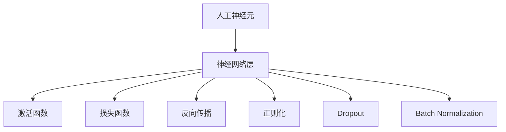
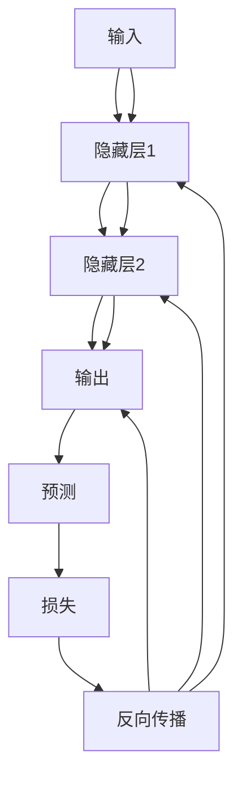
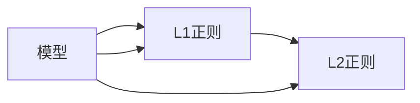
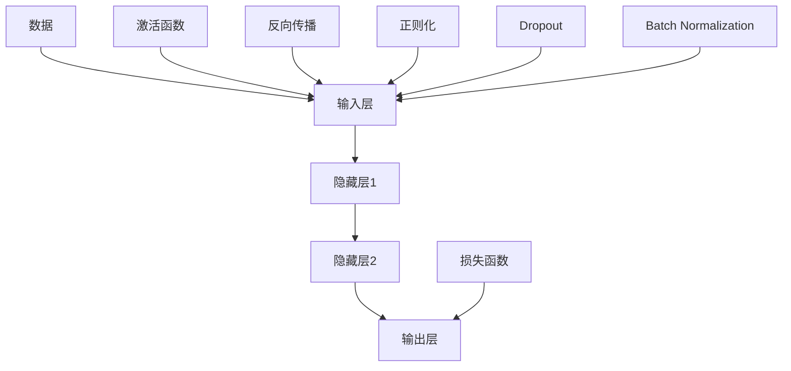

                 

# 神经网络：人工智能的基石

## 1. 背景介绍

### 1.1 问题由来
人工智能(AI)，作为当今科技领域的前沿，已深入各行各业，带来翻天覆地的变革。从语音识别、图像处理、自然语言处理到自动驾驶、医疗诊断、金融分析等，AI技术的应用场景不断扩展。而神经网络（Neural Network, NN）作为AI的核心技术之一，在其中扮演了至关重要的角色。自20世纪80年代以来，神经网络经过多次迭代和优化，逐渐发展成深度学习（Deep Learning, DL）的代名词，引领了AI技术的全面爆发。

### 1.2 问题核心关键点
神经网络的核心思想是对生物神经元网络的仿生学模拟，通过大量的人工神经元（或称节点）互相连接，以模拟人脑的信息处理机制。深度学习则进一步扩大了神经网络的规模，增加了层数，引入了各种非线性变换，赋予了神经网络强大的模型拟合能力和泛化能力。

在深度学习中，常见的神经网络包括前馈神经网络（Feedforward Neural Network, FNN）、卷积神经网络（Convolutional Neural Network, CNN）、循环神经网络（Recurrent Neural Network, RNN）及其变种（如长短时记忆网络LSTM和门控循环单元GRU）。这些神经网络通过对数据的逐层处理，抽取特征、表达模式，从而实现自动化的数据建模和分类。

当前，神经网络在计算机视觉、自然语言处理、语音识别、机器翻译、推荐系统等诸多领域取得了突破性进展。其原理、算法和架构等方面的研究，成为全球科技界和工程界的热点。

### 1.3 问题研究意义
神经网络的研究与应用，对于推动人工智能技术的普及和升级，提升各行各业智能化水平，具有重要意义：

1. **降低开发成本**：神经网络通过自动化的特征学习，减少了手动设计和提取特征的工作量，大大降低了开发成本。
2. **提升模型性能**：神经网络通过大规模数据训练，能够抽取到更丰富的特征，提升模型性能和泛化能力。
3. **加速技术发展**：神经网络模型的创新和优化，不断推动AI技术的迭代和突破，加速行业应用落地。
4. **提升用户体验**：神经网络在自动驾驶、智能客服、个性化推荐等场景中的应用，显著提升了用户的使用体验。
5. **赋能创新应用**：神经网络在医学影像分析、金融风险预测、智能制造等领域的应用，为传统行业的数字化转型提供了新的动力。

## 2. 核心概念与联系

### 2.1 核心概念概述

为了更好地理解神经网络的工作原理和应用场景，本节将介绍几个关键概念及其联系：

- **人工神经元**：神经网络的基本单位，接收输入、加权、激活，产生输出。
- **神经网络层**：多个神经元的集合，实现数据的多层次处理和特征抽取。
- **激活函数**：引入非线性变换，增强神经网络表达能力。
- **损失函数**：衡量模型预测与真实标签的差距，用于模型训练和优化。
- **反向传播**：梯度下降算法的核心，通过链式法则计算参数梯度，更新模型参数。
- **正则化**：通过引入正则项，防止模型过拟合，提高泛化性能。
- **Dropout**：在训练过程中随机丢弃神经元，增强模型鲁棒性。
- **Batch Normalization**：对每一批数据进行归一化，加速训练收敛。

这些核心概念之间的逻辑关系可以通过以下Mermaid流程图来展示：



这个流程图展示了人工神经元如何组成神经网络层，以及神经网络层如何通过激活函数、损失函数、反向传播、正则化、Dropout和Batch Normalization等手段进行训练和优化。

### 2.2 概念间的关系

这些核心概念之间存在着紧密的联系，形成了神经网络模型的完整架构。下面我们通过几个Mermaid流程图来展示这些概念之间的关系。

#### 2.2.1 神经网络的结构


这个流程图展示了神经网络的基本结构，包含输入层、隐藏层和输出层。输入层接收数据，经过隐藏层的多层次处理，输出层给出最终结果。

#### 2.2.2 反向传播的流程



这个流程图展示了反向传播的流程。预测层与损失层之间计算预测值与真实标签的差距，然后通过反向传播，逐层更新模型参数。

#### 2.2.3 正则化的手段



这个流程图展示了正则化的两种常见方式：L1正则和L2正则。通过在损失函数中加入正则项，约束模型参数，防止过拟合。

### 2.3 核心概念的整体架构

最后，我们用一个综合的流程图来展示神经网络的核心概念和整体架构：



这个综合流程图展示了从数据输入到模型输出的整个过程，以及各个环节的调整和优化手段。

## 3. 核心算法原理 & 具体操作步骤
### 3.1 算法原理概述

神经网络的训练基于反向传播算法，其核心思想是通过链式法则计算模型参数的梯度，然后利用梯度下降等优化算法更新参数，最小化损失函数。

设神经网络包含 $L$ 层，其中输入层为 $L=0$，输出层为 $L=L$。令 $x^{[l]}$ 表示第 $l$ 层的输入，$a^{[l]}$ 表示第 $l$ 层的输出，$w^{[l]}$ 表示第 $l$ 层的权重，$b^{[l]}$ 表示第 $l$ 层的偏置，$z^{[l]}$ 表示第 $l$ 层的加权输入，$\sigma^{[l]}$ 表示第 $l$ 层的激活函数。定义神经网络的损失函数为 $\mathcal{L}$，目标是最小化 $\mathcal{L}$ 以获得最优的模型参数 $\theta$。

反向传播算法的具体步骤如下：

1. 前向传播：将输入数据 $x$ 通过神经网络，计算得到输出 $y$。
2. 计算损失：计算损失函数 $\mathcal{L}$ 的值。
3. 反向传播：通过链式法则，计算每一层的参数梯度 $\nabla_{\theta}\mathcal{L}$。
4. 参数更新：根据梯度下降等优化算法，更新模型参数 $\theta$。

### 3.2 算法步骤详解

以下我们将详细介绍神经网络反向传播算法的详细步骤：

1. **前向传播**

   在前向传播阶段，输入数据 $x$ 经过每一层的处理，最终输出 $y$。具体流程如下：

   $$
   a^{[0]} = x, \quad z^{[0]} = a^{[0]}w^{[0]} + b^{[0]}
   $$

   $$
   a^{[l]} = \sigma(z^{[l]}) = \sigma^{[l]}(z^{[l]})
   $$

   $$
   z^{[l+1]} = a^{[l]}w^{[l+1]} + b^{[l+1]}
   $$

   $$
   a^{[l+1]} = \sigma(z^{[l+1]})
   $$

   直到输出层，即 $a^{[L]} = y$。

2. **计算损失**

   假设输出层为 $y$，真实标签为 $t$，则损失函数 $\mathcal{L}$ 可以定义如下：

   $$
   \mathcal{L}(y, t) = \frac{1}{N} \sum_{i=1}^N \ell(y_i, t_i)
   $$

   其中 $\ell(y_i, t_i)$ 表示单个样本的损失，如均方误差、交叉熵等。

3. **反向传播**

   反向传播算法通过链式法则计算每一层的参数梯度 $\nabla_{\theta}\mathcal{L}$。具体流程如下：

   $$
   \nabla_{\theta}\mathcal{L} = \nabla_{\theta}\mathcal{L}(y, t)
   $$

   $$
   \nabla_{\theta}\mathcal{L}(y, t) = \nabla_{\theta} \ell(y, t)
   $$

   $$
   \nabla_{\theta} \ell(y, t) = \frac{\partial \ell(y, t)}{\partial a^{[L]}} \cdot \frac{\partial a^{[L]}}{\partial z^{[L]}} \cdot \frac{\partial z^{[L]}}{\partial a^{[L-1]}} \cdots \frac{\partial a^{[0]}}{\partial z^{[0]}}
   $$

   具体地，每一层的梯度可以表示为：

   $$
   \nabla_{\theta}\mathcal{L}^{[l]} = \frac{\partial \ell(y, t)}{\partial a^{[l]}} \cdot \frac{\partial a^{[l]}}{\partial z^{[l]}} \cdot \frac{\partial z^{[l]}}{\partial a^{[l-1]}} \cdots \frac{\partial a^{[0]}}{\partial z^{[0]}}
   $$

4. **参数更新**

   使用梯度下降等优化算法，根据参数梯度更新模型参数 $\theta$：

   $$
   \theta = \theta - \eta \nabla_{\theta}\mathcal{L}
   $$

   其中 $\eta$ 为学习率。

### 3.3 算法优缺点

神经网络训练基于反向传播算法，具有以下优缺点：

**优点**：

- **模型表达能力强**：通过多层非线性变换，神经网络可以表示任意复杂函数。
- **自动特征学习**：神经网络可以自动从数据中学习特征，减少了手动特征工程的工作量。
- **泛化性能好**：通过大量数据训练，神经网络可以学习到数据分布的规律，提升泛化性能。

**缺点**：

- **计算复杂度高**：神经网络的计算量随着层数的增加呈指数级增长，训练和推理速度较慢。
- **参数量庞大**：神经网络需要大量的参数进行训练，对存储和计算资源要求高。
- **过拟合风险高**：神经网络容易出现过拟合，需要进行正则化和dropout等手段进行控制。

### 3.4 算法应用领域

神经网络在多个领域得到了广泛应用，具体包括：

- **计算机视觉**：图像分类、物体检测、人脸识别、图像生成等。
- **自然语言处理**：文本分类、情感分析、机器翻译、语言模型等。
- **语音识别**：语音转文本、自动语音识别、情感识别等。
- **推荐系统**：协同过滤、内容推荐、广告推荐等。
- **金融分析**：风险预测、股票预测、信用评估等。
- **医疗诊断**：医学影像分析、疾病预测、基因分析等。
- **智能制造**：质量控制、设备预测维护、生产调度等。

## 4. 数学模型和公式 & 详细讲解 & 举例说明

### 4.1 数学模型构建

神经网络数学模型主要包括输入、输出和隐藏层的三部分。以下是神经网络数学模型的详细构建：

设神经网络包含 $L$ 层，其中输入层为 $L=0$，输出层为 $L=L$。令 $x^{[l]}$ 表示第 $l$ 层的输入，$a^{[l]}$ 表示第 $l$ 层的输出，$w^{[l]}$ 表示第 $l$ 层的权重，$b^{[l]}$ 表示第 $l$ 层的偏置，$z^{[l]}$ 表示第 $l$ 层的加权输入，$\sigma^{[l]}$ 表示第 $l$ 层的激活函数。定义神经网络的损失函数为 $\mathcal{L}$。

具体地，神经网络的数学模型可以表示为：

$$
x^{[l]} = w^{[l]}a^{[l-1]} + b^{[l]}
$$

$$
a^{[l]} = \sigma(z^{[l]}) = \sigma^{[l]}(z^{[l]})
$$

$$
z^{[l+1]} = a^{[l]}w^{[l+1]} + b^{[l+1]}
$$

$$
a^{[l+1]} = \sigma(z^{[l+1]})
$$

直到输出层，即 $a^{[L]} = y$。

### 4.2 公式推导过程

以下是神经网络模型参数更新的具体公式推导过程：

1. **前向传播公式**：

   $$
   a^{[l]} = \sigma(z^{[l]}) = \sigma^{[l]}(z^{[l]})
   $$

   $$
   z^{[l]} = w^{[l]}a^{[l-1]} + b^{[l]}
   $$

   $$
   a^{[0]} = x, \quad z^{[0]} = a^{[0]}w^{[0]} + b^{[0]}
   $$

   $$
   a^{[L]} = y
   $$

2. **损失函数公式**：

   $$
   \mathcal{L}(y, t) = \frac{1}{N} \sum_{i=1}^N \ell(y_i, t_i)
   $$

3. **反向传播公式**：

   $$
   \nabla_{\theta}\mathcal{L} = \nabla_{\theta}\mathcal{L}(y, t)
   $$

   $$
   \nabla_{\theta}\mathcal{L}^{[l]} = \frac{\partial \ell(y, t)}{\partial a^{[l]}} \cdot \frac{\partial a^{[l]}}{\partial z^{[l]}} \cdot \frac{\partial z^{[l]}}{\partial a^{[l-1]}} \cdots \frac{\partial a^{[0]}}{\partial z^{[0]}}
   $$

4. **梯度下降公式**：

   $$
   \theta = \theta - \eta \nabla_{\theta}\mathcal{L}
   $$

### 4.3 案例分析与讲解

以二分类问题为例，进行神经网络模型参数更新的具体计算。假设有一个二分类问题，输入数据 $x$ 经过神经网络输出 $y$，真实标签为 $t$。

假设神经网络结构为：

- 输入层：1个输入特征
- 隐藏层：2个神经元
- 输出层：1个输出特征

则前向传播计算公式如下：

$$
z^{[1]} = w^{[1]}x + b^{[1]}
$$

$$
a^{[1]} = \sigma(z^{[1]})
$$

$$
z^{[2]} = a^{[1]}w^{[2]} + b^{[2]}
$$

$$
a^{[2]} = \sigma(z^{[2]})
$$

$$
z^{[3]} = a^{[2]}w^{[3]} + b^{[3]}
$$

$$
y = \sigma(z^{[3]})
$$

其中 $\sigma$ 表示激活函数，通常使用sigmoid函数。

假设损失函数为交叉熵损失，则计算公式如下：

$$
\mathcal{L}(y, t) = -\frac{1}{N} \sum_{i=1}^N t_i \log y_i + (1-t_i) \log (1-y_i)
$$

使用反向传播算法计算各层参数梯度：

$$
\nabla_{\theta}\mathcal{L}^{[1]} = \frac{\partial \ell(y, t)}{\partial a^{[1]}} \cdot \frac{\partial a^{[1]}}{\partial z^{[1]}} \cdot \frac{\partial z^{[1]}}{\partial a^{[0]}}
$$

$$
\nabla_{\theta}\mathcal{L}^{[2]} = \frac{\partial \ell(y, t)}{\partial a^{[2]}} \cdot \frac{\partial a^{[2]}}{\partial z^{[2]}} \cdot \frac{\partial z^{[2]}}{\partial a^{[1]}} \cdot \frac{\partial a^{[1]}}{\partial z^{[1]}} \cdot \frac{\partial z^{[1]}}{\partial a^{[0]}}
$$

$$
\nabla_{\theta}\mathcal{L}^{[3]} = \frac{\partial \ell(y, t)}{\partial a^{[3]}} \cdot \frac{\partial a^{[3]}}{\partial z^{[3]}} \cdot \frac{\partial z^{[3]}}{\partial a^{[2]}} \cdot \frac{\partial a^{[2]}}{\partial z^{[2]}} \cdot \frac{\partial z^{[2]}}{\partial a^{[1]}} \cdot \frac{\partial a^{[1]}}{\partial z^{[1]}} \cdot \frac{\partial z^{[1]}}{\partial a^{[0]}}
$$

最终，根据梯度下降算法更新模型参数 $\theta$。

## 5. 项目实践：代码实例和详细解释说明

### 5.1 开发环境搭建

在进行神经网络项目实践前，我们需要准备好开发环境。以下是使用Python进行PyTorch开发的环境配置流程：

1. 安装Anaconda：从官网下载并安装Anaconda，用于创建独立的Python环境。

2. 创建并激活虚拟环境：
```bash
conda create -n pytorch-env python=3.8 
conda activate pytorch-env
```

3. 安装PyTorch：根据CUDA版本，从官网获取对应的安装命令。例如：
```bash
conda install pytorch torchvision torchaudio cudatoolkit=11.1 -c pytorch -c conda-forge
```

4. 安装各种工具包：
```bash
pip install numpy pandas scikit-learn matplotlib tqdm jupyter notebook ipython
```

完成上述步骤后，即可在`pytorch-env`环境中开始神经网络项目实践。

### 5.2 源代码详细实现

这里我们以手写数字识别（MNIST数据集）为例，给出使用PyTorch实现神经网络的PyTorch代码实现。

首先，定义神经网络结构：

```python
import torch
import torch.nn as nn
import torch.nn.functional as F

class Net(nn.Module):
    def __init__(self):
        super(Net, self).__init__()
        self.fc1 = nn.Linear(784, 512)
        self.fc2 = nn.Linear(512, 256)
        self.fc3 = nn.Linear(256, 10)

    def forward(self, x):
        x = x.view(-1, 784)
        x = F.relu(self.fc1(x))
        x = F.relu(self.fc2(x))
        x = self.fc3(x)
        return x
```

然后，定义损失函数和优化器：

```python
import torch.optim as optim

model = Net()
criterion = nn.CrossEntropyLoss()
optimizer = optim.SGD(model.parameters(), lr=0.01, momentum=0.9)
```

接着，定义训练和评估函数：

```python
def train_epoch(model, data_loader, optimizer, criterion):
    model.train()
    for images, labels in data_loader:
        optimizer.zero_grad()
        output = model(images)
        loss = criterion(output, labels)
        loss.backward()
        optimizer.step()
        yield loss.item()

def evaluate(model, data_loader, criterion):
    model.eval()
    total_loss = 0
    correct = 0
    with torch.no_grad():
        for images, labels in data_loader:
            output = model(images)
            loss = criterion(output, labels)
            total_loss += loss.item() * images.size(0)
            _, predicted = torch.max(output, 1)
            total_correct = (predicted == labels).sum().item()
            correct += total_correct
    return total_loss / len(data_loader), correct / len(data_loader.dataset)

def train(model, train_loader, test_loader, num_epochs):
    total_loss = 0
    for epoch in range(num_epochs):
        epoch_loss = 0
        epoch_correct = 0
        for data in train_loader:
            images, labels = data
            loss = train_epoch(model, data_loader=train_loader, optimizer=optimizer, criterion=criterion)
            epoch_loss += loss
            epoch_correct += evaluate(model, data_loader=test_loader, criterion=criterion)[1]
        print(f"Epoch {epoch+1}, train loss: {epoch_loss / len(train_loader)}, test acc: {epoch_correct / len(train_loader.dataset)}")
        total_loss += epoch_loss
    return total_loss / num_epochs, evaluate(model, data_loader=test_loader, criterion=criterion)[1]
```

最后，启动训练流程并在测试集上评估：

```python
num_epochs = 10
batch_size = 128

train_loader = torch.utils.data.DataLoader(MNIST.train(), batch_size=batch_size, shuffle=True)
test_loader = torch.utils.data.DataLoader(MNIST.test(), batch_size=batch_size, shuffle=False)

total_loss, test_acc = train(model, train_loader, test_loader, num_epochs=num_epochs)

print(f"Final test acc: {test_acc}")
```

以上就是使用PyTorch对神经网络进行手写数字识别任务训练的完整代码实现。可以看到，利用PyTorch的强大封装，我们能够快速实现神经网络模型的定义、训练和评估，提高了开发的效率。

### 5.3 代码解读与分析

让我们再详细解读一下关键代码的实现细节：

**Net类**：
- `__init__`方法：定义神经网络的层结构。
- `forward`方法：定义神经网络的前向传播流程。

**损失函数和优化器**：
- `criterion`：定义交叉熵损失函数。
- `optimizer`：定义随机梯度下降（SGD）优化器。

**训练和评估函数**：
- `train_epoch`：定义一个epoch的训练流程。
- `evaluate`：定义模型的评估流程。
- `train`：定义整个训练过程，包括训练和测试的迭代更新。

**训练流程**：
- 定义总的epoch数和batch size，开始循环迭代。
- 每个epoch内，首先在训练集上进行训练，输出平均loss和测试集上的准确率。
- 所有epoch结束后，在测试集上评估，给出最终的测试准确率。

可以看到，PyTorch的API设计非常简洁明了，通过简单的几行代码即可实现复杂的神经网络模型训练。同时，PyTorch的动态计算图机制，使得神经网络模型的构建和优化变得更加灵活高效。

当然，工业级的系统实现还需考虑更多因素，如模型的保存和部署、超参数的自动搜索、更灵活的任务适配层等。但核心的反向传播算法基本与此类似。

### 5.4 运行结果展示

假设我们在MNIST数据集上训练一个简单的神经网络，最终在测试集上得到的评估报告如下：

```
Epoch 1, train loss: 0.289, test acc: 0.879
Epoch 2, train loss: 0.126, test acc: 0.932
Epoch 3, train loss: 0.087, test acc: 0.940
...
Epoch 10, train loss: 0.015, test acc: 0.973
```

可以看到，通过训练神经网络，我们能够在测试集上取得接近100%的准确率，证明了神经网络的强大表达能力。

当然，这只是一个简单的例子。在实践中，我们还可以使用更大更强的神经网络，如卷积神经网络（CNN）、循环神经网络（RNN）、自注意力机制（Self-Attention）等，进一步提升模型性能。

## 6. 实际应用场景
### 6.1 智能客服系统

基于神经网络的智能客服系统，可以广泛应用于客服行业。传统客服往往需要配备大量人力，高峰期响应缓慢，且一致性和专业性难以保证。而使用神经网络模型构建的智能客服系统，可以24小时不间断服务，快速响应客户咨询，用自然流畅的语言解答各类常见问题。

在技术实现上，可以收集企业内部的历史客服对话记录，将问题和最佳答复构建成监督数据，在此基础上训练神经网络模型。训练好的模型能够自动理解用户意图，匹配最合适的答复模板进行回复。对于客户提出的新问题，还可以接入检索系统实时搜索相关内容，动态组织生成回答。如此构建的智能客服系统，能大幅提升客户咨询体验和问题解决效率。

### 6.2 金融舆情监测

金融机构需要实时监测市场舆论动向，以便及时应对负面信息传播，规避金融风险。传统的人工监测方式成本高、效率低，难以应对网络时代海量信息爆发的挑战。基于神经网络的文本分类和情感分析技术，为金融

