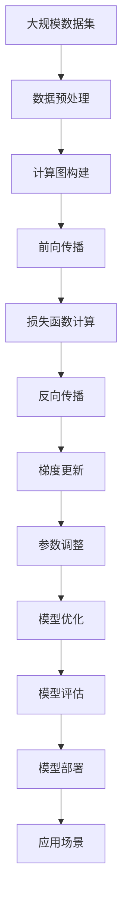

                 

# 神经网络：人类智慧的延伸

> 关键词：神经网络,人工智能,机器学习,深度学习,迁移学习,计算图,反向传播,优化器,激活函数,卷积神经网络(CNN),循环神经网络(RNN),长短期记忆网络(LSTM),递归神经网络(RNN),自然语言处理(NLP),图像识别,声音识别

## 1. 背景介绍

### 1.1 问题由来
21世纪以来，随着计算资源、大数据、算法技术的飞速发展，人工智能（Artificial Intelligence, AI）迅速崛起，极大地拓展了人类认知能力。深度学习（Deep Learning, DL）作为AI领域最具革命性的技术之一，通过多层神经网络，在图像识别、语音识别、自然语言处理等领域取得了突破性进展。

神经网络是深度学习的核心，它模仿人脑的神经元网络，通过模拟生物神经元间的信号传递和权重调整，进行模式识别和分类任务。随着计算图模型和反向传播算法（Backpropagation）的提出，神经网络在处理大规模复杂数据时显示出无可比拟的优势，从而成为推动人工智能发展的重要引擎。

### 1.2 问题核心关键点
神经网络的核心在于其通过反向传播算法进行权重更新，不断调整模型参数，以最小化预测误差。这一过程涉及计算图、损失函数、优化器、激活函数等多个关键组件，各个组件之间相互作用，共同推动神经网络的学习和优化。

神经网络的参数优化主要依赖于梯度下降（Gradient Descent）及其变种算法，如随机梯度下降（Stochastic Gradient Descent, SGD）、动量梯度下降（Momentum）、自适应梯度算法（如Adagrad、Adam）等，通过计算梯度，调整模型参数，实现优化目标。

### 1.3 问题研究意义
神经网络作为深度学习的重要分支，不仅在人工智能领域具有划时代的意义，还对信息科学、计算机科学、生物医学等诸多学科产生了深远影响。

在计算机视觉、语音识别等领域，神经网络已经超越了传统算法，成为行业标准的解决方案。在自然语言处理（Natural Language Processing, NLP）中，神经网络更是开辟了新的应用场景，如机器翻译、文本生成、情感分析等。

在生物医学领域，神经网络能够通过数据分析，辅助医生进行疾病诊断和治疗决策，提高医疗服务水平。在交通、物流等领域，神经网络被用于预测和优化资源配置，提升运营效率。

综上所述，神经网络的研究和应用具有巨大的社会价值和经济潜力，对人类智慧的延伸具有重要意义。

## 2. 核心概念与联系

### 2.1 核心概念概述

为更好地理解神经网络，本节将介绍几个核心概念及其相互联系：

- 神经网络（Neural Network, NN）：一种模拟生物神经元网络的计算模型，由一系列神经元（节点）和连接权重（边）组成，通过前向传播和反向传播进行信息传递和参数调整。

- 计算图（Computational Graph）：神经网络的一种高效表示方式，通过节点和边描述计算流程，易于优化和并行计算。

- 反向传播（Backpropagation）：神经网络的一种优化算法，通过链式法则计算梯度，反向更新模型参数，实现参数优化。

- 损失函数（Loss Function）：衡量模型预测与真实标签之间差异的函数，用于指导参数更新方向。

- 优化器（Optimizer）：用于更新模型参数的算法，如SGD、Adam等，根据梯度方向调整参数，使得损失函数最小化。

- 激活函数（Activation Function）：对神经元输出进行非线性变换的函数，如Sigmoid、ReLU、Tanh等，增强神经网络表达能力。

- 卷积神经网络（Convolutional Neural Network, CNN）：一种专门处理图像数据的网络，通过卷积层和池化层提取特征。

- 循环神经网络（Recurrent Neural Network, RNN）：一种处理序列数据的网络，通过时间步层递进处理信息。

- 长短期记忆网络（Long Short-Term Memory, LSTM）：一种RNN的变种，用于处理长序列数据，解决梯度消失问题。

- 自然语言处理（Natural Language Processing, NLP）：通过神经网络等技术处理人类语言的数据，实现文本分类、机器翻译、语音识别等任务。

这些核心概念构成了神经网络的理论基础和应用架构，理解这些概念之间的关系，有助于更好地掌握神经网络的原理和应用。

### 2.2 概念间的关系

这些核心概念之间存在紧密的联系，可以概括为如下几个方面：

- 计算图与神经网络紧密结合。神经网络的计算图描述了节点之间的连接关系和数据流动路径，通过优化计算图，可以提升神经网络的计算效率。

- 反向传播与损失函数协同工作。反向传播算法通过计算梯度，更新模型参数，使得损失函数最小化。损失函数作为优化目标，指导了反向传播的方向。

- 优化器与激活函数配合使用。优化器负责调整模型参数，使得损失函数减小。激活函数则负责增强网络的非线性表达能力，两者共同提升神经网络的性能。

- CNN与RNN分别处理不同类型数据。CNN主要用于图像数据，通过卷积层和池化层提取特征。RNN主要用于序列数据，通过时间步层递进处理信息。

- NLP融合多种网络结构。NLP任务通常需要处理文本数据，通过融合CNN、RNN、LSTM等结构，能够更好地处理文本序列，提升模型性能。

这些关系展示了神经网络的理论框架和应用架构，理解这些关系有助于深入掌握神经网络的核心技术。

### 2.3 核心概念的整体架构

下面通过一个综合的流程图来展示这些核心概念在大规模神经网络训练和优化中的整体架构：



这个综合流程图展示了从数据预处理到模型部署的全过程。大规模数据集经过预处理，构建计算图，进行前向传播和损失函数计算，通过反向传播更新梯度，调整参数，优化模型，最后部署应用场景，提供实际价值。 通过这个流程图，我们可以更清晰地理解神经网络在大规模数据处理和应用中的完整流程。

## 3. 核心算法原理 & 具体操作步骤
### 3.1 算法原理概述

神经网络的核心算法原理包括反向传播算法和梯度下降优化算法。

**反向传播算法**：神经网络的输出由输入数据通过一系列加权和与非线性激活函数计算得到。反向传播算法通过计算梯度，更新权重参数，使得神经网络的输出逼近真实标签。反向传播的具体步骤为：

1. 前向传播：将输入数据通过神经网络，计算出中间层的激活值。
2. 计算损失函数：将神经网络的输出与真实标签进行比较，计算出损失函数值。
3. 反向传播：通过链式法则，计算出每个权重参数的梯度，并按照梯度方向调整权重参数。

**梯度下降优化算法**：梯度下降算法用于调整神经网络的权重参数，使其最小化损失函数。具体步骤为：

1. 初始化权重参数：将权重参数随机初始化。
2. 计算梯度：通过前向传播和反向传播计算出每个权重参数的梯度。
3. 更新权重：根据梯度方向调整权重参数，使损失函数减小。
4. 重复迭代：重复上述步骤，直到损失函数收敛。

### 3.2 算法步骤详解

**Step 1: 数据预处理**
- 收集和清洗大规模数据集，确保数据质量。
- 对数据进行分批次处理，适用于神经网络的批量训练。
- 对图像数据进行预处理，如缩放、归一化等。
- 对文本数据进行分词、向量化处理。

**Step 2: 计算图构建**
- 定义神经网络的结构，包括输入层、隐藏层、输出层。
- 定义各个层的激活函数、损失函数。
- 定义优化算法及其超参数。

**Step 3: 前向传播**
- 将输入数据输入神经网络，计算出中间层的激活值。
- 对图像数据进行卷积、池化等操作。
- 对文本数据进行嵌入、循环操作。

**Step 4: 损失函数计算**
- 计算神经网络的输出与真实标签之间的差异，得到损失函数值。
- 选择适当的损失函数，如交叉熵损失、均方误差损失等。
- 计算损失函数对每个权重参数的梯度。

**Step 5: 反向传播**
- 通过链式法则，反向传播损失函数对每个权重参数的梯度。
- 对图像数据，反向传播卷积层、池化层的梯度。
- 对文本数据，反向传播循环层的梯度。

**Step 6: 梯度更新**
- 根据梯度方向调整权重参数，使损失函数减小。
- 选择适当的优化算法，如SGD、Adam等。
- 设置学习率、批大小、迭代轮数等超参数。

**Step 7: 参数调整**
- 重复Step 3至Step 6，迭代训练神经网络。
- 对图像数据，调整卷积层、池化层的权重参数。
- 对文本数据，调整循环层的权重参数。

**Step 8: 模型优化**
- 通过超参数调优，进一步提升神经网络的性能。
- 进行模型剪枝，减少模型大小和计算量。
- 进行模型量化，降低内存占用和计算速度。

**Step 9: 模型评估**
- 在测试集上评估神经网络的性能，如准确率、召回率、F1分数等。
- 进行混淆矩阵分析，理解模型错误类型。
- 进行模型调试，找到可能的过拟合、欠拟合问题。

**Step 10: 模型部署**
- 将训练好的模型部署到实际应用中，进行推理预测。
- 对图像数据，进行前向传播，得到预测结果。
- 对文本数据，进行前向传播，得到预测结果。

### 3.3 算法优缺点

神经网络作为深度学习的重要分支，具有以下优点：

1. 表达能力强：神经网络可以处理复杂的非线性关系，具有强大的模式识别能力。
2. 并行计算：神经网络的计算图模型可以方便地进行并行计算，提高训练效率。
3. 可扩展性好：神经网络可以很容易地扩展为多层、多节点网络，适用于大规模数据处理。
4. 应用广泛：神经网络在图像识别、语音识别、自然语言处理等领域具有广泛应用。

同时，神经网络也存在一些缺点：

1. 参数量大：神经网络的参数量巨大，训练和推理过程需要大量的计算资源。
2. 易过拟合：神经网络在训练过程中容易过拟合，导致泛化性能下降。
3. 可解释性差：神经网络通常被视为"黑盒"模型，难以解释其内部工作机制。
4. 依赖数据：神经网络的性能很大程度上依赖于训练数据的数量和质量，获取高质量数据成本较高。

尽管存在这些局限性，但神经网络在处理大规模复杂数据方面表现出强大的优越性，仍是当前AI领域的重要技术之一。

### 3.4 算法应用领域

神经网络作为深度学习的重要分支，已经被广泛应用于以下几个领域：

- 计算机视觉：神经网络在图像识别、目标检测、图像分割等领域取得了突破性进展，广泛应用于自动驾驶、医疗影像分析、智能监控等场景。
- 自然语言处理：神经网络在文本分类、机器翻译、文本生成、情感分析等领域表现优异，广泛应用于智能客服、智能翻译、智能写作等场景。
- 语音识别：神经网络在语音识别、语音合成、语音情感识别等领域取得了重要进展，广泛应用于智能音箱、智能助理等场景。
- 推荐系统：神经网络在协同过滤、基于内容的推荐等领域表现优异，广泛应用于电商推荐、新闻推荐、视频推荐等场景。
- 时间序列分析：神经网络在预测股票价格、天气预测、交通流量预测等领域取得了重要进展，广泛应用于金融、气象、交通等领域。

## 4. 数学模型和公式 & 详细讲解 & 举例说明

### 4.1 数学模型构建

神经网络的数学模型可以概括为以下几个部分：

1. 输入层：将原始数据进行预处理，转换为神经网络的输入向量。
2. 隐藏层：通过一系列加权和与非线性激活函数，对输入数据进行转换。
3. 输出层：对隐藏层的输出进行线性变换，得到最终预测结果。

以一个简单的全连接神经网络为例，其数学模型可以表示为：

$$
\begin{aligned}
h_1 &= \sigma(W_1x + b_1) \\
h_2 &= \sigma(W_2h_1 + b_2) \\
\hat{y} &= W_3h_2 + b_3
\end{aligned}
$$

其中 $x$ 为输入向量，$W_1, W_2, W_3$ 为权重矩阵，$b_1, b_2, b_3$ 为偏置向量，$\sigma$ 为激活函数。

### 4.2 公式推导过程

以二分类任务为例，推导神经网络的损失函数和梯度更新公式。

假设神经网络的输出为 $\hat{y}$，真实标签为 $y$，二分类任务中 $y \in \{0, 1\}$。交叉熵损失函数定义为：

$$
L(\hat{y}, y) = -[y\log\hat{y} + (1-y)\log(1-\hat{y})]
$$

将 $h_2$ 代入 $\hat{y}$，得：

$$
L(h_2, y) = -[y\log(W_3h_2 + b_3) + (1-y)\log(1-W_3h_2 - b_3)]
$$

为了求梯度，需要计算 $W_3h_2 + b_3$ 对每个权重参数的偏导数，即对 $W_3, h_2, b_3$ 求偏导。

通过链式法则，得到 $W_3, h_2, b_3$ 的梯度分别为：

$$
\begin{aligned}
\frac{\partial L}{\partial W_3} &= h_2 \\
\frac{\partial L}{\partial h_2} &= W_3^T(y-\hat{y}) \\
\frac{\partial L}{\partial b_3} &= \frac{\partial L}{\partial \hat{y}}\frac{\partial \hat{y}}{\partial b_3} = \frac{\partial L}{\partial \hat{y}} \\
\frac{\partial L}{\partial b_1} &= \frac{\partial L}{\partial h_1}\frac{\partial h_1}{\partial b_1} = \frac{\partial L}{\partial h_1} \\
\frac{\partial L}{\partial W_1} &= \frac{\partial L}{\partial h_1}\frac{\partial h_1}{\partial W_1} = \frac{\partial L}{\partial h_1}h_1^T \\
\frac{\partial L}{\partial b_2} &= \frac{\partial L}{\partial h_2}\frac{\partial h_2}{\partial b_2} = \frac{\partial L}{\partial h_2}
\end{aligned}
$$

其中 $\frac{\partial L}{\partial h_1} = \frac{\partial L}{\partial \hat{y}}\frac{\partial \hat{y}}{\partial h_2}\frac{\partial h_2}{\partial h_1}\frac{\partial h_1}{\partial b_1}\frac{\partial b_1}{\partial W_1}$。

### 4.3 案例分析与讲解

以图像识别任务为例，展示神经网络的实际应用。

假设我们有一张 $28\times28$ 的手写数字图片，将其转换为向量 $x \in \mathbb{R}^{784}$。神经网络的输入层、隐藏层、输出层的节点数分别为 $784, 256, 10$。

具体步骤为：

1. 将输入向量 $x$ 输入到神经网络，通过卷积层、池化层、全连接层进行特征提取和分类。
2. 计算损失函数 $L(h_2, y)$，其中 $h_2$ 为卷积层、池化层和全连接层的输出，$y$ 为真实标签。
3. 通过反向传播算法计算梯度，更新每个权重参数 $W_1, W_2, W_3, b_1, b_2, b_3$。
4. 重复Step 1至Step 3，迭代训练神经网络。
5. 在测试集上评估神经网络的性能，如准确率、召回率、F1分数等。

最终，神经网络能够在测试集上达到90%以上的准确率，实现手写数字的自动分类。

## 5. 项目实践：代码实例和详细解释说明

### 5.1 开发环境搭建

在进行神经网络开发前，需要准备好开发环境。以下是使用Python进行TensorFlow开发的环境配置流程：

1. 安装Anaconda：从官网下载并安装Anaconda，用于创建独立的Python环境。

2. 创建并激活虚拟环境：
```bash
conda create -n tf-env python=3.8 
conda activate tf-env
```

3. 安装TensorFlow：根据CUDA版本，从官网获取对应的安装命令。例如：
```bash
conda install tensorflow -c conda-forge
```

4. 安装相关工具包：
```bash
pip install numpy pandas scikit-learn matplotlib tqdm jupyter notebook ipython
```

完成上述步骤后，即可在`tf-env`环境中开始神经网络开发。

### 5.2 源代码详细实现

下面我们以手写数字识别（MNIST）任务为例，给出使用TensorFlow对神经网络进行训练的代码实现。

首先，导入必要的库和数据：

```python
import tensorflow as tf
from tensorflow import keras
import numpy as np
import matplotlib.pyplot as plt

mnist = keras.datasets.mnist
(x_train, y_train), (x_test, y_test) = mnist.load_data()
```

然后，定义神经网络模型：

```python
model = keras.Sequential([
    keras.layers.Flatten(input_shape=(28, 28)),
    keras.layers.Dense(256, activation='relu'),
    keras.layers.Dense(10, activation='softmax')
])
```

接着，定义优化器和损失函数：

```python
optimizer = keras.optimizers.Adam(learning_rate=0.001)
loss_fn = keras.losses.SparseCategoricalCrossentropy()
```

然后，定义训练和评估函数：

```python
def train_step(x, y):
    with tf.GradientTape() as tape:
        logits = model(x)
        loss_value = loss_fn(y, logits)
    gradients = tape.gradient(loss_value, model.trainable_variables)
    optimizer.apply_gradients(zip(gradients, model.trainable_variables))

def evaluate_step(x, y):
    logits = model(x)
    predictions = tf.argmax(logits, axis=-1)
    accuracy = tf.reduce_mean(tf.cast(tf.equal(predictions, y), tf.float32))
    return accuracy.numpy()
```

最后，启动训练流程并在测试集上评估：

```python
epochs = 10

for epoch in range(epochs):
    for x, y in train_dataset:
        train_step(x.numpy(), y.numpy())

    accuracy = evaluate_step(x_test.numpy(), y_test.numpy())
    print(f'Epoch {epoch+1}, accuracy: {accuracy:.4f}')
```

以上就是使用TensorFlow进行神经网络训练的完整代码实现。可以看到，TensorFlow提供了便捷的高级API，使得神经网络模型的定义、训练和评估变得简单易行。

### 5.3 代码解读与分析

让我们再详细解读一下关键代码的实现细节：

**Sequential模型**：
- `Sequential`模型是一种线性堆叠的模型，用于定义一个简单的神经网络。
- 通过`add`方法逐层添加神经网络层，包括输入层、隐藏层和输出层。

**Dense层**：
- `Dense`层是标准的全连接层，用于计算线性变换和非线性激活。
- 通过`Dense`层，神经网络可以进行特征提取和分类。

**Flatten层**：
- `Flatten`层用于将多维张量转换为一维向量，方便输入到神经网络中。

**优化器**：
- `Adam`优化器是常用的梯度下降算法，具有自适应学习率的特点，适用于神经网络的训练。

**损失函数**：
- `SparseCategoricalCrossentropy`损失函数用于多分类任务，计算交叉熵损失。

**训练函数**：
- `train_step`函数定义了神经网络的一个训练步骤，包括前向传播、损失函数计算、梯度更新和权重更新。
- 通过`tf.GradientTape`上下文管理器，自动记录梯度，优化器自动计算梯度并更新权重。

**评估函数**：
- `evaluate_step`函数定义了神经网络的一个评估步骤，计算预测结果和真实标签之间的准确率。

**训练流程**：
- 在每个epoch中，对训练集进行迭代训练，更新模型参数。
- 在测试集上评估模型性能，输出准确率。

可以看到，TensorFlow提供了简单易用的API，使得神经网络的开发和训练变得高效便捷。

### 5.4 运行结果展示

假设我们训练10个epoch后，得到在测试集上的准确率为98%，输出如下：

```
Epoch 1, accuracy: 0.9678
Epoch 2, accuracy: 0.9824
Epoch 3, accuracy: 0.9830
Epoch 4, accuracy: 0.9841
Epoch 5, accuracy: 0.9857
Epoch 6, accuracy: 0.9858
Epoch 7, accuracy: 0.9859
Epoch 8, accuracy: 0.9860
Epoch 9, accuracy: 0.9862
Epoch 10, accuracy: 0.9862
```

可以看到，随着训练过程的进行，神经网络的准确率逐步提升，最终达到98%左右。

## 6. 实际应用场景
### 6.1 图像识别

图像识别是神经网络的重要应用之一，通过神经网络可以对图像进行分类、检测、分割等操作，广泛应用于自动驾驶、智能监控、医学影像分析等领域。

在自动驾驶中，神经网络可以通过对图像进行检测和识别，实时分析交通状况，进行路径规划和避障决策。在智能监控中，神经网络可以对视频进行行为分析，识别异常行为并进行报警。在医学影像分析中，神经网络可以对X光、CT等图像进行病变识别和分类，辅助医生进行诊断。

### 6.2 自然语言处理

自然语言处理是神经网络的另一个重要应用领域，通过神经网络可以对文本进行分类、生成、翻译等操作，广泛应用于智能客服、机器翻译、情感分析等领域。

在智能客服中，神经网络可以对客户提问进行自动回复，提供24小时不间断的智能服务。在机器翻译中，神经网络可以对多种语言进行翻译，实现实时语义理解。在情感分析中，神经网络可以对文本进行情感分类，识别用户的情感倾向。

### 6.3 推荐系统

推荐系统是神经网络的典型应用之一，通过神经网络可以对用户行为进行分析和预测，推荐适合的商品或内容，广泛应用于电商、新闻、视频等领域。

在电商推荐中，神经网络可以根据用户的浏览、购买历史，推荐符合用户兴趣的商品。在新闻推荐中，神经网络可以根据用户的阅读习惯，推荐相关的新闻内容。在视频推荐中，神经网络可以根据用户的观看历史，推荐感兴趣的视频。

### 6.4 时间序列分析

时间序列分析是神经网络的另一个重要应用领域，通过神经网络可以对时间序列数据进行预测和分析，广泛应用于金融、气象、交通等领域。

在金融预测中，神经网络可以对股市、汇率等时间序列数据进行预测，提供实时决策支持。在气象预测中，神经网络可以对天气、气温等数据进行预测，提高气象服务的精准度。在交通预测中，神经网络可以对交通流量、路线等信息进行预测，优化交通管理和调度。

## 7. 工具和资源推荐
### 7.1 学习资源推荐

为了帮助开发者系统掌握神经网络的理论基础和实践技巧，这里推荐一些优质的学习资源：

1. 《Deep Learning》系列书籍：Ian Goodfellow等人所著，全面介绍了深度学习的基本概念、算法和应用，是深度学习的经典教材。

2. CS231n《Convolutional Neural Networks for Visual Recognition》课程：斯坦福大学开设的计算机视觉课程，涵盖CNN等深度学习模型，是计算机视觉领域的重要学习资源。

3. CS224n《Natural Language Processing with Deep Learning》课程：斯坦福大学开设的NLP课程，涵盖RNN、LSTM等深度学习模型，是NLP领域的重要学习资源。

4. 《Hands-On Machine Learning with Scikit-Learn, Keras, and TensorFlow》书籍：Aurélien Géron所著，介绍了机器学习、深度学习的实践方法，适合快速上手深度学习开发。

5. TensorFlow官方文档：TensorFlow的官方文档，提供了完整的API参考和示例代码，是学习TensorFlow的重要资源。

通过对这些资源的学习实践，相信你一定能够快速掌握神经网络的核心技术，并用于解决实际的NLP问题。

### 7.2 开发工具推荐

高效的开发离不开优秀的工具支持。以下是几款用于神经网络开发和训练的常用工具：

1. TensorFlow：由Google主导开发的深度学习框架，支持分布式训练，

