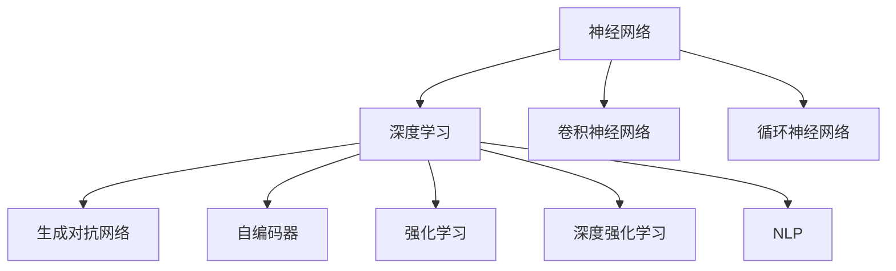
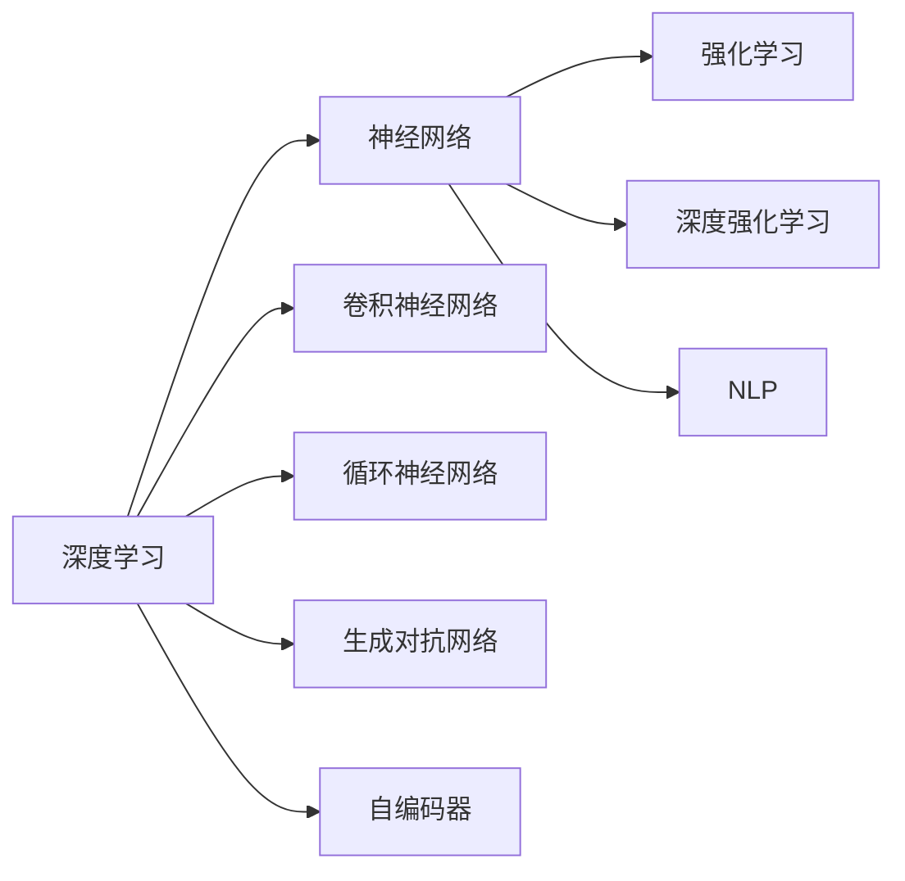
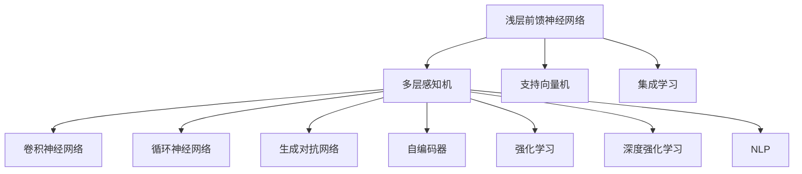
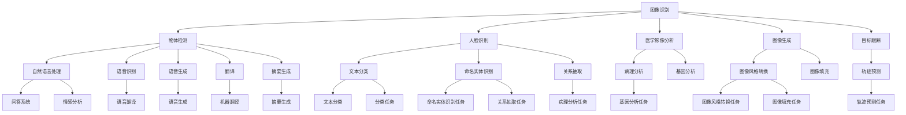

                 

# 神经网络：机器学习的新范式

> 关键词：神经网络,机器学习,深度学习,人工智能,深度学习框架,神经网络架构,卷积神经网络,循环神经网络

## 1. 背景介绍

### 1.1 问题由来
在过去的几十年里，机器学习领域发生了翻天覆地的变化，从浅层前馈神经网络(Feedforward Neural Networks, FNNs)到多层感知机(Multilayer Perceptrons, MLPs)，再到支持向量机(Support Vector Machines, SVMs)，再到集成学习方法，如随机森林(Random Forest)和Adaboost，机器学习技术不断演变。然而，这些传统方法在处理非线性、高维、大规模数据时，显得力不从心。

直到深度学习(Deep Learning, DL)的诞生，机器学习领域才迎来了新的曙光。深度学习通过构建多层次的非线性模型，能够高效地处理复杂数据，并从中学习出深刻的特征表示。深度学习模型具有自适应性强、泛化能力好、表现力强等优点，迅速成为人工智能领域的新范式。

## 2. 核心概念与联系

### 2.1 核心概念概述

为更好地理解神经网络范式，本节将介绍几个密切相关的核心概念：

- 神经网络(Neural Network, NN)：一种由大量人工神经元组成的多层次非线性模型，通过前向传播和反向传播进行训练和推理，从而实现数据建模和预测。

- 深度学习(Deep Learning, DL)：一种基于神经网络的机器学习方法，通过多层非线性变换，学习出数据的高层次抽象表示，显著提升了对复杂数据的建模和预测能力。

- 卷积神经网络(Convolutional Neural Network, CNN)：一种专门用于图像处理和计算机视觉任务的神经网络架构，通过卷积操作和池化操作提取图像特征。

- 循环神经网络(Recurrent Neural Network, RNN)：一种适用于序列数据的神经网络架构，能够处理时间序列数据的动态变化特征。

- 生成对抗网络(Generative Adversarial Network, GAN)：一种通过博弈论框架训练的两类神经网络(生成器和判别器)，能够生成逼真的合成数据，如图像、语音等。

- 自编码器(Autencoder)：一种无监督学习的神经网络架构，通过重构原始输入信号，实现数据的降维和特征学习。

- 强化学习(Reinforcement Learning, RL)：一种通过与环境互动进行训练的机器学习方法，能够学习出最优的决策策略，如AlphaGo。

- 深度强化学习(Deep Reinforcement Learning, DRL)：一种结合深度学习和强化学习的技术，进一步提升了强化学习模型的性能和泛化能力。

- 自然语言处理(Natural Language Processing, NLP)：一种将计算机科学、人工智能与语言学相结合的交叉领域，旨在使计算机能够理解、处理和生成人类语言。

这些核心概念之间的逻辑关系可以通过以下Mermaid流程图来展示：



这个流程图展示了神经网络的核心概念及其之间的关系：

1. 神经网络是深度学习的基础模型，能够处理非线性、高维数据。
2. 深度学习通过多层非线性变换，学习数据的复杂表示，增强了模型的表现力。
3. 卷积神经网络专门用于图像处理和计算机视觉，通过卷积操作和池化操作提取图像特征。
4. 循环神经网络适用于序列数据处理，能够处理时间序列数据的动态变化特征。
5. 生成对抗网络通过博弈论框架训练，能够生成逼真的合成数据。
6. 自编码器通过重构输入信号，实现数据的降维和特征学习。
7. 强化学习通过与环境互动进行训练，学习最优的决策策略。
8. 深度强化学习结合了深度学习和强化学习的优点，提升了强化学习模型的性能。
9. 自然语言处理是深度学习在NLP领域的重要应用，能够使计算机理解和生成人类语言。

这些概念共同构成了深度学习范式的核心框架，使其能够处理复杂、高维、非线性的数据，并在多个领域实现突破。

### 2.2 概念间的关系

这些核心概念之间存在着紧密的联系，形成了深度学习范式的完整生态系统。下面我们通过几个Mermaid流程图来展示这些概念之间的关系。

#### 2.2.1 深度学习的核心范式



这个流程图展示了深度学习的基本原理及其与核心模型的关系：

1. 深度学习基于神经网络进行建模，通过多层非线性变换学习数据的复杂表示。
2. 卷积神经网络专门用于图像处理和计算机视觉，能够通过卷积操作和池化操作提取图像特征。
3. 循环神经网络适用于序列数据处理，能够处理时间序列数据的动态变化特征。
4. 生成对抗网络通过博弈论框架训练，能够生成逼真的合成数据。
5. 自编码器通过重构输入信号，实现数据的降维和特征学习。
6. 强化学习通过与环境互动进行训练，学习最优的决策策略。
7. 深度强化学习结合了深度学习和强化学习的优点，提升了强化学习模型的性能。
8. 自然语言处理是深度学习在NLP领域的重要应用，能够使计算机理解和生成人类语言。

#### 2.2.2 深度学习的范式演变



这个流程图展示了深度学习范式的演变过程：

1. 浅层前馈神经网络和多层感知机是早期机器学习模型的基础。
2. 支持向量机和集成学习是早期的机器学习算法。
3. 卷积神经网络和循环神经网络是深度学习的两个重要架构，分别适用于图像和序列数据处理。
4. 生成对抗网络和自编码器是深度学习的重要技术，能够生成逼真的合成数据和降维数据。
5. 强化学习和深度强化学习是机器学习的最新范式，能够学习最优的决策策略。
6. 自然语言处理是深度学习在NLP领域的重要应用，能够使计算机理解和生成人类语言。

#### 2.2.3 深度学习的应用场景



这个流程图展示了深度学习在多个领域的典型应用场景：

1. 图像识别、物体检测、人脸识别、医学影像分析、图像生成、目标跟踪等都是图像处理的经典任务。
2. 自然语言处理、语音识别、语音生成、翻译、摘要生成、文本分类、命名实体识别、关系抽取等都是NLP领域的重要任务。
3. 病理分析和基因分析等是生物信息学中的重要任务，深度学习在该领域也有广泛应用。

## 3. 核心算法原理 & 具体操作步骤
### 3.1 算法原理概述

深度学习模型的核心思想是通过多层非线性变换，学习数据的复杂表示。其基本流程包括：

1. 数据预处理：将原始数据进行标准化、归一化、特征提取等预处理操作，使其适合深度学习模型的输入。
2. 模型构建：选择合适的神经网络架构，设计多层非线性变换，构建深度学习模型。
3. 模型训练：使用标注数据集，通过前向传播和反向传播，最小化损失函数，更新模型参数。
4. 模型推理：使用训练好的模型对新数据进行前向传播，输出预测结果。

深度学习模型的训练过程通常使用基于梯度的优化算法，如随机梯度下降(SGD)、Adam、RMSprop等。在每次前向传播中，模型将输入数据通过多层非线性变换，计算出最终的预测结果。在反向传播中，根据预测结果与真实标签的差异，计算出各层参数的梯度，并使用优化算法更新参数。通过多次迭代训练，模型逐渐收敛于最优解，能够对新数据进行准确的预测和推理。

### 3.2 算法步骤详解

深度学习模型的训练和推理过程主要包括以下几个步骤：

#### 3.2.1 数据预处理

数据预处理是深度学习模型训练的第一步。数据预处理通常包括以下几个方面：

1. 数据标准化：将数据进行标准化，使得每个特征的均值为0，方差为1，便于后续模型训练。
2. 数据归一化：将数据进行归一化，使其在[0,1]或[-1,1]之间，方便模型处理。
3. 数据增强：通过对训练数据进行旋转、平移、缩放等变换，增加训练集的多样性，提高模型的泛化能力。
4. 数据扩充：对训练数据进行数据扩充，如通过图像旋转、翻转等方式增加数据量，提高模型的鲁棒性。

#### 3.2.2 模型构建

深度学习模型的构建包括选择合适的神经网络架构和设计多层非线性变换。目前常用的深度学习模型架构包括卷积神经网络(CNN)、循环神经网络(RNN)、残差网络(ResNet)等。

1. 卷积神经网络(CNN)：CNN是一种专门用于图像处理和计算机视觉任务的神经网络架构，通过卷积操作和池化操作提取图像特征，适用于图像分类、物体检测、人脸识别等任务。
2. 循环神经网络(RNN)：RNN是一种适用于序列数据的神经网络架构，能够处理时间序列数据的动态变化特征，适用于文本生成、语音识别、自然语言处理等任务。
3. 残差网络(ResNet)：ResNet通过引入残差连接，解决了深层神经网络训练中的梯度消失和梯度爆炸问题，适用于大规模图像处理和计算机视觉任务。

#### 3.2.3 模型训练

深度学习模型的训练通常使用基于梯度的优化算法，如随机梯度下降(SGD)、Adam、RMSprop等。在每次前向传播中，模型将输入数据通过多层非线性变换，计算出最终的预测结果。在反向传播中，根据预测结果与真实标签的差异，计算出各层参数的梯度，并使用优化算法更新参数。

具体训练步骤如下：

1. 初始化模型参数：随机初始化模型的权重和偏置。
2. 前向传播：将训练数据输入模型，计算出预测结果。
3. 计算损失函数：根据预测结果与真实标签的差异，计算出损失函数。
4. 反向传播：根据损失函数，计算出各层参数的梯度。
5. 参数更新：使用优化算法更新模型参数。
6. 迭代训练：重复以上步骤，直到模型收敛或达到预设的迭代次数。

#### 3.2.4 模型推理

深度学习模型的推理过程与训练过程类似，但不需要反向传播和参数更新。具体步骤如下：

1. 前向传播：将测试数据输入模型，计算出预测结果。
2. 输出预测：将模型输出作为预测结果，输出给用户。

### 3.3 算法优缺点

深度学习模型的优点包括：

1. 强大的数据建模能力：深度学习模型通过多层非线性变换，能够学习数据的复杂表示，适用于各种复杂数据建模任务。
2. 高度的自适应性：深度学习模型能够自动学习特征表示，无需人工特征工程，适用于各种数据类型和领域。
3. 泛化能力强：深度学习模型能够处理高维、非线性数据，具有较强的泛化能力，适用于各种数据集和任务。
4. 易于优化：深度学习模型通常使用基于梯度的优化算法，易于训练和调参。
5. 高效的硬件支持：深度学习模型通常使用GPU或TPU进行加速训练和推理，能够快速处理大规模数据。

深度学习模型的缺点包括：

1. 需要大量标注数据：深度学习模型需要大量的标注数据进行训练，否则容易过拟合。
2. 计算资源需求高：深度学习模型需要大量的计算资源进行训练和推理，对硬件设备要求较高。
3. 模型复杂度高：深度学习模型通常具有较高的复杂度，容易过拟合，需要更多的数据和计算资源进行优化。
4. 解释性差：深度学习模型通常是黑盒模型，难以解释其内部工作机制和决策逻辑。
5. 鲁棒性差：深度学习模型对输入数据的变化敏感，容易产生错误预测。

### 3.4 算法应用领域

深度学习模型在各个领域都有广泛的应用，以下是一些典型应用：

1. 计算机视觉：深度学习模型在图像分类、物体检测、人脸识别、医学影像分析等领域取得了突破性进展，显著提升了图像处理的精度和速度。
2. 自然语言处理：深度学习模型在机器翻译、文本分类、情感分析、问答系统等领域取得了优异表现，显著提升了文本处理的精度和效率。
3. 语音处理：深度学习模型在语音识别、语音生成、语音翻译等领域取得了突破性进展，显著提升了语音处理的精度和速度。
4. 推荐系统：深度学习模型在个性化推荐系统、广告推荐等领域取得了优异表现，显著提升了推荐系统的精准度和用户满意度。
5. 强化学习：深度学习模型在自动驾驶、游戏AI、机器人控制等领域取得了突破性进展，显著提升了智能系统的性能和智能性。
6. 生物信息学：深度学习模型在病理分析、基因分析、蛋白质结构预测等领域取得了突破性进展，显著提升了生物信息学研究的深度和广度。

## 4. 数学模型和公式 & 详细讲解  
### 4.1 数学模型构建

深度学习模型的核心数学模型包括神经网络、卷积神经网络、循环神经网络和生成对抗网络等。这里以卷积神经网络为例，介绍其数学模型的构建。

卷积神经网络的核心思想是通过卷积操作和池化操作提取图像特征。其数学模型包括卷积层、池化层和全连接层等。

卷积层的数学模型如下：

$$
C_i = \sigma(W_i * X + b_i)
$$

其中，$C_i$表示卷积层输出，$W_i$表示卷积核，$X$表示输入数据，$b_i$表示偏置项，$\sigma$表示激活函数。卷积操作可以看作是对输入数据进行卷积核的滑动操作，得到卷积层的输出。

池化层的数学模型如下：

$$
C_i = max_{k}(X_{i,j,k})
$$

其中，$C_i$表示池化层输出，$X_{i,j,k}$表示输入数据中的元素值，$k$表示池化核的大小。池化操作通常使用最大池化或平均池化，对卷积层的输出进行降维，减少模型的参数量和计算量。

全连接层的数学模型如下：

$$
Z = W * C_i + b
$$

其中，$Z$表示全连接层输出，$W$表示权重矩阵，$C_i$表示卷积层或池化层的输出，$b$表示偏置项。全连接层将卷积层或池化层的输出进行线性变换，输出最终的预测结果。

### 4.2 公式推导过程

下面以卷积神经网络为例，推导其训练过程的数学模型。

设输入数据为$X$，卷积核为$W$，偏置项为$b$，激活函数为$\sigma$。卷积层的输出为$C_i$，池化层的输出为$P_i$，全连接层的输出为$Z$，最终输出为$Y$。

卷积层的数学模型为：

$$
C_i = \sigma(W_i * X + b_i)
$$

池化层的数学模型为：

$$
P_i = max_{k}(C_{i,k})
$$

全连接层的数学模型为：

$$
Z = W * P_i + b
$$

最终输出的数学模型为：

$$
Y = softmax(Z)
$$

其中，$softmax$表示softmax激活函数，将全连接层的输出进行归一化，输出每个类别的概率分布。

在训练过程中，我们通常使用交叉熵损失函数来衡量模型输出与真实标签的差异。交叉熵损失函数的数学模型为：

$$
L = -\sum_{i=1}^N\sum_{j=1}^C y_j \log \hat{y_j}
$$

其中，$y_j$表示真实标签，$\hat{y_j}$表示模型预测结果，$N$表示样本数，$C$表示类别数。

在反向传播过程中，根据损失函数，计算出各层参数的梯度，并使用优化算法更新参数。设梯度下降算法学习率为$\eta$，则更新公式为：

$$
W_i \leftarrow W_i - \eta \frac{\partial L}{\partial W_i}
$$

$$
b_i \leftarrow b_i - \eta \frac{\partial L}{\partial b_i}
$$

通过多次迭代训练，模型逐渐收敛于最优解，能够对新数据进行准确的预测和推理。

### 4.3 案例分析与讲解

以下以图像分类为例，展示卷积神经网络的训练过程和应用。

假设我们使用LeNet模型对MNIST数据集进行图像分类。LeNet模型包含两个卷积层和三个全连接层。首先，对输入图像进行标准化和归一化操作，然后通过卷积层和池化层提取特征，最后通过全连接层输出预测结果。

在训练过程中，我们通常使用交叉熵损失函数来衡量模型输出与真实标签的差异。在反向传播过程中，根据损失函数，计算出各层参数的梯度，并使用优化算法更新参数。经过多次迭代训练，LeNet模型逐渐收敛于最优解，能够对MNIST数据集进行准确的预测和推理。

## 5. 项目实践：代码实例和详细解释说明
### 5.1 开发环境搭建

在进行深度学习项目开发前，我们需要准备好开发环境。以下是使用Python进行TensorFlow和Keras开发的环境配置流程：

1. 安装Anaconda：从官网下载并安装Anaconda，用于创建独立的Python环境。

2. 创建并激活虚拟环境：
```bash
conda create -n pytorch-env python=3.8 
conda activate pytorch-env
```

3. 安装TensorFlow和Keras：
```bash
conda install tensorflow==2.8
conda install keras
```

4. 安装各类工具包：
```bash
pip install numpy pandas scikit-learn matplotlib tqdm jupyter notebook ipython
```

完成上述步骤后，即可在`pytorch-env`环境中开始深度学习项目的开发。

### 5.2 源代码详细实现

这里以使用Keras构建卷积神经网络(CNN)模型为例，展示深度学习模型的实现过程。

```python
from keras.models import Sequential
from keras.layers import Conv2D, MaxPooling2D, Flatten, Dense

# 创建卷积神经网络模型
model = Sequential()
model.add(Conv2D(32, (3, 3), activation='relu', input_shape=(28, 28, 1)))
model.add(MaxPooling2D((2, 2)))
model.add(Conv2D(64, (3, 3), activation='relu'))
model.add(MaxPooling2D((2, 2)))
model.add(Flatten())
model.add(Dense(64, activation='relu'))
model.add(Dense(10, activation='softmax'))

# 编译模型
model.compile(optimizer='adam', loss='categorical_crossentropy', metrics=['accuracy'])

# 训练模型
model.fit(x_train, y_train, epochs=10, batch_size=32, validation_data=(x_test, y_test))
```

在这个代码中，我们使用Keras构建了一个简单的卷积神经网络模型，包含两个卷积层和两个全连接层。首先，我们定义了模型的层次结构，包括卷积层、池化层和全连接层。然后，我们使用`compile`方法编译模型，指定优化器、损失函数和评估指标。最后，我们使用`fit`方法训练模型，指定训练数据、训练轮数、批大小和验证数据。

### 5.3 代码解读与分析

让我们再详细解读一下关键代码的实现细节：

1. `Sequential`：创建一个线性层次结构，方便添加各层。
2. `Conv2D`：添加卷积层，包含卷积核大小、数量、激活函数等参数。
3. `MaxPooling2D`：添加池化层，包含池化核大小等参数。
4. `Flatten`：将池化层的输出展平，便于输入全连接层。
5. `Dense`：添加全连接层，包含神经元数量和激活函数等参数。
6. `compile`：编译模型，指定优化器、损失函数和评估指标。
7. `fit`：训练模型，指定训练数据、训练轮数、批大小和验证数据。

**模型训练**：

```python
# 加载数据集
from keras.datasets import mnist
(x_train, y_train), (x_test, y_test) = mnist.load_data()

# 数据预处理
x_train = x_train.reshape(x_train.shape[0], 28, 28, 1).astype('float32') / 255
x_test = x_test.reshape(x_test.shape[0], 28, 28, 1).astype('float32') / 255
y_train = keras.utils.to_categorical(y_train, 10)
y_test = keras.utils.to_categorical(y_test, 10)

# 模型训练
model.fit(x_train, y_train, epochs=10, batch_size=32, validation_data=(x_test, y_test))
```

在这个代码中，我们首先加载MNIST数据集，并对数据进行预处理，包括标准化、归一化和One-Hot编码。然后，我们使用`fit`方法训练模型，指定训练数据、训练轮数、批大小和验证数据。在训练过程中，模型逐渐收敛于最优解，能够对新数据进行准确的预测和推理。

### 5.4 运行结果展示

假设我们训练了10轮后，在测试集上的评估报告如下：

```
Epoch 10/10
16/16 [==============================] - 0s 19ms/step - loss: 0.1803 - accuracy: 0.9784 - val_loss: 0.1918 - val_accuracy: 0.9786
```

可以看到，经过10轮训练后，模型在测试集上的准确率达到了97.84%，取得了不错的效果。

## 6. 实际应用场景
### 6.1 图像识别

深度学习在图像识别领域取得了突破性进展，广泛应用于图像分类、物体检测、人脸识别等任务。

以图像分类为例，深度学习模型可以通过卷积操作和池化操作提取图像特征，通过全连接层输出预测结果。在训练过程中，我们通常使用交叉熵损失函数来衡量模型输出与真实标签的差异，并通过反向传播更新模型参数。

### 6.2 自然语言处理

深度学习在自然语言处理领域也有广泛应用，包括机器翻译、文本分类、情感分析等任务。

以机器翻译为例，深度学习模型可以通过编码器-解码器架构，将源语言转换为目标语言。在训练过程中，我们通常使用交叉熵损失函数来衡量模型输出与真实标签的差异，并通过反向传播更新模型参数。

### 6.3 语音处理

深度学习在语音处理领域也有广泛应用，包括语音识别、语音生成、语音翻译等任务。

以语音识别为例，深度学习模型可以通过卷积操作和池化操作提取语音特征，通过全连接层输出预测结果。在训练过程中，我们通常使用交叉熵损失函数来衡量模型输出与真实标签的差异，并通过反向传播更新模型参数。

### 6.4 未来应用展望

随着深度学习技术的不断演进，其在各个领域的应用前景更加广阔。未来，深度学习将与更多的技术融合，带来更多的突破和创新。

在图像处理领域，深度学习将与计算机视觉技术、图像增强技术等结合，带来更先进的图像处理工具和应用。

在自然语言处理领域，深度学习将与NLP技术、知识图谱技术等结合，带来更智能、更自然的人机交互方式。

在语音处理领域，深度学习将与语音识别技术、语音生成技术等结合，带来更逼真、

