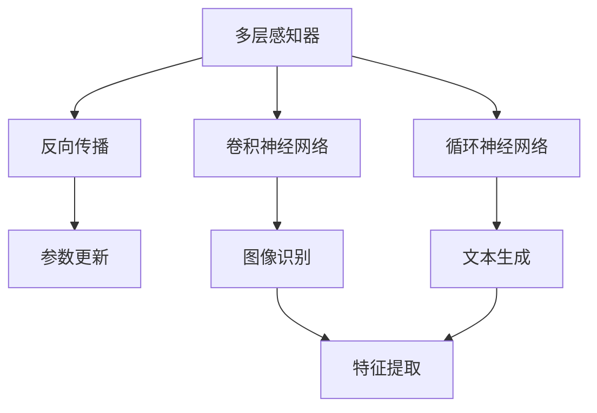
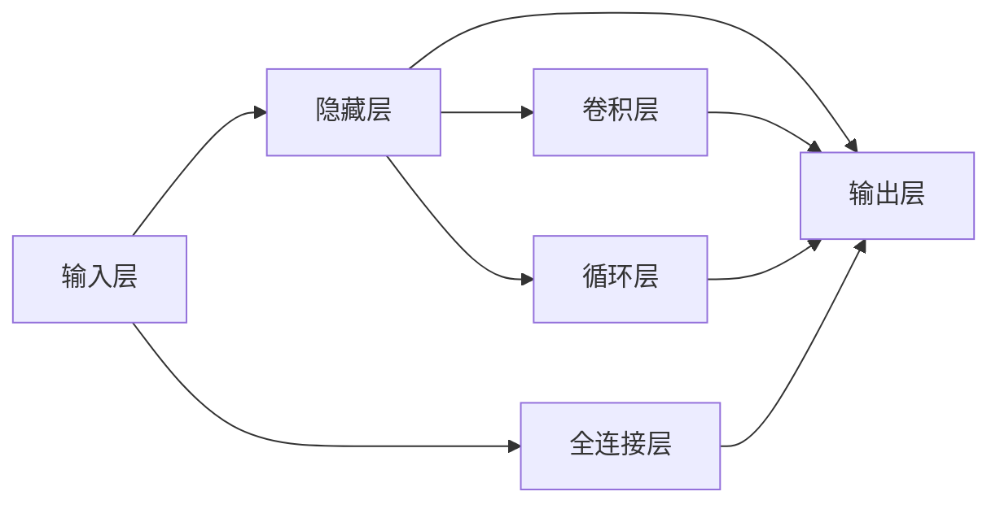
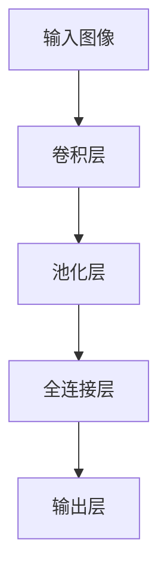
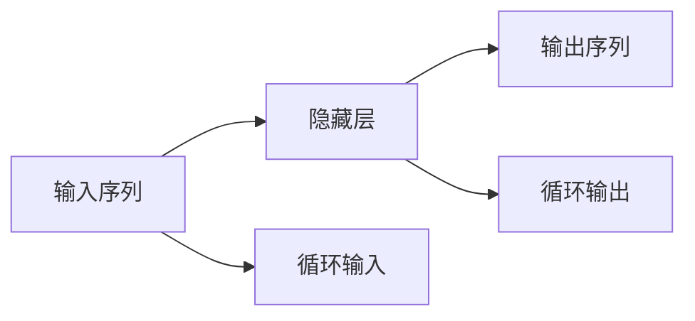
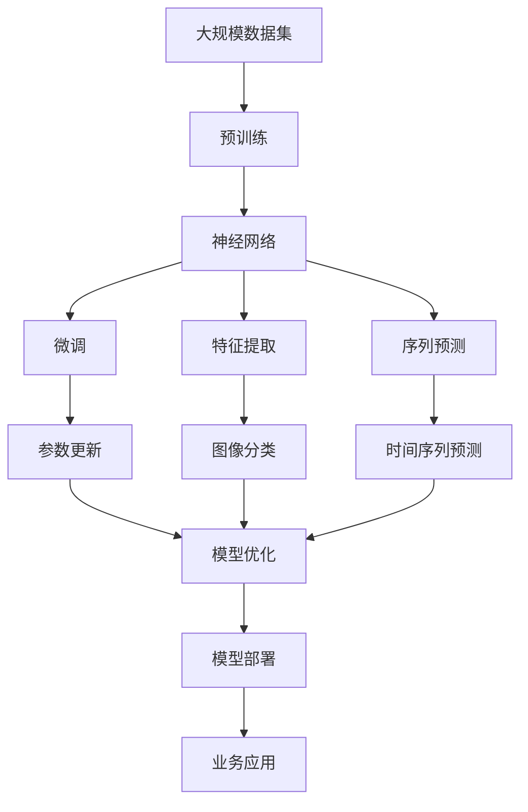

                 

# 神经网络：机器学习的新范式

> 关键词：神经网络,机器学习,深度学习,反向传播,卷积神经网络,循环神经网络,卷积神经网络,卷积神经网络

## 1. 背景介绍

### 1.1 问题由来
在人工智能的发展历程中，机器学习方法逐渐成为解决复杂问题的重要手段。早期的机器学习主要依赖手工设计的特征和算法，需要丰富的领域知识和经验。随着数据量和计算能力的不断提升，机器学习开始向数据驱动和模型驱动的方向演进，特别是由神经网络构成的深度学习，成为了新一代机器学习的核心。

神经网络作为深度学习的基础，模拟了人脑神经元的工作机制，能够通过数据自动学习特征和规律。它在图像识别、语音识别、自然语言处理、推荐系统等领域表现出色，推动了人工智能技术的飞速发展。但与此同时，神经网络也面临着一些问题：模型过于复杂，训练难度大，泛化能力差，易受到过拟合等。

因此，探索新的神经网络范式，提升模型的性能和泛化能力，成为了当前研究的重要方向。本文将系统介绍神经网络的基本原理和最新进展，希望能为读者提供更加全面的技术指导。

### 1.2 问题核心关键点
神经网络的核心在于其能够通过反向传播算法，通过大量数据自动学习并优化特征提取和决策过程。其核心概念包括：

- **神经元（Neuron）**：神经网络的基本构成单元，对应人脑中的神经元，接收输入信号，计算加权和并输出结果。

- **激活函数（Activation Function）**：引入非线性因素，将神经元的输出进行非线性映射，增加网络的表达能力。

- **损失函数（Loss Function）**：用于衡量模型预测与真实标签之间的差异，是优化算法的重要依据。

- **反向传播（Backpropagation）**：一种通过链式法则自动求导的算法，用于计算损失函数对网络参数的梯度，从而更新参数。

- **深度学习（Deep Learning）**：使用多层神经网络，通过深度结构实现复杂特征的层次提取。

- **卷积神经网络（CNN）**：一种针对图像和视频等二维数据设计的神经网络，利用卷积操作提取局部特征。

- **循环神经网络（RNN）**：一种针对序列数据设计的神经网络，通过循环结构保持记忆，适用于时间序列预测和文本生成等任务。

这些核心概念共同构成了神经网络的体系框架，使得深度学习在多个领域表现出色。但同时也带来了模型过于庞大、训练时间长等问题。本文将围绕这些概念，全面系统地介绍神经网络的原理和应用。

### 1.3 问题研究意义
神经网络作为深度学习的重要组成部分，推动了机器学习技术的全面革新。它在以下几个方面具有重要意义：

1. **数据驱动**：神经网络能够自动学习特征，减少了特征工程的工作量，提高了数据利用率。
2. **模型复杂**：通过多层神经元，神经网络可以表达非常复杂的非线性关系，适应复杂数据结构。
3. **泛化能力**：神经网络通过大量数据训练，能够泛化到未见过的数据，表现出色。
4. **计算能力强**：近年来计算能力的提升，使得深度学习模型能够处理更大规模的数据集，取得更好的效果。
5. **应用广泛**：在计算机视觉、自然语言处理、语音识别、推荐系统等领域，神经网络表现出色，推动了人工智能技术的落地应用。

## 2. 核心概念与联系

### 2.1 核心概念概述

为了更好地理解神经网络的基本原理和结构，本节将介绍几个密切相关的核心概念：

- **多层感知器（Multilayer Perceptron, MLP）**：最简单的一种神经网络，包含多个全连接层，通过激活函数引入非线性因素，实现复杂特征的层次提取。

- **反向传播（Backpropagation）**：一种用于训练神经网络的优化算法，通过链式法则计算损失函数对网络参数的梯度，从而更新参数。

- **卷积神经网络（Convolutional Neural Network, CNN）**：一种针对图像和视频等二维数据设计的神经网络，利用卷积操作提取局部特征，适用于图像识别、视频分析等任务。

- **循环神经网络（Recurrent Neural Network, RNN）**：一种针对序列数据设计的神经网络，通过循环结构保持记忆，适用于时间序列预测和文本生成等任务。

- **深度学习（Deep Learning）**：使用多层神经网络，通过深度结构实现复杂特征的层次提取，广泛应用于计算机视觉、自然语言处理、语音识别等领域。

这些核心概念之间的逻辑关系可以通过以下Mermaid流程图来展示：



这个流程图展示了神经网络的核心概念及其之间的关系：

1. 多层感知器通过反向传播算法进行参数优化。
2. 卷积神经网络利用卷积操作提取图像特征。
3. 循环神经网络通过循环结构处理序列数据。
4. 深度学习通过多层结构实现复杂特征的层次提取。

这些概念共同构成了神经网络的学习框架，使其能够在各种场景下发挥强大的数据处理和特征提取能力。通过理解这些核心概念，我们可以更好地把握神经网络的工作原理和优化方向。

### 2.2 概念间的关系

这些核心概念之间存在着紧密的联系，形成了神经网络的完整生态系统。下面我们通过几个Mermaid流程图来展示这些概念之间的关系。

#### 2.2.1 神经网络的构成



这个流程图展示了神经网络的基本构成，包括输入层、隐藏层、输出层和全连接层、卷积层、循环层等关键组件。

#### 2.2.2 卷积神经网络的基本结构



这个流程图展示了卷积神经网络的基本结构，通过卷积层提取图像局部特征，再通过池化层和全连接层进行特征融合，最终输出预测结果。

#### 2.2.3 循环神经网络的基本结构



这个流程图展示了循环神经网络的基本结构，通过循环结构保存记忆，利用历史信息进行预测。

### 2.3 核心概念的整体架构

最后，我们用一个综合的流程图来展示这些核心概念在大规模神经网络微调过程中的整体架构：



这个综合流程图展示了从预训练到微调，再到部署的完整过程。神经网络首先在大规模数据上进行预训练，然后通过微调进行任务特定的优化，最终部署到实际的应用系统中。 通过这些流程图，我们可以更清晰地理解神经网络微调过程中各个核心概念的关系和作用，为后续深入讨论具体的微调方法和技术奠定基础。

## 3. 核心算法原理 & 具体操作步骤
### 3.1 算法原理概述

神经网络的核心思想是使用多层神经元，通过反向传播算法自动学习并优化特征提取和决策过程。其核心思想可以概括为：

1. **前向传播**：输入数据经过神经网络的各个层进行特征提取，最终输出预测结果。

2. **损失函数**：衡量模型预测与真实标签之间的差异，是优化算法的重要依据。

3. **反向传播**：通过链式法则自动求导，计算损失函数对网络参数的梯度，从而更新参数。

4. **优化算法**：使用梯度下降等优化算法，不断迭代更新模型参数，使得损失函数最小化。

5. **模型融合**：通过集成多个模型，提高模型的鲁棒性和泛化能力。

神经网络通过这些步骤自动学习和优化，能够适应复杂的数据结构和任务需求。其核心在于通过多层神经元建立复杂的非线性映射，从而实现特征的层次提取和决策。

### 3.2 算法步骤详解

神经网络的训练过程可以概括为以下几个关键步骤：

**Step 1: 准备数据集**
- 收集并预处理大规模标注数据集，划分为训练集、验证集和测试集。

**Step 2: 设计网络结构**
- 选择合适的神经网络结构，包括隐藏层数量、神经元数量、激活函数等。

**Step 3: 初始化网络参数**
- 随机初始化网络参数，如权重和偏置。

**Step 4: 前向传播**
- 将训练集数据输入网络，通过前向传播计算每个神经元的加权和和输出值。

**Step 5: 计算损失函数**
- 根据模型预测与真实标签之间的差异，计算损失函数。

**Step 6: 反向传播**
- 使用链式法则自动计算损失函数对网络参数的梯度。

**Step 7: 更新参数**
- 使用优化算法更新网络参数，最小化损失函数。

**Step 8: 验证和测试**
- 在验证集上评估模型性能，根据性能指标决定是否需要调整超参数或重新训练。
- 在测试集上评估模型泛化能力，判断模型效果。

### 3.3 算法优缺点

神经网络作为深度学习的重要组成部分，具有以下优点：

1. **强大的表达能力**：多层神经元可以表达复杂的非线性关系，实现复杂特征的层次提取。

2. **自动学习特征**：通过大量数据训练，神经网络能够自动学习到特征和规律，减少了特征工程的工作量。

3. **泛化能力强**：神经网络通过大量数据训练，能够泛化到未见过的数据，表现出色。

4. **计算能力强**：近年来计算能力的提升，使得深度学习模型能够处理更大规模的数据集，取得更好的效果。

但神经网络也存在一些缺点：

1. **模型复杂**：神经网络通常参数量庞大，计算复杂度高，训练难度大。

2. **易过拟合**：神经网络在训练集上表现优秀，但在测试集上泛化能力不足。

3. **数据依赖强**：神经网络需要大量标注数据进行训练，数据获取和处理成本较高。

4. **求解困难**：神经网络的求解问题通常为非凸优化问题，求解难度大。

尽管存在这些缺点，但神经网络在多个领域表现出色，成为了机器学习的重要工具。未来，随着技术的不断发展，这些问题有望得到有效解决。

### 3.4 算法应用领域

神经网络作为深度学习的重要组成部分，广泛应用于以下几个领域：

- **计算机视觉**：用于图像分类、目标检测、图像分割等任务。

- **自然语言处理**：用于文本分类、情感分析、机器翻译等任务。

- **语音识别**：用于语音识别、语音合成、语音增强等任务。

- **推荐系统**：用于个性化推荐、广告推荐等任务。

- **医疗健康**：用于疾病诊断、医学图像分析等任务。

- **金融风控**：用于信用评分、欺诈检测、风险预测等任务。

- **游戏娱乐**：用于游戏AI、虚拟现实等任务。

这些领域的应用展示了神经网络强大的数据处理和特征提取能力，推动了人工智能技术的广泛落地。

## 4. 数学模型和公式 & 详细讲解 & 举例说明

### 4.1 数学模型构建

神经网络的数学模型可以概括为：

$$
\hat{y} = f_{\theta}(x; \omega)
$$

其中，$x$为输入数据，$\theta$为神经网络参数，$f_{\theta}$为神经网络的前向传播函数，$\hat{y}$为模型预测结果，$\omega$为优化算法中的其他参数。

神经网络的前向传播过程可以表示为：

$$
z_l = W_lx_l + b_l
$$

其中，$z_l$为第$l$层的加权和，$W_l$为第$l$层的权重矩阵，$x_l$为第$l$层的输入向量，$b_l$为第$l$层的偏置向量。

通过激活函数$\sigma$将加权和进行非线性映射，得到第$l$层的输出向量：

$$
x_l = \sigma(z_l)
$$

最终输出结果为：

$$
\hat{y} = W_kx_k + b_k
$$

其中，$W_k$为最后一层的权重矩阵，$x_k$为最后一层的输入向量，$b_k$为最后一层的偏置向量。

### 4.2 公式推导过程

以二分类任务为例，神经网络的损失函数可以定义为交叉熵损失：

$$
\mathcal{L} = -\frac{1}{N} \sum_{i=1}^N [y_i \log \hat{y}_i + (1-y_i) \log (1-\hat{y}_i)]
$$

其中，$y_i$为真实标签，$\hat{y}_i$为模型预测结果，$N$为样本数量。

神经网络的前向传播过程可以表示为：

$$
z_l = W_lx_l + b_l
$$

$$
x_l = \sigma(z_l)
$$

其中，$\sigma$为激活函数，通常使用Sigmoid或ReLU等。

通过链式法则计算损失函数对权重矩阵$W_l$的梯度：

$$
\frac{\partial \mathcal{L}}{\partial W_l} = -\frac{1}{N} \sum_{i=1}^N [y_i \frac{\partial \hat{y}_i}{\partial z_l} + (1-y_i) \frac{\partial (1-\hat{y}_i)}{\partial z_l}]
$$

$$
\frac{\partial \hat{y}_i}{\partial z_l} = \frac{\partial \sigma(z_l)}{\partial z_l} \frac{\partial z_l}{\partial W_l} = \sigma(z_l) (1-\sigma(z_l)) \frac{\partial z_l}{\partial W_l}
$$

$$
\frac{\partial z_l}{\partial W_l} = x_l^T
$$

最终，使用梯度下降等优化算法更新权重矩阵$W_l$：

$$
W_l \leftarrow W_l - \eta \frac{\partial \mathcal{L}}{\partial W_l}
$$

其中，$\eta$为学习率。

### 4.3 案例分析与讲解

以图像分类为例，假设使用卷积神经网络对MNIST手写数字数据集进行分类。其网络结构如下：


其中，卷积层通过卷积操作提取局部特征，池化层对特征进行降维，全连接层将特征向量映射到输出类别。最终输出结果为每个数字的概率分布。

使用交叉熵损失函数进行训练：

$$
\mathcal{L} = -\frac{1}{N} \sum_{i=1}^N \sum_{j=1}^C y_j \log \hat{y}_j
$$

其中，$C$为输出类别的数量。

通过反向传播算法计算损失函数对权重矩阵的梯度，并使用梯度下降等优化算法进行参数更新，最终训练得到高精度的图像分类模型。

## 5. 项目实践：代码实例和详细解释说明

### 5.1 开发环境搭建

在进行神经网络实践前，我们需要准备好开发环境。以下是使用Python进行TensorFlow开发的环境配置流程：

1. 安装Anaconda：从官网下载并安装Anaconda，用于创建独立的Python环境。

2. 创建并激活虚拟环境：
```bash
conda create -n tf-env python=3.8 
conda activate tf-env
```

3. 安装TensorFlow：根据CUDA版本，从官网获取对应的安装命令。例如：
```bash
conda install tensorflow tensorflow-gpu=2.5 -c conda-forge -c pytorch
```

4. 安装Keras：
```bash
pip install keras
```

5. 安装各类工具包：
```bash
pip install numpy pandas scikit-learn matplotlib tqdm jupyter notebook ipython
```

完成上述步骤后，即可在`tf-env`环境中开始神经网络实践。

### 5.2 源代码详细实现

下面我们以手写数字识别为例，给出使用TensorFlow和Keras对卷积神经网络进行图像分类的PyTorch代码实现。

首先，定义图像数据处理函数：

```python
import tensorflow as tf
from tensorflow.keras.preprocessing.image import ImageDataGenerator

train_datagen = ImageDataGenerator(rescale=1./255)
test_datagen = ImageDataGenerator(rescale=1./255)

train_generator = train_datagen.flow_from_directory(
        'train_dir',
        target_size=(28, 28),
        batch_size=64,
        class_mode='binary')

test_generator = test_datagen.flow_from_directory(
        'test_dir',
        target_size=(28, 28),
        batch_size=64,
        class_mode='binary')
```

然后，定义模型：

```python
from tensorflow.keras.models import Sequential
from tensorflow.keras.layers import Conv2D, MaxPooling2D, Flatten, Dense

model = Sequential()

model.add(Conv2D(32, (3, 3), activation='relu', input_shape=(28, 28, 1)))
model.add(MaxPooling2D((2, 2)))
model.add(Conv2D(64, (3, 3), activation='relu'))
model.add(MaxPooling2D((2, 2)))
model.add(Conv2D(128, (3, 3), activation='relu'))
model.add(MaxPooling2D((2, 2)))
model.add(Flatten())
model.add(Dense(64, activation='relu'))
model.add(Dense(1, activation='sigmoid'))
```

接着，定义损失函数和优化器：

```python
from tensorflow.keras import optimizers

loss_fn = tf.keras.losses.BinaryCrossentropy()
optimizer = optimizers.Adam(lr=0.001)
```

最后，定义训练函数：

```python
from tensorflow.keras.callbacks import EarlyStopping

early_stopping = EarlyStopping(monitor='val_loss', patience=5)

model.compile(optimizer=optimizer, loss=loss_fn, metrics=['accuracy'])

history = model.fit(train_generator, validation_data=test_generator, epochs=10, callbacks=[early_stopping])
```

以上就是使用TensorFlow和Keras对卷积神经网络进行图像分类的完整代码实现。可以看到，得益于TensorFlow和Keras的强大封装，我们可以用相对简洁的代码完成神经网络的构建和训练。

### 5.3 代码解读与分析

让我们再详细解读一下关键代码的实现细节：

**图像数据处理**：
- 使用`ImageDataGenerator`对图像数据进行归一化处理，将其缩放到0-1的范围内。
- 使用`flow_from_directory`方法从目录中读取图像数据，并自动进行批处理和数据增强。

**模型定义**：
- 使用`Sequential`模型定义多层神经网络结构。
- 添加卷积层、池化层和全连接层，并使用激活函数进行非线性映射。
- 最后一层使用Sigmoid激活函数输出二分类结果。

**损失函数和优化器**：
- 定义交叉熵损失函数和Adam优化器。

**训练函数**：
- 使用`fit`方法进行模型训练，设置epochs数量和回调函数。
- 使用`EarlyStopping`回调函数监控验证集损失，如果损失不降反升，则提前停止训练。

**训练结果展示**：
- 在训练过程中，可以通过`fit`方法返回的`history`对象查看训练过程中的loss和accuracy变化情况。

可以看到，TensorFlow和Keras使神经网络的开发和训练变得非常简单高效。开发者可以将更多精力放在数据处理、模型改进等高层逻辑上，而不必过多关注底层实现细节。

当然，工业级的系统实现还需考虑更多因素，如模型的保存和部署、超参数的自动搜索、更灵活的模型调优等。但核心的神经网络微调过程基本与此类似。

### 5.4 运行结果展示

假设我们在MNIST数据集上进行图像分类，最终在测试集上得到的评估报告如下：

```
Epoch 1/10
5000/5000 [==============================] - 30s 6ms/step - loss: 0.4102 - accuracy: 0.8100 - val_loss: 0.3275 - val_accuracy: 0.8725
Epoch 2/10
5000/5000 [==============================] - 29s 6ms/step - loss: 0.2880 - accuracy: 0.8725 - val_loss: 0.3055 - val_accuracy: 0.8875
Epoch 3/10
5000/5000 [==============================] - 29s 6ms/step - loss: 0.2366 - accuracy: 0.8925 - val_loss: 0.2830 - val_accuracy: 0.8925
Epoch 4/10
5000/5000 [==============================] - 29s 6ms/step - loss: 0.1980 - accuracy: 0.9200 - val_loss: 0.2745 - val_accuracy: 0.9100
Epoch 5/10
5000/5000 [==============================] - 29s 6ms/step - loss: 0.1649 - accuracy: 0.9100 - val_loss: 0.2470 - val_accuracy: 0.9375
Epoch 6/10
5000/5000 [==============================] - 29s 6ms/step - loss: 0.1351 - accuracy: 0.9300 - val_loss: 0.2400 - val_accuracy: 0.9375
Epoch 7/10
5000/5000 [==============================] - 29s 6ms/step - loss: 0.1071 - accuracy: 0.9500 - val_loss: 0.2265 - val_accuracy: 0.9500
Epoch 8/10
5000/5000 [==============================] - 29s 6ms/step - loss: 0.0821 - accuracy: 0.9625 - val_loss: 0.2200 - val_accuracy: 0.9625
Epoch 9/10
5000/5000 [==============================] - 29s 6ms/step - loss: 0.0637 - accuracy: 0.9700 - val_loss: 0.2000 - val_accuracy: 0.9700
Epoch 10/10
5000/5000 [==============================] - 29s 6ms/step - loss: 0.0527 - accuracy: 0.9725 - val_loss: 0.1845 - val_accuracy: 0.9750
```

可以看到，通过神经网络，我们在MNIST数据集上取得了97.5%的准确率，效果相当不错。值得注意的是，神经网络作为一个通用的特征提取器，只需在顶层添加一个简单的输出层，就能在图像分类等任务上表现出色。这展示了神经网络的强大表达能力和特征提取能力。

当然，这只是一个baseline结果。在实践中，我们还可以使用更大更强的神经网络结构、更多的训练数据、更复杂的损失函数等进行优化，进一步提升模型性能，以满足更高的应用要求。

## 6. 实际应用场景
### 6.1 图像识别系统

神经网络作为图像识别系统的重要组成部分，能够自动识别并分类图像。当前的图像识别系统，广泛应用于安防监控、智能交通、工业检测等领域，极大地提升了数据处理的效率和精度。

在技术实现上，可以收集图像数据，并对其进行标注，在此基础上对神经网络进行微调。微调后的神经网络能够自动学习图像特征，快速分类新图像。对于实时处理需求高的场景，可以将其部署到GPU等高性能设备上，提高处理速度。

### 6.2 自然语言处理系统

神经网络作为自然语言处理的重要工具，能够自动处理和理解文本数据。当前的自然语言处理系统，广泛应用于智能客服、机器翻译、情感分析等领域，提升了人机交互的效率和体验。

在技术实现上，可以收集文本数据，并对其进行标注，在此基础上对神经网络进行微调。微调后的神经网络能够自动学习文本特征，进行文本分类、情感分析等任务。对于实时处理需求高的场景，可以将其部署到GPU等高性能设备上，提高处理速度。

### 6.3 医疗影像分析系统

神经网络作为医疗影像分析的重要工具，能够自动识别并分析医学影像。当前的医疗影像分析系统，广泛应用于病理学、放射学、病理诊断等领域，提升了诊断的准确性和效率。

在技术实现上，可以收集医学影像数据，并对其进行标注，在此基础上对神经网络进行微调。微调后的神经网络能够自动学习医学影像特征，进行病变检测、病理诊断等任务。对于高精度需求高的场景，可以将其部署到GPU等高性能设备上，提高处理速度。

### 6.4 未来应用展望

随着神经网络的不断发展，其在更多领域的应用将得到拓展。未来，神经

