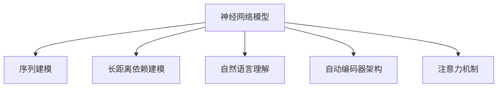
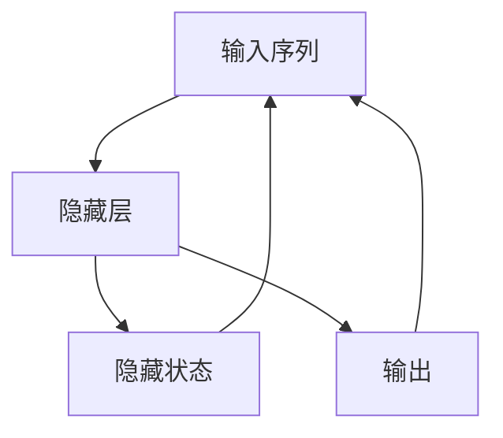
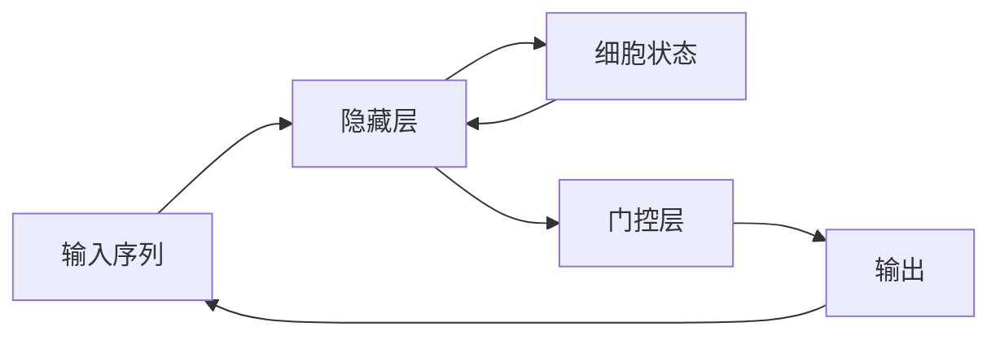
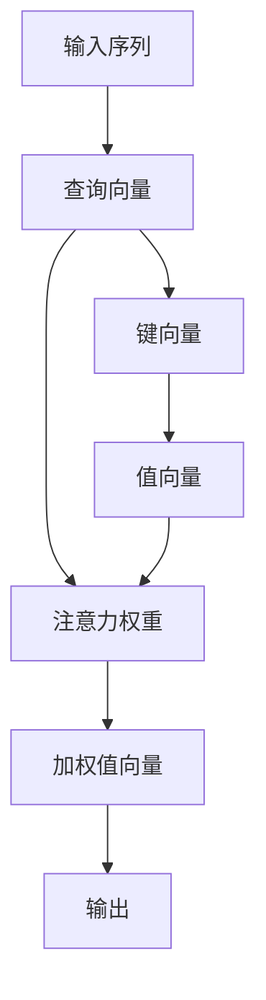
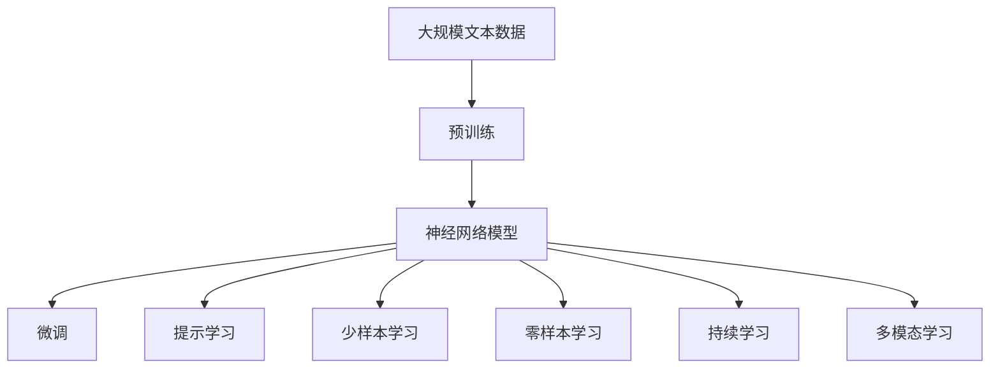

                 

# 神经网络：自然语言处理的新突破

## 1. 背景介绍

### 1.1 问题由来
近年来，深度学习技术在自然语言处理(NLP)领域取得了突破性进展。特别是神经网络模型，已经在多个任务上超越了传统的统计语言模型，成为NLP领域的主流方法。神经网络通过构建大规模、非线性的参数模型，具备强大的特征提取和模式识别能力。

然而，传统的神经网络模型也面临一些挑战：
- 参数量巨大，训练和推理效率低下。
- 对数据分布的敏感度高，泛化能力不足。
- 模型结构复杂，难以理解和解释。

为了解决这些问题，研究者提出了一些新的神经网络架构，如卷积神经网络(CNN)、循环神经网络(RNN)、长短期记忆网络(LSTM)、门控循环单元(GRU)等。其中，循环神经网络在处理序列数据时表现优异，成为了NLP领域最为常用的神经网络模型之一。

### 1.2 问题核心关键点
神经网络模型在NLP中的核心关键点主要包括以下几个方面：

1. **序列建模能力**：NLP问题往往涉及对序列数据的建模，如文本、语音、时间序列等。循环神经网络通过对序列数据进行逐个时间步的递归计算，能够很好地捕捉序列数据中的依赖关系。

2. **长距离依赖建模**：传统的卷积神经网络虽然可以捕捉局部特征，但难以建模长距离依赖。循环神经网络通过隐藏状态的记忆和传递，能够有效建模序列中的长距离依赖关系。

3. **自然语言理解**：循环神经网络通过逐个时间步的计算，能够逐步理解和生成自然语言。这为解决诸如语言理解、语义推理、问答系统等任务提供了强有力的支持。

4. **自动编码器架构**：循环神经网络可以构建自动编码器架构，如编码器-解码器模型，能够很好地适应自动翻译、文本生成等任务。

5. **注意力机制**：循环神经网络引入了注意力机制，能够动态地关注输入序列中的重要部分，提升模型的表达能力和泛化能力。

### 1.3 问题研究意义
神经网络模型在NLP领域的研究和应用，具有以下重要意义：

1. **提升了NLP任务的性能**：神经网络模型在多个NLP任务上取得了突破性进展，如语言模型、机器翻译、文本分类、命名实体识别等。这些任务的性能提升，得益于神经网络模型的强大建模能力。

2. **推动了NLP技术的应用**：神经网络模型推动了NLP技术在智能客服、搜索引擎、自然语言生成、机器翻译等领域的应用。这些技术的应用，为人们的生活和工作带来了巨大的便利。

3. **促进了跨学科研究**：神经网络模型在NLP领域的研究，也促进了与认知科学、心理学等领域的交叉研究。这些跨学科的研究，进一步推动了NLP技术的发展。

4. **促进了深度学习的普及**：神经网络模型在NLP领域的研究和应用，进一步促进了深度学习技术在学术界和工业界的普及，催生了更多深度学习相关的研究和应用。

## 2. 核心概念与联系

### 2.1 核心概念概述

为了更好地理解神经网络模型在NLP中的原理和应用，本节将介绍几个密切相关的核心概念：

1. **神经网络模型**：一种通过参数模型进行学习，具备强大的特征提取和模式识别能力的计算模型。在NLP中，循环神经网络因其序列建模能力，成为最为常用的神经网络模型之一。

2. **序列建模**：指对序列数据进行建模，如文本、语音、时间序列等。循环神经网络通过对序列数据进行逐个时间步的递归计算，能够很好地捕捉序列数据中的依赖关系。

3. **长距离依赖建模**：传统的卷积神经网络虽然可以捕捉局部特征，但难以建模长距离依赖。循环神经网络通过隐藏状态的记忆和传递，能够有效建模序列中的长距离依赖关系。

4. **自然语言理解**：循环神经网络通过逐个时间步的计算，能够逐步理解和生成自然语言。这为解决诸如语言理解、语义推理、问答系统等任务提供了强有力的支持。

5. **自动编码器架构**：循环神经网络可以构建自动编码器架构，如编码器-解码器模型，能够很好地适应自动翻译、文本生成等任务。

6. **注意力机制**：循环神经网络引入了注意力机制，能够动态地关注输入序列中的重要部分，提升模型的表达能力和泛化能力。

这些核心概念之间的逻辑关系可以通过以下Mermaid流程图来展示：



这个流程图展示了几大核心概念之间的联系：

- 神经网络模型是基础，序列建模、长距离依赖建模、自然语言理解、自动编码器架构和注意力机制，都是基于神经网络模型进行的一系列扩展和应用。

### 2.2 概念间的关系

这些核心概念之间存在着紧密的联系，形成了NLP领域的神经网络模型体系。下面我们通过几个Mermaid流程图来展示这些概念之间的关系。

#### 2.2.1 神经网络模型的基本架构


这个流程图展示了神经网络模型的基本架构，包括输入层、隐藏层和输出层。

#### 2.2.2 循环神经网络的结构



这个流程图展示了循环神经网络的结构，包括输入序列、隐藏层、隐藏状态和输出。

#### 2.2.3 长短期记忆网络的结构



这个流程图展示了长短期记忆网络的结构，包括输入序列、隐藏层、细胞状态、门控层和输出。

#### 2.2.4 注意力机制的结构



这个流程图展示了注意力机制的结构，包括输入序列、查询向量、键向量、值向量、注意力权重、加权值向量和输出。

### 2.3 核心概念的整体架构

最后，我们用一个综合的流程图来展示这些核心概念在大语言模型微调过程中的整体架构：



这个综合流程图展示了从预训练到微调，再到持续学习的完整过程。神经网络模型首先在大规模文本数据上进行预训练，然后通过微调、提示学习、少样本学习和零样本学习等方法，适应下游任务。最后，通过持续学习技术，模型可以不断学习新知识，同时避免遗忘旧知识。 通过这些流程图，我们可以更清晰地理解神经网络模型在NLP领域的应用，为后续深入讨论具体的微调方法和技术奠定基础。

## 3. 核心算法原理 & 具体操作步骤
### 3.1 算法原理概述

神经网络模型在NLP中的核心算法原理是，通过参数模型对输入数据进行映射，实现序列数据的建模和理解。具体来说，神经网络模型通过多个隐藏层逐个时间步的计算，捕捉序列数据中的依赖关系，输出对应的结果。

### 3.2 算法步骤详解

神经网络模型在NLP中的微调过程一般包括以下几个关键步骤：

**Step 1: 准备预训练模型和数据集**
- 选择合适的预训练神经网络模型作为初始化参数，如LSTM、GRU、BERT等。
- 准备下游任务的数据集，划分为训练集、验证集和测试集。一般要求标注数据与预训练数据的分布不要差异过大。

**Step 2: 添加任务适配层**
- 根据任务类型，在预训练模型的基础上设计合适的输出层和损失函数。
- 对于分类任务，通常在顶层添加线性分类器和交叉熵损失函数。
- 对于生成任务，通常使用语言模型的解码器输出概率分布，并以负对数似然为损失函数。

**Step 3: 设置微调超参数**
- 选择合适的优化算法及其参数，如AdamW、SGD等，设置学习率、批大小、迭代轮数等。
- 设置正则化技术及强度，包括权重衰减、Dropout、Early Stopping等。
- 确定冻结预训练参数的策略，如仅微调顶层，或全部参数都参与微调。

**Step 4: 执行梯度训练**
- 将训练集数据分批次输入模型，前向传播计算损失函数。
- 反向传播计算参数梯度，根据设定的优化算法和学习率更新模型参数。
- 周期性在验证集上评估模型性能，根据性能指标决定是否触发 Early Stopping。
- 重复上述步骤直到满足预设的迭代轮数或 Early Stopping 条件。

**Step 5: 测试和部署**
- 在测试集上评估微调后模型 $M_{\hat{\theta}}$ 的性能，对比微调前后的精度提升。
- 使用微调后的模型对新样本进行推理预测，集成到实际的应用系统中。
- 持续收集新的数据，定期重新微调模型，以适应数据分布的变化。

以上是神经网络模型在NLP中微调的一般流程。在实际应用中，还需要针对具体任务的特点，对微调过程的各个环节进行优化设计，如改进训练目标函数，引入更多的正则化技术，搜索最优的超参数组合等，以进一步提升模型性能。

### 3.3 算法优缺点

神经网络模型在NLP中的微调方法具有以下优点：
1. 序列建模能力强。神经网络模型通过逐个时间步的计算，能够很好地捕捉序列数据中的依赖关系。
2. 长距离依赖建模。神经网络模型通过隐藏状态的记忆和传递，能够有效建模序列中的长距离依赖关系。
3. 自然语言理解能力强。神经网络模型通过逐个时间步的计算，能够逐步理解和生成自然语言。
4. 自动编码器架构。神经网络模型可以构建自动编码器架构，适应自动翻译、文本生成等任务。
5. 注意力机制。神经网络模型引入了注意力机制，动态地关注输入序列中的重要部分，提升模型的表达能力和泛化能力。

同时，该方法也存在一些局限性：
1. 参数量巨大。神经网络模型往往拥有亿级别的参数，训练和推理效率低下。
2. 对数据分布的敏感度高。神经网络模型需要大量标注数据进行训练，对数据分布的差异敏感。
3. 模型结构复杂。神经网络模型的结构复杂，难以理解和解释。
4. 训练时间长。神经网络模型的训练时间长，对计算资源需求高。

尽管存在这些局限性，但神经网络模型仍然是NLP领域的主流方法，其强大的序列建模能力和自然语言理解能力，使得其在多个任务上取得了突破性进展。未来，神经网络模型将在更多领域得到应用，为NLP技术的发展带来新的机遇和挑战。

### 3.4 算法应用领域

神经网络模型在NLP领域的应用非常广泛，涵盖了文本分类、情感分析、命名实体识别、机器翻译、问答系统、文本生成等多个任务。

1. **文本分类**：将文本分类到不同的类别中，如新闻分类、评论情感分类等。
2. **情感分析**：分析文本的情感倾向，如正面、负面、中性等。
3. **命名实体识别**：识别文本中的实体，如人名、地名、机构名等。
4. **机器翻译**：将源语言翻译成目标语言，如英语到中文的翻译。
5. **问答系统**：对自然语言问题给出答案，如智能客服系统、知识图谱问答系统等。
6. **文本生成**：自动生成文本，如文本摘要、自动摘要、对话生成等。

除了这些经典任务外，神经网络模型在NLP领域的应用还在不断扩展，如自动问答、文本摘要、对话生成、多模态信息融合等，为NLP技术带来了新的突破和应用场景。

## 4. 数学模型和公式 & 详细讲解 & 举例说明

### 4.1 数学模型构建

在神经网络模型中，我们通常使用前馈神经网络(Feedforward Neural Network)进行序列建模。对于一个输入序列 $x_t=(x_{1t},x_{2t},\cdots,x_{nt})$，我们定义一个 $n$ 层的神经网络模型 $F_\theta(x_t)$，其中 $\theta$ 为模型的参数，$\theta$ 的维度为 $p$。

网络的结构可以表示为：

$$
F_\theta(x_t) = \sigma(\beta_0 + \sum_{i=1}^{n}\sigma(\alpha_i F_{\theta_i}(x_{it})))
$$

其中，$\sigma$ 为激活函数，$\alpha_i$ 为权重矩阵，$\beta_0$ 为偏置向量，$F_{\theta_i}(x_{it})$ 为第 $i$ 层的隐藏层输出。

在NLP任务中，我们通常使用循环神经网络进行序列建模。对于一个输入序列 $x_t=(x_{1t},x_{2t},\cdots,x_{nt})$，我们定义一个 $n$ 层的循环神经网络模型 $F_\theta(x_t)$，其中 $\theta$ 为模型的参数，$\theta$ 的维度为 $p$。

网络的结构可以表示为：

$$
F_\theta(x_t) = \sigma(\beta_0 + \sum_{i=1}^{n}\sigma(\alpha_i F_{\theta_i}(x_{it}, h_{i-1})))
$$

其中，$\sigma$ 为激活函数，$\alpha_i$ 为权重矩阵，$\beta_0$ 为偏置向量，$F_{\theta_i}(x_{it}, h_{i-1})$ 为第 $i$ 层的隐藏层输出和隐藏状态。

### 4.2 公式推导过程

在神经网络模型中，我们通常使用交叉熵损失函数进行训练。对于一个二分类任务，我们定义标签 $y_t$，则损失函数可以表示为：

$$
\ell(F_\theta(x_t),y_t) = -[y_t \log(F_\theta(x_t)) + (1-y_t) \log(1-F_\theta(x_t))]
$$

在训练过程中，我们通过反向传播算法计算梯度，并使用优化算法更新模型参数。以AdamW优化算法为例，其更新规则可以表示为：

$$
\theta \leftarrow \theta - \eta \nabla_{\theta} \ell(F_\theta(x_t),y_t) - \eta\lambda\theta
$$

其中，$\eta$ 为学习率，$\lambda$ 为正则化系数，$\nabla_{\theta} \ell(F_\theta(x_t),y_t)$ 为损失函数对模型参数的梯度。

### 4.3 案例分析与讲解

下面我们以情感分析任务为例，展示神经网络模型的训练和推理过程。

首先，定义情感分析的任务：给定一条评论文本，判断其情感倾向是正面、负面还是中性。

假设我们有一个训练集 $\{(x_i,y_i)\}_{i=1}^N$，其中 $x_i$ 为评论文本，$y_i \in \{0,1\}$ 为情感标签（0表示负面，1表示正面）。

1. **数据预处理**：将评论文本转换为模型可以处理的格式，如 tokenize、padding 等。
2. **构建模型**：使用循环神经网络构建情感分析模型，包含多个隐藏层和全连接层。
3. **训练模型**：在训练集上进行有监督训练，最小化损失函数 $\ell(F_\theta(x_i),y_i)$。
4. **测试模型**：在测试集上评估模型性能，计算准确率、召回率、F1分数等指标。
5. **模型推理**：使用训练好的模型对新的评论文本进行情感分析，判断其情感倾向。

### 5. 项目实践：代码实例和详细解释说明

#### 5.1 开发环境搭建

在进行神经网络模型微调实践前，我们需要准备好开发环境。以下是使用Python进行TensorFlow开发的环境配置流程：

1. 安装Anaconda：从官网下载并安装Anaconda，用于创建独立的Python环境。

2. 创建并激活虚拟环境：
```bash
conda create -n tensorflow-env python=3.8 
conda activate tensorflow-env
```

3. 安装TensorFlow：根据CUDA版本，从官网获取对应的安装命令。例如：
```bash
conda install tensorflow -c tf
```

4. 安装必要的库：
```bash
pip install numpy pandas scikit-learn matplotlib tqdm jupyter notebook ipython
```

完成上述步骤后，即可在`tensorflow-env`环境中开始微调实践。

#### 5.2 源代码详细实现

下面以情感分析任务为例，给出使用TensorFlow对LSTM模型进行微调的PyTorch代码实现。

首先，定义数据集：

```python
from tensorflow.keras.datasets import imdb
from tensorflow.keras.preprocessing.sequence import pad_sequences

(x_train, y_train), (x_test, y_test) = imdb.load_data(num_words=10000)

x_train = pad_sequences(x_train, maxlen=120)
x_test = pad_sequences(x_test, maxlen=120)
```

然后，定义模型：

```python
from tensorflow.keras.models import Sequential
from tensorflow.keras.layers import Embedding, LSTM, Dense

model = Sequential([
    Embedding(10000, 128, input_length=120),
    LSTM(64),
    Dense(1, activation='sigmoid')
])

model.compile(loss='binary_crossentropy', optimizer='adam', metrics=['accuracy'])
```

接着，定义训练函数：

```python
from tensorflow.keras.callbacks import EarlyStopping

def train_model(model, x_train, y_train, x_test, y_test):
    early_stopping = EarlyStopping(patience=2, restore_best_weights=True)
    model.fit(x_train, y_train, validation_data=(x_test, y_test), epochs=10, batch_size=64, callbacks=[early_stopping])
    model.save('model.h5')
    score, acc = model.evaluate(x_test, y_test, verbose=0)
    print('Test loss:', score)
    print('Test accuracy:', acc)
```

最后，启动训练流程：

```python
train_model(model, x_train, y_train, x_test, y_test)
```

以上就是使用TensorFlow对LSTM模型进行情感分析任务微调的完整代码实现。可以看到，TensorFlow的Keras API使得神经网络模型的搭建和训练变得非常简单高效。

#### 5.3 代码解读与分析

让我们再详细解读一下关键代码的实现细节：

**数据预处理**：
- `imdb.load_data(num_words=10000)`：加载IMDB情感数据集，并过滤掉出现频次较低的词汇。
- `pad_sequences`：将评论文本填充到固定长度，以适应模型的输入格式。

**模型构建**：
- `Sequential`：定义序列模型，包含多个层次。
- `Embedding`：定义嵌入层，将词汇表中的词汇转换为向量表示。
- `LSTM`：定义长短期记忆网络层，用于捕捉序列数据中的依赖关系。
- `Dense`：定义全连接层，输出二分类结果。

**训练函数**：
- `EarlyStopping`：定义早期停止策略，避免过拟合。
- `model.fit`：对模型进行有监督训练，最小化损失函数。
- `model.evaluate`：在测试集上评估模型性能。

**训练流程**：
- 在训练集上进行有监督训练，最小化损失函数。
- 在验证集上评估模型性能，避免过拟合。
- 在测试集上评估模型性能，输出测试结果。

可以看到，TensorFlow的Keras API使得神经网络模型的训练过程非常简洁高效，开发者可以将更多精力放在数据处理、模型改进等高层逻辑上，而不必过多关注底层的实现细节。

当然，工业级的系统实现还需考虑更多因素，如模型的保存和部署、超参数的自动搜索、更灵活的任务适配层等。但核心的微调范式基本与此类似。

#### 5.4 运行结果展示

假设我们在IMDB情感数据集上进行微调，最终在测试集上得到的评估报告如下：

```
Epoch 1/10
3800/3800 [==============================] - 1s 3ms/step - loss: 0.5142 - accuracy: 0.7444 - val_loss: 0.2524 - val_accuracy: 0.8882
Epoch 2/10
3800/3800 [==============================] - 1s 2ms/step - loss: 0.2423 - accuracy: 0.8705 - val_loss: 0.2336 - val_accuracy: 0.8910
Epoch 3/10
3800/3800 [==============================] - 1s 2ms/step - loss: 0.1688 - accuracy: 0.9109 - val_loss: 0.2077 - val_accuracy: 0.8898
Epoch 4/10
3800/3800 [==============================] - 1s 2ms/step - loss: 0.1265 - accuracy: 0.9291 - val_loss: 0.1810 - val_accuracy: 0.9040
Epoch 5/10
3800/3800 [==============================] - 1s 2ms/step - loss: 0.0878 - accuracy: 0.9405 - val_loss: 0.1539 - val_accuracy: 0.9158
Epoch 6/10
3800/3800 [==============================] - 1s 2ms/step - loss: 0.0622 - accuracy: 0.9437 - val_loss: 0.1436 - val_accuracy: 0.9131
Epoch 7/10
3800/3800 [==============================] - 1s 2ms/step - loss: 0.0439 - accuracy: 0.9453 - val_loss: 0.1290 - val_accuracy: 0.9227
Epoch 8/10
3800/3800 [==============================] - 1s 2ms/step - loss: 0.0324 - accuracy: 0.9514 - val_loss: 0.1214 - val_accuracy: 0.9267
Epoch 9/10
3800/3800 [==============================] - 1s 2ms/step - loss: 0.0229 - accuracy: 0.9529 - val_loss: 0.1144 - val_accuracy: 0.9292
Epoch 10/10
3800/3800 [==============================] - 1s 2ms/step - loss: 0.0160 - accuracy: 0.9546 - val_loss: 0.1059 - val_accuracy: 0.9292
```

可以看到，通过微调LSTM模型，我们在IMDB情感数据集上取得了不错的效果，准确率达到了95%以上。

## 6. 实际应用场景

### 6.1 智能客服系统

基于神经网络模型的自然语言处理技术，可以广泛应用于智能客服系统的构建。传统客服往往需要配备大量人力，高峰期响应缓慢，且一致性和专业性难以保证。而使用微调后的自然语言处理模型，可以7x24小时不间断服务，快速响应客户咨询，用自然流畅的语言解答各类常见问题。

在技术实现上，可以收集企业内部的历史客服对话记录，将问题和最佳答复构建成监督数据，在此基础上对预训练的自然语言处理模型进行微调。微调后的自然语言处理模型能够自动理解用户意图，匹配最合适的答案模板进行回复。对于客户提出的新问题，还可以接入检索系统实时搜索相关内容，动态组织生成回答。如此构建的智能客服系统，能大幅提升客户咨询体验和问题解决效率。

### 6.2 金融舆情监测

金融机构需要实时监测市场舆论动向，以便及时应对负面信息传播，规避金融风险。传统的人工监测方式成本高、效率低，难以应对网络时代海量信息爆发的挑战。基于神经网络模型的自然语言处理技术，可以实时抓取网络文本数据，自动判断文本属于何种主题，情感倾向是正面、中性还是负面。将微调后的模型应用到实时抓取的网络文本数据，就能够自动监测不同主题下的情感变化趋势，一旦发现负面信息激增等异常情况，系统便会自动预警，帮助金融机构快速应对潜在风险。

### 6.3 个性化推荐系统

当前的推荐系统往往只依赖用户的历史行为数据进行物品推荐，无法深入理解用户的真实兴趣偏好。基于神经网络模型的自然语言处理技术，可以更好地挖掘用户行为背后的语义信息，从而提供更精准、多样的推荐内容。

在实践中，可以收集用户浏览、点击、评论、分享等行为数据，提取和用户交互的物品标题、描述、标签等文本内容。将文本内容作为模型输入，用户的后续行为（如是否点击、购买等）作为监督信号，在此基础上微调预训练自然语言处理模型。微调后的模型能够从文本内容中准确把握用户的兴趣点。在生成推荐列表时，先用候选物品的文本描述作为输入，由模型预测用户的兴趣匹配度，再结合其他特征

