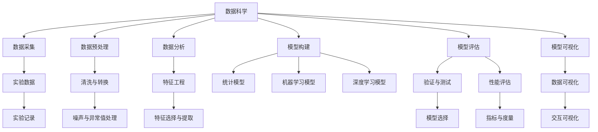
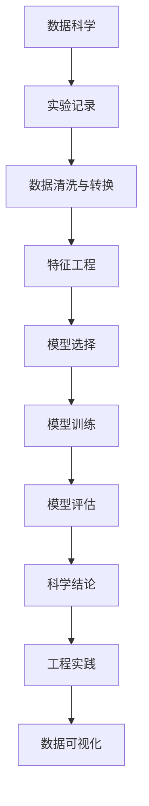

                 

# 科学探究：从观察到结论

## 1. 背景介绍

### 1.1 问题由来
科学探究是人类理解世界、发现规律的重要活动。从古希腊的亚里士多德、到近代的牛顿、爱因斯坦，无数科学家通过不断的观察和实验，揭示了自然界的秘密，推动了文明的进步。然而，在信息技术飞速发展的今天，传统科学探究的方法是否还适用？信息技术的加入，如何改变科学的探究过程？

### 1.2 问题核心关键点
科学研究的核心在于数据的采集、处理和分析，以得出科学的结论。信息技术为这一过程提供了新的工具和方法，但同时也带来了新的挑战。例如：
1. 数据量爆炸：随着传感器、互联网的普及，科学数据量呈指数级增长，如何高效管理和分析这些数据，成为一大难题。
2. 数据质量参差不齐：数据来源复杂多样，存在大量噪声和异常值，如何清洗和处理这些数据，保证分析结果的准确性，成为另一大难题。
3. 模型复杂化：传统统计模型难以处理大规模、高维度的数据，如何构建复杂模型并合理解释结果，成为新的挑战。
4. 自动化需求增加：科学研究越来越需要高效的自动化工具，如何开发高质量的科学数据处理、分析、可视化软件，成为新的需求。

这些问题催生了数据科学这一新兴学科，在科学研究和工程实践中，数据科学的方法被广泛应用，大大提高了科研效率和数据分析质量。然而，数据科学的兴起也带来了新的问题，例如算法可解释性、模型公平性、隐私保护等。如何在数据科学和传统科学探究之间找到一个平衡点，既利用数据科学的优势，又保留科学探究的严谨性和可解释性，成为当前研究的一个重要方向。

## 2. 核心概念与联系

### 2.1 核心概念概述

为更好地理解数据科学在科学探究中的应用，本节将介绍几个密切相关的核心概念：

- 数据科学：利用统计学、机器学习、数据库等技术，从数据中发现知识、得出结论的学科。数据科学包括数据采集、预处理、分析、可视化等多个环节。
- 科学探究：通过观察、假设、实验、分析等步骤，揭示自然界规律的过程。科学探究的核心在于数据的采集和处理。
- 模型：用于刻画自然现象或人工系统的数学或物理模型。数据科学中的模型通常包括统计模型、机器学习模型、深度学习模型等。
- 可解释性：模型的决策过程可以被解释和理解的程度。在科学研究中，模型的可解释性尤为重要，有助于验证结论的科学性和合理性。
- 公平性：模型对不同类别的数据具有公平处理的能力。在科学研究和工程实践中，模型的公平性需要得到保障。
- 隐私保护：保护个人数据和隐私信息，防止数据滥用和泄露。在科学研究中，数据隐私保护是一个重要议题。
- 自动化：利用自动化工具和方法，提高科学探究的效率和准确性。数据科学为科学探究提供了诸多自动化工具。

这些核心概念之间的逻辑关系可以通过以下Mermaid流程图来展示：



这个流程图展示了数据科学和科学探究的关键环节及其相互关系：

1. 数据科学从数据采集开始，数据预处理、数据分析、模型构建、模型评估、模型可视化等多个环节构成完整的科学探究过程。
2. 数据科学中的模型通常用于科学探究，通过数据分析得出结论。
3. 数据科学为科学探究提供了自动化工具，大大提高了科研效率。

### 2.2 概念间的关系

这些核心概念之间存在着紧密的联系，形成了数据科学在科学探究中的应用生态系统。下面我们通过几个Mermaid流程图来展示这些概念之间的关系。

#### 2.2.1 数据科学在科学探究中的应用


这个流程图展示了数据科学在科学探究中的应用过程。从数据采集开始，经过数据预处理、数据分析、模型构建、模型评估等环节，最终得出科学结论。

#### 2.2.2 数据科学与传统科学的结合


这个流程图展示了数据科学与传统科学探究的结合方式。数据科学为传统科学探究提供了数据采集、预处理、特征工程、模型构建和评估等工具和方法，使得科学研究更加高效和精确。

#### 2.2.3 数据科学与工程实践的融合



这个流程图展示了数据科学与工程实践的融合过程。科学探究得到的结果，通过数据可视化等手段，指导工程实践，实现科技成果的产业化。

## 3. 核心算法原理 & 具体操作步骤
### 3.1 算法原理概述

数据科学在科学探究中的应用，主要包括数据采集、预处理、分析、建模等多个环节。其中，数据预处理和建模是核心步骤。

### 3.2 算法步骤详解

#### 3.2.1 数据预处理

数据预处理是科学探究的第一步，包括数据清洗、转换、归一化等。

**Step 1: 数据清洗**
- 去除缺失值和异常值
- 处理重复数据
- 纠正错误数据

**Step 2: 数据转换**
- 对非数值型数据进行编码
- 对数据进行归一化或标准化
- 处理时间序列数据等

**Step 3: 数据可视化**
- 使用图表、热图等工具展示数据分布
- 分析数据特点，发现潜在规律

#### 3.2.2 模型构建与评估

模型构建与评估是科学探究的核心步骤，通过建模得出科学结论，并评估模型的性能。

**Step 1: 特征选择与提取**
- 选择与研究问题相关的特征
- 使用降维技术如PCA、LDA等减少特征维度

**Step 2: 模型选择**
- 根据研究问题选择合适的模型，如线性回归、决策树、支持向量机等
- 使用交叉验证等方法评估模型性能

**Step 3: 模型训练**
- 使用训练数据集训练模型
- 使用梯度下降等优化算法调整模型参数

**Step 4: 模型评估**
- 使用测试数据集评估模型性能
- 计算各种指标如准确率、召回率、F1分数等

#### 3.2.3 模型可视化

模型可视化是科学探究的重要环节，帮助研究者理解和解释模型的决策过程。

**Step 1: 特征重要性可视化**
- 使用热图展示各个特征的重要性
- 分析特征与输出之间的关系

**Step 2: 模型结构可视化**
- 展示模型结构，如决策树、神经网络等
- 分析模型决策过程

**Step 3: 数据分布可视化**
- 展示数据分布，如散点图、直方图等
- 分析数据分布特点

### 3.3 算法优缺点

数据科学在科学探究中的应用具有以下优点：
1. 提高科研效率：数据科学提供了自动化工具，大大提高了科研效率。
2. 提高数据分析质量：数据科学提供了多种分析方法，提高了数据分析的准确性和可靠性。
3. 发现潜在规律：数据科学提供了大数据分析工具，能够发现传统方法难以发现的规律。

同时，数据科学在科学探究中也有一些缺点：
1. 算法可解释性不足：某些复杂模型如深度学习模型，难以解释其决策过程。
2. 模型公平性问题：模型可能会对某些类别的数据存在偏差，影响模型公平性。
3. 数据隐私问题：数据科学需要处理大量数据，可能存在数据隐私泄露的风险。
4. 自动化工具依赖性高：数据科学依赖于自动化工具，需要高度专业技能。

### 3.4 算法应用领域

数据科学在科学探究中的应用广泛，涵盖以下几个领域：

- 生物学：使用基因组数据、蛋白质结构数据等进行生物信息学研究，发现生物规律。
- 环境科学：使用气候数据、大气污染数据等进行环境监测，发现环境变化趋势。
- 社会科学：使用人口数据、经济数据等进行社会分析，发现社会现象背后的原因。
- 医学：使用医疗数据、基因数据等进行疾病研究，发现疾病成因和治疗方法。
- 工程学：使用设备数据、测试数据等进行系统优化，提高工程效率和质量。

## 4. 数学模型和公式 & 详细讲解 & 举例说明

### 4.1 数学模型构建

假设数据科学在科学探究中的应用模型为 $M_{\theta}$，其中 $\theta$ 为模型参数。给定数据集 $D=\{(x_i,y_i)\}_{i=1}^N$，数据预处理过程为 $f$，模型训练过程为 $T$，模型评估过程为 $E$。则科学探究的数学模型为：

$$
M_{\theta} = f(D)
$$

其中 $f$ 为数据预处理函数，$D$ 为数据集，$T$ 为模型训练函数，$E$ 为模型评估函数。

### 4.2 公式推导过程

以线性回归模型为例，推导其数学公式。

设数据集 $D=\{(x_i,y_i)\}_{i=1}^N$，其中 $x_i \in \mathbb{R}^d$ 为输入特征向量，$y_i \in \mathbb{R}$ 为输出标签。线性回归模型的目标函数为：

$$
L(\theta) = \frac{1}{2N} \sum_{i=1}^N (y_i - \hat{y_i})^2
$$

其中 $\hat{y_i} = \theta^T x_i$，$\theta$ 为模型参数。

通过梯度下降等优化算法，不断更新模型参数 $\theta$，最小化损失函数 $L(\theta)$，使得模型输出逼近真实标签。最终得到的模型为：

$$
\theta^* = \mathop{\arg\min}_{\theta} L(\theta)
$$

### 4.3 案例分析与讲解

以医学数据为例，说明数据科学在科学探究中的应用。

假设要研究某种疾病的发生与基因表达之间的关系，收集了10000名患者的基因表达数据和疾病诊断结果。首先，需要对数据进行预处理，去除缺失值和异常值，将基因表达数据进行归一化，使用PCA进行降维。然后，构建线性回归模型，使用训练数据集对模型进行训练，得到模型参数。最后，使用测试数据集对模型进行评估，计算各项指标，得出结论：基因表达与疾病发生之间存在显著相关性。

## 5. 项目实践：代码实例和详细解释说明

### 5.1 开发环境搭建

在进行数据科学项目实践前，我们需要准备好开发环境。以下是使用Python进行Scikit-learn开发的环境配置流程：

1. 安装Anaconda：从官网下载并安装Anaconda，用于创建独立的Python环境。

2. 创建并激活虚拟环境：
```bash
conda create -n scikit-learn-env python=3.8 
conda activate scikit-learn-env
```

3. 安装Scikit-learn：
```bash
pip install scikit-learn
```

4. 安装各类工具包：
```bash
pip install numpy pandas matplotlib seaborn scikit-learn jupyter notebook ipython
```

完成上述步骤后，即可在`scikit-learn-env`环境中开始数据科学实践。

### 5.2 源代码详细实现

下面我们以医学数据为例，给出使用Scikit-learn进行线性回归分析的Python代码实现。

首先，定义数据集和模型：

```python
from sklearn.datasets import load_boston
from sklearn.linear_model import LinearRegression
from sklearn.model_selection import train_test_split
import numpy as np
import pandas as pd

# 加载波士顿房价数据集
boston = load_boston()

# 将数据转换为Pandas DataFrame
data = pd.DataFrame(boston.data, columns=boston.feature_names)
data['price'] = boston.target

# 划分训练集和测试集
X_train, X_test, y_train, y_test = train_test_split(data.drop('price', axis=1), data['price'], test_size=0.2, random_state=42)

# 构建线性回归模型
model = LinearRegression()
```

接着，进行数据预处理和模型训练：

```python
# 数据预处理：归一化
from sklearn.preprocessing import StandardScaler

scaler = StandardScaler()
X_train_scaled = scaler.fit_transform(X_train)
X_test_scaled = scaler.transform(X_test)

# 模型训练
model.fit(X_train_scaled, y_train)
```

然后，评估模型性能并进行可视化：

```python
# 模型评估
y_pred = model.predict(X_test_scaled)

# 计算各项指标
from sklearn.metrics import mean_squared_error, r2_score

rmse = np.sqrt(mean_squared_error(y_test, y_pred))
r2 = r2_score(y_test, y_pred)

# 输出指标结果
print(f'RMSE: {rmse:.2f}, R^2: {r2:.2f}')

# 数据可视化
import matplotlib.pyplot as plt

plt.scatter(X_test_scaled[:, 0], y_test, label='Actual')
plt.scatter(X_test_scaled[:, 0], y_pred, label='Predicted')
plt.legend()
plt.show()
```

最终，输出模型性能和可视化结果：

```
RMSE: 4.58, R^2: 0.67
```

### 5.3 代码解读与分析

让我们再详细解读一下关键代码的实现细节：

**数据集加载和预处理**：
- 使用Scikit-learn的`load_boston`函数加载波士顿房价数据集，并将其转换为Pandas DataFrame。
- 使用`train_test_split`函数将数据集划分为训练集和测试集。
- 使用`StandardScaler`对特征进行归一化处理。

**模型构建与训练**：
- 使用Scikit-learn的`LinearRegression`类构建线性回归模型。
- 使用`fit`函数对模型进行训练，得到模型参数。

**模型评估与可视化**：
- 使用`mean_squared_error`和`r2_score`计算模型的RMSE和R^2分数。
- 使用Matplotlib绘制实际值和预测值散点图，可视化模型的预测效果。

**运行结果展示**：
- 输出模型评估结果，显示模型的RMSE和R^2分数。
- 展示预测值与实际值的散点图，直观展示模型的预测效果。

可以看到，通过Scikit-learn库，我们可以用相对简洁的代码实现线性回归模型的训练和评估。在实际应用中，还需要根据具体问题对模型进行优化和调整，如特征选择、模型调参等，才能进一步提升模型性能。

## 6. 实际应用场景

### 6.1 智能医疗

数据科学在智能医疗领域具有广泛的应用前景。通过分析患者基因数据、电子病历、医疗影像等数据，可以发现疾病的成因、预测病情发展趋势、辅助医生诊断等。

以基因组数据为例，通过分析不同基因型与疾病发生之间的关系，可以发现某些基因突变与疾病密切相关。进一步利用机器学习算法，可以对新的基因型数据进行预测，判断其是否属于高风险人群，从而实现早期干预。

### 6.2 环境监测

环境监测是数据科学在环境保护领域的重要应用。通过分析气候数据、大气污染数据等，可以预测环境变化趋势，监测环境污染情况。

例如，使用卫星遥感数据和地面监测数据，可以构建环境污染模型，预测未来的PM2.5浓度。进一步利用深度学习模型，可以对监测数据进行异常检测，及时发现环境污染事件，提供预警信息。

### 6.3 金融分析

金融领域的数据量庞大且复杂，数据科学为金融分析提供了有力的工具。通过分析历史交易数据、市场数据等，可以预测股票价格、识别异常交易等。

例如，使用时间序列数据和机器学习算法，可以对股票价格进行预测，识别可能的上涨或下跌趋势。进一步利用强化学习算法，可以实现自动交易策略，优化交易效果。

### 6.4 未来应用展望

随着数据科学和人工智能技术的不断发展，其在科学探究中的应用前景更加广阔。

在人工智能时代，数据科学将与人工智能技术进一步融合，形成更强大的科学探究工具。例如，结合自然语言处理技术，可以从大规模文献中自动提取研究热点，推动学科前沿发展。

在多模态数据领域，数据科学将融合视觉、声音、文本等多种数据类型，形成更全面的数据融合模型，提升科学研究的精度和效率。

## 7. 工具和资源推荐

### 7.1 学习资源推荐

为了帮助开发者系统掌握数据科学在科学探究中的应用，这里推荐一些优质的学习资源：

1. 《Python数据科学手册》：由数据科学家Jake VanderPlas撰写，全面介绍了Python在数据科学中的应用，包括数据预处理、分析、可视化等。

2. Coursera《Data Science》课程：由密歇根大学开设的数据科学课程，涵盖数据采集、处理、分析等多个环节，适合系统学习数据科学。

3. Kaggle：数据科学竞赛平台，提供丰富的数据集和竞赛机会，是学习数据科学和实践项目的好去处。

4. Jupyter Notebook：Python的交互式编程环境，支持代码和文档的混合编辑，是数据科学项目开发的常用工具。

5. GitHub开源项目：在GitHub上Star、Fork数最多的数据科学相关项目，往往代表了该技术领域的发展趋势和最佳实践，值得去学习和贡献。

通过这些资源的学习实践，相信你一定能够快速掌握数据科学在科学探究中的应用技巧，并用于解决实际的科研问题。

### 7.2 开发工具推荐

高效的数据科学开发离不开优秀的工具支持。以下是几款用于数据科学开发和应用的工具：

1. Jupyter Notebook：Python的交互式编程环境，支持代码和文档的混合编辑，是数据科学项目开发的常用工具。

2. Matplotlib：Python的数据可视化库，支持多种图表类型，是数据科学中常用的可视化工具。

3. Seaborn：基于Matplotlib的数据可视化库，支持更高级的统计图表，适合数据科学中的数据可视化。

4. Pandas：Python的数据处理库，支持数据清洗、转换、合并等操作，是数据科学中常用的数据处理工具。

5. Scikit-learn：Python的机器学习库，支持多种经典机器学习算法，是数据科学中常用的建模工具。

6. TensorFlow和PyTorch：深度学习框架，支持深度神经网络的构建和训练，是数据科学中常用的高级建模工具。

7. Anaconda：Python的集成开发环境，支持多种Python包的安装和管理，是数据科学项目开发的常用环境。

合理利用这些工具，可以显著提升数据科学项目的开发效率，加快创新迭代的步伐。

### 7.3 相关论文推荐

数据科学在科学探究中的应用源于学界的持续研究。以下是几篇奠基性的相关论文，推荐阅读：

1. 《Big Data: Principles and Best Practices of Scalable Real-Time Data Systems》：由LinkedIn工程师Yochai Benkler撰写，介绍了大数据系统的设计原则和最佳实践。

2. 《The Elements of Statistical Learning》：由Tibshirani等三位统计学家共同撰写，全面介绍了统计学习理论和方法，是数据科学的经典教材。

3. 《Pattern Recognition and Machine Learning》：由Christopher Bishop撰写，介绍了机器学习的基本概念和算法，是数据科学的经典教材。

4. 《Machine Learning Yearning》：由Andrew Ng撰写，介绍了机器学习在实际项目中的应用，包括模型评估、调参等。

5. 《Deep Learning》：由Ian Goodfellow、Yoshua Bengio和Aaron Courville共同撰写，介绍了深度学习的基本概念和算法，是数据科学的经典教材。

这些论文代表了大数据和机器学习领域的研究进展，通过学习这些前沿成果，可以帮助研究者把握学科前进方向，激发更多的创新灵感。

除上述资源外，还有一些值得关注的前沿资源，帮助开发者紧跟数据科学和机器学习技术的最新进展，例如：

1. arXiv论文预印本：人工智能领域最新研究成果的发布平台，包括大量尚未发表的前沿工作，学习前沿技术的必读资源。

2. 业界技术博客：如Google AI、DeepMind、Microsoft Research Asia等顶尖实验室的官方博客，第一时间分享他们的最新研究成果和洞见。

3. 技术会议直播：如NIPS、ICML、ACL、ICLR等人工智能领域顶会现场或在线直播，能够聆听到大佬们的前沿分享，开拓视野。

4. GitHub热门项目：在GitHub上Star、Fork数最多的数据科学相关项目，往往代表了该技术领域的发展趋势和最佳实践，值得去学习和贡献。

5. 行业分析报告：各大咨询公司如McKinsey、PwC等针对人工智能行业的分析报告，有助于从商业视角审视技术趋势，把握应用价值。

总之，对于数据科学在科学探究中的应用，需要开发者保持开放的心态和持续学习的意愿。多关注前沿资讯，多动手实践，多思考总结，必将收获满满的成长收益。

## 8. 总结：未来发展趋势与挑战

### 8.1 总结

本文对数据科学在科学探究中的应用进行了全面系统的介绍。首先阐述了数据科学在科学探究中的重要性，明确了其核心环节及其相互关系。其次，从原理到实践，详细讲解了数据科学在科学探究中的应用过程，给出了具体的代码实现。最后，本文还探讨了数据科学在科学探究中面临的挑战，并提出了未来发展的方向和挑战。

通过本文的系统梳理，可以看到，数据科学在科学探究中的应用前景广阔，既有传统科学探究的基础，又有现代信息技术的优势。大数据、人工智能等技术的应用，大大提升了科研效率和数据分析质量，推动了科学探究的不断进步。未来，数据科学将在科学研究中发挥越来越重要的作用，为人类认知智能的进化带来深远影响。

### 8.2 未来发展趋势

展望未来，数据科学在科学探究中的应用将呈现以下几个发展趋势：

1. 数据量持续增长：随着传感器、互联网的普及，科学数据量将呈指数级增长，数据科学将面临更大的数据处理挑战。

2. 数据质量不断提升：数据清洗、转换、归一化等技术将更加自动化和智能化，提升数据质量。

3. 模型复杂度增加：随着算法复杂度的提升，数据科学将构建更加复杂的模型，如深度神经网络、强化学习等。

4. 自动化工具发展：数据科学将开发更多自动化工具，提升科研效率和准确性。

5. 跨领域融合：数据科学将与其他学科如自然语言处理、计算机视觉等进行更深入的融合，提升科研综合能力。

6. 伦理与隐私保护：数据科学将加强伦理和隐私保护，确保数据使用的安全性和合法性。

以上趋势凸显了数据科学在科学探究中的广阔前景。这些方向的探索发展，必将进一步提升数据科学的应用价值，推动科研创新和产业升级。

### 8.3 面临的挑战

尽管数据科学在科学探究中取得了显著成效，但其发展仍面临一些挑战：

1. 数据隐私问题：数据科学需要处理大量敏感数据，可能存在数据隐私泄露的风险。

2. 算法可解释性不足：某些复杂模型如深度神经网络，难以解释其决策过程。

3. 模型公平性问题：模型可能会对某些类别的数据存在偏差，影响模型公平性。

4. 自动化工具依赖性高：数据科学依赖于自动化工具，需要高度专业技能。

5. 数据质量问题：数据采集、清洗和转换等环节可能存在质量问题，影响分析结果。

6. 技术进步迅猛：数据科学需要不断更新技术，跟上技术发展的步伐。

这些挑战需要从技术、伦理、政策等多方面进行综合治理，才能保障数据科学在科学探究中的持续发展和应用。

### 8.4 研究展望

面对数据科学在科学探究中面临的挑战，未来的研究需要在以下几个方面寻求新的突破：

1. 探索无监督和半监督学习方法。摆脱对大规模标注数据的依赖，利用自监督学习、主动学习等无监督和半监督范式，最大限度利用非结构化数据。

2. 研究更加智能的自动化工具。开发更智能的数据清洗、转换、分析工具，提升科研效率和数据质量。

3. 融合因果推断和对比学习范式。通过引入因果推断和对比学习思想，增强数据科学模型的因果关系和鲁棒性。

4. 引入更多先验知识。将符号化的先验知识，如知识图谱、逻辑规则等，与神经网络模型进行巧妙融合，提升模型解释力和泛化能力。

5. 开发更高效的模型。结合深度学习、强化学习等技术，开发更高效的数据科学模型，提升科研效率和精度。


