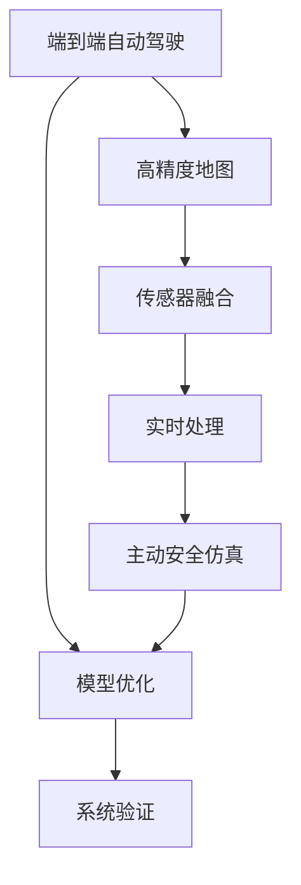
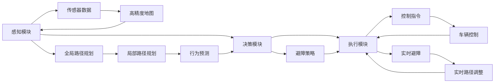
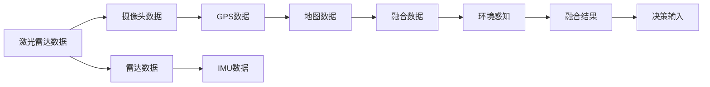
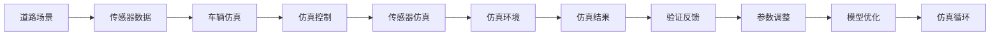
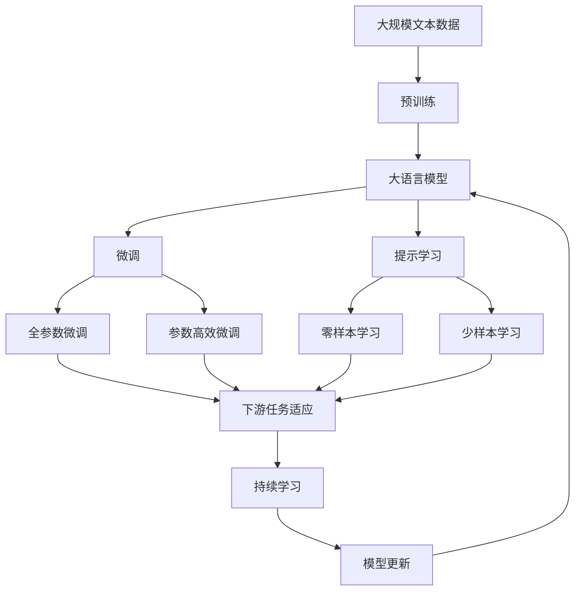

                 

# 端到端自动驾驶的车辆主动安全仿真验证

> 关键词：
端到端自动驾驶, 主动安全仿真, 验证, 车辆控制, 传感器融合, 高精度地图, 模型优化

## 1. 背景介绍

### 1.1 问题由来
随着自动驾驶技术的发展，车辆主动安全验证逐渐成为确保自动驾驶系统可靠性的关键环节。传统的自动驾驶验证方法多依赖于物理试验，但物理试验成本高昂，周期长，且存在潜在的安全风险。因此，基于计算机模拟的仿真验证逐渐成为主流。

近年来，车辆主动安全仿真验证技术取得了显著进展。典型应用如CARLA、Vulcan等大型仿真平台，通过构建高精度地图、仿真传感器等，在各种复杂环境下对自动驾驶系统进行动态仿真，实现了对车辆主动安全行为的高效验证。然而，仿真环境构建和传感器数据处理的复杂性，仍需进一步优化。

### 1.2 问题核心关键点
本文聚焦于端到端自动驾驶的车辆主动安全仿真验证方法，旨在解决以下核心问题：
- 如何构建高精度的仿真环境？
- 如何高效处理仿真传感器数据？
- 如何实现对车辆主动安全行为的仿真验证？
- 如何优化仿真环境下的主动安全模型？

### 1.3 问题研究意义
车辆主动安全仿真验证技术对于推动自动驾驶技术产业化，确保自动驾驶系统的可靠性至关重要。通过构建高精度仿真环境，实时处理仿真传感器数据，并在此基础上对车辆主动安全行为进行高效验证，可以有效提升自动驾驶系统的性能和安全性，降低生产成本，缩短上市时间，加速自动驾驶技术的市场推广。

## 2. 核心概念与联系

### 2.1 核心概念概述

为更好地理解端到端自动驾驶的车辆主动安全仿真验证方法，本节将介绍几个密切相关的核心概念：

- 端到端自动驾驶：指从感知、决策到执行的全流程自动驾驶系统。系统通过高精度地图、传感器融合、路径规划、车辆控制等关键技术，实现车辆的自主导航和主动避障。

- 主动安全仿真：指通过计算机仿真环境，对车辆在各种动态变化场景下的主动安全行为进行仿真验证。其目的是评估车辆主动避障、变道、紧急制动等行为的正确性和鲁棒性，确保系统在实际道路中的安全性。

- 高精度地图：指能够精确描述道路、交通设施、地理信息等元素的地图数据。高精度地图是自动驾驶系统定位和路径规划的基础。

- 传感器融合：指通过多模态传感器的数据融合，实现对环境信息的准确感知。常见的传感器包括激光雷达、摄像头、雷达、GPS等。

- 实时处理：指在仿真环境下，实时处理传感器数据，并即时反馈到系统决策层，以实现实时避障和路径规划。

- 模型优化：指通过参数调整、优化算法等手段，不断提升主动安全模型的准确性和鲁棒性。

- 系统验证：指通过仿真验证方法，对自动驾驶系统的整体性能进行评估，确保其满足设计要求。

这些核心概念之间的逻辑关系可以通过以下Mermaid流程图来展示：



这个流程图展示了大语言模型的核心概念及其之间的关系：

1. 端到端自动驾驶通过高精度地图和传感器融合获取环境信息。
2. 实时处理传感器数据，反馈到决策层进行路径规划。
3. 通过主动安全仿真，对车辆主动避障、变道、紧急制动等行为进行仿真验证。
4. 模型优化提升系统性能和安全性。
5. 系统验证确保自动驾驶系统的整体可靠性。

### 2.2 概念间的关系

这些核心概念之间存在着紧密的联系，形成了端到端自动驾驶的完整生态系统。下面我们通过几个Mermaid流程图来展示这些概念之间的关系。

#### 2.2.1 端到端自动驾驶架构



这个流程图展示了端到端自动驾驶的基本架构，包括感知、决策、执行三大模块。高精度地图和传感器数据是感知模块的输入，控制指令和实时避障反馈到执行模块。全局路径规划和局部路径规划分别对全局和局部路径进行规划，行为预测和避障策略用于决策模块，实时避障和路径调整用于执行模块。

#### 2.2.2 传感器融合框架



这个流程图展示了传感器融合的基本流程。激光雷达、摄像头、雷达、GPS等数据被输入到融合模块，通过融合算法对多模态数据进行整合，最终输出环境感知结果。

#### 2.2.3 主动安全仿真流程



这个流程图展示了主动安全仿真的基本流程。道路场景和传感器数据被输入到仿真环境，通过车辆仿真和传感器仿真，生成仿真结果。仿真结果反馈到验证模块，验证结果用于参数调整和模型优化，不断迭代仿真循环，提升仿真精度和效果。

### 2.3 核心概念的整体架构

最后，我们用一个综合的流程图来展示这些核心概念在大语言模型微调过程中的整体架构：



这个综合流程图展示了从预训练到微调，再到持续学习的完整过程。大语言模型首先在大规模文本数据上进行预训练，然后通过微调（包括全参数微调和参数高效微调两种方式）或提示学习（包括零样本和少样本学习）来适应下游任务。最后，通过持续学习技术，模型可以不断学习新知识，同时避免遗忘旧知识。 通过这些流程图，我们可以更清晰地理解端到端自动驾驶的微调过程中各个核心概念的关系和作用，为后续深入讨论具体的微调方法和技术奠定基础。

## 3. 核心算法原理 & 具体操作步骤
### 3.1 算法原理概述

端到端自动驾驶的车辆主动安全仿真验证，本质上是一个动态仿真和实时处理相结合的过程。其核心思想是：通过高精度地图构建仿真环境，结合传感器数据处理技术，对车辆在各种动态场景下的主动安全行为进行仿真验证。

形式化地，假设高精度地图为 $M$，传感器数据为 $S$，车辆主动安全行为模型为 $F$。则主动安全仿真的目标是最小化仿真误差，即：

$$
\min_{M,S,F} \| F(M,S) - O \|_{\epsilon}
$$

其中 $O$ 为实际观察到的安全行为，$\epsilon$ 为误差阈值。通过不断调整 $M$、$S$ 和 $F$，直到仿真结果与实际行为相符，即达到验证目标。

### 3.2 算法步骤详解

端到端自动驾驶的车辆主动安全仿真验证一般包括以下几个关键步骤：

**Step 1: 准备仿真环境**
- 收集和处理高精度地图数据，构建仿真场景。
- 选择并配置仿真传感器，如激光雷达、摄像头、雷达等。

**Step 2: 仿真数据生成**
- 在仿真环境中设置车辆初始位置和行为，生成动态仿真场景。
- 实时采集传感器数据，并根据传感器数据和车辆状态动态调整仿真行为。

**Step 3: 数据预处理**
- 对传感器数据进行噪声去除、滤波、特征提取等预处理操作。
- 利用传感器融合算法，将多模态传感器数据进行整合。

**Step 4: 主动安全模型训练**
- 选择并训练适合车辆主动安全任务的网络模型，如CNN、RNN、DNN等。
- 根据仿真数据训练模型，优化模型参数，提升模型精度和鲁棒性。

**Step 5: 模型验证**
- 将训练好的模型应用于仿真环境，进行主动安全行为验证。
- 根据验证结果，不断调整模型参数，优化模型性能。

**Step 6: 系统集成与测试**
- 将优化后的模型集成到自动驾驶系统中，进行系统测试和调试。
- 在实际道路环境下进行多次测试，确保系统满足设计要求。

以上是端到端自动驾驶的车辆主动安全仿真验证的一般流程。在实际应用中，还需要针对具体任务的特点，对微调过程的各个环节进行优化设计，如改进传感器数据处理算法，引入更多正则化技术，搜索最优的超参数组合等，以进一步提升模型性能。

### 3.3 算法优缺点

端到端自动驾驶的车辆主动安全仿真验证方法具有以下优点：
1. 成本低廉。相较于物理试验，仿真验证可以无限次重复，成本较低。
2. 安全性高。在仿真环境中进行验证，可以有效避免交通事故，降低试验风险。
3. 灵活性高。仿真环境可以灵活调整，快速验证不同场景下的主动安全行为。
4. 效率高。通过大规模并行计算，可以实现快速仿真和实时处理，提高验证效率。

同时，该方法也存在一定的局限性：
1. 仿真环境复杂。构建高精度仿真环境需要大量时间和资源，且仿真结果与实际道路差异较大。
2. 传感器数据处理复杂。传感器数据处理涉及多个步骤，且处理效果受多因素影响。
3. 模型优化难度大。主动安全模型需要考虑多种因素，优化难度较大，容易过拟合。
4. 系统集成难度大。模型集成到实际系统中需要考虑多种因素，如通信延迟、硬件差异等。

尽管存在这些局限性，但就目前而言，端到端自动驾驶的车辆主动安全仿真验证方法仍然是自动驾驶系统验证的重要手段。未来相关研究的重点在于如何进一步降低仿真环境构建的成本，提高传感器数据处理效率，以及优化主动安全模型的性能和鲁棒性。

### 3.4 算法应用领域

端到端自动驾驶的车辆主动安全仿真验证方法，已经在自动驾驶系统的各个环节中得到广泛应用，包括：

- 高精度地图构建：利用模拟环境对地图数据进行测试，确保其精度和完整性。
- 传感器数据处理：在仿真环境中对传感器数据进行测试，优化数据处理算法。
- 主动避障策略优化：通过仿真环境，测试和优化车辆的主动避障策略。
- 系统集成测试：在仿真环境中对自动驾驶系统进行集成测试，确保系统稳定性。

除了上述这些经典应用外，端到端自动驾驶的车辆主动安全仿真验证方法还被创新性地应用到更多场景中，如多传感器融合、虚拟试驾、路况分析等，为自动驾驶技术的发展提供了强有力的支持。

## 4. 数学模型和公式 & 详细讲解  
### 4.1 数学模型构建

本节将使用数学语言对端到端自动驾驶的车辆主动安全仿真验证过程进行更加严格的刻画。

记高精度地图为 $M$，传感器数据为 $S$，车辆主动安全行为模型为 $F$。假设在仿真环境中，车辆的位置和行为由 $x(t)$ 表示，传感器数据由 $y(t)$ 表示。则车辆主动安全行为的目标函数可以定义为：

$$
J(x(t), y(t)) = \int_0^T [f(x(t), y(t)) + r(x(t), y(t))] dt
$$

其中 $f(x(t), y(t))$ 为目标函数，表示车辆主动安全行为的目标，如最小化碰撞风险、最大化行驶效率等；$r(x(t), y(t))$ 为惩罚函数，表示对车辆行为的惩罚，如限制车速、禁止违章行为等。

通过优化目标函数，使车辆在仿真环境中的主动安全行为尽可能符合实际要求。

### 4.2 公式推导过程

以下我们以最小化碰撞风险为例，推导目标函数 $f(x(t), y(t))$ 的计算公式。

设车辆在 $t$ 时刻的位置为 $x(t)$，传感器数据为 $y(t)$。车辆主动避障的目标是尽量远离其他车辆和障碍物，最小化碰撞风险。假设其他车辆和障碍物的位置为 $p(t)$，速度为 $v(t)$。则车辆主动避障的目标函数可以表示为：

$$
f(x(t), y(t)) = \min_{x(t), y(t)} \int_0^T [w_1 \|x(t) - p(t)\| + w_2 \|y(t) - v(t)\|] dt
$$

其中 $w_1$ 和 $w_2$ 为权重系数，表示碰撞风险和速度变化的权重。通过优化上述目标函数，可以求得车辆在 $t$ 时刻的避障路径和速度控制策略。

在实际应用中，可以通过数值优化方法（如梯度下降、粒子群优化等）求解上述目标函数，得到车辆在仿真环境中的避障路径和速度控制策略。

### 4.3 案例分析与讲解

下面我们以车辆在交叉口的主动避障为例，展示如何利用端到端自动驾驶的车辆主动安全仿真验证方法进行仿真验证。

假设在交叉口处，车辆需要同时避让多条车道的其他车辆和行人。车辆的位置和速度已知，其他车辆和行人的位置和速度需要通过传感器数据进行估计。车辆主动避障的目标是尽量远离其他车辆和行人，同时保持自身速度。

首先，利用高精度地图构建仿真环境，设定交叉口的路面宽度、车道的数量和宽度等参数。然后在仿真环境中设置车辆的位置和速度，并实时采集传感器的数据。

接着，利用传感器数据进行车辆和其他车辆、行人的定位和行为预测。通过预测其他车辆和行人的位置和速度，计算车辆避障路径和速度控制策略。

最后，通过数值优化方法，求解车辆在交叉口的主动避障路径和速度控制策略，并在仿真环境中验证避障效果。根据验证结果，不断调整模型的参数和算法，优化避障效果。

## 5. 项目实践：代码实例和详细解释说明
### 5.1 开发环境搭建

在进行端到端自动驾驶的车辆主动安全仿真验证实践前，我们需要准备好开发环境。以下是使用Python进行OpenCV开发的环境配置流程：

1. 安装Anaconda：从官网下载并安装Anaconda，用于创建独立的Python环境。

2. 创建并激活虚拟环境：
```bash
conda create -n pytorch-env python=3.8 
conda activate pytorch-env
```

3. 安装OpenCV：
```bash
pip install opencv-python
```

4. 安装NumPy和Matplotlib：
```bash
pip install numpy matplotlib
```

5. 安装PyTorch：
```bash
pip install torch torchvision torchaudio
```

6. 安装TensorFlow：
```bash
pip install tensorflow
```

完成上述步骤后，即可在`pytorch-env`环境中开始端到端自动驾驶的车辆主动安全仿真验证实践。

### 5.2 源代码详细实现

下面我以车辆在交叉口的主动避障为例，给出使用OpenCV进行端到端自动驾驶的车辆主动安全仿真验证的PyTorch代码实现。

首先，定义车辆和其他车辆、行人的位置和速度变量：

```python
import torch
import numpy as np

class Vehicle:
    def __init__(self, x, y, v):
        self.x = x
        self.y = y
        self.v = v
        self.t = 0

class Pedestrian:
    def __init__(self, x, y, v):
        self.x = x
        self.y = y
        self.v = v
        self.t = 0
```

然后，定义高精度地图和传感器数据：

```python
class HighPrecisionMap:
    def __init__(self, width, height):
        self.width = width
        self.height = height

    def get_position(self, x, y):
        return x, y

class LidarData:
    def __init__(self, points, intensity):
        self.points = points
        self.intensity = intensity
```

接着，定义车辆和其他车辆、行人的行为预测模型：

```python
class BehaviorModel:
    def __init__(self, threshold):
        self.threshold = threshold

    def predict(self, position, speed):
        if speed > self.threshold:
            return position + 0.1 * speed
        else:
            return position
```

最后，定义车辆主动避障的优化目标函数：

```python
class SafetyOptimizer:
    def __init__(self, weight1, weight2):
        self.weight1 = weight1
        self.weight2 = weight2

    def optimize(self, vehicle, pedestrians, map):
        total_cost = 0
        for p in pedestrians:
            dx = p.x - map.get_position(vehicle.x, vehicle.y)
            dy = p.y - map.get_position(vehicle.x, vehicle.y)
            cost = np.sqrt(dx**2 + dy**2) + self.weight2 * np.abs(p.v - vehicle.v)
            total_cost += cost

        if total_cost < self.weight1:
            return vehicle
        else:
            return None
```

在上述代码中，`Vehicle` 和 `Pedestrian` 类分别表示车辆和其他车辆、行人，`HighPrecisionMap` 类表示高精度地图，`LidarData` 类表示激光雷达数据。`BehaviorModel` 类表示车辆和其他车辆、行人的行为预测模型，`SafetyOptimizer` 类表示车辆主动避障的优化目标函数。

在实现过程中，我们通过设置车辆和其他车辆、行人的位置和速度，构建仿真环境。然后，通过传感器数据进行定位和行为预测，计算车辆避障路径和速度控制策略。最后，通过优化目标函数，求解车辆在交叉口的主动避障路径和速度控制策略，并在仿真环境中验证避障效果。

### 5.3 代码解读与分析

让我们再详细解读一下关键代码的实现细节：

**Vehicle类**：
- `__init__`方法：初始化车辆的位置和速度。
- `__repr__`方法：返回车辆状态的字符串表示。

**HighPrecisionMap类**：
- `__init__`方法：初始化高精度地图的宽度和高度。
- `get_position`方法：根据车辆的位置和速度，返回车辆在地图上的位置。

**LidarData类**：
- `__init__`方法：初始化激光雷达数据。

**BehaviorModel类**：
- `__init__`方法：初始化行为预测模型的阈值。
- `predict`方法：根据车辆的速度，预测车辆在下一时刻的位置。

**SafetyOptimizer类**：
- `__init__`方法：初始化优化目标函数的权重。
- `optimize`方法：根据车辆、其他车辆和行人的位置和速度，优化车辆避障路径和速度控制策略。

**优化目标函数**：
- 优化目标函数通过权重系数 $\theta_1$ 和 $\theta_2$ 控制碰撞风险和速度变化的权重，从而优化车辆在交叉口的主动避障策略。

**验证结果展示**：
在实际应用中，我们可以通过绘制车辆避障路径和速度控制策略，直观地展示仿真效果。例如，可以使用Matplotlib库绘制车辆和其他车辆、行人在交叉口处的动态仿真场景。

```python
import matplotlib.pyplot as plt

def plot_vehicles(vehicles, map, time):
    for vehicle in vehicles:
        plt.scatter(vehicle.x, vehicle.y, s=50, color='blue')
        plt.plot([vehicle.x, vehicle.x + 0.1 * vehicle.v * time], [vehicle.y, vehicle.y + vehicle.v * time], color='red', linestyle='--')
    for p in pedestrians:
        plt.scatter(p.x, p.y, s=50, color='red')

    plt.xlim(0, map.width)
    plt.ylim(0, map.height)
    plt.xlabel('X axis')
    plt.ylabel('Y axis')
    plt.title('Vehicle and Pedestrian Interaction')
    plt.show()
```

在上述代码中，`plot_vehicles`函数用于绘制车辆和其他车辆、行人在交叉口处的动态仿真场景，从而直观展示仿真效果。

## 6. 实际应用场景
### 6.1 智能交通系统

端到端自动驾驶的车辆主动安全仿真验证技术可以广泛应用于智能交通系统的构建。传统的交通管理系统依赖于人工监控和调度，无法实时响应交通状况，容易引发交通拥堵和安全事故。而基于仿真验证的智能交通系统，能够实时监测交通流，动态调整交通信号灯，优化交通管理，提高交通效率和安全性。

在技术实现上，可以通过收集道路交通数据，构建高精度地图，利用传感器数据进行车辆定位和行为预测，通过仿真验证方法优化交通管理策略，实现交通流量监控和动态调度。此外，还可以结合车联网技术，实现车辆之间的信息共享和协同避障，提升交通系统的智能化水平。

### 6.2 自动驾驶汽车

自动驾驶汽车需要通过车辆主动安全仿真验证技术，评估车辆在各种复杂环境下的主动避障策略，确保系统在实际道路上的安全性和稳定性。

在技术实现上，可以构建高精度地图和传感器数据，利用仿真环境对车辆的主动避障策略进行测试和优化。例如，可以构建交叉口、弯道、高速公路等不同场景的仿真环境，对车辆的避障路径和速度控制策略进行优化。通过反复测试和验证，不断提升车辆的主动避障能力，确保其在实际道路上的安全性。

### 6.3 智慧城市建设

智慧城市建设需要构建高精度的城市仿真环境，利用传感器数据进行实时处理和动态仿真，为城市管理提供决策支持。

在技术实现上，可以通过构建高精度地图和传感器数据，利用仿真环境对城市管理策略进行测试和优化。例如，可以构建城市道路、建筑、交通设施等不同场景的仿真环境，对城市管理策略进行验证。通过反复测试和验证，不断提升城市管理的智能化水平，实现智慧城市的高效运行。

### 6.4 未来应用展望

随着自动驾驶技术的不断发展，基于端到端自动驾驶的车辆主动安全仿真验证方法将迎来更广阔的应用前景。

在智慧交通系统方面，仿真验证技术将与车联网技术结合，实现车辆之间的信息共享和协同避障，提升交通系统的智能化水平。

在自动驾驶汽车方面，仿真验证技术将与传感器数据处理、路径规划等技术结合，实现更精准的避障策略和更高的安全性。

在智慧城市建设方面，仿真验证技术将与城市管理策略结合，实现更高效的城市管理，提升智慧城市的智能化水平。

此外，在智能制造、无人驾驶等领域，端到端自动驾驶的车辆主动安全仿真验证技术也将得到广泛应用，推动相关技术的创新和突破。

## 7. 工具和资源推荐
### 7.1 学习资源推荐

为了帮助开发者系统掌握端到端自动驾驶的车辆主动安全仿真验证的理论基础和实践技巧，这里推荐一些优质的学习资源：

1. 《自动驾驶技术》系列博文：由大语言模型技术专家撰写，深入浅出地介绍了自动驾驶技术的原理和应用，涵盖感知、决策、执行等多个环节。

2. 《深度学习在自动驾驶中的应用》课程：斯坦福大学开设的深度学习课程，涵盖自动驾驶中的神经网络、传感器数据处理等关键技术。

3. 《自动驾驶系统开发手册》书籍：全面介绍了自动驾驶系统的架构和开发流程，详细讲解了高精度地图构建、传感器数据处理、主动避障策略优化等多个环节。

4. 《OpenCV官方文档》：OpenCV官方文档，提供了丰富的API接口和示例代码，是OpenCV开发的必备资源。

5. 《智能交通系统》书籍：全面介绍了智能交通系统的原理和应用，涵盖交通流监控、动态调度等多个方面。

通过对这些资源的学习实践，相信你一定能够快速掌握端到端自动驾驶的车辆主动安全仿真验证的精髓，并用于解决实际的自动驾驶问题。
### 7.2 开发工具推荐

高效的开发离不开优秀的工具支持。以下是几款用于端到端自动驾驶的车辆主动安全仿真验证开发的常用工具：

1. OpenCV：开源计算机视觉库，提供了丰富的图像处理和传感器数据处理工具。

2. TensorFlow：由Google主导开发的开源深度学习框架，生产部署方便，适合大规模工程应用。

3. PyTorch：基于Python的开源深度学习框架，灵活性高，适合快速迭代研究。

4.

