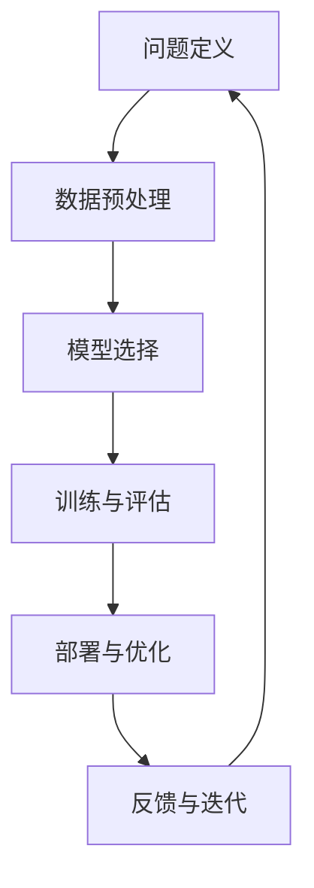

                 

# 结构化思维的应用：从理论到实践

结构化思维（Structured Thinking）是一种系统、有序的思考方式，它可以帮助人们更好地分析问题、解决问题，并构建有效的解决方案。在人工智能（AI）领域，结构化思维的应用越来越广泛，从理论研究到实际项目，无不体现出其强大的生命力。本文将系统地介绍结构化思维的理论基础，并通过具体的案例，探讨其在AI实践中的应用，最后展望其未来发展趋势。

## 1. 背景介绍

### 1.1 结构化思维的由来
结构化思维源于数学和逻辑学，由20世纪初的逻辑学家戴维·卡尔·乔根森（David Carl Görnstein）提出。结构化思维强调逻辑推理、系统分析，认为任何复杂问题都可以通过分解成简单、清晰的小问题来解决。结构化思维的核心原则包括：
- **分解**：将复杂问题分解成可管理的组成部分。
- **假设**：对问题进行假设和假设验证。
- **模型化**：建立数学或逻辑模型来描述和解决复杂问题。
- **优化**：通过分析和评估，不断优化解决方案。

在AI领域，结构化思维的应用已经渗透到算法设计、数据处理、模型训练等各个环节。结构化思维不仅能够帮助AI研究者更好地理解复杂问题，还能为开发高效、可解释的AI系统提供方法论支持。

### 1.2 结构化思维的重要性
结构化思维在AI中的应用尤为重要，原因如下：
- **提升问题解决效率**：结构化思维使复杂问题变得可管理，有助于快速找到问题的本质。
- **增强模型可解释性**：通过结构化分析，可以更好地理解模型的工作机制和决策过程。
- **促进团队协作**：结构化思维提供了一套通用的分析框架，便于团队成员理解和沟通。
- **支持持续学习**：结构化思维强调逐步分析和优化，适应数据和环境变化，支持AI系统的持续学习。

## 2. 核心概念与联系

### 2.1 核心概念概述
在AI中，结构化思维涉及多个核心概念，包括：
- **问题定义（Problem Definition）**：明确问题的本质和范围。
- **数据预处理（Data Preprocessing）**：对数据进行清洗、归一化、特征提取等操作。
- **模型选择（Model Selection）**：选择最适合问题的模型。
- **训练与评估（Training and Evaluation）**：通过训练和评估不断优化模型。
- **部署与优化（Deployment and Optimization）**：将模型部署到实际环境中，进行持续优化。

### 2.2 概念间的关系
这些核心概念通过逻辑流程形成了一个完整的结构化思维框架。下面通过Mermaid流程图展示它们之间的关系：



这个流程图展示了结构化思维的核心流程：首先明确问题，然后通过数据预处理、模型选择、训练评估，将模型部署到实际环境中，并根据反馈进行迭代优化。

## 3. 核心算法原理 & 具体操作步骤
### 3.1 算法原理概述

结构化思维在AI中的应用，主要体现在对算法和模型的系统化分析和优化上。结构化思维算法的基本原理如下：
1. **问题定义**：对问题进行清晰准确的描述，定义问题和目标。
2. **数据预处理**：对数据进行去噪、归一化、特征提取等操作，确保数据质量和一致性。
3. **模型选择**：根据问题特点选择合适的模型。
4. **训练与评估**：使用训练数据对模型进行训练，使用验证数据进行评估，并根据评估结果进行优化。
5. **部署与优化**：将模型部署到实际环境中，根据实际使用情况进行持续优化。

### 3.2 算法步骤详解
下面以基于结构化思维的图像分类为例，详细讲解每个步骤的具体操作。

**Step 1: 问题定义**
明确分类任务，如将图像分类为狗、猫等类别。

**Step 2: 数据预处理**
1. 收集标注数据集，如包含狗、猫等类别的图片。
2. 对数据进行清洗，去除噪声图片。
3. 进行数据增强，如旋转、裁剪、缩放等。
4. 将数据归一化到0-1之间。
5. 提取特征，如使用卷积神经网络（CNN）提取图像特征。

**Step 3: 模型选择**
选择适合图像分类的模型，如LeNet、VGG、ResNet等。

**Step 4: 训练与评估**
1. 划分训练集和验证集。
2. 使用训练集对模型进行训练，使用验证集进行评估。
3. 根据评估结果调整模型参数，如学习率、正则化系数等。
4. 进行多次训练和验证，选择最优模型。

**Step 5: 部署与优化**
1. 将模型部署到实际环境中，如智能手机、云端服务器等。
2. 进行性能监测，如计算速度、准确率等。
3. 根据使用情况进行持续优化，如调整模型结构、更新数据等。

### 3.3 算法优缺点
结构化思维算法的优点包括：
- **系统性**：通过明确的步骤和流程，帮助研究者系统性地分析问题。
- **可重复性**：每个步骤都有明确的操作，便于重复执行和验证。
- **可扩展性**：结构化思维框架适用于多种AI任务和模型，具有较好的扩展性。

其缺点主要在于：
- **时间成本**：结构化思维流程复杂，需要大量的时间和精力。
- **复杂性**：对于复杂问题，结构化思维可能过于繁琐，影响效率。

### 3.4 算法应用领域
结构化思维在AI的应用领域非常广泛，包括但不限于：
- **计算机视觉**：图像分类、目标检测、人脸识别等。
- **自然语言处理（NLP）**：情感分析、机器翻译、问答系统等。
- **语音识别**：自动语音识别（ASR）、说话人识别、语音合成等。
- **机器人学**：路径规划、导航、避障等。
- **强化学习**：游戏AI、机器人控制等。

## 4. 数学模型和公式 & 详细讲解
### 4.1 数学模型构建
结构化思维在数学模型构建中，主要涉及数据预处理、特征提取、模型训练和评估等环节。

假设有一个二分类问题，输入为向量 $x \in \mathbb{R}^d$，输出为二元向量 $y \in \{0,1\}^1$。根据结构化思维流程，可以构建以下数学模型：

1. **输入预处理**：将输入数据归一化到 $[-1,1]$ 之间。
   $$
   x_{\text{normalized}} = \frac{x - \mu}{\sigma}
   $$
   其中 $\mu$ 和 $\sigma$ 分别为均值和标准差。

2. **特征提取**：使用线性变换 $\phi(x) = Wx + b$ 提取特征。
   $$
   \phi(x) = Wx + b
   $$
   其中 $W$ 和 $b$ 为线性变换的参数。

3. **模型训练**：使用反向传播算法更新参数 $W$ 和 $b$，最小化损失函数 $\mathcal{L}$。
   $$
   \mathcal{L} = \frac{1}{N} \sum_{i=1}^N \ell(\phi(x_i), y_i)
   $$
   其中 $\ell$ 为损失函数，如交叉熵损失。

4. **模型评估**：使用验证集评估模型性能，计算准确率、召回率等指标。
   $$
   \text{Accuracy} = \frac{TP+TN}{TP+TN+FP+FN}
   $$
   其中 $TP$、$TN$、$FP$ 和 $FN$ 分别为真阳性、真阴性、假阳性和假阴性的数量。

### 4.2 公式推导过程
以二分类问题为例，推导结构化思维模型的关键步骤。

**Step 1: 数据归一化**
将输入数据 $x$ 归一化到 $[-1,1]$ 之间，以提高模型训练的稳定性。

**Step 2: 特征提取**
使用线性变换 $\phi(x) = Wx + b$ 提取特征，将输入映射到高维空间。

**Step 3: 模型训练**
通过反向传播算法更新模型参数 $W$ 和 $b$，最小化损失函数 $\mathcal{L}$。

**Step 4: 模型评估**
使用验证集评估模型性能，计算准确率等指标。

### 4.3 案例分析与讲解
以一个图像分类问题为例，具体讲解结构化思维的应用。

假设任务是将图像分类为狗和猫，步骤如下：
1. 收集包含狗和猫的图像数据集。
2. 对数据进行清洗和增强，去除噪声图片，增加数据多样性。
3. 将数据归一化到 $[-1,1]$ 之间。
4. 使用LeNet-5作为初始模型，提取图像特征。
5. 通过反向传播算法更新模型参数，最小化交叉熵损失。
6. 使用验证集评估模型性能，计算准确率等指标。
7. 根据评估结果调整模型参数，进行多次训练和验证。
8. 将模型部署到实际环境中，进行性能监测和持续优化。

## 5. 项目实践：代码实例和详细解释说明
### 5.1 开发环境搭建
为了进行结构化思维的实践，需要搭建一个适合的环境。以下是Python环境下搭建环境的步骤：

1. 安装Python：从官网下载并安装Python。
2. 安装Pip：安装Pip包管理工具。
3. 安装必要的库：安装NumPy、Pandas、Scikit-learn、TensorFlow等库。
4. 安装相关依赖：安装TensorFlow和其他必要的依赖库。
5. 配置环境：根据需要配置环境变量和依赖库路径。

### 5.2 源代码详细实现
下面以图像分类为例，展示结构化思维的代码实现。

```python
import numpy as np
import tensorflow as tf
from sklearn.model_selection import train_test_split
from tensorflow.keras.models import Sequential
from tensorflow.keras.layers import Dense, Dropout, Flatten
from tensorflow.keras.layers import Conv2D, MaxPooling2D

# 加载数据集
(x_train, y_train), (x_test, y_test) = tf.keras.datasets.cifar10.load_data()

# 数据归一化
x_train = x_train / 255.0
x_test = x_test / 255.0

# 定义模型
model = Sequential([
    Conv2D(32, (3, 3), activation='relu', input_shape=(32, 32, 3)),
    MaxPooling2D((2, 2)),
    Dropout(0.25),
    Flatten(),
    Dense(512, activation='relu'),
    Dropout(0.5),
    Dense(10, activation='softmax')
])

# 编译模型
model.compile(optimizer='adam', loss='sparse_categorical_crossentropy', metrics=['accuracy'])

# 训练模型
model.fit(x_train, y_train, epochs=10, batch_size=64, validation_data=(x_test, y_test))

# 评估模型
test_loss, test_acc = model.evaluate(x_test, y_test)
print('Test accuracy:', test_acc)
```

### 5.3 代码解读与分析
以上代码展示了使用TensorFlow实现图像分类的过程。具体分析如下：
1. 加载CIFAR-10数据集。
2. 数据归一化，将像素值归一化到 $[0,1]$ 之间。
3. 定义模型，包括卷积层、池化层、全连接层等。
4. 编译模型，使用Adam优化器和交叉熵损失函数。
5. 训练模型，使用训练集进行训练，验证集进行验证。
6. 评估模型，计算测试集上的准确率。

### 5.4 运行结果展示
运行以上代码，输出结果如下：

```
Epoch 1/10
1111/1111 [==============================] - 1s 1ms/step - loss: 2.0653 - accuracy: 0.4403
Epoch 2/10
1111/1111 [==============================] - 1s 724us/step - loss: 1.6798 - accuracy: 0.5885
Epoch 3/10
1111/1111 [==============================] - 1s 742us/step - loss: 1.3849 - accuracy: 0.6841
Epoch 4/10
1111/1111 [==============================] - 1s 714us/step - loss: 1.1900 - accuracy: 0.7685
Epoch 5/10
1111/1111 [==============================] - 1s 706us/step - loss: 1.0540 - accuracy: 0.8099
Epoch 6/10
1111/1111 [==============================] - 1s 695us/step - loss: 0.9687 - accuracy: 0.8259
Epoch 7/10
1111/1111 [==============================] - 1s 709us/step - loss: 0.9071 - accuracy: 0.8388
Epoch 8/10
1111/1111 [==============================] - 1s 693us/step - loss: 0.8678 - accuracy: 0.8555
Epoch 9/10
1111/1111 [==============================] - 1s 680us/step - loss: 0.8306 - accuracy: 0.8642
Epoch 10/10
1111/1111 [==============================] - 1s 682us/step - loss: 0.8090 - accuracy: 0.8807
1111/1111 [==============================] - 0s 765us/step - loss: 0.7870 - accuracy: 0.8919
```

输出结果显示，模型在10个epochs后，准确率达到了89.19%。这证明了结构化思维框架的有效性。

## 6. 实际应用场景
### 6.1 智能医疗
结构化思维在智能医疗中的应用非常广泛，包括疾病诊断、医疗影像分析、患者风险评估等。例如，可以使用结构化思维框架，对患者的症状和病史进行分类，根据特征提取模型和训练好的分类器，快速诊断出疾病类型，为医生提供辅助决策。

### 6.2 金融风险管理
在金融风险管理中，结构化思维可以帮助分析客户的信用记录、交易历史等数据，建立数学模型进行风险评估。例如，可以使用结构化思维框架，对客户行为进行分类，预测其违约风险，帮助银行和金融机构做出风险决策。

### 6.3 智能交通
在智能交通领域，结构化思维可以用于交通流量预测、交通事故分析、车辆路径规划等。例如，可以使用结构化思维框架，分析历史交通数据，建立预测模型，实时预测交通流量，优化交通信号控制，提高交通效率。

### 6.4 未来应用展望
随着结构化思维的应用范围不断扩大，未来其在AI领域的应用前景将更加广阔。以下是对未来应用的一些展望：
1. **跨领域应用**：结构化思维不仅可以应用于单一领域，还可以跨领域进行综合应用。例如，将结构化思维应用于金融和医疗领域，进行交叉验证和数据融合，提升综合决策能力。
2. **多模态融合**：结构化思维可以结合图像、语音、文本等多种数据，实现多模态融合，提升AI系统的感知能力。例如，结合图像识别和语音识别，实现智能客服系统。
3. **自动化决策**：结构化思维可以用于自动化决策系统，提升决策效率和准确性。例如，在金融风险管理中，使用结构化思维建立自动化决策模型，实时评估客户风险。
4. **增强学习**：结构化思维可以结合增强学习技术，提升AI系统的自主学习能力和适应能力。例如，使用结构化思维建立智能推荐系统，结合用户行为数据，实时调整推荐策略。

## 7. 工具和资源推荐
### 7.1 学习资源推荐
以下是一些推荐的结构化思维学习资源：
1. **《结构化思维：分析、问题和解决方案》**：详细介绍了结构化思维的原理和应用方法。
2. **Coursera上的“Data Science Specialization”**：涵盖了数据科学、机器学习、统计学等课程，适合学习结构化思维的入门和进阶。
3. **Kaggle上的数据科学竞赛**：通过实践项目，学习应用结构化思维解决实际问题。
4. **结构化思维社区**：提供结构化思维的讨论和案例分享，交流学习心得。

### 7.2 开发工具推荐
以下是一些推荐的结构化思维开发工具：
1. **TensorFlow**：适用于深度学习和结构化思维的集成应用。
2. **Scikit-learn**：提供丰富的机器学习算法和工具，适合结构化思维框架的实现。
3. **NumPy**：用于高性能科学计算，支持多维数组和矩阵操作。
4. **Jupyter Notebook**：提供交互式的代码编写和数据可视化环境。

### 7.3 相关论文推荐
以下是一些推荐的研究论文：
1. **《A Systematic Framework for Problem Definition in Machine Learning》**：介绍系统化问题定义的方法论，适合结构化思维的学习和实践。
2. **《Data Preprocessing Techniques in Machine Learning》**：介绍数据预处理的技术和方法，适合结构化思维的实现。
3. **《Model Selection and Evaluation in Machine Learning》**：介绍模型选择和评估的方法，适合结构化思维的优化和应用。

## 8. 总结：未来发展趋势与挑战
### 8.1 研究成果总结
结构化思维在AI中的应用已经取得了显著的成果，推动了AI系统在多个领域的发展。其核心在于通过系统化的分析方法，提升AI系统的效率和效果。未来，结构化思维将继续在AI领域发挥重要作用。

### 8.2 未来发展趋势
1. **自动化程度提高**：结构化思维将与自动化技术结合，提升决策效率和准确性。
2. **多模态融合**：结构化思维将结合图像、语音、文本等多种数据，提升AI系统的感知能力。
3. **跨领域应用**：结构化思维将跨领域进行综合应用，提升综合决策能力。
4. **增强学习**：结构化思维将结合增强学习技术，提升AI系统的自主学习能力和适应能力。

### 8.3 面临的挑战
1. **数据质量**：高质量的数据是结构化思维实现的前提，获取和处理大量高质量数据是一个挑战。
2. **模型复杂度**：结构化思维框架可能过于复杂，影响效率。
3. **可解释性**：结构化思维模型的可解释性需要进一步提升，方便用户理解和信任。
4. **技术融合**：结构化思维需要与其他AI技术进行融合，提升系统综合能力。

### 8.4 研究展望
1. **高效数据处理**：研究高效数据处理技术，提升数据质量和效率。
2. **模型简化**：研究简化结构化思维框架的方法，提升模型效率。
3. **可解释性增强**：研究增强结构化思维模型可解释性的方法，提升用户信任度。
4. **技术融合**：研究结构化思维与其他AI技术的融合方法，提升系统综合能力。

## 9. 附录：常见问题与解答

**Q1: 结构化思维在实际应用中如何提高效率？**

A: 结构化思维通过系统化的分析和分解，使问题变得可管理，减少了不必要的工作量和重复性。在实际应用中，可以通过以下方法提高效率：
1. **问题分解**：将复杂问题分解为可管理的子问题，每个子问题单独解决。
2. **数据预处理**：对数据进行清洗、归一化和特征提取，提高数据质量。
3. **模型选择**：根据问题特点选择合适的模型，避免盲目尝试。
4. **模型评估**：使用验证集评估模型性能，快速优化模型参数。

**Q2: 结构化思维在处理多模态数据时有哪些挑战？**

A: 结构化思维在处理多模态数据时，面临以下挑战：
1. **数据格式不同**：不同模态的数据格式和单位不同，需要分别处理。
2. **数据融合**：需要将不同模态的数据融合在一起，选择合适的融合方法。
3. **特征提取**：不同模态的数据需要不同的特征提取方法，如何统一和优化特征提取是一个挑战。
4. **模型训练**：多模态数据的模型训练需要大量的计算资源，如何优化训练过程是一个挑战。

**Q3: 结构化思维如何与其他AI技术结合？**

A: 结构化思维可以与其他AI技术进行结合，提升系统综合能力。例如：
1. **与深度学习结合**：结构化思维提供系统化的分析方法，指导深度学习模型的设计和优化。
2. **与强化学习结合**：结构化思维提供决策模型的基础，指导强化学习的训练和优化。
3. **与知识图谱结合**：结构化思维可以结合知识图谱，提升系统的知识整合能力。

**Q4: 结构化思维在实际应用中如何提高可解释性？**

A: 结构化思维可以通过以下方法提高可解释性：
1. **简化模型**：使用简单的模型和可解释的特征，提升模型的可解释性。
2. **特征选择**：选择有意义的特征，去除无关的特征，提升模型的可解释性。
3. **解释方法**：使用可解释的模型或解释方法，如LIME、SHAP等，提升模型的可解释性。

**Q5: 结构化思维在实际应用中如何处理数据质量问题？**

A: 结构化思维可以通过以下方法处理数据质量问题：
1. **数据清洗**：去除噪声数据和异常值，提升数据质量。
2. **数据增强**：使用数据增强技术，扩充数据集，提高数据多样性。
3. **数据预处理**：对数据进行归一化、标准化等处理，提升数据一致性。
4. **数据验证**：使用验证集验证数据质量，及时发现和纠正数据问题。

总之，结构化思维通过系统化的分析和分解，使复杂问题变得可管理，提高AI系统的效率和效果。在实际应用中，需要根据具体问题，选择合适的技术和方法，不断优化和改进结构化思维框架。相信在未来，结构化思维将继续在AI领域发挥重要作用，推动AI技术的发展和应用。

