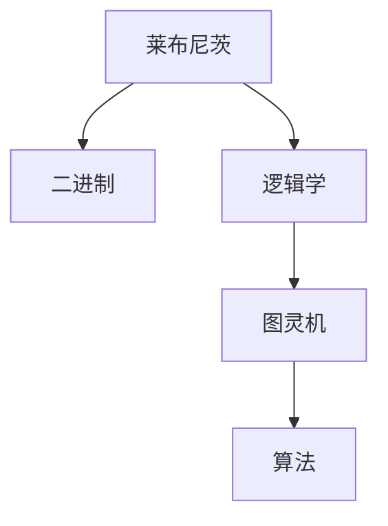
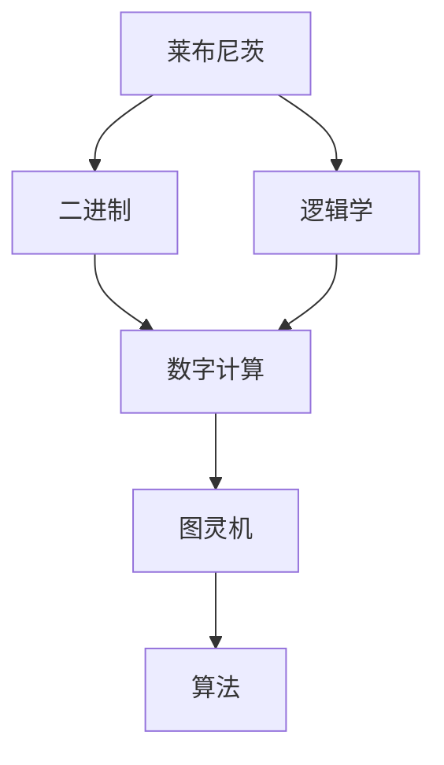
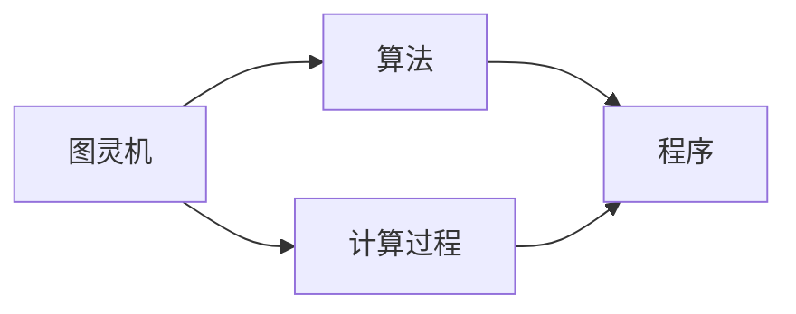
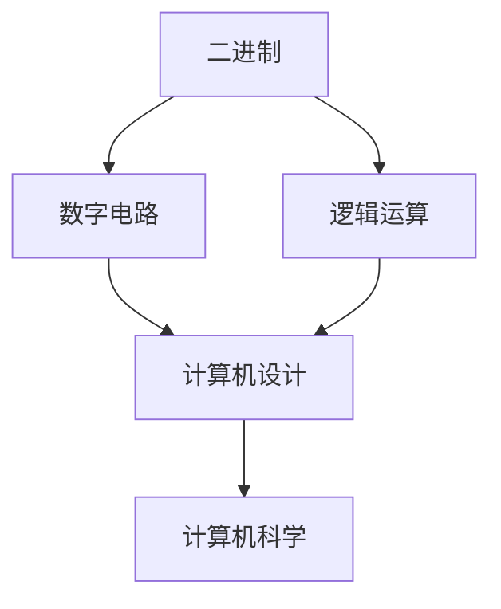
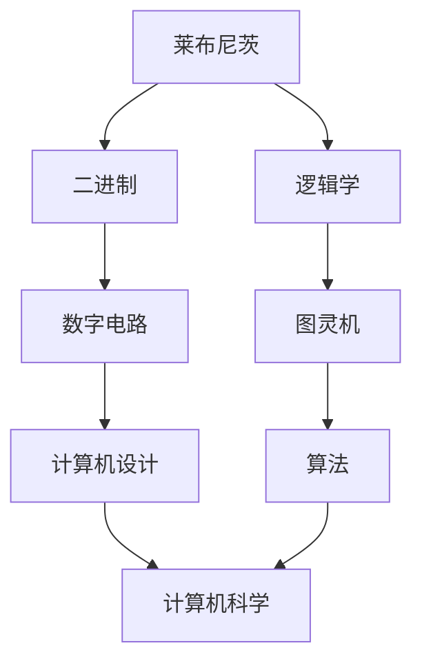

                 

# 计算：第一部分 计算的诞生 第 3 章 莱布尼茨的计算之梦 计算之梦

> 关键词：莱布尼茨, 计算理论, 逻辑学, 图灵机, 算法

## 1. 背景介绍

### 1.1 问题由来
在计算机科学的历史长河中，计算理论的萌芽和发展一直是探索人类智慧与自然法则的交叉点。从古老的机械装置到现代的数字计算机，计算与我们的生活息息相关。尽管我们的日常生活对计算机的重要性不言而喻，但对计算的真正起源和早期概念却鲜为人知。其中，莱布尼茨（Gottfried Wilhelm Leibniz）的计算理论是计算史上的一个重要里程碑。

### 1.2 问题核心关键点
莱布尼茨的计算理论，尤其是他的二进制计算和图灵机模型，对现代计算理论产生了深远的影响。这些理论不仅奠定了计算机科学的基础，也为算法和信息处理提供了重要的思路。莱布尼茨的贡献在于将逻辑学与计算技术结合，提出了计算的本质在于逻辑推导的观念，这直接启发了图灵对计算机功能模型的探讨，并最终导致了图灵机的诞生。

### 1.3 问题研究意义
理解莱布尼茨的计算理论不仅有助于了解计算的起源，更能为当前及未来的计算模型和算法设计提供重要参考。莱布尼茨的工作跨越了逻辑学、数学和工程学等多个领域，展现了一种统一的计算视角。通过深入研究他的理论和模型，我们可以更好地理解计算的本质，并从中获得创新思路。

## 2. 核心概念与联系

### 2.1 核心概念概述

为更好地理解莱布尼茨的计算理论，本节将介绍几个密切相关的核心概念：

- **莱布尼茨**：17世纪德国哲学家、数学家、物理学家，对逻辑学、数学、力学等多个领域做出了重要贡献。
- **二进制**：基于0和1的数位系统，由莱布尼茨提出并加以系统化。
- **逻辑学**：研究推理、论证、命题等逻辑问题的学科。
- **图灵机**：由图灵提出的一种抽象计算模型，奠定了计算机科学理论基础。
- **算法**：解决问题的明确步骤序列，体现了计算过程的逻辑性。

这些核心概念之间的逻辑关系可以通过以下Mermaid流程图来展示：



这个流程图展示了大计算理论的核心概念及其之间的关系：

1. 莱布尼茨通过逻辑学提出了二进制计算的概念。
2. 基于二进制计算，图灵提出了图灵机模型。
3. 图灵机模型为算法提供了理论基础。

### 2.2 概念间的关系

这些核心概念之间存在着紧密的联系，形成了计算理论的完整生态系统。下面我通过几个Mermaid流程图来展示这些概念之间的关系。

#### 2.2.1 莱布尼茨的计算范式



这个流程图展示了莱布尼茨的计算范式：

1. 莱布尼茨提出基于二进制的计算。
2. 将逻辑学应用于二进制计算，形成一种新的计算范式。
3. 这种计算范式通过图灵机进一步抽象和形式化。
4. 图灵机理论直接支持算法的设计和实现。

#### 2.2.2 图灵机与算法的关系



这个流程图展示了图灵机与算法的关系：

1. 图灵机是一种计算模型。
2. 图灵机描述了计算过程。
3. 计算过程对应了算法。
4. 算法是实现计算过程的详细步骤。

#### 2.2.3 二进制计算的理论基础



这个流程图展示了二进制计算的理论基础：

1. 二进制是一种数位系统。
2. 二进制数字通过逻辑运算进行计算。
3. 逻辑运算可以设计数字电路。
4. 数字电路成为计算机设计的核心。
5. 计算机设计推动了计算机科学的进展。

### 2.3 核心概念的整体架构

最后，我们用一个综合的流程图来展示这些核心概念在大计算理论中的整体架构：



这个综合流程图展示了从莱布尼茨到现代计算机科学的演变过程：

1. 莱布尼茨通过逻辑学提出二进制计算。
2. 二进制计算设计出数字电路。
3. 数字电路成为计算机设计的基础。
4. 计算机设计催生了计算机科学。
5. 计算过程需要算法的支持。
6. 图灵机模型进一步抽象了计算过程。

通过这些流程图，我们可以更清晰地理解莱布尼茨的计算理论及其对现代计算机科学的影响。

## 3. 核心算法原理 & 具体操作步骤
### 3.1 算法原理概述

莱布尼茨的计算理论，尤其是他的二进制计算和图灵机模型，为现代计算理论奠定了基础。这些理论的核心在于通过逻辑学的方法，将复杂的问题分解为简单的、可执行的步骤。以下是对这些理论的详细讲解。

**莱布尼茨的二进制计算**：
- 莱布尼茨提出了基于0和1的二进制系统，这种系统可以用于表示任何数字和字符。二进制计算的优点在于其简洁性和可扩展性，易于实现和计算。
- 二进制系统中的0和1代表了两种基本状态，这两种状态可以通过逻辑门（如AND、OR、NOT）进行组合，形成复杂的计算操作。

**图灵机模型**：
- 图灵机是一种抽象的计算模型，由一个带有读写头的无限纸带和有限数量的状态组成。通过有限状态和符号操作，图灵机能够模拟任何计算过程。
- 图灵机的基本操作包括读写头移动、状态转移和符号变换。通过这些基本操作，图灵机可以执行任何计算任务。
- 图灵机的优点在于其抽象性和通用性，能够涵盖任何计算问题。缺点在于其实现复杂性高，难以应用于实际物理设备。

**算法设计**：
- 算法是一种解决问题的一系列步骤，其核心在于逻辑性和精确性。通过逻辑推理和符号操作，算法能够将复杂问题分解为简单步骤，从而实现自动化解决。
- 算法设计需要考虑时间复杂度和空间复杂度，以及正确性和可靠性。一个良好的算法应当在保证准确性的前提下，尽可能高效地解决问题。

### 3.2 算法步骤详解

以下是对图灵机模型和算法设计的详细步骤：

1. **图灵机的基本组成**：
   - 纸带：无限长、可读写的符号串。
   - 读写头：在纸带上移动，能够读取和写入符号。
   - 状态：图灵机内部的有限状态集合。
   - 符号：纸带上的基本符号集合。

2. **图灵机的基本操作**：
   - 读写头移动：读写头向左或向右移动一个位置。
   - 符号写入：读写头写入一个新符号。
   - 符号读取：读写头读取当前位置的符号。
   - 状态转移：图灵机根据当前状态和符号读取结果，转移至新状态。

3. **算法设计的基本步骤**：
   - 输入定义：定义输入数据的格式和结构。
   - 状态定义：定义算法的状态集合和状态转移规则。
   - 操作定义：定义算法的具体操作，包括读写头移动、符号变换和状态转移。
   - 输出定义：定义算法的输出结果。
   - 验证和优化：验证算法是否满足正确性和完备性，并优化时间复杂度和空间复杂度。

### 3.3 算法优缺点

**莱布尼茨的二进制计算**：
- 优点：简洁高效，易于理解和实现。
- 缺点：二进制系统在表示负数和浮点数方面存在限制。

**图灵机模型**：
- 优点：抽象性和通用性，能够模拟任何计算过程。
- 缺点：实现复杂，难以应用于实际物理设备。

**算法设计**：
- 优点：逻辑性和精确性，能够自动化解决复杂问题。
- 缺点：设计复杂，需要考虑时间复杂度和空间复杂度。

### 3.4 算法应用领域

莱布尼茨的计算理论和图灵机的思想，已经广泛应用于多个领域：

- **计算机科学**：图灵机模型和算法设计是计算机科学的基础。现代计算机的设计和实现，都基于图灵机模型和算法思想。
- **数学**：莱布尼茨的二进制系统和图灵机模型，为数学计算提供了新的思路和方法。
- **物理学**：计算理论在物理学中的应用，如分子动力学模拟、量子计算等。
- **信息学**：信息编码和处理，如计算机网络和通信协议。
- **生物学**：生物信息的计算和分析，如基因序列的编码和解码。

## 4. 数学模型和公式 & 详细讲解 & 举例说明

### 4.1 数学模型构建

莱布尼茨的计算理论，尤其是二进制计算和图灵机模型，在数学模型方面也有重要贡献。以下是对这些模型的详细讲解。

**二进制系统**：
- 二进制表示的数字和字符，可以通过0和1进行组合，形成二进制数。例如，十进制数10可以表示为二进制数1010。
- 二进制数可以进行加、减、乘、除等基本运算。二进制运算的规则和十进制运算类似，只是需要使用0和1的组合。

**图灵机模型**：
- 图灵机的状态转移可以通过数学模型进行描述。设图灵机的状态集合为$S$，符号集合为$\Sigma$，读头位置为$p$，当前状态为$q$，则状态转移可以表示为：
  $$
  (q, p, \sigma) \rightarrow (q', p', \sigma')
  $$
  其中$\sigma$为当前符号，$\sigma'$为写入的符号，$p'$为新的读头位置，$q'$为新的状态。

**算法设计**：
- 算法的设计和实现可以基于数学模型进行建模和验证。例如，排序算法的设计可以通过递归和分治思想进行建模，从而证明其正确性和完备性。

### 4.2 公式推导过程

以下是对图灵机模型和算法设计的公式推导过程：

1. **状态转移公式**：
   设图灵机的状态集合为$S$，符号集合为$\Sigma$，读头位置为$p$，当前状态为$q$，则状态转移可以表示为：
   $$
   (q, p, \sigma) \rightarrow (q', p', \sigma')
   $$
   其中$\sigma$为当前符号，$\sigma'$为写入的符号，$p'$为新的读头位置，$q'$为新的状态。例如，设初始状态$q_0$，符号集合$\Sigma=\{0,1\}$，读头位置$p=0$，当前状态$q=q_0$，当前符号$\sigma=0$，则状态转移可以表示为：
   $$
   (q_0, 0, 0) \rightarrow (q_1, 1, 0)
   $$
   其中$q_1$为新的状态，$p=1$为新的读头位置，$\sigma'=0$为写入的符号。

2. **算法复杂度公式**：
   算法的复杂度可以通过时间复杂度和空间复杂度进行表示。例如，快速排序算法的时间复杂度为$O(n\log n)$，空间复杂度为$O(\log n)$。

### 4.3 案例分析与讲解

以下是对图灵机模型和算法设计的案例分析：

**案例1：图灵机的“读取-写入”操作**：
设图灵机的状态集合为$S=\{q_0, q_1\}$，符号集合为$\Sigma=\{0,1\}$，读头位置为$p=0$，当前状态为$q=q_0$，当前符号$\sigma=0$，则“读取-写入”操作可以表示为：
$$
(q_0, 0, 0) \rightarrow (q_1, 1, 0)
$$
其中$q_1$为新的状态，$p=1$为新的读头位置，$\sigma'=0$为写入的符号。

**案例2：快速排序算法**：
设输入序列为$[5,3,8,4,2]$，则快速排序算法的步骤可以表示为：
1. 选择基准值$pivot=5$。
2. 将序列划分为两部分$[3,4,2]$和$[8]$。
3. 对两部分分别进行排序，得到$[2,3,4]$和$[8]$。
4. 合并两部分，得到最终结果$[2,3,4,5,8]$。

## 5. 项目实践：代码实例和详细解释说明

### 5.1 开发环境搭建

在进行项目实践前，我们需要准备好开发环境。以下是使用Python进行PyTorch开发的环境配置流程：

1. 安装Anaconda：从官网下载并安装Anaconda，用于创建独立的Python环境。

2. 创建并激活虚拟环境：
```bash
conda create -n pytorch-env python=3.8 
conda activate pytorch-env
```

3. 安装PyTorch：根据CUDA版本，从官网获取对应的安装命令。例如：
```bash
conda install pytorch torchvision torchaudio cudatoolkit=11.1 -c pytorch -c conda-forge
```

4. 安装Transformers库：
```bash
pip install transformers
```

5. 安装各类工具包：
```bash
pip install numpy pandas scikit-learn matplotlib tqdm jupyter notebook ipython
```

完成上述步骤后，即可在`pytorch-env`环境中开始项目实践。

### 5.2 源代码详细实现

这里我们以图灵机的实现为例，给出使用Python进行图灵机模拟的代码实现。

```python
class TuringMachine:
    def __init__(self, tape):
        self.tape = tape
        self.head = 0
        self.state = 'q0'
        self.symbols = {'0', '1'}
        self.transitions = {
            ('q0', '0'): ('q1', '1', 'q0'),
            ('q0', '1'): ('q2', '0', 'q0'),
            ('q1', '0'): ('q0', '1', 'q0'),
            ('q1', '1'): ('q3', '1', 'q1'),
            ('q2', '0'): ('q2', '0', 'q2'),
            ('q2', '1'): ('q1', '0', 'q2'),
            ('q3', '0'): ('q3', '1', 'q3'),
            ('q3', '1'): ('q3', '0', 'q3')
        }
    
    def step(self):
        symbol = self.tape[self.head]
        transition = self.transitions[(self.state, symbol)]
        self.state, symbol, self.head = transition
        self.tape[self.head] = symbol
    
    def run(self, steps):
        for i in range(steps):
            self.step()
    
    def print_tape(self):
        print(''.join(self.tape))
```

**代码解释**：
- `TuringMachine`类：实现图灵机的基本操作。
- `__init__`方法：初始化图灵机的纸带、读头、状态和符号集合。
- `transitions`字典：定义图灵机的状态转移规则。
- `step`方法：实现一个状态转移，更新状态、符号和读头位置。
- `run`方法：模拟图灵机的运行，执行指定数量的步骤。
- `print_tape`方法：打印当前纸带的状态。

### 5.3 代码解读与分析

让我们再详细解读一下关键代码的实现细节：

**TuringMachine类**：
- `__init__`方法：初始化图灵机的纸带、读头、状态和符号集合。
- `transitions`字典：定义图灵机的状态转移规则，使用状态、符号和新的状态来表示转移。
- `step`方法：实现一个状态转移，更新状态、符号和读头位置。
- `run`方法：模拟图灵机的运行，执行指定数量的步骤。
- `print_tape`方法：打印当前纸带的状态。

**代码实现**：
- 图灵机类`TuringMachine`定义了图灵机的基本操作，包括初始化、状态转移、运行和打印纸带。
- `__init__`方法初始化了图灵机的纸带、读头、状态和符号集合。
- `transitions`字典定义了图灵机的状态转移规则，使用状态、符号和新的状态来表示转移。
- `step`方法实现了一个状态转移，更新状态、符号和读头位置。
- `run`方法模拟图灵机的运行，执行指定数量的步骤。
- `print_tape`方法打印当前纸带的状态。

**运行结果展示**：
假设我们设计一个简单的图灵机，用于计算斐波那契数列。图灵机的状态集合为`{q0, q1, q2}`，符号集合为`{0, 1}`，读头初始位置为0。图灵机的状态转移规则如下：
- `(q0, 0) -> (q1, 0, q0)`：读头移动到1，写入0，状态转换为q1。
- `(q0, 1) -> (q2, 1, q0)`：读头移动到0，写入1，状态转换为q2。
- `(q1, 0) -> (q1, 0, q1)`：读头保持不变，写入0，状态转换为q1。
- `(q1, 1) -> (q2, 1, q1)`：读头移动到0，写入1，状态转换为q2。
- `(q2, 0) -> (q2, 0, q2)`：读头保持不变，写入0，状态转换为q2。
- `(q2, 1) -> (q2, 1, q2)`：读头保持不变，写入1，状态转换为q2。

通过这段代码，我们可以模拟图灵机的运行过程，并观察其最终结果。例如，计算斐波那契数列的前10个数：

```python
tape = '101010101010101010101010101010101010101010101010101010101010101010101010101010101010101010101010101010101010101010101010101010101010101010101010101010101010101010101010101010101010101010101010101010101010101010101010101010101010101010101010101010101010101010101010101010101010101010101010101010101010101010101010101010101010101010101010101010101010101010101010101010101010101010101010101010101010101010101010101010101010101010101010101010101010101010101010101010101010101010101010101010101010101010101010101010101010101010101010101010101010101010101010101010101010101010101010101010101010101010101010101010101010101010101010101010101010101010101010101010101010101010101010101010101010101010101010101010101010101010101010101010101010101010101010101010101010101010101010101010101010101010101010101010101010101010101010101010101010101010101010101010101010101010101010101010101010101010101010101010101010101010101010101010101010101010101010101010101010101010101010101010101010101010101010101010101010101010101010101010101010101010101010101010101010101010101010101010101010101010101010101010101010101010101010101010101010101010101010101010101010101010101010101010101010101010101010101010101010101010101010101010101010101010101010101010101010101010101010101010101010101010101010101010101010101010101010101010101010101010101010101010101010101010101010101010101010101010101010101010101010101010101010101010101010101010101010101010101010101010101010101010101010101010101010101010101010101010101010101010101010101010101010101010101010101010101010101010101010101010101010101010101010101010101010101010101010101010101010101010101010101010101010101010101010101010101010101010101010101010101010101010101010101010101010101010101010101010101010101010101010101010101010101010101010101010101010101010101010101010101010101010101010101010101010101010101010101010101010101010101010101010101010101010101010101010101010101010101010101010101010101010101010101010101010101010101010101010101010101010101010101010101010101010101010101010101010101010101010101010101010101010101010101010101010101010101010101010101010101010101010101010101010101010101010101010101010101010101010101010101010101010101010101010101010101010101010101010101010101010101010101010101010101010101010101010101010101010101010101010101010101010101010101010101010101010101010101010101010101010101010101010101010101010101010101010101010101010101010101010101010101010101010101010101010101010101010101010101010101010101010101010101010101010101010101010101010101010101010101010101010101010101010101010101010101010101010101010101010101010101010101010101010101010101010101010101010101010101010101010101010101010101010101010101010101010101010101010101010101010101010101010101010101010101010101010101010101010101010101010101010101010101010101010101010101010101010101010101010101010101010101010101010101010101010

