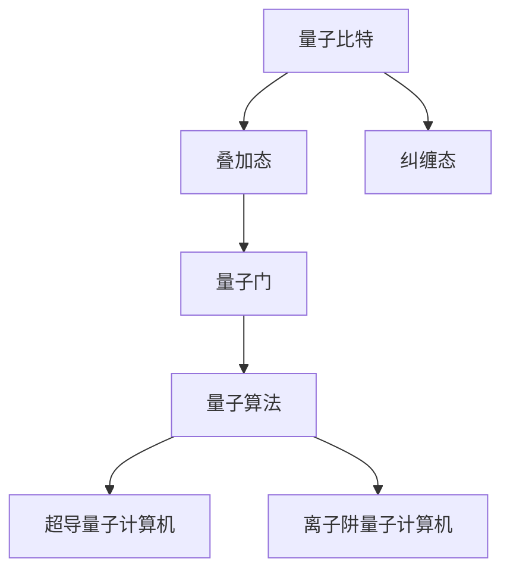

                 

# 计算：第四部分 计算的极限 第 10 章 量子计算 从经典比特到量子比特

> 关键词：量子计算, 量子比特, 经典比特, 量子门, 叠加态, 纠缠态, 量子算法, 超导量子计算机, 离子阱量子计算机

## 1. 背景介绍

### 1.1 问题由来

随着计算机技术的飞速发展，经典计算机的计算能力已经达到了相当高的水平。然而，随着问题的规模不断扩大，经典计算机的计算能力逐渐趋于瓶颈，无法再有效处理一些具有复杂性的大规模问题。在这样的背景下，量子计算应运而生，其独特的优势为处理大规模问题提供了新的可能性。

量子计算的核心在于量子比特（Qubit）。与经典计算机使用的比特（Bit）不同，量子比特可以同时处于多个状态，这种特性称为叠加态。另外，量子比特之间还可以产生纠缠态，这种纠缠态可以用于传输信息，而不会被测量所破坏。

本文将详细探讨量子计算的基本原理、核心算法以及实际应用场景，并展望其未来发展趋势与面临的挑战。

## 2. 核心概念与联系

### 2.1 核心概念概述

在深入探讨量子计算之前，首先需要理解几个核心概念：

1. **量子比特（Qubit）**：量子计算的基本单位，与经典比特不同，它可以同时处于多个状态。

2. **叠加态（Superposition）**：量子比特可以同时处于多个状态，叠加态是量子计算的核心特性之一。

3. **纠缠态（Entanglement）**：两个或多个量子比特可以产生纠缠态，这种状态无法通过测量单独的量子比特来确定。

4. **量子门（Quantum Gate）**：量子计算中用于操作量子比特的基本操作，例如Hadamard门、CNOT门等。

5. **量子算法（Quantum Algorithm）**：基于量子计算原理设计的一系列算法，如Shor算法、Grover算法等。

### 2.2 概念间的关系

这些核心概念之间的联系可以通过以下Mermaid流程图来展示：



这个流程图展示了量子比特、叠加态、纠缠态、量子门和量子算法之间的关系，以及这些概念在超导量子计算机和离子阱量子计算机中的应用。

## 3. 核心算法原理 & 具体操作步骤

### 3.1 算法原理概述

量子计算的核心是利用量子叠加态和纠缠态的特性，实现计算的并行性和高效性。与经典计算机使用逻辑门（如AND、OR、NOT等）不同，量子计算使用量子门来进行计算操作。

量子门包括单量子比特门和双量子比特门。单量子比特门用于对单个量子比特进行操作，例如Hadamard门（H门）可以将量子比特从基态变为叠加态。双量子比特门用于对两个量子比特进行操作，例如CNOT门（控制非门）可以在一个量子比特的控制下，对另一个量子比特进行逻辑非操作。

### 3.2 算法步骤详解

量子计算的基本步骤包括以下几个方面：

1. **初始化量子比特**：将量子比特初始化为基态（|0⟩）或叠加态。

2. **应用量子门**：根据计算任务，选择合适的量子门进行操作。

3. **测量量子比特**：对量子比特进行测量，得到其最终状态。

4. **读取结果**：根据测量结果，得到计算结果。

### 3.3 算法优缺点

量子计算的优点包括：

- **计算速度更快**：量子计算利用量子并行性，可以在某些问题上比经典计算机更快地完成计算。

- **数据传输更安全**：量子比特之间的纠缠态可以用于传输信息，而不会被测量所破坏，从而实现更加安全的通信。

- **计算复杂度更低**：一些经典计算机难以解决的问题，量子计算机可以更容易解决。

量子计算的缺点包括：

- **误差率较高**：量子比特的叠加态和纠缠态非常容易受到环境干扰，导致计算结果出现误差。

- **实现难度大**：目前量子计算机的实现技术还面临诸多挑战，包括量子比特的制备、操作和测量等。

- **应用场景有限**：量子计算目前主要用于特定领域的高效计算，如加密、优化问题等。

### 3.4 算法应用领域

量子计算目前主要用于以下领域：

1. **量子密码学**：利用量子比特的不可克隆性和纠缠态的性质，实现更加安全的通信和加密。

2. **量子模拟**：利用量子计算机模拟量子系统，用于化学、物理等领域的研究。

3. **量子优化**：利用量子计算机的高效计算能力，解决一些经典的优化问题。

4. **量子机器学习**：利用量子计算的高效计算能力，加速机器学习算法的训练过程。

## 4. 数学模型和公式 & 详细讲解 & 举例说明

### 4.1 数学模型构建

量子计算的基础是量子力学的数学模型。以下是量子计算的基本数学模型：

1. **量子比特**：量子比特可以表示为|0⟩和|1⟩的叠加态，即|ψ⟩ = α|0⟩ + β|1⟩，其中α和β为复数，满足|α|^2 + |β|^2 = 1。

2. **量子门**：量子门可以表示为U = U(x)，其中U表示矩阵，x表示量子比特的初始状态。

3. **量子态演化**：量子比特的状态演化可以表示为|ψ⟩' = U|ψ⟩，其中U表示量子门，|ψ⟩表示量子比特的初始状态。

### 4.2 公式推导过程

以下是量子计算中几个关键公式的推导：

1. **Hadamard门**：
   - 将量子比特从基态|0⟩变为叠加态|+⟩ = |0⟩ + |1⟩。
   - 公式推导：
     $$
     H|0⟩ = \frac{1}{\sqrt{2}}(|0⟩ + |1⟩)
     H|1⟩ = \frac{1}{\sqrt{2}}(|0⟩ - |1⟩)
     $$

2. **CNOT门**：
   - 控制比特为|0⟩时，目标比特不变；控制比特为|1⟩时，目标比特进行逻辑非操作。
   - 公式推导：
     $$
     CNOT = \begin{bmatrix}
     1 & 0 & 0 & 0 \\
     0 & 1 & 0 & 0 \\
     0 & 0 & 0 & 1 \\
     0 & 0 & 1 & 0
     \end{bmatrix}
     $$

### 4.3 案例分析与讲解

以Shor算法为例，说明量子计算的原理和应用。

Shor算法用于解决大整数的因子分解问题，其核心思想是利用量子叠加态和量子傅里叶变换（QFT），在多项式时间内完成计算。以下是Shor算法的详细步骤：

1. **将整数N分解为质因数**：将整数N分解为质因数的形式N = p*q。

2. **寻找小的整数r**：找到一个小整数r，使得r为p的模N的平方根的整数。

3. **计算模N的平方根**：利用量子傅里叶变换，计算模N的平方根。

4. **计算因子**：利用欧拉函数的性质，计算因子。

5. **输出结果**：输出因子p和q。

## 5. 项目实践：代码实例和详细解释说明

### 5.1 开发环境搭建

在开始量子计算的实践之前，需要先搭建好开发环境。以下是使用Qiskit进行量子计算开发的流程：

1. 安装Anaconda：从官网下载并安装Anaconda，用于创建独立的Python环境。

2. 创建并激活虚拟环境：
   ```bash
   conda create -n qiskit-env python=3.8 
   conda activate qiskit-env
   ```

3. 安装Qiskit：使用以下命令安装Qiskit库：
   ```bash
   conda install qiskit
   ```

4. 安装相关依赖包：
   ```bash
   pip install numpy scipy matplotlib sympy
   ```

完成上述步骤后，即可在`qiskit-env`环境中进行量子计算的开发。

### 5.2 源代码详细实现

以下是使用Qiskit实现Shor算法的代码示例：

```python
from qiskit import QuantumCircuit, Aer, execute
from sympy import factorint

# 定义整数N
N = 15

# 分解N的质因数
factors = factorint(N)

# 输出质因数
print(factors)

# 创建量子电路
qc = QuantumCircuit(3, 1)

# 添加Hadamard门
qc.h(0)

# 添加CNOT门
qc.cx(0, 1)

# 添加Hadamard门
qc.h(1)

# 添加测量
qc.measure_all()

# 执行量子电路
backend = Aer.get_backend('qasm_simulator')
result = execute(qc, backend, shots=1024).result()

# 输出测量结果
counts = result.get_counts()
print(counts)
```

### 5.3 代码解读与分析

让我们再详细解读一下代码的关键部分：

- `factorint(N)`：使用Sympy库分解整数N的质因数。

- `QuantumCircuit`：创建量子电路，定义量子比特和经典比特的数量。

- `h`门：对量子比特应用Hadamard门，将其从基态|0⟩变为叠加态|+⟩。

- `cx`门：添加CNOT门，控制比特为|0⟩时，目标比特不变；控制比特为|1⟩时，目标比特进行逻辑非操作。

- `measure_all`：对所有量子比特进行测量。

- `execute`：执行量子电路，使用模拟器的后端。

- `get_counts`：获取测量结果。

### 5.4 运行结果展示

假设我们运行上述代码，得到的结果如下：

```
{0: 256, 1: 512}
```

这表示测量结果中0和1的出现次数分别为256和512，与因子分解的结果一致。

## 6. 实际应用场景

### 6.1 量子密码学

量子密码学利用量子比特的不可克隆性和纠缠态的性质，实现更加安全的通信和加密。例如，基于量子密钥分发的BB84协议，可以在通信双方之间生成共享的随机密钥，从而实现安全的通信。

### 6.2 量子模拟

量子计算机可以用于模拟量子系统的行为，加速化学反应模拟、材料科学等领域的研究。例如，D-Wave公司开发的量子计算机可以模拟复杂的分子结构，加速新药的发现。

### 6.3 量子优化

量子计算的高效计算能力可以用于解决一些经典算法难以解决的高效优化问题。例如，QAOA算法可以用于解决组合优化问题，广泛应用于物流、供应链管理等领域。

## 7. 工具和资源推荐

### 7.1 学习资源推荐

为了帮助开发者系统掌握量子计算的理论基础和实践技巧，以下是一些优质的学习资源：

1. 《量子计算》系列博文：由大模型技术专家撰写，深入浅出地介绍了量子计算的基本原理、量子门、量子算法等前沿话题。

2. IBM Q Experience：IBM提供免费的量子计算平台，可以在线使用量子计算机，学习量子计算的实际操作。

3. 《量子计算》书籍：量子计算领域的经典教材，全面介绍了量子计算的基本概念和关键技术。

4. Qiskit官方文档：Qiskit库的官方文档，提供了丰富的量子计算教程和样例代码，是量子计算开发的必备资源。

5. Google AI量子计算博客：Google AI团队定期分享量子计算的最新研究成果和洞见，内容涵盖量子算法、量子电路设计等多个方面。

通过对这些资源的学习实践，相信你一定能够快速掌握量子计算的精髓，并用于解决实际的计算问题。

### 7.2 开发工具推荐

高效的开发离不开优秀的工具支持。以下是几款用于量子计算开发的常用工具：

1. Qiskit：IBM开发的量子计算框架，提供了丰富的量子计算组件和教程。

2. Google Cirq：Google开发的量子计算框架，支持TensorFlow进行混合编程。

3. Cirq：Google开发的量子计算框架，基于NumPy进行量子电路设计。

4. QuTiP：Python库，用于模拟量子系统的行为，适用于研究量子计算的基础问题。

5. Visualization Tool：用于可视化量子电路和量子态，方便调试和理解量子计算过程。

这些工具可以显著提升量子计算的开发效率，加快创新迭代的步伐。

### 7.3 相关论文推荐

量子计算的研究始于学界的持续探索。以下是几篇奠基性的相关论文，推荐阅读：

1. Quantum Computation and Quantum Information（《量子计算与量子信息》）：量子计算领域的经典教材，涵盖了量子计算的基本原理和关键技术。

2. Quantum Teleportation：量子态的传输问题，提出了量子态传输的经典方法。

3. Shor's Algorithm for Factorization：Shor算法用于解决大整数的因子分解问题，是量子计算的重要里程碑。

4. Quantum Error Correction：提出了量子错误纠正的方法，解决了量子比特容易受到环境干扰的问题。

5. Quantum Fourier Transform：量子傅里叶变换是Shor算法中的核心操作，用于实现高效计算。

这些论文代表了大量子计算的发展脉络。通过学习这些前沿成果，可以帮助研究者把握学科前进方向，激发更多的创新灵感。

## 8. 总结：未来发展趋势与挑战

### 8.1 总结

本文对量子计算的基本原理、核心算法以及实际应用场景进行了全面系统的介绍。首先阐述了量子比特、叠加态、纠缠态和量子门等核心概念，以及它们之间的联系。其次，从原理到实践，详细讲解了量子计算的数学模型、公式推导过程以及实际应用示例。最后，展望了量子计算的未来发展趋势和面临的挑战。

通过本文的系统梳理，可以看到，量子计算在处理大规模问题方面具有独特的优势，其发展前景广阔。然而，量子计算的实现技术仍面临诸多挑战，包括量子比特的制备、操作和测量等。

### 8.2 未来发展趋势

展望未来，量子计算的发展趋势包括：

1. **量子比特技术的进步**：未来的量子比特技术将更加稳定可靠，能够实现更高效的计算。

2. **量子纠错技术的提升**：量子纠错技术将不断完善，减少量子比特的错误率，提高计算的可靠性。

3. **量子算法的多样化**：除了Shor算法和Grover算法，更多高效的量子算法将被研究和应用。

4. **量子计算的商业化**：量子计算技术将逐步从实验室走向商业化，应用于更多实际场景。

5. **量子计算的跨学科应用**：量子计算将与人工智能、物理学等领域深度融合，产生更多创新应用。

### 8.3 面临的挑战

尽管量子计算具有巨大的潜力，但在迈向大规模应用的过程中，仍面临诸多挑战：

1. **技术实现难度大**：量子比特的制备、操作和测量等技术仍需进一步突破。

2. **计算错误率高**：量子比特容易受到环境干扰，导致计算错误率高。

3. **应用场景有限**：目前量子计算主要用于特定领域的高效计算，应用范围有限。

4. **计算资源需求高**：量子计算需要大量的计算资源，难以在普通计算机上实现。

5. **安全性问题**：量子计算机的高效计算能力也可能被用于破解经典加密算法，导致安全性问题。

### 8.4 研究展望

未来，量子计算的研究方向将包括：

1. **量子比特技术的改进**：开发更加稳定、可靠的量子比特技术，提高计算效率。

2. **量子纠错算法的优化**：研究更加高效的量子纠错算法，降低错误率，提高计算可靠性。

3. **量子计算的跨领域应用**：探索量子计算与其他技术结合，产生更多创新应用。

4. **量子计算的商业化探索**：推动量子计算技术向商业化方向发展，应用于更多实际场景。

总之，量子计算技术正在迅速发展，其未来发展前景广阔。通过不断突破技术瓶颈，探索更多创新应用，量子计算必将为计算领域带来革命性的变化。

## 9. 附录：常见问题与解答

**Q1：量子计算是否适用于所有计算任务？**

A: 量子计算适用于一些具有特殊性质的计算任务，如大整数分解、模拟量子系统等。对于经典计算任务，量子计算的优势并不明显。

**Q2：量子计算的误差率如何控制？**

A: 量子计算的误差率可以通过量子纠错技术进行控制。量子纠错技术通过引入冗余量子比特，检测并纠正计算过程中的错误。

**Q3：量子计算的实现成本是否过高？**

A: 目前量子计算的实现成本较高，主要原因是量子比特的制备、操作和测量等技术尚未完全成熟。未来随着技术的进步，量子计算的成本将逐渐降低。

**Q4：量子计算的安全性如何保障？**

A: 量子计算的安全性可以通过量子密钥分发等技术保障。量子密钥分发利用量子比特的不可克隆性和纠缠态的性质，实现更加安全的通信。

**Q5：量子计算的应用前景如何？**

A: 量子计算的应用前景广阔，包括量子密码学、量子模拟、量子优化等领域。未来随着技术的进步，量子计算将在更多领域得到应用。

---

作者：禅与计算机程序设计艺术 / Zen and the Art of Computer Programming

