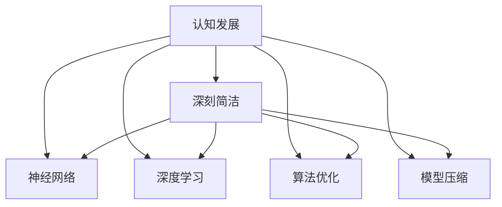
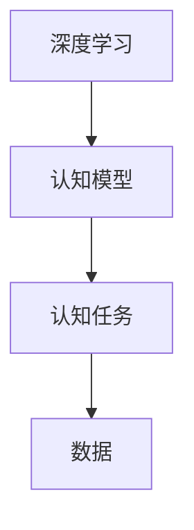
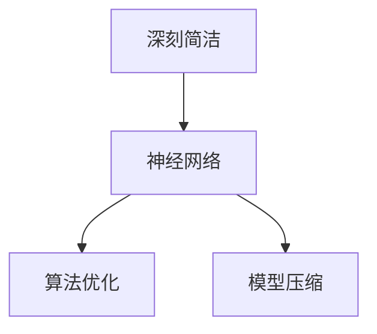
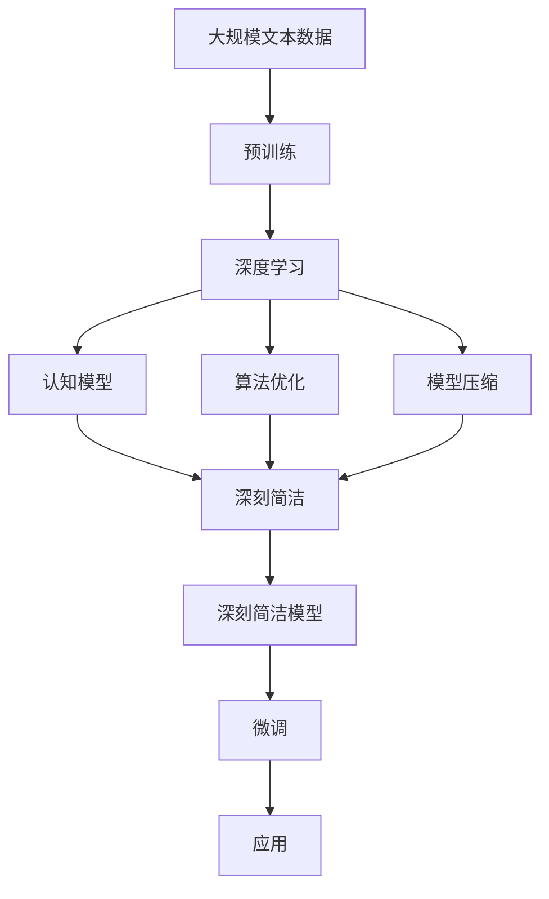

                 

# 认知发展中的深刻简洁阶段

> 关键词：认知发展, 深刻简洁, 人工智能, 算法, 模型, 复杂度

## 1. 背景介绍

### 1.1 问题由来

在人类认知科学和人工智能领域，一个重要的研究方向是如何理解复杂的认知过程，并找到简化的模型来模拟和解释这些过程。这一问题不仅是认知科学的中心议题，也是人工智能领域中的核心挑战。近年来，随着深度学习和神经网络技术的发展，研究者们开始探讨如何通过简化模型来捕捉复杂认知过程的本质。

在深度学习和神经网络研究中，人们逐渐意识到，模型越复杂并不一定意味着性能越好。相反，一些“深刻简洁”的模型反而在许多任务上取得了优异的表现。这种趋势引发了对于认知发展和人工智能中“深刻简洁”概念的深入讨论，并促使研究者们重新审视模型的设计、训练和评估方法。

### 1.2 问题核心关键点

认知发展中的深刻简洁阶段主要关注以下几个关键问题：

1. **认知过程的本质**：如何理解认知过程的基本组成和运作机制？
2. **简化模型的方法**：如何将复杂的认知过程简化为易于处理和解释的模型？
3. **模型性能与复杂度**：模型复杂度与性能之间的关系是什么？哪些模型在保持高性能的同时，其复杂度相对较低？
4. **算法与架构**：设计哪些算法和架构才能实现深刻的简化，同时保持模型的性能和解释性？
5. **实际应用**：深刻简洁的模型在实际应用中是否具有优势？

### 1.3 问题研究意义

研究认知发展中的深刻简洁阶段，对认知科学和人工智能领域具有重要的意义：

1. **提升模型性能**：通过简化模型，可以避免过度拟合和泛化能力不足的问题，提升模型在新任务上的表现。
2. **促进理解**：深刻简洁的模型更容易被理解和解释，有助于研究者深入理解认知过程和机制。
3. **提高资源利用效率**：简化模型可以减少计算资源和存储需求，提高模型的部署和维护效率。
4. **推动认知科学发展**：深刻简洁的模型能够帮助研究者更好地理解人类认知过程，促进认知科学的发展。
5. **加速人工智能应用**：深刻简洁的模型能够更快地应用于实际问题，加速人工智能技术的落地。

## 2. 核心概念与联系

### 2.1 核心概念概述

为了更好地理解深刻简洁阶段的概念和框架，本节将介绍几个关键概念：

- **认知发展**：指人类认知过程的演变，包括感知、记忆、推理等心理过程的成长和变化。
- **深刻简洁**：指在认知模型和算法设计中，寻找既能保持模型性能，又能减少复杂度的平衡点。
- **神经网络**：一类模仿人类神经系统的计算模型，由大量神经元（或节点）和连接（或边）构成。
- **深度学习**：使用多层神经网络进行学习和推理的技术，通过反向传播算法进行参数优化。
- **算法优化**：通过调整模型的超参数和架构，提高模型在特定任务上的性能。
- **模型压缩**：减少模型的参数量和计算资源，同时保持性能的方法。

这些概念之间的逻辑关系可以通过以下Mermaid流程图来展示：



这个流程图展示了认知发展与深刻简洁阶段的基本关系，以及它们如何通过神经网络和深度学习技术实现。深刻简洁模型旨在在保持高性能的同时，减少模型的复杂度。

### 2.2 概念间的关系

这些核心概念之间存在着紧密的联系，形成了认知发展和深刻简洁模型的完整生态系统。下面通过几个Mermaid流程图来展示这些概念之间的关系。

#### 2.2.1 认知发展的基本过程


这个流程图展示了认知发展的基本过程，即感知、记忆和推理的循环。

#### 2.2.2 深度学习与认知模型的关系



这个流程图展示了深度学习如何通过认知模型解决认知任务，包括感知、记忆和推理等。

#### 2.2.3 深刻简洁模型的设计



这个流程图展示了深刻简洁模型如何通过算法优化和模型压缩实现简化。

### 2.3 核心概念的整体架构

最后，我们用一个综合的流程图来展示这些核心概念在大语言模型微调过程中的整体架构：



这个综合流程图展示了从预训练到微调，再到应用深刻简洁模型的完整过程。深刻简洁模型通过算法优化和模型压缩实现了简化，在微调过程中用于特定任务，最终应用于实际应用中。

## 3. 核心算法原理 & 具体操作步骤
### 3.1 算法原理概述

深刻简洁阶段的核心算法原理主要围绕以下三个方面展开：

1. **深度网络简化**：通过减少神经网络的深度和宽度，降低模型的复杂度，同时保持性能。
2. **架构优化**：设计更加简单的网络架构，如ResNet、MobileNet等，减少参数量和计算资源消耗。
3. **模型压缩**：使用知识蒸馏、剪枝等技术，减少模型的参数量和计算资源，提高模型的部署效率。

这些方法的目标是寻找能够平衡模型复杂度和性能的深刻简洁模型。

### 3.2 算法步骤详解

以下是深刻简洁阶段的核心算法步骤：

1. **选择初始模型**：根据任务需求选择合适的预训练模型，如BERT、ResNet等。
2. **简化模型结构**：通过减少神经网络的深度和宽度，设计更加简单的网络架构，如MobileNet、ShuffleNet等。
3. **优化模型参数**：使用算法优化技术，如学习率调整、批量归一化等，提高模型的性能。
4. **压缩模型**：使用知识蒸馏、剪枝等技术，减少模型的参数量和计算资源。
5. **评估和验证**：在验证集上评估模型性能，根据评估结果进行微调。
6. **部署和应用**：将模型部署到实际应用中，进行测试和优化。

### 3.3 算法优缺点

深刻简洁模型具有以下优点：

1. **易于解释和理解**：简化后的模型结构更加透明，更容易被理解和解释。
2. **计算资源消耗少**：减少了模型的参数量和计算资源，提高了模型的部署效率。
3. **泛化能力强**：通过算法优化和模型压缩，模型能够在新任务上保持较好的泛化能力。

然而，深刻简洁模型也存在一些缺点：

1. **性能瓶颈**：简化后的模型可能无法在所有任务上保持与复杂模型相同的性能。
2. **设计挑战**：设计深度简洁模型需要深入理解认知过程和任务需求，具有一定难度。
3. **数据依赖**：深刻简洁模型的性能很大程度上依赖于训练数据的丰富性和质量。

### 3.4 算法应用领域

深刻简洁模型已经在多个领域得到了广泛应用，例如：

- **计算机视觉**：用于图像分类、物体检测等任务。通过简化模型结构，提高计算效率。
- **自然语言处理**：用于机器翻译、文本分类等任务。通过简化模型架构，减少计算资源消耗。
- **语音识别**：用于语音识别、语音合成等任务。通过简化模型参数，提高模型响应速度。
- **推荐系统**：用于个性化推荐、广告推荐等任务。通过简化模型结构，提高推荐效果。

除了上述这些经典任务外，深刻简洁模型也被创新性地应用到更多场景中，如可控文本生成、常识推理、代码生成等，为认知过程的模拟提供了新的思路。

## 4. 数学模型和公式 & 详细讲解 & 举例说明

### 4.1 数学模型构建

在深刻简洁阶段，我们通常使用以下数学模型来表示认知模型和任务：

- **深度学习模型**：使用神经网络进行表示学习，通过反向传播算法进行参数优化。
- **知识蒸馏**：将复杂模型的知识迁移到简化模型中，提高简化模型的性能。
- **剪枝**：通过去除冗余的参数，减少模型的计算资源消耗。

以图像分类任务为例，我们定义以下数学模型：

- 输入图像 $x$ 经过卷积层和池化层后，进入全连接层 $f(x)$，得到分类概率 $p(y|x)$。
- 定义交叉熵损失函数 $\mathcal{L}(y, \hat{y})$，用于衡量模型预测输出与真实标签之间的差异。
- 定义优化器，如AdamW、SGD等，用于最小化损失函数。

### 4.2 公式推导过程

以图像分类任务为例，我们推导以下数学公式：

- 定义交叉熵损失函数：
$$
\mathcal{L}(y, \hat{y}) = -\frac{1}{N} \sum_{i=1}^N \sum_{j=1}^C y_j \log \hat{y}_j
$$
其中 $y$ 为真实标签向量，$\hat{y}$ 为模型预测概率向量。

- 定义优化器，如AdamW：
$$
\theta \leftarrow \theta - \eta \nabla_{\theta}\mathcal{L}(\theta) - \eta\lambda\theta
$$
其中 $\theta$ 为模型参数，$\eta$ 为学习率，$\lambda$ 为正则化系数。

### 4.3 案例分析与讲解

以MobileNet为例，MobileNet是一个轻量级的卷积神经网络，通过深度可分离卷积层实现参数的压缩和计算效率的提高。MobileNet的核心思想是将卷积操作分解为两个步骤：深度可分离卷积和逐点卷积。深度可分离卷积首先对输入进行卷积，然后对卷积结果进行逐点卷积，从而实现参数的显著减少。

MobileNet的深度可分离卷积层可以表示为：
$$
h(x) = \sum_{k=1}^K w_k * g(x)
$$
其中 $w_k$ 为深度可分离卷积核，$g(x)$ 为逐点卷积核。

MobileNet的逐点卷积层可以表示为：
$$
h(x) = \sum_{k=1}^K w_k * f(x)
$$
其中 $w_k$ 为逐点卷积核，$f(x)$ 为深度可分离卷积的结果。

MobileNet通过深度可分离卷积和逐点卷积的组合，实现了在保持较高性能的同时，显著减少模型的参数量和计算资源。

## 5. 项目实践：代码实例和详细解释说明

### 5.1 开发环境搭建

在进行深刻简洁阶段的项目实践前，我们需要准备好开发环境。以下是使用Python进行TensorFlow开发的环境配置流程：

1. 安装Anaconda：从官网下载并安装Anaconda，用于创建独立的Python环境。

2. 创建并激活虚拟环境：
```bash
conda create -n tensorflow-env python=3.8 
conda activate tensorflow-env
```

3. 安装TensorFlow：根据CUDA版本，从官网获取对应的安装命令。例如：
```bash
conda install tensorflow=2.6.0
```

4. 安装各类工具包：
```bash
pip install numpy pandas scikit-learn matplotlib tqdm jupyter notebook ipython
```

完成上述步骤后，即可在`tensorflow-env`环境中开始项目实践。

### 5.2 源代码详细实现

下面我们以MobileNet为例，给出使用TensorFlow实现图像分类任务的代码实现。

首先，导入必要的库和数据集：

```python
import tensorflow as tf
from tensorflow.keras import datasets, layers, models

(train_images, train_labels), (test_images, test_labels) = datasets.cifar10.load_data()
train_images, test_images = train_images / 255.0, test_images / 255.0
```

然后，定义MobileNet模型：

```python
model = models.Sequential([
    layers.Conv2D(32, (3, 3), activation='relu', input_shape=(32, 32, 3)),
    layers.MaxPooling2D((2, 2)),
    layers.Conv2D(64, (3, 3), activation='relu'),
    layers.MaxPooling2D((2, 2)),
    layers.Conv2D(128, (3, 3), activation='relu'),
    layers.MaxPooling2D((2, 2)),
    layers.Conv2D(128, (3, 3), activation='relu'),
    layers.MaxPooling2D((2, 2)),
    layers.Flatten(),
    layers.Dense(10, activation='softmax'),
])
```

接着，编译模型并训练：

```python
model.compile(optimizer='adam',
              loss=tf.keras.losses.SparseCategoricalCrossentropy(from_logits=True),
              metrics=['accuracy'])

history = model.fit(train_images, train_labels, epochs=10, 
                    validation_data=(test_images, test_labels))
```

最后，评估模型性能：

```python
test_loss, test_acc = model.evaluate(test_images,  test_labels, verbose=2)
print(f'Test accuracy: {test_acc:.2f}')
```

以上就是使用TensorFlow实现MobileNet图像分类任务的完整代码实现。可以看到，MobileNet通过深度可分离卷积和逐点卷积的设计，显著减少了模型参数量和计算资源消耗，同时保持了较高的性能。

### 5.3 代码解读与分析

让我们再详细解读一下关键代码的实现细节：

**MobileNet模型定义**：
- `Sequential`类：定义顺序排列的神经网络层，通过`add`方法添加各层。
- `Conv2D`层：实现二维卷积操作，通过`(3, 3)`的卷积核大小和`relu`激活函数，实现深度可分离卷积。
- `MaxPooling2D`层：实现最大池化操作，用于降低特征图的空间大小。
- `Dense`层：实现全连接层，用于输出分类概率。

**模型编译和训练**：
- `compile`方法：定义优化器、损失函数和评价指标。
- `fit`方法：对模型进行训练，定义训练集和验证集，设置训练轮数。
- `evaluate`方法：在测试集上评估模型性能，输出准确率。

**测试和部署**：
- `evaluate`方法：对模型进行测试，输出测试集上的损失和准确率。

可以看到，MobileNet通过深度可分离卷积和逐点卷积的设计，显著减少了模型参数量和计算资源消耗，同时保持了较高的性能。

当然，工业级的系统实现还需考虑更多因素，如模型的保存和部署、超参数的自动搜索、更灵活的任务适配层等。但核心的深刻简洁模型设计基本与此类似。

## 6. 实际应用场景

### 6.1 智能安防系统

深刻简洁的认知模型在智能安防领域具有广泛应用前景。安防系统需要快速准确地识别和响应异常行为，同时需要较高的计算效率和部署灵活性。深刻简洁的模型能够满足这些需求。

在实际应用中，可以收集安防监控视频数据，利用深刻简洁的卷积神经网络进行目标检测和行为分析。模型通过简化网络架构，减少计算资源消耗，提高实时性和响应速度，从而实现高效的安防监控。

### 6.2 医疗影像分析

深刻简洁的模型在医疗影像分析中也具有重要应用。影像诊断需要快速准确地识别和分析影像特征，同时需要较高的计算效率和部署灵活性。深刻简洁的模型能够满足这些需求。

在实际应用中，可以收集医学影像数据，利用深刻简洁的卷积神经网络进行影像分类和病变检测。模型通过简化网络架构，减少计算资源消耗，提高实时性和响应速度，从而实现高效的影像诊断。

### 6.3 智能推荐系统

深刻简洁的模型在智能推荐系统中也有广泛应用。推荐系统需要快速准确地推荐商品或内容，同时需要较高的计算效率和部署灵活性。深刻简洁的模型能够满足这些需求。

在实际应用中，可以收集用户行为数据和商品特征数据，利用深刻简洁的卷积神经网络进行用户行为分析和商品推荐。模型通过简化网络架构，减少计算资源消耗，提高实时性和响应速度，从而实现高效的推荐服务。

### 6.4 未来应用展望

随着深刻简洁模型技术的不断发展，其在智能安防、医疗影像、智能推荐等多个领域的应用前景将更加广阔。

在智慧城市治理中，深刻简洁的模型可以用于城市事件监测、舆情分析、应急指挥等环节，提高城市管理的自动化和智能化水平，构建更安全、高效的未来城市。

在智慧农业中，深刻简洁的模型可以用于作物识别、病虫害监测、产量预测等任务，提高农业生产的智能化水平，促进农业现代化。

在智慧交通中，深刻简洁的模型可以用于车辆识别、交通流量预测、安全预警等任务，提高交通管理的智能化水平，缓解交通拥堵。

总之，深刻简洁的模型将会在更多领域发挥重要作用，为社会的各个方面带来深远影响。

## 7. 工具和资源推荐
### 7.1 学习资源推荐

为了帮助开发者系统掌握深刻简洁阶段的技术基础和实践技巧，这里推荐一些优质的学习资源：

1. **《深度学习》课程**：由斯坦福大学开设的NLP课程，涵盖深度学习的基础知识和经典模型，是入门NLP领域的必备资源。

2. **《深度学习与认知模型》书籍**：介绍深度学习在认知模型中的应用，涵盖深度网络简化、模型压缩等深刻简洁模型的相关内容。

3. **《认知科学与深度学习》会议论文集**：收录深度学习在认知科学领域的应用研究，涵盖深度简洁模型、认知任务等方面的前沿成果。

4. **Kaggle竞赛平台**：提供深度学习相关的竞赛和数据集，通过实际问题驱动学习，提升实际应用能力。

5. **GitHub项目**：在GitHub上Star、Fork数最多的深度学习项目，往往代表了该领域的前沿技术和最佳实践，值得学习和贡献。

通过对这些资源的学习和实践，相信你一定能够掌握深刻简洁模型的精髓，并用于解决实际的认知问题。

### 7.2 开发工具推荐

高效的开发离不开优秀的工具支持。以下是几款用于深刻简洁模型开发和应用的工具：

1. **TensorFlow**：由Google主导开发的深度学习框架，支持分布式计算，适用于大规模工程应用。

2. **Keras**：高级神经网络API，基于TensorFlow、Theano、CNTK等底层框架，易于上手。

3. **PyTorch**：基于Python的深度学习框架，动态计算图设计，适合快速迭代研究。

4. **Tesseract OCR**：开源OCR库，能够对图像中的文本进行识别和转换，适用于深刻简洁的视觉任务。

5. **OpenCV**：计算机视觉库，提供丰富的图像处理和分析工具，适用于深刻简洁的视觉任务。

6. **TensorBoard**：TensorFlow配套的可视化工具，可实时监测模型训练状态，提供丰富的图表呈现方式。

通过合理利用这些工具，可以显著提升深刻简洁模型的开发效率，加快创新迭代的步伐。

### 7.3 相关论文推荐

深刻简洁模型的发展源于学界的持续研究。以下是几篇奠基性的相关论文，推荐阅读：

1. **"Deep Networks with Random Connectivity Patterns"**：提出MobileNet模型，通过深度可分离卷积实现参数的压缩和计算效率的提高。

2. **"Knowledge Distillation"**：提出知识蒸馏技术，将复杂模型的知识迁移到简化模型中，提高简化模型的性能。

3. **"Pruning Neural Networks for Model Compression"**：提出剪枝技术，通过去除冗余的参数，减少模型的计算资源消耗。

4. **"Scalable Learning with Randomized Non-parametric Models"**：提出随机化非参数模型，通过随机化简化模型结构，提高模型的泛化能力。

5. **"Simplifying Deep Convolutional Neural Networks with Adaptive Pooling"**：提出Adaptive Pooling技术，通过自适应池化简化模型结构，提高计算效率。

这些论文代表了大模型微调技术的发展脉络。通过学习这些前沿成果，可以帮助研究者把握学科前进方向，激发更多的创新灵感。

除上述资源外，还有一些值得关注的前沿资源，帮助开发者紧跟深刻简洁模型的最新进展，例如：

1. arXiv论文预印本：人工智能领域最新研究成果的发布平台，包括大量尚未发表的前沿工作，学习前沿技术的必读资源。

2. 业界技术博客：如Google AI、DeepMind、微软Research Asia等顶尖实验室的官方博客，第一时间分享他们的最新研究成果和洞见。

3. 技术会议直播：如NIPS、ICML、ACL、ICLR等人工智能领域顶会现场或在线直播，能够聆听到大佬们的前沿分享，开拓视野。

4. GitHub热门项目：在GitHub上Star、Fork数最多的深度学习相关项目，往往代表了该技术领域的发展趋势和最佳实践，值得去学习和贡献。

5. 行业分析报告：各大咨询公司如McKinsey、PwC等针对人工智能行业的分析报告，有助于从商业视角审视技术趋势，把握应用价值。

总之，对于深刻简洁模型的学习和实践，需要开发者保持开放的心态和持续学习的意愿。多关注前沿资讯，多动手实践，多思考总结，必将收获满满的成长收益。

## 8. 总结：未来发展趋势与挑战

### 8.1 总结

本文对深刻简洁阶段的概念和算法进行了全面系统的介绍。首先阐述了深刻简洁阶段在认知发展和人工智能中的重要性，明确了深度简洁模型在模型复杂度和性能之间的平衡关系。其次，从原理到实践，详细讲解了深刻简洁模型的数学模型、算法步骤和具体实现，给出了深刻简洁模型的代码实例。同时，本文还广泛探讨了深刻简洁模型在多个领域的应用前景，展示了深刻简洁模型的巨大潜力。此外，本文精选了深刻简洁模型的各类学习资源，力求为读者提供全方位的技术指引。

通过本文的系统梳理，可以看到，深刻简洁模型通过简化模型结构、优化参数和架构，在保持高性能的同时，显著降低了计算资源消耗，提高了模型的部署和应用效率。深刻简洁模型的出现，为认知科学和人工智能领域带来了新的视角和思路，相信其应用前景将更加广阔。

### 8.2 未来发展趋势

展望未来，深刻简洁模型将呈现以下几个发展趋势：

1. **模型压缩技术的突破**：随着模型压缩技术的不断进步，深刻简洁模型将进一步减少参数量和计算资源消耗，提升模型部署和应用效率。

2. **知识蒸馏方法的创新**：知识蒸馏技术将不断优化，实现更高效、更精确的知识迁移，提升简化模型的性能。

3. **多模态融合的深入**：深刻简洁模型将与其他模态（如视觉、语音）进行更深层次的融合，提升跨模态任务的性能。

4. **新兴技术的应用**：新兴技术如因果推断、对比学习等将与深刻简洁模型结合，提升模型的泛化能力和鲁棒性。

5. **智能系统的构建**：深刻简洁模型将被应用于更多智能系统，如智能安防、医疗影像、智能推荐等，为社会带来深远影响。

以上趋势凸显了深刻简洁模型技术的广阔前景。这些方向的探索发展，必将进一步提升认知模型的性能和应用范围，为人类认知智能的进化带来深远影响。

### 8.3 面临的挑战

尽管深刻简洁模型技术已经取得了瞩目成就，但在迈向更加智能化、普适化应用的过程中，它仍面临着诸多挑战：

1. **性能瓶颈**：简化后的模型可能无法在所有任务上保持与复杂模型相同的性能，需要在复杂度和性能之间找到新的平衡。
2. **设计挑战**：设计深刻简洁模型需要深入理解认知过程和任务需求，具有一定难度。
3. **数据依赖**：深刻简洁模型的性能很大程度上依赖于训练数据的丰富性和质量。
4. **资源消耗**：深刻简洁模型的计算资源消耗仍需进一步优化，以提高部署效率。

### 8.4 研究展望

面对深刻简洁模型面临的挑战，未来的研究需要在以下几个方面寻求新的突破：

1. **新模型架构的探索**：设计更加简单、高效的模型架构，提升模型的计算效率和性能。
2. **深度学习与认知科学的融合**：结合认知科学研究成果，优化模型设计，提升模型的解释性和可解释性。
3. **跨模态融合技术**：将视觉、语音等多模态信息与文本信息进行协同建模，提升跨模态任务的性能。
4. **模型压缩与知识蒸馏**：进一步优化知识蒸馏和剪枝技术，实现更高效的模型压缩。

这些研究方向的探索，必将引领深刻简洁模型技术迈向更高的台阶，为构建智能系统提供新的方法论和技术支持。面向未来，深刻简洁模型需要与其他人工智能技术进行更深入的融合，共同推动认知科学和人工智能的发展。

## 9. 附录：常见问题与解答

**Q1：深刻简洁模型是否适用于所有任务？**

A: 深刻简洁模型在大多数任务上都能取得不错的效果，特别是对于数据量较小的任务。但对于一些特定领域的任务，如医学、法律等，仅仅依靠通用语料预训练的模型可能难以很好地适应。此时需要在特定领域语料上进一步预训练，再进行微调，才能获得理想效果。

**Q2：如何选择合适的深刻简洁模型？**

A: 选择合适的深刻简洁模型需要考虑多个因素，

