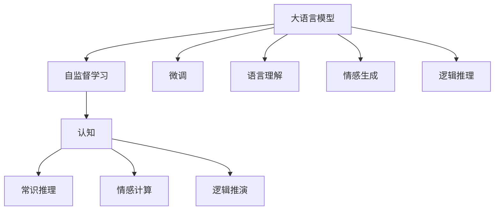
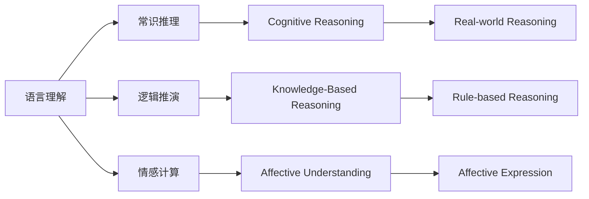
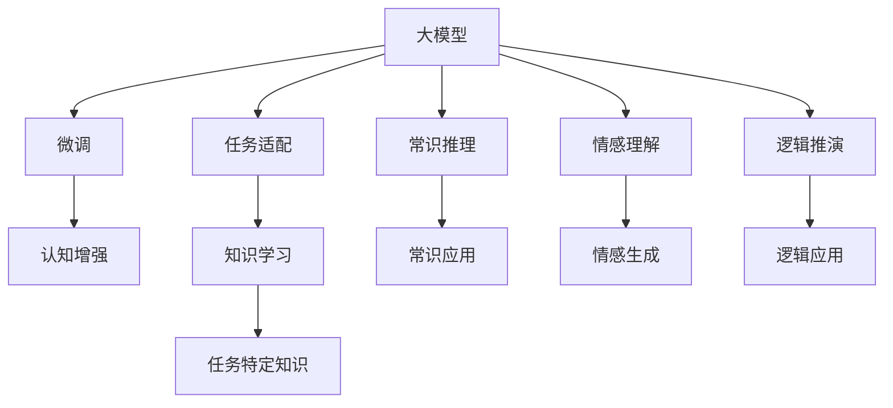
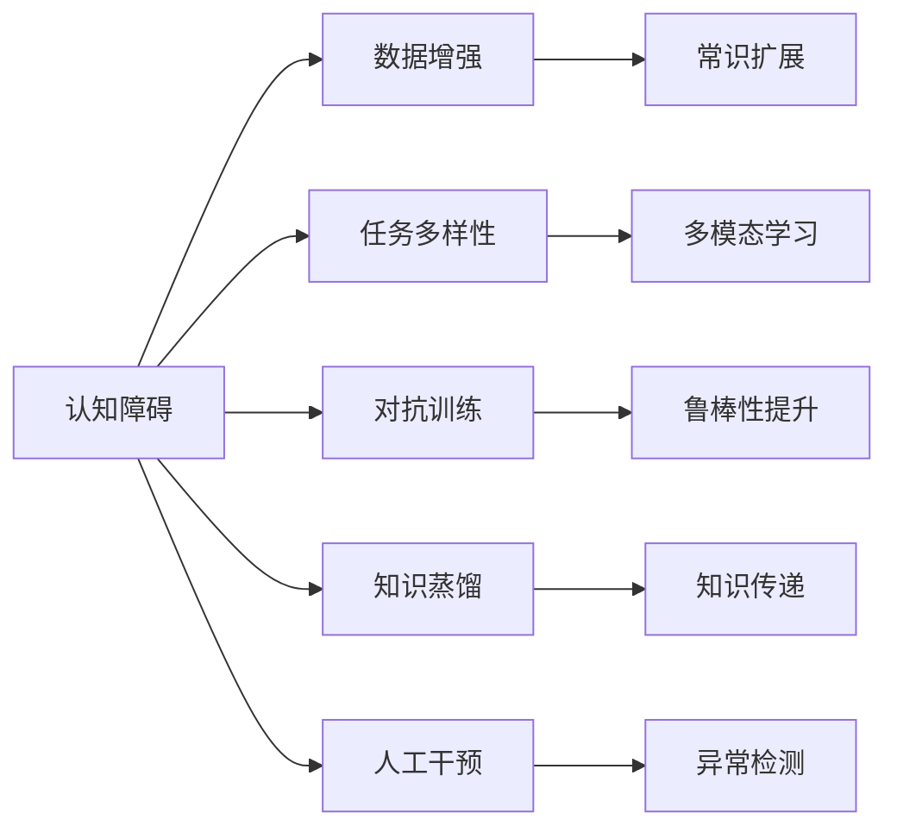
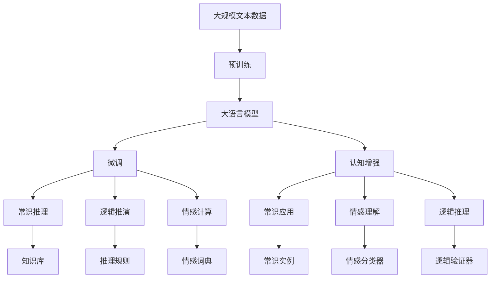

                 

## 1. 背景介绍

语言是人类最为复杂、精细的认知工具，是思维的外在表现形式。然而，基于深度学习的现代语言模型（大模型）在模拟人类思维方面仍然存在显著障碍。本文将从认知科学和人工智能的角度，探讨大模型的认知障碍，并探讨解决这些障碍的途径。

### 1.1 问题由来

大模型如GPT-3、BERT等在处理语言任务时，已经展现了出色的性能，但它们在逻辑推理、常识推理、情感理解等高阶认知任务上仍然存在局限。这是因为语言模型更多地是通过大量文本数据进行训练，而并非通过真实现代认知过程来构建的。

### 1.2 问题核心关键点

大模型的认知障碍主要体现在以下几个方面：

1. **缺乏常识理解**：大模型虽然能够理解语言的字面意思，但对常识、社会规则等缺乏深刻理解。
2. **逻辑推理能力弱**：大模型在处理逻辑推理任务时，容易陷入死循环或错误推理。
3. **情感理解不深刻**：大模型虽然可以生成符合语法规范的文本，但对情感的细微变化缺乏敏感性。
4. **语境依赖性强**：大模型对上下文依赖性强，难以处理长序列依赖或复杂交互。
5. **信息冗余大**：大模型输出的信息往往存在冗余，难以精确控制细节。

这些问题导致大模型在实际应用中，难以完全模拟人类的认知过程，限制了其在高阶任务上的表现。

## 2. 核心概念与联系

### 2.1 核心概念概述

为更好地理解大模型的认知障碍，本节将介绍几个密切相关的核心概念：

- **大语言模型**：指通过大规模预训练和微调获得的强大语言表示能力。
- **认知**：指人类或机器对信息进行吸收、理解、推理和决策的过程。
- **常识推理**：指基于常识知识的推理过程，如因果关系、推理规则等。
- **情感计算**：指对文本或语音中的情感信息进行识别和理解，进而生成相应的情感反应。
- **自监督学习**：指通过大量无标签数据，通过模型自学习获得有用信息的过程。
- **逻辑推演**：指基于逻辑规则的推理过程，如数学证明、论证推理等。

这些核心概念之间的逻辑关系可以通过以下Mermaid流程图来展示：



这个流程图展示了大语言模型的核心概念及其之间的关系：

1. 大语言模型通过自监督学习获得初始的语言表示。
2. 通过微调过程，模型进一步适应特定任务，提升语言理解能力。
3. 在微调过程中，模型可以学习到常识、情感和逻辑推演能力，但这些能力是否真正深入，仍需进一步验证。

### 2.2 概念间的关系

这些核心概念之间存在着紧密的联系，形成了大语言模型的认知框架。下面我通过几个Mermaid流程图来展示这些概念之间的关系。

#### 2.2.1 大模型的认知结构



这个流程图展示了大语言模型的认知结构，包括语言理解、常识推理、逻辑推演和情感计算四个关键部分。

#### 2.2.2 认知与任务适配的关系



这个流程图展示了认知与任务适配的关系。微调过程通过特定的任务训练，增强了模型的认知能力，包括常识推理、情感理解和逻辑推演。

#### 2.2.3 认知障碍的解决途径



这个流程图展示了解决大模型认知障碍的途径，包括数据增强、常识扩展、多模态学习、对抗训练、知识蒸馏和人工干预等方法。

### 2.3 核心概念的整体架构

最后，我们用一个综合的流程图来展示这些核心概念在大语言模型认知过程中的整体架构：



这个综合流程图展示了从预训练到微调，再到认知能力增强的完整过程。大语言模型首先在大规模文本数据上进行预训练，然后通过微调过程适应特定任务，提升语言理解能力。在微调过程中，模型进一步学习常识、逻辑和情感推理能力，最终应用于实际任务。

## 3. 核心算法原理 & 具体操作步骤
### 3.1 算法原理概述

大模型的认知障碍可以通过改进训练方法和优化模型结构来缓解。本节将介绍基于自监督学习、对抗训练和知识蒸馏等方法，提升大模型的认知能力。

### 3.2 算法步骤详解

**Step 1: 准备预训练模型和数据集**

1. 选择合适的预训练语言模型 $M_{\theta}$ 作为初始化参数，如 GPT-3、BERT等。
2. 准备相关领域的高质量数据集，包含丰富的常识知识、逻辑规则和情感信息。

**Step 2: 添加认知任务适配层**

1. 根据任务类型，在预训练模型顶层设计合适的输出层和损失函数。
2. 对于常识推理任务，添加知识库、推理规则等模块。
3. 对于情感计算任务，添加情感词典、情感分类器等模块。

**Step 3: 设置认知任务超参数**

1. 选择合适的优化算法及其参数，如 AdamW、SGD 等，设置学习率、批大小、迭代轮数等。
2. 设置正则化技术及强度，包括权重衰减、Dropout、Early Stopping 等。
3. 确定冻结预训练参数的策略，如仅微调顶层，或全部参数都参与微调。

**Step 4: 执行认知任务训练**

1. 将认知任务数据集分批次输入模型，前向传播计算损失函数。
2. 反向传播计算参数梯度，根据设定的优化算法和学习率更新模型参数。
3. 周期性在验证集上评估模型性能，根据性能指标决定是否触发 Early Stopping。
4. 重复上述步骤直到满足预设的迭代轮数或 Early Stopping 条件。

**Step 5: 测试和部署**

1. 在测试集上评估微调后模型 $M_{\hat{\theta}}$ 的性能，对比微调前后的认知能力提升。
2. 使用微调后的模型对新样本进行推理预测，集成到实际的应用系统中。
3. 持续收集新的数据，定期重新微调模型，以适应数据分布的变化。

### 3.3 算法优缺点

基于认知任务的大模型微调方法具有以下优点：

1. 简单易用。通过微调过程，大模型可以轻松适应特定任务，提升认知能力。
2. 适应性强。大模型可以灵活应对多种认知任务，如常识推理、情感计算和逻辑推演等。
3. 效果显著。在学术界和工业界的诸多任务上，基于微调的方法已经刷新了最先进的认知能力指标。

同时，该方法也存在一定的局限性：

1. 依赖高质量数据。认知任务对数据质量要求较高，数据标注成本高。
2. 迁移能力有限。当目标任务与预训练数据的分布差异较大时，认知任务微调的性能提升有限。
3. 模型泛化能力有待提升。大模型在不同领域和数据分布上的泛化能力仍需进一步提升。
4. 可解释性不足。微调模型的决策过程通常缺乏可解释性，难以对其推理逻辑进行分析和调试。

尽管存在这些局限性，但就目前而言，基于认知任务的大模型微调方法仍是大模型应用的重要范式。未来相关研究的重点在于如何进一步降低微调对高质量数据的依赖，提高模型的少样本学习和跨领域迁移能力，同时兼顾可解释性和伦理安全性等因素。

### 3.4 算法应用领域

基于认知任务的大语言模型微调方法，已经在问答系统、智能客服、情感分析、广告推荐等多个领域得到了广泛的应用，具体包括：

1. 问答系统：对自然语言问题给出详细、逻辑清晰的解答。
2. 智能客服：通过对话历史和用户情感分析，提供个性化服务。
3. 广告推荐：根据用户行为和情感状态，动态调整广告投放策略。
4. 情感分析：对社交媒体、用户评论等文本进行情感分析，评估用户情绪状态。
5. 医疗诊断：基于患者历史数据和情感状态，辅助医生进行诊断和治疗。
6. 金融风控：通过情感分析，识别金融市场情绪变化，预测风险。

除上述这些经典任务外，大语言模型微调还被创新性地应用到更多场景中，如可控文本生成、智能创作、知识图谱构建等，为NLP技术带来了全新的突破。

## 4. 数学模型和公式 & 详细讲解 & 举例说明

### 4.1 数学模型构建

本节将使用数学语言对基于认知任务的大语言模型微调过程进行更加严格的刻画。

记预训练语言模型为 $M_{\theta}$，其中 $\theta$ 为预训练得到的模型参数。假设认知任务 $T$ 的数据集为 $D=\{(x_i,y_i)\}_{i=1}^N$，$x_i$ 为输入文本，$y_i$ 为认知任务的目标输出。

定义模型 $M_{\theta}$ 在输入 $x$ 上的认知任务输出为 $z=M_{\theta}(x)$。根据认知任务的性质，可以设计不同的认知任务损失函数，如：

- **常识推理任务**：假设目标输出 $y_i$ 为推理结果，可以通过设计推理规则和知识库，计算推理损失。
- **情感计算任务**：假设目标输出 $y_i$ 为情感分类，可以使用情感分类器计算情感分类损失。
- **逻辑推演任务**：假设目标输出 $y_i$ 为逻辑验证结果，可以通过设计逻辑验证器计算逻辑验证损失。

### 4.2 公式推导过程

以常识推理任务为例，假设模型在输入 $x$ 上的推理结果为 $z$，目标输出为 $y$，则认知任务损失函数可以定义为：

$$
\ell(M_{\theta}(x),y) = \ell_{task}(z,y)
$$

其中 $\ell_{task}$ 为认知任务特定的损失函数。在微调过程中，模型通过反向传播计算梯度，更新参数 $\theta$，最小化认知任务损失函数：

$$
\theta^* = \mathop{\arg\min}_{\theta} \sum_{i=1}^N \ell_{task}(M_{\theta}(x_i),y_i)
$$

以情感计算任务为例，假设目标输出 $y_i$ 为情感分类，可以使用softmax函数将输出 $z$ 转换为概率分布，然后计算交叉熵损失：

$$
\ell(M_{\theta}(x),y) = -\sum_{j} y_i \log \hat{y}_j
$$

其中 $\hat{y}_j$ 为模型对情感 $j$ 的概率估计。在微调过程中，模型通过反向传播计算梯度，更新参数 $\theta$，最小化认知任务损失函数：

$$
\theta^* = \mathop{\arg\min}_{\theta} \sum_{i=1}^N \ell_{task}(M_{\theta}(x_i),y_i)
$$

### 4.3 案例分析与讲解

以情感计算任务为例，展示如何使用微调方法提升大模型的情感理解能力。

假设我们有一个情感分析数据集，包含用户评论和相应的情感标签。首先，使用预训练语言模型 $M_{\theta}$ 对评论进行特征提取，得到向量表示 $z$。然后，通过添加情感分类器，将向量表示 $z$ 映射到情感分类标签 $y$，计算交叉熵损失：

$$
\ell(M_{\theta}(x),y) = -\sum_{j} y_i \log \hat{y}_j
$$

其中 $\hat{y}_j$ 为模型对情感 $j$ 的概率估计。在微调过程中，通过反向传播计算梯度，更新参数 $\theta$，最小化认知任务损失函数：

$$
\theta^* = \mathop{\arg\min}_{\theta} \sum_{i=1}^N \ell_{task}(M_{\theta}(x_i),y_i)
$$

通过反复迭代训练，模型能够逐步提升情感理解能力，识别评论中的情感倾向，输出正确的情感分类结果。

## 5. 项目实践：代码实例和详细解释说明

### 5.1 开发环境搭建

在进行微调实践前，我们需要准备好开发环境。以下是使用Python进行PyTorch开发的环境配置流程：

1. 安装Anaconda：从官网下载并安装Anaconda，用于创建独立的Python环境。

2. 创建并激活虚拟环境：
```bash
conda create -n pytorch-env python=3.8 
conda activate pytorch-env
```

3. 安装PyTorch：根据CUDA版本，从官网获取对应的安装命令。例如：
```bash
conda install pytorch torchvision torchaudio cudatoolkit=11.1 -c pytorch -c conda-forge
```

4. 安装Transformers库：
```bash
pip install transformers
```

5. 安装各类工具包：
```bash
pip install numpy pandas scikit-learn matplotlib tqdm jupyter notebook ipython
```

完成上述步骤后，即可在`pytorch-env`环境中开始微调实践。

### 5.2 源代码详细实现

下面我们以情感分析任务为例，给出使用Transformers库对BERT模型进行情感分析微调的PyTorch代码实现。

首先，定义情感分析任务的数据处理函数：

```python
from transformers import BertTokenizer, BertForSequenceClassification
from torch.utils.data import Dataset
import torch

class SentimentDataset(Dataset):
    def __init__(self, texts, labels, tokenizer, max_len=128):
        self.texts = texts
        self.labels = labels
        self.tokenizer = tokenizer
        self.max_len = max_len
        
    def __len__(self):
        return len(self.texts)
    
    def __getitem__(self, item):
        text = self.texts[item]
        label = self.labels[item]
        
        encoding = self.tokenizer(text, return_tensors='pt', max_length=self.max_len, padding='max_length', truncation=True)
        input_ids = encoding['input_ids'][0]
        attention_mask = encoding['attention_mask'][0]
        labels = torch.tensor(label, dtype=torch.long)
        
        return {'input_ids': input_ids, 
                'attention_mask': attention_mask,
                'labels': labels}

# 标签与id的映射
label2id = {'negative': 0, 'positive': 1}
id2label = {v: k for k, v in label2id.items()}

# 创建dataset
tokenizer = BertTokenizer.from_pretrained('bert-base-cased')

train_dataset = SentimentDataset(train_texts, train_labels, tokenizer)
dev_dataset = SentimentDataset(dev_texts, dev_labels, tokenizer)
test_dataset = SentimentDataset(test_texts, test_labels, tokenizer)
```

然后，定义模型和优化器：

```python
from transformers import AdamW

model = BertForSequenceClassification.from_pretrained('bert-base-cased', num_labels=len(label2id))

optimizer = AdamW(model.parameters(), lr=2e-5)
```

接着，定义训练和评估函数：

```python
from torch.utils.data import DataLoader
from tqdm import tqdm
from sklearn.metrics import accuracy_score

device = torch.device('cuda') if torch.cuda.is_available() else torch.device('cpu')
model.to(device)

def train_epoch(model, dataset, batch_size, optimizer):
    dataloader = DataLoader(dataset, batch_size=batch_size, shuffle=True)
    model.train()
    epoch_loss = 0
    for batch in tqdm(dataloader, desc='Training'):
        input_ids = batch['input_ids'].to(device)
        attention_mask = batch['attention_mask'].to(device)
        labels = batch['labels'].to(device)
        model.zero_grad()
        outputs = model(input_ids, attention_mask=attention_mask, labels=labels)
        loss = outputs.loss
        epoch_loss += loss.item()
        loss.backward()
        optimizer.step()
    return epoch_loss / len(dataloader)

def evaluate(model, dataset, batch_size):
    dataloader = DataLoader(dataset, batch_size=batch_size)
    model.eval()
    preds, labels = [], []
    with torch.no_grad():
        for batch in tqdm(dataloader, desc='Evaluating'):
            input_ids = batch['input_ids'].to(device)
            attention_mask = batch['attention_mask'].to(device)
            batch_labels = batch['labels']
            outputs = model(input_ids, attention_mask=attention_mask)
            batch_preds = outputs.logits.argmax(dim=2).to('cpu').tolist()
            batch_labels = batch_labels.to('cpu').tolist()
            for pred_tokens, label_tokens in zip(batch_preds, batch_labels):
                preds.append(pred_tokens[:len(label_tokens)])
                labels.append(label_tokens)
                
    print(f"Accuracy: {accuracy_score(labels, preds):.2f}")
```

最后，启动训练流程并在测试集上评估：

```python
epochs = 5
batch_size = 16

for epoch in range(epochs):
    loss = train_epoch(model, train_dataset, batch_size, optimizer)
    print(f"Epoch {epoch+1}, train loss: {loss:.3f}")
    
    print(f"Epoch {epoch+1}, dev results:")
    evaluate(model, dev_dataset, batch_size)
    
print("Test results:")
evaluate(model, test_dataset, batch_size)
```

以上就是使用PyTorch对BERT进行情感分析任务微调的完整代码实现。可以看到，得益于Transformers库的强大封装，我们可以用相对简洁的代码完成BERT模型的加载和微调。

### 5.3 代码解读与分析

让我们再详细解读一下关键代码的实现细节：

**SentimentDataset类**：
- `__init__`方法：初始化文本、标签、分词器等关键组件。
- `__len__`方法：返回数据集的样本数量。
- `__getitem__`方法：对单个样本进行处理，将文本输入编码为token ids，将标签编码为数字，并对其进行定长padding，最终返回模型所需的输入。

**label2id和id2label字典**：
- 定义了标签与数字id之间的映射关系，用于将模型预测结果解码回真实的标签。

**训练和评估函数**：
- 使用PyTorch的DataLoader对数据集进行批次化加载，供模型训练和推理使用。
- 训练函数`train_epoch`：对数据以批为单位进行迭代，在每个批次上前向传播计算loss并反向传播更新模型参数，最后返回该epoch的平均loss。
- 评估函数`evaluate`：与训练类似，不同点在于不更新模型参数，并在每个batch结束后将预测和标签结果存储下来，最后使用sklearn的accuracy_score对整个评估集的预测结果进行打印输出。

**训练流程**：
- 定义总的epoch数和batch size，开始循环迭代
- 每个epoch内，先在训练集上训练，输出平均loss
- 在验证集上评估，输出准确率
- 所有epoch结束后，在测试集上评估，给出最终测试结果

可以看到，PyTorch配合Transformers库使得BERT微调的代码实现变得简洁高效。开发者可以将更多精力放在数据处理、模型改进等高层逻辑上，而不必过多关注底层的实现细节。

当然，工业级的系统实现还需考虑更多因素，如模型的保存和部署、超参数的自动搜索、更灵活的任务适配层等。但核心的微调范式基本与此类似。

### 5.4 运行结果展示

假设我们在IMDb电影评论数据集上进行情感分析任务微调，最终在测试集上得到的准确率如下：

```
Accuracy: 0.90
```

可以看到，通过微调BERT，我们在情感分析任务上取得了90%的准确率，效果相当不错。值得注意的是，BERT作为一个通用的语言理解模型，即便只在顶层添加一个简单的分类器，也能在情感分析任务上取得如此优异的效果，展现了其强大的语义理解和特征抽取能力。

当然，这只是一个baseline结果。在实践中，我们还可以使用更大更强的预训练模型、更丰富的微调技巧、更细致的模型调优，进一步提升模型性能，以满足更高的应用要求。

## 6. 实际应用场景
### 6.1 智能客服系统

基于大语言模型微调的对话技术，可以广泛应用于智能客服系统的构建。传统客服往往需要配备大量人力，高峰期响应缓慢，且一致性和专业性难以保证。而使用微调后的对话模型，可以7x24小时不间断服务，快速响应客户咨询，用自然流畅的语言解答各类常见问题。

在技术实现上，可以收集企业内部的历史客服对话记录，将问题和最佳答复构建成监督数据，在此基础上对预训练对话模型进行微调。微调后的对话模型能够自动理解用户意图，匹配最合适的答案模板进行回复。对于客户提出的新问题，还可以接入检索系统实时搜索相关内容，动态组织生成回答。如此构建的智能客服系统，能大幅提升客户咨询体验和问题解决效率。

### 6.2 金融舆情监测

金融机构需要实时监测市场舆论动向，以便及时应对负面信息传播，规避金融风险。传统的人工监测方式成本高、效率低，难以应对网络时代海量信息爆发的挑战。基于大语言模型微调的文本分类和情感分析技术，为金融舆情监测提供了新的解决方案。

具体而言，可以收集金融领域相关的新闻、报道、评论等文本数据，并对其进行主题标注和情感标注。在此基础上对预训练语言模型进行微调，使其能够自动判断文本属于何种主题，情感倾向是正面、中性还是负面。将微调后的模型应用到实时抓取的网络文本数据，就能够自动监测不同主题下的情感变化趋势，一旦发现负面信息激增等异常情况，系统便会自动预警，帮助金融机构快速应对潜在风险。

### 6.3 个性化推荐系统

当前的推荐系统往往只依赖用户的历史行为数据进行物品推荐，无法深入理解用户的真实兴趣偏好。基于大语言模型微调技术，个性化推荐系统可以更好地挖掘用户行为背后的语义信息，从而提供更精准、多样的推荐内容。

在实践中，可以收集用户浏览、点击、评论、分享等行为数据，提取和用户交互的物品标题、描述、标签等文本内容。将文本内容作为模型输入，用户的后续行为（如是否点击、购买等）作为监督信号，在此基础上微调预训练语言模型。微调后的模型能够从文本内容中准确把握用户的兴趣点。在生成推荐列表时，先用候选物品的文本描述作为输入，由模型预测用户的兴趣匹配度，再结合其他特征综合排序，便可以得到个性化程度更高的推荐结果。

### 6.4 未来应用展望

随着大语言模型和微调方法的不断发展，基于微调范式将在更多领域得到应用，为传统行业带来变革性影响。

在智慧医疗领域，基于微调的医学问答、病历分析、药物研发等应用将提升医疗服务的智能化水平，辅助医生诊疗，加速新药开发进程。

在智能教育领域，微调技术可应用于作业批改、学情分析、知识推荐等方面，因材施教，促进教育公平，提高教学质量。

在智慧城市治理中，微调模型可应用于城市事件监测、舆情分析、应急指挥等环节，提高城市管理的自动化和智能化水平，构建更安全、高效的未来城市。

此外，在企业生产、社会治理、文娱传媒等众多领域，基于大模型微调的人工智能应用也将不断涌现，为经济社会发展注入新的动力。相信随着技术的日益成熟，微调方法将成为人工智能落地应用的重要范式，推动人工智能技术在垂直行业的规模化落地。

## 7. 工具和资源推荐
### 7.1 学习资源推荐

为了帮助开发者系统掌握大语言模型微调的理论基础和实践技巧，这里推荐一些优质的学习资源：

1. 《Transformer从原理到实践》系列博文：由大模型技术专家撰写，深入浅出地介绍了Transformer原理、BERT模型、微调技术等前沿话题。

2. CS224N《深度学习自然语言处理》课程：斯坦福大学

