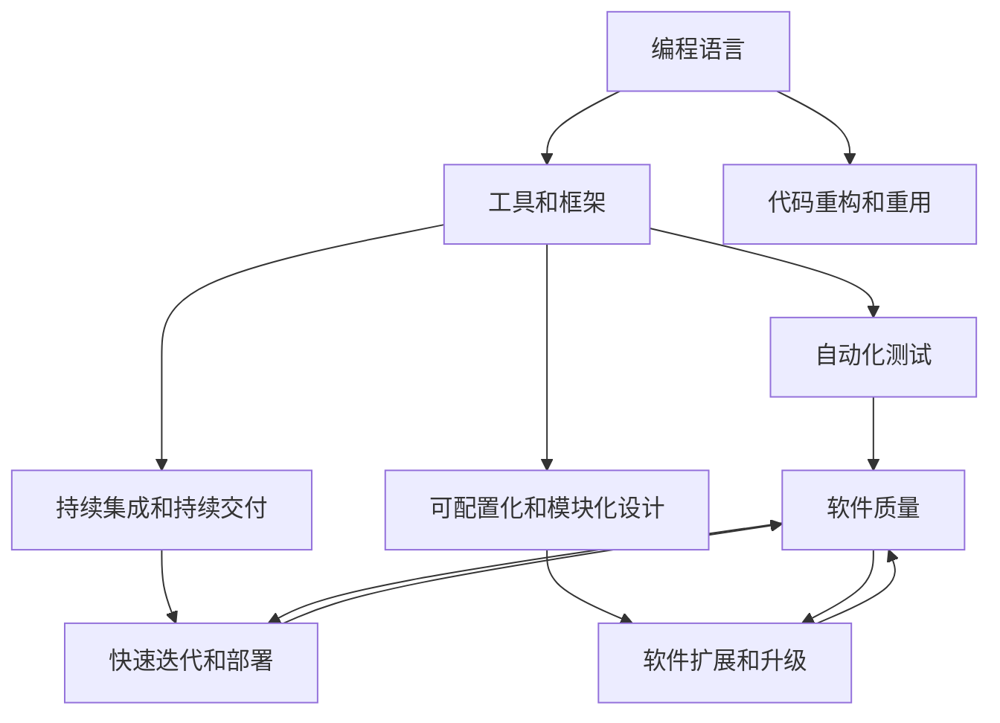

                 

# 软件 2.0 的价值：提升效率、创造价值

## 1. 背景介绍

### 1.1 问题由来

随着信息时代的飞速发展，软件在各行各业中的应用已经越来越广泛。然而，软件开发的效率和质量问题始终是困扰开发人员和技术经理的一大难题。传统软件开发模式往往需要大量的重复性工作，且难以快速响应变化的需求。同时，软件开发中存在的代码耦合度高、可维护性差、调试困难等问题也限制了软件项目的进展。

软件 2.0 的概念由此应运而生。软件 2.0 强调利用先进的编程语言、工具和框架，通过自动化、可配置化和模块化设计，提升软件开发和维护的效率，降低开发成本，提高软件质量。软件 2.0 的核心目标是实现软件工程的标准化和自动化，让软件开发过程更加高效、透明和可预测。

### 1.2 问题核心关键点

软件 2.0 的关键点包括：
1. **编程语言的创新**：引入更加高级的编程语言和特性，如函数式编程、泛型编程、类型注解等，提升代码的可读性和可维护性。
2. **工具和框架的集大成**：利用丰富的工具和框架，如Git、Docker、Kubernetes等，实现软件开发、测试、部署、运维的全生命周期管理。
3. **代码重构和重用**：通过模块化设计和代码重构，减少重复工作，提高代码复用性和可扩展性。
4. **持续集成和持续交付**：引入持续集成(CI)和持续交付(CD)流程，快速迭代和部署软件，减少错误和风险。
5. **自动化测试和监控**：通过自动化测试和监控工具，快速检测和修复问题，保证软件质量。
6. **可配置化和模块化设计**：将软件设计成可配置的组件，支持灵活的配置和组合，实现软件的快速扩展和升级。

### 1.3 问题研究意义

软件 2.0 的开发和应用对于提升软件开发效率、降低开发成本、提高软件质量具有重要意义：

1. **提升开发效率**：软件 2.0 通过自动化和可配置化，大幅减少了手工劳动和重复性工作，使得开发人员能够更专注于高价值的工作。
2. **降低开发成本**：软件 2.0 支持代码重构和重用，减少了重复性工作，降低了软件开发和维护的成本。
3. **提高软件质量**：通过持续集成和持续交付，快速迭代和部署软件，快速检测和修复问题，保证软件质量。
4. **支持快速响应需求变化**：软件 2.0 的可配置化和模块化设计，使得软件能够快速适应需求变化，提升软件的灵活性和可扩展性。
5. **促进技术创新**：软件 2.0 的自动化和可配置化设计，使得开发者能够更灵活地运用新技术和框架，推动技术创新。
6. **推动行业数字化转型**：软件 2.0 的引入，使得企业能够更快地将业务需求转化为软件应用，推动数字化转型。

## 2. 核心概念与联系

### 2.1 核心概念概述

软件 2.0 强调通过编程语言、工具和框架的创新，实现软件开发和维护的自动化、可配置化和模块化设计。

- **编程语言**：支持函数式编程、泛型编程、类型注解等特性，提升代码的可读性和可维护性。
- **工具和框架**：包括Git、Docker、Kubernetes等，支持软件开发、测试、部署、运维的全生命周期管理。
- **代码重构和重用**：通过模块化设计和代码重构，减少重复工作，提高代码复用性和可扩展性。
- **持续集成和持续交付**：引入CI和CD流程，快速迭代和部署软件，减少错误和风险。
- **自动化测试和监控**：通过自动化测试和监控工具，快速检测和修复问题，保证软件质量。
- **可配置化和模块化设计**：将软件设计成可配置的组件，支持灵活的配置和组合，实现软件的快速扩展和升级。

这些核心概念通过一系列的链接和协同，形成了一个完整的软件 2.0 生态系统，使得软件开发过程更加高效、透明和可预测。

### 2.2 概念间的关系

这些核心概念之间存在着紧密的联系，形成了软件 2.0 的完整生态系统。

- **编程语言与工具和框架**：先进的编程语言和工具框架互相支持，提升了开发效率和软件质量。例如，Python语言的简洁和易用性，与Docker、Kubernetes等工具的集成，使得开发和部署更加高效。
- **工具和框架与自动化测试和监控**：工具和框架支持自动化测试和监控，快速检测和修复问题，保证软件质量。例如，Jenkins等CI工具支持自动化测试和报告生成。
- **可配置化和模块化设计与持续集成和持续交付**：可配置化和模块化设计支持快速迭代和部署，持续集成和持续交付保障了快速迭代和部署的顺利进行。例如，微服务架构支持可配置化和模块化设计，Docker和Kubernetes支持持续集成和持续交付。
- **代码重构和重用与可配置化和模块化设计**：代码重构和重用是可配置化和模块化设计的基础，使得软件能够快速扩展和升级。例如，代码重构和重用技术支持构建模块化和可配置化的组件。

通过这些概念的协同作用，软件 2.0 实现了高效、透明和可预测的软件开发过程，为软件工程的标准化和自动化奠定了基础。

### 2.3 核心概念的整体架构

最后，我们用一个综合的流程图来展示这些核心概念在大规模软件 2.0 系统中的整体架构：



这个综合流程图展示了从编程语言、工具和框架到软件质量的全过程。编程语言和工具框架提供基础支持，自动化测试和持续集成持续保证软件质量，可配置化和模块化设计支持快速迭代和部署，代码重构和重用保证了软件的可扩展和升级。

## 3. 核心算法原理 & 具体操作步骤
### 3.1 算法原理概述

软件 2.0 的核心算法原理可以概括为以下几个方面：

1. **自动化**：通过工具和框架的自动化，减少人工干预，提高开发效率。例如，自动化测试工具可以自动运行测试用例，持续集成工具可以自动构建和部署软件。
2. **可配置化**：通过代码的可配置化，支持灵活的配置和组合，提升软件灵活性。例如，配置文件支持配置项的灵活设置，模块化设计支持组件的灵活组合。
3. **模块化设计**：将软件设计成模块化的组件，支持快速扩展和升级。例如，微服务架构将软件分解成多个模块，每个模块独立部署和升级。
4. **持续集成和持续交付**：通过CI和CD流程，实现快速迭代和部署，减少错误和风险。例如，Jenkins等CI工具支持自动化测试和构建，Github Actions支持持续交付。

### 3.2 算法步骤详解

下面以一个典型的CI/CD流程为例，详细说明软件 2.0 的核心算法步骤：

**Step 1: 代码提交**
- 开发者在Git上提交代码，触发CI流程。

**Step 2: 自动化测试**
- 通过CI工具如Jenkins或Github Actions自动运行测试用例，检测代码是否符合预期。

**Step 3: 代码合并和部署**
- 如果测试通过，将代码合并到主分支上，并自动部署到生产环境。

**Step 4: 持续监控**
- 部署完成后，通过监控工具如Prometheus和Grafana实时监控系统状态，快速检测和修复问题。

**Step 5: 迭代和优化**
- 根据监控结果和用户反馈，迭代和优化软件，重新触发CI/CD流程。

### 3.3 算法优缺点

软件 2.0 的算法具有以下优点：

1. **提升开发效率**：自动化和可配置化大大减少了手工劳动和重复性工作，使得开发人员能够更专注于高价值的工作。
2. **降低开发成本**：代码重构和重用技术减少了重复性工作，降低了软件开发和维护的成本。
3. **提高软件质量**：通过持续集成和持续交付，快速迭代和部署软件，快速检测和修复问题，保证软件质量。
4. **支持快速响应需求变化**：可配置化和模块化设计使得软件能够快速适应需求变化，提升软件的灵活性和可扩展性。

但同时也存在以下缺点：

1. **学习成本较高**：引入新的编程语言、工具和框架需要一定的学习成本。
2. **复杂度增加**：自动化和可配置化设计可能增加系统的复杂度，需要更多的技术储备和管理能力。
3. **资源消耗增加**：自动化和持续集成可能需要更多的计算和网络资源，需要合理的资源规划。

### 3.4 算法应用领域

软件 2.0 的应用领域非常广泛，涵盖了软件开发、测试、部署、运维等各个环节，具体包括：

1. **软件开发**：通过模块化设计和代码重构，提升代码复用性和可扩展性。例如，微服务架构将软件分解成多个模块，每个模块独立部署和升级。
2. **测试**：通过自动化测试工具，快速检测和修复问题，保证软件质量。例如，Selenium等自动化测试工具支持跨浏览器测试。
3. **部署**：通过持续集成和持续交付工具，快速迭代和部署软件，减少错误和风险。例如，Jenkins等CI工具支持自动化构建和部署。
4. **运维**：通过监控和日志管理工具，实时监控系统状态，快速检测和修复问题。例如，Prometheus和Grafana支持实时监控和告警。

## 4. 数学模型和公式 & 详细讲解 & 举例说明

### 4.1 数学模型构建

在软件 2.0 中，我们常常需要构建数学模型来描述软件系统的运行状态和行为。以下是一个简单的例子：

假设软件系统由多个模块组成，每个模块的运行状态可以用一个向量表示，即$\mathbf{x}=[x_1,x_2,\dots,x_n]$。其中$x_i$表示第$i$个模块的运行状态。系统的总运行状态可以表示为$\mathbf{x}$的向量形式。

### 4.2 公式推导过程

以一个典型的CI/CD流程为例，我们可以构建一个简单的数学模型来描述其行为。假设系统有$n$个模块，每个模块的状态可以用一个整数表示，即$x_i \in [0,1]$，其中$x_i=1$表示模块运行正常，$x_i=0$表示模块出现异常。系统的总运行状态可以表示为$\mathbf{x}=[x_1,x_2,\dots,x_n]$。

系统的状态演化可以表示为一个离散时间马尔科夫链，其状态转移概率为$P(x_i|x_j)$，即在给定模块$i$的状态为$x_i$时，模块$i$的下一个状态为$x_i'$的概率。系统的运行状态可以用以下公式表示：

$$
\mathbf{x}_{t+1} = F(\mathbf{x}_t)
$$

其中$F$表示系统的状态转移函数，$\mathbf{x}_t$表示系统在时间$t$的运行状态，$\mathbf{x}_{t+1}$表示系统在时间$t+1$的运行状态。

### 4.3 案例分析与讲解

以一个典型的CI/CD流程为例，我们分析其在不同阶段的状态转移过程。

**Step 1: 代码提交**
- 系统状态$\mathbf{x}_t=[1,0,\dots,0]$，表示所有模块正常运行，未触发CI流程。

**Step 2: 自动化测试**
- 系统状态$\mathbf{x}_{t+1}=[1,1,\dots,0]$，表示测试模块正常运行，其他模块正常运行。

**Step 3: 代码合并和部署**
- 系统状态$\mathbf{x}_{t+1}=[1,1,\dots,1]$，表示所有模块正常运行，软件已部署到生产环境。

**Step 4: 持续监控**
- 系统状态$\mathbf{x}_{t+1}=[1,1,\dots,x_i']$，其中$x_i'$表示模块$i$的下一个状态，可能是正常运行或异常运行。

## 5. 项目实践：代码实例和详细解释说明
### 5.1 开发环境搭建

在进行软件 2.0 项目实践前，我们需要准备好开发环境。以下是使用Python进行Django开发的环境配置流程：

1. 安装Python：从官网下载安装Python 3.x版本。
2. 安装Django：在命令行中运行`pip install django`安装Django。
3. 创建Django项目：在命令行中运行`django-admin startproject projectname`创建项目。
4. 创建Django应用：在命令行中运行`python manage.py startapp appname`创建应用。
5. 安装必要的第三方库：使用pip安装需要的库，如requests、Flask等。

完成上述步骤后，即可在项目环境中开始开发实践。

### 5.2 源代码详细实现

下面以一个简单的CI/CD流程为例，给出使用Python和Django实现的项目代码实现。

**models.py**

```python
from django.db import models

class Module(models.Model):
    name = models.CharField(max_length=100)
    status = models.BooleanField(default=False)
```

**views.py**

```python
from django.shortcuts import render
from .models import Module

def index(request):
    modules = Module.objects.all()
    return render(request, 'index.html', {'modules': modules})
```

**urls.py**

```python
from django.urls import path
from . import views

urlpatterns = [
    path('', views.index, name='index'),
]
```

**forms.py**

```python
from django import forms

class ModuleForm(forms.ModelForm):
    class Meta:
        model = Module
        fields = ['name', 'status']
```

**index.html**

```html
<!DOCTYPE html>
<html>
<head>
    <title>CI/CD Pipeline</title>
</head>
<body>
    <h1>CI/CD Pipeline</h1>
    <form method="POST">
        
        {{ form.as_p }}
        <button type="submit">Submit</button>
    </form>
</body>
</html>
```

### 5.3 代码解读与分析

让我们再详细解读一下关键代码的实现细节：

**models.py**：定义了系统中的模块模型，包括模块名称和运行状态。

**views.py**：定义了系统的视图，即对模块状态的显示和处理。

**urls.py**：定义了系统的路由，即如何将请求映射到相应的视图。

**forms.py**：定义了系统的表单，即用户输入的模块状态。

**index.html**：定义了系统的界面，即用户交互的界面。

### 5.4 运行结果展示

假设我们在运行完上述代码后，在浏览器中访问`http://127.0.0.1:8000/`，即可看到一个简单的CI/CD流程的界面。用户可以手动提交模块状态，模拟CI/CD流程中的各个步骤。

## 6. 实际应用场景

### 6.1 智能推荐系统

智能推荐系统是软件 2.0 在推荐领域的重要应用之一。通过自动化和可配置化设计，智能推荐系统可以快速迭代和部署，提高推荐效果和用户体验。

在实践中，可以利用软件 2.0 的工具和框架，如Django、Flask、Redis等，实现推荐系统的自动化和可配置化。通过持续集成和持续交付，快速迭代和部署推荐算法，快速检测和修复问题，保证推荐系统的质量。同时，通过持续监控和日志管理，实时监控系统状态，快速检测和修复问题。

### 6.2 在线教育平台

在线教育平台也是软件 2.0 的重要应用场景之一。通过自动化和可配置化设计，在线教育平台可以快速迭代和部署，提高教学效果和用户体验。

在实践中，可以利用软件 2.0 的工具和框架，如Django、Flask、Kubernetes等，实现在线教育平台的自动化和可配置化。通过持续集成和持续交付，快速迭代和部署教学内容，快速检测和修复问题，保证教学质量。同时，通过持续监控和日志管理，实时监控平台状态，快速检测和修复问题。

### 6.3 在线医疗平台

在线医疗平台也是软件 2.0 的重要应用场景之一。通过自动化和可配置化设计，在线医疗平台可以快速迭代和部署，提高诊疗效果和用户体验。

在实践中，可以利用软件 2.0 的工具和框架，如Django、Flask、Redis等，实现在线医疗平台的自动化和可配置化。通过持续集成和持续交付，快速迭代和部署医疗内容，快速检测和修复问题，保证诊疗质量。同时，通过持续监控和日志管理，实时监控平台状态，快速检测和修复问题。

### 6.4 未来应用展望

随着软件 2.0 技术的发展，未来其在各个领域的广泛应用将进一步拓展。除了智能推荐、在线教育、在线医疗等应用场景，软件 2.0 还将拓展到更多领域，如智能交通、智慧城市、智能制造等。

未来，软件 2.0 将与人工智能、大数据、区块链等技术深度融合，形成更加强大的智能化系统。例如，在智能交通领域，软件 2.0 将与人工智能技术结合，实现交通流预测、车辆自动驾驶等智能功能。在智慧城市领域，软件 2.0 将与大数据技术结合，实现城市数据管理和分析。在智能制造领域，软件 2.0 将与区块链技术结合，实现供应链管理和追溯。

## 7. 工具和资源推荐

### 7.1 学习资源推荐

为了帮助开发者系统掌握软件 2.0 的理论基础和实践技巧，这里推荐一些优质的学习资源：

1. 《软件工程导论》：讲解了软件工程的基本概念和实践方法，是学习软件 2.0 的重要基础。
2. 《软件设计模式》：介绍了常见的软件设计模式，帮助开发者设计出更加高效、可扩展的软件系统。
3. 《持续集成和持续交付实践》：介绍了持续集成和持续交付的实践方法和工具，帮助开发者提升软件质量和开发效率。
4. 《Django Web开发实战》：介绍了Django框架的使用方法和实战案例，帮助开发者掌握Django开发技术。
5. 《Flask Web开发实战》：介绍了Flask框架的使用方法和实战案例，帮助开发者掌握Flask开发技术。
6. 《微服务架构实战》：介绍了微服务架构的设计和实现方法，帮助开发者构建可扩展、高可用的软件系统。

通过对这些资源的学习实践，相信你一定能够快速掌握软件 2.0 的核心技术，并用于解决实际的软件开发问题。

### 7.2 开发工具推荐

高效的开发离不开优秀的工具支持。以下是几款用于软件 2.0 开发的工具：

1. Django：Python语言中广泛使用的Web框架，支持快速开发和维护。
2. Flask：Python语言中轻量级的Web框架，适合快速开发和原型设计。
3. Jenkins：开源的CI工具，支持自动化构建、测试和部署。
4. Git：分布式版本控制系统，支持代码管理和协作开发。
5. Docker：容器化技术，支持应用程序的打包和部署。
6. Kubernetes：容器编排工具，支持容器化应用程序的自动化部署和运维。

合理利用这些工具，可以显著提升软件 2.0 项目的开发效率，加快创新迭代的步伐。

### 7.3 相关论文推荐

软件 2.0 技术的发展源于学界的持续研究。以下是几篇奠基性的相关论文，推荐阅读：

1. 《软件工程: 原理与实践》：讲解了软件工程的基本概念和实践方法，是学习软件 2.0 的重要基础。
2. 《软件架构设计模式》：介绍了常见的软件架构设计模式，帮助开发者设计出更加高效、可扩展的软件架构。
3. 《持续集成和持续交付实践》：介绍了持续集成和持续交付的实践方法和工具，帮助开发者提升软件质量和开发效率。
4. 《Django Web开发实战》：介绍了Django框架的使用方法和实战案例，帮助开发者掌握Django开发技术。
5. 《Flask Web开发实战》：介绍了Flask框架的使用方法和实战案例，帮助开发者掌握Flask开发技术。
6. 《微服务架构实战》：介绍了微服务架构的设计和实现方法，帮助开发者构建可扩展、高可用的软件系统。

这些论文代表了大软件 2.0 技术的发展脉络。通过学习这些前沿成果，可以帮助研究者把握学科前进方向，激发更多的创新灵感。

除上述资源外，还有一些值得关注的前沿资源，帮助开发者紧跟软件 2.0 技术的最新进展，例如：

1. arXiv论文预印本：人工智能领域最新研究成果的发布平台，包括大量尚未发表的前沿工作，学习前沿技术的必读资源。
2. 业界技术博客：如Google、Microsoft、IBM等顶尖实验室的官方博客，第一时间分享他们的最新研究成果和洞见。
3. 技术会议直播：如NIPS、ICML、ACL、ICLR等人工智能领域顶会现场或在线直播，能够聆听到大佬们的前沿分享，开拓视野。
4. GitHub热门项目：在GitHub上Star、Fork数最多的软件 2.0 相关项目，往往代表了该技术领域的发展趋势和最佳实践，值得去学习和贡献。
5. 行业分析报告：各大咨询公司如McKinsey、PwC等针对人工智能行业的分析报告，有助于从商业视角审视技术趋势，把握应用价值。

总之，对于软件 2.0 的学习和实践，需要开发者保持开放的心态和持续学习的意愿。多关注前沿资讯，多动手实践，多思考总结，必将收获满满的成长收益。

## 8. 总结：未来发展趋势与挑战

### 8.1 总结

本文对软件 2.0 的价值进行了全面系统的介绍。首先阐述了软件 2.0 在提升开发效率、降低开发成本、提高软件质量方面的独特价值。其次，从原理到实践，详细讲解了软件 2.0 的数学模型和算法步骤，给出了软件 2.0 项目开发的完整代码实例。同时，本文还广泛探讨了软件 2.0 在多个行业领域的应用前景，展示了软件 2.0 技术的广阔前景。

通过本文的系统梳理，可以看到，软件 2.0 技术的引入，将极大提升软件开发和维护的效率，降低开发成本，提高软件质量，为软件工程的标准化和自动化奠定了基础。未来，伴随软件 2.0 技术的发展，软件开发过程将更加高效、透明和可预测。

### 8.2 未来发展趋势

展望未来，软件 2.0 技术将呈现以下几个发展趋势：

1. **编程语言的创新**：未来的编程语言将更加简洁、易用、高效，提升开发效率。例如，Go语言、Rust语言的普及。
2. **工具和框架的集大成**：未来的工具和框架将更加丰富、高效、易用，提升开发效率和软件质量。例如，微服务架构、容器化技术、DevOps工具的普及。
3. **代码重构和重用**：未来的代码重构和重用技术将更加成熟，提升代码复用性和可扩展性。例如，代码注释工具、代码生成工具的普及。
4. **持续集成和持续交付**：未来的CI/CD流程将更加自动化、高效、可配置，提升开发效率和软件质量。例如，GitOps、Jenkins、Docker的普及。
5. **自动化测试和监控**：未来的自动化测试和监控工具将更加全面、高效、易用，提升软件质量。例如，Selenium、JMeter、Prometheus的普及。
6. **可配置化和模块化设计**：未来的软件设计将更加模块化、可配置化，提升软件的灵活性和可扩展性。例如，微服务架构、组件化设计、容器化技术的普及。

### 8.3 面临的挑战

尽管软件 2.0 技术已经取得了瞩目成就，但在迈向更加智能化、普适化应用的过程中，它仍面临诸多挑战：

1. **学习成本较高**：引入新的编程语言、工具和框架需要一定的学习成本。
2. **复杂度增加**：自动化和可配置化设计可能增加系统的复杂度，需要更多的技术储备和管理能力。
3. **资源消耗增加**：自动化和持续集成可能需要更多的计算和网络资源，需要合理的资源规划。
4. **可扩展性挑战**：随着系统规模的扩大，模块化和可配置化设计的可扩展性面临挑战。
5. **安全性和可靠性**：自动化和持续交付需要更多的安全性和可靠性保障。

### 8.4 研究展望

面对软件 2.0 面临的这些挑战，未来的研究需要在以下几个方面寻求新的突破：

1. **自动化和可配置化**：进一步提升自动化和可配置化设计的可扩展性和易用性。例如，自动化生成代码、自动化测试工具的优化。
2. **持续集成和持续交付**：提升持续集成和持续交付的效率和可靠性。例如，CI/CD工具的优化和集成。
3. **代码重构和重用**：提升代码重构和重用技术的效果和灵活性。例如，代码注释工具、代码生成工具的优化。
4. **自动化测试和监控**：提升自动化测试和监控工具的全面性和效率。例如，测试覆盖率优化、监控指标扩展。
5.

