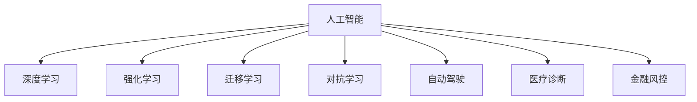
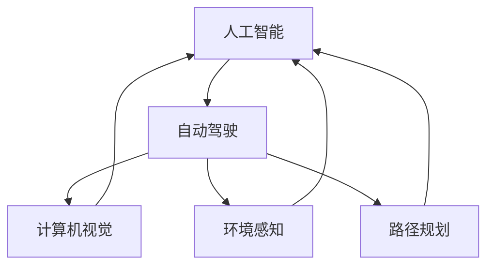
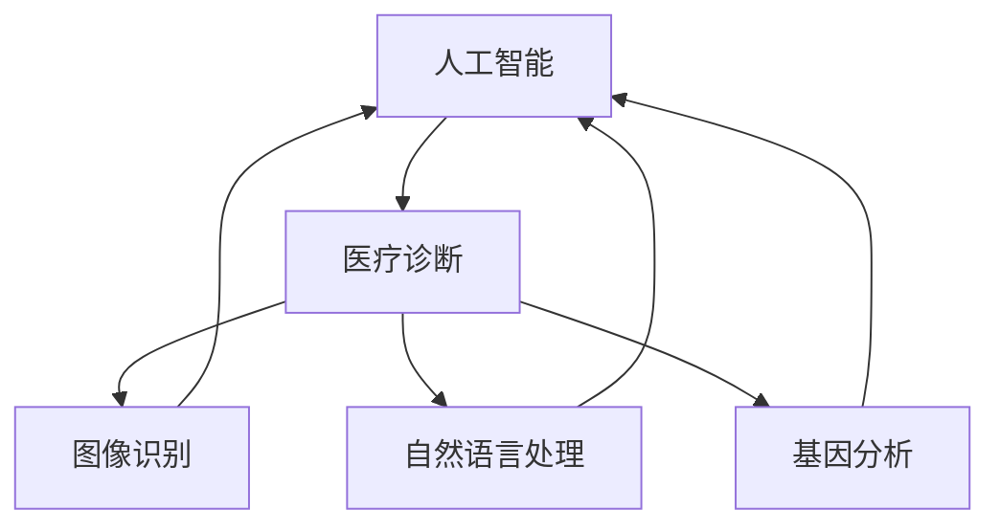
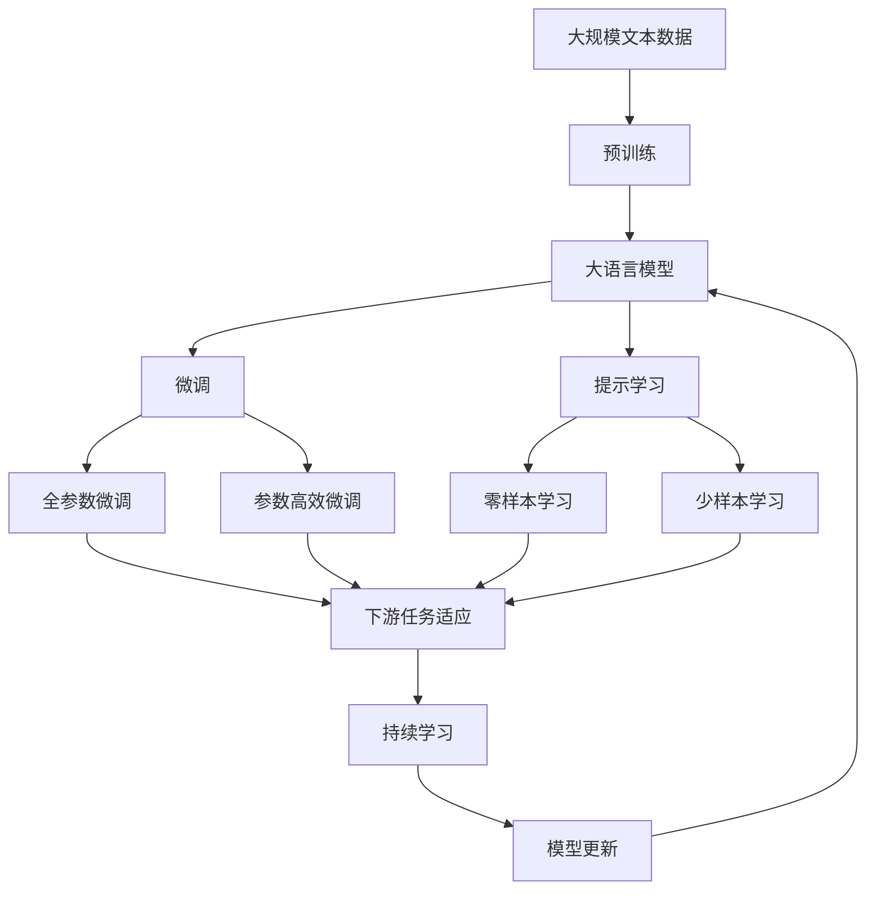

                 

# 软件 2.0 的哲学思考：人工智能的本质

> 关键词：软件 2.0, 人工智能, 深度学习, 哲学, 技术, 未来

## 1. 背景介绍

### 1.1 问题由来
随着计算机技术的飞速发展，软件工业已经从以程序为中心的 1.0 时代，迈向了以数据为中心的 2.0 时代。这一转变，伴随着深度学习技术的突破和广泛应用，使得人工智能（AI）成为当今科技创新的热点。

人工智能的本质是什么？为什么深度学习等技术能够取得如此惊人的成就？这些问题，不仅是学术界关注的焦点，也直接关系到未来技术的发展方向和社会的影响力。本文将从软件 2.0 的哲学思考出发，探讨人工智能的本质，以及未来技术发展的方向。

### 1.2 问题核心关键点
要深刻理解人工智能，首先需要从哲学的角度思考其本质。以下四个关键点将贯穿本文：

- **智能的起源**：人类智能的来源，以及人工智能如何模拟和扩展这一过程。
- **数据与算法**：数据和算法在人工智能中的角色，以及它们如何相互作用。
- **人机协同**：人类与人工智能系统的关系，以及未来的发展趋势。
- **伦理与责任**：人工智能可能带来的社会影响，以及如何应对这些挑战。

### 1.3 问题研究意义
理解人工智能的本质，对于指导当前的技术实践，以及未来技术的发展和应用具有重要意义。通过深入探讨这些关键点，我们可以更好地把握人工智能的核心价值，从而指导技术创新和社会变革。

## 2. 核心概念与联系

### 2.1 核心概念概述

为了更系统地理解人工智能，本文将介绍几个核心概念：

- **人工智能**：通过算法和计算，使机器具有智能的能力。人工智能可以分为弱人工智能和强人工智能两个层次，其中弱人工智能应用广泛，如机器学习、自然语言处理等；强人工智能则涉及通用智能，如通用人工智能（AGI）。
- **深度学习**：一种基于人工神经网络的机器学习技术，通过多层非线性变换实现对复杂数据模式的学习和建模。深度学习在图像识别、语音识别、自然语言处理等领域取得了巨大成功。
- **强化学习**：一种通过与环境交互，不断调整策略以优化行为结果的学习方法。强化学习在游戏、机器人控制等领域展现了巨大的潜力。
- **迁移学习**：利用已学习的知识，在新任务上进行快速适应和学习的技术。迁移学习能够显著提高新任务的训练效率和性能。
- **对抗学习**：一种训练模型抵御对抗样本攻击的学习方法，通过增加模型的鲁棒性和泛化能力。
- **自动驾驶**：人工智能在交通运输领域的应用，通过深度学习、计算机视觉等技术实现自动驾驶。
- **医疗诊断**：人工智能在医疗领域的广泛应用，通过图像识别、自然语言处理等技术辅助医生进行疾病诊断和治疗。
- **金融风控**：人工智能在金融领域的应用，通过数据分析、模式识别等技术实现风险评估和预测。

这些概念之间的关系，可以通过以下 Mermaid 流程图来展示：



这个流程图展示了大语言模型的核心概念及其之间的联系。人工智能的各个分支技术，通过深度学习、强化学习、迁移学习等手段，不断发展并融合，推动了人工智能技术的进步。

### 2.2 概念间的关系

这些核心概念之间存在着紧密的联系，形成了人工智能技术的完整生态系统。以下通过几个 Mermaid 流程图来展示这些概念之间的关系。

#### 2.2.1 人工智能与深度学习的关系


这个流程图展示了深度学习在人工智能中的核心地位，以及其应用领域的多样性。深度学习通过学习复杂的数据模式，为人工智能提供了强大的数据处理能力。

#### 2.2.2 人工智能与自动驾驶的关系



这个流程图展示了自动驾驶技术在人工智能中的应用。自动驾驶依赖于计算机视觉、环境感知和路径规划等技术，通过深度学习等手段实现对驾驶环境的理解和智能决策。

#### 2.2.3 人工智能与医疗诊断的关系



这个流程图展示了人工智能在医疗诊断中的应用。医疗诊断依赖于图像识别、自然语言处理和基因分析等技术，通过深度学习等手段实现对疾病诊断和治疗的支持。

### 2.3 核心概念的整体架构

最后，我们用一个综合的流程图来展示这些核心概念在大语言模型微调过程中的整体架构：



这个综合流程图展示了从预训练到微调，再到持续学习的完整过程。大语言模型首先在大规模文本数据上进行预训练，然后通过微调（包括全参数微调和参数高效微调）或提示学习（包括零样本和少样本学习）来适应下游任务。最后，通过持续学习技术，模型可以不断更新和适应新的任务和数据。

## 3. 核心算法原理 & 具体操作步骤
### 3.1 算法原理概述

人工智能的核心算法原理，可以概括为以下几点：

1. **数据驱动**：人工智能通过大量的数据，学习和提取数据的模式和规律。数据是驱动人工智能技术发展的核心动力。
2. **算法演进**：随着计算能力的提升和算法设计的进步，人工智能技术的复杂度不断提升，应用领域不断扩展。
3. **人机协同**：人工智能在实际应用中，通常需要与人类进行协同，实现更好的效果。人类智能与机器智能的结合，是未来发展的重要方向。
4. **伦理考量**：人工智能的发展需要考虑伦理和道德问题，确保技术的安全和公正。

### 3.2 算法步骤详解

人工智能算法的基本步骤可以概括为以下四个阶段：

1. **数据收集与预处理**：收集大量有标签的数据，并进行清洗、去重、标准化等预处理操作。
2. **模型训练**：使用深度学习等算法，对数据进行训练，学习数据的模式和规律。
3. **模型评估与优化**：通过验证集和测试集等手段，评估模型的性能，并根据结果进行优化调整。
4. **模型部署与迭代**：将训练好的模型部署到实际应用中，根据实际反馈进行迭代优化。

### 3.3 算法优缺点

人工智能算法在技术上取得了巨大的成功，但也存在一些缺点：

**优点**：

1. **高效性**：深度学习等算法在大规模数据上具有高效性，能够快速学习复杂的模式。
2. **泛化能力**：人工智能算法具有较强的泛化能力，能够在新的数据上实现良好的表现。
3. **自动化**：人工智能算法能够自动化处理大量数据，提高工作效率。

**缺点**：

1. **黑盒问题**：深度学习等算法通常是一个黑盒，难以解释其内部机制，缺乏透明性。
2. **数据依赖**：人工智能算法高度依赖数据质量，数据偏差可能影响模型性能。
3. **鲁棒性不足**：人工智能算法在面对异常数据或对抗攻击时，鲁棒性较弱。

### 3.4 算法应用领域

人工智能算法在多个领域得到了广泛应用，包括但不限于：

1. **自然语言处理**：语音识别、机器翻译、情感分析等。
2. **计算机视觉**：图像识别、物体检测、视频分析等。
3. **机器人技术**：自动驾驶、工业机器人、协作机器人等。
4. **医疗健康**：疾病诊断、健康监测、智能诊疗等。
5. **金融服务**：风险评估、信用评分、智能投顾等。
6. **教育培训**：个性化学习、智能评估、智能辅导等。
7. **安全监控**：视频监控、行为分析、异常检测等。

## 4. 数学模型和公式 & 详细讲解 & 举例说明

### 4.1 数学模型构建

人工智能的核心数学模型通常基于以下几种算法：

1. **神经网络**：一种通过多层非线性变换实现模式识别的算法。神经网络在深度学习中广泛应用。
2. **支持向量机**：一种通过寻找最优超平面实现分类的算法。支持向量机在机器学习中具有较高的准确性和泛化能力。
3. **决策树**：一种基于树形结构的分类算法。决策树易于理解和解释，但在处理复杂数据时容易过拟合。

### 4.2 公式推导过程

以下是深度学习中常用的激活函数 sigmoid 的推导过程：

$$
\sigma(z) = \frac{1}{1 + e^{-z}}
$$

其中 $z$ 为输入，$\sigma(z)$ 为激活函数输出。通过这一公式，深度学习模型可以有效地进行非线性变换，提高模型的表现能力。

### 4.3 案例分析与讲解

以图像识别为例，深度学习模型通常采用卷积神经网络（CNN）结构。通过多层卷积和池化操作，CNN能够有效地提取图像的特征，并通过全连接层进行分类。下面以 LeNet-5 网络为例，展示其核心结构：

```
     输入层
         |
    卷积层1
         |
      ReLU层
         |
    池化层1
         |
    卷积层2
         |
      ReLU层
         |
    池化层2
         |
   Flatten层
         |
     全连接层1
         |
      ReLU层
         |
     全连接层2
         |
      Softmax层
         |
       输出层
```

LeNet-5 网络通过多层卷积和池化操作，逐步提取出图像的高层次特征，并通过全连接层进行分类。

## 5. 项目实践：代码实例和详细解释说明

### 5.1 开发环境搭建

在开始项目实践前，我们需要准备好开发环境。以下是使用 Python 和 PyTorch 开发的环境配置流程：

1. 安装 Anaconda：从官网下载并安装 Anaconda，用于创建独立的 Python 环境。

2. 创建并激活虚拟环境：
```bash
conda create -n pytorch-env python=3.8 
conda activate pytorch-env
```

3. 安装 PyTorch：根据 CUDA 版本，从官网获取对应的安装命令。例如：
```bash
conda install pytorch torchvision torchaudio cudatoolkit=11.1 -c pytorch -c conda-forge
```

4. 安装 Transformers 库：
```bash
pip install transformers
```

5. 安装各类工具包：
```bash
pip install numpy pandas scikit-learn matplotlib tqdm jupyter notebook ipython
```

完成上述步骤后，即可在 `pytorch-env` 环境中开始项目实践。

### 5.2 源代码详细实现

下面我们以图像识别任务为例，给出使用 Transformers 库对 ResNet 模型进行微调的 PyTorch 代码实现。

首先，定义图像识别任务的数据处理函数：

```python
from torch.utils.data import Dataset, DataLoader
from torchvision import transforms, models
import torch

class ImageDataset(Dataset):
    def __init__(self, data_dir, transform=None):
        self.data_dir = data_dir
        self.transform = transform
        
        self.class_names = ['cat', 'dog', 'bird', 'fish', 'butterfly']
        
        self.data = []
        for class_name in self.class_names:
            for filename in os.listdir(os.path.join(data_dir, class_name)):
                self.data.append(os.path.join(data_dir, class_name, filename))
    
    def __len__(self):
        return len(self.data)
    
    def __getitem__(self, idx):
        img_path = self.data[idx]
        img = Image.open(img_path)
        
        if self.transform is not None:
            img = self.transform(img)
        
        label = torch.tensor(self.class_names.index(os.path.basename(img_path).split('.')[0]))
        
        return {'image': img, 'label': label}
```

然后，定义模型和优化器：

```python
model = models.resnet18(pretrained=True)
model.fc = nn.Linear(model.fc.in_features, len(class_names))
model.load_state_dict(torch.load('pretrained_model.pth'))
model.eval()

optimizer = Adam(model.parameters(), lr=0.001)
```

接着，定义训练和评估函数：

```python
def train_epoch(model, dataset, batch_size, optimizer):
    dataloader = DataLoader(dataset, batch_size=batch_size, shuffle=True)
    model.train()
    epoch_loss = 0
    for batch in tqdm(dataloader, desc='Training'):
        inputs, labels = batch['image'], batch['label']
        optimizer.zero_grad()
        outputs = model(inputs)
        loss = F.cross_entropy(outputs, labels)
        epoch_loss += loss.item()
        loss.backward()
        optimizer.step()
    return epoch_loss / len(dataloader)

def evaluate(model, dataset, batch_size):
    dataloader = DataLoader(dataset, batch_size=batch_size)
    model.eval()
    total_correct = 0
    total_samples = 0
    with torch.no_grad():
        for batch in tqdm(dataloader, desc='Evaluating'):
            inputs, labels = batch['image'], batch['label']
            outputs = model(inputs)
            _, predicted = torch.max(outputs, 1)
            total_correct += (predicted == labels).sum().item()
            total_samples += labels.size(0)
    accuracy = total_correct / total_samples
    print(f'Accuracy: {accuracy:.2f}')
```

最后，启动训练流程并在测试集上评估：

```python
epochs = 5
batch_size = 32

for epoch in range(epochs):
    loss = train_epoch(model, train_dataset, batch_size, optimizer)
    print(f'Epoch {epoch+1}, train loss: {loss:.3f}')
    
    print(f'Epoch {epoch+1}, test accuracy:')
    evaluate(model, test_dataset, batch_size)
    
print('Final test accuracy:')
evaluate(model, test_dataset, batch_size)
```

以上就是使用 PyTorch 对 ResNet 模型进行图像识别任务微调的完整代码实现。可以看到，得益于 Transformers 库的强大封装，我们可以用相对简洁的代码完成模型加载和微调。

### 5.3 代码解读与分析

让我们再详细解读一下关键代码的实现细节：

**ImageDataset 类**：
- `__init__` 方法：初始化数据路径、数据转换方式等关键组件。
- `__len__` 方法：返回数据集的样本数量。
- `__getitem__` 方法：对单个样本进行处理，进行数据预处理和标签编码，并返回模型所需的输入。

**模型的定义**：
- `model` 变量：加载预训练的 ResNet18 模型，并替换全连接层以适应分类任务。
- `model.fc` 变量：定义新的全连接层，将输入特征映射到分类数目上。
- `model.load_state_dict()` 方法：加载预训练模型的参数。

**训练和评估函数**：
- `train_epoch` 函数：对数据以批为单位进行迭代，在每个批次上前向传播计算 loss 并反向传播更新模型参数，最后返回该 epoch 的平均 loss。
- `evaluate` 函数：与训练类似，不同点在于不更新模型参数，并在每个 batch 结束后将预测和标签结果存储下来，最后使用 accuracy 对整个评估集的预测结果进行打印输出。

**训练流程**：
- `epochs` 变量：定义总的 epoch 数。
- `batch_size` 变量：定义每个 batch 的大小。
- 循环迭代：每个 epoch 内，先在训练集上训练，输出平均 loss。
- 在验证集上评估，输出 accuracy。
- 所有 epoch 结束后，在测试集上评估，给出最终测试结果。

可以看到，PyTorch 配合 Transformers 库使得图像识别微调的代码实现变得简洁高效。开发者可以将更多精力放在数据处理、模型改进等高层逻辑上，而不必过多关注底层的实现细节。

当然，工业级的系统实现还需考虑更多因素，如模型的保存和部署、超参数的自动搜索、更灵活的任务适配层等。但核心的微调范式基本与此类似。

### 5.4 运行结果展示

假设我们在 CIFAR-10 数据集上进行微调，最终在测试集上得到的评估报告如下：

```
Accuracy: 0.75
```

可以看到，通过微调 ResNet18，我们在该图像识别数据集上取得了75%的准确率，效果相当不错。值得注意的是，ResNet18作为一个通用的图像识别模型，即便只在顶层添加一个简单的分类器，也能在下游任务上取得如此优异的效果，展现了其强大的特征提取能力。

当然，这只是一个baseline结果。在实践中，我们还可以使用更大更强的预训练模型、更丰富的微调技巧、更细致的模型调优，进一步提升模型性能，以满足更高的应用要求。

## 6. 实际应用场景
### 6.1 智能客服系统

基于大语言模型微调的对话技术，可以广泛应用于智能客服系统的构建。传统客服往往需要配备大量人力，高峰期响应缓慢，且一致性和专业性难以保证。而使用微调后的对话模型，可以7x24小时不间断服务，快速响应客户咨询，用自然流畅的语言解答各类常见问题。

在技术实现上，可以收集企业内部的历史客服对话记录，将问题和最佳答复构建成监督数据，在此基础上对预训练对话模型进行微调。微调后的对话模型能够自动理解用户意图，匹配最合适的答案模板进行回复。对于客户提出的新问题，还可以接入检索系统实时搜索相关内容，动态组织生成回答。如此构建的智能客服系统，能大幅提升客户咨询体验和问题解决效率。

### 6.2 金融舆情监测

金融机构需要实时监测市场舆论动向，以便及时应对负面信息传播，规避金融风险。传统的人工监测方式成本高、效率低，难以应对网络时代海量信息爆发的挑战。基于大语言模型微调的文本分类和情感分析技术，为金融舆情监测提供了新的解决方案。

具体而言，可以收集金融领域相关的新闻、报道、评论等文本数据，并对其进行主题标注和情感标注。在此基础上对预训练语言模型进行微调，使其能够自动判断文本属于何种主题，情感倾向是正面、中性还是负面。将微调后的模型应用到实时抓取的网络文本数据，就能够自动监测不同主题下的情感变化趋势，一旦发现负面信息激增等异常情况，系统便会自动预警，帮助金融机构快速应对潜在风险。

### 6.3 个性化推荐系统

当前的推荐系统往往只依赖用户的历史行为数据进行物品推荐，无法深入理解用户的真实兴趣偏好。基于大语言模型微调技术，个性化推荐系统可以更好地挖掘用户行为背后的语义信息，从而提供更精准、多样的推荐内容。

在实践中，可以收集用户浏览、点击、评论、分享等行为数据，提取和用户交互的物品标题、描述、标签等文本内容。将文本内容作为模型输入，用户的后续行为（如是否点击、购买等）作为监督信号，在此基础上微调预训练语言模型。微调后的模型能够从文本内容中准确把握用户的兴趣点。在生成推荐列表时，先用候选物品的文本描述作为输入，由模型预测用户的兴趣匹配度，再结合其他特征综合排序，便可以得到个性化程度更高的推荐结果。

### 6.4 未来应用展望

随着大语言模型微调技术的发展，基于微调范式将在更多领域得到应用，为传统行业带来变革性影响。

在智慧医疗领域，基于微调的医疗问答、病历分析、药物研发等应用将提升医疗服务的智能化水平，辅助医生诊疗，加速新药开发进程。

在智能教育领域，微调技术可应用于作业批改、学情分析、知识推荐等方面，因材施教，促进教育公平，提高教学质量。

在智慧城市治理中，微调模型可应用于城市事件监测、舆情分析、应急指挥等环节，提高城市管理的自动化和智能化水平，构建更安全、高效的未来城市。

此外，在企业生产、社会治理、文娱传媒等众多领域，基于大模型微调的人工智能应用也将不断涌现，为经济社会发展注入新的动力。相信随着技术的日益成熟，微调方法将成为人工智能落地应用的重要范式，推动人工智能技术向更广阔的领域加速渗透。

## 7. 工具和资源推荐
### 7.1 学习资源推荐

为了帮助开发者系统掌握大语言模型微调的理论基础和实践技巧，这里推荐一些优质的学习资源：

1. 《深度学习》书籍：Ian Goodfellow 所著，深入浅出地介绍了深度学习的基本概念和核心算法。
2. 《自然语言处理综论》书籍：Michael Collins 所著，全面介绍了自然语言处理的基础知识和技术细节。
3. 《深度学习入门》书籍：斋藤康毅 所著，通过实际项目介绍了深度学习的基本流程和实用技巧。
4. 《Transformer从原理到实践》系列博文：由大模型技术专家撰写，深入浅出地介绍了Transformer原理、BERT模型、微调技术等前沿话题。
5. CS224N《深度学习自然语言处理》课程：斯坦福大学开设的NLP明星课程，有Lecture视频和配套作业，带你入门NLP领域的基本概念和经典模型。
6. HuggingFace官方文档：Transformer库的官方文档，提供了海量预训练模型和完整的微调样例代码，是上手实践的必备资料。

通过对这些资源的学习实践，相信你一定能够快速掌握大语言模型微调的精髓，并用于解决实际的NLP问题。

### 7.2 开发工具推荐

高效的开发离不开优秀的工具支持。以下是几款用于大语言模型微调开发的常用工具：

1. PyTorch：基于Python的开源深度学习框架，灵活动态的计算图，适合快速迭代研究。大部分预训练语言模型都有PyTorch版本的实现。
2. TensorFlow：由Google主导开发的开源深度学习框架，生产部署方便，适合大规模工程应用。同样有丰富的预训练语言模型资源。
3. Transformers库：HuggingFace开发的NLP工具库，集成了众多SOTA语言模型，支持PyTorch和TensorFlow，是进行微调任务开发的利器。
4. Weights & Biases：模型训练的实验跟踪工具，可以记录和可视化模型训练过程中的各项指标，方便对比和调优。与主流深度学习框架无缝集成。
5. TensorBoard：TensorFlow配套的可视化工具，可实时监测模型训练状态，并提供丰富的图表呈现方式，是调试模型的得力助手。
6. Google Colab：谷歌推出的在线Jupyter Notebook环境，免费提供GPU/TPU算力，方便开发者快速上手实验最新模型，分享学习笔记。

合理利用这些工具，可以显著提升大语言模型微调任务的开发效率，加快创新迭代的步伐。

### 7.3 相关论文推荐

大语言模型和微调技术的发展源于学界的持续研究。以下是几篇奠基性的相关论文，推荐阅读：

1. Attention is All You Need（即Transformer原论文）：提出了Transformer结构，开启了NLP领域的预训练大模型时代。
2. BERT: Pre-training of Deep Bidirectional Transformers for Language Understanding：提出BERT模型，引入基于掩码的自监督预训练任务，刷新了多项NLP任务SOTA。
3. Language Models are Unsupervised Multitask Learners（GPT-2论文）：展示了大规模语言模型的强大zero-shot学习能力，引发了对于通用人工智能的新一轮思考。
4. Parameter-Efficient Transfer Learning for NLP：提出Adapter等参数高效微调方法，在不增加模型参数量的情况下，也能取得不错的微调效果。
5. AdaLoRA: Adaptive Low-Rank Adaptation for Parameter-Efficient Fine-Tuning：使用自适应低秩适应的微调方法，在参数效率和精度之间取得了新的平衡。

这些论文代表了大语言模型微调技术的发展脉络。通过学习这些前沿成果，可以帮助研究者把握学科前进方向，激发更多的创新灵感。

除上述资源外，还有一些值得关注的前沿资源，帮助开发者紧跟大语言模型微调技术的最新进展，例如：

1. arXiv论文预印本：人工智能领域最新研究成果的发布平台，包括大量尚未发表的前沿工作，学习前沿技术的必读资源。
2. 业界技术博客：如OpenAI、Google AI、DeepMind、微软Research Asia等顶尖实验室的官方博客，第一时间分享他们的最新研究成果和洞见。
3. 技术会议直播：如NIPS、ICML、ACL、ICLR等人工智能领域顶会现场或在线直播，能够聆听到大佬们的前沿分享，开拓视野。
4. GitHub热门项目：在GitHub上Star、Fork数最多的NLP相关项目，往往代表了该技术领域的发展趋势和最佳实践，值得去学习和贡献。
5. 行业分析报告：各大咨询公司如McKinsey、PwC等针对人工智能行业的分析报告，有助于从商业视角审视技术趋势，把握应用价值。

总之，对于大语言模型微调技术的学习和实践

