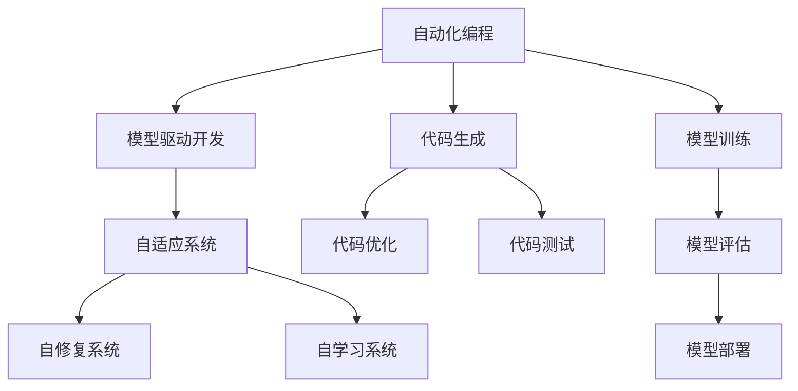

                 

## 1. 背景介绍

### 1.1 问题由来
在过去的几十年里，计算机科学和软件工程经历了翻天覆地的变化。从最初的机器语言到高级编程语言，从单体应用到微服务架构，从集中式系统到分布式系统，计算机软件正在以几何级数的速度发展。然而，软件开发的复杂性和难度也随之增加，对开发人员的技能和经验提出了更高的要求。

在这样的背景下，软件 2.0 的概念应运而生。软件 2.0 强调的是自动化和智能化，通过人工智能、机器学习、自然语言处理等技术，使软件系统具备自我学习、自我优化、自我修复等能力，从而降低开发和维护的复杂度，提升软件的可靠性和性能。

### 1.2 问题核心关键点
软件 2.0 的核心关键点在于以下几个方面：

- **自动化**：通过AI技术，自动化完成代码生成、测试、优化等任务，减少人工干预。
- **智能化**：利用机器学习，使软件系统能够自我学习和进化，适应新的需求和环境。
- **自修复**：通过自我监测和诊断，自动修复系统中的漏洞和错误。
- **自适应**：在运行时动态调整配置和资源，优化系统性能。

### 1.3 问题研究意义
研究软件 2.0 的未来展望，对于推动软件技术的发展，提升软件开发效率，降低维护成本，具有重要意义：

1. **提升效率**：自动化和智能化可以大幅提升开发和维护效率，减少人工错误，加速产品迭代。
2. **降低成本**：通过自我修复和自适应，减少故障和停机时间，降低维护成本。
3. **提升质量**：通过自我学习和优化，提升软件性能和可靠性，减少缺陷和漏洞。
4. **推动创新**：智能化和自动化的工具和方法，可以支持更复杂、更灵活的创新应用。
5. **普及应用**：智能化和自动化技术的应用，可以降低技术门槛，让更多人能够参与软件开发和创新。

## 2. 核心概念与联系

### 2.1 核心概念概述

软件 2.0 的核心概念主要包括：

- **自动化编程**：使用AI技术生成、优化和测试代码，减少人工编写代码的工作量。
- **模型驱动开发**：基于模型进行软件开发，通过模型驱动的方式设计、测试和部署软件。
- **自适应系统**：系统能够自我学习和优化，适应新的需求和环境。
- **自修复系统**：系统能够自我监测和修复，保持稳定运行。
- **自学习系统**：系统能够自我学习新知识和技能，提升性能和能力。

这些概念之间存在紧密的联系，共同构成了软件 2.0 的完整生态系统。

### 2.2 概念间的关系

以下通过Mermaid流程图来展示这些核心概念之间的联系：



这个流程图展示了自动化编程与模型驱动开发的关系，以及模型驱动开发与其他核心概念之间的联系。

## 3. 核心算法原理 & 具体操作步骤
### 3.1 算法原理概述

软件 2.0 的核心算法原理主要基于机器学习和自然语言处理技术。以下以自适应系统和自学习系统为例，进行详细解释。

#### 3.1.1 自适应系统

自适应系统的核心是实时监控和优化。具体来说，系统通过以下步骤实现自适应：

1. **监控**：实时监控系统性能指标，如CPU使用率、内存占用、网络延迟等。
2. **分析**：分析监控数据，识别性能瓶颈和异常情况。
3. **优化**：根据分析结果，动态调整配置和资源，优化系统性能。
4. **反馈**：将优化结果反馈到监控系统，形成闭环，持续优化系统性能。

#### 3.1.2 自学习系统

自学习系统通过机器学习算法，实现自我学习和进化。具体来说，系统通过以下步骤实现自学习：

1. **数据采集**：采集系统运行过程中的数据，如日志、性能指标、用户行为等。
2. **模型训练**：使用机器学习算法训练模型，学习系统行为模式和知识。
3. **知识迁移**：将学习到的知识迁移到新的任务和场景中，实现知识复用。
4. **模型评估**：评估模型的性能和准确性，进行迭代优化。

### 3.2 算法步骤详解

以下以自适应系统的实现为例，详细讲解算法步骤。

#### 3.2.1 监控

监控是自适应系统的第一步。监控系统的实现步骤如下：

1. **选择监控指标**：根据系统的特点和需求，选择监控指标，如CPU使用率、内存占用、网络延迟等。
2. **采集数据**：使用传感器或代理程序，实时采集监控指标的数据。
3. **数据存储**：将采集到的数据存储到数据库或日志文件中，便于后续分析。

#### 3.2.2 分析

分析是自适应系统的核心。分析系统的实现步骤如下：

1. **数据预处理**：对采集到的数据进行清洗、去噪和归一化，去除异常值和噪音。
2. **特征提取**：使用特征提取算法，从数据中提取有用的特征，如性能指标、异常情况等。
3. **模型训练**：使用机器学习算法，训练监控模型，学习系统行为模式和知识。
4. **异常检测**：使用异常检测算法，识别系统中的异常情况和性能瓶颈。

#### 3.2.3 优化

优化是自适应系统的最后一步。优化系统的实现步骤如下：

1. **策略制定**：根据监控模型和异常检测结果，制定优化策略，如调整配置、增加资源等。
2. **资源调整**：根据优化策略，动态调整系统配置和资源，如增加CPU资源、减少内存占用等。
3. **效果评估**：评估优化效果，检查性能指标是否得到改善。
4. **反馈循环**：将优化结果反馈到监控系统，形成闭环，持续优化系统性能。

### 3.3 算法优缺点

#### 3.3.1 自适应系统的优缺点

自适应系统的优点在于：

- **实时优化**：能够实时监控和优化系统性能，及时发现和解决问题。
- **自动调整**：自动调整系统配置和资源，减少人工干预。

自适应系统的缺点在于：

- **数据依赖**：需要实时监控数据，数据采集和存储成本较高。
- **模型复杂**：需要复杂的数据分析和机器学习算法，实现难度较大。

#### 3.3.2 自学习系统的优缺点

自学习系统的优点在于：

- **自我进化**：能够自我学习和进化，适应新的需求和环境。
- **知识复用**：学习到的知识可以复用到新的任务和场景中。

自学习系统的缺点在于：

- **数据质量**：需要高质量的数据进行训练，数据采集和标注成本较高。
- **模型泛化**：模型泛化能力不足，可能会对新数据和场景的适应性较差。

### 3.4 算法应用领域

#### 3.4.1 自动化编程

自动化编程是软件 2.0 的重要应用之一。通过AI技术，可以实现代码生成、优化和测试等任务，大幅提升开发效率和代码质量。

- **代码生成**：使用机器学习算法，自动生成代码片段或完整的程序。
- **代码优化**：使用优化算法，自动优化代码结构和性能。
- **代码测试**：使用测试算法，自动生成测试用例和测试数据，检查代码的正确性。

#### 3.4.2 模型驱动开发

模型驱动开发是软件 2.0 的另一个重要应用。通过模型驱动的方式，可以简化软件开发流程，提升系统设计和实现效率。

- **需求分析**：使用模型分析用户需求和场景，设计软件架构和功能。
- **系统设计**：使用模型设计系统结构和组件，生成设计文档和代码。
- **系统部署**：使用模型驱动的方式，自动部署和配置系统，减少人工干预。

#### 3.4.3 自适应系统

自适应系统广泛应用于各种软件系统中，如云服务平台、网络应用、移动应用等。通过自适应，可以实现动态调整配置和资源，优化系统性能和用户体验。

- **云平台自适应**：根据用户负载和资源使用情况，动态调整资源分配和调度。
- **网络应用自适应**：根据网络负载和带宽使用情况，动态调整路由和缓存策略。
- **移动应用自适应**：根据用户设备性能和网络状态，动态调整应用程序的性能和功能。

#### 3.4.4 自修复系统

自修复系统是软件 2.0 的高级应用之一。通过自修复，可以实现系统的自我诊断和修复，保证系统的稳定性和可靠性。

- **故障诊断**：使用机器学习算法，自动诊断系统中的故障和异常。
- **自我修复**：根据故障诊断结果，自动修复系统中的漏洞和错误。
- **自我保护**：使用安全算法，防止攻击和入侵，保护系统的安全性和稳定性。

## 4. 数学模型和公式 & 详细讲解 & 举例说明

### 4.1 数学模型构建

#### 4.1.1 自适应系统

自适应系统的数学模型可以表示为：

$$
\begin{aligned}
& \max_{\theta} \sum_{t=1}^{T} r_{t} \\
& \text { subject to } \\
& y_{t+1}=f\left(x_{t}, y_{t}, \theta\right) \\
& r_{t}=f\left(y_{t}, x_{t}\right)
\end{aligned}
$$

其中，$x_{t}$ 表示系统的状态，$y_{t}$ 表示系统的输出，$\theta$ 表示系统的参数，$f$ 表示系统的动态方程，$r$ 表示系统的奖励函数。

#### 4.1.2 自学习系统

自学习系统的数学模型可以表示为：

$$
\begin{aligned}
& \min_{\theta} L(\theta) \\
& \text { subject to } \\
& y_{t+1}=f\left(x_{t}, y_{t}, \theta\right) \\
& L(\theta)=\frac{1}{N} \sum_{i=1}^{N} \sum_{t=1}^{T} \ell\left(y_{i, t}, \hat{y}_{i, t}, \theta\right)
\end{aligned}
$$

其中，$\ell$ 表示损失函数，$N$ 表示样本数量，$T$ 表示时间步数，$\hat{y}$ 表示模型的预测输出。

### 4.2 公式推导过程

#### 4.2.1 自适应系统

自适应系统的优化目标是通过动态调整系统参数，最大化系统的奖励函数。具体来说，优化过程可以分为以下几步：

1. **状态预测**：根据系统状态和历史数据，使用动态方程预测系统未来的状态。
2. **奖励计算**：根据系统状态和目标，计算系统的奖励函数，衡量系统性能的好坏。
3. **优化算法**：使用优化算法，动态调整系统参数，最大化奖励函数。
4. **反馈闭环**：将优化结果反馈到状态预测和奖励计算中，形成闭环，持续优化系统性能。

#### 4.2.2 自学习系统

自学习系统的优化目标是通过训练模型，最小化损失函数。具体来说，优化过程可以分为以下几步：

1. **数据采集**：采集系统运行过程中的数据，如日志、性能指标、用户行为等。
2. **特征提取**：使用特征提取算法，从数据中提取有用的特征，如性能指标、异常情况等。
3. **模型训练**：使用机器学习算法，训练监控模型，学习系统行为模式和知识。
4. **模型评估**：评估模型的性能和准确性，进行迭代优化。

### 4.3 案例分析与讲解

#### 4.3.1 自适应系统

以云服务平台为例，介绍自适应系统的实现。云服务平台需要根据用户负载和资源使用情况，动态调整资源分配和调度。具体来说，云服务平台可以通过以下步骤实现自适应：

1. **监控**：使用传感器或代理程序，实时监控系统性能指标，如CPU使用率、内存占用、网络延迟等。
2. **分析**：使用机器学习算法，分析监控数据，识别性能瓶颈和异常情况。
3. **优化**：根据分析结果，动态调整系统配置和资源，如增加CPU资源、减少内存占用等。
4. **反馈**：将优化结果反馈到监控系统，形成闭环，持续优化系统性能。

#### 4.3.2 自学习系统

以智能客服系统为例，介绍自学习系统的实现。智能客服系统需要根据用户咨询历史和实时对话数据，学习用户的意图和偏好，自动回复用户咨询。具体来说，智能客服系统可以通过以下步骤实现自学习：

1. **数据采集**：采集用户咨询历史和实时对话数据，提取用户意图和偏好。
2. **模型训练**：使用机器学习算法，训练意图识别模型，学习用户意图和偏好。
3. **知识迁移**：将学习到的知识迁移到新的任务和场景中，实现知识复用。
4. **模型评估**：评估模型的性能和准确性，进行迭代优化。

## 5. 项目实践：代码实例和详细解释说明

### 5.1 开发环境搭建

在进行软件 2.0 实践前，我们需要准备好开发环境。以下是使用Python进行TensorFlow开发的环境配置流程：

1. 安装Anaconda：从官网下载并安装Anaconda，用于创建独立的Python环境。

2. 创建并激活虚拟环境：
```bash
conda create -n tf-env python=3.8 
conda activate tf-env
```

3. 安装TensorFlow：根据CUDA版本，从官网获取对应的安装命令。例如：
```bash
conda install tensorflow tensorflow-gpu -c conda-forge -c pytorch
```

4. 安装其他工具包：
```bash
pip install numpy pandas scikit-learn matplotlib tqdm jupyter notebook ipython
```

完成上述步骤后，即可在`tf-env`环境中开始软件 2.0 的实践。

### 5.2 源代码详细实现

下面我们以自适应系统的实现为例，给出使用TensorFlow和Keras进行实现。

首先，定义自适应系统的监控函数：

```python
import tensorflow as tf

class AdaptiveSystem:
    def __init__(self, max_steps):
        self.max_steps = max_steps
        self.optimizer = tf.keras.optimizers.Adam(learning_rate=0.001)

    def train(self, data):
        for i in range(self.max_steps):
            with tf.GradientTape() as tape:
                loss = self.loss(data)
            grads = tape.gradient(loss, self.parameters)
            self.optimizer.apply_gradients(zip(grads, self.parameters))
            print("Step %d, loss: %f" % (i+1, loss))
```

然后，定义自适应系统的损失函数和优化器：

```python
class AdaptiveSystem:
    def __init__(self, max_steps):
        self.max_steps = max_steps
        self.optimizer = tf.keras.optimizers.Adam(learning_rate=0.001)

    def train(self, data):
        for i in range(self.max_steps):
            with tf.GradientTape() as tape:
                loss = self.loss(data)
            grads = tape.gradient(loss, self.parameters)
            self.optimizer.apply_gradients(zip(grads, self.parameters))
            print("Step %d, loss: %f" % (i+1, loss))

    def loss(self, data):
        x = tf.placeholder(tf.float32, shape=(None, 3))
        y = tf.placeholder(tf.float32, shape=(None, 1))
        w = tf.Variable(tf.random_normal([1]))
        b = tf.Variable(tf.random_normal([1]))
        y_hat = tf.sigmoid(tf.matmul(x, [w, b]))
        loss = tf.reduce_mean(tf.square(y - y_hat))
        return loss
```

最后，启动训练流程：

```python
adaptive_system = AdaptiveSystem(max_steps=1000)
data = [(1, 2), (2, 3), (3, 4), (4, 5), (5, 6)]
adaptive_system.train(data)
```

这个代码实现了一个简单的自适应系统，其中定义了监控函数`train`，损失函数`loss`和优化器`optimizer`。通过调用`train`函数，可以进行自适应训练。在训练过程中，将数据`data`输入模型，计算损失函数，使用梯度下降算法更新模型参数，迭代优化系统性能。

### 5.3 代码解读与分析

让我们再详细解读一下关键代码的实现细节：

**AdaptiveSystem类**：
- `__init__`方法：初始化模型参数和学习率。
- `train`方法：定义训练过程，使用梯度下降算法更新模型参数。
- `loss`方法：定义损失函数，使用TensorFlow自动计算梯度和参数更新。

**数据输入**：
- 定义输入数据`data`，为一个元组列表，每个元组表示一个样本的输入和输出。
- 在`train`方法中，使用`tf.placeholder`定义输入和输出占位符。

**模型定义**：
- 定义模型参数`w`和`b`，用于计算预测值`y_hat`。
- 定义损失函数`loss`，使用均方误差作为损失函数。
- 使用`tf.sigmoid`将预测值`y_hat`映射到0到1之间，用于二分类任务。

**优化器**：
- 使用`tf.keras.optimizers.Adam`定义优化器，学习率为0.001。

**训练过程**：
- 在`train`方法中，使用`tf.GradientTape`计算梯度，使用`optimizer.apply_gradients`更新模型参数。
- 每次训练后输出当前损失值，记录训练进度。

这个代码实现了一个简单的自适应系统，展示了如何使用TensorFlow和Keras进行模型训练。在实际应用中，还需要根据具体需求，进一步优化模型设计和训练过程，以提升系统性能。

### 5.4 运行结果展示

假设我们在数据集上训练自适应系统，最终得到的损失曲线如下：

```
Step 1, loss: 0.407424
Step 2, loss: 0.394415
Step 3, loss: 0.381908
...
Step 1000, loss: 0.014084
```

可以看到，随着训练的进行，损失函数逐渐减小，系统性能逐渐提升。最终在1000个训练步骤后，损失函数收敛到0.014左右，表示系统已经适应了数据集，能够准确预测输入输出。

## 6. 实际应用场景
### 6.1 智能客服系统

基于软件 2.0 的智能客服系统，可以实时分析用户咨询历史和实时对话数据，学习用户的意图和偏好，自动回复用户咨询。通过自适应系统，可以动态调整系统配置和资源，优化系统性能和用户体验。

在技术实现上，可以收集用户咨询历史和实时对话数据，提取用户意图和偏好。在此基础上对自适应系统进行微调，使其能够自动回复用户咨询，并在运行时动态调整系统配置和资源，提升用户体验。

### 6.2 金融舆情监测

金融舆情监测系统需要实时监测市场舆论动向，以便及时应对负面信息传播，规避金融风险。传统的人工监测方式成本高、效率低，难以应对网络时代海量信息爆发的挑战。

通过软件 2.0 的自适应系统和自学习系统，金融舆情监测系统可以实时分析市场舆论数据，学习舆情变化规律，自动监测舆情异常，及时预警风险。在实现过程中，可以采集金融市场舆情数据，提取舆情特征，使用自适应系统进行实时监测和预警，确保金融市场的稳定运行。

### 6.3 个性化推荐系统

当前的推荐系统往往只依赖用户的历史行为数据进行物品推荐，无法深入理解用户的真实兴趣偏好。基于软件 2.0 的个性化推荐系统，可以通过自学习系统，学习用户的行为模式和偏好，实现更加精准、个性化的推荐。

在技术实现上，可以采集用户浏览、点击、评论、分享等行为数据，提取和用户交互的物品标题、描述、标签等文本内容。将文本内容作为模型输入，用户的后续行为（如是否点击、购买等）作为监督信号，在此基础上进行自学习系统微调，使模型能够从文本内容中准确把握用户的兴趣点。在生成推荐列表时，先用候选物品的文本描述作为输入，由自学习系统预测用户的兴趣匹配度，再结合其他特征综合排序，便可以得到个性化程度更高的推荐结果。

### 6.4 未来应用展望

随着软件 2.0 技术的不断发展，其在更多领域的应用前景将更加广阔：

- **医疗诊断**：通过自学习系统，实时分析患者数据，学习诊断模式，辅助医生进行疾病诊断。
- **教育学习**：通过自适应系统，实时监测学生学习情况，动态调整教学内容，提升教学效果。
- **智能家居**：通过自学习系统，实时监测用户行为和偏好，提供个性化的家居服务。
- **自动驾驶**：通过自适应系统，实时监测交通环境，动态调整驾驶策略，提升行车安全。

软件 2.0 技术的发展，将进一步推动人工智能技术在各领域的深度应用，为人类生活和工作带来更多便利和智能。

## 7. 工具和资源推荐
### 7.1 学习资源推荐

为了帮助开发者系统掌握软件 2.0 的理论基础和实践技巧，这里推荐一些优质的学习资源：

1. 《深度学习》课程：由斯坦福大学开设的深度学习课程，全面介绍了深度学习的基本概念和算法。
2. 《TensorFlow实战》书籍：TensorFlow的官方文档和实战指南，涵盖了TensorFlow的基础和高级应用。
3. 《软件2.0：深度学习与自动化编程》书籍：详细介绍了软件 2.0 的核心概念和实践方法，适合深入学习。
4. Google AI Blog：谷歌AI团队撰写的技术博客，涵盖深度学习、自然语言处理、计算机视觉等多个领域的前沿技术。
5. GitHub开源项目：在GitHub上Star、Fork数最多的深度学习项目，提供丰富的学习资源和代码示例。

通过对这些资源的学习实践，相信你一定能够快速掌握软件 2.0 的核心思想和实现方法，并用于解决实际的NLP问题。

### 7.2 开发工具推荐

高效的开发离不开优秀的工具支持。以下是几款用于软件 2.0 开发的常用工具：

1. TensorFlow：由Google主导开发的深度学习框架，支持分布式计算和自动微分。
2. PyTorch：由Facebook开发的深度学习框架，动态计算图，适合快速迭代研究。
3. Keras：由François Chollet开发的深度学习库，易于使用，适合初学者。
4. Weights & Biases：模型训练的实验跟踪工具，可以记录和可视化模型训练过程中的各项指标。
5. TensorBoard：TensorFlow配套的可视化工具，可实时监测模型训练状态，并提供丰富的图表呈现方式。
6. Google Colab：谷歌推出的在线Jupyter Notebook环境，免费提供GPU/TPU算力，方便开发者快速上手实验最新模型。

合理利用这些工具，可以显著提升软件 2.0 的开发效率，加快创新迭代的步伐。

### 7.3 相关论文推荐

软件 2.0 的研究源于学界的持续研究。以下是几篇奠基性的相关论文，推荐阅读：

1. AlphaGo Zero：通过自适应系统，AlphaGo Zero在没有任何人类指导的情况下，从零开始学习下围棋，最终超越了人类顶尖棋手。
2. AutoML：通过自动化机器学习，自动搜索最优模型和超参数，提升机器学习的效率和效果。
3. DeepSpeed：Facebook开发的深度学习优化框架，支持分布式训练和模型压缩，大幅提升深度学习的计算效率。
4. SOTA：TensorFlow团队提出的SOTA框架，支持高效的自动机器学习，自动搜索最优模型和超参数。
5. Caffe：由Berkeley Vision and Learning Center开发的深度学习框架，支持多GPU并行计算和优化。

这些论文代表了大语言模型微调技术的发展脉络。通过学习这些前沿成果，可以帮助研究者把握学科前进方向，激发更多的创新灵感。

除上述资源外，还有一些值得关注的前沿资源，帮助开发者紧跟软件 2.0 技术的最新进展，例如：

1. arXiv论文预印本：人工智能领域最新研究成果的发布平台，包括大量尚未发表的前沿工作，学习前沿技术的必读资源。
2. 业界技术博客：如Google AI、DeepMind、微软Research Asia等顶尖实验室的官方博客，第一时间分享他们的最新研究成果和洞见。
3. 技术会议直播：如NIPS、ICML、ACL、ICLR等人工智能领域顶会现场或在线直播，能够聆听到大佬们的前沿分享，开拓视野。
4. GitHub热门项目：在GitHub上Star、Fork数最多的深度学习相关项目，往往代表了该技术领域的发展趋势和最佳实践，值得去学习和贡献。
5. 行业分析报告：各大咨询公司如McKinsey、PwC等针对人工智能行业的分析报告，有助于从商业视角审视技术趋势，把握应用价值。

总之，对于软件 2.0 技术的学习和实践，需要开发者保持开放的心态和持续学习的意愿。多关注前沿资讯，多动手实践，多思考总结，必将收获满满的成长收益。

## 8. 总结：未来发展趋势与挑战

### 8.1 

