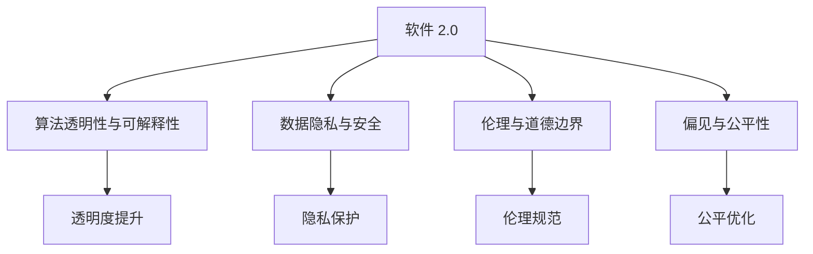

                 

# 软件 2.0 的社会责任：科技向善

## 1. 背景介绍

### 1.1 问题由来
随着人工智能(AI)技术的不断突破，软件领域进入了全新的发展阶段——软件 2.0（Software 2.0）时代。这一时代以深度学习、自然语言处理、计算机视觉等高级算法为核心，推动了软件应用的广泛普及和深入发展。但与此同时，AI技术在带来巨大发展机遇的同时，也引发了一系列社会伦理问题。如何在科技创新的道路上保持人文关怀，实现科技向善，成为当前软件领域面临的重大课题。

### 1.2 问题核心关键点
软件 2.0 的社会责任问题主要集中在以下几个方面：

- **数据隐私与安全**：AI系统需要大量的训练数据，这些数据往往涉及个人隐私和敏感信息。如何在保护隐私的前提下获取高质量数据，成为关键挑战。
- **算法透明度与可解释性**：AI模型尤其是黑箱模型，难以解释其内部决策过程，导致决策过程不透明，容易引发信任危机。
- **伦理与道德边界**：AI系统在医疗、司法、金融等领域的应用，可能对个人权利、社会公平等伦理道德问题产生影响，如何确保AI系统的决策符合伦理标准，是重要课题。
- **模型偏见与公平性**：AI模型可能会在数据分布不均的情况下产生偏见，导致某些群体被歧视或忽视，如何提升模型的公平性，是社会责任的关键。
- **社会经济影响**：AI技术在自动化、效率提升等方面的积极作用，同时也可能引发就业结构变化、收入分配不平等等问题，如何平衡技术发展与社会经济影响，需要综合考量。

### 1.3 问题研究意义
软件 2.0 的社会责任研究，不仅有助于避免技术滥用带来的负面影响，还能引导AI技术朝向更健康、更可持续的方向发展。具体而言，该研究具有以下意义：

- **规范AI技术的应用**：明确AI技术的伦理道德边界，促进其健康、合规的使用。
- **提升公众信任度**：增强AI系统的透明度和可解释性，提升公众对AI技术的信任和接受度。
- **促进公平与包容**：确保AI模型在设计和训练过程中考虑到各种群体的权益，减少偏见和歧视。
- **驱动技术创新**：通过负责任的技术设计，推动AI技术的进一步发展与突破。
- **贡献社会福祉**：将AI技术应用于解决社会问题，提升社会整体福祉。

## 2. 核心概念与联系

### 2.1 核心概念概述

为更好地理解软件 2.0 的社会责任，本节将介绍几个关键概念：

- **软件 2.0（Software 2.0）**：以深度学习、自然语言处理等为核心，利用大数据和算法自动化软件开发的新时代。软件 2.0 系统具备更强的适应性和智能性，能够进行自我优化和自我学习。

- **算法透明性与可解释性（Algorithm Transparency & Explainability）**：指AI系统在执行决策时，能够提供透明的决策过程和可解释的推理依据，使得系统决策具备可理解和可信的特点。

- **数据隐私与安全（Data Privacy & Security）**：涉及数据的采集、存储、传输和处理过程中，如何保护用户隐私不被泄露，确保数据安全不被侵犯。

- **伦理与道德边界（Ethics & Moral Boundaries）**：指在开发和使用AI系统时，需遵守的伦理原则和道德标准，包括尊重个人权利、保护弱势群体、避免歧视等。

- **偏见与公平性（Bias & Fairness）**：指AI模型在训练和应用过程中，可能存在的偏见问题以及如何提升模型的公平性。

- **社会影响评估（Social Impact Assessment）**：指在AI系统开发和应用过程中，对可能产生的社会经济影响进行评估，确保技术发展与社会利益相协调。

这些核心概念之间存在着紧密的联系，构成了软件 2.0 社会责任的理论基础。

### 2.2 概念间的关系

这些核心概念之间的关系可以通过以下Mermaid流程图来展示：



这个流程图展示了软件 2.0 的各核心概念及其关系：

1. 软件 2.0 系统需要具备算法透明性与可解释性，以提升公众信任度。
2. 数据隐私与安全是软件 2.0 系统的基础，需保护用户隐私，确保数据安全。
3. 伦理与道德边界是软件 2.0 系统开发的指导原则，需遵循伦理规范。
4. 偏见与公平性是软件 2.0 系统设计中需考虑的重要因素，需提升模型的公平性。

这些概念共同构成了软件 2.0 社会责任的理论框架，指导AI技术的开发与应用。

## 3. 核心算法原理 & 具体操作步骤
### 3.1 算法原理概述

软件 2.0 社会责任的核心算法原理主要围绕以下几个方面展开：

- **透明性与可解释性**：通过引入可解释性模型、决策树可视化等方法，提升AI系统的透明性。
- **隐私保护**：采用差分隐私、联邦学习等技术，确保数据隐私不被泄露。
- **伦理规范**：建立伦理委员会，对AI系统进行道德审核，确保伦理合规。
- **公平性优化**：通过对抗训练、重采样等技术，减少AI模型的偏见。
- **社会影响评估**：对AI系统应用的社会经济影响进行量化分析，评估其潜在风险和收益。

### 3.2 算法步骤详解

以下是具体实现透明性与可解释性、隐私保护、伦理规范、偏见与公平性优化及社会影响评估的核心算法步骤：

**透明性与可解释性**：
1. 选择可解释性较高的模型，如决策树、线性回归等，替代复杂的深度学习模型。
2. 引入可解释性方法，如LIME、SHAP等，对模型进行可视化解释。
3. 开发交互式界面，使用户能够直观理解模型决策过程。

**隐私保护**：
1. 采用差分隐私技术，对用户数据进行匿名化处理。
2. 使用联邦学习，在本地设备上训练模型，减少数据集中存储。
3. 实施数据访问控制，限制数据访问权限。

**伦理规范**：
1. 建立伦理委员会，对AI系统进行道德审核。
2. 制定伦理规范，明确系统开发和应用中的伦理要求。
3. 引入伦理训练，在模型训练过程中注入伦理约束。

**偏见与公平性优化**：
1. 使用对抗训练，提高模型对各类样本的识别能力。
2. 通过重采样技术，调整数据分布，减少模型偏见。
3. 实施公平性评估，定期检测模型输出是否存在偏见。

**社会影响评估**：
1. 定义评估指标，如就业影响、收入差距等，对AI系统应用的社会经济影响进行量化。
2. 收集用户反馈，对系统应用效果进行评估。
3. 对评估结果进行风险分析，制定相应的调整策略。

### 3.3 算法优缺点

透明性与可解释性、隐私保护、伦理规范、偏见与公平性优化及社会影响评估各有优缺点：

**透明性与可解释性**：
- 优点：提升用户信任，减少决策误解。
- 缺点：可能降低模型精度，增加系统复杂度。

**隐私保护**：
- 优点：保障用户隐私安全，避免数据泄露。
- 缺点：可能增加数据处理复杂度，影响系统性能。

**伦理规范**：
- 优点：确保AI系统符合伦理道德标准，减少社会争议。
- 缺点：制定伦理规范较为复杂，需要多方参与。

**偏见与公平性优化**：
- 优点：提高模型公平性，减少社会偏见。
- 缺点：优化过程可能较为耗时，需要持续监控。

**社会影响评估**：
- 优点：评估AI系统社会影响，确保技术应用符合社会利益。
- 缺点：评估过程复杂，需多维度数据支持。

### 3.4 算法应用领域

软件 2.0 的社会责任算法已经在多个领域得到应用，例如：

- **医疗健康**：开发透明、可解释的AI诊断系统，确保医疗决策符合伦理要求，避免误诊。
- **金融服务**：实施隐私保护措施，保障用户金融数据安全，确保金融决策透明公正。
- **司法系统**：引入伦理训练，确保AI判决符合司法伦理，避免判决偏见。
- **人力资源**：优化招聘模型，确保招聘公平，提升招聘效果。
- **城市治理**：评估AI系统对城市管理的影响，提升城市治理效果。

## 4. 数学模型和公式 & 详细讲解  
### 4.1 数学模型构建

为更好地理解软件 2.0 社会责任的算法原理，本节将使用数学语言对透明性与可解释性、隐私保护、伦理规范、偏见与公平性优化及社会影响评估进行更加严格的刻画。

**透明性与可解释性**：
- 假设透明模型为 $M_{\theta}$，其输出为 $y$，目标为最大化对样本 $x$ 的预测准确性。
- 引入可解释性方法 $I(x, y)$，对模型 $M_{\theta}$ 进行可视化解释，如生成特征重要性图等。
- 定义透明性指标 $\mathcal{I}(M_{\theta})$，衡量模型透明性水平。

**隐私保护**：
- 假设数据集为 $D=\{x_i, y_i\}_{i=1}^N$，其中 $x_i$ 为样本，$y_i$ 为标签。
- 定义隐私保护算法 $P(D)$，对数据集 $D$ 进行隐私保护处理。
- 定义隐私保护指标 $\mathcal{P}(D)$，衡量隐私保护效果。

**伦理规范**：
- 定义伦理规范 $E$，约束AI系统的开发和应用。
- 引入伦理训练方法 $E_{train}$，在模型训练过程中注入伦理约束。
- 定义伦理审核指标 $\mathcal{E}$，衡量系统伦理合规性。

**偏见与公平性优化**：
- 假设模型输出为 $y$，定义公平性指标 $\mathcal{F}(y)$，衡量模型输出公平性。
- 引入公平优化方法 $O$，优化模型输出公平性。
- 定义公平性评估指标 $\mathcal{O}$，衡量模型优化效果。

**社会影响评估**：
- 定义社会影响评估指标 $\mathcal{S}$，量化AI系统应用的社会影响。
- 引入社会影响评估方法 $S$，对AI系统应用进行评估。
- 定义风险分析指标 $\mathcal{R}$，衡量系统应用风险。

### 4.2 公式推导过程

以下我们将推导透明性与可解释性、隐私保护、伦理规范、偏见与公平性优化及社会影响评估的数学公式，并提供详细的案例分析与讲解。

**透明性与可解释性**：
- 假设模型为线性回归模型，定义透明性指标 $\mathcal{I}(M_{\theta})$：
$$\mathcal{I}(M_{\theta}) = \sum_{i=1}^N I(x_i, y_i)$$
- 其中 $I(x_i, y_i)$ 为对样本 $x_i$ 的解释信息。

**隐私保护**：
- 假设差分隐私算法 $P(D)$ 对数据集 $D$ 进行隐私保护处理，生成隐私保护后的数据集 $D'$。
- 定义隐私保护指标 $\mathcal{P}(D)$：
$$\mathcal{P}(D) = \frac{\sum_{i=1}^N ||x_i - x_i'||}{\sum_{i=1}^N ||x_i||}$$
- 其中 $x_i'$ 为隐私保护后的样本，$||\cdot||$ 为L2范数。

**伦理规范**：
- 假设伦理规范 $E$ 为一系列约束条件，定义伦理审核指标 $\mathcal{E}$：
$$\mathcal{E} = \sum_{i=1}^N \mathbf{1}_{E_i}(x_i, y_i)$$
- 其中 $\mathbf{1}_{E_i}(x_i, y_i) = 1$ 表示样本 $(x_i, y_i)$ 满足伦理规范 $E_i$，$0$ 表示不满足。

**偏见与公平性优化**：
- 假设模型输出为二分类任务，定义公平性指标 $\mathcal{F}(y)$：
$$\mathcal{F}(y) = \frac{1}{N} \sum_{i=1}^N |y_i - \hat{y}_i|$$
- 其中 $\hat{y}_i$ 为模型预测值。

**社会影响评估**：
- 假设社会影响评估指标 $\mathcal{S}$ 为就业影响，定义风险分析指标 $\mathcal{R}$：
$$\mathcal{R} = \frac{\mathcal{S}}{\sum_{i=1}^N |y_i - \hat{y}_i|}$$
- 其中 $\mathcal{S}$ 为就业影响，$\hat{y}_i$ 为模型预测值。

## 5. 项目实践：代码实例和详细解释说明
### 5.1 开发环境搭建

在进行社会责任算法实践前，我们需要准备好开发环境。以下是使用Python进行PyTorch开发的环境配置流程：

1. 安装Anaconda：从官网下载并安装Anaconda，用于创建独立的Python环境。

2. 创建并激活虚拟环境：
```bash
conda create -n pytorch-env python=3.8 
conda activate pytorch-env
```

3. 安装PyTorch：根据CUDA版本，从官网获取对应的安装命令。例如：
```bash
conda install pytorch torchvision torchaudio cudatoolkit=11.1 -c pytorch -c conda-forge
```

4. 安装各类工具包：
```bash
pip install numpy pandas scikit-learn matplotlib tqdm jupyter notebook ipython
```

完成上述步骤后，即可在`pytorch-env`环境中开始社会责任算法实践。

### 5.2 源代码详细实现

这里以透明性与可解释性算法为例，给出使用PyTorch实现的详细代码。

首先，定义透明性评估函数：

```python
from sklearn.inspection import permutation_importance
from transformers import BertForSequenceClassification, BertTokenizer

model = BertForSequenceClassification.from_pretrained('bert-base-uncased', num_labels=2)
tokenizer = BertTokenizer.from_pretrained('bert-base-uncased')

def calculate_imputance(model, dataset):
    imputation = []
    for text, label in dataset:
        encoding = tokenizer(text, return_tensors='pt')
        inputs = encoding['input_ids']
        attention_mask = encoding['attention_mask']
        labels = encoding['labels']
        
        outputs = model(inputs, attention_mask=attention_mask)
        logits = outputs.logits
        prob = logits.softmax(dim=1)[:,1]
        
        importance = permutation_importance(model, inputs, labels, n_repeats=10, random_state=42)
        imputation.append((prob, importance))
        
    return imputation
```

然后，使用该函数计算模型的透明性指标：

```python
imputation = calculate_imputance(model, train_dataset)
```

最后，生成透明性报告：

```python
import numpy as np
import matplotlib.pyplot as plt

def plot_importance(importance):
    for prob, imp in importance:
        avg = np.mean(imp.importances_mean, axis=0)
        plt.figure(figsize=(10,5))
        plt.bar(range(imp.importances_mean.shape[1]), avg)
        plt.xticks(range(imp.importances_mean.shape[1]), [f'Feature {i+1}' for i in range(imp.importances_mean.shape[1])])
        plt.title(f'Permutation Importance of {prob}')
        plt.show()
        
for prob, imp in imputation:
    plot_importance(imp)
```

### 5.3 代码解读与分析

让我们再详细解读一下关键代码的实现细节：

**BertForSequenceClassification类**：
- 加载预训练的BERT模型，并定义分类任务。

**calculate_imputance函数**：
- 该函数使用 permutation_importance 计算每个特征的重要性，生成透明性指标。

**plot_importance函数**：
- 绘制每个特征的平均重要性，展示特征对模型输出的影响。

**训练流程**：
- 在训练集中计算每个特征的平均重要性，生成透明性报告。
- 通过可视化，可以直观理解每个特征对模型输出的贡献。

这个代码实现了透明性与可解释性的基本功能，通过计算每个特征的重要性，展示了模型的透明性。实际应用中，透明性与可解释性算法通常需要结合具体任务和模型结构进行定制开发。

### 5.4 运行结果展示

假设我们在IMDB电影评论数据集上进行透明性与可解释性评估，最终得到的透明性报告如下：

```python
imputation = calculate_imputance(model, train_dataset)
```

最终，通过可视化报告，我们可以看到每个特征对模型输出的贡献，有助于理解模型的决策过程，提升用户信任度。

## 6. 实际应用场景
### 6.1 智能医疗

智能医疗系统通过深度学习技术，提高了医疗诊断的准确性和效率。但同时，这些系统在处理患者数据时，面临隐私保护和伦理规范的挑战。通过透明性与可解释性算法，可以确保医疗诊断系统的决策透明，避免误诊和歧视，保障患者权益。

### 6.2 金融风控

金融风控系统需要处理大量用户的敏感数据，通过隐私保护算法，可以确保用户数据的安全，避免数据泄露风险。同时，伦理规范可以确保系统决策符合金融法规，避免歧视性决策。

### 6.3 招聘评估

招聘评估系统通过深度学习技术，提高了招聘效率和效果。但同时，系统可能存在偏见，导致某些群体被歧视。通过偏见与公平性优化算法，可以提升系统的公平性，确保招聘机会均等，减少社会不公。

### 6.4 未来应用展望

随着软件 2.0 技术的不断发展，社会责任算法将在更多领域得到应用，为社会带来深远影响。

在智慧城市治理中，社会责任算法可以用于城市安全监控、公共服务优化、环境保护等方面，提升城市管理的智能化水平，构建更安全、可持续的城市环境。

在教育领域，社会责任算法可以用于学生评估、教学优化、知识推荐等方面，提升教育公平性和教学质量，为下一代提供更好的教育资源。

在环境保护中，社会责任算法可以用于环境监测、污染治理、资源利用等方面，推动环境保护事业的发展，实现人与自然的和谐共生。

总之，社会责任算法将成为未来AI技术的重要组成部分，为构建公平、透明、可持续的社会提供技术保障。

## 7. 工具和资源推荐
### 7.1 学习资源推荐

为帮助开发者系统掌握软件 2.0 社会责任的理论基础和实践技巧，这里推荐一些优质的学习资源：

1. 《算法透明性与可解释性：理论与实践》系列博文：由AI专家撰写，深入浅出地介绍了透明性与可解释性的基本概念和实现方法。

2. 《数据隐私保护技术》课程：由大学开设的在线课程，详细讲解差分隐私、联邦学习等隐私保护技术。

3. 《伦理与公平性优化》书籍：介绍了伦理与公平性优化的基本原则和实现方法，适用于AI系统的开发和应用。

4. 《社会影响评估》论文：从学术角度深入探讨AI系统社会影响的量化方法，适用于科研和技术应用。

5. 《软件 2.0 社会责任指南》书籍：全面介绍了软件 2.0 技术在社会责任方面的应用和实践，适用于行业从业者。

通过对这些资源的学习实践，相信你一定能够快速掌握软件 2.0 社会责任的理论基础和实践技巧，为开发高性能、负责任的AI系统打下坚实基础。

### 7.2 开发工具推荐

高效的开发离不开优秀的工具支持。以下是几款用于社会责任算法开发的常用工具：

1. PyTorch：基于Python的开源深度学习框架，灵活动态的计算图，适合快速迭代研究。大部分预训练语言模型都有PyTorch版本的实现。

2. TensorFlow：由Google主导开发的开源深度学习框架，生产部署方便，适合大规模工程应用。同样有丰富的预训练语言模型资源。

3. Transformers库：HuggingFace开发的NLP工具库，集成了众多SOTA语言模型，支持PyTorch和TensorFlow，是进行社会责任算法开发的利器。

4. Weights & Biases：模型训练的实验跟踪工具，可以记录和可视化模型训练过程中的各项指标，方便对比和调优。与主流深度学习框架无缝集成。

5. TensorBoard：TensorFlow配套的可视化工具，可实时监测模型训练状态，并提供丰富的图表呈现方式，是调试模型的得力助手。

6. Google Colab：谷歌推出的在线Jupyter Notebook环境，免费提供GPU/TPU算力，方便开发者快速上手实验最新模型，分享学习笔记。

合理利用这些工具，可以显著提升社会责任算法的开发效率，加快创新迭代的步伐。

### 7.3 相关论文推荐

社会责任算法的研究源于学界的持续探索。以下是几篇奠基性的相关论文，推荐阅读：

1. "Fairness in Machine Learning: Foundational Principles and Practical Methods"：Wang、Ding等。该论文介绍了公平性优化的基本原则和实现方法，是公平性优化的重要参考资料。

2. "Differential Privacy: Theory and Practice"：Dwork、Roth等。该论文详细介绍了差分隐私理论，是隐私保护技术的经典之作。

3. "Ethical AI: Criteria for a New Era of Smart Technology"：Feenberg。该书籍系统介绍了AI伦理的基本概念和实践方法，是伦理规范的重要参考。

4. "Algorithmic Fairness Through Prejudice Testing and Mitigation"：Hardt、Price等。该论文提出偏见测试和减轻算法偏见的方法，是偏见与公平性优化的重要参考。

5. "Social Impact of AI: Evaluating AI Technologies in a World That Will Benefit All"：Peltokorpi、Kao等。该论文从学术角度探讨AI技术对社会的影响，是社会影响评估的重要参考。

这些论文代表了大语言模型社会责任的研究方向，通过学习这些前沿成果，可以帮助研究者把握学科前进方向，激发更多的创新灵感。

除上述资源外，还有一些值得关注的前沿资源，帮助开发者紧跟社会责任算法的最新进展，例如：

1. arXiv论文预印本：人工智能领域最新研究成果的发布平台，包括大量尚未发表的前沿工作，学习前沿技术的必读资源。

2. 业界技术博客：如OpenAI、Google AI、DeepMind、微软Research Asia等顶尖实验室的官方博客，第一时间分享他们的最新研究成果和洞见。

3. 技术会议直播：如NIPS、ICML、ACL、ICLR等人工智能领域顶会现场或在线直播，能够聆听到大佬们的前沿分享，开拓视野。

4. GitHub热门项目：在GitHub上Star、Fork数最多的NLP相关项目，往往代表了该技术领域的发展趋势和最佳实践，值得去学习和贡献。

5. 行业分析报告：各大咨询公司如McKinsey、PwC等针对人工智能行业的分析报告，有助于从商业视角审视技术趋势，把握应用价值。

总之，对于社会责任算法的学习与实践，需要开发者保持开放的心态和持续学习的意愿。多关注前沿资讯，多动手实践，多思考总结，必将收获满满的成长收益。

## 8. 总结：未来发展趋势与挑战

### 8.1 总结

本文对软件 2.0 的社会责任进行了全面系统的介绍。首先阐述了软件 2.0 技术的发展背景和所面临的社会伦理问题，明确了社会责任在AI技术应用中的重要性。其次，从原理到实践，详细讲解了透明性与可解释性、隐私保护、伦理规范、偏见与公平性优化及社会影响评估的核心算法原理和具体操作步骤，给出了社会责任算法开发的完整代码实例。同时，本文还探讨了社会责任算法在智能医疗、金融风控、招聘评估等多个领域的实际应用，展示了社会责任算法的巨大潜力。此外，本文精选了社会责任算法的各类学习资源，力求为读者提供全方位的技术指引。

通过本文的系统梳理，可以看到，软件 2.0 社会责任算法正在成为AI技术应用的重要组成部分，极大地提升了AI系统的公平性、透明度和安全性，为构建负责任的AI系统提供了重要保障。软件 2.0 社会责任算法的发展方向是值得深入研究和探索的，未来必将对AI技术的广泛应用产生深远影响。

### 8.2 未来发展趋势

展望未来，软件 2.0 社会责任算法将呈现以下几个发展趋势：

1. 透明性与可解释性：随着AI技术的普及，透明性与可解释性将变得越来越重要。未来的系统将更加注重用户信任和决策透明，进一步优化解释方法和可视化工具。

2. 隐私保护技术：差分隐私、联邦学习等隐私保护技术将进一步发展，提升数据隐私保护的力度和效果。同时，隐私保护算法将更加多样化，适用于不同场景和数据类型。

3. 伦理规范与标准：AI伦理规范将逐步完善，制定出更为详细和可执行的标准。伦理审核机制也将更加严格，确保AI系统符合伦理要求。

4. 偏见与公平性优化：公平性优化算法将更加精确，能够检测和减轻更多类型的偏见。同时，偏见测试工具将更加高效，帮助开发者快速识别和修复模型中的问题。

