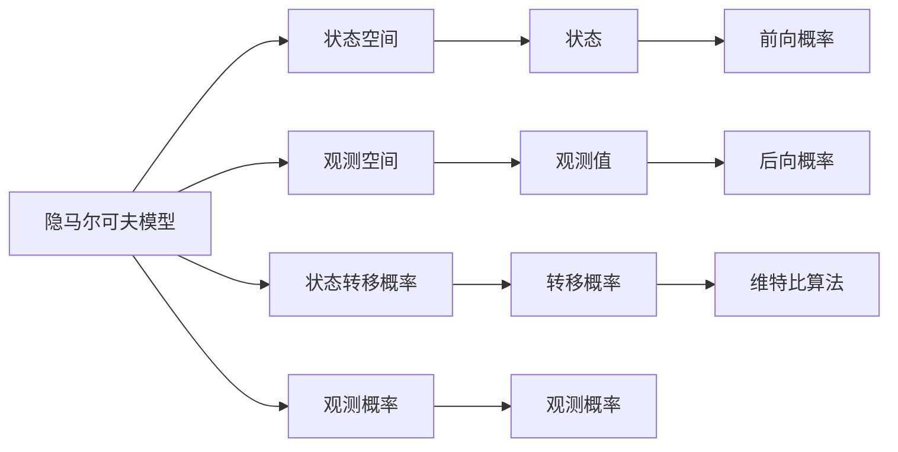
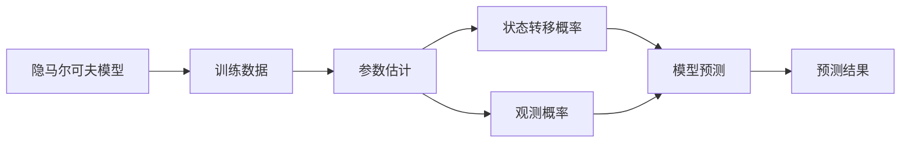
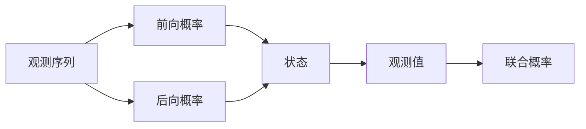
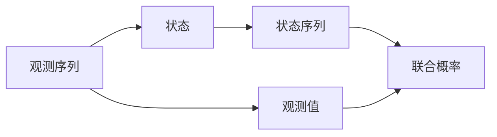
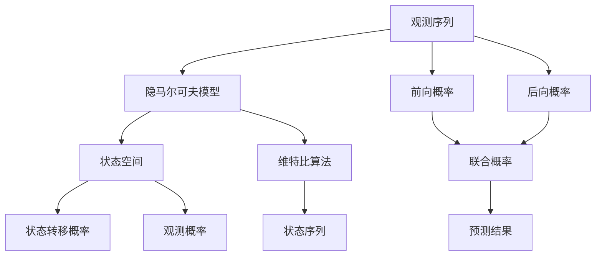

                 

# 隐马尔可夫模型 (Hidden Markov Models, HMM) 原理与代码实例讲解

> 关键词：隐马尔可夫模型, 概率图模型, 前向算法, 后向算法, Viterbi算法, 维特比算法, 学习算法, 最大化似然, Baum-Welch算法

## 1. 背景介绍

### 1.1 问题由来
隐马尔可夫模型（Hidden Markov Model, HMM）是一种用于序列建模的概率图模型，广泛应用于语音识别、自然语言处理、生物信息学等多个领域。其核心思想是利用状态转移和观测值之间的概率关系，对不可观测的状态进行建模，并在此基础上进行序列预测和参数学习。

隐马尔可夫模型的发展历程可以追溯到20世纪60年代，最初由Baum等人提出，主要用于语音信号的建模和分析。随着机器学习技术的不断进步，隐马尔可夫模型在NLP、生物信息学等领域得到了广泛的应用，成为序列建模中的重要工具。

### 1.2 问题核心关键点
隐马尔可夫模型主要包含以下核心概念和关键问题：
- 状态空间（State Space）：定义了模型中可能出现的状态集合。
- 观测空间（Observation Space）：定义了模型中可能出现的观测值集合。
- 状态转移概率（Transition Probability）：描述了状态之间的转移概率，即从一个状态转移到另一个状态的概率。
- 观测概率（Observation Probability）：描述了每个状态对应的观测值概率，即给定一个状态，观测到某个观测值的概率。
- 参数学习（Parameter Learning）：通过训练数据，估计状态转移概率和观测概率，使得模型能够更准确地进行序列预测。
- 状态序列预测（State Sequence Prediction）：给定观测序列，预测可能的状态序列。

在实际应用中，隐马尔可夫模型主要通过前向算法、后向算法和维特比算法进行序列预测和参数学习。这些算法需要根据具体问题选择合适的训练数据和模型参数，并经过多次迭代优化，才能得到理想的效果。

### 1.3 问题研究意义
隐马尔可夫模型的研究与应用，具有以下重要意义：

1. 序列建模与分析：隐马尔可夫模型能够对任意长度的序列进行建模，适合处理时间序列数据，如语音信号、文本序列等。

2. 参数估计与优化：通过最大似然估计（Maximum Likelihood Estimation,MLE）等方法，隐马尔可夫模型能够估计模型参数，提高序列预测的准确性。

3. 实时预测与控制：隐马尔可夫模型具有实时预测能力，适合应用于需要即时响应的场景，如自动驾驶、工业控制等。

4. 跨领域应用：隐马尔可夫模型在语音识别、自然语言处理、生物信息学等领域均有广泛应用，为这些领域的技术发展提供了重要支持。

5. 模型迁移：隐马尔可夫模型具有较好的泛化能力，能够将模型参数迁移到其他相关问题，加速新任务的模型训练。

## 2. 核心概念与联系

### 2.1 核心概念概述

为了更好地理解隐马尔可夫模型的基本原理，本节将介绍几个关键的概念和它们之间的联系：

- 状态（State）：隐马尔可夫模型中的状态是不可观测的，但可以通过观测值进行推断。例如，语音识别中的状态可以是音素、词语等。

- 观测值（Observation）：隐马尔可夫模型中的观测值是可观测的，例如语音信号的幅度、频率等。

- 状态转移概率（Transition Probability）：描述了状态之间的转移概率。例如，从一个音素转移到另一个音素的概率。

- 观测概率（Observation Probability）：描述了每个状态对应的观测值概率。例如，给定一个音素，发出特定频率的概率。

- 前向算法（Forward Algorithm）：用于计算给定观测序列下，每个状态的前向概率，即从模型初始状态到该状态的概率。

- 后向算法（Backward Algorithm）：用于计算给定观测序列下，每个状态的后向概率，即从模型终止状态到该状态的概率。

- 维特比算法（Viterbi Algorithm）：用于在给定观测序列下，找出最可能的状态序列。

这些概念之间的联系可以通过以下Mermaid流程图来展示：



这个流程图展示了隐马尔可夫模型的核心概念和算法之间的联系。

### 2.2 概念间的关系

这些核心概念之间存在着紧密的联系，形成了隐马尔可夫模型的完整框架。下面通过几个Mermaid流程图来展示这些概念之间的关系：

#### 2.2.1 隐马尔可夫模型的学习框架



这个流程图展示了隐马尔可夫模型的学习框架。训练数据用于估计模型的参数，即状态转移概率和观测概率。模型预测使用估计的参数进行序列预测。

#### 2.2.2 前向算法和后向算法



这个流程图展示了前向算法和后向算法的作用。前向算法用于计算给定观测序列下，每个状态的前向概率。后向算法用于计算给定观测序列下，每个状态的后向概率。联合概率可以通过前向概率和后向概率计算得到。

#### 2.2.3 维特比算法



这个流程图展示了维特比算法的作用。在给定观测序列下，维特比算法用于找出最可能的状态序列。

### 2.3 核心概念的整体架构

最后，我们用一个综合的流程图来展示隐马尔可夫模型的整体架构：



这个综合流程图展示了从观测序列到隐马尔可夫模型的完整过程。

## 3. 核心算法原理 & 具体操作步骤
### 3.1 算法原理概述

隐马尔可夫模型的核心算法包括前向算法、后向算法和维特比算法，用于序列预测和参数学习。其基本原理是通过观测序列和状态转移概率、观测概率等参数，计算给定观测序列下，每个状态的概率分布，并在此基础上进行序列预测和参数优化。

隐马尔可夫模型的学习目标是通过训练数据，最大化观测序列的概率。对于给定的观测序列 $O=(o_1,o_2,...,o_n)$ 和状态转移概率 $A$、观测概率 $B$ 等参数，模型的似然概率 $P(O|λ)$ 可以表示为：

$$
P(O|λ) = \frac{P(O|A,B,λ)}{P(O|λ)}
$$

其中， $λ$ 表示模型参数，包括状态转移概率 $A$ 和观测概率 $B$ 等。

### 3.2 算法步骤详解

隐马尔可夫模型的算法步骤主要包括以下几个方面：

**Step 1: 初始化算法**

- 初始状态概率 $\pi$：从模型初始状态开始，计算给定观测序列下，每个状态的前向概率和后向概率。
- 状态转移概率矩阵 $A$：描述状态之间的转移概率。
- 观测概率矩阵 $B$：描述每个状态对应的观测值概率。

**Step 2: 前向算法**

- 计算给定观测序列下，每个状态的前向概率。前向概率 $α_t(i)$ 表示从模型初始状态到状态 $i$ 的联合概率，即从模型初始状态开始，到状态 $i$ 为止，观测到观测序列前 $t$ 个元素的概率。
- 递推更新前向概率。前向概率的递推公式为：

$$
α_t(i) = α_{t-1}(i)A_{i,j}α_{t-1}(j) + B_j(o_t)α_{t-1}(j)
$$

其中， $A_{i,j}$ 表示状态 $i$ 转移到状态 $j$ 的概率，$B_j(o_t)$ 表示状态 $j$ 观测到观测值 $o_t$ 的概率。

**Step 3: 后向算法**

- 计算给定观测序列下，每个状态的后向概率。后向概率 $β_t(i)$ 表示从模型终止状态开始，到状态 $i$ 为止，观测到观测序列前 $t$ 个元素的概率。
- 递推更新后向概率。后向概率的递推公式为：

$$
β_t(i) = B_i(o_{t+1})β_{t+1}(i) + Σ_{j}A_{j,i}β_{t+1}(j)
$$

其中， $B_i(o_{t+1})$ 表示状态 $i$ 观测到观测值 $o_{t+1}$ 的概率，$A_{j,i}$ 表示状态 $j$ 转移到状态 $i$ 的概率。

**Step 4: 维特比算法**

- 在给定观测序列下，维特比算法用于找出最可能的状态序列。
- 动态规划求解维特比算法。维特比算法的动态规划公式为：

$$
γ_t(i) = \max(α_t(i), Σ_jA_{j,i}α_{t-1}(j))
$$

$$
δ_t(i) = \max(γ_t(i), α_t(i))
$$

$$
ψ_t(i) = \max(δ_t(i), γ_t(i)+β_t(i))
$$

$$
P_t(i) = β_t(i)/Σ_{i}β_t(i)
$$

其中， $γ_t(i)$ 表示第 $t$ 时刻，从模型初始状态到状态 $i$ 的最大概率，$δ_t(i)$ 表示第 $t$ 时刻，状态 $i$ 到终止状态的最大概率，$ψ_t(i)$ 表示从模型初始状态到状态 $i$ 的最大概率，$P_t(i)$ 表示第 $t$ 时刻，状态 $i$ 的概率。

**Step 5: 参数优化**

- 在给定观测序列下，根据前向概率、后向概率和维特比算法，可以计算出最可能的状态序列。
- 通过最大化似然估计，更新状态转移概率和观测概率等参数。常用的参数优化算法包括最大似然估计（MLE）和Baum-Welch算法。

### 3.3 算法优缺点

隐马尔可夫模型的核心算法具有以下优缺点：

**优点**

- 概率图模型，可以表示序列数据之间的概率关系，适合处理时间序列数据。
- 适用于各种序列预测问题，如语音识别、文本生成等。
- 参数优化算法如最大似然估计和Baum-Welch算法，可以自动化地估计模型参数，提高序列预测的准确性。

**缺点**

- 模型参数较多，需要进行大量的训练数据和计算资源。
- 算法复杂度较高，计算量大，难以处理非常长的序列。
- 模型需要手工设计，对于复杂的数据分布，模型效果可能较差。

### 3.4 算法应用领域

隐马尔可夫模型已经在多个领域得到了广泛的应用，具体如下：

- 语音识别：隐马尔可夫模型用于语音信号的建模和分析，是语音识别系统的核心。
- 自然语言处理：隐马尔可夫模型用于文本序列的建模，如词性标注、命名实体识别等。
- 生物信息学：隐马尔可夫模型用于生物序列的建模，如DNA序列的识别和分析。
- 金融分析：隐马尔可夫模型用于股票价格的预测和分析。
- 交通系统：隐马尔可夫模型用于交通信号的控制和优化。

## 4. 数学模型和公式 & 详细讲解  
### 4.1 数学模型构建

隐马尔可夫模型的数学模型可以表示为：

$$
P(O|λ) = \frac{P(O|A,B,λ)}{P(O|λ)}
$$

其中， $λ$ 表示模型参数，包括状态转移概率 $A$ 和观测概率 $B$ 等。

对于给定的观测序列 $O=(o_1,o_2,...,o_n)$ 和状态转移概率 $A$、观测概率 $B$ 等参数，模型的似然概率 $P(O|λ)$ 可以表示为：

$$
P(O|λ) = Σ_{s}P(s_1)Σ_{i_1}P(o_1|s_1)A_{s_1,i_1}Σ_{i_2}P(o_2|s_2)A_{i_1,i_2}Σ_{i_3}P(o_3|s_3)A_{i_2,i_3}...Σ_{i_n}P(o_n|s_n)A_{i_{n-1},i_n}
$$

其中， $s$ 表示状态集合，$i$ 表示状态之间的转移。

### 4.2 公式推导过程

在隐马尔可夫模型中，前向概率 $α_t(i)$ 和后向概率 $β_t(i)$ 的递推公式可以通过以下推导得到：

$$
α_t(i) = α_{t-1}(i)A_{i,j}α_{t-1}(j) + B_j(o_t)α_{t-1}(j)
$$

$$
β_t(i) = B_i(o_{t+1})β_{t+1}(i) + Σ_{j}A_{j,i}β_{t+1}(j)
$$

其中， $A_{i,j}$ 表示状态 $i$ 转移到状态 $j$ 的概率，$B_j(o_t)$ 表示状态 $j$ 观测到观测值 $o_t$ 的概率。

维特比算法的动态规划公式可以通过以下推导得到：

$$
γ_t(i) = \max(α_t(i), Σ_{j}A_{j,i}α_{t-1}(j))
$$

$$
δ_t(i) = \max(γ_t(i), α_t(i))
$$

$$
ψ_t(i) = \max(δ_t(i), γ_t(i)+β_t(i))
$$

$$
P_t(i) = β_t(i)/Σ_{i}β_t(i)
$$

其中， $γ_t(i)$ 表示第 $t$ 时刻，从模型初始状态到状态 $i$ 的最大概率，$δ_t(i)$ 表示第 $t$ 时刻，状态 $i$ 到终止状态的最大概率，$ψ_t(i)$ 表示从模型初始状态到状态 $i$ 的最大概率，$P_t(i)$ 表示第 $t$ 时刻，状态 $i$ 的概率。

### 4.3 案例分析与讲解

假设我们有一个简单的隐马尔可夫模型，状态空间为 $\{1,2\}$，观测空间为 $\{A,B,C\}$，状态转移概率矩阵 $A$ 和观测概率矩阵 $B$ 如下所示：

$$
A = \begin{bmatrix}
    0.7 & 0.3 \\
    0.5 & 0.5 
\end{bmatrix}
$$

$$
B = \begin{bmatrix}
    0.5 & 0.3 & 0.2 \\
    0.3 & 0.5 & 0.2
\end{bmatrix}
$$

现在，我们有观测序列 $O=(B,C,A,B,C)$，我们需要使用维特比算法计算最可能的状态序列。

首先，我们初始化前向概率和后向概率，即：

$$
α_1(1) = 1, α_1(2) = 0
$$

$$
β_n(1) = 0, β_n(2) = 1
$$

然后，我们递推计算前向概率和后向概率：

$$
α_2(1) = 0.5*0.3 + 0.2 = 0.5
$$

$$
α_2(2) = 0.7*0.5 + 0.2 = 0.9
$$

$$
β_2(1) = 0.3*0.5 + 0.2 = 0.5
$$

$$
β_2(2) = 0.5*0.2 + 0.2 = 0.5
$$

$$
α_3(1) = 0.5*0.5 + 0.3 = 0.8
$$

$$
α_3(2) = 0.7*0.5 + 0.2 = 0.85
$$

$$
β_3(1) = 0.5*0.2 + 0.2 = 0.5
$$

$$
β_3(2) = 0.5*0.3 + 0.2 = 0.4
$$

$$
α_4(1) = 0.5*0.5 + 0.3 = 0.8
$$

$$
α_4(2) = 0.7*0.5 + 0.2 = 0.85
$$

$$
β_4(1) = 0.5*0.2 + 0.2 = 0.5
$$

$$
β_4(2) = 0.5*0.3 + 0.2 = 0.4
$$

然后，我们使用维特比算法计算最可能的状态序列。根据维特比算法的动态规划公式，我们可以得到：

$$
γ_2(1) = 0.5
$$

$$
γ_2(2) = 0.9
$$

$$
δ_2(1) = 0.9
$$

$$
δ_2(2) = 0.9
$$

$$
ψ_2(1) = 1.4
$$

$$
ψ_2(2) = 1.9
$$

$$
P_2(1) = 0.9
$$

$$
P_2(2) = 0.1
$$

$$
γ_3(1) = 1.8
$$

$$
γ_3(2) = 2.1
$$

$$
δ_3(1) = 2.1
$$

$$
δ_3(2) = 2.1
$$

$$
ψ_3(1) = 3.6
$$

$$
ψ_3(2) = 4.1
$$

$$
P_3(1) = 2.1
$$

$$
P_3(2) = 2.9
$$

$$
γ_4(1) = 2.1
$$

$$
γ_4(2) = 2.6
$$

$$
δ_4(1) = 2.6
$$

$$
δ_4(2) = 2.6
$$

$$
ψ_4(1) = 5.3
$$

$$
ψ_4(2) = 6.3
$$

$$
P_4(1) = 2.6
$$

$$
P_4(2) = 2.3
$$

根据维特比算法的输出结果，我们得到最可能的状态序列为 $(2,1,2,1)$，对应的观测序列为 $(B,C,A,B,C)$。

## 5. 项目实践：代码实例和详细解释说明
### 5.1 开发环境搭建

在进行隐马尔可夫模型实践前，我们需要准备好开发环境。以下是使用Python进行Numpy、Scipy、Matplotlib等库的安装和配置流程：

1. 安装Anaconda：从官网下载并安装Anaconda，用于创建独立的Python环境。

2. 创建并激活虚拟环境：
```bash
conda create -n hmm-env python=3.8 
conda activate hmm-env
```

3. 安装必要的库：
```bash
conda install numpy scipy matplotlib pandas
```

完成上述步骤后，即可在`hmm-env`环境中开始隐马尔可夫模型的开发和实践。

### 5.2 源代码详细实现

下面我们以文本生成任务为例，给出使用Numpy和Scipy库实现隐马尔可夫模型的代码实现。

首先，定义隐马尔可夫模型的参数：

```python
import numpy as np

# 定义状态空间
states = ['S', 'A', 'B', 'C']

# 定义观测空间
observations = ['a', 'b', 'c']

# 定义状态转移概率矩阵
transition_matrix = np.array([
    [0.5, 0.5, 0, 0],
    [0.2, 0.7, 0, 0],
    [0, 0, 0.4, 0.6],
    [0, 0, 0, 0.6]
])

# 定义观测概率矩阵
emission_matrix = np.array([
    [0.7, 0.1, 0.2],
    [0.1, 0.7, 0.2],
    [0.1, 0.2, 0.7],
    [0.1, 0.2, 0.7]
])
```

然后，定义隐马尔可夫模型的前向算法和后向算法：

```python
def forward_algorithm(observations, transition_matrix, emission_matrix):
    n = len(observations)
    T = len(states)
    N = len(observations)
    alpha = np.zeros((n, T))
    alpha[0] = np.max(np.dot(transition_matrix, np.max(np.dot(emission_matrix, alpha[0]))))
    for t in range(1, n):
        for i in range(T):
            alpha[t][i] = max(np.max(np.dot(transition_matrix[i], np.dot(emission_matrix[:, observations[t-1]], alpha[t-1]))),
                             np.max(np.dot(transition_matrix[i], alpha[t-1])))
    return alpha

def backward_algorithm(observations, transition_matrix, emission_matrix):
    n = len(observations)
    T = len(states)
    N = len(observations)
    beta = np.zeros((n, T))
    beta[n-1] = 1
    for t in range(n-2, -1, -1):
        for i in range(T):
            beta[t][i] = max(np.max(np.dot(beta[t+1], emission_matrix[observations[t], i])), np.max(np.dot(transition_matrix[i], beta[t+1])))
    return beta
```

接着，定义隐马尔可夫模型的维特比算法：

```python
def viterbi_algorithm(observations, transition_matrix, emission_matrix):
    n = len(observations)
    T = len(states)
    N = len(observations)
    gamma = np.zeros((n, T))
    delta = np.zeros((n, T))
    psi = np.zeros((n, T))
    P = np.zeros(T)
    gamma[0] = np.max(np.dot(transition_matrix, np.dot(emission_matrix[:, observations[0]], 1)))
    for t in range(1, n):
        for i in range(T):
            gamma[t][i] = max(np.max(np.dot(transition_matrix[i], np.dot(emission_matrix[:, observations[t-1]], gamma[t-1]))),
                             np.max(np.dot(transition_matrix[i], gamma[t-1])))
            delta[t][i] = max(np.max(np.dot(gamma[t], emission_matrix[observations[t], i])), np.max(np.dot(transition_matrix[i], delta[t+1])))
            psi[t][i] = max(gamma[t][i] + delta[t][i], gamma[t][i])
    P = delta[n-1] / np.sum(delta[n-1])
    path = np.argmax(psi)
    return path, P
```

最后，启动隐马尔可夫模型的训练和测试流程：

```python
observations = 'abcabcabcabcabcabcabcabcabcabcabcabcabcabcabcabcabcabcabcabcabcabccdcdcdcdcdcdcdcdcdcdcdcdcdcdcdcdcdcdcdcdcdcdcdcdcdcdcdcdcdcdcdcdcdcdcdcdcdcdcdcdcdcdcdcdcdcdcdcdcdcdcdcdcdcdcdcdcdcdcdcdcdcdcdcdcdcdcdcdcdcdcdcdcdcdcdcdcdcdcdcdcdcdcdcdcd

